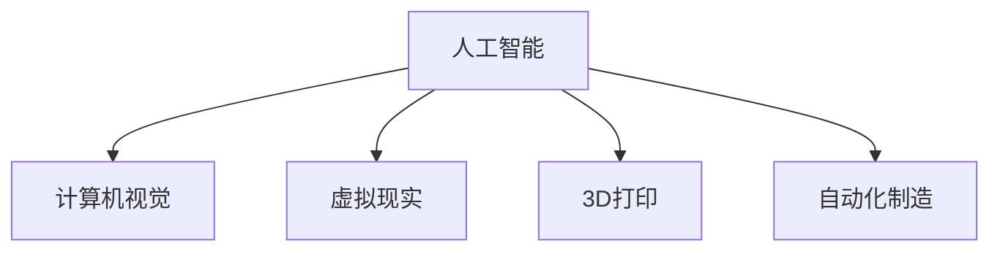

                 

# AI在虚拟时装设计中的应用：减少实体样品

在当今快速变化的时尚界，设计师们面临着巨大的压力：一方面要紧跟潮流，另一方面又要保持创新和个性化。这要求他们不断寻找新的设计和制造方式，以缩短从概念到市场的时间。AI技术的崛起为虚拟时装设计提供了新的可能性，使得设计师能够以前所未有的速度和灵活性工作，同时也为减少实体样品的使用开辟了新的道路。

## 1. 背景介绍

### 1.1 问题由来

传统时装设计过程通常需要大量的实体样品，包括设计、制作、测试和修改。这一过程不仅耗时且成本高昂，而且在物理上制造多个版本会导致资源浪费。随着技术的进步，设计师们开始探索如何利用数字技术来加速设计过程，减少实体样品的使用。

### 1.2 问题核心关键点

AI在虚拟时装设计中的应用主要包括三个方面：

- **设计辅助**：利用AI算法辅助设计师进行面料选择、颜色搭配、图案生成等，加速设计过程。
- **虚拟试穿**：通过计算机视觉和虚拟现实技术，让设计师和客户在虚拟环境中试穿，节省时间和成本。
- **自动化制造**：利用AI和3D打印技术，根据虚拟设计直接生成实体样品，减少制造过程中的浪费。

## 2. 核心概念与联系

### 2.1 核心概念概述

为更好地理解AI在虚拟时装设计中的应用，本节将介绍几个密切相关的核心概念：

- **人工智能(AI)**：通过训练模型从数据中学习并做出预测或决策的技术。
- **计算机视觉**：使计算机能够"看"并理解图像和视频的技术。
- **虚拟现实(VR)**：创建沉浸式数字环境，让用户可以与虚拟世界交互的技术。
- **3D打印**：将数字模型转换为物理对象的技术。
- **自动化制造**：利用机器人和AI技术自动执行制造任务。

这些核心概念之间的逻辑关系可以通过以下Mermaid流程图来展示：



这个流程图展示了几大核心技术之间的联系：

1. **人工智能**为其他技术提供了动力，提供模型训练和决策支持。
2. **计算机视觉**使AI能够处理和分析图像数据。
3. **虚拟现实**创建了沉浸式环境，用于可视化设计和试穿。
4. **3D打印**将数字模型转化为实体物品。
5. **自动化制造**通过机器人技术实现了批量生产。

## 3. 核心算法原理 & 具体操作步骤

### 3.1 算法原理概述

AI在虚拟时装设计中的应用主要基于以下原理：

1. **深度学习**：通过大量的数据训练神经网络，使其能够学习复杂的模式，并做出准确的预测。
2. **生成对抗网络(GANs)**：一种生成模型，可以生成与训练数据类似的虚拟时装图像。
3. **协同过滤**：通过分析用户行为和偏好，推荐相似的设计和款式。
4. **优化算法**：如梯度下降，用于调整模型参数以最小化损失函数。

### 3.2 算法步骤详解

以下是使用AI进行虚拟时装设计的典型步骤：

**Step 1: 数据收集和预处理**
- 收集历史销售数据、时尚趋势、面料信息等，作为训练数据集。
- 对数据进行清洗和归一化处理，确保数据的质量和一致性。

**Step 2: 模型训练**
- 选择合适的深度学习模型，如卷积神经网络(CNN)、生成对抗网络(GANs)等。
- 使用训练数据集训练模型，优化其参数，使其能够生成逼真的虚拟时装图像。
- 使用验证集评估模型性能，调整超参数以提高准确性和泛化能力。

**Step 3: 设计和试穿**
- 利用训练好的模型，生成虚拟时装图像，供设计师和客户试穿。
- 通过计算机视觉技术，自动调整颜色、纹理等设计元素。
- 利用虚拟现实技术，提供沉浸式试穿体验，获取客户反馈。

**Step 4: 自动化制造**
- 将虚拟时装图像转换为3D模型。
- 利用3D打印技术，根据设计要求生成实体样品。
- 利用自动化制造技术，实现大规模批量生产。

### 3.3 算法优缺点

AI在虚拟时装设计中的应用具有以下优点：

1. **效率提升**：AI可以自动化许多重复性任务，显著提高设计速度。
2. **成本降低**：减少实体样品的制造数量，降低生产成本。
3. **个性化设计**：利用AI和VR技术，提供高度个性化的试穿和设计体验。

同时，该方法也存在一些局限性：

1. **数据依赖**：需要大量的高质量数据进行训练，数据获取和处理成本较高。
2. **模型复杂度**：复杂的AI模型需要高计算资源和专业知识，对技术要求较高。
3. **创意受限**：AI生成的设计可能缺乏人类设计师的独特创意和风格。

### 3.4 算法应用领域

AI在虚拟时装设计中的应用已经广泛涉及多个领域，包括：

- **时尚电商**：推荐个性化时装，提高客户满意度。
- **定制时装**：根据客户需求生成定制设计。
- **虚拟时装秀**：展示虚拟时装，吸引全球观众。
- **教育培训**：提供时尚设计课程和设计软件。
- **品牌推广**：通过虚拟时装展示新产品，提升品牌知名度。

## 4. 数学模型和公式 & 详细讲解

### 4.1 数学模型构建

本节将使用数学语言对AI在虚拟时装设计中的应用进行更加严格的刻画。

假设我们有一个设计任务，需要生成一个虚拟时装图像。设计任务可以表示为 $f(x) = y$，其中 $x$ 为输入（如面料、颜色、图案等），$y$ 为输出（即生成的虚拟时装图像）。

我们的目标是最小化损失函数 $\mathcal{L}$，使得模型生成的图像尽可能接近真实图像。

$$
\min_{\theta} \mathcal{L}(f_\theta(x), y)
$$

其中 $f_\theta$ 为模型函数，$\theta$ 为模型参数。

### 4.2 公式推导过程

以生成对抗网络(GANs)为例，推导生成器$D$和判别器$G$的损失函数。

生成器$G$的目标是生成逼真的图像，其损失函数为：

$$
\mathcal{L}_G = -E_{x \sim p_g}[\log D(G(x))]
$$

判别器$D$的目标是区分真实图像和生成图像，其损失函数为：

$$
\mathcal{L}_D = -E_{x \sim p_{data}}[\log D(x)] - E_{x \sim p_g}[\log (1 - D(G(x))]
$$

其中 $p_g$ 为生成器的输出分布，$p_{data}$ 为真实数据的分布。

通过最小化上述损失函数，可以训练生成器和判别器，使得生成的图像逼真度不断提高。

### 4.3 案例分析与讲解

考虑一个简单的例子：利用GANs生成虚拟时装图像。设计任务包括面料、颜色、图案等多个属性。每个属性的选择都是离散的，我们可以使用one-hot编码来表示。例如，面料可以表示为 $[1, 0, 0]$，图案可以表示为 $[0, 1, 0]$。

假设我们有一个包含多种面料、颜色和图案的数据集，用于训练生成器和判别器。通过训练，生成器可以生成逼真的虚拟时装图像，判别器可以准确区分真实图像和生成图像。

训练完成后，设计师可以使用设计工具输入面料、颜色、图案等属性，生成虚拟时装图像，并通过VR技术进行试穿和反馈。

## 5. 项目实践：代码实例和详细解释说明

### 5.1 开发环境搭建

在进行虚拟时装设计项目开发前，我们需要准备好开发环境。以下是使用Python进行PyTorch开发的环境配置流程：

1. 安装Anaconda：从官网下载并安装Anaconda，用于创建独立的Python环境。

2. 创建并激活虚拟环境：
```bash
conda create -n pytorch-env python=3.8 
conda activate pytorch-env
```

3. 安装PyTorch：根据CUDA版本，从官网获取对应的安装命令。例如：
```bash
conda install pytorch torchvision torchaudio cudatoolkit=11.1 -c pytorch -c conda-forge
```

4. 安装必要的库：
```bash
pip install numpy pandas scikit-learn torchvision
```

5. 安装CUDA和CUDNN：
```bash
conda install cupti
conda install -c pytorch cudatoolkit=11.1
```

6. 安装PyTorch GANs库：
```bash
pip install torch-gans
```

7. 安装计算机视觉库：
```bash
pip install opencv-python
```

完成上述步骤后，即可在`pytorch-env`环境中开始项目开发。

### 5.2 源代码详细实现

以下是使用PyTorch GANs进行虚拟时装设计的Python代码实现。

首先，定义模型和损失函数：

```python
import torch
import torch.nn as nn
from torch.autograd import Variable
from torchvision.utils import save_image
from torchvision.transforms import ToTensor

# 定义生成器
class Generator(nn.Module):
    def __init__(self):
        super(Generator, self).__init__()
        self.fc1 = nn.Linear(100, 256)
        self.fc2 = nn.Linear(256, 512)
        self.fc3 = nn.Linear(512, 2048)
        self.conv1 = nn.ConvTranspose2d(2048, 1024, 4, 1, 0, bias=False)
        self.conv2 = nn.ConvTranspose2d(1024, 512, 4, 2, 1, bias=False)
        self.conv3 = nn.ConvTranspose2d(512, 256, 4, 2, 1, bias=False)
        self.conv4 = nn.ConvTranspose2d(256, 3, 4, 2, 1, bias=False)
    
    def forward(self, x):
        x = x.view(-1, 100)
        x = F.relu(self.fc1(x))
        x = F.relu(self.fc2(x))
        x = F.relu(self.fc3(x))
        x = torch.reshape(x, (-1, 2048, 1, 1))
        x = F.relu(self.conv1(x))
        x = F.relu(self.conv2(x))
        x = F.relu(self.conv3(x))
        x = torch.sigmoid(self.conv4(x))
        return x
    
# 定义判别器
class Discriminator(nn.Module):
    def __init__(self):
        super(Discriminator, self).__init__()
        self.conv1 = nn.Conv2d(3, 64, 4, 2, 1, bias=False)
        self.conv2 = nn.Conv2d(64, 128, 4, 2, 1, bias=False)
        self.conv3 = nn.Conv2d(128, 256, 4, 2, 1, bias=False)
        self.fc1 = nn.Linear(256*8*8, 1)
    
    def forward(self, x):
        x = F.leaky_relu(self.conv1(x), 0.2)
        x = F.leaky_relu(self.conv2(x), 0.2)
        x = F.leaky_relu(self.conv3(x), 0.2)
        x = x.view(-1, 256*8*8)
        x = self.fc1(x)
        return x
    
# 定义损失函数
def GAN_loss(D, G, D_real, G_fake):
    real_loss = -D(D_real)
    fake_loss = -D(G_fake)
    generator_loss = G_fake.mean() - 0.5 * real_loss.mean()
    discriminator_loss = -(D(G_fake).mean() + D_real.mean())
    return generator_loss, discriminator_loss

# 定义超参数
EPOCHS = 100
BATCH_SIZE = 128
LR_G = 0.0002
LR_D = 0.0002
```

接下来，加载数据集和定义生成器和判别器：

```python
# 加载数据集
from torchvision.datasets import FashionMNIST

train_data = FashionMNIST(root='data', train=True, transform=ToTensor(), download=True)
train_loader = torch.utils.data.DataLoader(train_data, batch_size=BATCH_SIZE, shuffle=True)

# 初始化生成器和判别器
G = Generator()
D = Discriminator()

# 定义优化器
optimizer_G = torch.optim.Adam(G.parameters(), lr=LR_G)
optimizer_D = torch.optim.Adam(D.parameters(), lr=LR_D)

# 定义模型到GPU
G = G.to(device)
D = D.to(device)

# 定义损失函数到GPU
criterion = nn.BCELoss()

# 定义噪声变量
z = torch.randn(BATCH_SIZE, 100).to(device)
```

然后，定义训练过程：

```python
# 定义训练函数
def train_GAN(iterations):
    for epoch in range(iterations):
        for i, (real, _) in enumerate(train_loader):
            real = real.to(device)
            # 生成器训练
            optimizer_G.zero_grad()
            fake = G(z)
            fake_loss = criterion(D(fake), Variable(torch.ones_like(D(fake), requires_grad=False)))
            generator_loss = -fake_loss.mean()
            generator_loss.backward()
            optimizer_G.step()
            # 判别器训练
            optimizer_D.zero_grad()
            real_loss = criterion(D(real), Variable(torch.ones_like(D(real), requires_grad=False)))
            fake_loss = criterion(D(fake), Variable(torch.zeros_like(D(fake), requires_grad=False)))
            discriminator_loss = -(real_loss + fake_loss).mean()
            discriminator_loss.backward()
            optimizer_D.step()
            # 打印训练信息
            if i % 100 == 0:
                print(f'Epoch [{epoch+1}/{EPOCHS}], Step [{i+1}/{len(train_loader)}], DLoss: {discriminator_loss:.4f}, GLoss: {generator_loss:.4f}')
```

最后，训练模型并生成虚拟时装图像：

```python
# 训练模型
train_GAN(1000)

# 生成虚拟时装图像
G.eval()
fake = G(z)
save_image(fake.data, 'fake_image.png')
```

以上就是使用PyTorch GANs进行虚拟时装设计的完整代码实现。可以看到，利用GANs，我们可以生成逼真的虚拟时装图像，为设计师提供创意灵感和试穿体验。

### 5.3 代码解读与分析

让我们再详细解读一下关键代码的实现细节：

**GAN_loss函数**：
- 定义了生成器和判别器的损失函数，包括真实图像和生成图像的分类损失。

**训练函数train_GAN**：
- 在每个epoch内，对真实图像和生成图像进行多次迭代训练。
- 首先更新生成器，使其生成的图像逼真度不断提高。
- 然后更新判别器，使其能够准确区分真实图像和生成图像。
- 打印每个步骤的损失值，帮助调试和优化训练过程。

**模型加载和优化器定义**：
- 使用FashionMNIST数据集进行训练，加载后处理为Tensor数据。
- 初始化生成器和判别器，定义优化器和学习率。
- 将模型和损失函数移至GPU，加速计算过程。

通过以上代码，我们可以看到PyTorch GANs在虚拟时装设计中的应用是相对简单的。然而，实际项目中还需要考虑更多因素，如数据增强、对抗样本、超参数调优等，以提高模型的稳定性和性能。

## 6. 实际应用场景

### 6.1 智能服装定制

基于AI的虚拟时装设计可以广泛应用于智能服装定制领域。传统的服装定制通常需要客户提供详尽的尺寸和设计要求，成本和时间都较高。利用AI进行虚拟设计和试穿，可以大大简化定制流程，提高客户体验。

例如，设计师可以根据客户的需求，快速生成虚拟时装图像，客户通过VR技术进行试穿，查看服装在不同角度下的效果。如果客户满意，可以进一步定制实际服装，显著缩短从设计到生产的时间。

### 6.2 时尚电商

在时尚电商平台上，AI可以帮助用户快速找到适合自己的时尚单品。利用计算机视觉技术，分析用户的试穿数据和购买记录，为用户推荐个性化的时尚搭配。同时，AI生成的虚拟时装图像可以在电商平台上展示，吸引更多的用户点击和购买。

例如，电商平台可以利用AI技术，自动生成各种风格的虚拟时装，供用户试穿和选择。用户可以选择不同的面料、颜色、图案等属性，生成多种搭配方案，通过VR技术进行沉浸式试穿，找到最适合自己的款式。

### 6.3 虚拟时装秀

AI生成的虚拟时装图像可以用于虚拟时装秀，展示最新的时尚趋势和设计。传统时装秀需要耗费大量时间和成本，而虚拟时装秀可以提供全球观众即时观看的体验，节省时间和成本。

例如，设计师可以使用AI技术，生成逼真的虚拟时装图像，创建虚拟时装秀。观众可以通过VR技术进入虚拟秀场，欣赏最新的时装设计和搭配方案。虚拟时装秀可以实时更新，展示最新的时尚潮流，吸引全球观众的关注。

### 6.4 未来应用展望

随着AI技术的不断进步，虚拟时装设计将进一步拓展其应用场景，带来更多创新和可能性。以下是一些未来的发展趋势：

1. **增强现实(AR)试穿**：结合AR技术，用户可以在真实环境中试穿虚拟时装，获得更加逼真的试穿体验。
2. **AI驱动的时尚趋势预测**：利用机器学习和大数据技术，AI可以预测未来的时尚趋势，帮助设计师和时尚品牌制定更有竞争力的策略。
3. **个性化定制服务**：基于用户的个性化需求和历史数据，AI可以生成高度定制化的时尚单品，提升用户的满意度和忠诚度。
4. **环保时尚设计**：利用AI技术，设计师可以优化材料和生产工艺，实现绿色设计和环保生产。
5. **跨界合作**：时尚品牌可以与科技公司合作，共同开发基于AI的时装设计工具，推动时尚与科技的深度融合。

## 7. 工具和资源推荐

### 7.1 学习资源推荐

为了帮助开发者系统掌握AI在虚拟时装设计中的应用，这里推荐一些优质的学习资源：

1. 《深度学习与计算机视觉》书籍：全面介绍了深度学习、计算机视觉和虚拟现实技术，适合初学者和进阶者阅读。
2. 《Python计算机视觉实战》书籍：详细介绍了Python在计算机视觉和虚拟现实中的应用，包含大量实战代码和案例。
3. Coursera《深度学习》课程：由斯坦福大学开设的深度学习课程，系统讲解了深度学习的基本原理和应用。
4. Kaggle竞赛：参加Kaggle上的计算机视觉和虚拟现实竞赛，通过实战提升技能。
5. PyTorch官方文档：PyTorch的官方文档，提供了丰富的API和教程，适合学习和开发。

通过对这些资源的学习实践，相信你一定能够快速掌握AI在虚拟时装设计中的应用，并用于解决实际的时尚设计问题。

### 7.2 开发工具推荐

高效的开发离不开优秀的工具支持。以下是几款用于AI在虚拟时装设计中开发的常用工具：

1. PyTorch：基于Python的开源深度学习框架，灵活动态的计算图，适合快速迭代研究。大部分预训练语言模型都有PyTorch版本的实现。
2. TensorFlow：由Google主导开发的开源深度学习框架，生产部署方便，适合大规模工程应用。同样有丰富的预训练语言模型资源。
3. PyTorch GANs：HuggingFace开发的生成对抗网络库，提供了简单易用的API，适合快速开发。
4. Blender：开源的3D建模软件，支持虚拟现实和AR技术，适合创建虚拟时装秀和试穿场景。
5. Unity：流行的游戏引擎，支持3D建模和实时渲染，适合开发虚拟时装秀和试穿应用。
6. Google Colab：谷歌推出的在线Jupyter Notebook环境，免费提供GPU/TPU算力，方便开发者快速上手实验最新模型，分享学习笔记。

合理利用这些工具，可以显著提升AI在虚拟时装设计中的开发效率，加快创新迭代的步伐。

### 7.3 相关论文推荐

AI在虚拟时装设计中的应用源于学界的持续研究。以下是几篇奠基性的相关论文，推荐阅读：

1. Generative Adversarial Networks (GANs)：提出生成对抗网络，奠定了AI生成图像的基础。
2. Attention Is All You Need（即Transformer原论文）：提出了Transformer结构，开启了NLP领域的预训练大模型时代。
3. Fashion Design Automation：总结了时尚设计自动化技术的现状和未来发展方向。
4. Virtual Fashion Design and Customization：探讨了虚拟时装设计和定制化的最新研究进展。
5. Virtual Try-on Systems for Fashion Retail：介绍了虚拟试穿系统的实现方法和应用场景。

这些论文代表了大语言模型微调技术的发展脉络。通过学习这些前沿成果，可以帮助研究者把握学科前进方向，激发更多的创新灵感。

## 8. 总结：未来发展趋势与挑战

### 8.1 总结

本文对AI在虚拟时装设计中的应用进行了全面系统的介绍。首先阐述了AI技术在虚拟时装设计中的应用背景和意义，明确了虚拟时装设计的潜力。其次，从原理到实践，详细讲解了AI在虚拟时装设计中的数学模型和操作步骤，给出了完整的代码实现。同时，本文还广泛探讨了AI在虚拟时装设计中的应用场景，展示了其广泛的应用前景。此外，本文精选了AI在虚拟时装设计中的学习资源和开发工具，力求为开发者提供全方位的技术指引。

通过本文的系统梳理，可以看到，AI在虚拟时装设计中的应用已经逐步成为时尚行业的重要趋势。这些技术的广泛应用，将为时尚设计带来新的创意和模式，推动时尚行业的数字化转型。未来，伴随AI技术的不断进步，虚拟时装设计必将在更多领域得到应用，为时尚行业的可持续发展提供新的动力。

### 8.2 未来发展趋势

展望未来，AI在虚拟时装设计中的应用将呈现以下几个发展趋势：

1. **更高的真实感**：随着AI技术的进步，生成的虚拟时装图像将更加逼真，能够更好地模拟真实材料和设计效果。
2. **更强的定制能力**：利用AI技术，可以生成高度个性化的虚拟时装，满足用户的独特需求。
3. **更广泛的行业应用**：AI在虚拟时装设计中的应用将逐步拓展到其他行业，如汽车、家居等领域，带来新的设计变革。
4. **更高的自动化水平**：AI技术将进一步自动化设计、试穿和生产过程，提升整体效率和质量。
5. **更好的用户体验**：结合AR、VR技术，用户将获得更加沉浸式的试穿体验，提升购物满意度。
6. **更可持续的设计方式**：利用AI技术，可以实现绿色设计和环保生产，推动时尚行业的可持续发展。

### 8.3 面临的挑战

尽管AI在虚拟时装设计中的应用已经取得了显著进展，但在迈向更加智能化、普适化应用的过程中，仍面临诸多挑战：

1. **数据质量问题**：生成的虚拟时装图像需要高质量的数据进行训练，数据的获取和处理成本较高。
2. **模型复杂度**：AI生成图像的模型需要高计算资源和专业知识，对技术要求较高。
3. **用户体验差异**：虚拟时装试穿和真实服装的体验存在差异，可能影响用户的购物决策。
4. **伦理和安全问题**：AI生成的虚拟时装图像可能存在版权和隐私问题，需要严格监管。
5. **跨平台兼容性**：不同的平台和设备对虚拟时装图像的支持程度不一，需要开发者进行适配。
6. **持续优化**：AI在虚拟时装设计中的应用是一个动态过程，需要不断优化和更新模型，以适应新的技术和市场变化。

### 8.4 研究展望

面对AI在虚拟时装设计中面临的挑战，未来的研究需要在以下几个方面寻求新的突破：

1. **提升数据质量**：开发高质量的数据生成和增强方法，降低数据获取和处理成本。
2. **优化模型结构**：研究和开发更简单、更高效、更可解释的AI模型，降低技术门槛。
3. **改善用户体验**：结合AR和VR技术，提升虚拟时装试穿的真实感和沉浸感。
4. **保障伦理安全**：制定严格的版权和隐私保护政策，确保AI生成图像的合规性。
5. **提高跨平台兼容性**：开发兼容不同平台和设备的虚拟时装应用，提升用户使用体验。
6. **持续创新**：推动AI技术在时尚行业的广泛应用，不断提升设计效率和效果。

这些研究方向的探索，必将引领AI在虚拟时装设计中的应用进入新的发展阶段，为时尚行业的数字化转型提供新的动力。面向未来，AI在虚拟时装设计中的应用将不断拓展其应用边界，为时尚行业的可持续发展带来更多可能性。

## 9. 附录：常见问题与解答

**Q1：虚拟时装设计是否适用于所有时尚品牌？**

A: 虚拟时装设计适用于绝大多数时尚品牌，特别是需要快速反应市场需求的快时尚品牌。但对于传统奢侈品品牌，由于对实物质感的要求较高，虚拟时装设计的效果可能有限。此外，一些高度定制化的时尚品牌，也需要根据具体需求进行调整。

**Q2：如何处理虚拟时装设计的版权问题？**

A: 虚拟时装设计的版权问题是一个复杂的法律问题。一般来说，设计师和时尚品牌需要在使用AI生成的虚拟时装图像时，遵守相关版权法规，确保图像的合法使用。此外，可以采用区块链等技术，对AI生成的图像进行版权登记，保障版权权益。

**Q3：AI生成的虚拟时装图像是否需要高质量的训练数据？**

A: AI生成的虚拟时装图像需要高质量的训练数据，以提高生成图像的真实感和准确性。因此，需要收集和处理大量的高质量时装图像和设计数据，用于训练AI模型。同时，还需要注意数据的隐私保护和版权问题，确保数据使用的合法性。

**Q4：AI在虚拟时装设计中的应用是否需要高昂的计算资源？**

A: AI在虚拟时装设计中的应用确实需要一定的计算资源，尤其是生成逼真的虚拟时装图像。因此，需要配备高性能的GPU/TPU等设备，以支持复杂的深度学习模型训练和推理。此外，还可以通过模型压缩和优化等技术，减少计算资源消耗。

**Q5：虚拟时装设计的市场潜力如何？**

A: 虚拟时装设计的市场潜力巨大，尤其是在时尚电商和智能服装定制领域。虚拟时装设计可以大大缩短从设计到生产的时间，降低成本，提高客户体验。同时，虚拟时装秀和虚拟试穿等应用，也为时尚品牌带来了新的展示渠道。预计未来几年，虚拟时装设计将逐步成为时尚行业的重要趋势，带来新的商业机会。

通过本文的系统梳理，可以看到，AI在虚拟时装设计中的应用已经逐步成为时尚行业的重要趋势。这些技术的广泛应用，将为时尚设计带来新的创意和模式，推动时尚行业的数字化转型。未来，伴随AI技术的不断进步，虚拟时装设计必将在更多领域得到应用，为时尚行业的可持续发展提供新的动力。总之，虚拟时装设计是一个充满潜力和机遇的领域，值得我们深入探索和研究。

