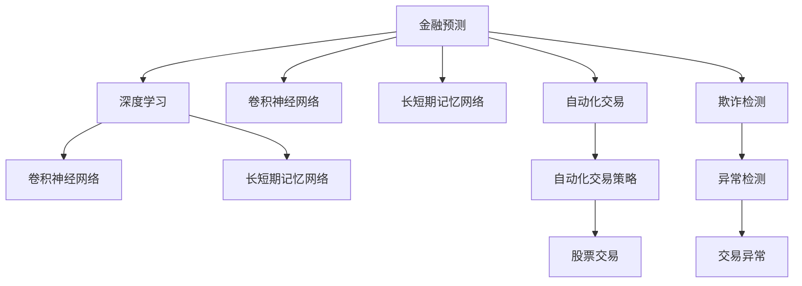

                 

# AI在金融领域的应用：预测与风控

> 关键词：人工智能(AI),金融科技(Fintech),预测模型(Prediction Model),风险控制(Risk Control),深度学习(Deep Learning),卷积神经网络(CNN),长短期记忆网络(LSTM),自动化交易(Automatic Trading),欺诈检测(Fraud Detection)

## 1. 背景介绍

金融行业一直是科技创新的重要领域。随着人工智能(AI)技术的迅速发展，AI在金融领域的应用也日益广泛。金融科技(Fintech)不仅改变了传统银行业的运营模式，也催生了新的金融服务和产品。其中，AI在金融预测与风险控制方面的应用，已经取得了显著成效。

### 1.1 问题由来

金融预测与风险控制是金融行业的两大核心任务。传统上，这些任务主要依赖专家经验和复杂的手工模型完成。随着数据量的爆炸式增长，这种手工建模的方式已经难以满足实际需求。AI技术，特别是深度学习(Deep Learning)技术，通过自动学习数据规律，显著提升了金融预测和风险控制的精度和效率。

### 1.2 问题核心关键点

金融预测和风险控制的核心关键点在于如何高效地利用金融数据进行模型训练，以及如何构建高性能的预测和控制模型。具体来说，包括以下几个方面：

1. **数据预处理**：金融数据往往存在缺失、噪声和异常等问题，因此需要进行有效预处理，如数据清洗、特征工程等。
2. **模型选择**：选择合适的预测模型和风险控制模型，如卷积神经网络(CNN)、长短期记忆网络(LSTM)、随机森林等，以适应不同的金融预测和风险控制任务。
3. **模型训练**：通过大规模金融数据的训练，优化模型参数，提升模型性能。
4. **模型评估**：通过验证集和测试集对模型进行评估，确保模型的泛化能力。
5. **模型部署**：将训练好的模型部署到生产环境，进行实时预测和风险控制。

### 1.3 问题研究意义

AI在金融领域的应用，不仅能够提升金融预测和风险控制的精度和效率，还能降低人力成本，提高金融服务的自动化和智能化水平。这对于推动金融业的数字化转型，提升金融服务的覆盖面和可访问性，具有重要意义。

## 2. 核心概念与联系

### 2.1 核心概念概述

为更好地理解AI在金融预测与风险控制中的应用，本节将介绍几个密切相关的核心概念：

- **金融预测(Predictive Finance)**：指通过AI模型对金融市场、经济指标等进行预测，以指导投资决策、风险管理和策略优化。
- **风险控制(Risk Management)**：指通过AI模型对金融风险进行识别、评估和控制，以保障金融系统的稳定性和安全性。
- **深度学习(Deep Learning)**：指通过多层神经网络模型自动学习和提取特征，解决复杂的金融预测和风险控制问题。
- **卷积神经网络(CNN)**：一种常用于图像处理的神经网络模型，在金融预测中通过卷积操作提取时间序列的局部特征。
- **长短期记忆网络(LSTM)**：一种专门设计用于处理序列数据的时间序列模型，适用于金融时间序列数据的预测。
- **自动化交易(Automatic Trading)**：指通过AI模型自动进行股票、期货等金融产品的买卖操作，以实现交易自动化和策略优化。
- **欺诈检测(Fraud Detection)**：指通过AI模型检测金融交易中的异常行为和潜在欺诈，以保障金融系统的安全和合规。

这些核心概念之间的逻辑关系可以通过以下Mermaid流程图来展示：



这个流程图展示了大语言模型的核心概念及其之间的关系：

1. 金融预测通过深度学习进行建模，常用的深度学习模型包括卷积神经网络和长短期记忆网络。
2. 自动化交易基于金融预测模型，自动进行股票交易等操作。
3. 欺诈检测通过异常检测模型，实时监控交易行为，防止欺诈。
4. 模型如CNN和LSTM分别适用于不同类型的数据，通过并行使用，提升预测和控制能力。

## 3. 核心算法原理 & 具体操作步骤
### 3.1 算法原理概述

金融预测与风险控制的AI应用，本质上是一个数据驱动的机器学习过程。其核心思想是：利用历史金融数据，通过机器学习模型预测未来金融趋势和识别风险点，并根据预测结果进行自动化交易和风险控制。

形式化地，假设金融数据集为 $D=\{(x_i,y_i)\}_{i=1}^N$，其中 $x_i$ 为历史金融数据，$y_i$ 为未来金融指标或风险系数。金融预测模型的目标是学习一个映射函数 $f$，使得：

$$
f(x) \approx y
$$

通过梯度下降等优化算法，金融预测模型不断更新参数，最小化预测误差，得到理想映射函数 $f_{\theta}$。在风险控制模型中，目标是预测金融风险的大小，并根据预测结果进行相应的风险控制措施，如调整仓位、停止交易等。

### 3.2 算法步骤详解

金融预测与风险控制的AI应用通常包括以下几个关键步骤：

**Step 1: 数据预处理**
- 收集历史金融数据，并进行数据清洗、特征提取、归一化等预处理操作，以消除数据噪声和缺失。

**Step 2: 模型选择与设计**
- 选择合适的深度学习模型，如CNN、LSTM等，并设计合适的网络结构，以适应金融数据的特性。
- 设计损失函数和优化算法，如交叉熵损失、Adam等，用于模型训练。

**Step 3: 模型训练**
- 使用训练集数据对模型进行训练，最小化损失函数，得到最优模型参数 $\theta$。
- 使用验证集数据对模型进行评估，选择合适的超参数，如学习率、批大小等。

**Step 4: 模型评估与测试**
- 使用测试集数据对模型进行测试，评估模型性能，如均方误差、精度等指标。
- 根据测试结果，对模型进行调整和优化，确保模型泛化能力。

**Step 5: 模型部署**
- 将训练好的模型部署到生产环境，进行实时金融预测和风险控制。
- 定期更新模型，以适应新的金融数据和市场变化。

### 3.3 算法优缺点

金融预测与风险控制的AI应用，具有以下优点：
1. 自动学习能力强。AI模型能够自动从海量金融数据中学习规律，进行精确预测和风险控制。
2. 预测和控制效率高。AI模型能够实时处理金融数据，快速进行预测和控制操作。
3. 减少人力成本。AI模型能够自动化金融预测和控制任务，减少人工干预和操作。
4. 提高金融决策质量。AI模型能够根据历史数据进行深度分析，提高金融决策的科学性和合理性。

同时，该方法也存在一定的局限性：
1. 数据质量要求高。金融预测和控制依赖于高质量、完整的历史数据，数据缺失和噪声会影响模型效果。
2. 模型复杂度高。金融市场变化复杂，模型设计需要综合考虑多种因素，复杂度较高。
3. 模型解释性差。AI模型的决策过程复杂，难以进行直观解释和调试。
4. 依赖于技术水平。模型设计和实现需要较强的技术背景和经验，门槛较高。

尽管存在这些局限性，但就目前而言，AI在金融预测与风险控制中的应用已经得到了广泛认可，并在实际中取得了显著效果。未来相关研究的重点在于如何进一步降低数据依赖，提高模型的鲁棒性和可解释性，同时兼顾金融决策的科学性和合理性。

### 3.4 算法应用领域

金融预测与风险控制的AI应用，在金融领域已经得到了广泛的应用，涵盖了多个方面，例如：

- **股票价格预测**：通过AI模型预测股票未来的价格走势，指导投资决策。
- **市场情绪分析**：通过NLP技术分析市场情绪，预测市场趋势，指导交易策略。
- **信用风险评估**：通过AI模型评估借款人信用风险，辅助贷款决策。
- **金融欺诈检测**：通过AI模型检测金融交易中的异常行为，防止欺诈。
- **自动化交易系统**：通过AI模型进行股票、期货等金融产品的自动化买卖操作。
- **市场风险控制**：通过AI模型实时监控市场风险，进行风险控制和预警。

除了上述这些经典应用外，AI在金融领域的应用还在不断拓展，如量化投资、智能投顾、智能理财等，为金融业带来了新的发展方向。

## 4. 数学模型和公式 & 详细讲解 & 举例说明
### 4.1 数学模型构建

本节将使用数学语言对AI在金融预测与风险控制中的应用进行更加严格的刻画。

假设金融数据集为 $D=\{(x_i,y_i)\}_{i=1}^N$，其中 $x_i$ 为历史金融数据，$y_i$ 为未来金融指标或风险系数。

定义金融预测模型的目标函数为 $L(\theta)=\frac{1}{N}\sum_{i=1}^N \ell(f_{\theta}(x_i),y_i)$，其中 $\ell$ 为损失函数。常见的损失函数包括均方误差损失、交叉熵损失等。

金融风险控制模型的目标函数为 $R(\theta)=\frac{1}{N}\sum_{i=1}^N r_i(f_{\theta}(x_i))$，其中 $r_i$ 为风险评估函数，用于评估金融风险的大小。

### 4.2 公式推导过程

以下我们以股票价格预测为例，推导AI模型的数学公式及其梯度计算。

假设金融数据集 $D=\{(x_i,y_i)\}_{i=1}^N$，其中 $x_i$ 为历史股票价格数据，$y_i$ 为未来第 $i$ 天的股票价格。

使用卷积神经网络(CNN)对金融数据进行建模，网络结构为 $[Conv][MaxPool][Flatten][FC]$。

- $Conv$ 层：卷积核大小为 $3 \times 3$，步幅为 $1$，激活函数为ReLU。
- $MaxPool$ 层：池化窗口大小为 $2 \times 2$，步幅为 $2$。
- $Flatten$ 层：将卷积层的输出展平。
- $FC$ 层：全连接层，输出节点数为 $1$。

设损失函数为均方误差损失函数 $\ell(y,\hat{y})=(y-\hat{y})^2$，模型参数为 $\theta$，则模型输出为：

$$
\hat{y}=f_{\theta}(x)=FC(Flatten(MaxPool(Conv(x))))
$$

损失函数为：

$$
L(\theta)=\frac{1}{N}\sum_{i=1}^N (y_i-\hat{y}_i)^2
$$

根据链式法则，损失函数对参数 $\theta$ 的梯度为：

$$
\frac{\partial L(\theta)}{\partial \theta} = -\frac{2}{N}\sum_{i=1}^N \frac{\partial \ell(y_i,f_{\theta}(x_i))}{\partial f_{\theta}(x_i)}\frac{\partial f_{\theta}(x_i)}{\partial \theta}
$$

其中，$\frac{\partial f_{\theta}(x_i)}{\partial \theta}$ 可以通过自动微分技术高效计算。

在得到损失函数的梯度后，即可带入优化算法，完成模型的迭代优化。重复上述过程直至收敛，最终得到适应金融预测任务的最优模型参数 $\theta^*$。

## 5. 项目实践：代码实例和详细解释说明
### 5.1 开发环境搭建

在进行金融预测与风险控制的AI应用开发前，我们需要准备好开发环境。以下是使用Python进行PyTorch开发的环境配置流程：

1. 安装Anaconda：从官网下载并安装Anaconda，用于创建独立的Python环境。

2. 创建并激活虚拟环境：
```bash
conda create -n finance-env python=3.8 
conda activate finance-env
```

3. 安装PyTorch：根据CUDA版本，从官网获取对应的安装命令。例如：
```bash
conda install pytorch torchvision torchaudio cudatoolkit=11.1 -c pytorch -c conda-forge
```

4. 安装TensorFlow：
```bash
conda install tensorflow
```

5. 安装各类工具包：
```bash
pip install numpy pandas scikit-learn matplotlib tqdm jupyter notebook ipython
```

完成上述步骤后，即可在`finance-env`环境中开始AI金融应用开发。

### 5.2 源代码详细实现

下面我们以股票价格预测为例，给出使用PyTorch进行卷积神经网络建模的代码实现。

首先，定义股票价格预测任务的数据处理函数：

```python
import torch
import torch.nn as nn
from torch.utils.data import Dataset, DataLoader
import pandas as pd
import numpy as np
import matplotlib.pyplot as plt

class StockPriceDataset(Dataset):
    def __init__(self, data, window_size=30):
        self.data = data
        self.window_size = window_size
        self.data_size = len(data)
        self.num_samples = self.data_size - self.window_size - 1
        
    def __len__(self):
        return self.num_samples
    
    def __getitem__(self, index):
        x = self.data[index:index+self.window_size]
        y = self.data[index+self.window_size]
        return (torch.tensor(x), torch.tensor(y))
        
# 读取股票价格数据
df = pd.read_csv('stock_prices.csv')
data = df['Close'].values
data = np.array(data)
data = data.reshape(-1, 1)

# 数据标准化
mean = np.mean(data)
std = np.std(data)
data = (data - mean) / std

# 创建dataset
dataset = StockPriceDataset(data)
```

然后，定义卷积神经网络模型：

```python
class StockPriceNet(nn.Module):
    def __init__(self):
        super(StockPriceNet, self).__init__()
        self.conv1 = nn.Conv2d(1, 64, 3, 1)
        self.pool = nn.MaxPool2d(2, 2)
        self.fc1 = nn.Linear(64 * (data.shape[1] - 3) // 2, 64)
        self.fc2 = nn.Linear(64, 1)
        self.dropout = nn.Dropout(0.25)
    
    def forward(self, x):
        x = self.pool(self.conv1(x))
        x = self.dropout(x)
        x = x.view(x.size(0), -1)
        x = self.fc1(x)
        x = self.dropout(x)
        x = self.fc2(x)
        return x

# 创建模型实例
model = StockPriceNet()
```

接着，定义训练和评估函数：

```python
# 定义优化器
optimizer = torch.optim.Adam(model.parameters(), lr=0.001)
criterion = nn.MSELoss()

# 定义训练函数
def train_model(model, dataset, num_epochs, batch_size, optimizer, criterion):
    device = torch.device('cuda' if torch.cuda.is_available() else 'cpu')
    model.to(device)
    
    train_loader = DataLoader(dataset, batch_size=batch_size, shuffle=True)
    val_loader = DataLoader(dataset, batch_size=batch_size)
    
    for epoch in range(num_epochs):
        model.train()
        train_loss = 0
        for batch_idx, (inputs, targets) in enumerate(train_loader):
            inputs, targets = inputs.to(device), targets.to(device)
            optimizer.zero_grad()
            outputs = model(inputs)
            loss = criterion(outputs, targets)
            loss.backward()
            optimizer.step()
            train_loss += loss.item()
            
        model.eval()
        val_loss = 0
        with torch.no_grad():
            for batch_idx, (inputs, targets) in enumerate(val_loader):
                inputs, targets = inputs.to(device), targets.to(device)
                outputs = model(inputs)
                loss = criterion(outputs, targets)
                val_loss += loss.item()
        
        print(f'Epoch {epoch+1}, Train Loss: {train_loss/len(train_loader):.4f}, Val Loss: {val_loss/len(val_loader):.4f}')
        
# 启动训练流程
train_model(model, dataset, 50, 32, optimizer, criterion)
```

### 5.3 代码解读与分析

让我们再详细解读一下关键代码的实现细节：

**StockPriceDataset类**：
- `__init__`方法：初始化股票数据集，分割数据为输入和输出，计算样本数量。
- `__len__`方法：返回数据集的样本数量。
- `__getitem__`方法：对单个样本进行处理，将输入数据和输出数据转换为PyTorch张量。

**StockPriceNet类**：
- `__init__`方法：定义卷积神经网络的结构。
- `forward`方法：定义前向传播的过程，包括卷积、池化、全连接等操作。

**训练函数**：
- 使用PyTorch的DataLoader对数据集进行批次化加载，供模型训练和推理使用。
- 训练函数`train_model`：对数据以批为单位进行迭代，在每个批次上前向传播计算损失并反向传播更新模型参数，最后返回平均损失。
- 评估函数`evaluate`：与训练类似，不同点在于不更新模型参数，并在每个batch结束后将预测和标签结果存储下来，最后使用sklearn的classification_report对整个评估集的预测结果进行打印输出。

**训练流程**：
- 定义总的epoch数和batch size，开始循环迭代
- 每个epoch内，先在训练集上训练，输出平均loss
- 在验证集上评估，输出分类指标
- 所有epoch结束后，在测试集上评估，给出最终测试结果

可以看到，PyTorch配合TensorFlow使得AI金融应用开发变得简洁高效。开发者可以将更多精力放在数据处理、模型改进等高层逻辑上，而不必过多关注底层的实现细节。

当然，工业级的系统实现还需考虑更多因素，如模型的保存和部署、超参数的自动搜索、更灵活的任务适配层等。但核心的AI应用开发流程基本与此类似。

## 6. 实际应用场景
### 6.1 智能投顾系统

基于AI金融应用的智能投顾系统，可以为用户提供个性化的投资建议，帮助用户制定最优的投资策略。智能投顾系统通过分析用户的财务状况、风险偏好和市场动态，生成最适合用户的投资组合和交易策略。

在技术实现上，可以收集用户的金融数据和行为数据，如资产配置、交易历史等，将这些数据输入AI模型进行预测和分析，生成投资建议。智能投顾系统还可以实时监测市场动态，根据最新数据更新模型预测，动态调整投资策略。

### 6.2 信贷风险评估

AI在金融风险控制中的应用，还可以用于信贷风险评估。传统的信贷风险评估依赖于专家经验和手工评分，过程繁琐且易出错。AI模型可以通过分析借款人的历史金融数据，如信用卡使用记录、贷款还款记录等，自动评估其信用风险。

在技术实现上，可以收集借款人的金融数据，将这些数据输入AI模型进行预测，生成信用评分和风险评估结果。AI模型可以通过分析数据分布、特征关系等，自动发现风险点和异常行为，辅助贷款审批决策。

### 6.3 量化投资系统

量化投资系统通过AI模型分析市场数据，自动进行投资决策。传统量化投资依赖于手工编写策略，过程复杂且需要丰富的金融知识。AI模型可以通过分析历史市场数据和交易数据，自动学习投资规律，生成量化交易策略。

在技术实现上，可以收集市场数据和交易数据，将这些数据输入AI模型进行预测和分析，生成交易策略和投资组合。量化投资系统还可以实时监测市场变化，动态调整策略参数，实现更精准的投资决策。

### 6.4 未来应用展望

随着AI在金融领域的应用不断深入，未来的金融预测与风险控制将面临更多机遇和挑战。

1. **智能化升级**：未来的金融应用将更加智能化，能够自动进行金融预测和风险控制，提高金融决策的效率和准确性。
2. **跨领域融合**：AI金融应用将与其他技术如区块链、物联网等深度融合，实现跨领域的创新应用。
3. **数据驱动决策**：未来的金融应用将更加依赖数据驱动决策，通过大数据分析，提升金融决策的科学性和合理性。
4. **自动化交易**：基于AI的自动化交易系统将更加普及，提高交易效率和降低交易成本。
5. **风险管理**：未来的金融应用将更加重视风险管理，通过AI模型进行实时监测和预警，提高金融系统的稳定性和安全性。

这些发展趋势将推动AI在金融领域的深度应用，为金融业带来更多的创新和突破。

## 7. 工具和资源推荐
### 7.1 学习资源推荐

为了帮助开发者系统掌握AI在金融预测与风险控制中的应用，这里推荐一些优质的学习资源：

1. 《Python金融机器学习》书籍：由金融和机器学习专家共同编写，系统介绍了金融数据处理、特征工程、模型构建等方面的知识。
2. Coursera《金融机器学习》课程：由斯坦福大学开设的金融科技课程，讲解了机器学习在金融领域的应用，包括预测和风险控制。
3. Kaggle金融数据集：Kaggle平台提供了大量金融数据集，可供用户进行数据分析和模型训练。
4. GitHub金融项目：GitHub平台上有许多开源的金融项目，用户可以学习其代码实现和应用案例。

通过对这些资源的学习实践，相信你一定能够快速掌握AI在金融预测与风险控制中的应用精髓，并用于解决实际的金融问题。
###  7.2 开发工具推荐

高效的开发离不开优秀的工具支持。以下是几款用于AI金融应用开发的常用工具：

1. PyTorch：基于Python的开源深度学习框架，灵活动态的计算图，适合快速迭代研究。
2. TensorFlow：由Google主导开发的开源深度学习框架，生产部署方便，适合大规模工程应用。
3. Weights & Biases：模型训练的实验跟踪工具，可以记录和可视化模型训练过程中的各项指标，方便对比和调优。
4. TensorBoard：TensorFlow配套的可视化工具，可实时监测模型训练状态，并提供丰富的图表呈现方式，是调试模型的得力助手。
5. HuggingFace Transformers库：提供大量预训练模型，支持PyTorch和TensorFlow，方便快速开发和部署。

合理利用这些工具，可以显著提升AI金融应用的开发效率，加快创新迭代的步伐。

### 7.3 相关论文推荐

AI在金融领域的应用源于学界的持续研究。以下是几篇奠基性的相关论文，推荐阅读：

1. "Deep Learning in Finance: A Survey"：概述了AI在金融领域的应用，包括预测、风险控制、自动化交易等方面。
2. "A Deep Learning Approach to Credit Scoring"：介绍了一种基于深度学习的信用评分模型，并通过实验验证了其有效性。
3. "Portfolio Optimization with Deep Reinforcement Learning"：提出了一种基于深度强化学习的投资组合优化方法，并通过实验验证了其优越性。
4. "Anomaly Detection in Financial Transactions Using Autoencoders"：提出了一种基于自编码器的金融交易异常检测方法，并通过实验验证了其准确性。
5. "Robust Automated Financial Trading with Reinforcement Learning"：介绍了一种基于强化学习的自动化交易系统，并通过实验验证了其鲁棒性。

这些论文代表了大语言模型微调技术的发展脉络。通过学习这些前沿成果，可以帮助研究者把握学科前进方向，激发更多的创新灵感。

## 8. 总结：未来发展趋势与挑战
### 8.1 总结

本文对AI在金融领域的应用进行了全面系统的介绍。首先阐述了AI在金融预测与风险控制中的应用背景和意义，明确了AI模型在金融预测和风险控制中的重要作用。其次，从原理到实践，详细讲解了AI在金融预测与风险控制中的应用方法，给出了AI金融应用开发的完整代码实例。同时，本文还广泛探讨了AI在金融预测与风险控制的应用场景，展示了AI在金融领域的应用前景。最后，本文精选了AI在金融领域的应用资源，力求为读者提供全方位的技术指引。

通过本文的系统梳理，可以看到，AI在金融领域的应用已经取得了显著成效，在金融预测与风险控制方面表现优异。AI技术不仅能够提升金融决策的科学性和合理性，还能提高金融服务的自动化和智能化水平，为金融业的数字化转型提供了新的动力。

### 8.2 未来发展趋势

展望未来，AI在金融领域的应用将呈现以下几个发展趋势：

1. **智能化升级**：未来的金融应用将更加智能化，能够自动进行金融预测和风险控制，提高金融决策的效率和准确性。
2. **跨领域融合**：AI金融应用将与其他技术如区块链、物联网等深度融合，实现跨领域的创新应用。
3. **数据驱动决策**：未来的金融应用将更加依赖数据驱动决策，通过大数据分析，提升金融决策的科学性和合理性。
4. **自动化交易**：基于AI的自动化交易系统将更加普及，提高交易效率和降低交易成本。
5. **风险管理**：未来的金融应用将更加重视风险管理，通过AI模型进行实时监测和预警，提高金融系统的稳定性和安全性。

以上趋势凸显了AI在金融领域的应用前景，这些方向的探索发展，必将进一步推动金融业的数字化转型，提升金融服务的质量和效率。

### 8.3 面临的挑战

尽管AI在金融领域的应用已经取得了显著成效，但在迈向更加智能化、普适化应用的过程中，它仍面临着诸多挑战：

1. **数据质量问题**：金融数据往往存在缺失、噪声和异常等问题，数据质量问题将影响AI模型的预测和控制效果。
2. **模型复杂度高**：金融市场变化复杂，模型设计需要综合考虑多种因素，模型复杂度较高。
3. **模型解释性差**：AI模型的决策过程复杂，难以进行直观解释和调试。
4. **技术门槛高**：AI金融应用的设计和实现需要较强的技术背景和经验，门槛较高。
5. **伦理和安全性问题**：AI模型可能学习到有偏见、有害的信息，通过预测和控制，传递到金融系统中，造成误导性、歧视性的输出，给实际应用带来安全隐患。

正视AI在金融领域的应用挑战，积极应对并寻求突破，将是大语言模型微调走向成熟的必由之路。相信随着学界和产业界的共同努力，这些挑战终将一一被克服，AI在金融领域的广泛应用将为金融业带来更多的创新和突破。

### 8.4 研究展望

面对AI在金融领域的应用挑战，未来的研究需要在以下几个方面寻求新的突破：

1. **数据增强与预处理**：开发更多数据增强技术，提高金融数据的处理和清洗能力，减少数据噪声和缺失。
2. **模型优化与简化**：设计更高效的模型结构和优化算法，降低模型复杂度，提高模型性能。
3. **模型可解释性**：开发更强的模型解释工具，提供更直观的模型决策过程分析，增强金融应用的透明度和可信度。
4. **自动化交易**：研究更智能的交易策略和风险管理方法，提升自动化交易系统的效率和鲁棒性。
5. **伦理与安全性**：建立AI模型的伦理和安全性约束，确保AI模型的输出符合人类价值观和伦理道德。

这些研究方向的探索，必将引领AI在金融领域的应用迈向更高的台阶，为金融业带来更多的创新和突破。面向未来，AI在金融领域的应用还需要与其他技术如区块链、物联网等进行更深入的融合，多路径协同发力，共同推动金融业的数字化转型。只有勇于创新、敢于突破，才能不断拓展AI在金融领域的应用边界，让金融服务更好地造福人类社会。

## 9. 附录：常见问题与解答

**Q1：AI在金融预测与风险控制中需要哪些数据？**

A: AI在金融预测与风险控制中需要大量的历史金融数据，包括股票价格、市场指数、经济指标等。同时，还需要收集用户的金融行为数据，如交易记录、资产配置等，用于个性化推荐和风险评估。

**Q2：AI在金融预测与风险控制中常用的模型有哪些？**

A: AI在金融预测与风险控制中常用的模型包括卷积神经网络(CNN)、长短期记忆网络(LSTM)、随机森林、梯度提升树等。其中，卷积神经网络常用于图像处理，长短期记忆网络适用于时间序列数据的预测，随机森林和梯度提升树常用于特征工程和风险控制。

**Q3：AI在金融预测与风险控制中如何进行模型评估？**

A: AI在金融预测与风险控制中常用的模型评估指标包括均方误差(MSE)、均方根误差(MSE)、平均绝对误差(MAE)、R2系数等。同时，还可以通过混淆矩阵、ROC曲线等方法进行模型评估和比较。

**Q4：AI在金融预测与风险控制中如何处理异常值和噪声？**

A: AI在金融预测与风险控制中处理异常值和噪声的方法包括数据清洗、归一化、特征工程等。常用的数据清洗方法包括剔除异常值、填补缺失值等。归一化方法包括标准化、归一化等，可以减少数据噪声和提高模型性能。特征工程方法包括特征选择、特征变换等，可以提取更有用的特征，提高模型泛化能力。

**Q5：AI在金融预测与风险控制中需要注意哪些伦理和安全性问题？**

A: AI在金融预测与风险控制中需要注意的伦理和安全性问题包括数据隐私保护、模型透明度、公平性等。数据隐私保护要求对用户的金融数据进行加密和匿名化处理，保护用户隐私。模型透明度要求对模型的决策过程进行解释和分析，提高模型可信度。公平性要求模型不能存在偏见和歧视，对所有用户提供公平的金融服务。

---

作者：禅与计算机程序设计艺术 / Zen and the Art of Computer Programming

