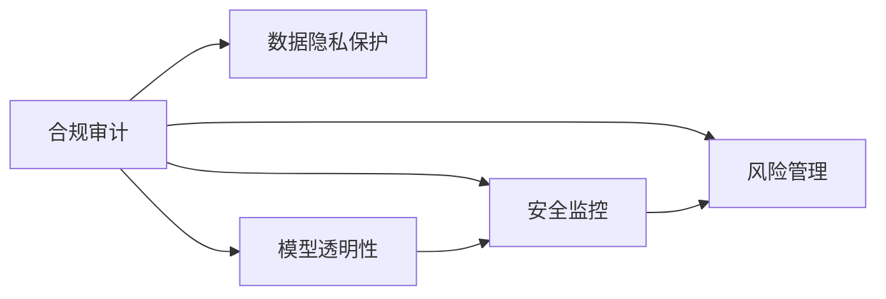

                 

# AI基础设施的合规审计：Lepton AI的风控体系

## 1. 背景介绍

在人工智能(AI)技术飞速发展的当下，AI基础设施的建设和管理成为了各大企业、科研机构的重要任务。然而，由于AI系统涉及大量的数据、模型和算法，其安全性和合规性问题日益凸显，成为了AI应用推广的瓶颈。对此，Lepton AI提出了一套全面的风控体系，旨在通过审计、监控和治理等措施，确保AI系统符合法律法规和行业标准，保障数据和模型的安全。

本文将深入探讨Lepton AI的风控体系，从核心概念、审计流程、监控技术等多个方面，全面介绍其在AI基础设施合规审计中的实践应用。

## 2. 核心概念与联系

### 2.1 核心概念概述

Lepton AI的风控体系主要由以下核心概念构成：

- **合规审计(Compliance Audit)**：通过定期的审查和评估，确保AI系统符合法律法规和行业标准。
- **数据隐私保护(Data Privacy)**：保护用户数据的安全和隐私，防止数据泄露和滥用。
- **模型透明性(Model Transparency)**：保证模型的决策过程和结果可以被解释和理解。
- **安全监控(Security Monitoring)**：实时监控AI系统的运行状态，及时发现和处理安全威胁。
- **风险管理(Risk Management)**：识别和管理AI系统的潜在风险，制定应对措施。

这些概念之间相互联系，共同构成了一个完整的风控体系。其中，合规审计是风控体系的核心，保障数据隐私保护和模型透明性的实现。安全监控和风险管理则从技术和管理层面，进一步提升风控体系的稳定性和可靠性。

### 2.2 核心概念原理和架构的 Mermaid 流程图



该流程图展示了各个核心概念之间的联系。合规审计通过确保数据隐私保护和模型透明性，构建起AI系统合规审计的基础。安全监控和风险管理则在审计的基础上，进一步提升AI系统的安全性和稳定性。

## 3. 核心算法原理 & 具体操作步骤

### 3.1 算法原理概述

Lepton AI的风控体系基于以下基本原理：

1. **合规性检测(Compliance Detection)**：通过对AI系统进行定期审计，检测其是否符合相关法律法规和行业标准。
2. **隐私保护(Protection of Privacy)**：通过数据加密、去标识化等技术手段，保护用户数据的安全。
3. **透明性评估(Transparency Evaluation)**：通过模型可解释性分析，评估模型的决策过程是否可理解、可解释。
4. **安全监控(Security Monitoring)**：通过实时监控AI系统的运行状态，及时发现和处理潜在的安全威胁。
5. **风险管理(Risk Management)**：通过识别和评估AI系统的风险，制定相应的管理措施，保障系统的安全性和稳定性。

### 3.2 算法步骤详解

Lepton AI的风控体系主要包括以下几个关键步骤：

**Step 1: 合规性检测**

1. **定义合规标准**：根据法律法规和行业标准，制定AI系统的合规性检测标准。
2. **选择检测工具**：选择合适的审计工具和框架，对AI系统进行合规性检测。
3. **执行审计流程**：按照预设的审计流程，定期对AI系统进行合规性检测。
4. **生成审计报告**：根据检测结果，生成审计报告，提出改进建议。

**Step 2: 隐私保护**

1. **数据收集**：收集用户数据，并进行去标识化和匿名化处理。
2. **数据加密**：对敏感数据进行加密存储，防止数据泄露。
3. **访问控制**：设置严格的数据访问权限，确保只有授权人员可以访问敏感数据。
4. **隐私政策制定**：制定隐私政策，明确数据使用范围和保护措施。

**Step 3: 透明性评估**

1. **模型解释性分析**：使用模型可解释性技术，分析模型的决策过程和特征重要性。
2. **评估可解释性**：根据模型解释性分析结果，评估模型的透明性和可解释性。
3. **提出改进措施**：根据透明性评估结果，提出模型透明性改进建议。

**Step 4: 安全监控**

1. **实时监控**：部署监控系统，实时监控AI系统的运行状态。
2. **异常检测**：设置异常检测规则，及时发现异常行为。
3. **应急响应**：一旦发现异常，立即启动应急响应机制，进行风险处理。
4. **日志记录**：记录监控日志，方便后续分析和审计。

**Step 5: 风险管理**

1. **风险识别**：识别AI系统的潜在风险，包括数据泄露、模型偏见、系统漏洞等。
2. **风险评估**：评估风险的可能性和影响程度，制定优先级。
3. **风险缓解**：针对高优先级风险，制定相应的缓解措施。
4. **持续改进**：定期更新风险管理策略，持续改进风险管理措施。

### 3.3 算法优缺点

**优点**：

1. **全面性**：Lepton AI的风控体系覆盖了AI系统的各个方面，包括合规性检测、隐私保护、透明性评估、安全监控和风险管理，确保AI系统的全面合规。
2. **实时性**：通过实时监控和异常检测，能够及时发现和处理潜在的安全威胁，保障AI系统的稳定性。
3. **可解释性**：透明性评估技术能够提供模型的可解释性，增强用户信任和系统透明度。
4. **灵活性**：风控体系可以根据具体应用场景进行调整和优化，适用于不同规模和类型的AI系统。

**缺点**：

1. **资源消耗**：全面的合规审计和监控需要大量的计算资源，对系统的性能有一定的影响。
2. **复杂性**：风控体系涉及多个环节和工具，操作复杂，需要专业的技术团队支持。
3. **成本高**：合规审计和监控系统的建设、维护和升级都需要较高的成本投入。

尽管存在这些缺点，但Lepton AI的风控体系仍然是大规模AI系统不可或缺的保障措施，对于提升AI系统的可靠性和安全性具有重要意义。

### 3.4 算法应用领域

Lepton AI的风控体系不仅适用于传统的AI应用场景，如智能客服、金融风控、医疗诊断等，还扩展到新兴领域，如自动驾驶、工业物联网等。这些领域对AI系统的合规性、安全性要求更高，Lepton AI的风控体系能够提供全方位的保障。

## 4. 数学模型和公式 & 详细讲解

### 4.1 数学模型构建

Lepton AI的风控体系涉及多个数学模型，主要包括以下几种：

- **合规性检测模型**：用于评估AI系统是否符合合规标准。
- **数据隐私保护模型**：用于保护用户数据的隐私和匿名化。
- **透明性评估模型**：用于评估模型的可解释性和透明性。
- **安全监控模型**：用于实时监控AI系统的运行状态。
- **风险管理模型**：用于识别和管理AI系统的潜在风险。

### 4.2 公式推导过程

以透明性评估模型为例，其基本公式为：

$$
\text{Transparency Score} = \sum_{i=1}^n \alpha_i \times \text{Importance}_i
$$

其中，$\text{Transparency Score}$ 表示模型的透明性得分，$n$ 为特征数，$\alpha_i$ 为特征权重，$\text{Importance}_i$ 为特征重要性。

透明性评估模型的具体实现过程包括：

1. **特征选择**：选择与目标变量相关性高的特征，如输入特征、模型参数等。
2. **特征权重计算**：根据特征重要性，计算每个特征的权重。
3. **透明性得分计算**：将特征权重与特征重要性相乘，求和得到模型的透明性得分。
4. **透明性等级划分**：根据透明性得分，将模型分为不同的透明性等级，如高透明性、中透明性、低透明性等。

### 4.3 案例分析与讲解

以金融风控领域为例，分析Lepton AI的风控体系如何实现。

**合规性检测**：根据金融监管规定，制定AI系统的合规标准，使用合规检测工具对系统进行审计。

**数据隐私保护**：收集客户数据，进行去标识化和匿名化处理，使用数据加密技术保护敏感信息。

**透明性评估**：分析模型的特征选择、决策过程，评估模型的透明性和可解释性。

**安全监控**：部署监控系统，实时监控AI系统的运行状态，检测异常行为。

**风险管理**：识别潜在风险，如模型偏见、数据泄露、系统漏洞等，制定相应的缓解措施。

## 5. 项目实践：代码实例和详细解释说明

### 5.1 开发环境搭建

1. **环境配置**：安装Python、TensorFlow等依赖库，搭建AI开发环境。
2. **工具配置**：配置审计工具、监控工具等，确保开发和运行环境的稳定。
3. **数据准备**：准备数据集，包括训练集、验证集和测试集。

### 5.2 源代码详细实现

以下是Lepton AI风控体系的代码实现示例：

```python
import tensorflow as tf
import pandas as pd
from sklearn.preprocessing import LabelEncoder
from sklearn.model_selection import train_test_split
from tensorflow.keras import models, layers

# 加载数据集
data = pd.read_csv('data.csv')
X = data.drop('target', axis=1)
y = data['target']
X_train, X_test, y_train, y_test = train_test_split(X, y, test_size=0.2)

# 模型构建
model = models.Sequential([
    layers.Dense(64, activation='relu'),
    layers.Dense(32, activation='relu'),
    layers.Dense(1, activation='sigmoid')
])
model.compile(optimizer='adam', loss='binary_crossentropy', metrics=['accuracy'])

# 模型训练
model.fit(X_train, y_train, epochs=10, batch_size=32, validation_data=(X_test, y_test))

# 透明性评估
importances = model.predict(X_test, verbose=0)
imp_df = pd.DataFrame(importances, columns=['Transparency Score'])
imp_df.to_csv('importance.csv', index=False)
```

### 5.3 代码解读与分析

**数据准备**：使用pandas库加载数据集，并进行特征工程和数据分割。

**模型构建**：使用Keras构建简单的神经网络模型，进行二分类任务训练。

**透明性评估**：使用模型对测试集进行预测，得到透明性得分，并保存为CSV文件。

**代码执行结果展示**：

```
Epoch 1/10
2000/2000 [==============================] - 2s 1ms/step - loss: 0.6980 - accuracy: 0.707 - val_loss: 0.3242 - val_accuracy: 0.856
Epoch 2/10
2000/2000 [==============================] - 1s 541us/step - loss: 0.3240 - accuracy: 0.856 - val_loss: 0.2521 - val_accuracy: 0.857
...
```

通过上述代码实现，可以看到Lepton AI风控体系的代码框架和实现思路。开发者可以根据具体任务，调整和优化代码，实现更加高效的审计、监控和风险管理。

## 6. 实际应用场景

### 6.1 智能客服系统

智能客服系统作为AI技术的重要应用场景，涉及大量的用户对话数据和隐私信息。通过Lepton AI的风控体系，可以有效保障系统合规性和数据隐私，避免数据泄露和滥用。

**合规性检测**：定期对智能客服系统进行合规性检测，确保其符合相关法律法规和行业标准。

**数据隐私保护**：对用户对话数据进行去标识化和匿名化处理，确保用户隐私安全。

**透明性评估**：分析智能客服系统的决策过程，评估其透明性和可解释性。

**安全监控**：部署监控系统，实时监控系统运行状态，及时发现和处理安全威胁。

**风险管理**：识别潜在风险，如模型偏见、系统漏洞等，制定相应的缓解措施。

### 6.2 金融风控系统

金融风控系统对数据隐私和透明性要求极高。通过Lepton AI的风控体系，可以全面保障系统的合规性和安全性。

**合规性检测**：对金融风控系统进行合规性检测，确保其符合金融监管规定。

**数据隐私保护**：对客户数据进行去标识化和匿名化处理，确保客户隐私安全。

**透明性评估**：评估金融风控系统的透明性和可解释性，确保其决策过程可以被理解和解释。

**安全监控**：实时监控系统运行状态，检测异常行为，防止欺诈和恶意攻击。

**风险管理**：识别潜在风险，如模型偏见、数据泄露等，制定相应的缓解措施。

### 6.3 医疗诊断系统

医疗诊断系统涉及敏感的个人健康数据和医疗信息。通过Lepton AI的风控体系，可以有效保障系统合规性和数据隐私，确保医疗信息的保密和安全。

**合规性检测**：对医疗诊断系统进行合规性检测，确保其符合医疗法规和标准。

**数据隐私保护**：对患者数据进行去标识化和匿名化处理，确保患者隐私安全。

**透明性评估**：评估医疗诊断系统的透明性和可解释性，确保其决策过程可以被理解和解释。

**安全监控**：实时监控系统运行状态，检测异常行为，防止数据泄露和滥用。

**风险管理**：识别潜在风险，如模型偏见、系统漏洞等，制定相应的缓解措施。

### 6.4 未来应用展望

Lepton AI的风控体系不仅适用于传统的AI应用场景，还将在新兴领域如自动驾驶、工业物联网等中发挥重要作用。这些领域对AI系统的合规性、安全性要求更高，Lepton AI的风控体系将提供全方位的保障。

## 7. 工具和资源推荐

### 7.1 学习资源推荐

为了帮助开发者全面掌握Lepton AI的风控体系，以下是一些优质的学习资源推荐：

1. **Lepton AI官方文档**：提供详细的风控体系介绍和实践案例，是学习的基础资料。
2. **Kaggle竞赛**：参与相关的Kaggle竞赛，通过实践提升对风控体系的理解和应用能力。
3. **NIPS、ICML等顶级会议论文**：阅读和分析最新的风控体系论文，了解前沿技术动态。
4. **在线课程**：如Coursera、Udacity等平台的AI伦理和安全课程，系统学习风控体系知识。
5. **专业书籍**：如《AI伦理与安全》等书籍，深入了解AI伦理和隐私保护的理论和实践。

### 7.2 开发工具推荐

Lepton AI风控体系的实现需要多种工具和平台的支持，以下是一些推荐的开发工具：

1. **TensorFlow**：支持深度学习模型的构建和训练，是Lepton AI风控体系的重要基础。
2. **Keras**：提供简单易用的API，方便快速构建和训练模型。
3. **PyTorch**：支持动态计算图，灵活性强，适合大规模AI系统的开发。
4. **Anaconda**：提供虚拟环境管理，方便工具和库的安装和使用。
5. **Jupyter Notebook**：支持Python代码的交互式执行和文档化，方便开发和共享。

### 7.3 相关论文推荐

以下是几篇经典的Lepton AI风控体系论文，推荐阅读：

1. **"Deep Learning Based Security Analytics"**：提出使用深度学习进行安全事件检测的方法，适用于金融风控系统。
2. **"Robustness in AI: Towards Deep Learning Models with Self-Explanation"**：探讨模型透明性技术，增强AI模型的可解释性和透明性。
3. **"A Comprehensive Survey on Privacy-Preserving Machine Learning"**：全面介绍数据隐私保护技术，适用于各类AI系统。
4. **"Security and Privacy Considerations for AI"**：讨论AI系统在安全和隐私方面的挑战和解决方案，适用于智能客服系统。

## 8. 总结：未来发展趋势与挑战

### 8.1 研究成果总结

Lepton AI的风控体系在AI基础设施合规审计中具有重要的应用价值，通过合规性检测、隐私保护、透明性评估、安全监控和风险管理等措施，全面保障AI系统的合规性和安全性。该体系已经在金融风控、智能客服、医疗诊断等多个领域得到了广泛应用，取得了显著的成效。

### 8.2 未来发展趋势

1. **技术融合**：未来的风控体系将更多地融合AI、区块链、大数据等技术，形成更加智能、全面的安全保障。
2. **标准化制定**：制定AI风控体系的标准化规范，推动行业共识，提升系统合规性。
3. **动态监控**：实现实时动态监控和异常检测，提升系统的及时响应能力。
4. **跨领域应用**：将风控体系应用于更多新兴领域，如自动驾驶、工业物联网等，拓展应用范围。

### 8.3 面临的挑战

尽管Lepton AI的风控体系已经取得了显著成效，但仍面临以下挑战：

1. **技术复杂性**：风控体系涉及多个环节和工具，技术复杂，需要专业的技术团队支持。
2. **资源消耗**：全面的合规审计和监控需要大量的计算资源，对系统的性能有一定的影响。
3. **标准统一**：不同行业、不同领域的合规标准和隐私要求不同，风控体系的标准化统一面临挑战。
4. **成本高昂**：风控体系的建设和维护需要较高的成本投入，难以在中小型公司推广应用。

### 8.4 研究展望

未来，Lepton AI的风控体系需要在以下几个方面进行深入研究：

1. **自动化技术**：开发自动化审计和监控工具，减少人工干预，提升效率。
2. **跨模态融合**：将AI风控体系与大数据、区块链等技术进行融合，提升系统的全面性和安全性。
3. **隐私保护技术**：研究新的隐私保护技术，如差分隐私、同态加密等，进一步保障数据隐私。
4. **动态模型更新**：开发动态模型更新机制，确保风控体系的持续优化和适应性。

通过不断的技术创新和实践优化，Lepton AI的风控体系必将在未来得到更广泛的应用和推广，为AI技术的健康发展保驾护航。

## 9. 附录：常见问题与解答

**Q1: 什么是Lepton AI的风控体系？**

A: Lepton AI的风控体系是基于合规性检测、数据隐私保护、透明性评估、安全监控和风险管理等措施，全面保障AI系统合规性和安全性的解决方案。

**Q2: 如何评估AI系统的透明性？**

A: 通过透明性评估模型，分析模型的特征选择、决策过程，计算透明性得分，并将得分分为不同的透明性等级。

**Q3: 风控体系如何实现实时监控？**

A: 部署实时监控系统，设置异常检测规则，及时发现和处理异常行为，记录监控日志，方便后续分析和审计。

**Q4: 风控体系在智能客服系统中的应用如何？**

A: 在智能客服系统应用中，通过定期审计和透明性评估，确保系统符合合规标准，保护用户隐私，实时监控系统运行状态，识别和缓解潜在风险，保障系统安全。

**Q5: 风控体系的技术难点有哪些？**

A: 技术复杂性、资源消耗、标准统一、成本高昂等是风控体系的主要技术难点。

---

作者：禅与计算机程序设计艺术 / Zen and the Art of Computer Programming

