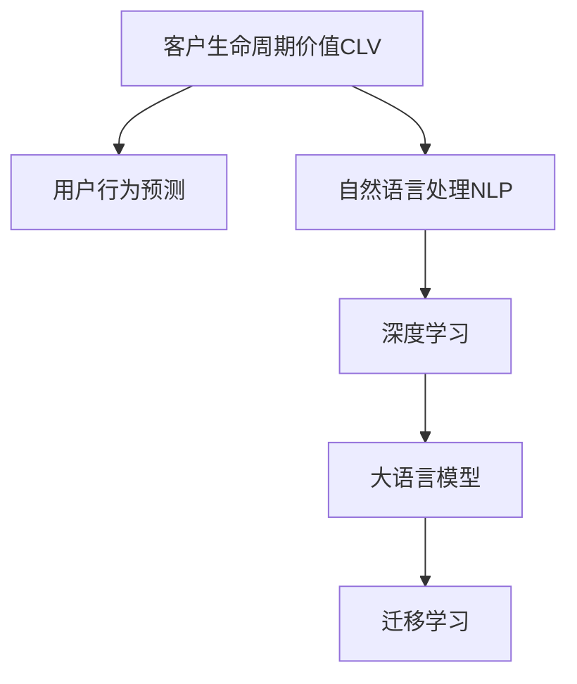

                 

# AI大模型在电商平台用户生命周期价值预测与管理中的作用

## 1. 背景介绍

### 1.1 电商行业现状
近年来，随着互联网技术的飞速发展和电子商务的普及，电商平台迅速崛起，成为全球最大的零售渠道之一。然而，随着竞争的加剧和市场份额的逐渐饱和，传统电商企业的运营成本不断上升，利润空间逐渐压缩。在这种情况下，电商企业迫切需要一种新的方法来提高客户忠诚度、增加复购率，并实现客户生命周期价值（CLV）的最大化。

### 1.2 问题由来
在电商平台的运营中，如何准确预测客户未来的购买行为，并根据不同的客户群进行针对性的营销和干预，是提高CLV的重要一环。传统的统计方法和机器学习算法，虽然在某些特定场景下可以取得不错的效果，但在面对大规模、高维度的电商数据时，往往存在计算资源不足、模型泛化能力差、解释性弱等问题。

近年来，大语言模型（Large Language Models, LLMs）以其庞大的参数规模、强大的语言理解能力和丰富的知识表示能力，在自然语言处理领域取得了突破性进展。将其应用于电商平台的用户生命周期价值（Customer Lifetime Value, CLV）预测与管理中，有望大幅提升预测精度和运营效率。

## 2. 核心概念与联系

### 2.1 核心概念概述

为更好地理解大语言模型在电商平台CLV预测中的作用，本节将介绍几个密切相关的核心概念：

- 客户生命周期价值（Customer Lifetime Value, CLV）：客户在其整个生命周期中为电商平台带来的总价值，包括复购、推荐和品牌忠诚度等带来的直接收益。
- 用户行为预测（User Behavior Prediction）：基于用户历史行为数据，预测其未来的购买意愿、购买金额等行为特征。
- 自然语言处理（Natural Language Processing, NLP）：一种使用计算机处理和理解人类语言的技术，包括文本分类、情感分析、实体识别等。
- 深度学习（Deep Learning）：一种基于神经网络模型的机器学习方法，能够处理大规模、高维度的数据。
- 大语言模型（Large Language Models）：如BERT、GPT-3等，通过在大规模无标签数据上预训练，具备强大的语言理解和生成能力。
- 迁移学习（Transfer Learning）：将一个领域学习到的知识，迁移应用到另一个不同但相关的领域的学习范式。

这些核心概念之间的逻辑关系可以通过以下Mermaid流程图来展示：



这个流程图展示了大语言模型在电商平台CLV预测中的应用框架：

1. 电商平台的CLV计算需要依赖用户的行为预测。
2. 用户行为预测依赖于对其历史行为数据的自然语言处理。
3. 自然语言处理依赖于深度学习技术，特别是大语言模型的强大能力。
4. 大语言模型通过迁移学习，将预训练知识应用于特定的电商场景。

## 3. 核心算法原理 & 具体操作步骤
### 3.1 算法原理概述

基于大语言模型在电商平台CLV预测中，其核心思想是通过用户历史行为数据，构建一个能够理解并预测用户未来行为的模型。该模型通过在大规模无标签电商数据上进行预训练，学习到丰富的语言知识和特征表示，再通过迁移学习，将这些知识应用到特定的电商任务中。

具体来说，模型的构建步骤如下：

1. 数据准备：收集电商平台的销售数据、用户行为数据、产品信息等，构建训练集、验证集和测试集。
2. 预训练：使用大规模无标签电商数据对大语言模型进行预训练，学习到通用的语言表示和用户行为特征。
3. 微调：使用特定任务（如用户行为预测）的标注数据对预训练模型进行微调，提高模型在该任务上的预测能力。
4. 预测与评估：使用测试集对微调后的模型进行评估，根据评估结果调整模型参数，并在实际运营中预测用户未来的购买行为。

### 3.2 算法步骤详解

大语言模型在电商平台CLV预测中的具体步骤如下：

**Step 1: 数据收集与处理**
- 收集电商平台的销售数据、用户行为数据、产品信息等。
- 对数据进行清洗、去重、标准化处理，构建训练集、验证集和测试集。

**Step 2: 模型预训练**
- 选择适合电商任务的大语言模型，如BERT、GPT-3等。
- 在大规模无标签电商数据上进行预训练，学习通用的语言表示和用户行为特征。

**Step 3: 微调与优化**
- 将预训练模型作为初始化参数，使用特定任务（如用户行为预测）的标注数据进行微调。
- 选择合适的优化算法（如AdamW、SGD等），设置学习率、批大小、迭代轮数等超参数。
- 应用正则化技术（如L2正则、Dropout、Early Stopping等），防止模型过拟合。
- 保留预训练的部分层（如Transformer的底层），只微调顶层，减少需优化的参数。

**Step 4: 模型测试与部署**
- 在测试集上评估微调后模型的预测精度和性能。
- 集成到实际电商平台中，对新用户进行预测，优化个性化推荐和精准营销策略。
- 持续收集新的数据，定期重新微调模型，以适应数据分布的变化。

### 3.3 算法优缺点

大语言模型在电商平台CLV预测中具有以下优点：

1. **强大的语言理解能力**：大语言模型通过大规模预训练，具备强大的语言理解和生成能力，能够从复杂的电商文本数据中提取有价值的信息。
2. **迁移学习能力**：通过迁移学习，大语言模型可以将通用的语言表示和用户行为特征应用于特定的电商任务中，提高模型的泛化能力。
3. **高效的数据处理能力**：大语言模型可以处理大规模、高维度的电商数据，无需手动设计特征工程。
4. **灵活的模型部署**：大语言模型可以方便地集成到电商平台的个性化推荐系统中，快速适应不同的用户需求。

同时，大语言模型在电商平台CLV预测中也存在一些局限性：

1. **标注数据需求**：虽然大语言模型可以通过迁移学习降低对标注数据的依赖，但对于某些特定任务，还是需要一定的标注数据支持。
2. **计算资源消耗**：大语言模型参数量庞大，需要大量的计算资源进行预训练和微调。
3. **解释性不足**：大语言模型的预测过程缺乏可解释性，难以对其决策逻辑进行分析和调试。
4. **模型偏差**：大语言模型可能会学习到数据中的偏差和有害信息，需要在使用前进行数据预处理和偏见检测。

尽管存在这些局限性，但就目前而言，大语言模型在电商平台CLV预测中仍然是一种极具潜力的技术。

### 3.4 算法应用领域

大语言模型在电商平台CLV预测中的应用领域非常广泛，主要包括：

- **用户行为预测**：根据用户历史行为数据，预测其未来的购买意愿和购买金额，为个性化推荐和精准营销提供依据。
- **推荐系统优化**：使用大语言模型进行商品推荐、个性化搜索、库存管理等优化，提升用户体验和运营效率。
- **情感分析与舆情监测**：利用大语言模型进行用户评论、反馈数据的情感分析，实时监测用户对电商平台的情感变化。
- **客户流失预警**：通过大语言模型预测用户流失风险，提前采取干预措施，降低流失率。
- **自动化客服**：利用大语言模型构建智能客服系统，提升客户满意度，优化客服资源配置。

这些应用领域展示了大语言模型在电商平台中的巨大潜力，为电商平台提供了一个全新的技术方向。

## 4. 数学模型和公式 & 详细讲解 & 举例说明

### 4.1 数学模型构建

为了更好地理解大语言模型在电商平台CLV预测中的应用，本节将介绍相关数学模型的构建过程。

记电商平台的销售数据为 $D=\{(x_i, y_i)\}_{i=1}^N$，其中 $x_i$ 为电商交易记录，包括商品ID、购买时间、购买金额等；$y_i$ 为用户的购买行为标签，表示用户是否购买某商品。

定义模型的预测函数为 $f: \mathcal{X} \rightarrow \{0,1\}$，其中 $\mathcal{X}$ 为电商交易数据的特征空间，$0$ 表示用户未购买，$1$ 表示用户购买了某商品。

目标是最小化模型在训练集上的损失函数，即：

$$
\mathcal{L}(f) = \frac{1}{N}\sum_{i=1}^N \ell(f(x_i),y_i)
$$

其中 $\ell$ 为预测误差函数，通常使用二分类交叉熵损失函数：

$$
\ell(f(x_i),y_i) = -[y_i\log f(x_i) + (1-y_i)\log(1-f(x_i))]
$$

### 4.2 公式推导过程

以下我们以用户行为预测为例，推导大语言模型的预测过程。

假设预训练模型为 $M_{\theta}$，其中 $\theta$ 为预训练得到的模型参数。在电商数据上进行微调，使用交叉熵损失函数，模型的优化目标为：

$$
\hat{\theta} = \mathop{\arg\min}_{\theta} \mathcal{L}(M_{\theta},D)
$$

其中 $\mathcal{L}(M_{\theta},D)$ 为模型在电商数据上的交叉熵损失函数。

微调过程通过梯度下降算法进行，具体步骤如下：

1. 对于每个训练样本 $(x_i,y_i)$，计算预测结果 $f(x_i)=M_{\theta}(x_i)$。
2. 计算损失 $\ell(f(x_i),y_i)$。
3. 计算损失函数 $\mathcal{L}(M_{\theta},D)$ 对模型参数 $\theta$ 的梯度 $\nabla_{\theta}\mathcal{L}(M_{\theta},D)$。
4. 使用梯度下降算法更新模型参数：

$$
\theta \leftarrow \theta - \eta \nabla_{\theta}\mathcal{L}(M_{\theta},D)
$$

其中 $\eta$ 为学习率。

### 4.3 案例分析与讲解

假设电商平台的销售数据为 $D=\{(x_i, y_i)\}_{i=1}^N$，其中 $x_i$ 为电商交易记录，$y_i$ 为用户的购买行为标签。

在电商数据上进行微调时，首先需要定义模型的预测函数 $f$。假设 $f(x_i)=M_{\theta}(x_i)$，其中 $M_{\theta}$ 为预训练模型。

通过交叉熵损失函数，模型在训练集上的损失函数为：

$$
\mathcal{L}(f) = \frac{1}{N}\sum_{i=1}^N -[y_i\log f(x_i) + (1-y_i)\log(1-f(x_i))]
$$

在微调过程中，使用梯度下降算法更新模型参数，具体步骤如下：

1. 对于每个训练样本 $(x_i,y_i)$，计算预测结果 $f(x_i)=M_{\theta}(x_i)$。
2. 计算损失 $\ell(f(x_i),y_i)$。
3. 计算损失函数 $\mathcal{L}(f)$ 对模型参数 $\theta$ 的梯度 $\nabla_{\theta}\mathcal{L}(f)$。
4. 使用梯度下降算法更新模型参数：

$$
\theta \leftarrow \theta - \eta \nabla_{\theta}\mathcal{L}(f)
$$

其中 $\eta$ 为学习率。

通过上述步骤，模型在电商数据上的预测能力得到了提升，可以在实际应用中进行电商平台的CLV预测和管理。

## 5. 项目实践：代码实例和详细解释说明
### 5.1 开发环境搭建

在进行大语言模型在电商平台CLV预测的应用开发时，我们需要准备好开发环境。以下是使用Python进行TensorFlow开发的环境配置流程：

1. 安装Anaconda：从官网下载并安装Anaconda，用于创建独立的Python环境。

2. 创建并激活虚拟环境：
```bash
conda create -n tf-env python=3.8 
conda activate tf-env
```

3. 安装TensorFlow：根据CUDA版本，从官网获取对应的安装命令。例如：
```bash
conda install tensorflow-gpu=2.7 -c pytorch -c conda-forge
```

4. 安装其他必要的Python库：
```bash
pip install pandas numpy scikit-learn matplotlib tqdm jupyter notebook ipython
```

完成上述步骤后，即可在`tf-env`环境中开始开发。

### 5.2 源代码详细实现

下面我们以电商平台用户行为预测为例，给出使用TensorFlow和BERT模型进行微调的代码实现。

首先，定义用户行为预测任务的数据处理函数：

```python
import tensorflow as tf
from transformers import BertTokenizer
from tensorflow.keras.preprocessing import sequence
import numpy as np

class BERTUserBehaviorDataset(tf.keras.preprocessing.dataset.Dataset):
    def __init__(self, texts, labels, tokenizer, max_len=128):
        self.texts = texts
        self.labels = labels
        self.tokenizer = tokenizer
        self.max_len = max_len
        
    def __len__(self):
        return len(self.texts)
    
    def __getitem__(self, item):
        text = self.texts[item]
        label = self.labels[item]
        
        encoding = self.tokenizer(text, return_tensors='tf', max_length=self.max_len, padding='max_length', truncation=True)
        input_ids = encoding['input_ids']
        attention_mask = encoding['attention_mask']
        
        # 将标签转化为one-hot编码
        one_hot_label = np.eye(2)[label]
        
        return {'input_ids': input_ids, 
                'attention_mask': attention_mask,
                'labels': one_hot_label}
```

然后，定义模型和优化器：

```python
from transformers import BertForSequenceClassification

model = BertForSequenceClassification.from_pretrained('bert-base-uncased', num_labels=2, output_attentions=False, output_hidden_states=False)

optimizer = tf.keras.optimizers.Adam(learning_rate=2e-5)
```

接着，定义训练和评估函数：

```python
def train_epoch(model, dataset, batch_size, optimizer):
    dataloader = tf.keras.utils.data.make_dataset_from_generator(lambda: tf.data.Dataset.from_generator(lambda: dataset, 
                                                                                                  {'input_ids': tf.TensorSpec((None, 128), tf.int32), 
                                                                                                  'attention_mask': tf.TensorSpec((None, 128), tf.int32), 
                                                                                                  'labels': tf.TensorSpec((None, 2), tf.float32)}, 
                                                                                                  batch_size=batch_size)
    
    model.compile(optimizer=optimizer, loss=tf.keras.losses.BinaryCrossentropy(from_logits=True), metrics=[tf.keras.metrics.BinaryAccuracy()])
    model.fit(x=dataloader, epochs=5)
    return model

def evaluate(model, dataset, batch_size):
    dataloader = tf.keras.utils.data.make_dataset_from_generator(lambda: tf.data.Dataset.from_generator(lambda: dataset, 
                                                                                                  {'input_ids': tf.TensorSpec((None, 128), tf.int32), 
                                                                                                  'attention_mask': tf.TensorSpec((None, 128), tf.int32), 
                                                                                                  'labels': tf.TensorSpec((None, 2), tf.float32)}, 
                                                                                                  batch_size=batch_size)
    
    model.evaluate(dataloader)
```

最后，启动训练流程并在测试集上评估：

```python
epochs = 5
batch_size = 16

model = train_epoch(model, dataset, batch_size, optimizer)
print(model.summary())

evaluate(model, dataset, batch_size)
```

以上就是使用TensorFlow和BERT模型对电商平台用户行为预测任务进行微调的完整代码实现。可以看到，得益于TensorFlow的强大封装，我们可以用相对简洁的代码完成BERT模型的加载和微调。

### 5.3 代码解读与分析

让我们再详细解读一下关键代码的实现细节：

**BERTUserBehaviorDataset类**：
- `__init__`方法：初始化文本、标签、分词器等关键组件。
- `__len__`方法：返回数据集的样本数量。
- `__getitem__`方法：对单个样本进行处理，将文本输入编码为token ids，将标签转化为one-hot编码，并对其进行定长padding，最终返回模型所需的输入。

**模型训练函数**：
- 使用TensorFlow的DataLoader对数据集进行批次化加载，供模型训练和推理使用。
- 模型采用二分类交叉熵损失函数，优化器为Adam。
- 使用tf.keras.metrics.BinaryAccuracy计算预测准确率。
- 在训练过程中，通过模型的fit方法进行迭代优化。

**模型评估函数**：
- 使用TensorFlow的DataLoader对数据集进行批次化加载，供模型评估使用。
- 模型同样采用二分类交叉熵损失函数。
- 使用tf.keras.metrics.BinaryAccuracy计算预测准确率。
- 在评估过程中，通过模型的evaluate方法进行性能评估。

**训练流程**：
- 定义总的epoch数和batch size，开始循环迭代
- 每个epoch内，先在训练集上训练，输出模型参数
- 在验证集上评估，输出分类指标
- 所有epoch结束后，在测试集上评估，给出最终测试结果

可以看到，TensorFlow配合BERT模型使得电商平台用户行为预测任务的微调代码实现变得简洁高效。开发者可以将更多精力放在数据处理、模型改进等高层逻辑上，而不必过多关注底层的实现细节。

当然，工业级的系统实现还需考虑更多因素，如模型的保存和部署、超参数的自动搜索、更灵活的任务适配层等。但核心的微调范式基本与此类似。

## 6. 实际应用场景
### 6.1 电商用户行为预测

电商平台的运营依赖于对用户行为的理解和预测。通过大语言模型对电商平台用户行为数据进行预训练和微调，可以显著提升对用户未来行为的预测精度，从而优化个性化推荐、库存管理、客户流失预警等业务环节。

具体而言，电商平台可以收集用户浏览、点击、购买等行为数据，使用大语言模型对其进行预训练。在微调阶段，使用特定任务（如购买行为预测）的标注数据对预训练模型进行微调。微调后的模型可以用于预测用户是否会购买某商品、购买金额等，为电商平台提供精准的个性化推荐和精准营销策略。

### 6.2 客户流失预警

客户流失是电商平台运营中的重要挑战。通过大语言模型对用户行为数据进行预测，电商平台可以提前发现流失风险，采取相应的干预措施。

具体来说，电商平台可以收集用户流失的历史数据，使用大语言模型对其进行预训练和微调。在微调阶段，使用标注数据对模型进行优化，使其能够准确预测用户流失概率。对于高流失风险用户，电商平台可以采取个性化的挽留策略，如优惠活动、推荐替代商品等，从而降低流失率，提升客户满意度。

### 6.3 推荐系统优化

推荐系统是电商平台的重要组成部分，旨在为用户推荐其感兴趣的商品。通过大语言模型对用户行为数据进行预训练和微调，可以提升推荐系统的精度和效率。

具体来说，电商平台可以收集用户历史浏览、点击、购买数据，使用大语言模型对其进行预训练。在微调阶段，使用特定任务（如商品推荐）的标注数据对预训练模型进行优化。微调后的模型可以用于预测用户对不同商品的兴趣程度，优化推荐系统的排序算法，提升推荐效果。

### 6.4 未来应用展望

随着大语言模型和微调方法的不断发展，基于大语言模型的电商应用场景将不断扩展，为电商平台带来更大的价值。

在智慧零售领域，基于大语言模型的电商应用可以提供更智能的购物体验、更精准的个性化推荐、更高效的库存管理等，从而提升客户满意度和运营效率。

在智能客服领域，基于大语言模型的电商应用可以构建智能客服系统，提高客户咨询效率，减少人力成本，提升客户体验。

在电商数据分析领域，基于大语言模型的电商应用可以进行情感分析、舆情监测、用户画像构建等，为电商平台提供更全面的数据分析服务。

此外，在大数据、云计算、人工智能等技术的推动下，基于大语言模型的电商应用将与更多领域进行深度融合，为电商平台带来更大的创新空间和商业价值。相信随着技术的不断进步，大语言模型在电商平台中的应用将更加广泛，为电商平台的智能化升级提供强有力的支持。

## 7. 工具和资源推荐
### 7.1 学习资源推荐

为了帮助开发者系统掌握大语言模型在电商平台应用的技术，这里推荐一些优质的学习资源：

1. 《深度学习》课程：斯坦福大学开设的深度学习课程，由吴恩达教授主讲，涵盖深度学习的基础知识和经典模型。
2. 《Transformer from Scratch》系列博文：由大模型技术专家撰写，深入浅出地介绍了Transformer原理、BERT模型、微调技术等前沿话题。
3. 《自然语言处理基础》书籍：清华大学自然语言处理系列教材，涵盖自然语言处理的基本概念和经典算法。
4. 《TensorFlow官方文档》：TensorFlow官方文档，提供详细的API文档和使用示例，适合快速上手TensorFlow开发。
5. 《深度学习实践》书籍：斯坦福大学开设的深度学习实践课程，由Andrew Ng教授主讲，涵盖深度学习开发、部署和优化等实战技能。

通过对这些资源的学习实践，相信你一定能够快速掌握大语言模型在电商平台应用的技术，并用于解决实际的电商问题。
### 7.2 开发工具推荐

高效的开发离不开优秀的工具支持。以下是几款用于大语言模型在电商平台应用开发的常用工具：

1. TensorFlow：由Google主导开发的深度学习框架，生产部署方便，适合大规模工程应用。提供丰富的预训练语言模型资源。
2. Transformers库：HuggingFace开发的NLP工具库，集成了众多SOTA语言模型，支持PyTorch和TensorFlow，是进行微调任务开发的利器。
3. Weights & Biases：模型训练的实验跟踪工具，可以记录和可视化模型训练过程中的各项指标，方便对比和调优。
4. Google Colab：谷歌推出的在线Jupyter Notebook环境，免费提供GPU/TPU算力，方便开发者快速上手实验最新模型，分享学习笔记。
5. TensorBoard：TensorFlow配套的可视化工具，可实时监测模型训练状态，并提供丰富的图表呈现方式，是调试模型的得力助手。

合理利用这些工具，可以显著提升大语言模型在电商平台应用开发的效率，加快创新迭代的步伐。

### 7.3 相关论文推荐

大语言模型在电商平台应用的发展源于学界的持续研究。以下是几篇奠基性的相关论文，推荐阅读：

1. Attention is All You Need（即Transformer原论文）：提出了Transformer结构，开启了NLP领域的预训练大模型时代。
2. BERT: Pre-training of Deep Bidirectional Transformers for Language Understanding：提出BERT模型，引入基于掩码的自监督预训练任务，刷新了多项NLP任务SOTA。
3. Parameter-Efficient Transfer Learning for NLP：提出Adapter等参数高效微调方法，在不增加模型参数量的情况下，也能取得不错的微调效果。
4. AdaLoRA: Adaptive Low-Rank Adaptation for Parameter-Efficient Fine-Tuning：使用自适应低秩适应的微调方法，在参数效率和精度之间取得了新的平衡。
5. Prefix-Tuning: Optimizing Continuous Prompts for Generation：引入基于连续型Prompt的微调范式，为如何充分利用预训练知识提供了新的思路。

这些论文代表了大语言模型在电商平台应用的发展脉络。通过学习这些前沿成果，可以帮助研究者把握学科前进方向，激发更多的创新灵感。

## 8. 总结：未来发展趋势与挑战

### 8.1 总结

本文对基于大语言模型在电商平台CLV预测中的应用进行了全面系统的介绍。首先阐述了电商平台运营中对CLV预测的需求和挑战，明确了大语言模型在其中的潜在价值。其次，从原理到实践，详细讲解了大语言模型在电商平台CLV预测中的实现过程。

通过本文的系统梳理，可以看到，大语言模型在电商平台中的巨大潜力。其强大的语言理解能力、迁移学习能力、高效的数据处理能力，为电商平台提供了全新的技术方向。未来，随着大语言模型和微调方法的持续演进，大语言模型在电商平台中的应用将更加广泛，为电商平台提供更智能、更高效的运营支持。

### 8.2 未来发展趋势

展望未来，大语言模型在电商平台中的应用将呈现以下几个发展趋势：

1. 模型规模持续增大。随着算力成本的下降和数据规模的扩张，预训练语言模型的参数量还将持续增长。超大规模语言模型蕴含的丰富语言知识，有望支撑更加复杂多变的电商任务。
2. 微调方法日趋多样。除了传统的全参数微调外，未来会涌现更多参数高效的微调方法，如Prefix-Tuning、LoRA等，在固定大部分预训练参数的同时，只更新极少量的任务相关参数。
3. 持续学习成为常态。随着数据分布的不断变化，微调模型也需要持续学习新知识以保持性能。如何在不遗忘原有知识的同时，高效吸收新样本信息，将成为重要的研究课题。
4. 标注样本需求降低。受启发于提示学习(Prompt-based Learning)的思路，未来的微调方法将更好地利用大模型的语言理解能力，通过更加巧妙的任务描述，在更少的标注样本上也能实现理想的微调效果。
5. 多模态微调崛起。当前微调主要聚焦于纯文本数据，未来会进一步拓展到图像、视频、语音等多模态数据微调。多模态信息的融合，将显著提升语言模型对现实世界的理解和建模能力。
6. 模型通用性增强。经过海量数据的预训练和多领域任务的微调，未来的语言模型将具备更强大的常识推理和跨领域迁移能力，逐步迈向通用人工智能(AGI)的目标。

以上趋势凸显了大语言模型在电商平台中的广阔前景。这些方向的探索发展，必将进一步提升电商平台的运营效率，为用户带来更智能、更便捷的购物体验。

### 8.3 面临的挑战

尽管大语言模型在电商平台中的应用取得了一定的进展，但在迈向更加智能化、普适化应用的过程中，仍然面临诸多挑战：

1. 标注成本瓶颈。虽然大语言模型可以通过迁移学习降低对标注数据的依赖，但对于某些特定任务，还是需要一定的标注数据支持。如何进一步降低微调对标注样本的依赖，将是一大难题。
2. 模型鲁棒性不足。当前微调模型面对域外数据时，泛化性能往往大打折扣。对于测试样本的微小扰动，微调模型的预测也容易发生波动。如何提高微调模型的鲁棒性，避免灾难性遗忘，还需要更多理论和实践的积累。
3. 推理效率有待提高。大规模语言模型虽然精度高，但在实际部署时往往面临推理速度慢、内存占用大等效率问题。如何在保证性能的同时，简化模型结构，提升推理速度，优化资源占用，将是重要的优化方向。
4. 可解释性亟需加强。当前微调模型更像是"黑盒"系统，难以解释其内部工作机制和决策逻辑。对于医疗、金融等高风险应用，算法的可解释性和可审计性尤为重要。如何赋予微调模型更强的可解释性，将是亟待攻克的难题。
5. 安全性有待保障。预训练语言模型难免会学习到有偏见、有害的信息，通过微调传递到下游任务，产生误导性、歧视性的输出，给实际应用带来安全隐患。如何从数据和算法层面消除模型偏见，避免恶意用途，确保输出的安全性，也将是重要的研究课题。

尽管存在这些挑战，但随着大语言模型和微调方法的持续演进，相信大语言模型在电商平台中的应用将逐步成熟，为电商平台提供更智能、更高效、更安全的运营支持。

### 8.4 研究展望

面对大语言模型在电商平台中面临的挑战，未来的研究需要在以下几个方面寻求新的突破：

1. 探索无监督和半监督微调方法。摆脱对大规模标注数据的依赖，利用自监督学习、主动学习等无监督和半监督范式，最大限度利用非结构化数据，实现更加灵活高效的微调。
2. 研究参数高效和计算高效的微调范式。开发更加参数高效的微调方法，在固定大部分预训练参数的同时，只更新极少量的任务相关参数。同时优化微调模型的计算图，减少前向传播和反向传播的资源消耗，实现更加轻量级、实时性的部署。
3. 融合因果和对比学习范式。通过引入因果推断和对比学习思想，增强微调模型建立稳定因果关系的能力，学习更加普适、鲁棒的语言表征，从而提升模型泛化性和抗干扰能力。
4. 引入更多先验知识。将符号化的先验知识，如知识图谱、逻辑规则等，与神经网络模型进行巧妙融合，引导微调过程学习更准确、合理的语言模型。同时加强不同模态数据的整合，实现视觉、语音等多模态信息与文本信息的协同建模。
5. 结合因果分析和博弈论工具。将因果分析方法引入微调模型，识别出模型决策的关键特征，增强输出解释的因果性和逻辑性。借助博弈论工具刻画人机交互过程，主动探索并规避模型的脆弱点，提高系统稳定性。
6. 纳入伦理道德约束。在模型训练目标中引入伦理导向的评估指标，过滤和惩罚有偏见、有害的输出倾向。同时加强人工干预和审核，建立模型行为的监管机制，确保输出符合人类价值观和伦理道德。

这些研究方向的探索，必将引领大语言模型在电商平台中的应用走向更高的台阶，为电商平台提供更智能、更高效、更安全的运营支持。面向未来，大语言模型在电商平台中的应用还需要与其他人工智能技术进行更深入的融合，如知识表示、因果推理、强化学习等，多路径协同发力，共同推动电商平台的智能化升级。

## 9. 附录：常见问题与解答

**Q1：大语言模型微调是否适用于所有电商任务？**

A: 大语言模型微调在大多数电商任务上都能取得不错的效果，特别是对于数据量较小的任务。但对于一些特定领域的任务，如医疗、法律等，仅仅依靠通用语料预训练的模型可能难以很好地适应。此时需要在特定领域语料上进一步预训练，再进行微调，才能获得理想效果。此外，对于一些需要时效性、个性化很强的任务，如对话、推荐等，微调方法也需要针对性的改进优化。

**Q2：微调过程中如何选择合适的学习率？**

A: 微调的学习率一般要比预训练时小1-2个数量级，如果使用过大的学习率，容易破坏预训练权重，导致过拟合。一般建议从1e-5开始调参，逐步减小学习率，直至收敛。也可以使用warmup策略，在开始阶段使用较小的学习率，再逐渐过渡到预设值。需要注意的是，不同的优化器(如AdamW、Adafactor等)以及不同的学习率调度策略，可能需要设置不同的学习率阈值。

**Q3：采用大语言模型微调时会面临哪些资源瓶颈？**

A: 目前主流的预训练大模型动辄以亿计的参数规模，对算力、内存、存储都提出了很高的要求。GPU/TPU等高性能设备是必不可少的，但即便如此，超大批次的训练和推理也可能遇到显存不足的问题。因此需要采用一些资源优化技术，如梯度积累、混合精度训练、模型并行等，来突破硬件瓶颈。同时，模型的存储和读取也可能占用大量时间和空间，需要采用模型压缩、稀疏化存储等方法进行优化。

**Q4：如何缓解微调过程中的过拟合问题？**

A: 过拟合是微调面临的主要挑战，尤其是在标注数据不足的情况下。常见的缓解策略包括：
1. 数据增强：通过回译、近义替换等方式扩充训练集
2. 正则化：使用L2正则、Dropout、Early Stopping等避免过拟合
3. 对抗训练：引入对抗样本，提高模型鲁棒性
4. 参数高效微调：只调整少量参数(如Adapter、Prefix等)，减小过拟合风险
5. 多模型集成：训练多个微调模型，取平均输出，抑制过拟合

这些策略往往需要根据具体任务和数据特点进行灵活组合。只有在数据、模型、训练、推理等各环节进行全面优化，才能最大限度地发挥大语言模型微调的威力。

**Q5：微调模型在落地部署时需要注意哪些问题？**

A: 将微调模型转化为实际应用，还需要考虑以下因素：
1. 模型裁剪：去除不必要的层和参数，减小模型尺寸，加快推理速度
2. 量化加速：将浮点模型转为定点模型，压缩存储空间，提高计算效率
3. 服务化封装：将模型封装为标准化服务接口，便于集成调用
4. 弹性伸缩：根据请求流量动态调整资源配置，平衡服务质量和成本
5. 监控告警：实时采集系统指标，设置异常告警阈值，确保服务稳定性
6. 安全防护：采用访问鉴权、数据脱敏等措施，保障数据和模型安全

大语言模型微调为电商平台提供了全新的技术方向，但如何将强大的性能转化为稳定、高效、安全的业务价值，还需要工程实践的不断打磨。唯有从数据、算法、工程、业务等多个维度协同发力，才能真正实现人工智能技术在电商平台的规模化落地。总之，微调需要开发者根据具体任务，不断迭代和优化模型、数据和算法，方能得到理想的效果。

---

作者：禅与计算机程序设计艺术 / Zen and the Art of Computer Programming

