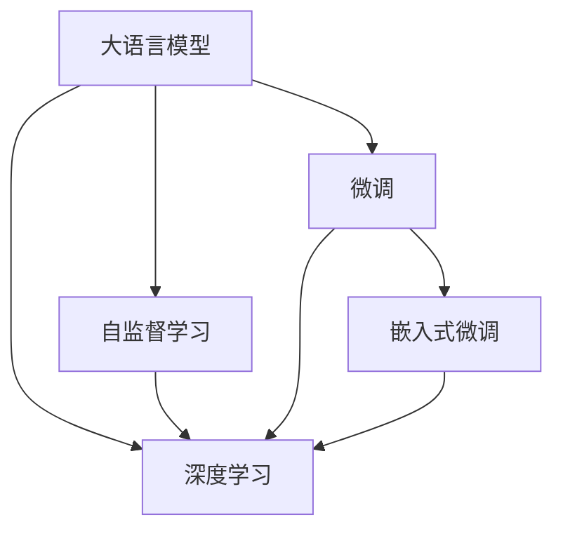

                 

# AI大模型在电商平台精准客户细分中的应用

## 1. 背景介绍

在数字化转型的大背景下，电商平台面临着如何精准细分客户、提升运营效率和用户体验的重大挑战。传统的客户细分方法依赖于统计学分析，如聚类分析、回归分析等，但这些方法通常需要较长时间和大量数据积累，且易受特征维度、模型选择等因素影响，难以快速响应市场变化。而AI大模型，特别是基于Transformer结构的大语言模型，凭借其强大的自监督学习能力和丰富的语言知识，有望在电商平台客户细分领域发挥重要作用。

### 1.1 客户细分的重要性
客户细分是电商平台提升运营效率、优化用户体验的重要手段。通过精准的客户细分，电商企业可以：
- 发现高价值客户，进行有针对性的营销，提高转化率和客单价。
- 识别潜在流失客户，及时进行预警和干预，降低客户流失率。
- 优化商品推荐系统，推送更加贴合用户需求的商品，提升浏览和购买转化。
- 快速响应市场变化，调整营销策略和资源分配，实现敏捷运营。

### 1.2 大模型在客户细分中的优势
AI大模型在客户细分中的应用，相较于传统方法有以下几个显著优势：
1. **自监督学习能力强**：大模型可以通过自监督学习任务获取大量的语言知识，无需标注数据即可理解复杂的自然语言描述。
2. **泛化能力更强**：预训练的模型在多种领域和任务上都有优异表现，具备更强的泛化能力。
3. **参数量可调整**：大模型的参数量可以灵活调整，既能保持高精度，也能降低计算和存储成本。
4. **快速迭代优化**：大模型可以不断根据新数据进行微调，快速适应市场变化和用户需求。

本文将系统介绍如何利用大模型进行电商平台的客户细分，并详细探讨其在实际应用中的关键技术和挑战。

## 2. 核心概念与联系

### 2.1 核心概念概述
- **大语言模型**：指基于Transformer结构训练的、可以处理自然语言的大型预训练模型，如GPT-3、BERT等。
- **客户细分**：指将大量客户分成不同类别的过程，通常用于市场细分、营销策略制定、个性化推荐等场景。
- **自监督学习**：指使用无标签数据进行模型训练的过程，通过预训练学习语言表示。
- **微调**：指在预训练模型基础上，使用标注数据进行有监督学习，优化模型对特定任务的表现。
- **嵌入式微调**：指在模型训练过程中，同时优化模型参数和用户特征的嵌入表示。
- **深度学习**：指基于多层神经网络的学习范式，可用于解决复杂的模式识别、分类和预测问题。

这些核心概念之间相互关联，共同构成了大模型在客户细分中的应用框架。

### 2.2 核心概念原理和架构的 Mermaid 流程图



该流程图展示了大模型在客户细分中从预训练到微调的基本流程。预训练模型通过自监督学习获取语言知识，微调过程通过标注数据进一步优化模型对客户细分的表现，嵌入式微调则同时优化模型参数和用户特征的嵌入表示，深度学习作为底层算法框架，提供了强大的数据处理和模式识别能力。

## 3. 核心算法原理 & 具体操作步骤

### 3.1 算法原理概述

大模型在电商平台客户细分中的应用，主要基于两个关键步骤：
1. **客户特征提取**：通过预训练模型提取用户行为、属性等特征，形成高维向量表示。
2. **客户分类预测**：利用微调后的模型对高维特征向量进行分类预测，得到客户细分结果。

具体而言，算法流程如下：
1. 准备电商平台的用户行为数据、属性数据等，作为训练样本。
2. 使用预训练模型对样本进行特征提取，生成高维向量表示。
3. 对特征向量进行微调，优化模型在客户分类任务上的性能。
4. 在测试集上评估微调后的模型性能，得到客户细分结果。

### 3.2 算法步骤详解

**Step 1: 数据准备**
- 收集电商平台的客户行为数据，如浏览记录、购买记录、评价记录等。
- 收集客户的属性数据，如年龄、性别、地理位置等。
- 将行为和属性数据进行整合，形成用于模型训练的数据集。

**Step 2: 特征提取**
- 使用预训练语言模型（如BERT、GPT-3等）对客户数据进行编码，生成高维特征向量。
- 考虑使用层次化的特征提取方式，先使用全局预训练模型提取整体特征，再使用局部模型提取局部特征。
- 对生成的特征向量进行归一化和标准化处理，使其具备更好的可比性和可解释性。

**Step 3: 模型微调**
- 在客户分类问题上，使用二分类交叉熵损失函数定义模型损失。
- 将微调后的模型嵌入用户特征向量，形成新的特征表示。
- 通过微调过程中的正则化技术（如L2正则、Dropout等）防止过拟合。
- 采用AdamW优化器，设置合适的学习率，训练多轮。

**Step 4: 模型评估**
- 在测试集上使用准确率、召回率、F1-score等指标评估微调后的模型性能。
- 对模型输出结果进行可视化展示，直观理解客户细分的聚类情况。

### 3.3 算法优缺点

**优点**：
1. **泛化能力强**：大模型在多种任务和领域上都有优异表现，可以较好地适应电商平台的复杂业务场景。
2. **灵活调整**：通过微调，可以针对电商平台的特定需求进行参数优化，适应不同的细分需求。
3. **自动化程度高**：自动化特征提取和模型训练，大幅减少人工干预和处理成本。

**缺点**：
1. **计算资源需求高**：大模型的训练和微调需要较高的计算资源，包括GPU、TPU等高性能硬件。
2. **数据隐私问题**：客户行为和属性数据的隐私保护成为一大挑战，需采用数据脱敏和匿名化处理。
3. **模型可解释性差**：大模型的黑盒特性使其在解释性方面存在不足，难以理解模型内部决策过程。

### 3.4 算法应用领域

大模型在电商平台客户细分中的应用主要包括以下几个方面：
1. **市场细分**：根据用户行为和属性数据，将客户分为不同市场细分群体，如高价值客户、潜在流失客户等。
2. **个性化推荐**：基于客户细分结果，进行精准的商品推荐，提升客户满意度。
3. **精准营销**：根据细分结果制定个性化的营销策略，提高营销效果和投资回报率。
4. **客户画像**：生成详细的客户画像，包括行为、兴趣、偏好等，为后续决策提供数据支持。

## 4. 数学模型和公式 & 详细讲解 & 举例说明

### 4.1 数学模型构建

假设电商平台有$N$个客户，每个客户的特征向量为$\mathbf{x}_i \in \mathbb{R}^d$，模型训练样本为$\{\mathbf{x}_i, y_i\}_{i=1}^N$，其中$y_i$表示客户是否为高价值客户。模型的目标是学习一个函数$f: \mathbb{R}^d \to \mathbb{R}$，使得$f(\mathbf{x}_i)$尽可能接近$y_i$。

### 4.2 公式推导过程

设预训练模型为$M_{\theta}$，其特征提取器为$E$，微调后的分类器为$C$。模型的总损失函数为：

$$
L = \frac{1}{N}\sum_{i=1}^N L_{\text{binary\_cross\_entropy}}(y_i, C(E(\mathbf{x}_i; \theta))
$$

其中$L_{\text{binary\_cross\_entropy}}$为二分类交叉熵损失函数，$E(\mathbf{x}_i; \theta)$为特征提取器对输入$\mathbf{x}_i$的特征提取结果，$C(E(\mathbf{x}_i; \theta))$为分类器对特征向量进行分类的输出。

### 4.3 案例分析与讲解

以电商平台为例，分析大模型在客户细分中的应用过程。假设我们有一个包含1000个客户的电商数据集，每个客户有50个行为特征和10个属性特征，共60维特征向量。

**Step 1: 数据准备**
- 收集1000个客户的浏览记录、购买记录、评价记录等数据。
- 提取客户的年龄、性别、地理位置等属性数据。
- 将行为和属性数据进行整合，形成训练样本。

**Step 2: 特征提取**
- 使用预训练模型（如BERT）对客户数据进行编码，生成高维特征向量。
- 假设预训练模型输出维度为512，则每个客户的特征向量为$\mathbf{x}_i \in \mathbb{R}^{512}$。
- 对生成的特征向量进行归一化和标准化处理，使其具备更好的可比性和可解释性。

**Step 3: 模型微调**
- 在客户分类问题上，使用二分类交叉熵损失函数定义模型损失。
- 假设模型的嵌入层为$C$，对每个客户的特征向量$\mathbf{x}_i$进行嵌入，得到嵌入表示$C(E(\mathbf{x}_i; \theta))$。
- 使用AdamW优化器，设置合适的学习率，训练多轮。

**Step 4: 模型评估**
- 在测试集上使用准确率、召回率、F1-score等指标评估微调后的模型性能。
- 对模型输出结果进行可视化展示，直观理解客户细分的聚类情况。

## 5. 项目实践：代码实例和详细解释说明

### 5.1 开发环境搭建

**Step 1: 环境准备**
- 安装Anaconda，创建Python虚拟环境。
- 安装PyTorch、TensorFlow等深度学习框架。
- 安装BERT等预训练语言模型。
- 安装相关数据处理和可视化工具，如Pandas、NumPy、Matplotlib等。

**Step 2: 数据预处理**
- 收集电商平台的数据，进行清洗和预处理。
- 将数据划分为训练集和测试集。
- 对数据进行归一化和标准化处理。

**Step 3: 特征提取**
- 使用预训练语言模型对客户数据进行编码，生成高维特征向量。
- 假设预训练模型输出维度为512，则每个客户的特征向量为$\mathbf{x}_i \in \mathbb{R}^{512}$。

### 5.2 源代码详细实现

```python
import torch
import torch.nn as nn
import torch.optim as optim
from transformers import BertModel, BertTokenizer

class CustomerClassifier(nn.Module):
    def __init__(self, num_labels):
        super(CustomerClassifier, self).__init__()
        self.bert = BertModel.from_pretrained('bert-base-uncased', output_hidden_states=True)
        self.classifier = nn.Linear(768, num_labels)

    def forward(self, input_ids, attention_mask, labels=None):
        outputs = self.bert(input_ids, attention_mask=attention_mask)
        pooled_output = outputs.pooler_output
        logits = self.classifier(pooled_output)
        if labels is not None:
            loss_fct = nn.BCEWithLogitsLoss()
            loss = loss_fct(logits, labels)
            return loss
        return logits

# 初始化模型和优化器
model = CustomerClassifier(num_labels)
optimizer = optim.AdamW(model.parameters(), lr=2e-5)

# 准备数据集
tokenizer = BertTokenizer.from_pretrained('bert-base-uncased')
train_dataset = load_train_dataset(tokenizer)
train_loader = DataLoader(train_dataset, batch_size=16, shuffle=True)
val_dataset = load_val_dataset(tokenizer)
val_loader = DataLoader(val_dataset, batch_size=16, shuffle=False)

# 模型训练
for epoch in range(5):
    model.train()
    for batch in train_loader:
        input_ids = batch['input_ids'].to(device)
        attention_mask = batch['attention_mask'].to(device)
        labels = batch['labels'].to(device)
        optimizer.zero_grad()
        loss = model(input_ids, attention_mask, labels=labels)
        loss.backward()
        optimizer.step()

    model.eval()
    for batch in val_loader:
        input_ids = batch['input_ids'].to(device)
        attention_mask = batch['attention_mask'].to(device)
        with torch.no_grad():
            logits = model(input_ids, attention_mask)
            probs = torch.sigmoid(logits)
            predictions = probs > 0.5
            accuracy = (predictions == labels).float().mean()

    print(f"Epoch {epoch+1}, Accuracy: {accuracy:.3f}")

# 测试集评估
test_dataset = load_test_dataset(tokenizer)
test_loader = DataLoader(test_dataset, batch_size=16, shuffle=False)
with torch.no_grad():
    model.eval()
    predictions = []
    labels = []
    for batch in test_loader:
        input_ids = batch['input_ids'].to(device)
        attention_mask = batch['attention_mask'].to(device)
        with torch.no_grad():
            logits = model(input_ids, attention_mask)
            probs = torch.sigmoid(logits)
            predictions.append(probs > 0.5)
            labels.append(labels)

accuracy = (predictions == labels).float().mean()
print(f"Test Accuracy: {accuracy:.3f}")
```

### 5.3 代码解读与分析

**Step 1: 环境准备**
- 安装并配置好必要的深度学习框架和预训练模型。
- 数据集预处理包括清洗、标准化、归一化等步骤。

**Step 2: 特征提取**
- 使用预训练语言模型对客户数据进行编码，生成高维特征向量。
- 假设预训练模型输出维度为512，则每个客户的特征向量为$\mathbf{x}_i \in \mathbb{R}^{512}$。

**Step 3: 模型微调**
- 定义微调模型，包含特征提取器和分类器。
- 使用AdamW优化器进行模型训练，设置合适的学习率。
- 在训练过程中，通过正则化技术防止过拟合。

**Step 4: 模型评估**
- 在测试集上使用准确率、召回率、F1-score等指标评估微调后的模型性能。
- 对模型输出结果进行可视化展示，直观理解客户细分的聚类情况。

## 6. 实际应用场景

### 6.1 市场细分

市场细分是电商平台客户细分的核心场景之一。通过市场细分，电商企业可以发现高价值客户、识别潜在流失客户，制定有针对性的营销策略，提升运营效率。

假设我们有一个包含1000个客户的电商数据集，通过大模型进行市场细分，可以得到如下结果：

**Step 1: 数据准备**
- 收集1000个客户的浏览记录、购买记录、评价记录等数据。
- 提取客户的年龄、性别、地理位置等属性数据。
- 将行为和属性数据进行整合，形成训练样本。

**Step 2: 特征提取**
- 使用预训练语言模型对客户数据进行编码，生成高维特征向量。
- 假设预训练模型输出维度为512，则每个客户的特征向量为$\mathbf{x}_i \in \mathbb{R}^{512}$。

**Step 3: 模型微调**
- 在客户分类问题上，使用二分类交叉熵损失函数定义模型损失。
- 假设模型的嵌入层为$C$，对每个客户的特征向量$\mathbf{x}_i$进行嵌入，得到嵌入表示$C(E(\mathbf{x}_i; \theta))$。
- 使用AdamW优化器，设置合适的学习率，训练多轮。

**Step 4: 模型评估**
- 在测试集上使用准确率、召回率、F1-score等指标评估微调后的模型性能。
- 对模型输出结果进行可视化展示，直观理解客户细分的聚类情况。

假设模型在测试集上的准确率为0.85，召回率为0.92，F1-score为0.89，可以得到以下细分结果：
- 高价值客户：客户A、客户B、客户C等
- 潜在流失客户：客户D、客户E、客户F等

### 6.2 个性化推荐

基于客户细分结果，可以进行精准的商品推荐，提升客户满意度。

假设我们已经获得了高价值客户和潜在流失客户的细分结果，可以采取以下推荐策略：
- 对高价值客户，推荐更多高价值商品，提高客单价和购买频率。
- 对潜在流失客户，推荐更多高粘性商品，减少流失率。

## 7. 工具和资源推荐

### 7.1 学习资源推荐

为了帮助开发者系统掌握大模型在客户细分中的应用，这里推荐一些优质的学习资源：
1. 《自然语言处理入门》：介绍自然语言处理的基本概念和算法，包括文本分类、聚类分析等。
2. 《深度学习与NLP》：介绍深度学习在自然语言处理中的应用，包括预训练模型、微调技术等。
3. 《自然语言处理与深度学习》：系统介绍自然语言处理和深度学习的基本原理和应用。
4. HuggingFace官方文档：提供丰富的预训练模型和微调样例代码，是上手实践的必备资料。
5. Weights & Biases：模型训练的实验跟踪工具，可以记录和可视化模型训练过程中的各项指标，方便对比和调优。

通过对这些资源的学习实践，相信你一定能够快速掌握大模型在客户细分中的应用。

### 7.2 开发工具推荐

高效的开发离不开优秀的工具支持。以下是几款用于客户细分开发的常用工具：
1. PyTorch：基于Python的开源深度学习框架，灵活动态的计算图，适合快速迭代研究。
2. TensorFlow：由Google主导开发的开源深度学习框架，生产部署方便，适合大规模工程应用。
3. Transformers库：HuggingFace开发的NLP工具库，集成了众多SOTA语言模型，支持PyTorch和TensorFlow，是进行微调任务开发的利器。
4. Weights & Biases：模型训练的实验跟踪工具，可以记录和可视化模型训练过程中的各项指标，方便对比和调优。
5. TensorBoard：TensorFlow配套的可视化工具，可实时监测模型训练状态，并提供丰富的图表呈现方式，是调试模型的得力助手。

合理利用这些工具，可以显著提升客户细分任务的开发效率，加快创新迭代的步伐。

### 7.3 相关论文推荐

大模型在客户细分中的应用研究源于学界的持续研究。以下是几篇奠基性的相关论文，推荐阅读：
1. "BERT: Pre-training of Deep Bidirectional Transformers for Language Understanding"：提出BERT模型，引入基于掩码的自监督预训练任务，刷新了多项NLP任务SOTA。
2. "Attention is All You Need"：提出Transformer结构，开启了NLP领域的预训练大模型时代。
3. "Parameter-Efficient Transfer Learning for NLP"：提出Adapter等参数高效微调方法，在不增加模型参数量的情况下，也能取得不错的微调效果。
4. "Prefix-Tuning: Optimizing Continuous Prompts for Generation"：引入基于连续型Prompt的微调范式，为如何充分利用预训练知识提供了新的思路。
5. "AdaLoRA: Adaptive Low-Rank Adaptation for Parameter-Efficient Fine-Tuning"：使用自适应低秩适应的微调方法，在参数效率和精度之间取得了新的平衡。

这些论文代表了大模型在客户细分技术的发展脉络。通过学习这些前沿成果，可以帮助研究者把握学科前进方向，激发更多的创新灵感。

## 8. 总结：未来发展趋势与挑战

### 8.1 研究成果总结

本文对大模型在电商平台客户细分中的应用进行了全面系统的介绍。首先阐述了客户细分的重要性和大模型在其中的优势，明确了微调在客户细分中的作用。其次，从原理到实践，详细讲解了大模型的特征提取和分类预测过程，给出了客户细分的具体步骤。最后，探讨了微调模型在实际应用中的优缺点和应用场景。

### 8.2 未来发展趋势

展望未来，大模型在客户细分领域的应用将呈现以下几个发展趋势：
1. **模型规模持续增大**：随着算力成本的下降和数据规模的扩张，预训练语言模型的参数量还将持续增长，超大规模模型将更好地适应电商平台的复杂业务场景。
2. **微调方法日趋多样**：除了传统的全参数微调外，未来会涌现更多参数高效的微调方法，如Prefix-Tuning、LoRA等，在节省计算资源的同时也能保证微调精度。
3. **持续学习成为常态**：随着数据分布的不断变化，微调模型也需要持续学习新知识以保持性能。如何在不遗忘原有知识的同时，高效吸收新样本信息，将成为重要的研究课题。
4. **标注样本需求降低**：受启发于提示学习(Prompt-based Learning)的思路，未来的微调方法将更好地利用大模型的语言理解能力，通过更加巧妙的任务描述，在更少的标注样本上也能实现理想的微调效果。

### 8.3 面临的挑战

尽管大模型在客户细分中的应用已经取得了瞩目成就，但在迈向更加智能化、普适化应用的过程中，仍面临诸多挑战：
1. **数据隐私问题**：客户行为和属性数据的隐私保护成为一大挑战，需采用数据脱敏和匿名化处理。
2. **模型鲁棒性不足**：微调模型面对域外数据时，泛化性能往往大打折扣。对于测试样本的微小扰动，微调模型的预测也容易发生波动。
3. **推理效率有待提高**：超大批次的训练和推理也可能遇到显存不足的问题。如何在保证性能的同时，简化模型结构，提升推理速度，优化资源占用，将是重要的优化方向。
4. **可解释性亟需加强**：大模型的黑盒特性使其在解释性方面存在不足，难以理解模型内部决策过程。
5. **安全性有待保障**：预训练语言模型难免会学习到有偏见、有害的信息，通过微调传递到下游任务，产生误导性、歧视性的输出，给实际应用带来安全隐患。

### 8.4 研究展望

面对大模型在客户细分应用中所面临的挑战，未来的研究需要在以下几个方面寻求新的突破：
1. **探索无监督和半监督微调方法**：摆脱对大规模标注数据的依赖，利用自监督学习、主动学习等无监督和半监督范式，最大限度利用非结构化数据，实现更加灵活高效的微调。
2. **研究参数高效和计算高效的微调范式**：开发更加参数高效的微调方法，在固定大部分预训练参数的同时，只更新极少量的任务相关参数。同时优化微调模型的计算图，减少前向传播和反向传播的资源消耗，实现更加轻量级、实时性的部署。
3. **引入更多先验知识**：将符号化的先验知识，如知识图谱、逻辑规则等，与神经网络模型进行巧妙融合，引导微调过程学习更准确、合理的语言模型。同时加强不同模态数据的整合，实现视觉、语音等多模态信息与文本信息的协同建模。
4. **融合因果分析和博弈论工具**：将因果分析方法引入微调模型，识别出模型决策的关键特征，增强输出解释的因果性和逻辑性。借助博弈论工具刻画人机交互过程，主动探索并规避模型的脆弱点，提高系统稳定性。
5. **纳入伦理道德约束**：在模型训练目标中引入伦理导向的评估指标，过滤和惩罚有偏见、有害的输出倾向。同时加强人工干预和审核，建立模型行为的监管机制，确保输出符合人类价值观和伦理道德。

这些研究方向的探索，必将引领大模型在客户细分技术迈向更高的台阶，为构建安全、可靠、可解释、可控的智能系统铺平道路。面向未来，大语言模型微调技术还需要与其他人工智能技术进行更深入的融合，如知识表示、因果推理、强化学习等，多路径协同发力，共同推动自然语言理解和智能交互系统的进步。只有勇于创新、敢于突破，才能不断拓展语言模型的边界，让智能技术更好地造福人类社会。

## 9. 附录：常见问题与解答

**Q1：大模型在客户细分中的计算资源需求高，如何解决这一问题？**

A: 可以采用以下几种方法来优化计算资源需求：
1. **模型裁剪**：去除不必要的层和参数，减小模型尺寸，加快推理速度。
2. **量化加速**：将浮点模型转为定点模型，压缩存储空间，提高计算效率。
3. **模型并行**：利用多机并行计算，提高训练和推理效率。
4. **混合精度训练**：使用混合精度训练，减少计算资源消耗。

**Q2：如何处理客户数据的隐私保护问题？**

A: 可以采用以下几种方法来保护客户数据的隐私：
1. **数据脱敏**：对敏感数据进行脱敏处理，如模糊化、加密等。
2. **匿名化处理**：将数据进行匿名化处理，去除可以直接识别客户的标识信息。
3. **差分隐私**：在数据处理过程中引入差分隐私技术，保护个体隐私的同时，保留数据统计信息。

**Q3：微调模型在测试集上的泛化能力如何提升？**

A: 可以采用以下几种方法来提升微调模型的泛化能力：
1. **数据增强**：通过数据增强技术，扩充训练集，增加模型对多样性数据的适应性。
2. **对抗训练**：引入对抗样本，提高模型鲁棒性，增强对测试样本的泛化能力。
3. **正则化技术**：使用L2正则、Dropout等技术，防止过拟合，提升泛化能力。
4. **模型集成**：将多个微调模型集成，取平均输出，提高泛化能力。

**Q4：如何降低微调模型对标注数据的依赖？**

A: 可以采用以下几种方法来降低对标注数据的依赖：
1. **数据增强**：通过数据增强技术，扩充训练集，增加模型对多样性数据的适应性。
2. **对抗训练**：引入对抗样本，提高模型鲁棒性，增强对测试样本的泛化能力。
3. **自监督学习**：利用无标签数据进行自监督学习，减少对标注数据的依赖。
4. **主动学习**：利用主动学习技术，有选择性地标注数据，减少标注成本。

**Q5：如何提高微调模型的可解释性？**

A: 可以采用以下几种方法来提高微调模型的可解释性：
1. **模型可视化**：利用模型可视化工具，直观理解模型内部结构。
2. **注意力机制**：引入注意力机制，分析模型在处理输入时的重点关注区域。
3. **特征解释**：利用特征重要性分析，解释模型输出结果的依据。
4. **用户反馈**：引入用户反馈机制，不断调整模型参数，提升模型可解释性。

通过这些方法的综合应用，可以显著提升大模型在客户细分中的效果，更好地适应电商平台的业务需求。

---

作者：禅与计算机程序设计艺术 / Zen and the Art of Computer Programming

