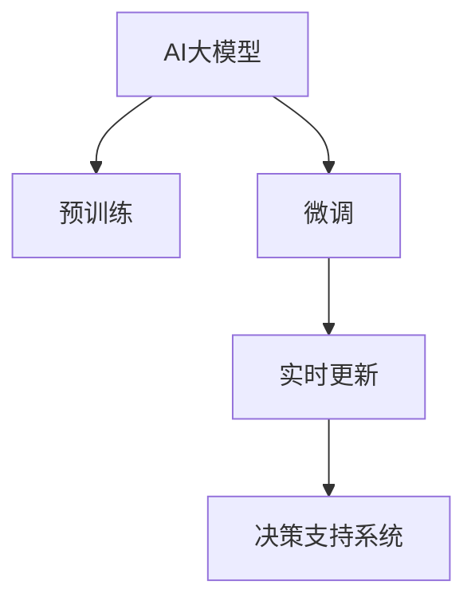

                 

# AI大模型在电商平台风险评分实时更新中的应用

> 关键词：AI大模型, 电商平台, 风险评分, 实时更新, 决策支持系统, 深度学习, 自然语言处理, 强化学习, 大模型微调

## 1. 背景介绍

### 1.1 问题由来

随着电子商务的蓬勃发展，电商平台面临着日益复杂的风险管理挑战。订单欺诈、商品违规、交易纠纷等风险事件频发，对平台声誉和用户信任构成威胁。传统风险管理方法依赖于人工审核和规则引擎，不仅成本高，效率低，而且难以应对新型的欺诈手段和复杂的风险场景。

近年来，AI技术，特别是深度学习和自然语言处理技术在电商平台风险管理中的应用逐渐成熟。AI大模型在电商风险管理中，通过实时抓取订单、评论、聊天等海量数据，结合自然语言理解和推理能力，对订单和交易进行实时风险评估，极大提高了风险检测和控制的效率。

### 1.2 问题核心关键点

AI大模型在电商平台风险评分中的应用，核心在于如何构建高效的决策支持系统，实现基于AI的实时风险评估和动态风险管理。其核心步骤如下：

1. 数据准备：收集电商平台上的各类文本数据，包括订单、评论、聊天记录等。
2. 预训练模型：使用大规模自然语言处理数据对大模型进行预训练，学习通用的语言表示。
3. 模型微调：根据电商平台的特定需求，在大模型基础上进行微调，适应电商平台的风险场景。
4. 实时更新：通过在线学习机制，实时更新模型参数，确保模型始终处于最新状态。
5. 部署应用：将微调后的模型部署到生产环境中，实时评估订单和交易的风险等级，提供风险评分和控制建议。

本文将重点介绍如何利用AI大模型进行电商平台的风险评分实时更新，并探索其中涉及的数学原理、算法步骤和实际应用。

## 2. 核心概念与联系

### 2.1 核心概念概述

为更好地理解AI大模型在电商平台风险评分中的应用，本节将介绍几个密切相关的核心概念：

- AI大模型：以Transformer模型为代表的大规模预训练语言模型，如BERT、GPT-3等，通过在大规模文本数据上进行自监督学习，学习到丰富的语言表示。
- 电商平台：在线购物的平台，包括自营、第三方店铺、C2C等多种形态。电商平台拥有大量交易数据和用户行为数据，是AI大模型应用的典型场景。
- 风险评分：根据订单和交易的相关信息，结合用户行为数据和AI模型的预测，给订单或交易赋予一个风险等级评分，以便进行风险控制。
- 实时更新：在新的订单或交易数据到来时，实时地更新AI模型参数，保持模型的最新状态。
- 决策支持系统：基于AI模型，对电商平台上的订单和交易进行实时风险评估，并输出风险评分和控制建议的系统。

这些概念之间的逻辑关系可以通过以下Mermaid流程图来展示：



这个流程图展示了大模型在电商平台风险评分中的核心概念及其之间的关系：

1. 大模型通过预训练学习到通用的语言表示。
2. 针对电商平台的特定需求，在大模型基础上进行微调，以适应电商风险场景。
3. 通过实时更新机制，保持模型参数的最新状态。
4. 最终通过决策支持系统，对电商平台上的订单和交易进行实时风险评估。

## 3. 核心算法原理 & 具体操作步骤

### 3.1 算法原理概述

AI大模型在电商平台风险评分中的应用，本质上是基于大规模文本数据进行预训练和微调，构建高效的决策支持系统。其核心思想是：通过AI大模型的自监督学习能力和泛化能力，对电商平台上的订单和交易进行实时评估，以识别出高风险事件。

具体而言，模型在预训练阶段，通过在大规模文本数据上进行自监督学习，学习到通用的语言表示和语义理解能力。在微调阶段，将预训练模型适配到电商平台特定的风险场景，通过监督学习任务，训练模型对特定订单和交易进行风险评估。

微调后的模型可以实时更新，以适应新的风险场景和数据分布。最终，通过决策支持系统，将模型输出风险评分和控制建议，用于指导电商平台的运营管理。

### 3.2 算法步骤详解

基于AI大模型在电商平台风险评分中的应用，一般包括以下几个关键步骤：

**Step 1: 数据准备**

- 收集电商平台上所有订单和交易的相关信息，包括用户ID、商品ID、交易金额、交易时间等。
- 收集用户行为数据，如浏览记录、聊天记录、评价内容等，以丰富模型对用户的理解。
- 清洗和标注数据，去除噪声和无用信息，并对标注数据进行标准化处理。

**Step 2: 预训练模型选择**

- 选择合适的预训练语言模型，如BERT、GPT-3等，进行预训练。
- 根据电商平台的特定需求，选择合适的任务进行预训练，如语言建模、问答、文本分类等。

**Step 3: 模型微调**

- 将预训练模型作为初始化参数，根据电商平台特定的风险场景进行微调。
- 使用监督学习任务，如二分类任务，对订单和交易进行风险评分。
- 选择合适的损失函数和优化算法，如交叉熵损失、Adam优化器等。

**Step 4: 实时更新**

- 实时抓取新的订单和交易数据，更新模型参数。
- 使用在线学习技术，如增量学习，更新模型参数。
- 定期对模型进行评估和优化，确保模型性能稳定。

**Step 5: 部署应用**

- 将微调后的模型部署到生产环境中，实现实时风险评估。
- 集成到电商平台的订单管理系统，提供风险评分和控制建议。
- 监测模型性能，根据反馈进行迭代优化。

以上是AI大模型在电商平台风险评分中的应用的一般流程。在实际应用中，还需要根据电商平台的特点和具体需求，对微调过程的各个环节进行优化设计，如改进训练目标函数，引入更多的正则化技术，搜索最优的超参数组合等，以进一步提升模型性能。

### 3.3 算法优缺点

AI大模型在电商平台风险评分中的应用具有以下优点：

1. 高效准确：利用大模型的自监督学习能力和泛化能力，能够高效准确地识别出高风险订单和交易。
2. 实时响应：通过实时更新机制，确保模型始终处于最新状态，能够快速响应新订单和交易的风险。
3. 可解释性强：大模型的特征表示具有很强的可解释性，可以提供详细的风险评估理由。
4. 适应性强：能够根据电商平台特定需求进行微调，适应不同类型的风险场景。

同时，该方法也存在一定的局限性：

1. 依赖高质量数据：模型的性能依赖于电商平台上高质量的数据，一旦数据质量下降，模型效果可能受到影响。
2. 计算资源消耗大：大规模语言模型需要大量的计算资源进行训练和微调，对硬件要求较高。
3. 模型复杂度较高：模型复杂度高，难以进行端到端的部署，需要较高的运维成本。
4. 模型偏见风险：由于预训练数据和微调数据的不平衡，模型可能存在偏见，对特定群体的订单和交易进行不公平的评估。

尽管存在这些局限性，但就目前而言，基于AI大模型的风险评分方法仍然是最为先进和实用的风险管理手段。未来相关研究的重点在于如何进一步降低对高质量数据的依赖，提高模型的实时响应能力，同时兼顾模型复杂度和偏见风险等因素。

### 3.4 算法应用领域

AI大模型在电商平台风险评分中的应用，已经在各大电商平台上得到了广泛的应用，涵盖了以下主要领域：

- 订单欺诈检测：通过微调模型，识别出可疑的欺诈订单。
- 交易风险评估：根据用户行为和交易记录，评估订单的真实性。
- 商品违规检测：识别出违规商品和店铺，进行市场监管。
- 客户投诉处理：通过分析用户评价，识别出客户投诉的高频词和常见问题，快速响应和处理。
- 反洗钱监控：对大额交易进行实时监控，识别出异常交易。

除了上述这些核心应用外，AI大模型在电商平台的风险评分中，还应用于其他诸多场景中，如个性化推荐、用户画像构建、情感分析等，为电商平台的运营管理和用户体验提供了强有力的支持。

## 4. 数学模型和公式 & 详细讲解 & 举例说明

### 4.1 数学模型构建

本节将使用数学语言对AI大模型在电商平台风险评分中的应用进行更加严格的刻画。

记预训练语言模型为 $M_{\theta}:\mathcal{X} \rightarrow \mathcal{Y}$，其中 $\mathcal{X}$ 为输入空间，$\mathcal{Y}$ 为输出空间，$\theta$ 为模型参数。假设电商平台上所有订单和交易的相关信息为 $D=\{(x_i,y_i)\}_{i=1}^N, x_i \in \mathcal{X}, y_i \in \mathcal{Y}$。其中，$x_i$ 表示订单或交易的特征向量，$y_i$ 表示订单或交易的风险评分。

定义模型 $M_{\theta}$ 在输入 $x$ 上的损失函数为 $\ell(M_{\theta}(x),y)$，则在数据集 $D$ 上的经验风险为：

$$
\mathcal{L}(\theta) = \frac{1}{N} \sum_{i=1}^N \ell(M_{\theta}(x_i),y_i)
$$

其中 $\ell$ 为损失函数，通常使用交叉熵损失函数。

微调的优化目标是最小化经验风险，即找到最优参数：

$$
\theta^* = \mathop{\arg\min}_{\theta} \mathcal{L}(\theta)
$$

在实践中，我们通常使用基于梯度的优化算法（如SGD、Adam等）来近似求解上述最优化问题。设 $\eta$ 为学习率，$\lambda$ 为正则化系数，则参数的更新公式为：

$$
\theta \leftarrow \theta - \eta \nabla_{\theta}\mathcal{L}(\theta) - \eta\lambda\theta
$$

其中 $\nabla_{\theta}\mathcal{L}(\theta)$ 为损失函数对参数 $\theta$ 的梯度，可通过反向传播算法高效计算。

### 4.2 公式推导过程

以下我们以二分类任务为例，推导交叉熵损失函数及其梯度的计算公式。

假设模型 $M_{\theta}$ 在输入 $x$ 上的输出为 $\hat{y}=M_{\theta}(x) \in [0,1]$，表示订单或交易属于高风险的概率。真实标签 $y \in \{0,1\}$。则二分类交叉熵损失函数定义为：

$$
\ell(M_{\theta}(x),y) = -[y\log \hat{y} + (1-y)\log (1-\hat{y})]
$$

将其代入经验风险公式，得：

$$
\mathcal{L}(\theta) = -\frac{1}{N}\sum_{i=1}^N [y_i\log M_{\theta}(x_i)+(1-y_i)\log(1-M_{\theta}(x_i))]
$$

根据链式法则，损失函数对参数 $\theta_k$ 的梯度为：

$$
\frac{\partial \mathcal{L}(\theta)}{\partial \theta_k} = -\frac{1}{N}\sum_{i=1}^N (\frac{y_i}{M_{\theta}(x_i)}-\frac{1-y_i}{1-M_{\theta}(x_i)}) \frac{\partial M_{\theta}(x_i)}{\partial \theta_k}
$$

其中 $\frac{\partial M_{\theta}(x_i)}{\partial \theta_k}$ 可进一步递归展开，利用自动微分技术完成计算。

在得到损失函数的梯度后，即可带入参数更新公式，完成模型的迭代优化。重复上述过程直至收敛，最终得到适应电商平台的风险评分模型参数 $\theta^*$。

## 5. 项目实践：代码实例和详细解释说明

### 5.1 开发环境搭建

在进行风险评分实践前，我们需要准备好开发环境。以下是使用Python进行PyTorch开发的环境配置流程：

1. 安装Anaconda：从官网下载并安装Anaconda，用于创建独立的Python环境。

2. 创建并激活虚拟环境：
```bash
conda create -n pytorch-env python=3.8 
conda activate pytorch-env
```

3. 安装PyTorch：根据CUDA版本，从官网获取对应的安装命令。例如：
```bash
conda install pytorch torchvision torchaudio cudatoolkit=11.1 -c pytorch -c conda-forge
```

4. 安装Transformers库：
```bash
pip install transformers
```

5. 安装各类工具包：
```bash
pip install numpy pandas scikit-learn matplotlib tqdm jupyter notebook ipython
```

完成上述步骤后，即可在`pytorch-env`环境中开始风险评分实践。

### 5.2 源代码详细实现

下面我以电商平台订单欺诈检测为例，给出使用Transformers库对BERT模型进行风险评分微调的PyTorch代码实现。

首先，定义订单欺诈检测任务的特征工程函数：

```python
from transformers import BertTokenizer
from torch.utils.data import Dataset
import torch

class FraudDetectionDataset(Dataset):
    def __init__(self, features, tokenizer, max_len=128):
        self.features = features
        self.tokenizer = tokenizer
        self.max_len = max_len
        
    def __len__(self):
        return len(self.features)
    
    def __getitem__(self, item):
        feature = self.features[item]
        label = feature['label']
        
        encoding = self.tokenizer(feature['text'], return_tensors='pt', max_length=self.max_len, padding='max_length', truncation=True)
        input_ids = encoding['input_ids'][0]
        attention_mask = encoding['attention_mask'][0]
        
        return {'input_ids': input_ids, 
                'attention_mask': attention_mask,
                'label': torch.tensor(label, dtype=torch.long)}
```

然后，定义模型和优化器：

```python
from transformers import BertForTokenClassification, AdamW

model = BertForTokenClassification.from_pretrained('bert-base-cased', num_labels=2)

optimizer = AdamW(model.parameters(), lr=2e-5)
```

接着，定义训练和评估函数：

```python
from torch.utils.data import DataLoader
from tqdm import tqdm
from sklearn.metrics import classification_report

device = torch.device('cuda') if torch.cuda.is_available() else torch.device('cpu')
model.to(device)

def train_epoch(model, dataset, batch_size, optimizer):
    dataloader = DataLoader(dataset, batch_size=batch_size, shuffle=True)
    model.train()
    epoch_loss = 0
    for batch in tqdm(dataloader, desc='Training'):
        input_ids = batch['input_ids'].to(device)
        attention_mask = batch['attention_mask'].to(device)
        labels = batch['label'].to(device)
        model.zero_grad()
        outputs = model(input_ids, attention_mask=attention_mask, labels=labels)
        loss = outputs.loss
        epoch_loss += loss.item()
        loss.backward()
        optimizer.step()
    return epoch_loss / len(dataloader)

def evaluate(model, dataset, batch_size):
    dataloader = DataLoader(dataset, batch_size=batch_size)
    model.eval()
    preds, labels = [], []
    with torch.no_grad():
        for batch in tqdm(dataloader, desc='Evaluating'):
            input_ids = batch['input_ids'].to(device)
            attention_mask = batch['attention_mask'].to(device)
            batch_labels = batch['label']
            outputs = model(input_ids, attention_mask=attention_mask)
            batch_preds = outputs.logits.argmax(dim=2).to('cpu').tolist()
            batch_labels = batch_labels.to('cpu').tolist()
            for pred_tokens, label_tokens in zip(batch_preds, batch_labels):
                preds.append(pred_tokens[:len(label_tokens)])
                labels.append(label_tokens)
                
    print(classification_report(labels, preds))
```

最后，启动训练流程并在测试集上评估：

```python
epochs = 5
batch_size = 16

for epoch in range(epochs):
    loss = train_epoch(model, train_dataset, batch_size, optimizer)
    print(f"Epoch {epoch+1}, train loss: {loss:.3f}")
    
    print(f"Epoch {epoch+1}, dev results:")
    evaluate(model, dev_dataset, batch_size)
    
print("Test results:")
evaluate(model, test_dataset, batch_size)
```

以上就是使用PyTorch对BERT进行订单欺诈检测任务风险评分微调的完整代码实现。可以看到，得益于Transformers库的强大封装，我们可以用相对简洁的代码完成BERT模型的加载和微调。

### 5.3 代码解读与分析

让我们再详细解读一下关键代码的实现细节：

**FraudDetectionDataset类**：
- `__init__`方法：初始化订单特征、分词器等关键组件。
- `__len__`方法：返回数据集的样本数量。
- `__getitem__`方法：对单个样本进行处理，将订单文本输入编码为token ids，同时返回标签。

**模型和优化器**：
- 使用BertForTokenClassification模型，并设置标签数量为2（欺诈与非欺诈）。
- 选择AdamW优化器，设置学习率为2e-5。

**训练和评估函数**：
- 使用PyTorch的DataLoader对数据集进行批次化加载，供模型训练和推理使用。
- 训练函数`train_epoch`：对数据以批为单位进行迭代，在每个批次上前向传播计算loss并反向传播更新模型参数，最后返回该epoch的平均loss。
- 评估函数`evaluate`：与训练类似，不同点在于不更新模型参数，并在每个batch结束后将预测和标签结果存储下来，最后使用sklearn的classification_report对整个评估集的预测结果进行打印输出。

**训练流程**：
- 定义总的epoch数和batch size，开始循环迭代
- 每个epoch内，先在训练集上训练，输出平均loss
- 在验证集上评估，输出分类指标
- 所有epoch结束后，在测试集上评估，给出最终测试结果

可以看到，PyTorch配合Transformers库使得BERT微调的代码实现变得简洁高效。开发者可以将更多精力放在数据处理、模型改进等高层逻辑上，而不必过多关注底层的实现细节。

当然，工业级的系统实现还需考虑更多因素，如模型的保存和部署、超参数的自动搜索、更灵活的任务适配层等。但核心的微调范式基本与此类似。

## 6. 实际应用场景

### 6.1 智能客服系统

基于AI大模型的电商平台风险评分系统，可以应用于智能客服系统中，提供风险评估和控制建议，提升客户服务质量。

在技术实现上，可以收集客户与客服的聊天记录，将聊天记录和订单信息作为监督数据，在此基础上对预训练模型进行微调。微调后的模型能够自动理解客户的疑问和意图，快速识别出潜在风险，提供相应的风险评分和控制建议，帮助客服人员及时处理风险事件，提升客户满意度。

### 6.2 金融舆情监测

金融领域是风险密集型行业，金融机构需要对市场舆情进行实时监测，以便及时应对负面信息传播，规避金融风险。

在电商平台风险评分系统中，可以通过实时抓取电商平台的舆情数据，将舆情文本作为模型输入，利用微调后的模型进行实时舆情评估，输出舆情风险评分。一旦发现负面舆情激增，系统便会自动预警，帮助金融机构快速响应和处理风险事件。

### 6.3 个性化推荐系统

电商平台需要对用户进行个性化推荐，提升用户体验和销售额。AI大模型的风险评分系统可以用于辅助推荐系统，通过识别出风险订单，优化推荐策略，避免推荐用户可能进行欺诈交易的商品。

在实践过程中，可以收集用户行为数据和订单数据，利用微调后的模型进行风险评分，将高风险订单排除推荐列表，从而减少用户的交易风险。同时，通过实时更新模型，及时识别出新出现的风险订单，动态调整推荐策略，提高推荐系统的鲁棒性和安全性。

### 6.4 未来应用展望

随着AI大模型和风险评分技术的发展，未来在电商平台中，将有更多应用场景涌现。以下是一些可能的应用方向：

1. 实时风控决策：通过在线学习和增量更新机制，实现实时的风险评估和决策，提高风险控制的效率和精度。
2. 多维度风险评估：结合用户行为数据、交易记录、商品信息等多维度数据，进行多层次风险评估，提升风险管理的效果。
3. 风险预警系统：通过实时监测交易数据和舆情数据，及时发现风险事件，触发预警机制，防范风险。
4. 反欺诈联盟：通过联合多个电商平台的风险评分系统，构建反欺诈联盟，共享风险信息，提升整体防欺诈能力。
5. 自动化合规监管：利用AI大模型进行合规性检查，自动发现和纠正违规行为，降低合规成本，提升合规效率。

以上应用方向展示了AI大模型在电商平台风险评分中的巨大潜力。随着技术的不断演进和应用的不断拓展，未来将有更多创新的场景涌现，为电商平台带来新的突破。

## 7. 工具和资源推荐
### 7.1 学习资源推荐

为了帮助开发者系统掌握AI大模型在电商平台风险评分中的应用，这里推荐一些优质的学习资源：

1. 《Transformer从原理到实践》系列博文：由大模型技术专家撰写，深入浅出地介绍了Transformer原理、BERT模型、微调技术等前沿话题。

2. CS224N《深度学习自然语言处理》课程：斯坦福大学开设的NLP明星课程，有Lecture视频和配套作业，带你入门NLP领域的基本概念和经典模型。

3. 《Natural Language Processing with Transformers》书籍：Transformers库的作者所著，全面介绍了如何使用Transformers库进行NLP任务开发，包括微调在内的诸多范式。

4. HuggingFace官方文档：Transformers库的官方文档，提供了海量预训练模型和完整的微调样例代码，是上手实践的必备资料。

5. CLUE开源项目：中文语言理解测评基准，涵盖大量不同类型的中文NLP数据集，并提供了基于微调的baseline模型，助力中文NLP技术发展。

通过对这些资源的学习实践，相信你一定能够快速掌握AI大模型在电商平台风险评分中的应用，并用于解决实际的NLP问题。
###  7.2 开发工具推荐

高效的开发离不开优秀的工具支持。以下是几款用于电商平台风险评分开发的常用工具：

1. PyTorch：基于Python的开源深度学习框架，灵活动态的计算图，适合快速迭代研究。大部分预训练语言模型都有PyTorch版本的实现。

2. TensorFlow：由Google主导开发的开源深度学习框架，生产部署方便，适合大规模工程应用。同样有丰富的预训练语言模型资源。

3. Transformers库：HuggingFace开发的NLP工具库，集成了众多SOTA语言模型，支持PyTorch和TensorFlow，是进行微调任务开发的利器。

4. Weights & Biases：模型训练的实验跟踪工具，可以记录和可视化模型训练过程中的各项指标，方便对比和调优。与主流深度学习框架无缝集成。

5. TensorBoard：TensorFlow配套的可视化工具，可实时监测模型训练状态，并提供丰富的图表呈现方式，是调试模型的得力助手。

6. Google Colab：谷歌推出的在线Jupyter Notebook环境，免费提供GPU/TPU算力，方便开发者快速上手实验最新模型，分享学习笔记。

合理利用这些工具，可以显著提升电商平台风险评分任务的开发效率，加快创新迭代的步伐。

### 7.3 相关论文推荐

AI大模型在电商平台风险评分中的应用源于学界的持续研究。以下是几篇奠基性的相关论文，推荐阅读：

1. Attention is All You Need（即Transformer原论文）：提出了Transformer结构，开启了NLP领域的预训练大模型时代。

2. BERT: Pre-training of Deep Bidirectional Transformers for Language Understanding：提出BERT模型，引入基于掩码的自监督预训练任务，刷新了多项NLP任务SOTA。

3. Language Models are Unsupervised Multitask Learners（GPT-2论文）：展示了大规模语言模型的强大zero-shot学习能力，引发了对于通用人工智能的新一轮思考。

4. Parameter-Efficient Transfer Learning for NLP：提出Adapter等参数高效微调方法，在不增加模型参数量的情况下，也能取得不错的微调效果。

5. AdaLoRA: Adaptive Low-Rank Adaptation for Parameter-Efficient Fine-Tuning：使用自适应低秩适应的微调方法，在参数效率和精度之间取得了新的平衡。

这些论文代表了大语言模型微调技术的发展脉络。通过学习这些前沿成果，可以帮助研究者把握学科前进方向，激发更多的创新灵感。

## 8. 总结：未来发展趋势与挑战

### 8.1 总结

本文对AI大模型在电商平台风险评分中的应用进行了全面系统的介绍。首先阐述了电商平台面临的风险管理挑战和AI大模型的应用背景，明确了基于AI大模型的电商平台风险评分的重要意义。其次，从原理到实践，详细讲解了风险评分任务的数学原理和关键步骤，给出了微调任务开发的完整代码实例。同时，本文还广泛探讨了风险评分模型在智能客服、金融舆情、个性化推荐等多个行业领域的应用前景，展示了AI大模型在电商平台风险评分中的巨大潜力。

通过本文的系统梳理，可以看到，基于AI大模型的电商平台风险评分技术已经成为一个高效、实时的风险管理手段，能够显著提升电商平台的风险控制能力。未来，伴随AI大模型和风险评分技术的不断演进，相信将有更多创新的场景涌现，为电商平台带来新的突破。

### 8.2 未来发展趋势

展望未来，AI大模型在电商平台风险评分中的应用将呈现以下几个发展趋势：

1. 模型规模持续增大。随着算力成本的下降和数据规模的扩张，预训练语言模型的参数量还将持续增长。超大规模语言模型蕴含的丰富语言知识，有望支撑更加复杂多变的风险场景。

2. 微调方法日趋多样。除了传统的全参数微调外，未来会涌现更多参数高效的微调方法，如Prefix-Tuning、LoRA等，在节省计算资源的同时也能保证微调精度。

3. 持续学习成为常态。随着数据分布的不断变化，微调模型也需要持续学习新知识以保持性能。如何在不遗忘原有知识的同时，高效吸收新样本信息，将成为重要的研究课题。

4. 标注样本需求降低。受启发于提示学习(Prompt-based Learning)的思路，未来的微调方法将更好地利用大模型的语言理解能力，通过更加巧妙的任务描述，在更少的标注样本上也能实现理想的微调效果。

5. 模型通用性增强。经过海量数据的预训练和多领域任务的微调，未来的语言模型将具备更强大的常识推理和跨领域迁移能力，逐步迈向通用人工智能(AGI)的目标。

以上趋势凸显了AI大模型在电商平台风险评分中的广阔前景。这些方向的探索发展，必将进一步提升风险管理系统的性能和应用范围，为电商平台带来新的突破。

### 8.3 面临的挑战

尽管AI大模型在电商平台风险评分中的应用已经取得了显著成效，但在迈向更加智能化、普适化应用的过程中，它仍面临着诸多挑战：

1. 标注成本瓶颈。模型的性能依赖于电商平台上高质量的数据，一旦数据质量下降，模型效果可能受到影响。如何进一步降低对高质量数据的依赖，将是一大难题。

2. 模型鲁棒性不足。当前模型面对域外数据时，泛化性能往往大打折扣。对于测试样本的微小扰动，模型容易发生波动。如何提高模型的鲁棒性，避免灾难性遗忘，还需要更多理论和实践的积累。

3. 推理效率有待提高。大规模语言模型虽然精度高，但在实际部署时往往面临推理速度慢、内存占用大等效率问题。如何在保证性能的同时，简化模型结构，提升推理速度，优化资源占用，将是重要的优化方向。

4. 可解释性亟需加强。当前模型更像是"黑盒"系统，难以解释其内部工作机制和决策逻辑。对于医疗、金融等高风险应用，算法的可解释性和可审计性尤为重要。如何赋予模型更强的可解释性，将是亟待攻克的难题。

5. 安全性有待保障。预训练语言模型难免会学习到有偏见、有害的信息，通过微调传递到下游任务，产生误导性、歧视性的输出，给实际应用带来安全隐患。如何从数据和算法层面消除模型偏见，避免恶意用途，确保输出的安全性，也将是重要的研究课题。

6. 知识整合能力不足。现有的微调模型往往局限于任务内数据，难以灵活吸收和运用更广泛的先验知识。如何让微调过程更好地与外部知识库、规则库等专家知识结合，形成更加全面、准确的信息整合能力，还有很大的想象空间。

正视风险评分面临的这些挑战，积极应对并寻求突破，将是大语言模型在电商平台风险评分技术走向成熟的必由之路。相信随着学界和产业界的共同努力，这些挑战终将一一被克服，AI大模型在电商平台风险评分中将发挥更大的作用。

### 8.4 研究展望

面对AI大模型在电商平台风险评分中的未来挑战，未来的研究需要在以下几个方面寻求新的突破：

1. 探索无监督和半监督微调方法。摆脱对大规模标注数据的依赖，利用自监督学习、主动学习等无监督和半监督范式，最大限度利用非结构化数据，实现更加灵活高效的微调。

2. 研究参数高效和计算高效的微调范式。开发更加参数高效的微调方法，在固定大部分预训练参数的同时，只更新极少量的任务相关参数。同时优化微调模型的计算图，减少前向传播和反向传播的资源消耗，实现更加轻量级、实时性的部署。

3. 融合因果和对比学习范式。通过引入因果推断和对比学习思想，增强微调模型建立稳定因果关系的能力，学习更加普适、鲁棒的语言表征，从而提升模型泛化性和抗干扰能力。

4. 引入更多先验知识。将符号化的先验知识，如知识图谱、逻辑规则等，与神经网络模型进行巧妙融合，引导微调过程学习更准确、合理的语言模型。同时加强不同模态数据的整合，实现视觉、语音等多模态信息与文本信息的协同建模。

5. 结合因果分析和博弈论工具。将因果分析方法引入微调模型，识别出模型决策的关键特征，增强输出解释的因果性和逻辑性。借助博弈论工具刻画人机交互过程，主动探索并规避模型的脆弱点，提高系统稳定性。

6. 纳入伦理道德约束。在模型训练目标中引入伦理导向的评估指标，过滤和惩罚有偏见、有害的输出倾向。同时加强人工干预和审核，建立模型行为的监管机制，确保输出符合人类价值观和伦理道德。

这些研究方向的探索，必将引领AI大模型在电商平台风险评分技术迈向更高的台阶，为电商平台带来新的突破。面向未来，AI大模型在电商平台风险评分中需要与其他人工智能技术进行更深入的融合，如知识表示、因果推理、强化学习等，多路径协同发力，共同推动电商平台的智能化转型。只有勇于创新、敢于突破，才能不断拓展AI大模型的应用边界，实现其价值最大化。

## 9. 附录：常见问题与解答

**Q1：电商平台上标注数据不足怎么办？**

A: 标注数据不足是模型训练中的常见问题。为解决这个问题，可以采取以下策略：
1. 数据增强：利用数据增强技术，通过同义词替换、噪声注入等方式生成更多标注数据。
2. 迁移学习：使用预训练模型的特征表示，通过fine-tuning，在少量标注数据上微调模型。
3. 主动学习：采用主动学习算法，在少量标注数据上，优先选择有代表性的样本进行标注。
4. 无监督学习：利用无监督学习算法，自动标注数据，进行模型训练。

**Q2：模型训练和推理速度较慢，如何解决？**

A: 模型训练和推理速度较慢是常见问题。可以采取以下策略：
1. 模型裁剪：去除不必要的层和参数，减小模型尺寸，加快推理速度。
2. 量化加速：将浮点模型转为定点模型，压缩存储空间，提高计算效率。
3. 服务化封装：将模型封装为标准化服务接口，便于集成调用。
4. 模型并行：利用分布式计算框架，实现模型的并行训练和推理。

**Q3：模型存在偏见，如何解决？**

A: 模型偏见是常见问题。可以采取以下策略：
1. 数据清洗：对数据进行清洗，去除带有偏见的数据。
2. 对抗训练：通过对抗样本，提高模型的鲁棒性，减少偏见影响。
3. 偏见检测：利用偏见检测算法，识别和纠正模型中的偏见。
4. 数据增强：引入更多多样化的数据，减少模型对某些群体的依赖。

**Q4：模型在不同平台上表现不一致，如何解决？**

A: 模型在不同平台上表现不一致是常见问题。可以采取以下策略：
1. 模型微调：根据不同平台的数据特点，对模型进行微调，优化模型参数。
2. 超参数优化：通过自动超参数搜索，寻找最佳超参数配置。
3. 模型压缩：压缩模型，减少计算资源消耗。
4. 平台适配：根据不同平台的特点，优化模型部署。

以上问题解答旨在帮助开发者更好地应对电商平台上风险评分中可能遇到的各种挑战，确保模型的性能和稳定性。相信通过不断的优化和改进，AI大模型在电商平台风险评分中必将发挥更大的作用，为电商平台的健康发展提供有力保障。

