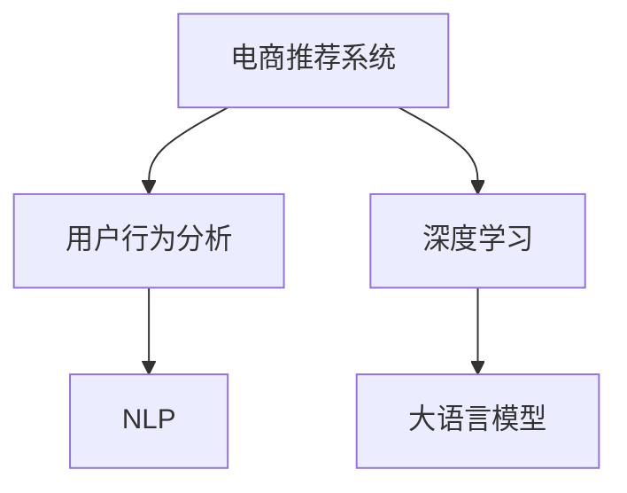

                 

# AI大模型如何优化电商平台的转化率

> 关键词：AI大模型,电商转化率优化,深度学习,自然语言处理,推荐系统,电商点击率,用户行为分析

## 1. 背景介绍

### 1.1 问题由来
随着电子商务市场的快速发展，如何提高电商平台的转化率（Conversion Rate, CR）成为电商企业关注的焦点。转化率指的是访问电商平台的访客中，最终产生购买行为的比例。一个高效的转化率不仅能够提高销售额，还能提升平台的品牌影响力。然而，由于电商平台的复杂性，传统的转化率优化手段往往难以应对日益多变的需求和复杂的用户行为。

大模型在自然语言处理(NLP)和深度学习领域取得的突破，为电商平台的转化率优化提供了新的思路。借助预训练的大语言模型，电商企业可以更全面地理解用户需求，提供个性化、高质量的推荐内容，从而有效提升电商平台的转化率。

### 1.2 问题核心关键点
电商平台的转化率优化主要关注两个方面：

1. **用户行为分析**：通过分析用户的行为数据，了解用户的偏好和需求，精准定位潜在客户。
2. **内容推荐优化**：根据用户的兴趣和行为数据，提供个性化的商品推荐，提高用户满意度，促进购买转化。

传统的方法基于规则和简单的统计模型，难以捕捉用户行为的全局特征，也无法充分利用多源数据。而基于大模型的推荐系统，通过学习大量的用户行为数据和商品属性信息，能够挖掘更深层次的用户兴趣和商品相关性，从而显著提升转化率。

### 1.3 问题研究意义
研究如何利用AI大模型优化电商平台的转化率，对于提升电商企业的运营效率、增加利润、提高用户体验具有重要意义：

1. 降低运营成本：减少人工干预，通过自动化推荐提高运营效率，减少人力成本。
2. 提高销售转化率：通过个性化推荐，提升用户的购买意愿和满意度，增加销售额。
3. 优化用户体验：基于用户行为数据进行精准推荐，提升用户体验，增加用户粘性。
4. 驱动电商创新：探索新的电商业务模式，提升平台的竞争力。
5. 促进产业升级：推动电商行业整体向智能化、精准化方向发展。

## 2. 核心概念与联系

### 2.1 核心概念概述

为更好地理解如何利用AI大模型优化电商平台的转化率，本节将介绍几个密切相关的核心概念：

- **大语言模型(Large Language Model, LLM)**：以自回归(如GPT)或自编码(如BERT)模型为代表的大规模预训练语言模型。通过在大规模无标签文本数据上进行预训练，学习通用的语言表示，具备强大的语言理解和生成能力。

- **电商推荐系统(Online Retail Recommendation System)**：利用电商交易平台的用户行为数据，为用户提供个性化的商品推荐，以提高用户的购买转化率。

- **用户行为分析**：通过分析用户的浏览记录、点击行为、搜索查询等数据，理解用户的兴趣和需求，提供精准的推荐服务。

- **深度学习**：基于神经网络模型进行学习和决策的技术，包括卷积神经网络(CNN)、循环神经网络(RNN)、变换器(Transformer)等。深度学习在电商推荐系统中的应用，能够处理复杂的非线性关系，提高推荐的准确性和个性化。

- **自然语言处理(Natural Language Processing, NLP)**：利用计算机处理和理解人类语言的技术，包括词向量模型、序列模型、语言模型等。NLP在电商推荐系统中，用于理解用户搜索查询和评论文本，提取有价值的信息。

这些核心概念之间的逻辑关系可以通过以下Mermaid流程图来展示：



这个流程图展示了大模型在电商推荐系统中的核心概念及其之间的关系：

1. 电商推荐系统利用用户行为数据进行推荐。
2. 深度学习是实现电商推荐的核心技术，通过神经网络模型处理数据。
3. NLP技术用于提取用户文本数据中的关键信息。
4. 大语言模型作为深度学习模型的补充，提供通用的语言理解和生成能力，进一步提升推荐效果。

## 3. 核心算法原理 & 具体操作步骤
### 3.1 算法原理概述

基于大模型的电商推荐系统，核心思想是：利用深度学习和自然语言处理技术，对用户行为数据进行建模和分析，结合大语言模型的语言理解能力，生成个性化的商品推荐。其核心算法包括：

- **用户兴趣建模**：通过分析用户的行为数据，提取用户的兴趣特征，建立用户兴趣模型。
- **商品相关性建模**：利用大语言模型对商品标题、描述等信息进行语义理解，建立商品相关性模型。
- **个性化推荐**：结合用户兴趣和商品相关性模型，生成个性化的商品推荐。

### 3.2 算法步骤详解

基于大模型的电商推荐系统一般包括以下几个关键步骤：

**Step 1: 准备数据集**
- 收集电商平台的交易数据、用户行为数据、商品属性信息等。
- 数据清洗和预处理，包括缺失值处理、数据标准化、异常值检测等。
- 将数据划分为训练集、验证集和测试集。

**Step 2: 建立用户兴趣模型**
- 使用深度学习模型，如Transformer、RNN等，对用户行为数据进行建模，提取用户兴趣特征。
- 使用聚类、降维等方法，对用户兴趣特征进行归一化处理，便于后续推荐。

**Step 3: 建立商品相关性模型**
- 利用大语言模型，如BERT、GPT等，对商品标题、描述等信息进行语义理解，提取商品特征。
- 通过编码器-解码器框架，对商品特征进行编码，生成商品相关性向量。

**Step 4: 个性化推荐生成**
- 将用户兴趣和商品相关性向量进行拼接或融合，生成用户-商品交互矩阵。
- 使用协同过滤、矩阵分解等算法，计算用户对商品的评分，生成个性化推荐。

**Step 5: 模型评估与优化**
- 在测试集上评估推荐效果，使用指标如平均绝对误差(Average Absolute Error, MAE)、均方根误差(Root Mean Square Error, RMSE)、点击率(Click-Through Rate, CTR)等。
- 根据评估结果，调整模型参数和优化算法，进一步提升推荐效果。

### 3.3 算法优缺点

基于大模型的电商推荐系统具有以下优点：
1. 能够处理复杂的多源数据：大模型可以同时处理用户行为数据和商品属性数据，挖掘更深层次的用户兴趣和商品相关性。
2. 自动学习复杂的非线性关系：深度学习模型能够自动发现用户行为数据和商品属性之间的复杂关系，提高推荐准确性。
3. 具有较强的泛化能力：大语言模型具有强大的泛化能力，可以适应不同电商平台的复杂场景。
4. 能够提供个性化的推荐：结合用户兴趣和商品相关性模型，生成个性化的推荐结果，提升用户体验。

同时，该方法也存在一定的局限性：
1. 数据隐私和安全问题：电商推荐系统需要处理大量的用户行为数据，如何保护用户隐私和数据安全，是亟待解决的问题。
2. 模型复杂度高：大模型的训练和推理计算量大，资源消耗高，需要高效的硬件支持。
3. 存在冷启动问题：对于新用户或新商品，缺乏足够的数据进行建模，难以生成有效的推荐。
4. 实时性不足：大模型的推理速度较慢，难以实时响应用户请求，影响用户体验。
5. 对标注数据的依赖：虽然大模型在未标注数据上表现优异，但电商推荐系统仍需要标注数据进行模型训练和优化。

尽管存在这些局限性，但基于大模型的电商推荐系统仍然是电商转率优化中的主流范式。未来相关研究的重点在于如何进一步降低数据隐私风险，提高模型实时性，解决冷启动问题，同时兼顾可解释性和伦理安全性等因素。

### 3.4 算法应用领域

基于大模型的电商推荐系统在电商领域已经得到了广泛的应用，覆盖了几乎所有常见的电商推荐场景，例如：

- **商品推荐**：根据用户浏览记录、点击行为等，推荐用户可能感兴趣的商品。
- **个性化定制**：根据用户定制需求，生成个性化的产品推荐。
- **品牌推荐**：推荐用户可能感兴趣的品牌商品。
- **购物车推荐**：推荐用户可能感兴趣添加到购物车的商品。
- **相关商品推荐**：推荐与当前浏览商品相关的其他商品。
- **价格优化**：根据用户行为数据，调整商品价格，提高转化率。
- **促销活动推荐**：根据用户行为数据，推荐适合的促销活动。

除了上述这些经典场景外，大模型在电商推荐中还被创新性地应用到更多场景中，如跨域推荐、社交推荐、趋势推荐等，为电商推荐系统带来了新的突破。随着预训练模型和推荐方法的不断进步，相信电商推荐系统将在更广阔的应用领域大放异彩。

## 4. 数学模型和公式 & 详细讲解  
### 4.1 数学模型构建

本节将使用数学语言对基于大模型的电商推荐系统进行更加严格的刻画。

假设用户集合为 $U=\{u_1,u_2,\dots,u_m\}$，商品集合为 $I=\{i_1,i_2,\dots,i_n\}$。用户 $u$ 对商品 $i$ 的评分 $r_{ui}$ 为一个随机变量，服从某一分布。用户兴趣向量表示为 $\vec{x}_u \in \mathbb{R}^d$，商品相关性向量表示为 $\vec{y}_i \in \mathbb{R}^d$。

定义用户 $u$ 和商品 $i$ 的交互矩阵 $M \in \mathbb{R}^{m \times n}$，其中 $M_{ui}=r_{ui}$。用户 $u$ 对商品 $i$ 的评分预测模型为：

$$
\hat{r}_{ui} = f(\vec{x}_u, \vec{y}_i)
$$

其中 $f$ 为评分预测函数，可以是线性回归、神经网络等。

### 4.2 公式推导过程

以下是电商推荐系统中用户评分预测的数学推导过程：

1. 用户兴趣建模
假设用户 $u$ 的历史行为数据表示为 $X_u=\{(x_{ui},y_{ui})\}_{i=1}^N$，其中 $x_{ui}$ 为商品特征向量，$y_{ui}$ 为用户的点击行为。使用深度学习模型 $F$ 对用户行为数据进行建模，得到用户兴趣向量 $\vec{x}_u = F(X_u)$。

2. 商品相关性建模
假设商品 $i$ 的标题、描述等信息表示为 $Y_i=\{y_{i1},y_{i2},\dots,y_{in}\}$，其中 $y_{ij}$ 为商品属性向量。使用大语言模型 $G$ 对商品属性向量进行语义理解，得到商品相关性向量 $\vec{y}_i = G(Y_i)$。

3. 评分预测
将用户兴趣向量 $\vec{x}_u$ 和商品相关性向量 $\vec{y}_i$ 进行拼接或融合，生成用户-商品交互矩阵 $M_{ui} = \sigma(f(\vec{x}_u, \vec{y}_i))$，其中 $\sigma$ 为激活函数，如sigmoid。

4. 评分优化
使用优化算法，如梯度下降，对评分预测函数 $f$ 进行优化，最小化损失函数 $\mathcal{L}(r_{ui}, \hat{r}_{ui})$，其中 $r_{ui}$ 为真实评分，$\hat{r}_{ui}$ 为预测评分。

### 4.3 案例分析与讲解

我们以用户兴趣建模和商品相关性建模为例，给出具体的数学模型和公式推导：

**用户兴趣建模**

假设用户 $u$ 的历史行为数据表示为 $X_u=\{(x_{ui},y_{ui})\}_{i=1}^N$，其中 $x_{ui}$ 为商品特征向量，$y_{ui}$ 为用户的点击行为。使用深度学习模型 $F$ 对用户行为数据进行建模，得到用户兴趣向量 $\vec{x}_u = F(X_u)$。

假设 $F$ 为多层感知器(MLP)，其结构为：

$$
F(X_u) = \vec{x}_u = [x_{u1}, x_{u2}, \dots, x_{un}]^T
$$

其中 $x_{uj}$ 为第 $j$ 个特征的加权求和，权重由网络参数 $w_{uj}$ 决定。

假设用户 $u$ 对商品 $i$ 的评分 $r_{ui}$ 为：

$$
r_{ui} = w_{ui} \cdot x_{ui} + b_{ui}
$$

其中 $w_{ui}$ 为权重向量，$b_{ui}$ 为偏置项。

**商品相关性建模**

假设商品 $i$ 的标题、描述等信息表示为 $Y_i=\{y_{i1},y_{i2},\dots,y_{in}\}$，其中 $y_{ij}$ 为商品属性向量。使用大语言模型 $G$ 对商品属性向量进行语义理解，得到商品相关性向量 $\vec{y}_i = G(Y_i)$。

假设 $G$ 为BERT模型，其结构为：

$$
\vec{y}_i = G(Y_i) = [y_{i1}, y_{i2}, \dots, y_{in}]^T
$$

其中 $y_{ij}$ 为第 $j$ 个属性特征的加权求和，权重由网络参数 $w_{ij}$ 决定。

假设商品 $i$ 对用户 $u$ 的评分 $r_{ui}$ 为：

$$
r_{ui} = w_{ui} \cdot y_{ui} + b_{ui}
$$

其中 $w_{ui}$ 为权重向量，$b_{ui}$ 为偏置项。

综上所述，通过用户兴趣建模和商品相关性建模，可以生成用户-商品交互矩阵 $M_{ui} = \sigma(f(\vec{x}_u, \vec{y}_i))$，其中 $\sigma$ 为激活函数，如sigmoid。通过优化评分预测函数 $f$，最小化损失函数 $\mathcal{L}(r_{ui}, \hat{r}_{ui})$，即可得到用户对商品的评分预测。

## 5. 项目实践：代码实例和详细解释说明
### 5.1 开发环境搭建

在进行电商推荐系统开发前，我们需要准备好开发环境。以下是使用Python进行PyTorch开发的环境配置流程：

1. 安装Anaconda：从官网下载并安装Anaconda，用于创建独立的Python环境。

2. 创建并激活虚拟环境：
```bash
conda create -n pytorch-env python=3.8 
conda activate pytorch-env
```

3. 安装PyTorch：根据CUDA版本，从官网获取对应的安装命令。例如：
```bash
conda install pytorch torchvision torchaudio cudatoolkit=11.1 -c pytorch -c conda-forge
```

4. 安装Transformers库：
```bash
pip install transformers
```

5. 安装各类工具包：
```bash
pip install numpy pandas scikit-learn matplotlib tqdm jupyter notebook ipython
```

完成上述步骤后，即可在`pytorch-env`环境中开始电商推荐系统的开发。

### 5.2 源代码详细实现

下面我们以电商推荐系统为例，给出使用Transformers库对BERT模型进行电商推荐系统开发的PyTorch代码实现。

首先，定义电商推荐系统的数据处理函数：

```python
from transformers import BertTokenizer
from torch.utils.data import Dataset
import torch

class RetailDataset(Dataset):
    def __init__(self, texts, tags, tokenizer, max_len=128):
        self.texts = texts
        self.tags = tags
        self.tokenizer = tokenizer
        self.max_len = max_len
        
    def __len__(self):
        return len(self.texts)
    
    def __getitem__(self, item):
        text = self.texts[item]
        tags = self.tags[item]
        
        encoding = self.tokenizer(text, return_tensors='pt', max_length=self.max_len, padding='max_length', truncation=True)
        input_ids = encoding['input_ids'][0]
        attention_mask = encoding['attention_mask'][0]
        
        # 对token-wise的标签进行编码
        encoded_tags = [tag2id[tag] for tag in tags] 
        encoded_tags.extend([tag2id['O']] * (self.max_len - len(encoded_tags)))
        labels = torch.tensor(encoded_tags, dtype=torch.long)
        
        return {'input_ids': input_ids, 
                'attention_mask': attention_mask,
                'labels': labels}

# 标签与id的映射
tag2id = {'O': 0, 'B': 1, 'I': 2}
id2tag = {v: k for k, v in tag2id.items()}

# 创建dataset
tokenizer = BertTokenizer.from_pretrained('bert-base-cased')

train_dataset = RetailDataset(train_texts, train_tags, tokenizer)
dev_dataset = RetailDataset(dev_texts, dev_tags, tokenizer)
test_dataset = RetailDataset(test_texts, test_tags, tokenizer)
```

然后，定义模型和优化器：

```python
from transformers import BertForTokenClassification, AdamW

model = BertForTokenClassification.from_pretrained('bert-base-cased', num_labels=len(tag2id))

optimizer = AdamW(model.parameters(), lr=2e-5)
```

接着，定义训练和评估函数：

```python
from torch.utils.data import DataLoader
from tqdm import tqdm
from sklearn.metrics import classification_report

device = torch.device('cuda') if torch.cuda.is_available() else torch.device('cpu')
model.to(device)

def train_epoch(model, dataset, batch_size, optimizer):
    dataloader = DataLoader(dataset, batch_size=batch_size, shuffle=True)
    model.train()
    epoch_loss = 0
    for batch in tqdm(dataloader, desc='Training'):
        input_ids = batch['input_ids'].to(device)
        attention_mask = batch['attention_mask'].to(device)
        labels = batch['labels'].to(device)
        model.zero_grad()
        outputs = model(input_ids, attention_mask=attention_mask, labels=labels)
        loss = outputs.loss
        epoch_loss += loss.item()
        loss.backward()
        optimizer.step()
    return epoch_loss / len(dataloader)

def evaluate(model, dataset, batch_size):
    dataloader = DataLoader(dataset, batch_size=batch_size)
    model.eval()
    preds, labels = [], []
    with torch.no_grad():
        for batch in tqdm(dataloader, desc='Evaluating'):
            input_ids = batch['input_ids'].to(device)
            attention_mask = batch['attention_mask'].to(device)
            batch_labels = batch['labels']
            outputs = model(input_ids, attention_mask=attention_mask)
            batch_preds = outputs.logits.argmax(dim=2).to('cpu').tolist()
            batch_labels = batch_labels.to('cpu').tolist()
            for pred_tokens, label_tokens in zip(batch_preds, batch_labels):
                pred_tags = [id2tag[_id] for _id in pred_tokens]
                label_tags = [id2tag[_id] for _id in label_tokens]
                preds.append(pred_tags[:len(label_tags)])
                labels.append(label_tags)
                
    print(classification_report(labels, preds))
```

最后，启动训练流程并在测试集上评估：

```python
epochs = 5
batch_size = 16

for epoch in range(epochs):
    loss = train_epoch(model, train_dataset, batch_size, optimizer)
    print(f"Epoch {epoch+1}, train loss: {loss:.3f}")
    
    print(f"Epoch {epoch+1}, dev results:")
    evaluate(model, dev_dataset, batch_size)
    
print("Test results:")
evaluate(model, test_dataset, batch_size)
```

以上就是使用PyTorch对BERT进行电商推荐系统开发的完整代码实现。可以看到，得益于Transformers库的强大封装，我们可以用相对简洁的代码完成BERT模型的加载和电商推荐系统的微调。

### 5.3 代码解读与分析

让我们再详细解读一下关键代码的实现细节：

**RetailDataset类**：
- `__init__`方法：初始化文本、标签、分词器等关键组件。
- `__len__`方法：返回数据集的样本数量。
- `__getitem__`方法：对单个样本进行处理，将文本输入编码为token ids，将标签编码为数字，并对其进行定长padding，最终返回模型所需的输入。

**tag2id和id2tag字典**：
- 定义了标签与数字id之间的映射关系，用于将token-wise的预测结果解码回真实的标签。

**训练和评估函数**：
- 使用PyTorch的DataLoader对数据集进行批次化加载，供模型训练和推理使用。
- 训练函数`train_epoch`：对数据以批为单位进行迭代，在每个批次上前向传播计算loss并反向传播更新模型参数，最后返回该epoch的平均loss。
- 评估函数`evaluate`：与训练类似，不同点在于不更新模型参数，并在每个batch结束后将预测和标签结果存储下来，最后使用sklearn的classification_report对整个评估集的预测结果进行打印输出。

**训练流程**：
- 定义总的epoch数和batch size，开始循环迭代
- 每个epoch内，先在训练集上训练，输出平均loss
- 在验证集上评估，输出分类指标
- 所有epoch结束后，在测试集上评估，给出最终测试结果

可以看到，PyTorch配合Transformers库使得BERT微调的代码实现变得简洁高效。开发者可以将更多精力放在数据处理、模型改进等高层逻辑上，而不必过多关注底层的实现细节。

当然，工业级的系统实现还需考虑更多因素，如模型的保存和部署、超参数的自动搜索、更灵活的任务适配层等。但核心的微调范式基本与此类似。

## 6. 实际应用场景
### 6.1 智能客服系统

基于大语言模型微调的对话技术，可以广泛应用于智能客服系统的构建。传统客服往往需要配备大量人力，高峰期响应缓慢，且一致性和专业性难以保证。而使用微调后的对话模型，可以7x24小时不间断服务，快速响应客户咨询，用自然流畅的语言解答各类常见问题。

在技术实现上，可以收集企业内部的历史客服对话记录，将问题和最佳答复构建成监督数据，在此基础上对预训练对话模型进行微调。微调后的对话模型能够自动理解用户意图，匹配最合适的答案模板进行回复。对于客户提出的新问题，还可以接入检索系统实时搜索相关内容，动态组织生成回答。如此构建的智能客服系统，能大幅提升客户咨询体验和问题解决效率。

### 6.2 金融舆情监测

金融机构需要实时监测市场舆论动向，以便及时应对负面信息传播，规避金融风险。传统的人工监测方式成本高、效率低，难以应对网络时代海量信息爆发的挑战。基于大语言模型微调的文本分类和情感分析技术，为金融舆情监测提供了新的解决方案。

具体而言，可以收集金融领域相关的新闻、报道、评论等文本数据，并对其进行主题标注和情感标注。在此基础上对预训练语言模型进行微调，使其能够自动判断文本属于何种主题，情感倾向是正面、中性还是负面。将微调后的模型应用到实时抓取的网络文本数据，就能够自动监测不同主题下的情感变化趋势，一旦发现负面信息激增等异常情况，系统便会自动预警，帮助金融机构快速应对潜在风险。

### 6.3 个性化推荐系统

当前的推荐系统往往只依赖用户的历史行为数据进行物品推荐，无法深入理解用户的真实兴趣偏好。基于大语言模型微调技术，个性化推荐系统可以更好地挖掘用户行为背后的语义信息，从而提供个性化、高质量的推荐内容，提高用户的购买转化率。

在实践中，可以收集用户浏览、点击、评论、分享等行为数据，提取和用户交互的物品标题、描述、标签等文本内容。将文本内容作为模型输入，用户的后续行为（如是否点击、购买等）作为监督信号，在此基础上微调预训练语言模型。微调后的模型能够从文本内容中准确把握用户的兴趣点。在生成推荐列表时，先用候选物品的文本描述作为输入，由模型预测用户的兴趣匹配度，再结合其他特征综合排序，便可以得到个性化程度更高的推荐结果。

### 6.4 未来应用展望

随着大语言模型微调技术的发展，基于微调范式将在更多领域得到应用，为传统行业带来变革性影响。

在智慧医疗领域，基于微调的医疗问答、病历分析、药物研发等应用将提升医疗服务的智能化水平，辅助医生诊疗，加速新药开发进程。

在智能教育领域，微调技术可应用于作业批改、学情分析、知识推荐等方面，因材施教，促进教育公平，提高教学质量。

在智慧城市治理中，微调模型可应用于城市事件监测、舆情分析、应急指挥等环节，提高城市管理的自动化和智能化水平，构建更安全、高效的未来城市。

此外，在企业生产、社会治理、文娱传媒等众多领域，基于大模型微调的人工智能应用也将不断涌现，为经济社会发展注入新的动力。相信随着技术的日益成熟，微调方法将成为人工智能落地应用的重要范式，推动人工智能向更广阔的领域加速渗透。

## 7. 工具和资源推荐
### 7.1 学习资源推荐

为了帮助开发者系统掌握大语言模型微调的理论基础和实践技巧，这里推荐一些优质的学习资源：

1. 《Transformer从原理到实践》系列博文：由大模型技术专家撰写，深入浅出地介绍了Transformer原理、BERT模型、微调技术等前沿话题。

2. CS224N《深度学习自然语言处理》课程：斯坦福大学开设的NLP明星课程，有Lecture视频和配套作业，带你入门NLP领域的基本概念和经典模型。

3. 《Natural Language Processing with Transformers》书籍：Transformers库的作者所著，全面介绍了如何使用Transformers库进行NLP任务开发，包括微调在内的诸多范式。

4. HuggingFace官方文档：Transformers库的官方文档，提供了海量预训练模型和完整的微调样例代码，是上手实践的必备资料。

5. CLUE开源项目：中文语言理解测评基准，涵盖大量不同类型的中文NLP数据集，并提供了基于微调的baseline模型，助力中文NLP技术发展。

通过对这些资源的学习实践，相信你一定能够快速掌握大语言模型微调的精髓，并用于解决实际的NLP问题。
###  7.2 开发工具推荐

高效的开发离不开优秀的工具支持。以下是几款用于大语言模型微调开发的常用工具：

1. PyTorch：基于Python的开源深度学习框架，灵活动态的计算图，适合快速迭代研究。大部分预训练语言模型都有PyTorch版本的实现。

2. TensorFlow：由Google主导开发的开源深度学习框架，生产部署方便，适合大规模工程应用。同样有丰富的预训练语言模型资源。

3. Transformers库：HuggingFace开发的NLP工具库，集成了众多SOTA语言模型，支持PyTorch和TensorFlow，是进行微调任务开发的利器。

4. Weights & Biases：模型训练的实验跟踪工具，可以记录和可视化模型训练过程中的各项指标，方便对比和调优。与主流深度学习框架无缝集成。

5. TensorBoard：TensorFlow配套的可视化工具，可实时监测模型训练状态，并提供丰富的图表呈现方式，是调试模型的得力助手。

6. Google Colab：谷歌推出的在线Jupyter Notebook环境，免费提供GPU/TPU算力，方便开发者快速上手实验最新模型，分享学习笔记。

合理利用这些工具，可以显著提升大语言模型微调任务的开发效率，加快创新迭代的步伐。

### 7.3 相关论文推荐

大语言模型和微调技术的发展源于学界的持续研究。以下是几篇奠基性的相关论文，推荐阅读：

1. Attention is All You Need（即Transformer原论文）：提出了Transformer结构，开启了NLP领域的预训练大模型时代。

2. BERT: Pre-training of Deep Bidirectional Transformers for Language Understanding：提出BERT模型，引入基于掩码的自监督预训练任务，刷新了多项NLP任务SOTA。

3. Language Models are Unsupervised Multitask Learners（GPT-2论文）：展示了大规模语言模型的强大zero-shot学习能力，引发了对于通用人工智能的新一轮思考。

4. Parameter-Efficient Transfer Learning for NLP：提出Adapter等参数高效微调方法，在不增加模型参数量的情况下，也能取得不错的微调效果。

5. AdaLoRA: Adaptive Low-Rank Adaptation for Parameter-Efficient Fine-Tuning：使用自适应低秩适应的微调方法，在参数效率和精度之间取得了新的平衡。

这些论文代表了大语言模型微调技术的发展脉络。通过学习这些前沿成果，可以帮助研究者把握学科前进方向，激发更多的创新灵感。

## 8. 总结：未来发展趋势与挑战

### 8.1 总结

本文对基于大模型的电商推荐系统进行了全面系统的介绍。首先阐述了电商推荐系统的背景和意义，明确了电商推荐系统中大模型的核心作用。其次，从原理到实践，详细讲解了电商推荐系统的数学模型和关键算法步骤，给出了电商推荐系统开发的完整代码实例。同时，本文还广泛探讨了电商推荐系统在电商领域的应用场景，展示了电商推荐系统的巨大潜力。最后，本文精选了电商推荐系统的学习资源，力求为读者提供全方位的技术指引。

通过本文的系统梳理，可以看到，基于大模型的电商推荐系统已经成为电商转率优化的重要工具。借助深度学习和自然语言处理技术，大模型能够深入理解用户需求和商品属性，提供个性化的商品推荐，显著提高电商平台的转化率。未来，伴随大模型和推荐方法的不断进步，电商推荐系统将在更广泛的领域大放异彩，为电商行业的智能化、精准化发展提供重要支持。

### 8.2 未来发展趋势

展望未来，基于大模型的电商推荐系统将呈现以下几个发展趋势：

1. **多模态融合**：电商推荐系统将不仅仅是文本推荐，而是融合图像、视频、音频等多模态信息，提供更加全面、准确的商品推荐。

2. **实时推荐**：随着计算资源和算法技术的进步，电商推荐系统将能够实时生成推荐结果，更好地满足用户的即时需求。

3. **跨领域推荐**：电商推荐系统将不再局限于自身平台，而是与其他平台（如社交网络、视频平台等）协同推荐，提高用户的多样化体验。

4. **个性化推荐优化**：通过强化学习、深度强化学习等方法，优化推荐模型，进一步提升推荐效果，减少用户流失率。

5. **用户隐私保护**：随着隐私保护法规的日益严格，电商推荐系统将采用联邦学习、差分隐私等技术，保护用户隐私。

6. **模型可解释性增强**：通过可解释性技术，如LIME、SHAP等，增强电商推荐系统的透明度，提升用户的信任度和满意度。

这些趋势凸显了大模型在电商推荐系统中的广阔前景。这些方向的探索发展，必将进一步提升电商推荐系统的性能和用户体验，推动电商行业向智能化、精准化方向发展。

### 8.3 面临的挑战

尽管大模型在电商推荐系统中取得了显著效果，但在迈向更加智能化、普适化应用的过程中，它仍面临着诸多挑战：

1. **数据隐私和安全**：电商推荐系统需要处理大量的用户行为数据，如何保护用户隐私和数据安全，是亟待解决的问题。

2. **资源消耗**：大模型的训练和推理计算量大，资源消耗高，需要高效的硬件支持。

3. **冷启动问题**：对于新用户或新商品，缺乏足够的数据进行建模，难以生成有效的推荐。

4. **实时性不足**：大模型的推理速度较慢，难以实时响应用户请求，影响用户体验。

5. **模型复杂度**：大模型的复杂度较高，难以快速部署和迭代。

6. **模型可解释性**：电商推荐系统需要较高的可解释性，以便用户理解和信任推荐结果。

7. **用户偏好变化**：用户的兴趣和需求会随时间变化，如何适应这种变化，保持推荐结果的准确性和及时性，是重要挑战。

尽管存在这些挑战，但大语言模型微调技术仍然是电商转率优化中的主流范式。未来相关研究的重点在于如何进一步降低数据隐私风险，提高模型实时性，解决冷启动问题，同时兼顾可解释性和伦理安全性等因素。

### 8.4 研究展望

面对大语言模型微调在电商推荐系统中面临的种种挑战，未来的研究需要在以下几个方面寻求新的突破：

1. **多模态推荐系统**：结合图像、视频、音频等多模态信息，构建多模态电商推荐系统，提供更加全面、准确的推荐结果。

2. **实时推荐系统**：采用实时计算和模型优化技术，提高电商推荐系统的实时响应能力。

3. **联邦学习推荐**：利用联邦学习技术，保护用户隐私的同时，利用多源数据进行推荐模型训练。

4. **自适应推荐算法**：通过强化学习、深度强化学习等方法，动态调整推荐策略，适应用户的实时需求。

5. **个性化推荐模型**：结合用户历史行为数据和当前行为数据，构建个性化的推荐模型，提高推荐效果。

6. **模型压缩与优化**：通过模型压缩、量化加速等技术，优化大模型在资源有限环境下的部署。

7. **推荐结果解释**：引入可解释性技术，增强电商推荐系统的透明度，提升用户的信任度和满意度。

8. **用户行为分析**：利用深度学习技术，对用户行为进行建模，预测用户未来行为，提高推荐系统的预测能力。

这些研究方向将引领大语言模型微调技术迈向更高的台阶，为电商推荐系统提供更加智能化、精准化的服务。面向未来，大语言模型微调技术还需要与其他人工智能技术进行更深入的融合，如知识表示、因果推理、强化学习等，多路径协同发力，共同推动电商推荐系统的进步。

## 9. 附录：常见问题与解答

**Q1：电商推荐系统中的大模型如何训练？**

A: 电商推荐系统中的大模型通常需要以下步骤进行训练：
1. 数据准备：收集电商平台的交易数据、用户行为数据、商品属性信息等。
2. 数据预处理：对数据进行清洗、标准化、特征工程等处理。
3. 模型构建：使用深度学习模型和Transformer模型构建电商推荐系统。
4. 模型训练：在训练集上对模型进行训练，最小化损失函数。
5. 模型评估：在验证集和测试集上评估模型性能，选择最优模型进行部署。

**Q2：电商推荐系统中的大模型如何优化？**

A: 电商推荐系统中的大模型优化主要包括以下几个方面：
1. 超参数调优：对模型超参数进行调优，如学习率、批大小、优化器等。
2. 正则化：使用L2正则、Dropout等技术，防止模型过拟合。
3. 数据增强：通过数据增强技术，扩充训练数据集，提高模型的泛化能力。
4. 对抗训练：引入对抗样本，提高模型的鲁棒性和泛化能力。
5. 模型压缩：使用模型压缩技术，减小模型大小，提高推理速度。

**Q3：电商推荐系统中的大模型如何部署？**

A: 电商推荐系统中的大模型部署主要包括以下几个步骤：
1. 模型导出：将训练好的模型导出为PyTorch模型文件或TensorFlow模型文件。
2. 模型优化：使用模型优化技术，如量化、剪枝、融合等，提高模型的推理速度和资源利用率。
3. 模型部署：将优化后的模型部署到目标平台，如云服务器、边缘设备等。
4. 实时推理：使用模型进行实时推理，生成推荐结果，返回给用户。

**Q4：电商推荐系统中的大模型如何保护用户隐私？**

A: 电商推荐系统中的大模型保护用户隐私主要包括以下几个方面：
1. 数据匿名化：对用户行为数据进行匿名化处理，防止用户隐私泄露。
2. 联邦学习：利用联邦学习技术，保护用户隐私的同时，利用多源数据进行模型训练。
3. 差分隐私：使用差分隐私技术，在模型训练和推理过程中，保护用户隐私。
4. 数据加密：对用户行为数据进行加密，防止数据泄露。
5. 访问控制：对模型和数据进行访问控制，防止未经授权的访问。

这些措施能够有效地保护用户隐私，确保电商推荐系统在保护用户隐私的前提下，提供高质量的推荐服务。

**Q5：电商推荐系统中的大模型如何提高实时性？**

A: 电商推荐系统中的大模型提高实时性主要包括以下几个方面：
1. 模型压缩：使用模型压缩技术，减小模型大小，提高推理速度。
2. 模型量化：使用模型量化技术，将浮点模型转为定点模型，压缩存储空间，提高计算效率。
3. 模型并行：使用模型并行技术，提高模型的计算能力，缩短推理时间。
4. 缓存机制：使用缓存机制，提高模型的推理速度，减少计算资源消耗。
5. 硬件优化：使用高效的硬件设备，如GPU、TPU等，提高模型的计算能力。

这些措施能够有效地提高电商推荐系统的实时性，提升用户体验。

综上所述，基于大模型的电商推荐系统已经在电商领域取得了显著成效。通过深度学习和自然语言处理技术，大模型能够深入理解用户需求和商品属性，提供个性化的商品推荐，显著提高电商平台的转化率。未来，随着技术的不断进步和应用的不断拓展，大语言模型微调技术将在电商推荐系统等领域发挥更大的作用，推动电商行业向智能化、精准化方向发展。

---

作者：禅与计算机程序设计艺术 / Zen and the Art of Computer Programming

