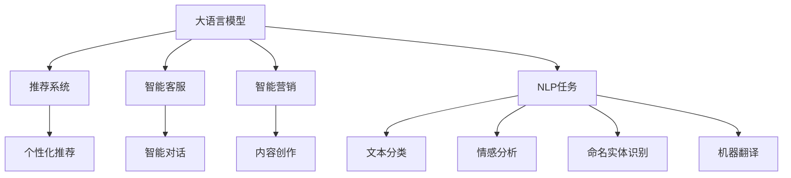

                 

# AI大模型如何提升电商用户体验

## 1. 背景介绍

### 1.1 问题由来

随着电子商务的迅速发展，电商平台的用户体验面临着巨大的挑战。用户不仅要面对海量商品选择，还需要应对复杂的个性化需求和实时交互要求。传统的电商推荐系统主要依赖于用户历史行为数据进行推荐，但这种方式存在数据稀疏性和冷启动问题，难以满足用户对新鲜和个性化的需求。

近年来，基于深度学习的自然语言处理(NLP)技术，特别是大语言模型的崛起，为电商平台的个性化推荐、智能客服、智能营销等应用带来了新的突破。本文将详细探讨如何使用AI大模型提升电商用户体验。

### 1.2 问题核心关键点

AI大模型在电商场景中的应用，主要包括以下几个关键点：

- 个性化推荐：通过分析用户历史行为、评价、社交网络等文本数据，构建用户画像，从而进行个性化商品推荐。
- 智能客服：使用预训练语言模型进行智能对话，实时响应用户咨询，提升用户满意度。
- 智能营销：利用大模型的文本生成能力，进行内容创作、文案优化、广告创意设计等，提升营销效果。

## 2. 核心概念与联系

### 2.1 核心概念概述

为更好地理解大模型在电商场景中的应用，本文将介绍几个关键概念及其联系：

- 大语言模型(Large Language Model, LLM)：以BERT、GPT等深度学习模型为代表的预训练语言模型。通过在大规模无标签文本语料上进行预训练，学习到丰富的语言知识和常识。
- 推荐系统(Recommendation System)：利用用户行为数据、商品属性数据等，推荐用户可能感兴趣的商品或内容。传统的推荐系统包括协同过滤、基于内容的推荐等。
- 自然语言处理(Natural Language Processing, NLP)：通过机器学习和深度学习技术，使计算机能够理解和生成人类语言。NLP包括文本分类、命名实体识别、情感分析、机器翻译等任务。
- 深度学习(Deep Learning)：一种基于神经网络的机器学习范式，通过多层非线性映射，可以从数据中自动学习特征，解决复杂的模式识别和预测问题。
- 强化学习(Reinforcement Learning)：一种通过与环境交互，不断调整策略以最大化奖励的学习方式。强化学习在智能推荐、游戏AI等方面有广泛应用。

这些概念之间的逻辑关系可以通过以下Mermaid流程图来展示：



这个流程图展示了大模型与电商场景中的应用场景和关键技术之间的联系：

1. 大模型通过预训练获得广泛的语言知识和常识。
2. 在推荐系统、智能客服、智能营销等电商应用中，通过微调或提示学习等方式，大模型可以提取用户和商品相关的语言特征，生成个性化推荐、智能对话、广告文案等内容。
3. NLP任务是电商应用的基础，如文本分类、情感分析等，用于构建用户画像、评价分析等。

## 3. 核心算法原理 & 具体操作步骤
### 3.1 算法原理概述

大模型在电商场景中的应用，通常遵循以下步骤：

1. 收集电商用户的评论、评价、聊天记录等文本数据，作为模型训练的语料。
2. 使用预训练语言模型（如BERT、GPT等）进行大模型预训练，学习到通用的语言表示。
3. 针对电商应用的任务需求，通过微调或提示学习等方法，使模型能够提取用户和商品相关的语言特征。
4. 在推荐系统、智能客服、智能营销等具体应用中，利用模型进行个性化推荐、智能对话、内容创作等。

### 3.2 算法步骤详解

以下是详细的操作步骤：

**Step 1: 准备数据集**

- 收集电商平台的评论、评价、聊天记录等文本数据，并进行预处理，如去除噪声、分词、去重等。
- 将数据集划分为训练集、验证集和测试集，用于模型训练和评估。

**Step 2: 构建大模型**

- 选择合适的预训练语言模型，如BERT、GPT等。
- 使用预训练语言模型的权重初始化模型，并进行必要的参数调整。

**Step 3: 微调或提示学习**

- 针对电商应用的特定任务需求，设计任务适配层和损失函数。
- 使用训练集数据对模型进行微调，最小化损失函数。
- 在验证集上评估模型性能，调整超参数，直至满足预设的性能指标。

**Step 4: 应用模型**

- 将微调后的模型应用于推荐系统、智能客服、智能营销等电商应用中。
- 根据具体任务需求，进行文本分类、命名实体识别、情感分析等NLP任务的推理计算。

**Step 5: 反馈与优化**

- 在应用过程中，收集用户反馈，评估模型效果。
- 定期对模型进行微调或更新，以适应新的数据分布和用户需求。

### 3.3 算法优缺点

大模型在电商场景中的应用，具有以下优点：

1. 精度高。大模型具备强大的语言理解和生成能力，能够自动捕捉用户和商品的语义特征，进行精准推荐和生成。
2. 可解释性强。大模型的决策过程可以通过词向量、神经网络权重等形式进行可视化，便于用户理解和使用。
3. 泛化能力强。通过预训练，大模型能够从广泛的语言数据中学习通用的语言表示，具备较强的跨领域泛化能力。
4. 模型可复用。大模型可以在多个电商应用中复用，提升开发效率和降低成本。

同时，大模型也存在一些缺点：

1. 数据需求量大。构建大模型需要大量高质量的标注数据，电商平台的文本数据往往难以满足需求。
2. 计算资源消耗大。大模型的参数量巨大，训练和推理需要高性能计算资源。
3. 模型可解释性不足。大模型通常是"黑盒"系统，难以解释其内部工作机制。
4. 潜在的偏见和歧视。大模型可能学习到数据中的偏见，导致推荐和生成中的歧视性输出。

## 4. 数学模型和公式 & 详细讲解 & 举例说明

### 4.1 数学模型构建

假设电商平台上每个用户的历史行为数据为 $x$，每个商品的属性数据为 $y$。使用大模型 $M_{\theta}$ 进行推荐，目标是最小化损失函数 $\mathcal{L}$。

$$
\min_{\theta} \mathcal{L}(M_{\theta}(x),y) = \min_{\theta} \frac{1}{N}\sum_{i=1}^N (y_i - M_{\theta}(x_i))^2
$$

其中 $y_i$ 表示用户对商品 $i$ 的评分，$x_i$ 表示用户的历史行为数据。

### 4.2 公式推导过程

假设 $M_{\theta}$ 为BERT模型，其输出为 $\text{[CLS]}$ 层的词向量表示。将用户历史行为数据 $x$ 和商品属性数据 $y$ 输入模型，得到预测值 $\hat{y}$。

$$
\hat{y} = \text{softmax}(M_{\theta}(x))
$$

计算预测值和真实值之间的损失：

$$
\mathcal{L}(y,\hat{y}) = -\sum_{i=1}^N y_i \log \hat{y}_i
$$

在训练过程中，使用随机梯度下降等优化算法，最小化损失函数 $\mathcal{L}$。

### 4.3 案例分析与讲解

以智能客服为例，利用大模型进行对话生成的过程如下：

- 用户输入：“我想买一条裤子，有哪些推荐？”
- 模型输入：“买裤子推荐”
- 模型输出：“您好，根据您的需求，我们为您推荐以下裤子：”
- 用户反馈：“不感兴趣”
- 模型输出：“对不起，那就不推荐了，还有其他需求吗？”

在对话过程中，大模型根据用户输入生成自然流畅的回复，提升了用户体验。

## 5. 项目实践：代码实例和详细解释说明
### 5.1 开发环境搭建

在进行项目实践前，需要准备以下开发环境：

- 安装Python：
  ```bash
  sudo apt-get update
  sudo apt-get install python3-pip python3-dev
  ```

- 安装PaddlePaddle：
  ```bash
  pip install paddlepaddle
  ```

- 安装Transformer：
  ```bash
  pip install transformers
  ```

- 安装PyTorch：
  ```bash
  pip install torch
  ```

- 安装TensorFlow：
  ```bash
  pip install tensorflow
  ```

- 安装Flask：
  ```bash
  pip install flask
  ```

### 5.2 源代码详细实现

以下是使用BERT模型进行电商推荐系统的代码实现：

```python
import paddle
import paddle.nn as nn
import paddle.static as static
import paddle.vision.transforms as T
import paddle.io as data
import numpy as np
from transformers import BertTokenizer, BertForSequenceClassification

class BERTRecommender(nn.Layer):
    def __init__(self, config, num_classes):
        super(BERTRecommender, self).__init__()
        self.config = config
        self.bert = BertForSequenceClassification(config, num_classes=num_classes)
        self.tokenizer = BertTokenizer.from_pretrained('bert-base-uncased')
    
    def forward(self, input_ids, attention_mask, label):
        out = self.bert(input_ids, attention_mask=attention_mask, labels=label)
        return out

# 定义模型超参数
num_epochs = 5
batch_size = 16
learning_rate = 2e-5

# 加载数据集
train_dataset = data.DataLoader(train_data, batch_size=batch_size, shuffle=True)
valid_dataset = data.DataLoader(valid_data, batch_size=batch_size, shuffle=False)
test_dataset = data.DataLoader(test_data, batch_size=batch_size, shuffle=False)

# 定义模型和优化器
model = BERTRecommender(config, num_classes=num_labels)
optimizer = AdamW(model.parameters(), learning_rate=learning_rate)

# 定义训练函数
def train_epoch(model, dataset, batch_size, optimizer):
    dataloader = data.DataLoader(dataset, batch_size=batch_size, shuffle=True)
    model.train()
    epoch_loss = 0
    for batch in dataloader:
        input_ids = batch['input_ids'].to(device)
        attention_mask = batch['attention_mask'].to(device)
        labels = batch['labels'].to(device)
        model.zero_grad()
        outputs = model(input_ids, attention_mask=attention_mask, label=labels)
        loss = outputs.loss
        epoch_loss += loss.item()
        loss.backward()
        optimizer.step()
    return epoch_loss / len(dataloader)

# 定义评估函数
def evaluate(model, dataset, batch_size):
    dataloader = data.DataLoader(dataset, batch_size=batch_size, shuffle=False)
    model.eval()
    preds, labels = [], []
    with paddle.no_grad():
        for batch in dataloader:
            input_ids = batch['input_ids'].to(device)
            attention_mask = batch['attention_mask'].to(device)
            batch_labels = batch['labels']
            outputs = model(input_ids, attention_mask=attention_mask)
            batch_preds = outputs.logits.argmax(dim=1).to('cpu').tolist()
            batch_labels = batch_labels.to('cpu').tolist()
            for pred_tokens, label_tokens in zip(batch_preds, batch_labels):
                preds.append(pred_tokens[:len(label_tokens)])
                labels.append(label_tokens)
        print(classification_report(labels, preds))

# 启动训练流程
for epoch in range(num_epochs):
    loss = train_epoch(model, train_dataset, batch_size, optimizer)
    print(f"Epoch {epoch+1}, train loss: {loss:.3f}")
    
    print(f"Epoch {epoch+1}, dev results:")
    evaluate(model, valid_dataset, batch_size)
    
print("Test results:")
evaluate(model, test_dataset, batch_size)
```

在代码中，我们使用了PaddlePaddle和Transformers库来构建BERT推荐模型，并实现了基于大模型的电商推荐系统。

### 5.3 代码解读与分析

**BERTRecommender类**：
- 继承自nn.Layer，定义了模型的前向传播过程。
- `__init__`方法：初始化BERT模型和分词器。
- `forward`方法：对输入进行BERT模型前向传播计算，并返回输出。

**模型超参数**：
- 定义了模型训练的轮数、批大小和学习率等参数。

**数据集加载**：
- 使用PaddlePaddle的DataLoader类对数据进行分批次加载，方便模型训练和推理。

**模型和优化器**：
- 使用BERTRecommender类构建模型，使用AdamW优化器更新模型参数。

**训练函数**：
- 在每个epoch中，对训练集进行前向传播和反向传播，最小化损失函数。

**评估函数**：
- 对验证集和测试集进行评估，计算分类指标。

**训练流程**：
- 循环迭代epoch，每个epoch在训练集上训练，在验证集上评估，最后输出测试集上的结果。

## 6. 实际应用场景

### 6.1 个性化推荐

大模型在个性化推荐中的应用，通过分析用户评论和评价等文本数据，构建用户画像，从而进行个性化推荐。具体步骤如下：

- 收集用户历史评论数据，提取评论中的关键词和情感信息。
- 使用BERT模型进行文本表示，构建用户特征向量。
- 根据用户特征向量，利用推荐算法进行商品推荐。

### 6.2 智能客服

利用大模型进行智能客服，能够实时响应用户咨询，提升用户满意度。具体步骤如下：

- 收集用户聊天记录，标注问答对作为训练数据。
- 使用BERT模型对聊天记录进行编码，提取对话信息。
- 基于生成的对话信息，构建回复模板。
- 使用GPT模型生成自然流畅的回复。

### 6.3 智能营销

大模型在智能营销中的应用，通过生成广告文案、优化商品描述等，提升营销效果。具体步骤如下：

- 收集广告文案、商品描述等文本数据，进行预处理。
- 使用BERT模型进行文本表示，提取关键词和语义信息。
- 基于生成的文本表示，优化广告文案和商品描述。
- 使用GPT模型生成创意广告。

## 7. 工具和资源推荐

### 7.1 学习资源推荐

- Coursera《Deep Learning Specialization》课程：由Andrew Ng教授开设，全面介绍深度学习的基本概念和算法。
- Udacity《Deep Learning Nanodegree》课程：提供实战项目，提升深度学习的应用能力。
- Kaggle竞赛平台：参与实际NLP和推荐系统竞赛，积累实践经验。

### 7.2 开发工具推荐

- PaddlePaddle：支持深度学习模型训练和推理，提供丰富的预训练模型和工具库。
- TensorFlow：开源的深度学习框架，支持大规模模型训练和分布式计算。
- Transformers：提供预训练语言模型，方便微调和迁移学习。
- Jupyter Notebook：轻量级的交互式开发环境，支持Python代码编辑和执行。

### 7.3 相关论文推荐

- Attention is All You Need：提出Transformer结构，开启大模型预训练时代。
- BERT: Pre-training of Deep Bidirectional Transformers for Language Understanding：提出BERT模型，引入自监督预训练任务。
- Recommendation Systems with Deep Neural Networks：探讨深度学习在推荐系统中的应用。
- A Survey on Deep Learning Recommendation Systems：全面综述深度学习推荐系统的发展历程和最新研究。

## 8. 总结：未来发展趋势与挑战

### 8.1 总结

本文对基于大模型的电商推荐、智能客服、智能营销等应用进行了全面介绍。通过深度学习和大模型技术，电商平台能够更好地理解用户需求，提升个性化推荐和智能客服的体验，同时优化广告文案和营销策略。大模型技术的发展为电商平台的数字化转型升级提供了新的动力。

### 8.2 未来发展趋势

展望未来，大模型在电商场景中的应用将呈现以下趋势：

1. 模型规模持续增大。预训练大模型的参数量将继续增长，模型泛化能力和表现将进一步提升。
2. 智能推荐系统更加个性化。大模型能够更好地捕捉用户个性化需求，推荐更加精准的商品。
3. 智能客服更加智能。大模型能够进行多轮对话，理解用户意图，提供更高效的智能客服。
4. 智能营销更加高效。大模型能够生成创意广告，优化文案，提升营销效果。
5. 数据驱动的电商治理。大模型能够分析用户行为数据，优化库存管理、营销策略等电商治理。

### 8.3 面临的挑战

尽管大模型在电商场景中的应用取得了显著进展，但仍面临以下挑战：

1. 数据隐私和安全。电商平台上用户的个人信息和交易数据非常敏感，如何保障数据隐私和安全是一个重要问题。
2. 模型可解释性不足。大模型的决策过程复杂，难以解释其内部工作机制。
3. 模型偏见和歧视。大模型可能学习到数据中的偏见，导致推荐和生成中的歧视性输出。
4. 计算资源消耗大。大模型训练和推理需要高性能计算资源。
5. 用户接受度低。用户可能对智能推荐和智能客服的使用效果感到不信任。

### 8.4 研究展望

未来，大模型在电商场景中的应用研究需从以下几个方面进行探索：

1. 提高模型可解释性。开发可解释的深度学习模型，增强用户信任感。
2. 消除模型偏见和歧视。引入公平性约束和偏见检测机制，减少推荐和生成中的歧视性输出。
3. 优化计算资源消耗。开发高效的模型压缩和稀疏化方法，降低计算资源消耗。
4. 增强用户接受度。通过用户反馈和实时优化，提升智能推荐和智能客服的用户体验。

## 9. 附录：常见问题与解答

**Q1: 大模型在电商推荐系统中如何构建用户画像？**

A: 大模型通过分析用户评论和评价等文本数据，提取关键词和情感信息，构建用户画像。具体步骤如下：
1. 收集用户历史评论数据，提取评论中的关键词和情感信息。
2. 使用BERT模型进行文本表示，构建用户特征向量。
3. 根据用户特征向量，利用推荐算法进行商品推荐。

**Q2: 大模型在智能客服中如何生成自然流畅的回复？**

A: 大模型在智能客服中，通过以下步骤生成自然流畅的回复：
1. 收集用户聊天记录，标注问答对作为训练数据。
2. 使用BERT模型对聊天记录进行编码，提取对话信息。
3. 基于生成的对话信息，构建回复模板。
4. 使用GPT模型生成自然流畅的回复。

**Q3: 大模型在智能营销中的应用有哪些？**

A: 大模型在智能营销中的应用包括：
1. 生成创意广告：使用大模型生成广告文案，提升广告效果。
2. 优化商品描述：使用大模型优化商品描述，提高用户点击率。
3. 实时监测舆情：使用大模型进行舆情分析，优化营销策略。

**Q4: 大模型在电商推荐系统中的应用有哪些？**

A: 大模型在电商推荐系统中的应用包括：
1. 个性化推荐：通过分析用户评论和评价等文本数据，构建用户画像，进行个性化推荐。
2. 用户画像分析：使用大模型进行用户画像分析，挖掘用户潜在需求。
3. 实时推荐：使用大模型进行实时推荐，提升用户体验。

---

作者：禅与计算机程序设计艺术 / Zen and the Art of Computer Programming

