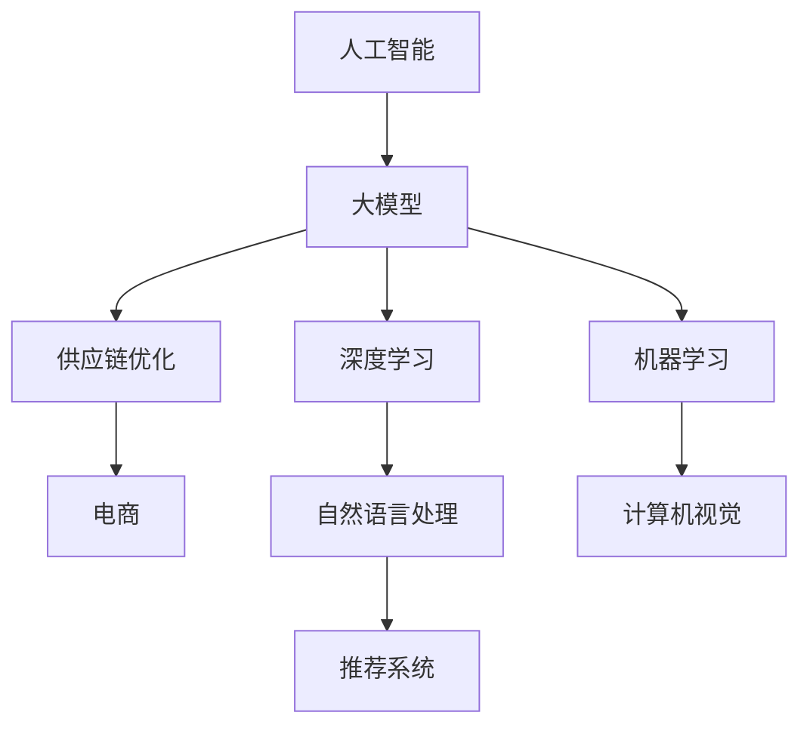

                 

# AI大模型对电商供应链优化的影响

> 关键词：人工智能,大模型,供应链优化,电商,机器学习

## 1. 背景介绍

### 1.1 问题由来
在当今快速变化的电子商务市场中，供应链管理已成为企业竞争力提升的关键。传统的供应链管理依赖人工经验，不仅效率低下，而且难以应对市场波动和需求变化。随着人工智能和大模型的崛起，利用AI技术优化供应链管理，提高响应速度和运营效率，成为企业的迫切需求。

AI大模型，如BERT、GPT等，在语言处理、图像识别、语音识别等任务中展现出了强大的能力。但它们在电商供应链优化中的应用尚处于初步探索阶段。如何利用大模型自动化处理供应链数据，提高供应链决策的智能化水平，是本文探讨的重点。

### 1.2 问题核心关键点
大模型在电商供应链优化中的应用，主要集中在以下几个核心点：
- 数据处理与分析：利用大模型进行供应链数据清洗、分类、预测，提高数据处理的自动化和准确性。
- 需求预测与库存管理：通过大模型预测销售趋势和库存需求，优化库存水平和补货策略。
- 物流路径规划：利用大模型优化物流路径，提升物流效率和成本控制。
- 异常检测与响应：利用大模型实时监控供应链异常，快速响应并解决问题。
- 客户满意度提升：通过大模型分析客户行为，提供个性化推荐和服务，提升客户满意度。

本文将深入探讨这些核心点，并结合实际案例，分析大模型在电商供应链优化中的潜在影响和应用场景。

## 2. 核心概念与联系

### 2.1 核心概念概述

为了更好地理解大模型在电商供应链优化中的应用，本节将介绍几个关键概念：

- 人工智能(AI)：利用计算机模拟人类智能行为的技术，包括机器学习、深度学习等。
- 大模型(Large Model)：指具有大规模参数量、高复杂度的深度神经网络模型，如BERT、GPT等。
- 供应链优化(Supply Chain Optimization)：通过各种方法（如算法、模型等）对供应链中的各个环节进行优化，以提高运营效率、降低成本、提高响应速度等。
- 电商(E-commerce)：指通过互联网进行商品和服务的买卖活动，以在线方式实现交易和物流。
- 机器学习(Machine Learning)：通过数据训练算法模型，使其具备自动学习、推理和决策的能力。
- 深度学习(Deep Learning)：一种特殊的机器学习方法，通过构建多层次神经网络，从数据中学习到更抽象的特征表示。
- 自然语言处理(NLP)：处理和分析人类语言的技术，包括语音识别、文本分类、情感分析等。
- 计算机视觉(Computer Vision)：使计算机具备"看"的能力，能够理解和处理视觉信息，如图像识别、目标检测等。
- 推荐系统(Recommendation System)：根据用户历史行为和兴趣，推荐相关产品和服务，提升用户体验和购买转化率。

这些核心概念之间的逻辑关系可以通过以下Mermaid流程图来展示：



这个流程图展示了大模型在供应链优化中的应用框架：

1. 大模型通过学习大量数据，提取到复杂的特征表示，进而辅助供应链优化。
2. 供应链优化包括各种方法，其中机器学习和深度学习是主要的技术手段。
3. 电商作为应用场景，通过大模型和供应链优化技术实现业务流程的自动化和智能化。
4. 大模型在机器学习、深度学习、自然语言处理等领域的应用，使其能够处理电商供应链中的各种数据。
5. 推荐系统通过大模型和供应链优化技术，提供个性化的商品和服务推荐，提升客户体验和满意度。

## 3. 核心算法原理 & 具体操作步骤
### 3.1 算法原理概述

基于大模型的电商供应链优化，本质上是利用深度学习模型，通过数据分析、预测和优化，提高供应链的自动化和智能化水平。其核心思想是：

1. 利用大模型学习供应链数据的特征表示。
2. 通过预测和优化，提升供应链管理的效率和响应速度。
3. 在电商场景中，通过客户数据分析和个性化推荐，提升客户满意度和忠诚度。

大模型在电商供应链优化中的应用，主要通过以下步骤实现：

1. 数据收集与预处理：收集供应链各环节的相关数据，并进行清洗、标注和归一化处理。
2. 特征提取与表示学习：利用大模型学习数据中的特征表示，提取有意义的信号。
3. 预测与优化：利用机器学习算法，对供应链各环节进行预测和优化，提升决策的智能化水平。
4. 实时监控与响应：利用大模型实时监控供应链异常，快速响应并解决问题。
5. 个性化推荐：利用大模型分析客户行为，提供个性化的推荐和服务，提升客户满意度。

### 3.2 算法步骤详解

以下是电商供应链优化中大模型的操作步骤：

**Step 1: 数据收集与预处理**

1. 供应链数据收集：包括库存数据、物流数据、销售数据、客户数据等，形成结构化或非结构化的数据集。
2. 数据清洗与标注：清洗数据中的噪声和异常值，标注数据中的类别和属性。
3. 数据归一化与编码：对数据进行归一化处理，将其转化为模型可接受的数值形式。

**Step 2: 特征提取与表示学习**

1. 数据输入与嵌入：将预处理后的数据输入大模型，通过嵌入层（Embedding Layer）将其转化为高维向量表示。
2. 特征学习与表示：利用大模型的自适应特征学习机制，学习到数据的隐含特征表示。
3. 表示增强与融合：通过融合多种数据源（如文本、图像、时间序列等），增强表示学习的效果。

**Step 3: 预测与优化**

1. 预测模型训练：利用预测模型（如线性回归、逻辑回归、神经网络等），对供应链数据进行预测，如需求预测、库存优化、物流路径规划等。
2. 模型评估与调优：在验证集上评估模型的预测性能，通过交叉验证和超参数调优，提升模型的准确性和泛化能力。
3. 优化策略制定：根据预测结果，制定供应链优化策略，如调整库存水平、优化物流路径、实时监控异常等。

**Step 4: 实时监控与响应**

1. 实时数据采集：利用传感器、监控系统等实时采集供应链各环节的数据。
2. 异常检测与识别：利用大模型实时监控供应链数据，识别异常情况（如断货、物流延迟等）。
3. 异常响应与处理：根据异常检测结果，自动触发供应链优化策略，及时处理异常问题。

**Step 5: 个性化推荐**

1. 客户数据收集与分析：收集客户的历史购买记录、浏览行为、评价反馈等数据。
2. 推荐模型训练：利用大模型训练推荐模型，根据客户数据生成个性化推荐。
3. 推荐策略执行：将个性化推荐嵌入电商系统，提升客户满意度和忠诚度。

### 3.3 算法优缺点

基于大模型的电商供应链优化方法，具有以下优点：

1. 自动化程度高：利用大模型自动化处理供应链数据，减少人工干预，提高效率和准确性。
2. 预测能力强：大模型具备强大的特征学习能力，能够从海量数据中提取有意义的信号，提升预测精度。
3. 可扩展性强：大模型可以处理各种类型的电商数据，具有较强的泛化能力，适用于不同规模和场景的供应链管理。
4. 实时响应能力：通过实时监控供应链异常，快速响应并解决问题，提升供应链的稳定性和可靠性。

同时，该方法也存在一些局限性：

1. 数据依赖性强：大模型依赖高质量的数据进行训练，数据收集和标注成本较高。
2. 模型复杂度高：大模型的训练和推理过程复杂，需要较高的计算资源和时间成本。
3. 模型可解释性不足：大模型通常是"黑盒"系统，难以解释其内部工作机制，缺乏透明性。
4. 模型风险易传递：大模型可能学习到数据中的噪声和偏见，影响预测结果和优化策略。

尽管存在这些局限性，但就目前而言，基于大模型的电商供应链优化方法，仍然具有广阔的应用前景和较高的技术优势。未来相关研究的重点在于如何进一步降低数据依赖，提高模型的可解释性和鲁棒性，同时兼顾计算效率和资源成本。

### 3.4 算法应用领域

基于大模型的电商供应链优化方法，已经在以下几个领域得到了广泛应用：

1. **需求预测与库存管理**：利用大模型预测销售趋势和库存需求，优化库存水平和补货策略。
2. **物流路径规划**：利用大模型优化物流路径，提升物流效率和成本控制。
3. **异常检测与响应**：利用大模型实时监控供应链异常，快速响应并解决问题。
4. **客户满意度提升**：通过大模型分析客户行为，提供个性化推荐和服务，提升客户满意度。

除了上述这些经典应用外，大模型还被创新性地应用到更多场景中，如供应商管理、生产调度、售后服务等，为电商供应链管理带来了新的突破。随着预训练模型和微调方法的不断进步，相信大模型在电商供应链优化中的应用场景将不断拓展，为电商企业带来更高的运营效率和客户体验。

## 4. 数学模型和公式 & 详细讲解  
### 4.1 数学模型构建

为了更好地理解基于大模型的电商供应链优化方法，本节将使用数学语言对相关模型进行详细刻画。

记供应链数据集为 $D=\{(x_i, y_i)\}_{i=1}^N, x_i \in \mathcal{X}, y_i \in \mathcal{Y}$，其中 $\mathcal{X}$ 为输入空间，$\mathcal{Y}$ 为输出空间。假设模型 $M_{\theta}$ 为训练后的深度神经网络，$\theta$ 为模型参数。

供应链优化的目标是最小化预测误差，即找到最优参数：

$$
\theta^* = \mathop{\arg\min}_{\theta} \frac{1}{N} \sum_{i=1}^N \ell(M_{\theta}(x_i),y_i)
$$

其中 $\ell$ 为损失函数，用于衡量模型预测输出与真实标签之间的差异。常见的损失函数包括均方误差、交叉熵损失等。

在实践中，我们通常使用梯度下降等优化算法来近似求解上述最优化问题。设 $\eta$ 为学习率，$\nabla_{\theta}\ell$ 为损失函数对参数 $\theta$ 的梯度，则参数的更新公式为：

$$
\theta \leftarrow \theta - \eta \nabla_{\theta}\ell
$$

其中 $\nabla_{\theta}\ell$ 可通过反向传播算法高效计算。

### 4.2 公式推导过程

以下我们以需求预测任务为例，推导线性回归模型的损失函数及其梯度的计算公式。

假设模型 $M_{\theta}$ 在输入 $x$ 上的预测为 $\hat{y}=M_{\theta}(x)$，则线性回归模型的损失函数定义为：

$$
\ell(M_{\theta}(x),y) = \frac{1}{2} (y - \hat{y})^2
$$

将其代入经验风险公式，得：

$$
\mathcal{L}(\theta) = \frac{1}{N} \sum_{i=1}^N \frac{1}{2} (y_i - M_{\theta}(x_i))^2
$$

根据链式法则，损失函数对参数 $\theta_k$ 的梯度为：

$$
\frac{\partial \mathcal{L}(\theta)}{\partial \theta_k} = -\frac{1}{N} \sum_{i=1}^N \frac{\partial}{\partial \theta_k} [(y_i - M_{\theta}(x_i))^2]
$$

将上述公式展开，利用自动微分技术完成计算。

在得到损失函数的梯度后，即可带入参数更新公式，完成模型的迭代优化。重复上述过程直至收敛，最终得到适应电商供应链优化任务的最优模型参数 $\theta^*$。

## 5. 项目实践：代码实例和详细解释说明
### 5.1 开发环境搭建

在进行电商供应链优化项目开发前，我们需要准备好开发环境。以下是使用Python进行TensorFlow开发的环境配置流程：

1. 安装Anaconda：从官网下载并安装Anaconda，用于创建独立的Python环境。

2. 创建并激活虚拟环境：
```bash
conda create -n tf-env python=3.8 
conda activate tf-env
```

3. 安装TensorFlow：根据CUDA版本，从官网获取对应的安装命令。例如：
```bash
conda install tensorflow -c tf -c conda-forge
```

4. 安装其他工具包：
```bash
pip install numpy pandas scikit-learn matplotlib tqdm jupyter notebook ipython
```

完成上述步骤后，即可在`tf-env`环境中开始项目开发。

### 5.2 源代码详细实现

下面我们以需求预测任务为例，给出使用TensorFlow进行大模型训练的PyTorch代码实现。

首先，定义需求预测任务的数据处理函数：

```python
import tensorflow as tf
from tensorflow.keras.layers import Input, Dense, Dropout
from tensorflow.keras.models import Model

def create_model(input_dim, output_dim):
    input = Input(shape=(input_dim,))
    x = Dense(64, activation='relu')(input)
    x = Dropout(0.5)(x)
    x = Dense(32, activation='relu')(x)
    x = Dropout(0.5)(x)
    output = Dense(output_dim, activation='sigmoid')(x)
    model = Model(inputs=input, outputs=output)
    model.compile(optimizer='adam', loss='binary_crossentropy', metrics=['accuracy'])
    return model
```

然后，定义训练和评估函数：

```python
from tensorflow.keras.datasets import boston_housing
from sklearn.model_selection import train_test_split

# 加载数据集
(X_train, y_train), (X_test, y_test) = boston_housing.load_data()

# 数据预处理
X_train = X_train.reshape((X_train.shape[0], X_train.shape[1]))
X_test = X_test.reshape((X_test.shape[0], X_test.shape[1]))

# 将数据归一化到0-1之间
X_train = (X_train - X_train.min()) / (X_train.max() - X_train.min())
X_test = (X_test - X_test.min()) / (X_test.max() - X_test.min())

# 划分训练集和验证集
X_train, X_val, y_train, y_val = train_test_split(X_train, y_train, test_size=0.2, random_state=42)

# 创建模型
model = create_model(X_train.shape[1], 1)

# 训练模型
model.fit(X_train, y_train, epochs=100, batch_size=32, validation_data=(X_val, y_val))

# 评估模型
model.evaluate(X_test, y_test)
```

最后，启动模型训练并在测试集上评估：

```python
# 训练模型
model.fit(X_train, y_train, epochs=100, batch_size=32, validation_data=(X_val, y_val))

# 评估模型
model.evaluate(X_test, y_test)
```

以上就是使用TensorFlow对需求预测任务进行大模型训练的完整代码实现。可以看到，TensorFlow的高级API使得模型构建和训练过程非常简单，可以方便地进行模型调参和评估。

### 5.3 代码解读与分析

让我们再详细解读一下关键代码的实现细节：

**create_model函数**：
- 定义输入层，使用`Input`函数创建，指定输入维度为`input_dim`。
- 定义多个全连接层，使用`Dense`函数创建，指定激活函数为`relu`，添加`Dropout`层以防止过拟合。
- 定义输出层，使用`Dense`函数创建，指定激活函数为`sigmoid`，输出预测值。
- 创建模型，使用`Model`函数创建，指定输入和输出层。
- 编译模型，使用`compile`函数指定优化器、损失函数和评估指标。

**数据预处理**：
- 将数据集分为特征和标签，并归一化到0-1之间。
- 使用`train_test_split`函数将数据集划分为训练集和验证集。

**模型训练与评估**：
- 使用`fit`函数进行模型训练，指定训练数据、批量大小、迭代轮数和验证数据。
- 使用`evaluate`函数在测试集上评估模型性能，输出准确率和损失。

可以看出，TensorFlow的高层次API使得模型构建和训练过程非常简单，开发者可以轻松上手进行实验和开发。但随着项目规模的扩大，合理利用TensorBoard等工具进行模型监控和调试，也是非常重要的。

## 6. 实际应用场景
### 6.1 需求预测与库存管理

利用大模型进行需求预测和库存管理，可以显著提高电商供应链的响应速度和运营效率。

**案例分析**：某大型电商平台通过大模型分析历史销售数据，预测未来一个月内的商品需求，并根据预测结果进行库存调整。首先，收集过去一年的销售数据、促销活动、季节性因素等，输入大模型进行训练。然后，在每个月的月初，将当前时间和天气等实时数据作为输入，预测未来一个月的需求量。根据预测结果，调整各仓库的库存水平，确保在需求高峰期有足够的商品供应。通过这种方式，电商平台能够避免断货和过度库存，减少缺货和滞销风险，提升客户满意度和运营效率。

### 6.2 物流路径规划

利用大模型进行物流路径规划，可以优化物流成本，提高配送效率。

**案例分析**：某电商物流公司通过大模型分析订单数据和配送历史，优化物流路径和运输方式。首先，收集订单数据和配送历史，输入大模型进行训练。然后，对于每笔新订单，将订单地址和配送方式作为输入，预测最优的物流路径和运输方式。根据预测结果，生成配送计划，调度车辆和司机进行配送。通过这种方式，物流公司能够优化配送路线，减少运输成本，提高配送效率，提升客户满意度。

### 6.3 异常检测与响应

利用大模型进行供应链异常检测与响应，可以及时发现并解决供应链中的问题，提高供应链的稳定性和可靠性。

**案例分析**：某制造业企业通过大模型实时监控生产过程中的异常情况，快速响应并解决问题。首先，收集生产数据、设备状态、工人反馈等，输入大模型进行训练。然后，在生产过程中，实时采集设备数据和工人反馈，输入大模型进行异常检测。根据检测结果，自动触发相应的预警和应对措施，如调整生产计划、更换设备、加强培训等。通过这种方式，企业能够及时发现并解决生产中的问题，降低停机时间和生产成本，提高产品质量和生产效率。

### 6.4 客户满意度提升

利用大模型进行客户满意度分析，可以提升客户体验和忠诚度，增加客户留存率。

**案例分析**：某电商平台通过大模型分析客户行为和评价反馈，提供个性化的推荐和服务。首先，收集客户的历史浏览记录、购买记录、评价反馈等数据，输入大模型进行训练。然后，在客户访问网站时，根据客户的浏览行为和历史数据，生成个性化的推荐和优惠券。通过这种方式，客户能够获得更加个性化的购物体验，增加购买的转化率和忠诚度，提升客户满意度和企业收益。

### 6.5 供应商管理

利用大模型进行供应商管理，可以优化供应商选择和合作，提升供应链的整体效率和效益。

**案例分析**：某企业通过大模型分析供应商的历史表现、合作关系和市场环境，选择最优的供应商。首先，收集供应商的历史订单数据、交货时间、质量评估等数据，输入大模型进行训练。然后，根据训练结果，选择最优的供应商进行合作。通过这种方式，企业能够优化供应商选择和合作策略，降低采购成本，提高供应链的稳定性和可靠性。

## 7. 工具和资源推荐
### 7.1 学习资源推荐

为了帮助开发者系统掌握大模型在电商供应链优化中的应用，这里推荐一些优质的学习资源：

1. 《TensorFlow官方文档》：官方文档提供了详细的TensorFlow使用指南，涵盖模型构建、训练、评估等各个方面。
2. 《深度学习实战》：深度学习领域的经典书籍，涵盖了深度学习模型的构建、训练、优化等核心内容。
3. 《机器学习实战》：机器学习领域的入门书籍，介绍了常见的机器学习算法和应用场景。
4. 《计算机视觉基础》：计算机视觉领域的经典教材，介绍了图像处理、特征提取、目标检测等核心内容。
5. 《自然语言处理基础》：自然语言处理领域的经典教材，介绍了文本处理、情感分析、信息抽取等核心内容。
6. 《推荐系统实战》：推荐系统领域的经典教材，介绍了推荐算法的构建、优化和应用。

通过对这些资源的学习实践，相信你一定能够系统掌握大模型在电商供应链优化中的关键技术，并应用于实际的业务场景。

### 7.2 开发工具推荐

高效的开发离不开优秀的工具支持。以下是几款用于大模型电商供应链优化开发的常用工具：

1. TensorFlow：由Google主导开发的开源深度学习框架，生产部署方便，适合大规模工程应用。
2. PyTorch：基于Python的开源深度学习框架，灵活动态的计算图，适合快速迭代研究。
3. Jupyter Notebook：交互式笔记本环境，方便进行数据处理和模型开发。
4. Weights & Biases：模型训练的实验跟踪工具，可以记录和可视化模型训练过程中的各项指标。
5. TensorBoard：TensorFlow配套的可视化工具，可实时监测模型训练状态，并提供丰富的图表呈现方式。
6. GitHub：代码托管平台，方便进行项目管理和版本控制。

合理利用这些工具，可以显著提升大模型电商供应链优化项目的开发效率，加快创新迭代的步伐。

### 7.3 相关论文推荐

大模型在电商供应链优化中的应用，源于学界的持续研究。以下是几篇奠基性的相关论文，推荐阅读：

1. Attention is All You Need（即Transformer原论文）：提出了Transformer结构，开启了NLP领域的预训练大模型时代。
2. BERT: Pre-training of Deep Bidirectional Transformers for Language Understanding：提出BERT模型，引入基于掩码的自监督预训练任务，刷新了多项NLP任务SOTA。
3. Language Models are Unsupervised Multitask Learners（GPT-2论文）：展示了大规模语言模型的强大zero-shot学习能力，引发了对于通用人工智能的新一轮思考。
4. Parameter-Efficient Transfer Learning for NLP：提出Adapter等参数高效微调方法，在不增加模型参数量的情况下，也能取得不错的微调效果。
5. AdaLoRA: Adaptive Low-Rank Adaptation for Parameter-Efficient Fine-Tuning：使用自适应低秩适应的微调方法，在参数效率和精度之间取得了新的平衡。

这些论文代表了大模型在电商供应链优化中的应用发展脉络。通过学习这些前沿成果，可以帮助研究者把握学科前进方向，激发更多的创新灵感。

## 8. 总结：未来发展趋势与挑战

### 8.1 总结

本文对基于大模型的电商供应链优化方法进行了全面系统的介绍。首先阐述了大模型和微调技术的研究背景和意义，明确了电商供应链优化的核心关键点。其次，从原理到实践，详细讲解了基于大模型的电商供应链优化方法，给出了具体的代码实现和分析。同时，本文还广泛探讨了电商供应链优化中的实际应用场景，展示了大模型在电商供应链优化中的潜在影响和应用前景。

通过本文的系统梳理，可以看到，基于大模型的电商供应链优化方法正在成为电商行业的重要范式，极大地提高了供应链管理的自动化和智能化水平，为电商企业带来了更高的运营效率和客户体验。未来，伴随预训练模型和微调方法的不断进步，相信大模型在电商供应链优化中的应用场景将不断拓展，为电商企业带来更大的价值。

### 8.2 未来发展趋势

展望未来，大模型在电商供应链优化中的应用将呈现以下几个发展趋势：

1. **数据驱动的优化**：随着数据的不断积累和算法技术的进步，大模型将更加依赖数据驱动的优化，减少人工干预，提升决策的准确性和智能性。
2. **多模态融合**：大模型将结合图像、语音、文本等多种模态的数据，进行更全面、更深入的特征学习，提升供应链优化的效果。
3. **实时响应**：大模型将实现实时监控和响应，及时发现并解决供应链中的问题，提高供应链的稳定性和可靠性。
4. **个性化推荐**：大模型将结合客户行为和历史数据，提供更加个性化的推荐和服务，提升客户满意度和忠诚度。
5. **跨领域应用**：大模型将应用于不同行业和场景的供应链优化，推动各行业的数字化转型升级。
6. **自动化与智能化**：大模型将实现更高程度的自动化和智能化，逐步替代人工决策，提高运营效率和效益。

这些趋势凸显了大模型在电商供应链优化中的广阔前景。这些方向的探索发展，必将进一步提升供应链管理的自动化和智能化水平，为电商企业带来更高的运营效率和客户体验。

### 8.3 面临的挑战

尽管大模型在电商供应链优化中展现出了巨大的潜力，但在实际应用中，仍面临诸多挑战：

1. **数据质量问题**：电商供应链管理涉及大量复杂数据，数据质量差、数据不完整等问题可能导致模型性能下降。
2. **模型鲁棒性不足**：大模型可能学习到数据中的噪声和偏见，影响预测结果和优化策略，降低模型的鲁棒性。
3. **计算资源消耗**：大模型需要大量的计算资源进行训练和推理，可能面临算力不足和成本过高的问题。
4. **模型可解释性不足**：大模型通常是"黑盒"系统，难以解释其内部工作机制和决策逻辑，缺乏透明性。
5. **安全性和隐私保护**：电商供应链数据涉及敏感信息，数据泄露和滥用可能导致安全风险和隐私问题。
6. **跨模态数据整合**：多模态数据的整合和融合，需要解决数据格式、特征表示等技术问题，增加应用难度。

这些挑战需要在未来的研究中进行进一步突破，才能真正实现大模型在电商供应链优化中的应用。

### 8.4 研究展望

面对电商供应链优化中的诸多挑战，未来的研究需要在以下几个方面寻求新的突破：

1. **数据增强与数据清洗**：研究更加高效的数据增强和清洗技术，提升数据质量和完整性，减少数据噪声和偏见。
2. **模型鲁棒性与泛化能力**：开发更加鲁棒和泛化的模型，提高模型在不同数据分布下的表现。
3. **自动化与智能化优化**：研究更加自动化和智能化的供应链优化策略，减少人工干预，提高运营效率。
4. **模型可解释性与透明性**：开发更加可解释和透明的模型，提供模型决策的因果解释，增强模型的可信度和可控性。
5. **跨模态数据融合**：研究跨模态数据整合与融合技术，实现多模态数据的协同建模，提升供应链管理的全面性和深度。
6. **安全与隐私保护**：研究数据安全与隐私保护技术，确保电商供应链数据的保密性和安全性。

这些研究方向的探索，必将引领大模型在电商供应链优化中的应用走向更高的台阶，为电商企业带来更高的运营效率和客户体验。

## 9. 附录：常见问题与解答

**Q1：大模型在电商供应链优化中是否适合所有应用场景？**

A: 大模型在电商供应链优化中具有广泛的应用前景，但并非所有场景都适合。例如，对于一些对实时性要求极高的场景，如高价值商品配送，大模型可能无法满足实时性要求。此时，需要结合其他技术手段，如传统算法和规则引擎，进行综合优化。

**Q2：如何选择合适的学习率？**

A: 学习率的选取对模型训练效果有着重要影响。一般建议从小学习率开始，逐步增加，观察模型性能的变化。可以根据验证集的损失和准确率，动态调整学习率，以达到最优训练效果。

**Q3：大模型在电商供应链优化中面临哪些挑战？**

A: 大模型在电商供应链优化中面临的主要挑战包括数据质量问题、模型鲁棒性不足、计算资源消耗大、模型可解释性不足、安全性和隐私保护问题等。需要从数据预处理、模型设计、计算优化等多个角度进行综合考虑，才能真正发挥大模型的潜力。

**Q4：如何在电商供应链优化中应用大模型？**

A: 在电商供应链优化中应用大模型，主要分为以下几个步骤：
1. 数据收集与预处理：收集供应链各环节的相关数据，并进行清洗、标注和归一化处理。
2. 特征提取与表示学习：利用大模型学习数据中的特征表示，提取有意义的信号。
3. 预测与优化：利用机器学习算法，对供应链各环节进行预测和优化，提升决策的智能化水平。
4. 实时监控与响应：利用大模型实时监控供应链异常，快速响应并解决问题。
5. 个性化推荐：利用大模型分析客户行为，提供个性化的推荐和服务，提升客户满意度。

**Q5：电商供应链优化中大模型的实际应用场景有哪些？**

A: 大模型在电商供应链优化中的应用场景主要包括以下几个方面：
1. 需求预测与库存管理：利用大模型预测未来需求，优化库存水平和补货策略。
2. 物流路径规划：利用大模型优化物流路径，提高配送效率和成本控制。
3. 异常检测与响应：利用大模型实时监控供应链异常，快速响应并解决问题。
4. 客户满意度提升：利用大模型分析客户行为，提供个性化的推荐和服务。
5. 供应商管理：利用大模型分析供应商的历史表现和合作关系，优化供应商选择和合作策略。

通过对这些问题的解答，相信读者能够更好地理解大模型在电商供应链优化中的核心技术要点和实际应用场景，为后续的研究和实践提供有益的参考。

---

作者：禅与计算机程序设计艺术 / Zen and the Art of Computer Programming

