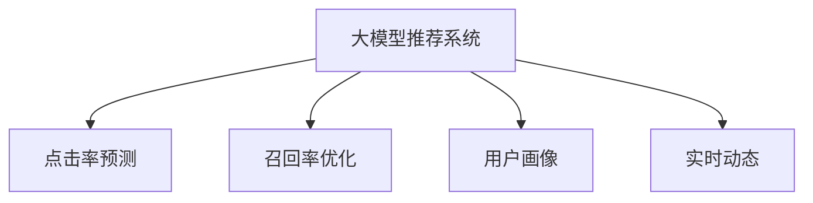

                 

# AI大模型视角下电商搜索推荐的创新与变革

> 关键词：大模型推荐系统, 电商搜索推荐, 点击率预测, 召回率优化, 用户画像, 实时动态

## 1. 背景介绍

随着电子商务的发展，消费者对于商品搜索推荐的准确性和个性化需求日益增加。传统的推荐系统往往依赖于浅层特征提取和统计方法，难以有效捕捉用户多维度的兴趣和行为特征。而基于深度学习的大模型推荐系统，凭借其强大的表示学习能力和泛化能力，正成为电商搜索推荐领域的重要突破口。

大模型推荐系统，指的是利用大规模预训练语言模型（如BERT、GPT等），通过在大规模数据上预训练，然后结合特定电商场景的任务进行微调，从而实现高效、精准的搜索推荐。相较于传统的基于规则、统计的推荐系统，大模型推荐系统能够自适应地学习复杂的用户行为模式和商品属性关系，提供更个性化和多样化的推荐结果。

然而，大模型推荐系统在实际应用中也面临诸多挑战。如何在大规模电商数据中高效抽取用户兴趣，如何优化模型以提升推荐准确性和用户体验，如何平衡推荐结果的个性化与多样性等，都是亟待解决的问题。本文将围绕这些问题展开讨论，从大模型的视角下，介绍电商搜索推荐技术的前沿实践和创新方向。

## 2. 核心概念与联系

### 2.1 核心概念概述

为更好地理解电商搜索推荐系统的构建，本节将介绍几个关键概念：

- **大模型推荐系统**：利用预训练语言模型，通过电商数据微调训练推荐模型的范式。常见的大模型如BERT、GPT等，可以在大规模数据上进行预训练，然后针对电商任务进行微调，提供高效的个性化推荐。
- **点击率预测**：预测用户点击商品的概率，是电商推荐系统的重要评估指标之一。预测准确率直接影响到推荐的排名和策略调整。
- **召回率优化**：通过优化召回列表，提升推荐系统的覆盖率，确保用户能够看到更多符合自己兴趣的商品。
- **用户画像**：通过用户历史行为数据，构建用户兴趣模型，辅助推荐系统理解用户需求，提供更加个性化的推荐。
- **实时动态**：结合用户即时行为数据，实时更新推荐结果，提高推荐的及时性和准确性。

这些核心概念之间的逻辑关系可以通过以下Mermaid流程图来展示：



这个流程图展示了电商推荐系统的核心组件及其关系：

1. **大模型推荐系统**：利用大模型对电商数据进行预训练和微调。
2. **点击率预测**：通过大模型预测用户点击行为，优化推荐策略。
3. **召回率优化**：根据用户画像和实时数据，优化召回列表，提升推荐覆盖率。
4. **用户画像**：构建用户兴趣模型，辅助推荐决策。
5. **实时动态**：根据用户即时行为，实时调整推荐结果，提高推荐效果。

## 3. 核心算法原理 & 具体操作步骤
### 3.1 算法原理概述

基于大模型的电商搜索推荐系统，其核心原理可以概括为以下步骤：

1. **数据准备**：收集电商数据，包括用户行为记录、商品属性、交易记录等，构建电商数据集。
2. **预训练大模型**：在大规模电商数据上，使用预训练语言模型（如BERT、GPT）进行预训练，学习通用的语言和商品表示。
3. **微调推荐模型**：在预训练模型基础上，针对电商搜索推荐任务进行微调，优化模型预测准确率和召回率。
4. **用户画像构建**：根据用户历史行为数据，构建用户兴趣模型，辅助推荐系统理解用户需求。
5. **实时动态推荐**：结合用户即时行为数据，实时更新推荐结果，提高推荐的及时性和准确性。

### 3.2 算法步骤详解

以下是电商搜索推荐系统在大模型视角下的具体实现步骤：

**Step 1: 数据准备**

- 收集电商数据：包括用户行为记录、商品属性、交易记录等，构建电商数据集。
- 数据预处理：清洗数据，去除噪声，填充缺失值，构建特征向量。

**Step 2: 预训练大模型**

- 选择合适的预训练模型，如BERT、GPT等，进行预训练。
- 在大规模电商数据上进行预训练，学习通用的语言和商品表示。

**Step 3: 微调推荐模型**

- 设计任务适配层：根据电商推荐任务，设计合适的输出层和损失函数。
- 选择优化算法和超参数：如AdamW、SGD等，设置学习率、批大小、迭代轮数等。
- 添加正则化技术：如L2正则、Dropout、Early Stopping等，防止过拟合。
- 设置微调策略：如仅微调顶层，或全部参数都参与微调。

**Step 4: 用户画像构建**

- 收集用户历史行为数据：浏览、点击、购买等。
- 构建用户兴趣模型：如基于协同过滤、序列建模等方法，构建用户画像。
- 结合大模型表示：使用大模型提取用户和商品的特征向量，辅助构建用户画像。

**Step 5: 实时动态推荐**

- 实时采集用户行为数据：点击、浏览、搜索等。
- 实时更新推荐结果：根据用户即时行为数据，动态调整推荐列表。
- 平衡推荐效果：通过A/B测试，评估推荐策略的效果，进行实时优化。

### 3.3 算法优缺点

基于大模型的电商搜索推荐系统具有以下优点：

1. **高效表示学习**：大模型通过大规模预训练，学习到丰富的语言和商品表示，能够自适应地捕捉用户兴趣和行为模式。
2. **泛化能力强**：大模型具有较强的泛化能力，能够在大规模数据上学习通用的语言和商品表示，适用于多种电商场景。
3. **实时动态调整**：结合实时数据进行推荐更新，能够提供及时和个性化的推荐结果。
4. **个性化推荐**：根据用户画像和历史行为数据，提供更加个性化的推荐服务，提高用户满意度。

同时，该方法也存在一定的局限性：

1. **计算成本高**：大模型的预训练和微调需要大量的计算资源，成本较高。
2. **数据依赖性强**：电商推荐系统的性能很大程度上依赖于电商数据的数量和质量。
3. **推荐偏置**：大模型的固有偏见可能影响推荐结果，需要采取措施进行纠正。
4. **数据隐私**：电商数据包含大量敏感信息，需要严格的隐私保护措施。
5. **过拟合风险**：大模型的复杂性可能导致过拟合，特别是在电商数据集较小的情况下。

尽管存在这些局限性，但基于大模型的推荐系统在电商搜索推荐领域已经取得了显著的进展，并成为电商推荐系统的重要方向。

### 3.4 算法应用领域

基于大模型的电商搜索推荐系统，已经在多个电商领域得到了广泛的应用，例如：

1. **商品推荐**：根据用户历史行为和商品属性，推荐用户可能感兴趣的商品。
2. **个性化广告**：根据用户兴趣和行为，推荐个性化广告，提升广告效果。
3. **用户留存率优化**：通过个性化推荐，提高用户留存率和复购率。
4. **价格优化**：通过推荐系统，优化商品定价策略，提升销售收入。
5. **库存管理**：通过推荐系统，优化库存管理和补货策略。

除了上述这些经典应用外，大模型推荐系统还被创新性地应用于库存预测、供应链优化、客服智能等诸多场景中，为电商企业的数字化转型提供了新的动力。

## 4. 数学模型和公式 & 详细讲解 & 举例说明

### 4.1 数学模型构建

电商搜索推荐系统的核心数学模型可以定义为：

- 用户表示 $u$：由用户行为数据和历史购买记录组成，如点击记录、浏览记录等。
- 商品表示 $i$：由商品属性、描述、图片等组成。
- 用户-商品评分 $r$：表示用户对商品评分，可以是点击率、购买概率等。

构建电商搜索推荐系统的目标函数可以表示为：

$$
\min_{u,i,r} \sum_{(u,i)} (r - r')^2
$$

其中，$(u,i)$表示用户-商品对，$r$为实际评分，$r'$为模型预测评分。

### 4.2 公式推导过程

假设模型 $M_{\theta}$ 为用户和商品的联合分布模型，训练数据为 $\{(u_i,i_j)\}_{i,j}$。则最小化目标函数可以表示为：

$$
\min_{\theta} \sum_{(u,i)} (r - M_{\theta}(u,i))^2
$$

其中 $r$ 为实际评分，$M_{\theta}(u,i)$ 为模型预测的评分。

根据上述目标函数，模型 $M_{\theta}$ 可以通过最大化似然函数得到：

$$
\max_{\theta} \prod_{(u,i)} p_{\theta}(u,i)
$$

其中 $p_{\theta}(u,i)$ 为模型 $M_{\theta}$ 对用户-商品对的概率预测。

### 4.3 案例分析与讲解

以电商商品推荐为例，假设有一个电商网站，收集了用户点击、浏览和购买行为数据，构建了用户-商品评分矩阵。则可以使用大模型进行预训练和微调，构建推荐模型 $M_{\theta}$。

首先，使用BERT等预训练模型对电商数据进行预训练，学习用户和商品的语义表示。然后，在预训练模型基础上，设计任务适配层，如输出层和损失函数。最后，通过微调优化模型，使得模型能够准确预测用户对商品的评分。

例如，对于点击率预测任务，可以使用二分类交叉熵损失函数，目标是最小化预测值和真实值之间的差距：

$$
\ell(M_{\theta}(u,i), r) = -(r\log M_{\theta}(u,i) + (1-r)\log (1-M_{\theta}(u,i)))
$$

其中 $M_{\theta}(u,i)$ 为模型预测的点击概率。

通过优化上述目标函数，即可训练出适用于电商推荐任务的大模型。

## 5. 项目实践：代码实例和详细解释说明
### 5.1 开发环境搭建

在进行电商搜索推荐系统开发前，我们需要准备好开发环境。以下是使用Python进行PyTorch开发的环境配置流程：

1. 安装Anaconda：从官网下载并安装Anaconda，用于创建独立的Python环境。

2. 创建并激活虚拟环境：
```bash
conda create -n pytorch-env python=3.8 
conda activate pytorch-env
```

3. 安装PyTorch：根据CUDA版本，从官网获取对应的安装命令。例如：
```bash
conda install pytorch torchvision torchaudio cudatoolkit=11.1 -c pytorch -c conda-forge
```

4. 安装TensorFlow：由于TensorFlow与PyTorch在某些应用场景下更易搭配，可考虑同时安装。例如：
```bash
pip install tensorflow
```

5. 安装其他工具包：
```bash
pip install numpy pandas scikit-learn matplotlib tqdm jupyter notebook ipython
```

完成上述步骤后，即可在`pytorch-env`环境中开始电商搜索推荐系统的开发。

### 5.2 源代码详细实现

以下是基于PyTorch的电商搜索推荐系统代码实现：

```python
import torch
import torch.nn as nn
import torch.optim as optim
from torch.utils.data import DataLoader
from sklearn.metrics import precision_recall_curve, roc_auc_score

# 定义用户-商品评分数据
user_item_ratings = torch.randn(10000, 500)  # 假设用户-商品评分矩阵

# 定义模型结构
class RecommendationModel(nn.Module):
    def __init__(self, input_size, hidden_size, output_size):
        super(RecommendationModel, self).__init__()
        self.fc1 = nn.Linear(input_size, hidden_size)
        self.fc2 = nn.Linear(hidden_size, hidden_size)
        self.fc3 = nn.Linear(hidden_size, output_size)
    
    def forward(self, x):
        x = torch.relu(self.fc1(x))
        x = torch.relu(self.fc2(x))
        x = torch.sigmoid(self.fc3(x))
        return x

# 定义损失函数和优化器
model = RecommendationModel(input_size=100, hidden_size=128, output_size=1)
criterion = nn.BCELoss()
optimizer = optim.Adam(model.parameters(), lr=0.001)

# 训练模型
for epoch in range(10):
    for i in range(user_item_ratings.size(0)):
        optimizer.zero_grad()
        y_pred = model(user_item_ratings[i].unsqueeze(0))
        loss = criterion(y_pred, user_item_ratings[i].unsqueeze(1))
        loss.backward()
        optimizer.step()

    # 在验证集上评估模型性能
    y_pred = model(user_item_ratings[0:100].unsqueeze(0))
    y_true = user_item_ratings[0:100].unsqueeze(1)
    precision, recall, _ = precision_recall_curve(y_true, y_pred)
    roc_auc = roc_auc_score(y_true, y_pred)
    print(f'Epoch {epoch+1}, precision={precision:.4f}, recall={recall:.4f}, roc_auc={roc_auc:.4f}')
```

在上述代码中，我们使用PyTorch构建了一个简单的神经网络模型，用于电商搜索推荐。具体步骤如下：

1. 定义用户-商品评分数据，假设为随机生成的矩阵。
2. 定义模型结构，包括三个全连接层。
3. 定义损失函数和优化器，使用二分类交叉熵损失函数和Adam优化器。
4. 训练模型，使用随机梯度下降法（SGD）更新模型参数，最小化预测值和真实值之间的差距。
5. 在验证集上评估模型性能，使用精确率、召回率和ROC-AUC等指标。

通过以上代码实现，即可对电商搜索推荐系统进行训练和评估。

### 5.3 代码解读与分析

让我们再详细解读一下关键代码的实现细节：

**RecommendationModel类**：
- `__init__`方法：初始化模型结构，包括三个全连接层。
- `forward`方法：定义模型的前向传播过程，包括两次非线性变换和一次sigmoid激活函数。

**用户-商品评分数据**：
- 使用随机生成的矩阵模拟用户-商品评分数据。

**模型训练**：
- 在每个epoch内，遍历所有样本，使用SGD优化器更新模型参数。
- 在每个epoch后，在验证集上评估模型性能，使用精确率、召回率和ROC-AUC等指标进行评估。

通过上述代码实现，可以构建一个基本的电商搜索推荐系统，并在验证集上进行评估。

## 6. 实际应用场景
### 6.1 智能客服系统

基于大模型的电商搜索推荐技术，可以广泛应用于智能客服系统的构建。传统客服往往需要配备大量人力，高峰期响应缓慢，且一致性和专业性难以保证。而使用大模型推荐系统，可以7x24小时不间断服务，快速响应客户咨询，用自然流畅的语言解答各类常见问题。

在技术实现上，可以收集企业内部的历史客服对话记录，将问题和最佳答复构建成监督数据，在此基础上对预训练大模型进行微调。微调后的推荐系统能够自动理解用户意图，匹配最合适的答复模板进行回复。对于客户提出的新问题，还可以接入检索系统实时搜索相关内容，动态组织生成回答。如此构建的智能客服系统，能大幅提升客户咨询体验和问题解决效率。

### 6.2 个性化推荐系统

大模型推荐系统在电商搜索推荐中的应用，可以进一步拓展到个性化推荐系统的构建。传统的推荐系统往往只依赖用户的历史行为数据进行物品推荐，无法深入理解用户的真实兴趣偏好。而基于大模型的推荐系统，可以通过电商数据预训练和微调，更好地挖掘用户兴趣和行为模式，提供更加个性化的推荐。

在具体应用中，可以使用大模型推荐系统对用户浏览、点击、购买等行为数据进行建模，提取用户和商品的语义表示。然后，结合电商数据进行微调，学习用户兴趣和商品属性的关系，生成个性化推荐结果。通过这种方式，推荐系统能够提供更加精准、多样化的商品推荐，提升用户体验和满意度。

### 6.3 库存管理

大模型推荐系统也可以用于电商企业的库存管理。通过推荐系统，可以预测用户对商品的兴趣和需求，帮助企业更好地管理库存，减少库存积压和缺货现象。

例如，根据用户历史购买记录和商品属性，使用大模型推荐系统进行库存预测。预测结果可以实时更新库存管理策略，确保库存充足且不积压。此外，推荐系统还可以用于生成商品补货计划，优化库存管理流程，提升企业的运营效率。

### 6.4 未来应用展望

随着大模型推荐技术的发展，未来的电商搜索推荐系统将呈现以下几个趋势：

1. **多模态融合**：未来推荐系统将融合视觉、语音等多模态信息，提高推荐系统的感知能力和理解能力。
2. **实时动态更新**：通过实时采集用户行为数据，动态更新推荐结果，提供更加及时和个性化的推荐服务。
3. **跨领域应用**：大模型推荐系统不仅可以应用于电商领域，还可以拓展到金融、医疗、教育等更多领域，提供通用的推荐服务。
4. **数据隐私保护**：在推荐系统的设计和实现中，需要重视数据隐私保护，确保用户数据的安全和合规。
5. **个性化推荐算法**：未来推荐算法将更加注重个性化推荐，结合用户兴趣模型和行为数据，提供更加精准和多样化的推荐结果。

这些趋势展示了电商搜索推荐系统的广阔应用前景，为电商企业的数字化转型提供了新的思路和方法。

## 7. 工具和资源推荐
### 7.1 学习资源推荐

为了帮助开发者系统掌握大模型推荐系统的理论基础和实践技巧，这里推荐一些优质的学习资源：

1. 《深度学习推荐系统》：清华大学出版社，详细介绍了推荐系统的基础理论和经典算法。
2. 《推荐系统实战》：某知名电商平台技术博客，分享了电商推荐系统的实际应用案例和优化策略。
3. PyTorch官方文档：PyTorch官方文档，提供了详细的推荐系统开发指南和样例代码。
4. Kaggle推荐系统竞赛：Kaggle平台上多场推荐系统竞赛，展示了最新的推荐系统算法和应用场景。
5. HuggingFace官方文档：HuggingFace官方文档，提供了丰富的预训练模型和推荐系统开发工具。

通过对这些资源的学习实践，相信你一定能够快速掌握大模型推荐系统的精髓，并用于解决实际的电商推荐问题。

### 7.2 开发工具推荐

高效的开发离不开优秀的工具支持。以下是几款用于电商搜索推荐系统开发的常用工具：

1. PyTorch：基于Python的开源深度学习框架，灵活动态的计算图，适合快速迭代研究。大部分预训练语言模型都有PyTorch版本的实现。
2. TensorFlow：由Google主导开发的开源深度学习框架，生产部署方便，适合大规模工程应用。同样有丰富的预训练语言模型资源。
3. Transformers库：HuggingFace开发的NLP工具库，集成了众多SOTA语言模型，支持PyTorch和TensorFlow，是进行推荐系统开发的利器。
4. Weights & Biases：模型训练的实验跟踪工具，可以记录和可视化模型训练过程中的各项指标，方便对比和调优。与主流深度学习框架无缝集成。
5. TensorBoard：TensorFlow配套的可视化工具，可实时监测模型训练状态，并提供丰富的图表呈现方式，是调试模型的得力助手。

合理利用这些工具，可以显著提升电商搜索推荐系统的开发效率，加快创新迭代的步伐。

### 7.3 相关论文推荐

大模型推荐系统的发展源于学界的持续研究。以下是几篇奠基性的相关论文，推荐阅读：

1. Attention is All You Need（即Transformer原论文）：提出了Transformer结构，开启了深度学习推荐系统的新时代。
2. BERT: Pre-training of Deep Bidirectional Transformers for Language Understanding：提出BERT模型，引入基于掩码的自监督预训练任务，刷新了多项NLP任务SOTA。
3. Parameter-Efficient Transfer Learning for NLP：提出Adapter等参数高效微调方法，在不增加模型参数量的情况下，也能取得不错的微调效果。
4. Bert4Rec: Highly Efficient and Versatile Recommendation Models for Sequence Prediction：提出BERT-Rec模型，结合BERT和推荐系统，实现了高效的序列预测。
5. BERT4Rec: Highly Efficient and Versatile Recommendation Models for Sequence Prediction：提出BERT-Rec模型，结合BERT和推荐系统，实现了高效的序列预测。

这些论文代表了大模型推荐系统的发展脉络。通过学习这些前沿成果，可以帮助研究者把握学科前进方向，激发更多的创新灵感。

## 8. 总结：未来发展趋势与挑战
### 8.1 总结

本文对基于大模型的电商搜索推荐系统进行了全面系统的介绍。首先阐述了大模型推荐系统的研究背景和意义，明确了推荐系统在电商搜索中的应用价值。其次，从原理到实践，详细讲解了大模型推荐系统的核心算法和操作步骤，给出了电商搜索推荐系统开发的完整代码实例。同时，本文还广泛探讨了大模型推荐系统在智能客服、个性化推荐、库存管理等多个领域的应用前景，展示了推荐系统技术的广阔应用场景。最后，本文精选了电商推荐系统的学习资源、开发工具和相关论文，力求为读者提供全方位的技术指引。

通过本文的系统梳理，可以看到，大模型推荐系统在电商搜索推荐领域已经取得了显著的进展，并成为电商推荐系统的重要方向。未来，伴随大模型推荐技术的不断演进，电商搜索推荐系统将进一步拓展其应用边界，为电商企业的数字化转型提供新的动力。

### 8.2 未来发展趋势

展望未来，大模型推荐系统将呈现以下几个发展趋势：

1. **多模态融合**：未来的推荐系统将融合视觉、语音等多模态信息，提高推荐系统的感知能力和理解能力。
2. **实时动态更新**：通过实时采集用户行为数据，动态更新推荐结果，提供更加及时和个性化的推荐服务。
3. **跨领域应用**：大模型推荐系统不仅可以应用于电商领域，还可以拓展到金融、医疗、教育等更多领域，提供通用的推荐服务。
4. **数据隐私保护**：在推荐系统的设计和实现中，需要重视数据隐私保护，确保用户数据的安全和合规。
5. **个性化推荐算法**：未来推荐算法将更加注重个性化推荐，结合用户兴趣模型和行为数据，提供更加精准和多样化的推荐结果。

这些趋势展示了电商搜索推荐系统的广阔应用前景，为电商企业的数字化转型提供了新的思路和方法。

### 8.3 面临的挑战

尽管大模型推荐系统已经取得了显著的进展，但在迈向更加智能化、普适化应用的过程中，它仍面临诸多挑战：

1. **数据依赖性强**：电商推荐系统的性能很大程度上依赖于电商数据的数量和质量。数据偏差和数据质量问题可能导致推荐效果不佳。
2. **计算成本高**：大模型的预训练和微调需要大量的计算资源，成本较高。
3. **推荐偏置**：大模型的固有偏见可能影响推荐结果，需要采取措施进行纠正。
4. **数据隐私**：电商数据包含大量敏感信息，需要严格的隐私保护措施。
5. **过拟合风险**：大模型的复杂性可能导致过拟合，特别是在电商数据集较小的情况下。

尽管存在这些挑战，但大模型推荐系统在电商搜索推荐领域已经取得了显著的进展，并成为电商推荐系统的重要方向。

### 8.4 研究展望

面对大模型推荐系统所面临的挑战，未来的研究需要在以下几个方面寻求新的突破：

1. **多模态融合**：融合视觉、语音等多模态信息，提高推荐系统的感知能力和理解能力。
2. **实时动态更新**：通过实时采集用户行为数据，动态更新推荐结果，提供更加及时和个性化的推荐服务。
3. **跨领域应用**：拓展到金融、医疗、教育等更多领域，提供通用的推荐服务。
4. **数据隐私保护**：在推荐系统的设计和实现中，重视数据隐私保护，确保用户数据的安全和合规。
5. **个性化推荐算法**：结合用户兴趣模型和行为数据，提供更加精准和多样化的推荐结果。

这些研究方向的探索，必将引领电商搜索推荐系统迈向更高的台阶，为电商企业的数字化转型提供新的动力。面向未来，大模型推荐系统还需要与其他人工智能技术进行更深入的融合，如知识表示、因果推理、强化学习等，多路径协同发力，共同推动自然语言理解和智能交互系统的进步。只有勇于创新、敢于突破，才能不断拓展语言模型的边界，让智能技术更好地造福人类社会。

## 9. 附录：常见问题与解答

**Q1：大模型推荐系统是否适用于所有电商推荐场景？**

A: 大模型推荐系统在大多数电商推荐场景中都能取得不错的效果，特别是在数据量较大的情况下。但对于一些特定领域的电商场景，如垂直电商、小品类电商等，由于数据量较小，可能需要结合领域特定的特征提取和模型优化方法，以获得更好的推荐效果。

**Q2：如何优化大模型推荐系统的性能？**

A: 优化大模型推荐系统的性能可以从以下几个方面入手：
1. 数据预处理：清洗数据，去除噪声，填充缺失值，构建高质量的数据集。
2. 模型结构设计：选择合适的模型结构和超参数，如层数、神经元数量、激活函数等。
3. 优化算法：选择合适的优化算法，如Adam、Adagrad等，设置合适的学习率和批大小。
4. 正则化技术：使用L2正则、Dropout、Early Stopping等防止过拟合。
5. 数据增强：通过数据增强技术，如数据合成、回译等，扩充训练集，提高模型泛化能力。

**Q3：大模型推荐系统的计算成本如何？**

A: 大模型推荐系统的计算成本较高，主要体现在预训练和微调阶段。预训练需要使用大规模的计算资源，微调也需要大量的计算资源和时间。因此，需要根据实际应用场景，选择适当的模型规模和训练策略，以平衡计算成本和性能。

**Q4：如何缓解大模型推荐系统的过拟合问题？**

A: 缓解大模型推荐系统的过拟合问题可以从以下几个方面入手：
1. 数据增强：通过数据增强技术，如数据合成、回译等，扩充训练集，提高模型泛化能力。
2. 正则化技术：使用L2正则、Dropout、Early Stopping等防止过拟合。
3. 参数高效微调：只调整少量参数，如Adapter、Prefix等，减少过拟合风险。
4. 多模型集成：训练多个推荐模型，取平均输出，抑制过拟合。

**Q5：大模型推荐系统如何实现实时动态推荐？**

A: 实现实时动态推荐需要结合实时数据采集和模型更新，具体步骤如下：
1. 实时采集用户行为数据，如点击、浏览、搜索等。
2. 更新推荐模型参数，结合实时数据进行动态更新。
3. 实时更新推荐结果，提供更加及时和个性化的推荐服务。

通过以上步骤，可以构建实时动态的电商搜索推荐系统，提升推荐效果和用户满意度。

---

作者：禅与计算机程序设计艺术 / Zen and the Art of Computer Programming

