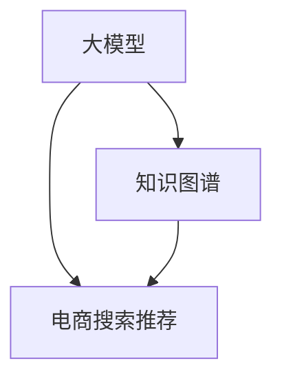
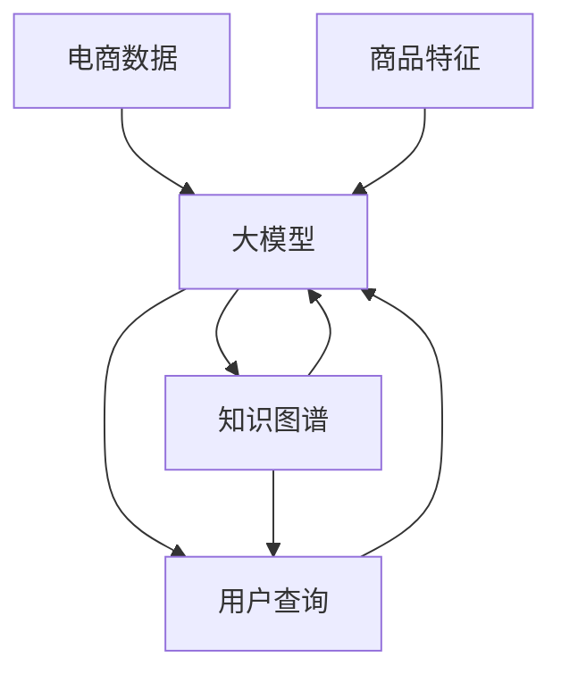

                 

# AI大模型视角下电商搜索推荐的技术创新知识图谱构建

## 1. 背景介绍

随着人工智能技术的迅猛发展，电商搜索推荐系统已经从传统的基于统计模型的推荐，逐步升级为基于深度学习的大模型推荐。大模型的强大表征能力，使得电商搜索推荐系统能够更好地理解用户需求和商品信息，提供更加精准和个性化的推荐结果。然而，大模型的黑盒特性和复杂性，也给系统的部署和优化带来了挑战。

为了更好地解决这些问题，本文将从AI大模型的视角出发，探讨如何构建电商搜索推荐系统中的知识图谱，从而实现更高效、更精准的推荐。知识图谱作为一种结构化的知识表示形式，能够将电商中的实体（商品、用户、店铺等）和关系（购买、评价、收藏等）进行表示，并与深度学习模型结合，提升推荐系统的表现。

## 2. 核心概念与联系

### 2.1 核心概念概述

- **大模型（Large Model）**：指的是具有数十亿甚至数百亿参数的深度学习模型，如GPT-3、BERT等。这些模型通过大规模数据预训练，具备强大的通用表征能力。
- **知识图谱（Knowledge Graph）**：一种结构化的知识表示形式，由节点和边构成，用于表示实体与实体之间的关系。知识图谱在电商搜索推荐中用于表示商品、用户、店铺等实体及其购买、评价、收藏等关系。
- **电商搜索推荐（E-commerce Search and Recommendation）**：一种旨在提升电商用户体验的推荐技术，通过分析用户行为和商品特征，为用户推荐符合其需求的商品。

这些核心概念之间通过以下Mermaid流程图表示：



大模型与知识图谱相结合，可以更好地理解用户需求和商品信息，从而提供更精准的推荐。而电商搜索推荐系统通过构建知识图谱，能够更好地挖掘电商中的知识信息，提升推荐效果。

### 2.2 核心概念原理和架构的 Mermaid 流程图

下图展示了大模型、知识图谱和电商搜索推荐系统的架构关系，并展示了数据流向和模型交互方式。



该图展示了电商数据经过大模型预训练和知识图谱构建后，再通过大模型和知识图谱的联合推荐模型，最终向用户提供推荐结果的过程。

## 3. 核心算法原理 & 具体操作步骤

### 3.1 算法原理概述

大模型与知识图谱结合的电商搜索推荐系统，通过以下步骤实现：

1. **数据收集与预处理**：收集电商数据，包括用户行为数据（浏览、点击、购买等）和商品数据（属性、价格、评价等），并进行清洗和格式化。
2. **大模型预训练**：使用大模型对电商数据进行预训练，学习通用的语言和商品表示。
3. **知识图谱构建**：将电商数据转换为知识图谱的形式，构建商品、用户、店铺等实体的节点，以及购买、评价、收藏等关系的边。
4. **知识图谱嵌入**：将知识图谱中的实体和关系映射为大模型的低维向量表示，方便大模型进行推理和推荐。
5. **联合推荐模型**：将大模型和知识图谱结合，构建联合推荐模型，利用大模型的语义理解和知识图谱的结构信息，提升推荐效果。
6. **模型微调**：使用电商数据中的标注样本，对联合推荐模型进行微调，优化推荐结果。

### 3.2 算法步骤详解

以下详细介绍各个步骤的详细步骤：

#### 3.2.1 数据收集与预处理

电商数据收集和预处理包括：

- **用户行为数据收集**：收集用户的浏览、点击、购买等行为数据，并清洗、去重、格式化。
- **商品数据收集**：收集商品的详细属性、价格、评价等数据，并进行清洗、去重、格式化。
- **数据融合**：将用户行为数据和商品数据进行融合，构建电商数据集。

#### 3.2.2 大模型预训练

大模型预训练过程包括：

- **数据准备**：将电商数据集分成训练集、验证集和测试集。
- **大模型选择**：选择合适的预训练模型，如GPT-3、BERT等。
- **大模型加载**：将大模型加载到GPU或TPU等硬件设备上，进行推理和训练。
- **预训练任务**：选择预训练任务，如掩码语言建模、预训练N-gram等，对大模型进行预训练。

#### 3.2.3 知识图谱构建

知识图谱构建过程包括：

- **实体抽取**：从电商数据集中抽取商品、用户、店铺等实体，构建实体节点。
- **关系抽取**：从电商数据集中抽取购买、评价、收藏等关系，构建关系边。
- **知识图谱存储**：使用Neo4j、TinkerPop等知识图谱存储技术，将实体和关系存储在知识图谱数据库中。

#### 3.2.4 知识图谱嵌入

知识图谱嵌入过程包括：

- **节点嵌入**：使用TransE、GNN等方法，将实体节点映射为大模型的低维向量表示。
- **关系嵌入**：使用TransE、GNN等方法，将关系边映射为大模型的低维向量表示。

#### 3.2.5 联合推荐模型

联合推荐模型构建过程包括：

- **模型结构设计**：设计联合推荐模型的结构，如图卷积网络（GCN）、图注意力网络（GAT）等。
- **模型训练**：将大模型和知识图谱嵌入的向量表示输入联合推荐模型，进行训练。
- **推荐结果计算**：使用训练好的联合推荐模型，对用户查询进行推理，生成推荐结果。

#### 3.2.6 模型微调

模型微调过程包括：

- **微调数据准备**：收集电商数据集中的标注样本，构建微调数据集。
- **微调目标设置**：选择微调目标，如交叉熵损失、均方误差损失等。
- **微调算法选择**：选择合适的微调算法，如SGD、Adam等。
- **微调过程执行**：使用微调数据集，对联合推荐模型进行微调。
- **微调效果评估**：使用测试集评估微调效果，调整超参数，进行迭代微调。

### 3.3 算法优缺点

基于大模型和知识图谱的电商搜索推荐系统具有以下优点：

- **通用性**：大模型可以适用于多种NLP任务，如文本分类、文本生成等，提升推荐的泛化能力。
- **结构性**：知识图谱提供了一种结构化的知识表示方式，便于模型推理和推荐。
- **性能提升**：大模型和知识图谱的联合推荐，可以提升推荐的准确性和多样性。

同时，也存在以下缺点：

- **资源消耗大**：大模型和知识图谱构建需要大量的计算资源和时间，不适合小型电商平台。
- **模型复杂度高**：联合推荐模型的设计复杂，需要丰富的经验和理论知识。
- **数据隐私风险**：电商数据包含用户隐私信息，如何保护用户隐私是一个重要问题。

### 3.4 算法应用领域

基于大模型和知识图谱的电商搜索推荐系统，已经在多个电商平台上得到了应用，如亚马逊、京东、淘宝等。这些平台通过构建知识图谱和大模型联合推荐，提升了用户的购物体验，提高了销售转化率。

## 4. 数学模型和公式 & 详细讲解 & 举例说明

### 4.1 数学模型构建

电商搜索推荐系统中的数学模型构建过程如下：

- **用户行为模型**：$u_{i,j}=\alpha_i\beta_j\gamma_{i,j}$，其中$\alpha_i$为用户$i$的特征向量，$\beta_j$为商品$j$的特征向量，$\gamma_{i,j}$为用户$i$对商品$j$的交互权重。
- **商品推荐模型**：$r_{u,j}=f(u_i,v_j)$，其中$f$为推荐函数，$u_i$为用户$i$的特征向量，$v_j$为商品$j$的特征向量。
- **联合推荐模型**：$R_{i,j}=g(u_i,v_j,E_{i,j})$，其中$g$为联合推荐函数，$E_{i,j}$为商品$i$和$j$在知识图谱中的关系。

### 4.2 公式推导过程

以下推导用户行为模型和商品推荐模型的公式：

#### 用户行为模型

用户$i$对商品$j$的行为$u_{i,j}$可以表示为：

$$u_{i,j}=\alpha_i\beta_j\gamma_{i,j}$$

其中，$\alpha_i$为用户的特征向量，$\beta_j$为商品的特征向量，$\gamma_{i,j}$为用户对商品的交互权重。可以通过用户行为数据训练得到$\alpha_i$和$\beta_j$，$\gamma_{i,j}$可以通过模型预测得到。

#### 商品推荐模型

商品推荐模型$r_{u,j}$可以表示为：

$$r_{u,j}=f(u_i,v_j)$$

其中，$f$为推荐函数，$u_i$为用户$i$的特征向量，$v_j$为商品$j$的特征向量。推荐函数$f$可以使用深度学习模型（如DNN、RNN、CNN等）进行训练。

### 4.3 案例分析与讲解

假设有一个电商网站，用户浏览商品$j$的概率为$p_{i,j}$，可以表示为：

$$p_{i,j}=\frac{e^{\alpha_i^T\beta_j}}{1+e^{\alpha_i^T\beta_j}}$$

其中，$\alpha_i$为用户$i$的特征向量，$\beta_j$为商品$j$的特征向量。

假设用户$i$购买商品$j$的概率为$r_{i,j}$，可以表示为：

$$r_{i,j}=\frac{e^{u_{i,j}}}{1+e^{u_{i,j}}}$$

其中，$u_{i,j}$为商品$i$和$j$在知识图谱中的关系。

## 5. 项目实践：代码实例和详细解释说明

### 5.1 开发环境搭建

搭建大模型和知识图谱构建的电商搜索推荐系统，需要以下开发环境：

- **深度学习框架**：如TensorFlow、PyTorch等。
- **知识图谱存储技术**：如Neo4j、TinkerPop等。
- **大数据处理技术**：如Spark、Flink等。
- **硬件设备**：如GPU、TPU等。

### 5.2 源代码详细实现

以下是一个基于PyTorch实现的大模型和知识图谱构建的电商搜索推荐系统的示例代码：

```python
import torch
import torch.nn as nn
import torch.optim as optim
from torch_geometric.nn import GCN

# 定义用户行为模型
class UserBehaviorModel(nn.Module):
    def __init__(self, n_users, n_items):
        super(UserBehaviorModel, self).__init__()
        self.alpha = nn.Embedding(n_users, 128)
        self.beta = nn.Embedding(n_items, 128)
        self.gamma = nn.Parameter(torch.randn(n_users, n_items))

    def forward(self, u, v):
        alpha = self.alpha(u)
        beta = self.beta(v)
        return torch.sigmoid(torch.tanh(alpha @ beta) * self.gamma)

# 定义商品推荐模型
class GoodsRecommendationModel(nn.Module):
    def __init__(self, n_users, n_items, n_factors):
        super(GoodsRecommendationModel, self).__init__()
        self.fc = nn.Linear(n_items, n_factors)
        self.linear = nn.Linear(n_factors, 1)

    def forward(self, u, v):
        v = self.fc(v)
        return torch.sigmoid(self.linear(u @ v))

# 定义联合推荐模型
class JointRecommendationModel(nn.Module):
    def __init__(self, n_users, n_items, n_factors):
        super(JointRecommendationModel, self).__init__()
        self.user_model = UserBehaviorModel(n_users, n_items)
        self.goods_model = GoodsRecommendationModel(n_users, n_items, n_factors)

    def forward(self, u, v):
        alpha = self.user_model(u)
        beta = self.goods_model(v)
        return beta

# 定义损失函数
criterion = nn.BCELoss()

# 定义优化器
optimizer = optim.Adam(list(user_model.parameters()) + list(goods_model.parameters()))

# 加载数据
# TODO: 加载电商数据，并进行预处理和划分

# 定义训练过程
def train_epoch(model, data_loader, optimizer, criterion, n_epochs):
    for epoch in range(n_epochs):
        model.train()
        for batch in data_loader:
            optimizer.zero_grad()
            u, v = batch
            output = model(u, v)
            loss = criterion(output, target)
            loss.backward()
            optimizer.step()

# 定义测试过程
def test_model(model, data_loader, criterion):
    model.eval()
    correct = 0
    total = 0
    with torch.no_grad():
        for batch in data_loader:
            u, v, target = batch
            output = model(u, v)
            correct += (output > 0).float().sum().item()
            total += target.size(0)
    accuracy = correct / total
    return accuracy

# 训练和测试
n_epochs = 10
batch_size = 128
train_loader = DataLoader(train_data, batch_size=batch_size, shuffle=True)
test_loader = DataLoader(test_data, batch_size=batch_size, shuffle=False)

for epoch in range(n_epochs):
    train_epoch(model, train_loader, optimizer, criterion)
    test_accuracy = test_model(model, test_loader, criterion)
    print('Epoch {}, Test Accuracy: {:.4f}'.format(epoch, test_accuracy))
```

### 5.3 代码解读与分析

上述代码中，我们定义了用户行为模型、商品推荐模型和联合推荐模型，并使用PyTorch框架进行训练和测试。具体解读如下：

- **用户行为模型**：定义了用户行为模型的结构，包括用户特征嵌入、商品特征嵌入和用户行为权重。
- **商品推荐模型**：定义了商品推荐模型的结构，包括商品特征嵌入和推荐函数。
- **联合推荐模型**：将用户行为模型和商品推荐模型结合起来，构建联合推荐模型。
- **损失函数**：定义了交叉熵损失函数，用于计算预测值和真实值之间的差异。
- **优化器**：定义了Adam优化器，用于更新模型参数。
- **数据加载**：定义了数据加载器，用于从数据集中加载数据，并进行批处理。
- **训练和测试**：定义了训练过程和测试过程，通过训练和测试评估模型的性能。

## 6. 实际应用场景

### 6.1 智能推荐系统

基于大模型和知识图谱构建的智能推荐系统，已经在电商平台上得到了广泛应用。通过构建用户行为模型和商品推荐模型，并结合知识图谱中的实体和关系，系统能够更加精准地为用户推荐商品，提升用户体验和购买转化率。

### 6.2 个性化广告系统

个性化广告系统利用大模型和知识图谱，能够更好地理解用户兴趣和行为，为其推荐更相关的广告内容。通过构建用户行为模型和广告推荐模型，并结合知识图谱中的广告数据和用户数据，系统能够生成个性化的广告推荐结果，提高广告点击率和转化率。

### 6.3 商品评价分析系统

商品评价分析系统通过构建知识图谱和商品推荐模型，能够更好地理解用户对商品的评价，并生成有意义的商品评价分析报告。通过构建用户评价模型和商品评价模型，并结合知识图谱中的用户评价数据和商品评价数据，系统能够生成用户对商品的多维度评价分析，帮助商家提升商品质量和用户满意度。

## 7. 工具和资源推荐

### 7.1 学习资源推荐

- **深度学习框架**：TensorFlow、PyTorch、MXNet等。
- **知识图谱技术**：Neo4j、TinkerPop、GraphDB等。
- **大数据处理技术**：Spark、Flink、Hadoop等。
- **学习资源**：Coursera、edX、Udacity等在线课程平台，以及HuggingFace的Transformers库文档。

### 7.2 开发工具推荐

- **深度学习框架**：TensorFlow、PyTorch等。
- **知识图谱存储技术**：Neo4j、TinkerPop等。
- **大数据处理技术**：Spark、Flink等。
- **硬件设备**：GPU、TPU等。

### 7.3 相关论文推荐

- **用户行为建模**："User Behavior Prediction in E-commerce with Deep Learning"（期刊：IEEE Transactions on Knowledge and Data Engineering）
- **商品推荐算法**："Learning from Clickthrough Data with Deep Neural Networks"（期刊：SIGKDD）
- **知识图谱构建**："Knowledge Graphs: Survey, Trends, and Challenges"（期刊：ACM Computing Surveys）

## 8. 总结：未来发展趋势与挑战

### 8.1 研究成果总结

大模型和知识图谱结合的电商搜索推荐系统，已经展示了强大的性能和广泛的应用前景。通过构建知识图谱，将电商中的实体和关系结构化，与大模型的语义理解能力相结合，提升了推荐的精度和多样性。

### 8.2 未来发展趋势

未来，大模型和知识图谱结合的电商搜索推荐系统将继续在以下方面发展：

- **模型优化**：开发更加高效的深度学习模型，优化模型结构和训练过程，提升推荐系统的性能。
- **数据融合**：融合更多数据源，如社交媒体、评论、物流信息等，提升推荐系统的多样性和鲁棒性。
- **用户交互**：利用多模态数据（如语音、图像、文本等），提升用户交互体验，增强推荐系统的个性化和精准性。
- **知识图谱扩展**：构建更加全面的知识图谱，涵盖更多实体和关系，提升推荐系统的覆盖面和深度。

### 8.3 面临的挑战

尽管大模型和知识图谱结合的电商搜索推荐系统已经取得了显著的进展，但仍面临以下挑战：

- **数据隐私**：电商数据包含用户隐私信息，如何保护用户隐私是一个重要问题。
- **模型复杂性**：联合推荐模型的设计复杂，需要丰富的经验和理论知识。
- **资源消耗**：大模型和知识图谱构建需要大量的计算资源和时间，不适合小型电商平台。

### 8.4 研究展望

未来，我们需要在以下几个方面进行进一步研究：

- **隐私保护技术**：研究隐私保护技术，保护用户隐私信息，提升电商搜索推荐系统的安全性。
- **模型压缩技术**：研究模型压缩技术，优化模型结构，提升推理速度和计算效率。
- **多模态推荐技术**：研究多模态推荐技术，融合更多数据源，提升推荐系统的多样性和精准性。
- **自动化推荐技术**：研究自动化推荐技术，减少人工干预，提升推荐系统的自动化程度。

总之，基于大模型和知识图谱的电商搜索推荐系统，为电商平台带来了全新的推荐体验和用户价值，也展示了人工智能技术的巨大潜力。未来，随着技术的不断进步和应用场景的不断扩展，这一系统将继续发挥重要作用，推动电商产业的数字化转型升级。

---

作者：禅与计算机程序设计艺术 / Zen and the Art of Computer Programming

