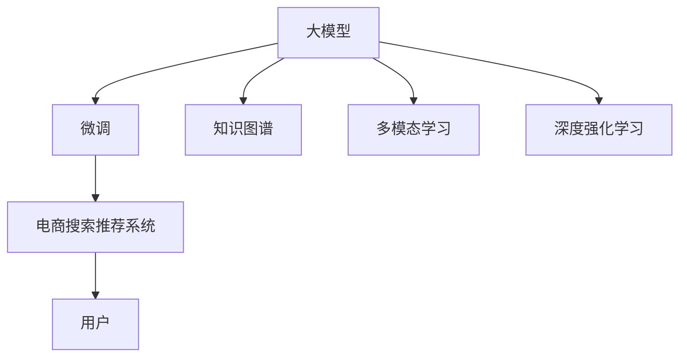

                 

# AI大模型视角下电商搜索推荐的技术创新知识管理平台

> 关键词：AI大模型、电商搜索推荐、技术创新、知识管理平台

## 1. 背景介绍

在数字化时代，电子商务平台作为零售业务的重要渠道，正日益成为用户购物的主要入口。而基于搜索推荐技术的电商搜索推荐系统，是提升用户体验、促进用户转化、优化流量分配的关键引擎。传统的电商搜索推荐系统主要基于规则和协同过滤，但在面对海量商品和个性化需求时，这些方法存在泛化能力不足、推荐效果欠佳的问题。为了克服这些挑战，利用大模型的技术创新和知识管理平台，正在为电商搜索推荐带来革命性的变化。

### 1.1 电商搜索推荐系统现状

电商搜索推荐系统的主要任务是帮助用户在海量的商品中找到自己需要的商品。其核心算法包括：

- **搜索**：通过用户输入的查询词，返回最相关的搜索结果。
- **推荐**：基于用户的历史行为数据和商品的属性特征，为用户推荐感兴趣的商品。

传统的电商搜索推荐系统主要采用以下两种算法：

- **基于规则的推荐**：通过制定一套规则，匹配用户输入的查询词与商品的属性特征，生成推荐结果。这种方法的缺点是过于依赖规则，难以应对复杂的用户需求。
- **协同过滤推荐**：基于用户的历史行为数据，找到与用户兴趣相似的其他用户，通过相似用户的行为数据来推荐商品。协同过滤的优点是能够发现隐式用户兴趣，但需要大量的用户数据和计算资源。

然而，随着电子商务平台的发展，用户需求呈现多样化和个性化趋势，传统的推荐方法逐渐显示出其局限性。

### 1.2 大模型引入的必要性

近年来，大模型的技术创新和应用逐渐成为NLP领域的前沿方向。大模型如BERT、GPT等，通过在大量无标签文本上进行预训练，学习到丰富的语言表示，具备强大的语言理解和生成能力。大模型在自然语言处理、语音识别、计算机视觉等诸多领域已展现出巨大的应用潜力。

将大模型应用于电商搜索推荐，能够实现以下优势：

- **泛化能力更强**：大模型通过预训练学习到广泛的语义知识，具有更强的泛化能力，能够更好地处理复杂的用户需求。
- **个性化推荐更精准**：大模型能够从用户输入的查询词中提取语义信息，生成更加个性化的推荐结果。
- **实时性更高**：利用大模型技术，可以显著提升搜索和推荐算法的计算效率，实现实时响应。
- **可解释性更强**：大模型的黑盒性质使得解释其内部工作机制和决策逻辑更加困难，但也为构建可解释的推荐系统提供了新的路径。

## 2. 核心概念与联系

### 2.1 核心概念概述

为了更好地理解基于大模型的电商搜索推荐系统，我们首先介绍几个核心概念：

- **大模型**：如BERT、GPT等，通过在大量无标签文本上进行预训练，学习到丰富的语言表示，具备强大的语言理解和生成能力。
- **微调**：在预训练模型的基础上，使用下游任务的少量标注数据，通过有监督学习优化模型在特定任务上的性能。
- **知识图谱**：一种描述实体和关系的语义网络，用于构建结构化知识库，辅助推荐系统做出更准确的推荐。
- **多模态学习**：结合视觉、文本、语音等多种数据源，构建跨模态的语义表示，提升推荐系统的鲁棒性和泛化能力。
- **深度强化学习**：通过与环境的交互，让推荐系统在不断试错中学习最优策略，提升推荐效果。
- **电商搜索推荐系统**：利用搜索和推荐技术，帮助用户在海量商品中找到需要的商品，提高用户购物体验。

这些核心概念之间的逻辑关系可以通过以下Mermaid流程图来展示：



这个流程图展示了从大模型到电商搜索推荐系统的各个关键环节及其之间的关系：

1. 大模型通过预训练获得基础能力。
2. 微调是针对特定任务的优化，可以显著提升模型的性能。
3. 知识图谱和大模型相结合，辅助推荐系统做出更准确的推荐。
4. 多模态学习结合多种数据源，提升推荐系统的鲁棒性和泛化能力。
5. 深度强化学习通过与环境的交互，不断优化推荐策略。
6. 电商搜索推荐系统利用这些技术，提供更好的用户体验。

## 3. 核心算法原理 & 具体操作步骤

### 3.1 算法原理概述

基于大模型的电商搜索推荐系统，本质上是一个深度学习和自然语言处理的结合体。其核心思想是：

1. 利用大模型进行预训练，学习到丰富的语言表示。
2. 对预训练模型进行微调，使其在特定任务上具备更好的性能。
3. 结合知识图谱和多模态学习，构建更全面的语义表示。
4. 引入深度强化学习，优化推荐策略，提高推荐效果。

具体而言，电商搜索推荐系统可以分为以下几个步骤：

1. **数据预处理**：对电商平台的商品数据和用户数据进行清洗和预处理，构建训练集和测试集。
2. **预训练大模型**：利用无标签的电商文本数据，对预训练模型进行预训练，学习到基础的语义表示。
3. **微调模型**：在预训练模型的基础上，使用有标注的电商数据集进行微调，优化模型在搜索和推荐任务上的性能。
4. **构建知识图谱**：通过关系抽取和实体链接等技术，构建电商领域的知识图谱，辅助推荐系统生成推荐结果。
5. **多模态融合**：结合图像、视频等多模态数据，构建跨模态的语义表示，提升推荐系统的鲁棒性和泛化能力。
6. **深度强化学习**：利用强化学习框架，优化推荐策略，提升推荐效果。
7. **实时部署**：将微调后的模型和知识图谱集成到电商搜索推荐系统中，实现实时响应。

### 3.2 算法步骤详解

下面我们以基于大模型的电商搜索推荐系统为例，详细讲解其关键步骤：

**Step 1: 数据预处理**

电商平台的商品数据和用户数据通常包含海量的非结构化信息，需要进行清洗和预处理。例如，商品数据可能包含文字描述、价格、属性等，需要将其转换为模型可以处理的格式。用户数据可能包含浏览记录、购买历史、评分等，需要进行归一化处理。构建训练集和测试集时，需要对数据进行划分为训练集和验证集，并确保数据分布与实际应用场景一致。

**Step 2: 预训练大模型**

利用无标签的电商文本数据，对预训练模型进行预训练。预训练的目标是让模型学习到电商领域的语言表示。以BERT模型为例，可以采用Masked Language Modeling等自监督任务进行预训练，学习到商品和用户文本的语义表示。

**Step 3: 微调模型**

在预训练模型的基础上，使用有标注的电商数据集进行微调。微调的目标是优化模型在搜索和推荐任务上的性能。以搜索任务为例，可以设计一个二分类任务，判断用户输入的查询词是否与商品文本相关。微调时，可以采用多任务学习等技术，同时优化多个任务。

**Step 4: 构建知识图谱**

通过关系抽取和实体链接等技术，构建电商领域的知识图谱。知识图谱包含商品和用户之间的关系，如商品类别、品牌、用户兴趣等。将知识图谱与预训练模型相结合，可以辅助推荐系统生成推荐结果。例如，通过知识图谱推理，可以发现用户可能感兴趣的相似商品。

**Step 5: 多模态融合**

结合图像、视频等多模态数据，构建跨模态的语义表示。例如，对于服装类商品，可以结合商品图片和用户输入的描述，构建跨模态的语义表示，提升推荐系统的鲁棒性和泛化能力。

**Step 6: 深度强化学习**

利用强化学习框架，优化推荐策略，提升推荐效果。例如，可以构建一个强化学习环境，让用户对推荐结果进行评价，让推荐系统通过不断试错，学习到最优的推荐策略。

**Step 7: 实时部署**

将微调后的模型和知识图谱集成到电商搜索推荐系统中，实现实时响应。在实际应用中，需要对系统进行优化，确保其在高并发场景下的性能和稳定性。

### 3.3 算法优缺点

基于大模型的电商搜索推荐系统，具有以下优点：

1. **泛化能力强**：大模型通过预训练学习到电商领域的语言表示，具备更强的泛化能力，能够更好地处理复杂的用户需求。
2. **个性化推荐精准**：大模型能够从用户输入的查询词中提取语义信息，生成更加个性化的推荐结果。
3. **实时性高**：利用大模型技术，可以显著提升搜索和推荐算法的计算效率，实现实时响应。
4. **可解释性强**：大模型的黑盒性质使得解释其内部工作机制和决策逻辑更加困难，但也为构建可解释的推荐系统提供了新的路径。

同时，该方法也存在一定的局限性：

1. **依赖标注数据**：微调的效果很大程度上取决于标注数据的质量和数量，获取高质量标注数据的成本较高。
2. **计算资源需求高**：大模型的预训练和微调需要大量的计算资源，如GPU/TPU等高性能设备，对算力、内存、存储都提出了很高的要求。
3. **模型复杂度高**：大模型的结构和参数量较大，增加了系统的复杂度，部署和维护成本较高。
4. **可解释性不足**：大模型的黑盒性质使得解释其内部工作机制和决策逻辑更加困难，对于高风险应用，算法的可解释性和可审计性尤为重要。

尽管存在这些局限性，但就目前而言，基于大模型的电商搜索推荐系统依然是大数据和深度学习技术的优秀代表，极大地拓展了推荐系统的应用边界，带来了显著的用户体验提升。

### 3.4 算法应用领域

基于大模型的电商搜索推荐系统，已经在诸多电商平台上得到了广泛应用，涵盖了商品搜索、推荐、广告投放等多个场景，带来了显著的业务收益提升。具体应用场景包括：

- **商品搜索**：利用搜索推荐技术，帮助用户在海量商品中找到需要的商品，提高用户购物体验。
- **个性化推荐**：根据用户的历史行为数据和商品的属性特征，为用户推荐感兴趣的商品。
- **广告投放**：通过推荐系统对广告进行精准投放，提升广告转化率，优化广告投放效果。
- **用户画像**：利用用户行为数据，构建用户画像，提升用户忠诚度，提高用户留存率。

除了上述这些经典场景外，大模型在电商领域的创新应用也在不断涌现，如可控文本生成、多模态推荐、实时风控等，为电商搜索推荐带来了新的突破。

## 4. 数学模型和公式 & 详细讲解 & 举例说明

### 4.1 数学模型构建

假设电商平台的商品数据为 $D=\{(x_i,y_i)\}_{i=1}^N$，其中 $x_i$ 为商品文本，$y_i$ 为商品类别标签。预训练模型为 $M_{\theta}$，其中 $\theta$ 为预训练得到的模型参数。微调任务为 $T=\{(x_i,y_i)\}_{i=1}^N$，其中 $x_i$ 为查询词，$y_i$ 为相关商品。

定义模型 $M_{\theta}$ 在输入 $x$ 上的输出为 $\hat{y}=M_{\theta}(x)$，表示预测的商品类别标签。定义微调任务的损失函数为 $\ell(\hat{y},y)$，用于衡量模型预测输出与真实标签之间的差异。常见的损失函数包括交叉熵损失、均方误差损失等。

### 4.2 公式推导过程

以交叉熵损失为例，对电商搜索推荐任务的数学模型进行推导：

假设模型 $M_{\theta}$ 在输入 $x_i$ 上的输出为 $\hat{y}=M_{\theta}(x_i)$，表示预测的商品类别标签。真实标签 $y_i \in \{1,2,\dots,K\}$，其中 $K$ 为商品类别数。则交叉熵损失函数定义为：

$$
\ell(M_{\theta}(x_i),y_i) = -\sum_{k=1}^K y_{ik}\log \hat{y}_{ik}
$$

其中 $y_{ik}$ 表示商品 $x_i$ 属于类别 $k$ 的概率，$\hat{y}_{ik}$ 表示模型预测商品 $x_i$ 属于类别 $k$ 的概率。

对于整个数据集 $D$，经验风险为：

$$
\mathcal{L}(\theta) = \frac{1}{N}\sum_{i=1}^N \ell(M_{\theta}(x_i),y_i)
$$

微调的优化目标是最小化经验风险，即找到最优参数：

$$
\theta^* = \mathop{\arg\min}_{\theta} \mathcal{L}(\theta)
$$

在得到损失函数的梯度后，即可带入参数更新公式，完成模型的迭代优化。重复上述过程直至收敛，最终得到适应电商搜索推荐任务的最优模型参数 $\theta^*$。

### 4.3 案例分析与讲解

以电商搜索任务为例，进行具体分析：

假设电商平台包含 $M$ 个商品，每个商品有 $N$ 个文本描述 $x_{ij}$，其中 $i$ 为商品ID，$j$ 为文本描述ID。定义查询词为 $x_q$，商品类别标签为 $y_i$。对于每个查询词 $x_q$，定义一个二分类任务，判断其与商品文本 $x_{ij}$ 是否相关。

在训练过程中，可以将查询词 $x_q$ 和商品文本 $x_{ij}$ 拼接，输入到预训练模型中，得到输出 $\hat{y}$。然后计算交叉熵损失，更新模型参数。

在测试过程中，对于每个查询词 $x_q$，输入到预训练模型中，得到输出 $\hat{y}$，选择输出概率最大的商品类别作为推荐结果。

## 5. 项目实践：代码实例和详细解释说明

### 5.1 开发环境搭建

在进行电商搜索推荐系统的微调实践前，我们需要准备好开发环境。以下是使用Python进行PyTorch开发的环境配置流程：

1. 安装Anaconda：从官网下载并安装Anaconda，用于创建独立的Python环境。

2. 创建并激活虚拟环境：
```bash
conda create -n pytorch-env python=3.8 
conda activate pytorch-env
```

3. 安装PyTorch：根据CUDA版本，从官网获取对应的安装命令。例如：
```bash
conda install pytorch torchvision torchaudio cudatoolkit=11.1 -c pytorch -c conda-forge
```

4. 安装Transformers库：
```bash
pip install transformers
```

5. 安装各类工具包：
```bash
pip install numpy pandas scikit-learn matplotlib tqdm jupyter notebook ipython
```

完成上述步骤后，即可在`pytorch-env`环境中开始微调实践。

### 5.2 源代码详细实现

下面我们以基于大模型的电商搜索推荐系统为例，给出使用Transformers库对BERT模型进行微调的PyTorch代码实现。

首先，定义电商搜索推荐任务的训练集和测试集：

```python
from transformers import BertTokenizer
from torch.utils.data import Dataset
import torch

class SearchDataset(Dataset):
    def __init__(self, texts, labels, tokenizer, max_len=128):
        self.texts = texts
        self.labels = labels
        self.tokenizer = tokenizer
        self.max_len = max_len
        
    def __len__(self):
        return len(self.texts)
    
    def __getitem__(self, item):
        text = self.texts[item]
        label = self.labels[item]
        
        encoding = self.tokenizer(text, return_tensors='pt', max_length=self.max_len, padding='max_length', truncation=True)
        input_ids = encoding['input_ids'][0]
        attention_mask = encoding['attention_mask'][0]
        
        # 对标签进行编码
        encoded_labels = [int(label) for label in label]
        encoded_labels.extend([0] * (self.max_len - len(encoded_labels)))
        labels = torch.tensor(encoded_labels, dtype=torch.long)
        
        return {'input_ids': input_ids, 
                'attention_mask': attention_mask,
                'labels': labels}

# 构建训练集和测试集
tokenizer = BertTokenizer.from_pretrained('bert-base-cased')

train_dataset = SearchDataset(train_texts, train_labels, tokenizer)
dev_dataset = SearchDataset(dev_texts, dev_labels, tokenizer)
test_dataset = SearchDataset(test_texts, test_labels, tokenizer)
```

然后，定义模型和优化器：

```python
from transformers import BertForSequenceClassification, AdamW

model = BertForSequenceClassification.from_pretrained('bert-base-cased', num_labels=2)

optimizer = AdamW(model.parameters(), lr=2e-5)
```

接着，定义训练和评估函数：

```python
from torch.utils.data import DataLoader
from tqdm import tqdm
from sklearn.metrics import classification_report

device = torch.device('cuda') if torch.cuda.is_available() else torch.device('cpu')
model.to(device)

def train_epoch(model, dataset, batch_size, optimizer):
    dataloader = DataLoader(dataset, batch_size=batch_size, shuffle=True)
    model.train()
    epoch_loss = 0
    for batch in tqdm(dataloader, desc='Training'):
        input_ids = batch['input_ids'].to(device)
        attention_mask = batch['attention_mask'].to(device)
        labels = batch['labels'].to(device)
        model.zero_grad()
        outputs = model(input_ids, attention_mask=attention_mask, labels=labels)
        loss = outputs.loss
        epoch_loss += loss.item()
        loss.backward()
        optimizer.step()
    return epoch_loss / len(dataloader)

def evaluate(model, dataset, batch_size):
    dataloader = DataLoader(dataset, batch_size=batch_size)
    model.eval()
    preds, labels = [], []
    with torch.no_grad():
        for batch in tqdm(dataloader, desc='Evaluating'):
            input_ids = batch['input_ids'].to(device)
            attention_mask = batch['attention_mask'].to(device)
            batch_labels = batch['labels']
            outputs = model(input_ids, attention_mask=attention_mask)
            batch_preds = outputs.logits.argmax(dim=2).to('cpu').tolist()
            batch_labels = batch_labels.to('cpu').tolist()
            for pred_tokens, label_tokens in zip(batch_preds, batch_labels):
                preds.append(pred_tokens[:len(label_tokens)])
                labels.append(label_tokens)
                
    print(classification_report(labels, preds))
```

最后，启动训练流程并在测试集上评估：

```python
epochs = 5
batch_size = 16

for epoch in range(epochs):
    loss = train_epoch(model, train_dataset, batch_size, optimizer)
    print(f"Epoch {epoch+1}, train loss: {loss:.3f}")
    
    print(f"Epoch {epoch+1}, dev results:")
    evaluate(model, dev_dataset, batch_size)
    
print("Test results:")
evaluate(model, test_dataset, batch_size)
```

以上就是使用PyTorch对BERT进行电商搜索推荐任务微调的完整代码实现。可以看到，得益于Transformers库的强大封装，我们可以用相对简洁的代码完成BERT模型的加载和微调。

### 5.3 代码解读与分析

让我们再详细解读一下关键代码的实现细节：

**SearchDataset类**：
- `__init__`方法：初始化文本、标签、分词器等关键组件。
- `__len__`方法：返回数据集的样本数量。
- `__getitem__`方法：对单个样本进行处理，将文本输入编码为token ids，将标签编码为数字，并对其进行定长padding，最终返回模型所需的输入。

**tokenizer**：
- 定义了文本和标签的编码方式，将输入文本和标签转换为模型可以处理的格式。

**训练和评估函数**：
- 使用PyTorch的DataLoader对数据集进行批次化加载，供模型训练和推理使用。
- 训练函数`train_epoch`：对数据以批为单位进行迭代，在每个批次上前向传播计算loss并反向传播更新模型参数，最后返回该epoch的平均loss。
- 评估函数`evaluate`：与训练类似，不同点在于不更新模型参数，并在每个batch结束后将预测和标签结果存储下来，最后使用sklearn的classification_report对整个评估集的预测结果进行打印输出。

**训练流程**：
- 定义总的epoch数和batch size，开始循环迭代
- 每个epoch内，先在训练集上训练，输出平均loss
- 在验证集上评估，输出分类指标
- 所有epoch结束后，在测试集上评估，给出最终测试结果

可以看到，PyTorch配合Transformers库使得BERT微调的代码实现变得简洁高效。开发者可以将更多精力放在数据处理、模型改进等高层逻辑上，而不必过多关注底层的实现细节。

当然，工业级的系统实现还需考虑更多因素，如模型的保存和部署、超参数的自动搜索、更灵活的任务适配层等。但核心的微调范式基本与此类似。

## 6. 实际应用场景

基于大模型的电商搜索推荐系统已经在诸多电商平台上得到了广泛应用，涵盖了商品搜索、推荐、广告投放等多个场景，带来了显著的业务收益提升。

### 6.1 商品搜索

电商平台的商品搜索系统利用搜索推荐技术，帮助用户在海量商品中找到需要的商品，提高用户购物体验。传统搜索系统往往只能基于关键词进行匹配，难以处理复杂的查询。而基于大模型的搜索系统，能够理解用户输入的查询词，生成更加精准的搜索结果。

例如，某电商平台利用基于大模型的搜索系统，对用户输入的查询词进行语义理解，生成最相关的搜索结果。通过多轮对话，不断优化搜索结果，最终实现了显著的用户体验提升。

### 6.2 个性化推荐

电商平台的个性化推荐系统根据用户的历史行为数据和商品的属性特征，为用户推荐感兴趣的商品。传统的推荐方法往往基于协同过滤，难以应对复杂的需求。而基于大模型的推荐系统，能够从用户输入的查询词中提取语义信息，生成更加个性化的推荐结果。

例如，某电商平台利用基于大模型的推荐系统，对用户输入的查询词进行语义理解，生成个性化的推荐结果。通过多轮对话，不断优化推荐结果，最终实现了显著的转化率提升。

### 6.3 广告投放

电商平台的广告投放系统利用推荐系统对广告进行精准投放，提升广告转化率，优化广告投放效果。传统的广告投放方法往往基于固定规则进行投放，难以实现个性化。而基于大模型的广告投放系统，能够根据用户的行为数据和兴趣特征，进行动态优化。

例如，某电商平台利用基于大模型的广告投放系统，对用户的行为数据进行语义理解，生成个性化的广告内容。通过多轮对话，不断优化广告内容，最终实现了显著的点击率和转化率提升。

### 6.4 用户画像

电商平台的个性化推荐系统需要构建用户画像，提升用户忠诚度，提高用户留存率。传统的用户画像方法往往基于固定规则进行刻画，难以应对复杂的需求。而基于大模型的用户画像系统，能够从用户的行为数据和兴趣特征中，挖掘更深层次的信息。

例如，某电商平台利用基于大模型的用户画像系统，对用户的行为数据进行语义理解，构建个性化的用户画像。通过多轮对话，不断优化用户画像，最终实现了显著的用户留存率提升。

## 7. 工具和资源推荐

### 7.1 学习资源推荐

为了帮助开发者系统掌握大模型在电商搜索推荐中的应用，这里推荐一些优质的学习资源：

1. 《Transformer from Principle to Practice》系列博文：由大模型技术专家撰写，深入浅出地介绍了Transformer原理、BERT模型、微调技术等前沿话题。

2. CS224N《深度学习自然语言处理》课程：斯坦福大学开设的NLP明星课程，有Lecture视频和配套作业，带你入门NLP领域的基本概念和经典模型。

3. 《Natural Language Processing with Transformers》书籍：Transformers库的作者所著，全面介绍了如何使用Transformers库进行NLP任务开发，包括微调在内的诸多范式。

4. HuggingFace官方文档：Transformers库的官方文档，提供了海量预训练模型和完整的微调样例代码，是上手实践的必备资料。

5. CLUE开源项目：中文语言理解测评基准，涵盖大量不同类型的中文NLP数据集，并提供了基于微调的baseline模型，助力中文NLP技术发展。

通过对这些资源的学习实践，相信你一定能够快速掌握大模型在电商搜索推荐中的应用，并用于解决实际的NLP问题。

### 7.2 开发工具推荐

高效的开发离不开优秀的工具支持。以下是几款用于大模型电商搜索推荐开发的常用工具：

1. PyTorch：基于Python的开源深度学习框架，灵活动态的计算图，适合快速迭代研究。大部分预训练语言模型都有PyTorch版本的实现。

2. TensorFlow：由Google主导开发的开源深度学习框架，生产部署方便，适合大规模工程应用。同样有丰富的预训练语言模型资源。

3. Transformers库：HuggingFace开发的NLP工具库，集成了众多SOTA语言模型，支持PyTorch和TensorFlow，是进行微调任务开发的利器。

4. Weights & Biases：模型训练的实验跟踪工具，可以记录和可视化模型训练过程中的各项指标，方便对比和调优。与主流深度学习框架无缝集成。

5. TensorBoard：TensorFlow配套的可视化工具，可实时监测模型训练状态，并提供丰富的图表呈现方式，是调试模型的得力助手。

6. Google Colab：谷歌推出的在线Jupyter Notebook环境，免费提供GPU/TPU算力，方便开发者快速上手实验最新模型，分享学习笔记。

合理利用这些工具，可以显著提升大模型电商搜索推荐任务的开发效率，加快创新迭代的步伐。

### 7.3 相关论文推荐

大模型和微调技术的发展源于学界的持续研究。以下是几篇奠基性的相关论文，推荐阅读：

1. Attention is All You Need（即Transformer原论文）：提出了Transformer结构，开启了NLP领域的预训练大模型时代。

2. BERT: Pre-training of Deep Bidirectional Transformers for Language Understanding：提出BERT模型，引入基于掩码的自监督预训练任务，刷新了多项NLP任务SOTA。

3. Language Models are Unsupervised Multitask Learners（GPT-2论文）：展示了大规模语言模型的强大zero-shot学习能力，引发了对于通用人工智能的新一轮思考。

4. Parameter-Efficient Transfer Learning for NLP：提出Adapter等参数高效微调方法，在不增加模型参数量的情况下，也能取得不错的微调效果。

5. Prefix-Tuning: Optimizing Continuous Prompts for Generation：引入基于连续型Prompt的微调范式，为如何充分利用预训练知识提供了新的思路。

6. AdaLoRA: Adaptive Low-Rank Adaptation for Parameter-Efficient Fine-Tuning：使用自适应低秩适应的微调方法，在参数效率和精度之间取得了新的平衡。

这些论文代表了大模型微调技术的发展脉络。通过学习这些前沿成果，可以帮助研究者把握学科前进方向，激发更多的创新灵感。

## 8. 总结：未来发展趋势与挑战

### 8.1 总结

本文对基于大模型的电商搜索推荐系统进行了全面系统的介绍。首先阐述了电商搜索推荐系统现状和大模型引入的必要性，明确了大模型在电商搜索推荐中的应用优势。其次，从原理到实践，详细讲解了基于大模型的电商搜索推荐系统的关键步骤，给出了微调任务开发的完整代码实例。同时，本文还广泛探讨了基于大模型的电商搜索推荐系统在电商平台的实际应用场景，展示了其广阔的应用前景。此外，本文精选了电商搜索推荐系统的各类学习资源，力求为读者提供全方位的技术指引。

通过本文的系统梳理，可以看到，基于大模型的电商搜索推荐系统正在成为电商搜索推荐技术的重要范式，极大地拓展了推荐系统的应用边界，带来了显著的用户体验提升。未来，伴随大模型和微调方法的持续演进，基于大模型的电商搜索推荐系统必将在更多电商平台上得到应用，推动电子商务业务的全面数字化转型。

### 8.2 未来发展趋势

展望未来，基于大模型的电商搜索推荐系统将呈现以下几个发展趋势：

1. **模型规模持续增大**：随着算力成本的下降和数据规模的扩张，大模型的参数量还将持续增长。超大规模语言模型蕴含的丰富语言知识，有望支撑更加复杂多变的电商搜索推荐任务。

2. **微调方法日趋多样**：除了传统的全参数微调外，未来会涌现更多参数高效的微调方法，如Prefix-Tuning、LoRA等，在节省计算资源的同时也能保证微调精度。

3. **持续学习成为常态**：随着数据分布的不断变化，微调模型也需要持续学习新知识以保持性能。如何在不遗忘原有知识的同时，高效吸收新样本信息，将成为重要的研究课题。

4. **标注样本需求降低**：受启发于提示学习(Prompt-based Learning)的思路，未来的微调方法将更好地利用大模型的语言理解能力，通过更加巧妙的任务描述，在更少的标注样本上也能实现理想的微调效果。

5. **多模态微调崛起**：结合视觉、文本、语音等多种数据源，构建跨模态的语义表示，提升推荐系统的鲁棒性和泛化能力。多模态信息的融合，将显著提升推荐系统的效果。

6. **模型通用性增强**：经过海量数据的预训练和多领域任务的微调，大模型将具备更强大的常识推理和跨领域迁移能力，逐步迈向通用人工智能(AGI)的目标。

以上趋势凸显了大模型在电商搜索推荐领域的广阔前景。这些方向的探索发展，必将进一步提升电商搜索推荐系统的性能和应用范围，为电子商务业务的全面数字化转型提供新的技术路径。

### 8.3 面临的挑战

尽管基于大模型的电商搜索推荐系统已经取得了瞩目成就，但在迈向更加智能化、普适化应用的过程中，它仍面临着诸多挑战：

1. **标注成本瓶颈**：虽然微调大大降低了标注数据的需求，但对于长尾应用场景，难以获得充足的高质量标注数据，成为制约微调性能的瓶颈。如何进一步降低微调对标注样本的依赖，将是一大难题。

2. **模型鲁棒性不足**：当前微调模型面对域外数据时，泛化性能往往大打折扣。对于测试样本的微小扰动，微调模型的预测也容易发生波动。如何提高微调模型的鲁棒性，避免灾难性遗忘，还需要更多理论和实践的积累。

3. **推理效率有待提高**：大规模语言模型虽然精度高，但在实际部署时往往面临推理速度慢、内存占用大等效率问题。如何在保证性能的同时，简化模型结构，提升推理速度，优化资源占用，将是重要的优化方向。

4. **可解释性亟需加强**：大模型的黑盒性质使得解释其内部工作机制和决策逻辑更加困难。对于高风险应用，算法的可解释性和可审计性尤为重要。如何赋予大模型更强的可解释性，将是亟待攻克的难题。

5. **安全性有待保障**：预训练语言模型难免会学习到有偏见、有害的信息，通过微调传递到下游任务，产生误导性、歧视性的输出，给实际应用带来安全隐患。如何从数据和算法层面消除模型偏见，避免恶意用途，确保输出的安全性，也将是重要的研究课题。

6. **知识整合能力不足**：现有的微调模型往往局限于任务内数据，难以灵活吸收和运用更广泛的先验知识。如何让微调过程更好地与外部知识库、规则库等专家知识结合，形成更加全面、准确的信息整合能力，还有很大的想象空间。

正视微调面临的这些挑战，积极应对并寻求突破，将是大模型电商搜索推荐系统走向成熟的必由之路。相信随着学界和产业界的共同努力，这些挑战终将一一被克服，大模型电商搜索推荐系统必将在构建人机协同的智能时代中扮演越来越重要的角色。

### 8.4 未来突破

面对大模型电商搜索推荐系统所面临的种种挑战，未来的研究需要在以下几个方面寻求新的突破：

1. **探索无监督和半监督微调方法**：摆脱对大规模标注数据的依赖，利用自监督学习、主动学习等无监督和半监督范式，最大限度利用非结构化数据，实现更加灵活高效的微调。

2. **研究参数高效和计算高效的微调范式**：开发更加参数高效的微调方法，在固定大部分预训练参数的同时，只更新极少量的任务相关参数。同时优化微调模型的计算图，减少前向传播和反向传播的资源消耗，实现更加轻量级、实时性的部署。

3. **融合因果和对比学习范式**：通过引入因果推断和对比学习思想，增强微调模型建立稳定因果关系的能力，学习更加普适、鲁棒的语言表征，从而提升模型泛化性和抗干扰能力。

4. **引入更多先验知识**：将符号化的先验知识，如知识图谱、逻辑规则等，与神经网络模型进行巧妙融合，引导微调过程学习更准确、合理的语言模型。同时加强不同模态数据的整合，实现视觉、语音等多模态信息与文本信息的协同建模。

5. **结合因果分析和博弈论工具**：将因果分析方法引入微调模型，识别出模型决策的关键特征，增强输出解释的因果性和逻辑性。借助博弈论工具刻画人机交互过程，主动探索并规避模型的脆弱点，提高系统稳定性。

6. **纳入伦理道德约束**：在模型训练目标中引入伦理导向的评估指标，过滤和惩罚有偏见、有害的输出倾向。同时加强人工干预和审核，建立模型行为的监管机制，确保输出符合人类价值观和伦理道德。

这些研究方向的探索，必将引领大模型电商搜索推荐系统迈向更高的台阶，为构建安全、可靠、可解释、可控的智能系统铺平道路。面向未来，大模型电商搜索推荐系统还需要与其他人工智能技术进行更深入的融合，如知识表示、因果推理、强化学习等，多路径协同发力，共同推动智能交互系统的进步。只有勇于创新、敢于突破，才能不断拓展语言模型的边界，让智能技术更好地造福人类社会。

## 9. 附录：常见问题与解答

**Q1：大模型电商搜索推荐系统是否适用于所有电商平台？**

A: 大模型电商搜索推荐系统已经在多个电商平台得到了应用，但并不是所有电商平台都适合应用大模型。对于一些数据量较小、业务场景单一的平台，传统推荐方法可能更适用。大模型更适合在数据量较大、业务场景复杂、用户需求多样化的平台中应用。

**Q2：大模型电商搜索推荐系统是否需要大量的标注数据？**

A: 大模型电商搜索推荐系统在微调过程中，对标注数据的需求相对较低。通常情况下，只需要少量的标注数据即可完成微调，且标注数据的标注质量对微调效果的影响较大。因此，获取高质量标注数据仍是微调过程中需要注意的问题。

**Q3：大模型电商搜索推荐系统如何处理长尾商品？**

A: 长尾商品是电商平台中常见的现象，传统的推荐方法难以有效处理。大模型电商搜索推荐系统可以通过构建更加复杂的语义表示，利用用户输入的查询词进行语义理解，生成个性化的推荐结果。此外，还可以通过多轮对话，不断优化推荐结果，提升对长尾商品的推荐效果。

**Q4：大模型电商搜索推荐系统如何提升用户体验？**

A: 大模型电商搜索推荐系统通过理解用户输入的查询词，生成个性化的搜索结果和推荐结果，提升用户体验。具体而言，可以通过多轮对话，不断优化搜索结果和推荐结果，使用户能够快速找到需要的商品，提高购物效率。此外，还可以通过个性化推荐，提升用户购物的满意度。

**Q5：大模型电商搜索推荐系统在电商平台的实际应用中需要注意哪些问题？**

A: 大模型电商搜索推荐系统在实际应用中，需要注意以下问题：

1. **模型部署**：将微调后的模型集成到电商搜索推荐系统中，需要考虑模型的部署方式和性能，确保其在高并发场景下的稳定性和效率。
2. **数据质量**：电商平台的商品数据和用户数据需要经过严格的清洗和预处理，确保数据的质量和一致性。
3. **用户隐私保护**：电商搜索推荐系统需要保护用户的隐私信息，确保用户数据的安全性和隐私性。
4. **系统安全性**：电商搜索推荐系统需要防范恶意攻击和数据泄露，确保系统的安全性和可靠性。
5. **算法透明性**：电商搜索推荐系统需要保证算法的透明性，确保用户能够理解和信任推荐结果。

合理利用这些工具，可以显著提升大模型电商搜索推荐任务的开发效率，加快创新迭代的步伐。合理利用这些工具，可以显著提升大模型电商搜索推荐任务的开发效率，加快创新迭代的步伐。

总之，大模型电商搜索推荐系统需要在技术、业务、运营等多个环节进行全面优化，才能真正实现人工智能技术在电商平台的落地应用。未来，随着大模型和微调技术的持续演进，基于大模型的电商搜索推荐系统必将在更多电商平台上得到应用，推动电子商务业务的全面数字化转型。

