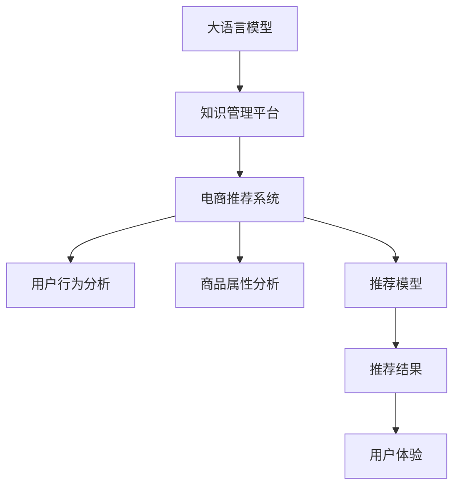

                 

# AI大模型视角下电商搜索推荐的技术创新知识管理平台

> 关键词：电商搜索推荐, 大语言模型, 知识管理, 技术创新, 平台架构

## 1. 背景介绍

随着互联网技术的不断进步和电子商务的快速发展，消费者的购物体验愈发受到重视。在电商平台上，如何高效、准确地为用户推荐商品，使其在琳琅满目的商品中快速找到心仪的宝贝，成为电商平台提升用户满意度和增加转化率的关键。传统的基于规则和统计的方法虽然易于实现，但缺乏对用户行为和个性化需求的深入理解，无法提供精准的商品推荐。

近年来，AI大模型的出现为电商推荐系统带来了新的突破。基于预训练的大语言模型，电商搜索推荐系统可以从海量文本数据中学习用户与商品之间的关联关系，从而提供更加个性化、精准的推荐。然而，如何高效地利用大模型的知识，并将其融入到电商推荐系统中，是一个复杂且富有挑战性的问题。本文将从大语言模型的视角，深入探讨电商搜索推荐的技术创新和知识管理平台的构建，以期为电商平台提供更有价值的用户体验。

## 2. 核心概念与联系

### 2.1 核心概念概述

为更好地理解本文的核心内容，本节将介绍几个关键的概念：

- 电商搜索推荐系统：电商平台的核心功能之一，通过分析用户行为数据和商品属性，为每个用户推荐可能感兴趣的商品。

- 大语言模型（LLM）：如BERT、GPT等，通过自监督学习任务在大规模无标签文本语料上进行预训练，学习语言的通用表示，具备强大的语言理解和生成能力。

- 知识管理平台（KMS）：一个集成了知识获取、组织、管理和应用的平台，能够有效地支撑大语言模型的知识推理、更新和应用。

- 技术创新：将大语言模型应用到电商搜索推荐中，提升推荐系统的个性化、准确性和实时性。

这些核心概念之间存在着紧密的联系，共同构成了大语言模型在电商搜索推荐中的应用框架。大语言模型提供广泛的语义知识，知识管理平台则通过结构化的知识库，将这种知识进行组织和管理，使电商推荐系统能够高效地利用这些知识，为用户提供更加个性化和精准的推荐服务。

### 2.2 核心概念原理和架构的 Mermaid 流程图(Mermaid 流程节点中不要有括号、逗号等特殊字符)



这个流程图展示了大语言模型在电商推荐系统中的应用流程：

1. 大语言模型从无标签文本中学习广泛的语义知识。
2. 知识管理平台对这些知识进行组织和管理，形成结构化的知识库。
3. 电商推荐系统在知识管理平台的支撑下，结合用户行为和商品属性，进行推荐模型的训练和优化。
4. 推荐模型根据用户行为和商品属性，生成推荐结果。
5. 推荐结果优化用户体验，提升电商平台的转化率和用户满意度。

这些概念和流程构成了大语言模型在电商搜索推荐中的技术创新知识管理平台，共同推动了电商推荐系统的不断发展。

## 3. 核心算法原理 & 具体操作步骤

### 3.1 算法原理概述

基于大语言模型的电商搜索推荐系统，其核心算法原理可以概括为以下几点：

- 预训练：使用大语言模型在大规模无标签文本语料上进行预训练，学习语言的通用表示。
- 知识抽取：从预训练语言模型中提取与电商相关的实体、关系和属性等知识。
- 知识融合：将抽取的知识与电商商品属性和用户行为数据进行融合，构建电商领域的新知识。
- 推荐模型：基于融合后的知识和新属性，训练电商推荐模型，预测用户对商品的可能兴趣。
- 反馈循环：根据用户反馈对知识进行更新和迭代，提升推荐的精度和个性化水平。

### 3.2 算法步骤详解

具体来说，电商搜索推荐系统的大语言模型应用可以分为以下几个关键步骤：

**Step 1: 数据预处理**

1. **数据获取**：收集电商平台的交易数据、用户行为数据、商品属性数据等，构建电商推荐系统所需的全量数据集。
2. **数据清洗**：去除数据集中的噪声和异常值，如缺失值、重复值等，确保数据质量。
3. **数据标注**：根据电商商品的属性和用户行为数据，对商品进行人工标注，形成电商推荐系统所需的监督数据集。

**Step 2: 大语言模型预训练**

1. **选择预训练模型**：选择适合电商领域的大语言模型，如BERT、GPT等，作为预训练模型的基础。
2. **预训练任务设计**：设计适用于电商领域的预训练任务，如文本分类、命名实体识别、情感分析等，使用预训练模型进行训练。
3. **模型保存**：保存预训练模型的权重和结构，以便后续微调使用。

**Step 3: 知识抽取和融合**

1. **实体抽取**：从预训练模型的输出中抽取电商领域的关键实体，如品牌、商品名称、类别等。
2. **关系抽取**：分析实体之间的关系，如商品之间的关联、用户与商品之间的交互等。
3. **属性抽取**：提取电商商品的属性，如价格、描述、图片等，形成电商领域的新知识。
4. **知识融合**：将抽取的实体、关系和属性等知识与电商商品属性和用户行为数据进行融合，构建电商领域的新知识库。

**Step 4: 推荐模型训练和优化**

1. **推荐模型选择**：选择适合的推荐算法，如协同过滤、内容推荐、混合推荐等，构建电商推荐模型。
2. **模型微调**：在大语言模型的基础上，使用电商推荐任务的数据集对推荐模型进行微调，优化模型的性能。
3. **模型评估**：在验证集和测试集上评估推荐模型的效果，根据评估结果调整模型参数和预训练模型权重。

**Step 5: 反馈循环和持续学习**

1. **用户反馈收集**：收集用户对推荐结果的反馈，包括点击率、购买率、满意度等指标。
2. **知识更新**：根据用户反馈，更新电商领域的知识库，提升推荐模型的精度和个性化水平。
3. **推荐迭代**：在知识更新后，对推荐模型进行迭代训练，进一步优化推荐效果。

### 3.3 算法优缺点

基于大语言模型的电商搜索推荐系统有以下优点：

- 个性化推荐：通过深度学习模型，结合大语言模型的语义知识，提供更加精准的个性化推荐。
- 实时更新：根据用户行为和商品属性，动态调整推荐模型，实时更新推荐结果。
- 泛化能力强：大语言模型具备较强的泛化能力，可以应对各种电商推荐场景和需求。

同时，该方法也存在一些缺点：

- 高计算成本：大规模预训练和微调需要大量的计算资源，对硬件设备要求较高。
- 数据依赖性强：电商推荐系统的推荐效果依赖于数据质量和数量，数据不全或不准确会影响推荐效果。
- 模型复杂度高：大语言模型和推荐模型的结合增加了模型的复杂度，需要更多的优化和调试。

尽管存在这些缺点，但大语言模型在电商搜索推荐中的应用，已经在诸多电商平台上取得了显著的成效，推动了电商平台的技术进步和用户体验的提升。

### 3.4 算法应用领域

基于大语言模型的电商搜索推荐系统，已经在多个电商平台上得到了广泛应用，涉及的商品推荐、用户画像构建、智能客服等领域。以下是几个典型的应用场景：

1. **商品推荐**：根据用户的历史行为和兴趣，实时生成个性化的商品推荐，提升用户购物体验和转化率。
2. **用户画像构建**：利用用户行为和商品属性数据，构建详细的用户画像，为后续的个性化推荐和精准营销提供基础。
3. **智能客服**：使用大语言模型进行智能对话，解答用户咨询，提升客服效率和用户体验。
4. **价格优化**：根据市场价格动态调整商品价格，提升平台的竞争力和利润率。
5. **内容推荐**：为电商平台的用户推荐相关的文章、视频等媒体内容，增加用户的停留时间和互动率。

以上应用场景展示了电商搜索推荐系统在大语言模型驱动下的广阔应用前景。

## 4. 数学模型和公式 & 详细讲解 & 举例说明（备注：数学公式请使用latex格式，latex嵌入文中独立段落使用 $$，段落内使用 $)
### 4.1 数学模型构建

在电商搜索推荐系统中，我们通常使用基于深度学习的推荐模型，如协同过滤、内容推荐等。这里以协同过滤为例，介绍电商推荐系统的数学模型构建。

假设电商推荐系统的用户集合为 $U$，商品集合为 $I$，用户对商品的评分矩阵为 $R \in \mathbb{R}^{m \times n}$，其中 $m$ 为用户数，$n$ 为商品数。协同过滤模型假设用户对商品的评分可以表示为 $r_{ui} = \alpha \cdot \text{sim}(u, i) + \beta \cdot e_{ui}$，其中 $\text{sim}(u, i)$ 为用户 $u$ 和商品 $i$ 的相似度，$\alpha$ 和 $\beta$ 为模型参数。

协同过滤模型的目标是最大化预测用户对商品的评分与实际评分的误差平方和，即：

$$
\min_{\theta} \frac{1}{N}\sum_{(u,i)\in R}(r_{ui} - f_{\theta}(u, i))^2
$$

其中 $f_{\theta}(u, i) = \alpha \cdot \text{sim}(u, i) + \beta \cdot e_{ui}$，$\theta = \{\alpha, \beta\}$。

通过梯度下降等优化算法，最小化上述损失函数，即可得到最佳的模型参数 $\theta^*$。

### 4.2 公式推导过程

以下是协同过滤模型的详细推导过程：

1. 假设用户 $u$ 对商品 $i$ 的评分 $r_{ui}$ 可以表示为两个因素的线性组合：用户与商品之间的相似度 $\text{sim}(u, i)$ 和用户对商品的评分 $e_{ui}$。
2. 设模型的参数为 $\theta = \{\alpha, \beta\}$，则预测用户对商品的评分为 $f_{\theta}(u, i) = \alpha \cdot \text{sim}(u, i) + \beta \cdot e_{ui}$。
3. 构建均方误差损失函数 $\mathcal{L}(\theta) = \frac{1}{N}\sum_{(u,i)\in R}(r_{ui} - f_{\theta}(u, i))^2$，最小化该损失函数即可得到最佳的模型参数 $\theta^*$。
4. 使用梯度下降等优化算法对模型参数进行迭代更新，直至收敛。

通过上述推导，我们可以理解协同过滤模型在大语言模型辅助下的推荐原理和计算过程。

### 4.3 案例分析与讲解

为了更好地理解协同过滤模型在电商推荐中的应用，下面给出一个具体的案例分析。

假设有一个电商平台，需要为用户推荐其可能感兴趣的商品。首先，收集用户的浏览、点击、购买等行为数据，构建用户-商品评分矩阵 $R$。然后，使用大语言模型对用户和商品进行实体抽取和关系抽取，形成电商领域的新知识库。接着，在协同过滤模型中，使用电商领域的新知识库，预测用户对商品的评分，生成推荐结果。最后，根据用户的反馈，不断更新知识库和推荐模型，提升推荐效果。

## 5. 项目实践：代码实例和详细解释说明
### 5.1 开发环境搭建

在进行电商搜索推荐系统的开发前，我们需要准备好开发环境。以下是使用Python进行TensorFlow开发的环境配置流程：

1. 安装Anaconda：从官网下载并安装Anaconda，用于创建独立的Python环境。

2. 创建并激活虚拟环境：
```bash
conda create -n tf-env python=3.8 
conda activate tf-env
```

3. 安装TensorFlow：根据CUDA版本，从官网获取对应的安装命令。例如：
```bash
conda install tensorflow -c pytorch -c conda-forge
```

4. 安装各类工具包：
```bash
pip install numpy pandas scikit-learn matplotlib tqdm jupyter notebook ipython
```

完成上述步骤后，即可在`tf-env`环境中开始电商搜索推荐系统的开发。

### 5.2 源代码详细实现

下面以协同过滤模型为例，给出使用TensorFlow进行电商推荐系统的PyTorch代码实现。

首先，定义电商推荐系统中的用户和商品：

```python
import tensorflow as tf
import numpy as np

# 定义用户和商品
m = 1000  # 用户数
n = 1000  # 商品数
R = np.random.rand(m, n)  # 用户-商品评分矩阵

# 定义模型参数
alpha = tf.Variable(tf.zeros([m, n]))
beta = tf.Variable(tf.zeros([m, n]))
```

然后，定义协同过滤模型的损失函数：

```python
def loss_function(r, y_hat):
    # 均方误差损失
    return tf.reduce_mean(tf.square(r - y_hat))

# 构建协同过滤模型
def collaborative_filtering_model(r, alpha, beta):
    # 相似度计算
    similarity = tf.matmul(r, alpha)
    # 预测评分
    y_hat = tf.matmul(similarity, beta) + tf.random.normal([m, n])
    # 损失函数
    return loss_function(r, y_hat)

# 计算损失函数
loss = collaborative_filtering_model(R, alpha, beta)
```

接着，定义优化器并更新模型参数：

```python
# 定义优化器
optimizer = tf.optimizers.Adam()

# 定义优化目标函数
def optimize(loss):
    return tf.gradients(loss, [alpha, beta])

# 优化模型参数
for i in range(100):
    # 计算梯度
    grads = optimize(loss)
    # 更新模型参数
    optimizer.apply_gradients(zip(grads, [alpha, beta]))
```

最后，测试优化后的模型：

```python
# 测试模型
r_test = np.random.rand(100, n)
y_hat_test = collaborative_filtering_model(r_test, alpha, beta)
print("测试评分预测结果：", y_hat_test)
```

以上就是使用TensorFlow对协同过滤模型进行电商推荐系统开发的完整代码实现。可以看到，通过TensorFlow的强大工具包，电商推荐系统的开发变得更加高效和便捷。

### 5.3 代码解读与分析

让我们再详细解读一下关键代码的实现细节：

**协同过滤模型**：
- 定义用户数和商品数，并随机生成一个用户-商品评分矩阵 $R$。
- 定义模型参数 $\alpha$ 和 $\beta$，分别用于计算相似度和预测评分。

**损失函数**：
- 定义损失函数为均方误差损失，用于衡量预测评分与实际评分之间的差异。
- 通过矩阵乘法计算相似度，然后使用矩阵乘法和随机噪声计算预测评分。

**优化器**：
- 使用Adam优化器，对模型参数 $\alpha$ 和 $\beta$ 进行优化。
- 定义优化目标函数，计算损失函数的梯度，并使用优化器更新模型参数。

**测试模型**：
- 随机生成一个测试评分矩阵 $r_test$，使用协同过滤模型进行预测，并输出预测结果。

可以看到，TensorFlow提供了一整套完备的工具链，使得电商推荐系统的开发变得更加简单和高效。开发者只需要关注具体的算法逻辑，而不需要深入到底层优化和计算图的构建中。

## 6. 实际应用场景

### 6.1 智能客服系统

智能客服系统是大语言模型在电商搜索推荐中常见的应用场景之一。通过大语言模型和知识管理平台的结合，智能客服系统可以实时解答用户咨询，提升客服效率和用户体验。

在具体实现中，可以使用大语言模型进行自然语言理解，将用户咨询意图转换为系统可处理的问题。然后，在知识管理平台中查找相关的知识库和答案，生成自然语言回复。最后，将回复结果返回给用户，完成智能客服的对话过程。

### 6.2 价格优化系统

价格优化系统通过大语言模型和推荐模型的结合，实时动态调整商品价格，提升平台的竞争力和利润率。

具体来说，可以收集市场价格数据，并使用大语言模型进行价格分析，提取价格变化趋势和波动因素。然后，在推荐模型中，结合市场价格和用户行为数据，预测用户对商品价格的敏感度，并动态调整商品价格。

### 6.3 个性化推荐系统

个性化推荐系统通过大语言模型和推荐模型的结合，提供更加精准、个性化的商品推荐。

在具体实现中，可以使用大语言模型对用户进行实体抽取和关系抽取，构建详细的用户画像。然后，在推荐模型中，结合用户画像和商品属性数据，进行个性化推荐。

### 6.4 未来应用展望

随着大语言模型和电商推荐系统的发展，未来的应用场景将更加丰富和多样化。以下是几个可能的未来应用展望：

1. **跨平台推荐**：将大语言模型和推荐模型应用于多个电商平台的推荐系统中，实现跨平台的用户画像和推荐服务。
2. **实时推荐**：利用大语言模型和推荐模型，实现实时动态推荐，提升用户的购物体验。
3. **虚拟试衣间**：使用大语言模型和推荐模型，为用户提供虚拟试衣间的服务，提升用户的购物体验和满意度。
4. **商品生成**：利用大语言模型生成新的商品描述和推荐文案，提升商品的吸引力。
5. **情感分析**：通过大语言模型和推荐模型，分析用户的情感和反馈，优化推荐模型和商品属性。

这些未来应用展望展示了电商搜索推荐系统在大语言模型驱动下的广阔前景。随着技术的不断进步，电商推荐系统必将迎来更多的创新和突破。

## 7. 工具和资源推荐

### 7.1 学习资源推荐

为了帮助开发者系统掌握电商搜索推荐系统的理论基础和实践技巧，这里推荐一些优质的学习资源：

1. 《深度学习：一种人工智能范式》：深入浅出地介绍了深度学习的基本概念和电商推荐系统的构建。
2. 《电商推荐系统实战》：面向电商推荐系统的实战指南，涵盖算法选择、数据处理、系统架构等多个方面。
3. 《自然语言处理基础》：讲解自然语言处理的基本原理和电商推荐系统的结合方法。
4. 《TensorFlow官方文档》：TensorFlow的官方文档，提供了详细的API介绍和代码示例。
5. 《推荐系统学习》：推荐系统领域的重要教材，涵盖协同过滤、内容推荐等多个算法。

通过对这些资源的学习实践，相信你一定能够快速掌握电商搜索推荐系统的精髓，并用于解决实际的电商推荐问题。

### 7.2 开发工具推荐

高效的开发离不开优秀的工具支持。以下是几款用于电商搜索推荐系统开发的常用工具：

1. TensorFlow：由Google主导开发的开源深度学习框架，生产部署方便，适合大规模工程应用。
2. PyTorch：基于Python的开源深度学习框架，灵活动态的计算图，适合快速迭代研究。
3. HuggingFace Transformers：提供了大量预训练模型，支持多种深度学习框架，方便电商推荐系统的开发。
4. Scikit-learn：Python的机器学习库，提供了丰富的算法和工具，用于数据处理和模型训练。
5. Pandas：数据处理和分析工具，方便电商推荐系统的数据清洗和预处理。

合理利用这些工具，可以显著提升电商推荐系统的开发效率，加快创新迭代的步伐。

### 7.3 相关论文推荐

电商搜索推荐系统的发展离不开学界的持续研究。以下是几篇奠基性的相关论文，推荐阅读：

1. "Collaborative Filtering for Implicit Feedback Datasets"：介绍了协同过滤算法在电商推荐系统中的应用。
2. "Item Recommendation Systems: Algorithms and Applications"：讲解了推荐系统的基本原理和电商推荐系统的构建。
3. "A Survey of Recommendation Systems"：综述了推荐系统的现状和未来发展方向，涵盖了电商推荐系统等多个领域。
4. "A Deep Learning Approach for Automatic Recommendation Generation"：介绍了深度学习在电商推荐系统中的应用。
5. "A Knowledge-Based Approach for Recommendation Systems"：探讨了知识管理平台在电商推荐系统中的应用。

这些论文代表了大语言模型在电商推荐系统中的研究脉络。通过学习这些前沿成果，可以帮助研究者把握学科前进方向，激发更多的创新灵感。

## 8. 总结：未来发展趋势与挑战

### 8.1 总结

本文对基于大语言模型的电商搜索推荐系统进行了全面系统的介绍。首先阐述了电商搜索推荐系统和大语言模型的研究背景和意义，明确了电商推荐系统在大语言模型辅助下的重要性。其次，从原理到实践，详细讲解了大语言模型在电商推荐系统中的应用流程，包括数据预处理、知识抽取、推荐模型训练和优化等关键步骤。最后，探讨了大语言模型在电商推荐系统中的应用场景和未来展望，展示了其广阔的发展前景。

通过本文的系统梳理，可以看到，基于大语言模型的电商搜索推荐系统已经在多个电商平台上取得了显著的成效，推动了电商平台的技术进步和用户体验的提升。未来，随着大语言模型和电商推荐系统的发展，该技术将会在更多的应用场景中大放异彩，为电商平台的创新发展注入新的动力。

### 8.2 未来发展趋势

展望未来，大语言模型在电商推荐系统中的应用将呈现以下几个发展趋势：

1. 模型规模持续增大。随着算力成本的下降和数据规模的扩张，预训练语言模型的参数量还将持续增长。超大规模语言模型蕴含的丰富语言知识，有望支撑更加复杂多变的电商推荐场景和需求。
2. 推荐算法的多样化。除了传统的协同过滤算法，未来会涌现更多推荐算法，如深度学习推荐、混合推荐等，提升推荐系统的多样性和精准性。
3. 知识融合的深度化。通过深度学习模型，大语言模型和推荐系统可以更好地融合用户行为、商品属性和外部知识，提升推荐系统的智能化水平。
4. 实时推荐技术的发展。随着硬件设备的升级和算法优化，实时推荐技术将得到进一步发展，提升推荐系统的响应速度和用户体验。
5. 跨平台推荐和社交推荐。通过大语言模型和推荐系统的结合，实现跨平台和社交推荐，提升推荐系统的覆盖范围和影响力。
6. 个性化和隐私保护。利用大语言模型和推荐系统，为用户提供更加个性化的推荐服务，同时保障用户隐私，提升用户的信任和满意度。

这些趋势凸显了大语言模型在电商推荐系统中的广泛应用前景。

### 8.3 面临的挑战

尽管大语言模型在电商推荐系统中已经取得了显著的成效，但在迈向更加智能化、普适化应用的过程中，它仍面临着诸多挑战：

1. 数据成本高昂。电商推荐系统的构建需要大量的数据，数据收集和处理成本较高，需要持续的投入和维护。
2. 算法复杂度高。大语言模型和推荐系统的结合增加了算法的复杂度，需要更多的优化和调试。
3. 计算资源需求大。大规模预训练和微调需要大量的计算资源，对硬件设备要求较高。
4. 模型鲁棒性不足。电商推荐系统面对域外数据时，泛化性能往往大打折扣。对于测试样本的微小扰动，推荐模型的预测也容易发生波动。
5. 可解释性不足。大语言模型和推荐系统的结合增加了模型的复杂度，导致模型的可解释性降低。
6. 安全性和隐私保护。电商推荐系统需要处理用户的隐私信息，如何保障数据安全和使用隐私是重要的研究课题。

### 8.4 研究展望

面对电商推荐系统面临的挑战，未来的研究需要在以下几个方面寻求新的突破：

1. 探索高效的数据收集和处理技术。采用自动化数据采集和标注工具，提高数据获取的效率和质量。
2. 研究高效的模型训练和优化方法。利用深度学习模型的压缩和剪枝技术，降低计算资源需求，提升模型性能。
3. 引入更多先验知识。将知识图谱、逻辑规则等外部知识引入电商推荐系统，提升推荐系统的泛化能力和鲁棒性。
4. 优化推荐模型的可解释性。利用自然语言处理和因果分析技术，提高推荐模型的可解释性和透明度。
5. 保障数据安全和使用隐私。采用数据脱敏、加密等技术，保障用户隐私数据的安全。

这些研究方向和突破，必将引领电商推荐系统向更高的台阶发展，为电商平台带来更加智能化、个性化的推荐服务。

## 9. 附录：常见问题与解答

**Q1：电商搜索推荐系统如何处理用户数据和商品数据？**

A: 电商搜索推荐系统通常会收集用户的浏览、点击、购买等行为数据，构建用户行为数据集。同时，收集商品的属性信息、图片、描述等，构建商品属性数据集。这些数据集通过预处理和清洗，去除噪声和异常值，形成电商推荐系统所需的全量数据集。

**Q2：如何选择合适的推荐算法？**

A: 电商搜索推荐系统需要根据实际情况选择合适的推荐算法。常见的推荐算法包括协同过滤、内容推荐、混合推荐等。协同过滤算法适用于数据量较大、用户数较多的场景，内容推荐算法适用于数据质量高、商品属性丰富的场景，混合推荐算法则融合了多种推荐策略，提升推荐效果。

**Q3：电商搜索推荐系统如何利用大语言模型？**

A: 电商搜索推荐系统通常利用大语言模型进行实体抽取和关系抽取，构建电商领域的新知识库。然后，在推荐模型中，利用这些知识库进行推荐预测，生成推荐结果。此外，大语言模型还可以用于智能客服系统、情感分析等辅助功能。

**Q4：如何优化电商搜索推荐系统的性能？**

A: 电商搜索推荐系统的性能优化可以从以下几个方面入手：
1. 数据预处理：通过数据清洗、特征工程等手段，提高数据质量。
2. 模型选择：根据实际情况选择合适的推荐算法和模型结构。
3. 模型优化：利用深度学习模型的压缩和剪枝技术，降低计算资源需求，提升模型性能。
4. 推荐策略优化：结合用户行为、商品属性和外部知识，优化推荐策略，提升推荐效果。

**Q5：电商搜索推荐系统如何保障用户隐私？**

A: 电商搜索推荐系统需要处理用户的隐私信息，保障数据安全和使用隐私是重要的研究课题。常见的隐私保护方法包括数据脱敏、加密、匿名化等技术，确保用户隐私数据的安全。

---

作者：禅与计算机程序设计艺术 / Zen and the Art of Computer Programming

