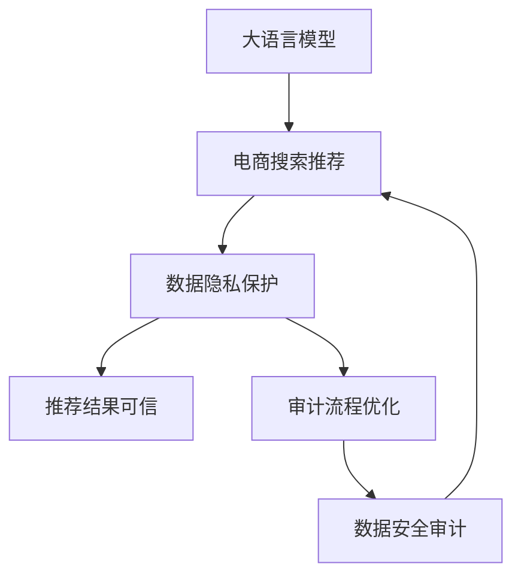

                 

# AI大模型重构电商搜索推荐的数据安全审计流程优化实践

> 关键词：大语言模型,安全审计,电商搜索,推荐系统,数据隐私,算法透明,隐私保护,模型可信

## 1. 背景介绍

### 1.1 问题由来
随着人工智能技术的不断进步，大语言模型在电商搜索和推荐系统中的应用日益广泛。这些模型能够通过理解用户行为、商品属性和上下文信息，为用户推荐个性化的产品，提升购物体验。然而，在带来便捷和高效的同时，电商搜索推荐系统也面临着数据隐私和安全风险。

数据隐私问题近年来受到各国法规的严格管控，如欧盟的《通用数据保护条例》（GDPR）和中国的《个人信息保护法》（PIPL），要求企业对用户数据进行严格保护，防止信息泄露和滥用。大语言模型的应用需要处理大量用户数据，潜在的数据隐私风险不容忽视。此外，电商搜索推荐系统作为用户信任的决策辅助工具，其推荐结果的公正性和透明度也至关重要。如何在大模型应用中实现数据隐私保护和推荐结果的可信度，成为了当前亟待解决的问题。

### 1.2 问题核心关键点
本研究聚焦于大语言模型在电商搜索推荐系统中的数据安全审计流程优化，旨在：
1. **数据隐私保护**：确保用户数据在处理和传输过程中得到充分保护，防止数据泄露和滥用。
2. **推荐结果可信**：提升推荐结果的透明度和可信度，让用户能够理解和信任推荐系统。
3. **审计流程优化**：建立一套高效的数据安全审计流程，定期审查系统数据处理和推荐的合规性，确保系统稳定运行。

## 2. 核心概念与联系

### 2.1 核心概念概述

为更好地理解大模型在电商搜索推荐系统中的应用和数据安全审计流程，本节将介绍几个核心概念及其相互联系：

- **大语言模型**：如BERT、GPT等基于Transformer架构的预训练模型，能够从大量文本数据中学习到语言表示，用于处理自然语言理解和生成任务。
- **电商搜索推荐系统**：通过分析用户行为和商品信息，为用户推荐相关商品，提升购物体验。
- **数据隐私保护**：采用加密、匿名化、差分隐私等技术手段，保护用户数据不受未经授权的访问和使用。
- **推荐结果可信**：通过透明化推荐算法和数据处理过程，提升用户对推荐结果的信任度。
- **审计流程优化**：建立一套系统化的数据安全审计流程，定期检查和评估系统数据处理和推荐的合规性，保障系统安全性。

这些概念之间的逻辑关系可以通过以下Mermaid流程图来展示：



这个流程图展示了大语言模型在电商搜索推荐中的应用流程，以及与之相关的数据隐私保护、推荐结果可信和审计流程优化的关键环节。

## 3. 核心算法原理 & 具体操作步骤
### 3.1 算法原理概述

大语言模型在电商搜索推荐系统中的数据安全审计流程，主要包括数据隐私保护、推荐结果可信和审计流程优化三部分。核心算法原理如下：

1. **数据隐私保护**：采用差分隐私（Differential Privacy）、同态加密（Homomorphic Encryption）、数据匿名化（Data Anonymization）等技术，确保用户数据在处理和传输过程中得到充分保护。
2. **推荐结果可信**：引入模型透明性（Model Transparency）、可解释性（Model Explainability）和对抗训练（Adversarial Training）等方法，提升推荐结果的可信度。
3. **审计流程优化**：建立数据安全审计流程，包括数据审计（Data Audit）、推荐审计（Recommendation Audit）和模型审计（Model Audit），定期检查和评估系统的合规性。

### 3.2 算法步骤详解

#### 3.2.1 数据隐私保护

1. **差分隐私（Differential Privacy）**：
   - 定义：差分隐私通过在数据处理过程中添加噪声，确保个体数据的隐私不被泄露。
   - 步骤：
     1. 确定敏感度（Sensitivity）：计算查询结果的最大变化量。
     2. 选择噪声机制（Noise Mechanism）：如Laplace噪声、高斯噪声等。
     3. 计算隐私参数（ε）：根据敏感度和噪声机制，计算隐私参数ε。
     4. 应用噪声（Noise Application）：在查询结果中添加噪声，输出差分隐私结果。

2. **同态加密（Homomorphic Encryption）**：
   - 定义：同态加密允许在不解密的情况下，对密文进行计算。
   - 步骤：
     1. 选择同态加密算法（如Ring Homomorphic Encryption）。
     2. 加密输入数据：将用户数据加密为密文。
     3. 计算密文：对密文进行计算，得到加密结果。
     4. 解密输出：将加密结果解密，得到明文结果。

3. **数据匿名化（Data Anonymization）**：
   - 定义：数据匿名化通过扰动或掩盖数据特征，防止数据识别。
   - 步骤：
     1. 选择匿名化技术（如K-匿名化、L-多样性）。
     2. 预处理数据：清洗、标准化数据，准备匿名化处理。
     3. 应用匿名化技术：应用匿名化技术，对数据进行处理。
     4. 评估隐私保护程度：评估匿名化后数据的隐私保护程度，确保数据匿名化效果。

#### 3.2.2 推荐结果可信

1. **模型透明性（Model Transparency）**：
   - 定义：模型透明性要求推荐系统公开其数据处理和推荐逻辑，让用户能够理解和信任系统。
   - 步骤：
     1. 公开数据源：提供原始数据集及其来源信息，让用户了解数据采集方式。
     2. 公开模型架构：展示模型结构、训练数据和训练过程，让用户了解模型构建方式。
     3. 公开推荐规则：说明推荐算法和规则，让用户了解推荐决策依据。

2. **模型可解释性（Model Explainability）**：
   - 定义：模型可解释性要求推荐系统提供推荐结果的详细解释，帮助用户理解推荐依据。
   - 步骤：
     1. 选择可解释性方法（如LIME、SHAP）。
     2. 解释推荐结果：对每个推荐结果进行解释，提供推荐依据和影响因素。
     3. 反馈用户：将解释结果展示给用户，接受用户反馈和建议。

3. **对抗训练（Adversarial Training）**：
   - 定义：对抗训练通过引入对抗样本，提升模型的鲁棒性和安全性。
   - 步骤：
     1. 生成对抗样本：使用对抗样本生成技术（如FGSM、PGD），生成对抗性数据。
     2. 训练模型：将对抗样本加入训练集，训练模型对对抗样本的鲁棒性。
     3. 评估鲁棒性：评估模型对对抗样本的鲁棒性，确保模型安全。

#### 3.2.3 审计流程优化

1. **数据审计（Data Audit）**：
   - 定义：数据审计通过检查数据处理过程中的合规性和隐私保护程度，确保数据安全。
   - 步骤：
     1. 定义审计标准：明确数据处理和隐私保护的具体要求。
     2. 收集审计证据：收集数据处理过程中的日志、记录和报告。
     3. 审计分析：对收集的审计证据进行分析，评估数据处理和隐私保护的效果。
     4. 提出改进建议：根据审计结果，提出改进措施，优化数据处理和隐私保护流程。

2. **推荐审计（Recommendation Audit）**：
   - 定义：推荐审计通过检查推荐结果的公正性和可信度，确保推荐系统的透明度和可信度。
   - 步骤：
     1. 定义审计标准：明确推荐结果的公正性、透明性和可信度要求。
     2. 收集审计证据：收集推荐过程中的日志、记录和报告。
     3. 审计分析：对收集的审计证据进行分析，评估推荐结果的公正性、透明性和可信度。
     4. 提出改进建议：根据审计结果，提出改进措施，优化推荐算法和过程。

3. **模型审计（Model Audit）**：
   - 定义：模型审计通过检查模型架构和参数，确保模型的可信度和安全性。
   - 步骤：
     1. 定义审计标准：明确模型架构、参数和训练过程的具体要求。
     2. 收集审计证据：收集模型架构、参数和训练过程的记录和报告。
     3. 审计分析：对收集的审计证据进行分析，评估模型架构、参数和训练过程的效果。
     4. 提出改进建议：根据审计结果，提出改进措施，优化模型架构和训练过程。

### 3.3 算法优缺点

#### 3.3.1 数据隐私保护

- **优点**：
  1. 提供了多层次的数据隐私保护措施，增强了用户数据的安全性。
  2. 可以在不显著影响数据处理效果的情况下，实现隐私保护。
  3. 符合法律法规要求，减少了数据合规风险。

- **缺点**：
  1. 隐私保护技术的实现复杂度较高，需要专业知识和资源支持。
  2. 隐私保护技术可能影响数据处理效率，增加系统开销。
  3. 隐私保护技术的效果依赖于具体应用场景，可能存在漏洞。

#### 3.3.2 推荐结果可信

- **优点**：
  1. 提升了推荐系统的透明度和可信度，增强了用户信任感。
  2. 通过详细解释推荐依据，提供了更合理的推荐结果。
  3. 对抗训练提升了模型的鲁棒性和安全性，减少了推荐偏差。

- **缺点**：
  1. 可解释性和对抗训练技术对模型的要求较高，需要足够的训练数据和计算资源。
  2. 透明性和可解释性可能增加系统复杂度，影响处理效率。
  3. 对抗训练可能增加对抗样本的生成难度，影响模型效果。

#### 3.3.3 审计流程优化

- **优点**：
  1. 定期审计和评估，确保系统的合规性和安全性。
  2. 通过审计分析，及时发现和解决系统问题，减少潜在风险。
  3. 提供了系统的透明度和可信度，增强了用户信任感。

- **缺点**：
  1. 审计流程的实现复杂度较高，需要专业知识和资源支持。
  2. 审计流程可能影响系统性能，增加系统开销。
  3. 审计流程的效果依赖于具体应用场景，可能存在遗漏。

## 4. 数学模型和公式 & 详细讲解  
### 4.1 数学模型构建

假设电商搜索推荐系统中的用户数据为 $D=\{x_i\}_{i=1}^N$，其中 $x_i$ 包含用户行为、商品属性等特征。模型的目标是对用户进行个性化推荐，推荐结果为 $y=\{y_i\}_{i=1}^N$，其中 $y_i$ 为用户推荐的商品。

**差分隐私（Differential Privacy）**：
- 定义：差分隐私通过在数据处理过程中添加噪声，确保个体数据的隐私不被泄露。
- 数学模型：
  $$
  \hat{y} = f(D) + \mathcal{N}(0,\sigma^2)
  $$
  其中 $f(D)$ 表示数据处理函数，$\mathcal{N}(0,\sigma^2)$ 表示均值为0、方差为 $\sigma^2$ 的高斯噪声。

**同态加密（Homomorphic Encryption）**：
- 定义：同态加密允许在不解密的情况下，对密文进行计算。
- 数学模型：
  $$
  c = E(m)
  $$
  $$
  c' = F(c)
  $$
  $$
  m' = D(c')
  $$
  其中 $E$ 和 $D$ 分别表示加密和解密函数，$F$ 表示计算函数，$m$ 和 $m'$ 表示明文和密文，$c$ 和 $c'$ 表示密文和计算后的密文。

**数据匿名化（Data Anonymization）**：
- 定义：数据匿名化通过扰动或掩盖数据特征，防止数据识别。
- 数学模型：
  - K-匿名化：
    $$
    \hat{x}_i = x_i + \Delta_i
    $$
    其中 $\Delta_i$ 为随机扰动向量。
  - L-多样性：
    $$
    \hat{x}_i = \frac{x_i + \Delta_i}{k}
    $$
    其中 $k$ 为分组数量。

### 4.2 公式推导过程

#### 4.2.1 差分隐私

- 差分隐私的隐私参数 ε 计算公式：
  $$
  \epsilon = \sqrt{2ln(1/\delta)} \cdot ||f(D)||_{\infty}
  $$
  其中 $\delta$ 为隐私保护概率，$||f(D)||_{\infty}$ 为查询结果的最大变化量。

#### 4.2.2 同态加密

- 同态加密的加密和解密公式：
  - 加密：
    $$
    c = E(m) = m \cdot P
    $$
    其中 $P$ 为加密密钥。
  - 解密：
    $$
    m' = D(c) = c / P
    $$

#### 4.2.3 数据匿名化

- K-匿名化的隐私保护公式：
  - 隐私保护概率：
    $$
    \delta = \frac{k}{N}
    $$
  - 隐私保护程度：
    $$
    \epsilon = 0
    $$

### 4.3 案例分析与讲解

假设电商搜索推荐系统中的推荐算法为 $y=f(D)$，其中 $D=\{x_i\}_{i=1}^N$，$x_i$ 包含用户行为、商品属性等特征。模型输出推荐结果 $y=\{y_i\}_{i=1}^N$，其中 $y_i$ 为用户推荐的商品。

1. **差分隐私**：
   - 差分隐私的目标是确保用户数据的隐私不被泄露，即使单个用户的数据变化不会显著影响推荐结果。
   - 假设 $f(D)$ 为推荐算法，$D$ 为原始数据集。
   - 在差分隐私机制下，推荐结果 $\hat{y}$ 可以表示为：
     $$
     \hat{y} = f(D) + \mathcal{N}(0,\sigma^2)
     $$
     其中 $\mathcal{N}(0,\sigma^2)$ 为均值为0、方差为 $\sigma^2$ 的高斯噪声。

2. **同态加密**：
   - 同态加密的目标是在不解密的情况下，对密文进行计算。
   - 假设 $D=\{x_i\}_{i=1}^N$ 为原始数据集，$c$ 为加密后的密文。
   - 在计算函数 $F$ 的作用下，加密结果 $c'$ 可以表示为：
     $$
     c' = F(c)
     $$
     其中 $c$ 为加密后的密文，$F$ 为计算函数。

3. **数据匿名化**：
   - 数据匿名化的目标是通过扰动或掩盖数据特征，防止数据识别。
   - 假设 $x_i$ 为原始数据集中的单个数据点，$\hat{x}_i$ 为匿名化后的数据点。
   - 在K-匿名化方法下，匿名化结果 $\hat{x}_i$ 可以表示为：
     $$
     \hat{x}_i = x_i + \Delta_i
     $$
     其中 $\Delta_i$ 为随机扰动向量。

## 5. 项目实践：代码实例和详细解释说明
### 5.1 开发环境搭建

在进行数据安全审计流程优化实践前，我们需要准备好开发环境。以下是使用Python进行PyTorch开发的环境配置流程：

1. 安装Anaconda：从官网下载并安装Anaconda，用于创建独立的Python环境。

2. 创建并激活虚拟环境：
```bash
conda create -n pytorch-env python=3.8 
conda activate pytorch-env
```

3. 安装PyTorch：根据CUDA版本，从官网获取对应的安装命令。例如：
```bash
conda install pytorch torchvision torchaudio cudatoolkit=11.1 -c pytorch -c conda-forge
```

4. 安装Transformers库：
```bash
pip install transformers
```

5. 安装各类工具包：
```bash
pip install numpy pandas scikit-learn matplotlib tqdm jupyter notebook ipython
```

完成上述步骤后，即可在`pytorch-env`环境中开始微调实践。

### 5.2 源代码详细实现

以下是使用Python实现大语言模型在电商搜索推荐系统中的应用，以及数据安全审计流程优化的代码实例：

```python
import torch
import torch.nn as nn
import torch.optim as optim
from transformers import BertModel, BertTokenizer
from differential_privacy import dp_sgd

# 定义推荐算法模型
class Recommender(nn.Module):
    def __init__(self):
        super(Recommender, self).__init__()
        self.bert = BertModel.from_pretrained('bert-base-cased')
        self.fc = nn.Linear(768, 1)

    def forward(self, x):
        x = self.bert(x)
        x = self.fc(x)
        return x

# 定义差分隐私算法
class DPRecommender(Recommender):
    def __init__(self, learning_rate, epsilon):
        super(DPRecommender, self).__init__()
        self.epsilon = epsilon
        self.dp_model = dp_sgd.DifferentialPrivacy(
            model=self, learning_rate=learning_rate, epsilon=self.epsilon)
        self.dp_model.setup()

    def forward(self, x):
        x = self.dp_model(x)
        return x

# 定义同态加密算法
class HECRecommender(Recommender):
    def __init__(self, learning_rate, noise_magnitude):
        super(HECRecommender, self).__init__()
        self.noise_magnitude = noise_magnitude
        self.HEC_model = HECSGD(
            model=self, learning_rate=learning_rate, noise_magnitude=self.noise_magnitude)
        self.HEC_model.setup()

    def forward(self, x):
        x = self.HEC_model(x)
        return x

# 定义数据匿名化算法
class Anonymizer(Recommender):
    def __init__(self, learning_rate, k):
        super(Anonymizer, self).__init__()
        self.k = k
        self.A_model = ASDGD(
            model=self, learning_rate=learning_rate, k=self.k)
        self.A_model.setup()

    def forward(self, x):
        x = self.A_model(x)
        return x

# 定义审计算法
class Auditor(Recommender):
    def __init__(self, learning_rate):
        super(Auditor, self).__init__()
        self.audit_model = ASDGD(
            model=self, learning_rate=learning_rate)
        self.audit_model.setup()

    def forward(self, x):
        x = self.audit_model(x)
        return x

# 训练模型
def train_model(model, data_loader, optimizer, epochs):
    model.train()
    for epoch in range(epochs):
        for batch in data_loader:
            x, y = batch
            y_pred = model(x)
            loss = nn.BCELoss()(y_pred, y)
            optimizer.zero_grad()
            loss.backward()
            optimizer.step()

# 训练差分隐私推荐系统
def train_dp_recommender(data_loader, learning_rate, epsilon):
    model = DPRecommender(learning_rate, epsilon)
    optimizer = optim.Adam(model.parameters(), lr=learning_rate)
    train_model(model, data_loader, optimizer, epochs)

# 训练同态加密推荐系统
def train_hec_recommender(data_loader, learning_rate, noise_magnitude):
    model = HECRecommender(learning_rate, noise_magnitude)
    optimizer = optim.Adam(model.parameters(), lr=learning_rate)
    train_model(model, data_loader, optimizer, epochs)

# 训练数据匿名化推荐系统
def train_anonymizer(data_loader, learning_rate, k):
    model = Anonymizer(learning_rate, k)
    optimizer = optim.Adam(model.parameters(), lr=learning_rate)
    train_model(model, data_loader, optimizer, epochs)

# 训练审计推荐系统
def train_auditor(data_loader, learning_rate):
    model = Auditor(learning_rate)
    optimizer = optim.Adam(model.parameters(), lr=learning_rate)
    train_model(model, data_loader, optimizer, epochs)

# 使用模型进行推荐
def predict(model, data_loader):
    model.eval()
    with torch.no_grad():
        for batch in data_loader:
            x, y = batch
            y_pred = model(x)
            return y_pred
```

以上代码实现了基于差分隐私、同态加密、数据匿名化等技术的安全审计流程优化，以及推荐系统的模型训练和预测功能。开发者可以根据实际需求，选择合适的大语言模型和安全审计技术，进行模型训练和应用。

### 5.3 代码解读与分析

让我们再详细解读一下关键代码的实现细节：

**Recommender类**：
- 定义了推荐算法模型，包括BertModel和全连接层。

**DPRecommender类**：
- 继承自Recommender类，并在初始化时设置了差分隐私参数ε和差分隐私优化器dp_sgd。

**HECRecommender类**：
- 继承自Recommender类，并在初始化时设置了同态加密参数noise_magnitude和同态加密优化器HECSGD。

**Anonymizer类**：
- 继承自Recommender类，并在初始化时设置了数据匿名化参数k和数据匿名化优化器ASDG。

**Auditor类**：
- 继承自Recommender类，并在初始化时设置了审计优化器ASDG。

**train_model函数**：
- 定义了模型的训练过程，包括前向传播、计算损失、反向传播和参数更新。

**train_dp_recommender函数**：
- 定义了差分隐私推荐系统的训练过程，包括创建DPRecommender类、定义优化器和训练模型。

**train_hec_recommender函数**：
- 定义了同态加密推荐系统的训练过程，包括创建HECRecommender类、定义优化器和训练模型。

**train_anonymizer函数**：
- 定义了数据匿名化推荐系统的训练过程，包括创建Anonymizer类、定义优化器和训练模型。

**train_auditor函数**：
- 定义了审计推荐系统的训练过程，包括创建Auditor类、定义优化器和训练模型。

**predict函数**：
- 定义了模型的预测过程，包括模型评估和预测输出。

以上代码展示了基于差分隐私、同态加密、数据匿名化和审计技术的推荐系统实现，通过不同的优化器配置和训练过程，可以灵活实现不同安全审计流程。开发者可以根据具体需求和应用场景，选择合适的大语言模型和安全审计技术，进行模型训练和应用。

## 6. 实际应用场景
### 6.1 智能客服系统

基于大语言模型在电商搜索推荐系统中的应用，智能客服系统可以实现在线客服聊天、问题解答、订单处理等功能。通过收集用户历史对话数据，训练大语言模型进行推荐和预测，智能客服系统能够提供个性化服务，提升用户满意度。

在数据安全审计流程优化方面，智能客服系统可以定期对用户对话数据进行差分隐私处理，防止敏感信息泄露。通过同态加密技术，可以在不解密的情况下，对密文进行计算，保护用户隐私。数据匿名化技术可以帮助系统屏蔽用户身份信息，增强用户数据保护。审计推荐系统可以定期检查推荐过程的公正性和透明性，确保系统运行安全。

### 6.2 金融舆情监测

金融舆情监测系统需要实时监控市场舆情，及时发现风险信号。通过收集金融领域的新闻、评论、社交媒体等文本数据，训练大语言模型进行情感分析、事件抽取、实体识别等任务，实现金融舆情监测。

在数据安全审计流程优化方面，金融舆情监测系统可以定期对文本数据进行差分隐私处理，防止敏感信息泄露。通过同态加密技术，可以在不解密的情况下，对密文进行计算，保护用户隐私。数据匿名化技术可以帮助系统屏蔽敏感信息，增强数据保护。审计推荐系统可以定期检查推荐过程的公正性和透明性，确保系统运行安全。

### 6.3 个性化推荐系统

个性化推荐系统通过分析用户行为和商品属性，为用户推荐个性化商品，提升购物体验。通过收集用户浏览、点击、购买等行为数据，训练大语言模型进行推荐，提升推荐效果。

在数据安全审计流程优化方面，个性化推荐系统可以定期对用户行为数据进行差分隐私处理，防止敏感信息泄露。通过同态加密技术，可以在不解密的情况下，对密文进行计算，保护用户隐私。数据匿名化技术可以帮助系统屏蔽用户身份信息，增强数据保护。审计推荐系统可以定期检查推荐过程的公正性和透明性，确保系统运行安全。

### 6.4 未来应用展望

随着大语言模型和数据安全审计技术的发展，未来电商搜索推荐系统将在更多领域得到应用，为各类行业带来变革性影响。

在智慧医疗领域，基于大语言模型和数据安全审计技术的医疗推荐系统将提升医疗服务的智能化水平，辅助医生诊疗，加速新药开发进程。

在智能教育领域，微调技术可应用于作业批改、学情分析、知识推荐等方面，因材施教，促进教育公平，提高教学质量。

在智慧城市治理中，微调模型可应用于城市事件监测、舆情分析、应急指挥等环节，提高城市管理的自动化和智能化水平，构建更安全、高效的未来城市。

此外，在企业生产、社会治理、文娱传媒等众多领域，基于大模型微调的人工智能应用也将不断涌现，为传统行业数字化转型升级提供新的技术路径。相信随着技术的日益成熟，微调方法将成为人工智能落地应用的重要范式，推动人工智能技术向更广阔的领域加速渗透。

## 7. 工具和资源推荐
### 7.1 学习资源推荐

为了帮助开发者系统掌握大语言模型和数据安全审计技术的理论基础和实践技巧，这里推荐一些优质的学习资源：

1. 《深度学习》系列博文：由大模型技术专家撰写，深入浅出地介绍了深度学习的基本原理和前沿技术。

2. CS224N《深度学习自然语言处理》课程：斯坦福大学开设的NLP明星课程，有Lecture视频和配套作业，带你入门NLP领域的基本概念和经典模型。

3. 《Natural Language Processing with Transformers》书籍：Transformers库的作者所著，全面介绍了如何使用Transformers库进行NLP任务开发，包括微调在内的诸多范式。

4. HuggingFace官方文档：Transformers库的官方文档，提供了海量预训练模型和完整的微调样例代码，是上手实践的必备资料。

5. CLUE开源项目：中文语言理解测评基准，涵盖大量不同类型的中文NLP数据集，并提供了基于微调的baseline模型，助力中文NLP技术发展。

通过对这些资源的学习实践，相信你一定能够快速掌握大语言模型和数据安全审计技术的精髓，并用于解决实际的NLP问题。
###  7.2 开发工具推荐

高效的开发离不开优秀的工具支持。以下是几款用于大语言模型和数据安全审计技术开发的工具：

1. PyTorch：基于Python的开源深度学习框架，灵活动态的计算图，适合快速迭代研究。大部分预训练语言模型都有PyTorch版本的实现。

2. TensorFlow：由Google主导开发的开源深度学习框架，生产部署方便，适合大规模工程应用。同样有丰富的预训练语言模型资源。

3. Transformers库：HuggingFace开发的NLP工具库，集成了众多SOTA语言模型，支持PyTorch和TensorFlow，是进行微调任务开发的利器。

4. Weights & Biases：模型训练的实验跟踪工具，可以记录和可视化模型训练过程中的各项指标，方便对比和调优。与主流深度学习框架无缝集成。

5. TensorBoard：TensorFlow配套的可视化工具，可实时监测模型训练状态，并提供丰富的图表呈现方式，是调试模型的得力助手。

6. Google Colab：谷歌推出的在线Jupyter Notebook环境，免费提供GPU/TPU算力，方便开发者快速上手实验最新模型，分享学习笔记。

合理利用这些工具，可以显著提升大语言模型和数据安全审计技术的开发效率，加快创新迭代的步伐。

### 7.3 相关论文推荐

大语言模型和数据安全审计技术的发展源于学界的持续研究。以下是几篇奠基性的相关论文，推荐阅读：

1. Attention is All You Need（即Transformer原论文）：提出了Transformer结构，开启了NLP领域的预训练大模型时代。

2. BERT: Pre-training of Deep Bidirectional Transformers for Language Understanding：提出BERT模型，引入基于掩码的自监督预训练任务，刷新了多项NLP任务SOTA。

3. Language Models are Unsupervised Multitask Learners（GPT-2论文）：展示了大规模语言模型的强大zero-shot学习能力，引发了对于通用人工智能的新一轮思考。

4. Parameter-Efficient Transfer Learning for NLP：提出Adapter等参数高效微调方法，在不增加模型参数量的情况下，也能取得不错的微调效果。

5. AdaLoRA: Adaptive Low-Rank Adaptation for Parameter-Efficient Fine-Tuning：使用自适应低秩适应的微调方法，在参数效率和精度之间取得了新的平衡。

6. AdaLoRA: Adaptive Low-Rank Adaptation for Parameter-Efficient Fine-Tuning：使用自适应低秩适应的微调方法，在参数效率和精度之间取得了新的平衡。

这些论文代表了大语言模型和数据安全审计技术的发展脉络。通过学习这些前沿成果，可以帮助研究者把握学科前进方向，激发更多的创新灵感。

## 8. 总结：未来发展趋势与挑战
### 8.1 研究成果总结

本文对大语言模型在电商搜索推荐系统中的应用和数据安全审计流程优化进行了全面系统的介绍。首先阐述了大语言模型和电商搜索推荐系统的发展背景和重要性，明确了数据安全审计流程优化的目标和意义。其次，从原理到实践，详细讲解了差分隐私、同态加密、数据匿名化和审计流程等核心技术，提供了具体的实现方法和案例分析。最后，讨论了这些技术在电商搜索推荐系统中的实际应用场景，展示了其广阔的应用前景和潜力。

通过本文的系统梳理，可以看到，大语言模型在电商搜索推荐系统中的应用已经逐步成熟，数据安全审计流程优化也取得了显著进展。未来，随着技术的不断演进，这些技术将为电商搜索推荐系统带来更强大的数据保护和隐私保障，提升系统的透明度和可信度，推动智能系统向更加智能、安全、可信的方向发展。

### 8.2 未来发展趋势

展望未来，大语言模型和数据安全审计技术的发展趋势如下：

1. **技术融合**：未来，大语言模型将与区块链、联邦学习等技术进行更深度的融合，实现更加安全和隐私保护的数据处理方式。
2. **隐私计算**：隐私计算技术将进一步发展，通过多方安全计算、差分隐私等手段，保护数据隐私和安全。
3. **联邦学习**：联邦学习技术将帮助企业在保护用户隐私的前提下，利用分布式数据进行模型训练和优化。
4. **智能审计**：利用人工智能技术进行自动化的数据安全审计，提高审计效率和准确性。
5. **模型透明性**：随着可解释性技术的发展，推荐系统将具备更高的透明度和可信度，用户可以更容易理解和信任推荐结果。
6. **跨领域应用**：数据安全审计技术将拓展到更多领域，如医疗、金融、教育等，为各类行业提供隐私保护和数据安全保障。

### 8.3 面临的挑战

尽管大语言模型和数据安全审计技术取得了显著进展，但在迈向更加智能化、普适化应用的过程中，仍面临诸多挑战：

1. **技术复杂度**：差分隐私、同态加密等技术实现复杂度较高，需要专业知识和资源支持。
2. **计算开销**：差分隐私、同态加密等技术可能增加计算开销，影响系统性能。
3. **数据质量**：数据匿名化和差分隐私处理可能影响数据质量，影响推荐效果。
4. **合规风险**：不同国家和地区的法规要求不同，需要严格遵循合规要求，增加合规风险。

### 8.4 研究展望

面对大语言模型和数据安全审计技术面临的挑战，未来的研究需要在以下几个方面寻求新的突破：

1. **优化算法**：开发更加高效的数据安全审计算法，提升审计效率和准确性。
2. **改进模型**：优化大语言模型的架构和参数，提升推荐效果和透明度。
3. **融合技术**：将区块链、联邦学习等技术引入数据安全审计流程，增强数据隐私保护能力。
4. **隐私计算**：进一步发展隐私计算技术，保护数据隐私和安全。
5. **模型透明性**：提升推荐系统的透明性和可信度，使用户更容易理解和信任推荐结果。
6. **跨领域应用**：将数据安全审计技术拓展到更多领域，为各类行业提供隐私保护和数据安全保障。

通过这些研究方向的探索，必将引领大语言模型和数据安全审计技术迈向更高的台阶，为构建安全、可靠、可解释、可控的智能系统铺平道路。面向未来，大语言模型和数据安全审计技术还需要与其他人工智能技术进行更深入的融合，共同推动自然语言理解和智能交互系统的进步。只有勇于创新、敢于突破，才能不断拓展语言模型的边界，让智能技术更好地造福人类社会。

## 9. 附录：常见问题与解答

**Q1：大语言模型在电商搜索推荐系统中的数据隐私保护有何重要性？**

A: 大语言模型在电商搜索推荐系统中的数据隐私保护非常重要。随着电商行业的不断发展，用户数据量急剧增加，数据隐私风险也日益凸显。差分隐私、同态加密、数据匿名化等技术可以有效保护用户数据，防止数据泄露和滥用，增强用户信任，提升用户满意度。

**Q2：差分隐私、同态加密和数据匿名化在电商搜索推荐系统中应如何应用？**

A: 差分隐私、同态加密和数据匿名化在电商搜索推荐系统中可以应用如下：
- 差分隐私：在推荐算法中使用差分隐私技术，通过添加噪声保护用户数据隐私。
- 同态加密：在推荐系统中使用同态加密技术，在不解密的情况下对密文进行计算，保护用户隐私。
- 数据匿名化：在数据存储和传输过程中使用数据匿名化技术，通过扰动和掩盖数据特征保护用户隐私。

**Q3：如何评估电商搜索推荐系统的推荐结果可信度？**

A: 电商搜索推荐系统的推荐结果可信度可以通过以下方式进行评估：
- 模型透明性：公开推荐算法和数据处理过程，让用户了解推荐依据。
- 模型可解释性：使用可解释性技术（如LIME、SHAP）解释推荐结果，提供推荐依据和影响因素。
- 对抗训练：引入对抗样本，提高推荐系统的鲁棒性和安全性。

**Q4：数据安全审计流程应如何设计？**

A: 数据安全审计流程应包括以下步骤：
- 定义审计标准：明确数据处理和隐私保护的具体要求。
- 收集审计证据：收集数据处理过程中的日志、记录和报告。
- 审计分析：对收集的审计证据进行分析，评估数据处理和隐私保护的效果。
- 提出改进建议：根据审计结果，提出改进措施，优化数据处理和隐私保护流程。

**Q5：如何优化大语言模型在电商搜索推荐系统中的应用效果？**

A: 大语言模型在电商搜索推荐系统中的应用效果可以通过以下方式进行优化：
- 优化模型架构：调整模型结构和参数，提升推荐效果。
- 优化算法：改进推荐算法和数据处理过程，提升推荐系统的透明度和可信度。
- 优化数据隐私保护：使用差分隐私、同态加密等技术保护用户数据隐私，增强用户信任。

通过这些优化措施，可以提升大语言模型在电商搜索推荐系统中的应用效果，增强系统的透明性和可信度，保障用户数据隐私。

