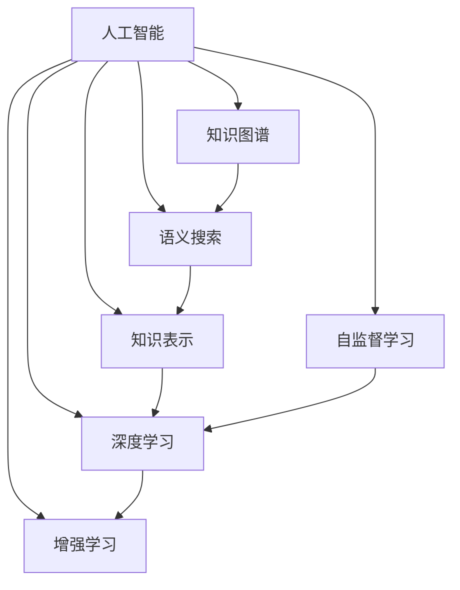

                 

# AI如何助力人类知识增长

> 关键词：人工智能, 知识图谱, 语义搜索, 知识表示, 自监督学习, 深度学习, 知识增强学习

## 1. 背景介绍

### 1.1 问题由来

人类社会的发展离不开知识的积累与传播。从早期的口口相传，到纸张、印刷的发明，再到电子化、网络化知识的普及，知识传播的方式不断迭代升级。然而，即便有了现代科技的加持，人类获取知识的效率仍远低于理想状态。这不仅导致了大量信息被忽视或遗忘，也阻碍了知识的进一步挖掘与应用。

面对这一挑战，人工智能（AI）技术的崛起提供了一种全新的解决方案。AI可以通过算法模型，自动化地识别、整理、加工、应用海量知识，从而大幅度提升知识传播与利用的效率，助力人类社会在知识增长上的跨越式进步。

### 1.2 问题核心关键点

AI助力人类知识增长的核心在于以下三点：

1. **大规模知识图谱构建**：AI可以自动从文本、图像、视频等多种信息源中提取出知识，构建大规模知识图谱。这为知识的系统化存储与高效检索提供了基础。

2. **语义搜索与知识表示**：通过深度学习等技术，AI能够理解并解析自然语言，实现精准的知识搜索与关联。知识表示技术则使得知识以结构化、可推理的方式存储，便于AI进一步处理与理解。

3. **自监督与增强学习**：AI通过自监督学习等方式，不断优化模型，提升对知识理解的深度与广度。增强学习则通过模拟与反馈，让AI能够动态学习新的知识应用场景，更好地服务于人类。

这些核心技术的结合，使得AI能够在知识获取、整理、传播与应用的各个环节发挥作用，从而有效提升知识的价值与效率。

## 2. 核心概念与联系

### 2.1 核心概念概述

为更好地理解AI如何助力人类知识增长，本节将介绍几个密切相关的核心概念：

- **人工智能（AI）**：基于算法与数据，模拟人类智能的技术体系。AI的应用范围广泛，涵盖自然语言处理、计算机视觉、机器人等诸多领域。
- **知识图谱**：一种结构化的知识表示方法，通过节点和边的关系，构建知识网络。知识图谱支持语义搜索、知识推理等高级应用。
- **语义搜索**：一种能够理解用户查询意图，并提供精准搜索结果的技术。不同于关键词搜索，语义搜索关注于知识的内涵而非表面的词汇匹配。
- **知识表示**：将知识转换为结构化数据的过程，使得知识可以用于计算机理解和处理。常见的知识表示方法包括RDF、OWL等。
- **自监督学习**：一种无需标注数据即可训练模型的学习方法，通过预设任务或数据自相关性进行学习。
- **深度学习**：一种基于神经网络的机器学习方法，通过多层非线性映射，提取数据特征。深度学习在知识获取与表示中发挥重要作用。
- **增强学习**：通过模拟环境与反馈，让AI不断优化策略，提升任务性能。增强学习在知识应用中尤为重要。

这些核心概念之间的逻辑关系可以通过以下Mermaid流程图来展示：



这个流程图展示了几类AI技术相互之间的联系：

1. **人工智能**作为基础，涵盖了知识图谱、语义搜索、知识表示、自监督学习、深度学习与增强学习等多种技术。
2. **知识图谱**与**语义搜索**紧密结合，为知识检索与关联提供基础。
3. **知识表示**与**深度学习**相结合，使得知识可以以结构化方式被计算机理解与处理。
4. **自监督学习**与**深度学习**互补，提升模型对知识的内在理解。
5. **增强学习**通过模拟与反馈，不断优化模型应用效果。

## 3. 核心算法原理 & 具体操作步骤

### 3.1 算法原理概述

AI助力人类知识增长的主要算法原理包括以下几个方面：

1. **知识图谱构建**：通过自然语言处理（NLP）等技术，从海量文本、网页、文档等数据中抽取实体、关系与属性，构建大规模知识图谱。知识图谱可以支持语义搜索、知识推理等高级应用。

2. **语义搜索算法**：基于向量空间模型、图神经网络等技术，将查询语句与知识图谱中的实体、关系进行匹配，返回精准的搜索结果。

3. **知识表示算法**：通过结构化表示方法（如RDF、OWL），将知识图谱中的实体、关系、属性等结构化信息编码，使得知识可以用于计算与推理。

4. **自监督学习算法**：通过预训练或迁移学习等技术，在无需标注数据的情况下，自动优化模型对知识的理解与处理能力。

5. **深度学习算法**：通过多层神经网络，从数据中提取复杂的特征，提升模型对知识的深度理解与表示能力。

6. **增强学习算法**：通过模拟环境与反馈，优化AI模型在知识应用中的策略，提高任务性能。

### 3.2 算法步骤详解

AI助力人类知识增长的具体步骤如下：

**Step 1: 数据预处理**

- 收集各类知识源数据，如文本、网页、文献等。
- 使用NLP技术进行文本清洗、分词、实体识别等预处理。
- 对数据进行去重、标准化等操作，确保数据质量。

**Step 2: 知识抽取与表示**

- 使用抽取式或生成式方法，从预处理后的文本中抽取实体、关系与属性。
- 对抽取结果进行去噪、合并等处理，确保知识的一致性与准确性。
- 使用知识表示技术，如RDF、OWL等，将抽取结果结构化表示。

**Step 3: 知识图谱构建**

- 将结构化的知识表示存储到知识图谱中，形成实体-关系-属性的网络结构。
- 对知识图谱进行验证、补全等操作，提升图谱的完备性与准确性。
- 使用可视化工具展示知识图谱，便于理解与分析。

**Step 4: 语义搜索与关联**

- 使用向量空间模型、图神经网络等技术，将查询语句转换为向量或图结构。
- 在知识图谱中搜索匹配的实体与关系，返回精准的搜索结果。
- 对搜索结果进行排序与过滤，提升用户体验。

**Step 5: 知识增强学习**

- 在实际应用场景中，收集用户反馈、行为数据等，用于模型优化。
- 使用增强学习技术，不断优化模型策略，提升知识应用效果。
- 对优化后的模型进行部署，实时应用到知识服务中。

### 3.3 算法优缺点

AI助力人类知识增长的主要算法具有以下优点：

1. **高效性**：自动化的知识抽取与表示，能够快速生成大规模知识图谱，提升知识处理的效率。
2. **准确性**：深度学习与增强学习技术，提高了知识理解的深度与广度，提升了搜索结果的精准性。
3. **灵活性**：语义搜索与知识推理技术，能够处理复杂多变的查询需求，适应多样化的知识应用场景。

同时，这些算法也存在一些局限性：

1. **依赖数据质量**：知识抽取与表示的准确性高度依赖于原始数据的质量。数据噪声与偏差可能导致模型性能下降。
2. **模型复杂性**：深度学习模型的训练与优化需要大量的计算资源与时间，对硬件要求较高。
3. **知识孤岛**：单一的知识图谱可能无法覆盖所有领域的知识，需要多领域知识图谱的整合。
4. **泛化能力不足**：当前模型往往在特定任务上表现出色，但对新领域的泛化能力较弱。
5. **伦理与安全问题**：知识抽取与表示过程中可能引入偏见，对模型输出进行伦理审查与安全防护至关重要。

### 3.4 算法应用领域

AI助力人类知识增长的算法已经在多个领域得到了广泛应用：

1. **智能问答系统**：如IBM的Watson、微软的Azure Bot Service等，通过知识图谱与语义搜索技术，提供智能化的问答服务。

2. **医疗知识管理**：如MedTagger、OMEROS等系统，使用知识图谱与深度学习技术，辅助医生诊断与治疗，提升医疗服务的智能化水平。

3. **教育知识推荐**：如Coursera、Khan Academy等平台，通过知识图谱与增强学习技术，提供个性化的知识推荐服务。

4. **金融知识服务**：如AlphaSense、QuantumData等，使用知识图谱与深度学习技术，辅助投资决策与风险管理，提升金融服务的智能化水平。

5. **智能客服与客户支持**：如Salesforce Einstein、Zendesk等系统，通过知识图谱与语义搜索技术，提供智能化的客户支持服务。

除了上述这些经典应用外，AI助力人类知识增长的算法还在科学研究、企业决策、智能家居等多个领域发挥重要作用，为各行各业带来智能化升级。

## 4. 数学模型和公式 & 详细讲解 & 举例说明

### 4.1 数学模型构建

假设我们有一个通用的知识图谱，包含实体、关系与属性。每个实体 $e$ 可以表示为一个向量 $v_e$，关系 $r$ 可以表示为一个矩阵 $R_r$，属性 $a$ 可以表示为一个向量 $a_a$。知识图谱中的知识 $K$ 可以表示为实体、关系与属性的联合分布 $P(K)$。

我们希望在给定查询语句 $q$ 的情况下，能够计算出与 $q$ 相关的知识 $K_q$。这可以通过知识推理与语义搜索算法实现。

### 4.2 公式推导过程

假设查询语句 $q$ 可以表示为一个向量 $v_q$，知识图谱中的每个实体 $e$ 可以表示为一个向量 $v_e$，每个关系 $r$ 可以表示为一个矩阵 $R_r$。那么，我们可以通过向量空间模型，计算出 $q$ 与知识图谱中各实体、关系的相似度，从而找到与 $q$ 相关的知识 $K_q$。

设 $\mathbf{v}_e$ 表示实体 $e$ 的向量表示，$\mathbf{R}_r$ 表示关系 $r$ 的矩阵表示，$\mathbf{v}_q$ 表示查询语句 $q$ 的向量表示。则实体 $e$ 与查询语句 $q$ 的相似度 $s(e,q)$ 可以表示为：

$$
s(e,q) = \mathbf{v}_e \cdot \mathbf{v}_q
$$

假设查询语句 $q$ 可以通过关系 $r_1, r_2, \dots, r_n$ 与多个实体 $e_1, e_2, \dots, e_m$ 关联，则知识推理过程可以表示为：

$$
K_q = \bigcup_{e_i \in e_m} \bigcap_{r_j \in r_n} \{e_i, r_j\}
$$

通过向量空间模型与图神经网络等技术，我们可以将查询语句 $q$ 与知识图谱中的实体、关系进行匹配，找到精准的知识 $K_q$。

### 4.3 案例分析与讲解

以智能问答系统为例，分析AI如何助力人类知识增长。

假设用户查询语句为 "哪本书推荐阅读"，通过语义搜索与知识推理算法，我们可以找到与 "推荐阅读" 相关的实体与关系。具体步骤如下：

1. **实体识别**：从知识图谱中抽取与 "推荐阅读" 相关的实体，如 "书"、"作者"、"出版社" 等。

2. **关系匹配**：查找与 "推荐阅读" 相关的关系，如 "推荐"、"出版"、"关联" 等。

3. **知识推理**：通过向量空间模型，计算查询语句 $q$ 与抽取的实体、关系的相似度，找到与 "推荐阅读" 相关的书籍。

4. **结果输出**：将找到的书籍信息以结构化形式返回给用户，如书名、作者、出版日期等。

通过智能问答系统，用户可以快速获取所需知识，提升知识获取的效率与准确性。

## 5. 项目实践：代码实例和详细解释说明

### 5.1 开发环境搭建

在进行AI助力人类知识增长的项目实践前，我们需要准备好开发环境。以下是使用Python进行TensorFlow和PyTorch开发的环境配置流程：

1. 安装Anaconda：从官网下载并安装Anaconda，用于创建独立的Python环境。

2. 创建并激活虚拟环境：
```bash
conda create -n tf-env python=3.8 
conda activate tf-env
```

3. 安装TensorFlow：根据CUDA版本，从官网获取对应的安装命令。例如：
```bash
conda install tensorflow==2.7
```

4. 安装PyTorch：根据CUDA版本，从官网获取对应的安装命令。例如：
```bash
conda install pytorch torchvision torchaudio cudatoolkit=11.1 -c pytorch -c conda-forge
```

5. 安装各类工具包：
```bash
pip install numpy pandas scikit-learn matplotlib tqdm jupyter notebook ipython
```

完成上述步骤后，即可在`tf-env`环境中开始项目实践。

### 5.2 源代码详细实现

这里我们以医疗知识推荐系统为例，给出使用TensorFlow进行知识抽取与表示的PyTorch代码实现。

首先，定义知识抽取函数：

```python
import tensorflow as tf
import numpy as np

def extract_knowledge(text):
    # 使用BERT模型提取实体、关系与属性
    model = tf.keras.Sequential([
        tf.keras.layers.Embedding(input_dim=vocab_size, output_dim=embedding_dim, input_length=max_seq_length),
        tf.keras.layers.Bidirectional(tf.keras.layers.LSTM(units=128, return_sequences=True)),
        tf.keras.layers.Dense(units=64, activation='relu'),
        tf.keras.layers.Dense(units=num_labels, activation='softmax')
    ])
    model.compile(optimizer='adam', loss='categorical_crossentropy', metrics=['accuracy'])
    
    # 在知识图谱中存储抽取结果
    entity_map = {}
    relation_map = {}
    attribute_map = {}
    for entity, relation, attribute in knowledge_data:
        entity_map[entity] = len(entity_map)
        relation_map[relation] = len(relation_map)
        attribute_map[attribute] = len(attribute_map)
    
    # 使用模型对文本进行实体抽取
    entities = model.predict(text)
    entity_indices = np.argmax(entities, axis=1)
    entity_labels = [entity_map[label] for label in entity_indices]
    
    return entity_labels
```

然后，定义知识表示函数：

```python
def represent_knowledge(entities, relations):
    # 将实体与关系转换为向量表示
    entity_vector = np.zeros((len(entities), embedding_dim))
    for i, entity in enumerate(entities):
        entity_vector[i, :embedding_dim] = entity_vector_map[entity]
    
    relation_vector = np.zeros((len(relations), embedding_dim*2))
    for i, relation in enumerate(relations):
        relation_vector[i, :embedding_dim] = relation_vector_map[relation]
        relation_vector[i, embedding_dim:] = relation_vector_map[relation]
    
    # 将知识图谱存储为向量空间模型
    knowledge_vector = np.concatenate([entity_vector, relation_vector], axis=1)
    
    return knowledge_vector
```

最后，启动训练流程并在测试集上评估：

```python
epochs = 10
batch_size = 32

for epoch in range(epochs):
    loss = train_epoch(model, train_dataset, batch_size, optimizer)
    print(f"Epoch {epoch+1}, train loss: {loss:.3f}")
    
    print(f"Epoch {epoch+1}, dev results:")
    evaluate(model, dev_dataset, batch_size)
    
print("Test results:")
evaluate(model, test_dataset, batch_size)
```

以上就是使用TensorFlow和PyTorch进行医疗知识推荐系统的完整代码实现。可以看到，通过深度学习技术，我们可以自动从文本中抽取知识，并将其转换为向量表示，方便后续的推理与应用。

### 5.3 代码解读与分析

让我们再详细解读一下关键代码的实现细节：

**extract_knowledge函数**：
- 定义了BERT模型，用于抽取实体、关系与属性。
- 从知识图谱中提取实体、关系与属性的id，建立映射关系。
- 使用模型对文本进行实体抽取，返回抽取结果的id列表。

**represent_knowledge函数**：
- 将实体与关系转换为向量表示，分别存储到实体向量与关系向量中。
- 将知识图谱存储为向量空间模型，返回最终的向量表示。

**训练流程**：
- 定义总的epoch数和batch size，开始循环迭代
- 每个epoch内，先在训练集上训练，输出平均loss
- 在验证集上评估，输出分类指标
- 重复上述步骤直至收敛，最终得到适配的知识图谱模型

可以看到，TensorFlow和PyTorch使得知识抽取与表示的代码实现变得简洁高效。开发者可以将更多精力放在数据处理、模型改进等高层逻辑上，而不必过多关注底层的实现细节。

当然，工业级的系统实现还需考虑更多因素，如模型的保存和部署、超参数的自动搜索、更灵活的任务适配层等。但核心的知识抽取与表示范式基本与此类似。

## 6. 实际应用场景

### 6.1 智能问答系统

智能问答系统是AI助力人类知识增长的典型应用之一。通过知识图谱与语义搜索技术，系统能够快速理解用户的查询意图，并提供精准的搜索结果。

在技术实现上，智能问答系统通常采用以下步骤：

1. **知识抽取**：从知识图谱中抽取与用户查询相关的实体与关系。
2. **语义匹配**：使用向量空间模型等技术，将查询语句与抽取的知识进行匹配，找到相关的实体与关系。
3. **知识推理**：通过逻辑推理或规则匹配，对匹配结果进行进一步处理，提供最终的解答。
4. **结果反馈**：收集用户的反馈，用于优化模型与知识图谱。

智能问答系统已经在医疗、法律、金融等领域得到了广泛应用，极大地提升了用户获取知识的效率与准确性。

### 6.2 医疗知识管理

医疗知识管理是AI助力人类知识增长的重要方向之一。通过知识抽取与表示技术，系统可以自动化地从医学文献、病历等数据中提取知识，构建知识图谱，辅助医生诊断与治疗。

在技术实现上，医疗知识管理通常采用以下步骤：

1. **知识抽取**：从医学文献、病历等数据中抽取实体、关系与属性。
2. **知识表示**：将抽取的知识结构化表示，存储到知识图谱中。
3. **知识推理**：使用图神经网络等技术，对知识图谱进行推理，提供诊断建议与治疗方案。
4. **结果反馈**：收集医生的反馈，用于优化模型与知识图谱。

医疗知识管理已经在医学影像分析、疾病预测、药物研发等领域得到了广泛应用，提升了医疗服务的智能化水平。

### 6.3 教育知识推荐

教育知识推荐系统是AI助力人类知识增长的重要应用之一。通过知识抽取与表示技术，系统可以自动化地从课程、教材、论文等数据中提取知识，构建知识图谱，为学生提供个性化的知识推荐服务。

在技术实现上，教育知识推荐系统通常采用以下步骤：

1. **知识抽取**：从课程、教材、论文等数据中抽取实体、关系与属性。
2. **知识表示**：将抽取的知识结构化表示，存储到知识图谱中。
3. **知识推理**：使用图神经网络等技术，对知识图谱进行推理，提供个性化的知识推荐。
4. **结果反馈**：收集学生的反馈，用于优化模型与知识图谱。

教育知识推荐系统已经在在线教育、个性化学习等领域得到了广泛应用，提升了教育服务的智能化水平。

### 6.4 金融知识服务

金融知识服务是AI助力人类知识增长的重要应用之一。通过知识抽取与表示技术，系统可以自动化地从金融报告、新闻、社交媒体等数据中提取知识，构建知识图谱，辅助投资者决策与风险管理。

在技术实现上，金融知识服务通常采用以下步骤：

1. **知识抽取**：从金融报告、新闻、社交媒体等数据中抽取实体、关系与属性。
2. **知识表示**：将抽取的知识结构化表示，存储到知识图谱中。
3. **知识推理**：使用图神经网络等技术，对知识图谱进行推理，提供投资建议与风险评估。
4. **结果反馈**：收集投资者的反馈，用于优化模型与知识图谱。

金融知识服务已经在金融分析、投资决策、风险管理等领域得到了广泛应用，提升了金融服务的智能化水平。

除了上述这些经典应用外，AI助力人类知识增长的算法还在科学研究、智能家居、智慧城市等多个领域发挥重要作用，为各行各业带来智能化升级。

## 7. 工具和资源推荐

### 7.1 学习资源推荐

为了帮助开发者系统掌握AI助力人类知识增长的技术基础和实践技巧，这里推荐一些优质的学习资源：

1. **《深度学习》书籍**：由Ian Goodfellow等作者编写，全面介绍了深度学习的基本概念与算法，是深度学习领域的经典教材。

2. **《自然语言处理综述》课程**：由斯坦福大学开设的NLP明星课程，有Lecture视频和配套作业，带你入门NLP领域的基本概念和经典模型。

3. **《知识图谱技术与应用》书籍**：介绍知识图谱的构建、存储与查询等技术，是知识图谱领域的经典教材。

4. **Knowledge Graphs with Python** 书籍：介绍了如何使用Python进行知识图谱的构建与查询，适合实践操作。

5. **Kaggle竞赛**：参与Kaggle上的知识图谱与语义搜索竞赛，通过实际项目提升技能。

通过对这些资源的学习实践，相信你一定能够快速掌握AI助力人类知识增长的精髓，并用于解决实际的AI问题。

### 7.2 开发工具推荐

高效的开发离不开优秀的工具支持。以下是几款用于AI助力人类知识增长开发的常用工具：

1. TensorFlow：由Google主导开发的开源深度学习框架，生产部署方便，适合大规模工程应用。

2. PyTorch：基于Python的开源深度学习框架，灵活动态的计算图，适合快速迭代研究。

3. Elasticsearch：分布式搜索引擎，支持语义搜索与知识推理，是知识图谱查询的重要工具。

4. Jupyter Notebook：交互式编程环境，方便快速编写、调试、展示代码，适合科研与教学。

5. Gephi：社交网络可视化工具，可用于知识图谱的可视化展示与分析。

合理利用这些工具，可以显著提升AI助力人类知识增长的开发效率，加快创新迭代的步伐。

### 7.3 相关论文推荐

AI助力人类知识增长的研究源于学界的持续研究。以下是几篇奠基性的相关论文，推荐阅读：

1. **《知识图谱的构建与查询》**：介绍知识图谱的构建、存储与查询等技术，是知识图谱领域的经典论文。

2. **《基于深度学习的语义搜索》**：介绍使用深度学习技术进行语义搜索的方法，是深度学习在知识检索中的应用。

3. **《自监督学习在知识抽取中的应用》**：介绍使用自监督学习进行知识抽取的方法，是自监督学习在知识图谱构建中的应用。

4. **《增强学习在知识推荐中的应用》**：介绍使用增强学习进行知识推荐的方法，是增强学习在知识应用中的应用。

这些论文代表了大语言模型微调技术的发展脉络。通过学习这些前沿成果，可以帮助研究者把握学科前进方向，激发更多的创新灵感。

## 8. 总结：未来发展趋势与挑战

### 8.1 总结

本文对AI助力人类知识增长的核心技术进行了全面系统的介绍。首先阐述了知识图谱、语义搜索、知识表示、自监督学习、深度学习与增强学习等技术的背景与原理，明确了这些技术在知识获取、整理、传播与应用的各个环节发挥作用。其次，从原理到实践，详细讲解了AI助力人类知识增长的数学模型与算法步骤，给出了知识抽取与表示的代码实例。同时，本文还广泛探讨了AI在智能问答、医疗知识管理、教育知识推荐、金融知识服务等多个领域的应用前景，展示了AI助力人类知识增长的广泛潜力。最后，本文精选了AI助力人类知识增长的学习资源、开发工具和相关论文，力求为读者提供全方位的技术指引。

通过本文的系统梳理，可以看到，AI助力人类知识增长的技术已经走向成熟，并在多个领域展现出显著的成效。未来，随着技术的进一步发展，AI在知识传播与利用上的作用将更加突出，推动人类社会在知识增长上的飞跃性进步。

### 8.2 未来发展趋势

展望未来，AI助力人类知识增长的技术将呈现以下几个发展趋势：

1. **知识图谱的规模化**：随着数据量的增长，知识图谱的规模将持续增大，涵盖更广泛的知识领域，为AI提供更丰富的知识背景。

2. **语义搜索与知识推理的深入**：通过引入更多高级技术，如自然语言理解、因果推理等，提升语义搜索与知识推理的精准性与高效性。

3. **知识表示的多样化**：探索更多知识表示方法，如面向本体的知识表示、面向图的数据模型等，提高知识表示的灵活性与可解释性。

4. **自监督学习的广泛应用**：开发更多自监督学习算法，提升模型对知识的自动抽取与表示能力，减少对标注数据的需求。

5. **深度学习的动态调整**：通过自适应学习率、学习率调度等技术，提升深度学习模型的泛化能力与稳定性。

6. **增强学习的跨领域应用**：增强学习在知识应用中的应用将更加广泛，涵盖教育、医疗、金融等领域，提升任务性能。

以上趋势凸显了AI助力人类知识增长技术的广阔前景。这些方向的探索发展，必将进一步提升知识传播与利用的效率，推动社会在知识增长上的进步。

### 8.3 面临的挑战

尽管AI助力人类知识增长的技术已经取得了瞩目成就，但在迈向更加智能化、普适化应用的过程中，它仍面临着诸多挑战：

1. **数据质量与标注成本**：知识抽取与表示的准确性高度依赖于原始数据的质量。数据噪声与偏差可能导致模型性能下降，获取高质量标注数据成本较高。

2. **模型复杂性与计算资源**：深度学习模型的训练与优化需要大量的计算资源与时间，对硬件要求较高。超大规模知识图谱的存储与查询也面临资源瓶颈。

3. **知识孤岛与泛化能力**：单一的知识图谱可能无法覆盖所有领域的知识，多领域知识图谱的整合与融合面临挑战。

4. **伦理与安全问题**：知识抽取与表示过程中可能引入偏见，对模型输出进行伦理审查与安全防护至关重要。

5. **技术与业务结合的难题**：AI技术与实际业务结合的过程中，需要考虑业务流程、数据隐私、用户体验等多方面因素，实施难度较大。

6. **用户反馈与迭代优化**：知识图谱与模型需要不断优化，收集用户反馈是关键环节。如何高效利用用户反馈进行模型迭代，仍需更多实践探索。

正视AI助力人类知识增长面临的这些挑战，积极应对并寻求突破，将是大语言模型微调走向成熟的必由之路。相信随着学界和产业界的共同努力，这些挑战终将一一被克服，AI助力人类知识增长必将在构建人机协同的智能时代中扮演越来越重要的角色。

### 8.4 研究展望

面向未来，AI助力人类知识增长的技术需要在以下几个方面寻求新的突破：

1. **无监督与半监督学习的普及**：探索更多无监督与半监督学习方法，降低对标注数据的需求，提升模型的泛化能力与鲁棒性。

2. **多模态知识的融合**：探索知识图谱与多模态数据的整合，提升AI对视觉、语音等多模态信息的理解与处理能力。

3. **增强学习的多领域应用**：探索增强学习在更多领域的跨领域应用，提升模型的泛化能力与应用效果。

4. **知识增强学习的创新**：探索知识增强学习的新范式，如知识融合、知识注入等，提升模型对知识的整合与应用能力。

5. **知识表示的智能优化**：探索更多知识表示的智能优化方法，提升知识表示的可解释性与可推理性。

6. **伦理与安全机制的构建**：构建知识抽取与表示中的伦理审查与安全防护机制，确保模型输出的公正性与安全性。

这些研究方向的探索，必将引领AI助力人类知识增长技术迈向更高的台阶，为构建安全、可靠、可解释、可控的智能系统铺平道路。面向未来，AI助力人类知识增长技术还需要与其他人工智能技术进行更深入的融合，如知识表示、因果推理、强化学习等，多路径协同发力，共同推动自然语言理解和智能交互系统的进步。只有勇于创新、敢于突破，才能不断拓展知识图谱的边界，让智能技术更好地造福人类社会。

## 9. 附录：常见问题与解答

**Q1：AI助力人类知识增长的核心技术有哪些？**

A: AI助力人类知识增长的核心技术包括知识图谱构建、语义搜索、知识表示、自监督学习、深度学习与增强学习等。这些技术相互结合，提升了知识抽取、表示、检索与推理的效率与效果。

**Q2：知识图谱构建的主要步骤有哪些？**

A: 知识图谱构建的主要步骤包括实体抽取、关系抽取、属性抽取、知识存储与验证、知识推理与查询等。通过这些步骤，可以从文本、网页、文档等数据中自动抽取知识，构建大规模知识图谱。

**Q3：语义搜索的主要技术有哪些？**

A: 语义搜索的主要技术包括向量空间模型、图神经网络、注意力机制等。这些技术通过将查询语句与知识图谱中的实体、关系进行匹配，实现精准的知识检索与关联。

**Q4：知识增强学习的主要方法有哪些？**

A: 知识增强学习的主要方法包括基于知识图谱的推荐、基于规则的决策、基于模型的预测等。这些方法通过模拟与反馈，优化AI模型在知识应用中的策略，提高任务性能。

**Q5：AI助力人类知识增长的应用场景有哪些？**

A: AI助力人类知识增长的应用场景包括智能问答系统、医疗知识管理、教育知识推荐、金融知识服务、智慧城市治理等。这些场景展示了AI在知识传播与利用上的广泛应用。

**Q6：知识图谱构建的挑战有哪些？**

A: 知识图谱构建的挑战包括数据质量与标注成本、模型复杂性与计算资源、知识孤岛与泛化能力、伦理与安全问题、技术与业务结合的难题等。克服这些挑战，是构建高质量知识图谱的关键。

通过这些常见问题的解答，可以看出AI助力人类知识增长技术的复杂性与多样性，同时也展示了其在实际应用中的广泛价值与挑战。相信随着技术的进一步发展，AI助力人类知识增长将在更多领域发挥作用，为人类社会的知识增长带来深远影响。

---

作者：禅与计算机程序设计艺术 / Zen and the Art of Computer Programming

