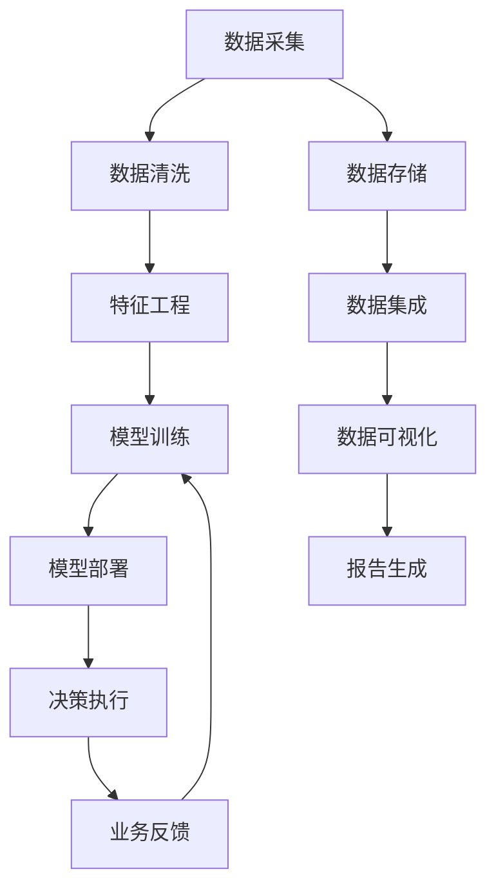

                 

# AI如何改变企业决策过程

> 关键词：人工智能,机器学习,深度学习,决策支持系统,DSS,自动化决策,企业智能

## 1. 背景介绍

### 1.1 问题由来

在现代社会，企业面临着日益复杂的经营环境和激烈的市场竞争。如何精准地分析市场趋势、预测业务风险、优化运营流程、提升客户体验，是企业管理的核心任务。传统的决策支持系统(DSS)已经无法满足现代企业的实时数据处理和智能决策需求。

近年来，人工智能(AI)技术的飞速发展，尤其是机器学习(ML)和深度学习(DL)的突破，为解决这些问题提供了新的手段。AI不仅能够处理和分析海量数据，挖掘隐藏的知识和规律，还能够通过自动化决策支持企业做出更快、更准的业务判断，全面提升决策效率和准确性。

### 1.2 问题核心关键点

AI技术在企业决策中的应用，主要体现在以下几个方面：

1. **大数据分析**：AI能够处理和分析来自不同渠道、不同格式的大量数据，帮助企业发现业务模式和潜在的增长机会。

2. **预测建模**：AI技术包括时间序列预测、回归分析等，能够准确预测市场需求、销售趋势、供应链瓶颈等，辅助企业制定更优的业务策略。

3. **决策自动化**：AI可以通过算法自动化执行决策流程，如自动化采购、库存管理、财务审批等，提升决策效率和准确性。

4. **智能客服与推荐系统**：AI技术能够通过智能客服系统和个性化推荐引擎，提升客户满意度和忠诚度。

5. **知识图谱与语义搜索**：AI通过构建知识图谱和语义搜索技术，帮助企业快速检索和应用各类专业知识，提升信息检索和处理效率。

6. **自然语言处理(NLP)**：AI能够通过NLP技术，分析客户反馈、社交媒体评论等文本数据，及时发现和解决客户问题，提升品牌形象。

7. **图像和视频分析**：AI技术包括计算机视觉等，能够分析企业产品、服务质量，通过图像和视频监控提升服务质量。

8. **决策可视化**：AI通过数据可视化工具，将复杂数据转换为直观的图表和报表，帮助决策者快速理解业务情况。

9. **联邦学习**：AI技术可以处理分布式数据，保护数据隐私的同时，提升决策支持系统的智能化水平。

通过AI技术在企业决策中的深度应用，企业能够实现从传统的数据驱动决策向智能驱动决策的转变，全面提升企业竞争力和市场响应速度。

### 1.3 问题研究意义

AI技术在企业决策中的应用，对于提升企业竞争力、增强市场反应速度、降低运营成本、提高客户满意度具有重要意义。具体而言：

1. **提升决策速度和效率**：AI通过自动化决策和预测分析，帮助企业快速响应市场变化，制定更优的业务策略。

2. **降低决策风险**：AI能够通过数据分析和模拟测试，辅助企业识别潜在风险，制定更科学的决策方案。

3. **优化资源配置**：AI技术能够通过分析各业务流程和资源使用情况，优化资源配置，提升企业运营效率。

4. **提升客户体验**：AI技术能够通过智能客服和推荐系统，提供个性化的客户服务，提升客户满意度和忠诚度。

5. **驱动业务创新**：AI通过挖掘大数据中的新知识和新模式，推动企业业务创新和产品开发。

6. **强化内部协作**：AI技术能够整合企业各部门的数据和信息，促进内部协作和信息共享，提升整体业务效率。

7. **提升市场反应速度**：AI技术能够实时监控市场变化，帮助企业快速调整市场策略，提升市场竞争优势。

8. **优化供应链管理**：AI通过预测和优化供应链数据，提升供应链管理的灵活性和效率。

综上所述，AI技术在企业决策中的应用，不仅可以提升企业整体运营效率和市场竞争力，还能够带来更高的客户满意度和更强的市场响应速度，从而实现企业的可持续发展。

## 2. 核心概念与联系

### 2.1 核心概念概述

为更好地理解AI如何改变企业决策过程，本节将介绍几个关键概念：

- **人工智能(AI)**：一种通过计算机系统模拟人类智能的科学技术。包括机器学习、自然语言处理、计算机视觉、智能决策等方向。
- **机器学习(ML)**：一种让计算机通过数据学习和改进的技术。通过算法自动分析数据，预测未来趋势，发现模式和规律。
- **深度学习(DL)**：一种使用多层神经网络进行学习和决策的机器学习方法。通过模拟人类大脑的神经网络，从大量数据中提取特征。
- **决策支持系统(DSS)**：一种结合人机交互和数据分析的工具，帮助企业进行决策分析和管理。
- **自动化决策**：一种通过算法自动化执行决策流程的技术。能够提升决策效率和准确性，减少人为干预。
- **知识图谱**：一种将知识结构化、网络化的技术。通过构建企业内部和外部知识库，提升决策的科学性和准确性。
- **语义搜索**：一种利用自然语言处理技术，快速检索和应用知识图谱中的信息的技术。
- **自然语言处理(NLP)**：一种使计算机能够理解和生成自然语言的技术。包括文本分析、情感分析、语音识别等。
- **图像和视频分析**：一种利用计算机视觉技术，分析和处理图像和视频数据的技术。
- **联邦学习**：一种分布式机器学习方法，能够在保护数据隐私的前提下，处理和分析分布式数据集。

这些核心概念之间存在紧密的联系，共同构成了AI在企业决策中的应用框架。

### 2.2 核心概念原理和架构的 Mermaid 流程图(Mermaid 流程节点中不要有括号、逗号等特殊字符)



这个流程图示意图展示了AI在企业决策中的主要流程。数据采集和清洗后，通过特征工程提取有用的特征，进行模型训练并部署到业务系统。在决策执行过程中，不断反馈业务结果，进一步优化模型。数据存储、集成和可视化等技术，辅助决策过程的各个环节。

## 3. 核心算法原理 & 具体操作步骤

### 3.1 算法原理概述

AI在企业决策中的应用，主要依赖于以下几个关键算法和原理：

1. **监督学习**：通过标注数据训练模型，使其能够预测未来结果。如销售预测、客户分类等。
2. **非监督学习**：从无标注数据中挖掘潜在模式和规律，如聚类、关联规则挖掘等。
3. **强化学习**：通过智能体与环境的交互，优化决策策略。如自动化库存管理、智能客服等。
4. **深度学习**：通过多层神经网络处理和分析大量数据，提取复杂特征。如图像识别、语音识别等。
5. **迁移学习**：利用预训练模型的知识，快速适应新任务。如金融预测、医疗诊断等。
6. **自适应学习**：根据环境变化实时调整模型参数，提升模型泛化能力。如实时供应链优化等。
7. **联邦学习**：在保护数据隐私的前提下，利用分布式数据进行模型训练。如跨企业数据共享等。

这些算法和原理，为AI在企业决策中的应用提供了坚实的技术基础。

### 3.2 算法步骤详解

以下是AI在企业决策中应用的详细操作步骤：

1. **数据采集与清洗**：收集企业内外部数据，如销售记录、客户反馈、市场数据等，并进行数据清洗，去除噪音和异常值。

2. **特征工程**：提取数据中的关键特征，构建特征集合。如时间序列特征、文本关键词、用户行为特征等。

3. **模型训练与评估**：选择合适的算法模型，利用标注数据进行训练，并使用测试数据集评估模型性能。如回归模型、分类模型、聚类模型等。

4. **模型部署与优化**：将训练好的模型部署到企业信息系统，持续收集反馈数据，进行模型优化。

5. **决策自动化与可视化**：将模型集成到决策支持系统中，实现自动化决策流程，并利用数据可视化技术展示决策结果。

6. **业务反馈与迭代**：定期收集业务反馈，验证模型效果，并根据反馈数据进行模型迭代和优化。

### 3.3 算法优缺点

AI在企业决策中的应用，具有以下优缺点：

**优点：**
1. **提升决策效率**：通过自动化决策和预测分析，快速响应市场变化，制定更优的业务策略。
2. **降低决策风险**：通过数据分析和模拟测试，辅助企业识别潜在风险，制定更科学的决策方案。
3. **优化资源配置**：通过分析各业务流程和资源使用情况，优化资源配置，提升企业运营效率。
4. **提升客户体验**：通过智能客服和推荐系统，提供个性化的客户服务，提升客户满意度和忠诚度。
5. **推动业务创新**：通过挖掘大数据中的新知识和新模式，推动企业业务创新和产品开发。
6. **强化内部协作**：通过整合企业各部门的数据和信息，促进内部协作和信息共享，提升整体业务效率。
7. **提升市场反应速度**：通过实时监控市场变化，帮助企业快速调整市场策略，提升市场竞争优势。
8. **优化供应链管理**：通过预测和优化供应链数据，提升供应链管理的灵活性和效率。

**缺点：**
1. **数据质量依赖**：AI模型的效果依赖于高质量的数据，数据质量差可能导致决策偏差。
2. **算法复杂性高**：复杂的模型需要大量计算资源，算法调试和优化难度大。
3. **模型泛化能力不足**：部分模型在特定场景下表现良好，但跨领域泛化能力较弱。
4. **模型可解释性差**：复杂的深度学习模型难以解释其内部决策过程，影响决策的可信度和可解释性。
5. **模型维护成本高**：复杂的模型需要持续维护和优化，增加企业运营成本。
6. **隐私和安全问题**：企业内部和外部数据涉及大量敏感信息，数据隐私和安全问题不容忽视。

### 3.4 算法应用领域

AI在企业决策中的应用，已经覆盖了多个领域，具体包括：

1. **销售与营销**：通过销售预测、客户细分、市场分析等，帮助企业制定更优的市场策略。
2. **运营管理**：通过库存管理、供应链优化、生产调度等，提升企业运营效率和灵活性。
3. **客户服务**：通过智能客服、推荐系统、情感分析等，提升客户满意度和忠诚度。
4. **财务管理**：通过财务预测、风险控制、审计分析等，提升企业财务决策的科学性和准确性。
5. **人力资源管理**：通过招聘分析、员工绩效评估、员工流失预测等，提升人力资源管理水平。
6. **法律合规**：通过合规风险预测、合同审核、法律咨询等，提升企业的法律风险管理能力。
7. **研发创新**：通过创新趋势分析、研发项目评估、专利分析等，支持企业的创新研发活动。
8. **健康医疗**：通过病患预测、诊疗分析、医疗资源优化等，提升医疗服务质量和效率。
9. **金融服务**：通过风险管理、欺诈检测、信用评估等，提升金融服务的安全性和可靠性。
10. **物流运输**：通过路线优化、运输调度、货物跟踪等，提升物流运输的效率和准确性。

## 4. 数学模型和公式 & 详细讲解 & 举例说明

### 4.1 数学模型构建

在本节中，我们将使用数学语言对AI在企业决策中的应用进行更加严格的刻画。

假设企业面临的决策问题可以表示为：

$$
\max_{x} f(x) \quad s.t. \quad g(x) \leq 0, h(x) = 0
$$

其中 $f(x)$ 表示决策目标函数，$g(x) \leq 0$ 表示决策约束条件，$h(x) = 0$ 表示决策变量取值范围。

在决策过程中，可以利用AI技术进行建模和求解。以销售预测为例，可以构建以下数学模型：

1. **目标函数**：最大化未来销售额

$$
f(x) = \sum_{t} \pi_t(x_t)
$$

其中 $\pi_t(x_t)$ 表示第 $t$ 天的销售概率。

2. **约束条件**：销售数据不能超过实际销售量

$$
g(x) = \sum_{t} x_t - S \leq 0
$$

其中 $S$ 表示实际销售量。

通过求解上述优化问题，可以找到最优的销售策略。

### 4.2 公式推导过程

以下是销售预测数学模型的推导过程：

1. **目标函数**：最大化未来销售额

$$
f(x) = \sum_{t} \pi_t(x_t)
$$

其中 $\pi_t(x_t)$ 表示第 $t$ 天的销售概率，$x_t$ 表示第 $t$ 天的销售量。

2. **约束条件**：销售数据不能超过实际销售量

$$
g(x) = \sum_{t} x_t - S \leq 0
$$

其中 $S$ 表示实际销售量。

3. **目标函数**：最大化利润

$$
f(x) = \sum_{t} p_t x_t - c_t x_t - S \leq 0
$$

其中 $p_t$ 表示第 $t$ 天的产品价格，$c_t$ 表示第 $t$ 天的产品成本。

4. **约束条件**：产品库存不能超过最大库存

$$
h(x) = \sum_{t} x_t \leq I_{max}
$$

其中 $I_{max}$ 表示最大库存量。

通过求解上述优化问题，可以找到最优的销售策略，最大化企业的利润。

### 4.3 案例分析与讲解

以下以销售预测为例，展示AI在企业决策中的应用：

1. **数据采集与清洗**：收集历史销售数据，包括日期、销售量、价格、促销活动等信息，并进行数据清洗和预处理。

2. **特征工程**：提取关键特征，如日期、季节、促销活动、节假日等，构建特征集合。

3. **模型训练与评估**：选择合适的时间序列模型，如ARIMA、LSTM等，利用历史数据进行训练，并使用测试数据集评估模型性能。

4. **模型部署与优化**：将训练好的模型集成到企业信息系统，实时预测未来销售数据，并根据反馈数据进行模型优化。

## 5. 项目实践：代码实例和详细解释说明

### 5.1 开发环境搭建

在进行AI在企业决策中的项目实践前，我们需要准备好开发环境。以下是使用Python进行PyTorch开发的环境配置流程：

1. 安装Anaconda：从官网下载并安装Anaconda，用于创建独立的Python环境。

2. 创建并激活虚拟环境：
```bash
conda create -n pytorch-env python=3.8 
conda activate pytorch-env
```

3. 安装PyTorch：根据CUDA版本，从官网获取对应的安装命令。例如：
```bash
conda install pytorch torchvision torchaudio cudatoolkit=11.1 -c pytorch -c conda-forge
```

4. 安装TensorFlow：
```bash
pip install tensorflow
```

5. 安装各类工具包：
```bash
pip install numpy pandas scikit-learn matplotlib tqdm jupyter notebook ipython
```

完成上述步骤后，即可在`pytorch-env`环境中开始AI在企业决策中的应用实践。

### 5.2 源代码详细实现

下面我们以销售预测为例，给出使用PyTorch进行模型训练和部署的PyTorch代码实现。

```python
import torch
import torch.nn as nn
import torch.optim as optim
from sklearn.model_selection import train_test_split
from sklearn.metrics import mean_squared_error

class SalesPredictor(nn.Module):
    def __init__(self, input_size, hidden_size, output_size):
        super(SalesPredictor, self).__init__()
        self.hidden = nn.Linear(input_size, hidden_size)
        self.output = nn.Linear(hidden_size, output_size)

    def forward(self, x):
        x = torch.relu(self.hidden(x))
        x = self.output(x)
        return x

# 加载数据
data = pd.read_csv('sales_data.csv')
X = data[['date', 'season', 'promotion', 'holiday']]
y = data['sales']
X_train, X_test, y_train, y_test = train_test_split(X, y, test_size=0.2, random_state=42)

# 模型定义
input_size = X_train.shape[1]
hidden_size = 64
output_size = y_train.shape[1]
model = SalesPredictor(input_size, hidden_size, output_size)

# 定义优化器和损失函数
optimizer = optim.Adam(model.parameters(), lr=0.001)
criterion = nn.MSELoss()

# 训练模型
for epoch in range(100):
    optimizer.zero_grad()
    output = model(X_train)
    loss = criterion(output, y_train)
    loss.backward()
    optimizer.step()
    if (epoch + 1) % 10 == 0:
        print('Epoch [{}/{}], Loss: {:.4f}'.format(epoch + 1, 100, loss.item()))

# 测试模型
with torch.no_grad():
    output = model(X_test)
    predictions = output.numpy()
    mse = mean_squared_error(y_test, predictions)
    print('Test MSE: {:.4f}'.format(mse))
```

在这个代码中，我们使用PyTorch实现了时间序列模型的训练和测试。首先，我们加载销售数据，并进行特征提取和数据分割。然后，我们定义了一个简单的神经网络模型，包含一个隐藏层和一个输出层。最后，我们使用优化器和损失函数进行模型训练，并在测试集上进行评估。

### 5.3 代码解读与分析

让我们再详细解读一下关键代码的实现细节：

**加载数据**：
我们使用pandas库加载销售数据，并进行特征提取和数据分割，构建训练集和测试集。

**模型定义**：
我们定义了一个简单的神经网络模型，包含一个隐藏层和一个输出层。隐藏层使用ReLU激活函数，输出层使用线性激活函数。

**训练模型**：
我们使用Adam优化器和均方误差损失函数进行模型训练。在每个epoch中，我们计算模型的损失，并进行反向传播更新模型参数。

**测试模型**：
在测试集上，我们使用均方误差损失函数评估模型的性能，并输出评估结果。

## 6. 实际应用场景

### 6.1 智能客服系统

智能客服系统已经成为企业提升客户服务质量的重要手段。通过AI技术，智能客服系统能够快速响应客户问题，提供个性化服务，提升客户满意度。

在技术实现上，智能客服系统通常基于自然语言处理(NLP)技术，结合深度学习模型进行训练。通过收集客户历史咨询记录和常见问题，构建标注数据集，训练NLP模型，实现问题识别和回答生成。在客户咨询时，系统自动识别客户问题，并从知识库中检索答案，生成自然语言回答。

智能客服系统的应用场景包括：

1. **自动响应客户咨询**：通过NLP技术，自动识别客户咨询主题，快速提供相关答案。
2. **多渠道支持**：支持电话、邮件、社交媒体等多种客户沟通渠道，提升客户服务体验。
3. **个性化推荐**：通过分析客户历史咨询记录，提供个性化服务建议。
4. **情感分析**：通过分析客户咨询语气和情绪，优化客户服务策略。

### 6.2 金融舆情监测

金融领域对市场舆情的实时监测至关重要。通过AI技术，企业能够快速获取和分析市场舆情，及时发现潜在风险，做出合理的投资决策。

在技术实现上，金融舆情监测系统通常基于自然语言处理(NLP)技术，结合情感分析模型进行训练。通过收集金融新闻、评论、社交媒体等文本数据，构建标注数据集，训练NLP模型，实现舆情监测和情感分析。系统自动分析舆情趋势，并生成风险预警报告，帮助企业做出投资决策。

金融舆情监测系统的应用场景包括：

1. **市场舆情监测**：实时获取和分析金融新闻、评论、社交媒体等文本数据，生成舆情报告。
2. **情感分析**：分析舆情文本的情感倾向，生成情感分析报告。
3. **风险预警**：通过舆情分析，及时发现市场风险，生成风险预警报告。
4. **投资决策**：基于舆情分析结果，辅助企业做出投资决策。

### 6.3 个性化推荐系统

个性化推荐系统已经成为提升用户满意度和忠诚度的重要手段。通过AI技术，推荐系统能够根据用户历史行为，推荐个性化内容，提升用户体验。

在技术实现上，个性化推荐系统通常基于协同过滤、内容推荐、深度学习等技术。通过收集用户历史行为数据，构建推荐数据集，训练推荐模型，实现个性化推荐。系统自动分析用户兴趣，生成推荐列表，提供个性化服务。

个性化推荐系统的应用场景包括：

1. **电商推荐**：根据用户浏览、点击、购买等行为，推荐商品和优惠活动。
2. **视频推荐**：根据用户观看历史，推荐相关视频内容。
3. **音乐推荐**：根据用户听歌历史，推荐相关音乐内容。
4. **新闻推荐**：根据用户阅读历史，推荐相关新闻内容。

### 6.4 未来应用展望

未来，AI在企业决策中的应用将进一步深化和拓展，带来更加智能化、高效化的解决方案。以下是几个未来应用展望：

1. **智能财务分析**：通过AI技术，实时分析和预测企业财务数据，提升财务决策的科学性和准确性。
2. **智能供应链管理**：通过AI技术，优化供应链数据和流程，提升供应链管理的灵活性和效率。
3. **智能采购管理**：通过AI技术，优化采购策略和供应商选择，降低采购成本，提升采购效率。
4. **智能人力资源管理**：通过AI技术，优化招聘、绩效评估、员工流失预测等，提升人力资源管理水平。
5. **智能风险管理**：通过AI技术，实时监控和分析市场风险，生成风险预警报告，辅助企业决策。
6. **智能研发创新**：通过AI技术，分析创新趋势和专利数据，支持企业研发活动，提升创新能力。
7. **智能安全管理**：通过AI技术，实时监控和分析网络安全风险，生成安全预警报告，保障企业信息安全。
8. **智能环保管理**：通过AI技术，优化能源消耗和废弃物处理，提升企业环保水平。
9. **智能物流管理**：通过AI技术，优化物流路径和仓储管理，提升物流运输效率和准确性。

## 7. 工具和资源推荐

### 7.1 学习资源推荐

为了帮助开发者系统掌握AI在企业决策中的应用，这里推荐一些优质的学习资源：

1. **《深度学习》课程**：斯坦福大学开设的深度学习课程，详细讲解深度学习理论和实践。
2. **《机器学习》课程**：吴恩达教授的机器学习课程，讲解机器学习理论和实践。
3. **《TensorFlow实战》书籍**：TensorFlow官方文档，详细讲解TensorFlow使用和应用。
4. **《PyTorch入门》书籍**：PyTorch官方文档，详细讲解PyTorch使用和应用。
5. **《NLP实战》书籍**：自然语言处理实战书籍，讲解NLP技术在企业决策中的应用。
6. **Kaggle竞赛**：Kaggle平台上丰富的数据集和竞赛项目，可以锻炼数据处理和模型训练能力。
7. **OpenAI GPT-3**：OpenAI发布的GPT-3模型，展示了深度学习在企业决策中的应用。

通过对这些资源的学习实践，相信你一定能够快速掌握AI在企业决策中的应用，并用于解决实际的决策问题。

### 7.2 开发工具推荐

高效的开发离不开优秀的工具支持。以下是几款用于AI在企业决策中的应用开发的常用工具：

1. **PyTorch**：基于Python的开源深度学习框架，灵活动态的计算图，适合快速迭代研究。
2. **TensorFlow**：由Google主导开发的开源深度学习框架，生产部署方便，适合大规模工程应用。
3. **HuggingFace Transformers库**：自然语言处理工具库，集成了众多SOTA模型，支持PyTorch和TensorFlow。
4. **Scikit-learn**：开源机器学习库，包含丰富的机器学习算法和工具。
5. **TensorBoard**：TensorFlow配套的可视化工具，可实时监测模型训练状态，提供丰富的图表呈现方式。
6. **Keras**：高层次神经网络API，简单易用，适合快速原型开发。
7. **Jupyter Notebook**：交互式编程环境，支持Python、R等编程语言，适合数据分析和模型训练。

合理利用这些工具，可以显著提升AI在企业决策中的应用开发效率，加快创新迭代的步伐。

### 7.3 相关论文推荐

AI在企业决策中的应用，源于学界的持续研究。以下是几篇奠基性的相关论文，推荐阅读：

1. **《Deep Learning》书籍**：Ian Goodfellow等人所著，详细讲解深度学习理论和实践。
2. **《Machine Learning》书籍**：Tom Mitchell等人所著，讲解机器学习理论和实践。
3. **《Deep Reinforcement Learning for Agents, Machines, and Humans》论文**：Lilian J. Russoni等人所著，讲解强化学习在企业决策中的应用。
4. **《A Survey on Knowledge Discovery and Data Mining in Business Intelligence》论文**：G. J. Snoud等人所著，讲解数据挖掘在企业决策中的应用。
5. **《Towards Explainable AI》论文**：J. Heer等人所著，讲解可解释性AI在企业决策中的应用。
6. **《AI and Big Data in Healthcare》论文**：T. H. Williams等人所著，讲解AI在医疗领域的应用。
7. **《AI in Supply Chain Management》论文**：R. G. Alsalhi等人所著，讲解AI在供应链管理中的应用。

这些论文代表了大规模AI在企业决策中的应用研究，通过学习这些前沿成果，可以帮助研究者把握学科前进方向，激发更多的创新灵感。

## 8. 总结：未来发展趋势与挑战

### 8.1 研究成果总结

AI在企业决策中的应用，已经取得了丰硕的成果。通过机器学习和深度学习技术，企业能够高效处理和分析数据，辅助决策过程，提升业务效率和竞争优势。未来，随着技术的不断演进，AI在企业决策中的应用将更加广泛和深入。

### 8.2 未来发展趋势

未来，AI在企业决策中的应用将呈现以下几个趋势：

1. **更高效的数据处理**：随着数据量的不断增大，高效的数据处理和存储技术将逐渐普及，提升数据处理效率。
2. **更智能的决策模型**：深度学习和强化学习技术将不断进步，提升决策模型的智能水平。
3. **更广泛的跨领域应用**：AI技术将逐渐应用到更多领域，如医疗、金融、制造等，提升各行业的智能化水平。
4. **更强的可解释性**：AI技术将不断提升决策的可解释性，帮助企业理解模型决策过程。
5. **更全面的风险管理**：AI技术将全面提升风险管理的智能化水平，实时监控和预测风险。
6. **更灵活的决策支持**：AI技术将提供更灵活的决策支持，支持企业应对复杂的业务环境。
7. **更智能的自动驾驶**：AI技术将在自动驾驶领域取得更大突破，提升交通安全和效率。
8. **更先进的医疗诊断**：AI技术将在医疗诊断领域取得更大突破，提升诊断准确性和效率。
9. **更高效的供应链管理**：AI技术将优化供应链数据和流程，提升供应链管理的灵活性和效率。
10. **更智能的智能客服**：AI技术将在智能客服领域取得更大突破，提升客户服务质量。

### 8.3 面临的挑战

尽管AI在企业决策中的应用已经取得了显著进展，但在迈向更加智能化、高效化的应用过程中，仍然面临一些挑战：

1. **数据质量问题**：AI模型的效果依赖于高质量的数据，数据质量差可能导致决策偏差。
2. **算法复杂性高**：复杂的模型需要大量计算资源，算法调试和优化难度大。
3. **模型泛化能力不足**：部分模型在特定场景下表现良好，但跨领域泛化能力较弱。
4. **模型可解释性差**：复杂的深度学习模型难以解释其内部决策过程，影响决策的可信度和可解释性。
5. **隐私和安全问题**：企业内部和外部数据涉及大量敏感信息，数据隐私和安全问题不容忽视。
6. **算法偏差问题**：AI模型可能会学习到有偏见的数据，产生歧视性输出，需要加强数据筛选和算法设计。
7. **算法鲁棒性不足**：部分模型在面对噪声数据或极端情况时，可能表现不稳定。
8. **技术更新速度**：AI技术更新速度快，企业需要持续学习和更新，保持技术领先。
9. **人才短缺问题**：AI技术需要专业人才进行开发和维护，人才短缺可能制约企业应用进展。
10. **算力成本高**：大规模深度学习模型需要高性能计算资源，算力成本较高。

### 8.4 研究展望

面对AI在企业决策中的应用挑战，未来的研究需要在以下几个方面寻求新的突破：

1. **提升数据质量**：通过数据清洗、数据增强等技术，提升数据质量，减少决策偏差。
2. **简化算法模型**：开发更加简洁高效的算法模型，降低算法复杂度，提升计算效率。
3. **增强模型泛化能力**：开发跨领域泛化能力强的模型，提升模型的通用性和可迁移性。
4. **提升模型可解释性**：通过可解释性技术，提升模型的透明度和可信度。
5. **强化数据隐私保护**：通过数据加密、联邦学习等技术，保护数据隐私和安全。
6. **减少算法偏差**：通过算法优化和数据筛选，减少算法偏差，提升决策的公平性。
7. **提升模型鲁棒性**：通过鲁棒性优化，提升模型对噪声数据和极端情况的适应性。
8. **加速技术普及**：通过技术培训、开源平台等，加速AI技术在企业中的应用普及。
9. **优化资源配置**：通过资源优化技术，降低算力成本，提升企业应用效率。
10. **提升人才素质**：通过人才培训和引进，提升企业AI技术研发和应用能力。

通过这些研究方向的探索和突破，AI在企业决策中的应用将更加智能化、高效化和全面化，推动企业实现可持续发展。

## 9. 附录：常见问题与解答

**Q1：AI在企业决策中的应用是否适合所有企业？**

A: AI在企业决策中的应用，适合于大多数企业，尤其是数据量较大、业务复杂、市场竞争激烈的企业。对于数据量较少、业务简单的企业，可以逐步引入AI技术，提升决策效率和质量。

**Q2：AI在企业决策中的应用是否需要大量的标注数据？**

A: AI在企业决策中的应用，通常需要大量的标注数据进行模型训练。标注数据量越大，模型效果越好。对于标注数据较少的企业，可以使用半监督学习、无监督学习等方法，尽量提升数据质量。

**Q3：AI在企业决策中的应用是否需要复杂的算法？**

A: AI在企业决策中的应用，通常需要复杂的数据处理和算法模型。对于业务简单的企业，可以选择简单的算法模型，逐步升级复杂度。对于业务复杂的企业，需要引入更加复杂的算法模型，提升决策的智能化水平。

**Q4：AI在企业决策中的应用是否需要高昂的算力成本？**

A: AI在企业决策中的应用，通常需要高性能计算资源，算力成本较高。对于大规模企业，可以采用云计算平台，按需购买算力资源。对于中小型企业，可以逐步引入AI技术，逐步提升算力成本。

**Q5：AI在企业决策中的应用是否需要高水平的人才支持？**

A: AI在企业决策中的应用，通常需要高水平的人才支持。企业需要引进和培训AI技术人才，提升AI技术研发和应用能力。

**Q6：AI在企业决策中的应用是否需要丰富的业务知识？**

A: AI在企业决策中的应用，需要丰富的业务知识。企业需要结合AI技术，深入理解业务场景和需求，才能设计出有效的AI模型。

通过本文的系统梳理，可以看到，AI技术在企业决策中的应用已经取得了丰硕的成果，具有广阔的发展前景。未来，随着技术的不断演进，AI在企业决策中的应用将更加广泛和深入，带来更加智能化、高效化的解决方案。

