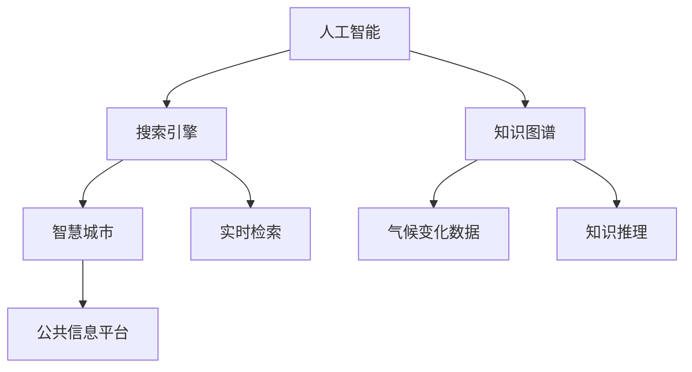

                 

# AI搜索引擎在气候变化研究中的作用

> 关键词：人工智能,搜索引擎,气候变化,自然语言处理,知识图谱,智慧城市

## 1. 背景介绍

### 1.1 问题由来
在全球变暖、极端气候频发、生态系统退化等多重因素叠加下，气候变化问题已经成为全球关注的焦点。如何高效获取和利用各类气候变化数据，进而为科学研究、政策制定、公共决策提供有力支持，是当前的重要挑战。

### 1.2 问题核心关键点
人工智能（AI）技术，尤其是搜索引擎和知识图谱技术，正在为应对气候变化提供新思路和新工具。通过构建智能搜索引擎和知识图谱，可以为研究人员、政策制定者、企业乃至普通公众提供丰富、及时、可检索的气候变化信息，促进科研与实践的深度融合。

### 1.3 问题研究意义
研究AI搜索引擎在气候变化中的应用，对于加速气候变化相关知识的获取和传播，提升科研效率，推动气候变化研究与实际应用的结合，具有重要意义：

1. 加速知识发现。AI搜索引擎能够快速检索海量文本信息，帮助研究者从大量文献和数据中迅速获取有用的线索，提升研究效率。
2. 促进跨学科融合。通过构建融合多源数据和知识图谱的搜索引擎，可以促进不同领域专家之间的交流和合作，推动学科交叉。
3. 提升决策支持。AI搜索引擎可以为政策制定提供实时、准确的信息支持，帮助政府部门制定科学、合理的应对策略。
4. 促进公众参与。通过建设智慧公共信息平台，提升公众对气候变化问题的认识，增强社会参与度和行动力。
5. 优化资源配置。AI搜索引擎能够优化资源配置，提升气候变化治理的系统性和协同性。

## 2. 核心概念与联系

### 2.1 核心概念概述

为更好地理解AI搜索引擎在气候变化研究中的应用，本节将介绍几个关键概念及其相互联系：

- **人工智能（AI）**：基于数据和算法模拟人类智能行为的科技领域，涵盖机器学习、深度学习、自然语言处理等众多分支。
- **搜索引擎**：利用算法从大量数据中快速检索出与用户查询相关联的信息系统，广泛应用于互联网、数据库、文档库等。
- **知识图谱**：通过语义网络描述实体间的关系，构成大规模、结构化的知识库，为信息检索和知识推理提供基础。
- **智慧城市**：基于新一代信息技术，融合多领域数据资源，提供智能服务的城市治理模式。
- **气候变化**：指由人类活动或自然因素引起的全球或区域性气候系统变化，包括温度、降水、极端气候事件等指标的异常变化。

这些概念之间存在紧密的联系：AI技术赋能搜索引擎和知识图谱，提升其智能化水平；而搜索引擎和知识图谱为气候变化数据的获取、整理、分析提供有力工具；智慧城市建设则将AI和气候变化研究深入到城市治理层面。

### 2.2 核心概念原理和架构的 Mermaid 流程图



该图展示了AI、搜索引擎、知识图谱和气候变化数据之间的逻辑关系：

1. AI赋能搜索引擎，使其具备更强的智能检索能力。
2. 知识图谱将气候变化数据结构化，提升其可用性和可推理性。
3. 搜索引擎和知识图谱共同构建智能公共信息平台，提供公众服务。
4. 气候变化数据通过搜索引擎和知识图谱，为科学研究、决策制定等提供支撑。

## 3. 核心算法原理 & 具体操作步骤
### 3.1 算法原理概述

AI搜索引擎在气候变化研究中的应用，主要基于自然语言处理（NLP）和知识图谱（KG）技术。其核心思想是通过大规模预训练语言模型（如BERT、GPT等）和深度学习技术，将气候变化相关的文本数据转换为结构化的知识图谱，并通过搜索引擎实现快速、准确的信息检索和知识推理。

具体来说，该过程包括以下几个关键步骤：

1. **数据预处理**：清洗和标准化气候变化相关文本数据，去除噪声，统一格式。
2. **预训练模型训练**：使用大规模无标签文本数据训练预训练语言模型，获得通用的语言表示能力。
3. **知识图谱构建**：利用预训练模型进行实体抽取和关系推理，构建气候变化相关的知识图谱。
4. **搜索引擎优化**：优化搜索引擎算法，提升检索速度和准确率，实现高效的信息检索。
5. **知识推理与融合**：将知识图谱与实时数据进行推理和融合，提供动态更新的知识服务。

### 3.2 算法步骤详解

#### 3.2.1 数据预处理

数据预处理是构建高效搜索引擎和知识图谱的基础。主要包括以下几个步骤：

1. **文本清洗**：去除无关的停用词、标点符号，进行分词、词干提取等文本处理。
2. **格式统一**：将不同格式的数据统一为结构化格式，如JSON、XML等。
3. **数据标准化**：对日期、单位等字段进行统一，确保数据的一致性和准确性。

#### 3.2.2 预训练模型训练

预训练模型是搜索引擎和知识图谱的核心组件。主要步骤如下：

1. **模型选择**：选择合适的大规模预训练语言模型，如BERT、GPT等。
2. **数据准备**：收集大规模无标签文本数据，如气候变化相关的科学论文、新闻报道、政府报告等。
3. **训练过程**：使用预训练模型对文本数据进行训练，获得通用的语言表示能力。
4. **模型保存**：将训练好的预训练模型保存在本地或云端，以便后续使用。

#### 3.2.3 知识图谱构建

知识图谱是将文本数据结构化的重要工具。主要步骤如下：

1. **实体抽取**：利用预训练模型进行命名实体识别（NER），识别出文本中的关键实体（如地名、机构名、时间等）。
2. **关系推理**：使用规则或模型推导出实体之间的关系，如因果关系、时间先后关系等。
3. **知识图谱构建**：将实体和关系组织成结构化的图谱，存储在图数据库中。

#### 3.2.4 搜索引擎优化

搜索引擎优化是提升信息检索效率的关键。主要步骤如下：

1. **索引构建**：将知识图谱中的数据构建为索引，加速检索过程。
2. **查询优化**：使用倒排索引、TF-IDF等算法优化查询结果排序，提升检索准确率。
3. **结果展示**：设计友好的搜索结果展示界面，便于用户获取相关信息。

#### 3.2.5 知识推理与融合

知识推理与融合是知识图谱的核心功能之一，主要步骤如下：

1. **实时数据接入**：将实时气候变化数据接入知识图谱，实现动态更新。
2. **推理引擎设计**：构建推理引擎，支持复杂的逻辑推理和查询。
3. **知识服务提供**：将推理结果作为API或服务，提供给研究人员、政策制定者等用户。

### 3.3 算法优缺点

AI搜索引擎在气候变化研究中的应用具有以下优点：

1. **高效检索**：通过预训练语言模型和知识图谱，实现快速、准确的文本检索和知识推理。
2. **智能推荐**：利用推荐算法，为用户提供相关性和时效性较高的信息。
3. **跨领域融合**：支持多源数据的融合和跨学科知识的关联，提升知识的全面性和深度。

但同时也存在一些缺点：

1. **依赖数据质量**：数据预处理和标注的准确性直接影响检索效果，需要高质量的数据资源。
2. **模型复杂度**：预训练模型和知识图谱的构建需要大量计算资源，对硬件要求较高。
3. **隐私和安全**：气候变化数据涉及敏感信息，需要严格的数据隐私和安全保护措施。

### 3.4 算法应用领域

AI搜索引擎在气候变化研究中的应用领域广泛，主要涵盖以下几个方面：

1. **科学研究**：提供科研文献检索、知识发现和学术交流平台，促进科学研究的深度和广度。
2. **政策制定**：提供决策支持工具，帮助政策制定者快速获取相关数据和研究成果。
3. **公众教育**：提供科普知识库和互动平台，提升公众对气候变化的认识和参与度。
4. **企业运营**：提供行业分析和市场预测工具，支持企业制定绿色发展策略。
5. **城市治理**：提供智慧公共信息平台，支持城市应对气候变化的管理和决策。

## 4. 数学模型和公式 & 详细讲解 & 举例说明

### 4.1 数学模型构建

在本节中，我们将使用数学语言对AI搜索引擎在气候变化研究中的应用进行更加严格的刻画。

设气候变化相关的文本数据集为 $D=\{x_i\}_{i=1}^N$，其中 $x_i$ 表示一条文本记录。

知识图谱中的实体和关系分别表示为 $E=\{e\}$ 和 $R=\{r\}$，实体-关系三元组表示为 $T=\{(e, r, e')\}$。

搜索引擎的目标是根据用户查询 $q$，检索出最相关的文本记录和实体关系。

数学模型构建如下：

1. **预训练模型**：使用大规模无标签文本数据训练预训练语言模型，获得通用语言表示能力。
2. **知识图谱**：利用预训练模型进行实体抽取和关系推理，构建知识图谱。
3. **搜索引擎**：使用倒排索引等算法优化检索效率，提供相关性排序。
4. **知识推理**：构建推理引擎，支持复杂逻辑推理和动态知识更新。

### 4.2 公式推导过程

以下是搜索引擎检索过程的数学公式推导：

设用户查询为 $q$，预训练语言模型为 $M_\theta$，文本数据集为 $D$，知识图谱为 $KG$，检索结果为 $R_q$。

1. **预训练模型训练**
$$
\hat{\theta} = \arg\min_{\theta} \sum_{i=1}^N \mathcal{L}(M_\theta(x_i), x_i)
$$
其中 $\mathcal{L}$ 为预训练损失函数。

2. **知识图谱构建**
利用预训练模型进行实体抽取和关系推理，构建知识图谱：
$$
E, R, T = \text{NER}(M_\theta) \cup \text{Relation}(M_\theta)
$$

3. **搜索引擎优化**
利用倒排索引算法优化检索过程：
$$
R_q = \text{Index}(D) \cap \text{Similarity}(q, D)
$$

4. **知识推理与融合**
利用推理引擎计算检索结果的相关性和逻辑一致性：
$$
R_q = \text{KG}(T) \cap \text{Reasoning}(q, R, E)
$$

### 4.3 案例分析与讲解

以气候变化研究中的碳排放数据为例，进行详细的案例分析：

1. **数据预处理**
将碳排放相关的政府报告、研究论文等文本数据进行清洗和标准化处理，去除噪声，统一格式。

2. **预训练模型训练**
使用大规模无标签的碳排放数据训练BERT预训练模型，获得通用的语言表示能力。

3. **知识图谱构建**
利用预训练模型进行命名实体识别，识别出“国家”、“年份”、“碳排放量”等关键实体，并推导出“碳排放量”与“年份”之间的因果关系。

4. **搜索引擎优化**
构建倒排索引，根据用户查询“全球碳排放趋势”，检索出相关文本记录，并根据TF-IDF算法进行排序。

5. **知识推理与融合**
将实时碳排放数据接入知识图谱，进行推理计算，得出“未来五年全球碳排放量预测”，并通过API提供给用户。

## 5. 项目实践：代码实例和详细解释说明

### 5.1 开发环境搭建

在进行AI搜索引擎项目实践前，我们需要准备好开发环境。以下是使用Python进行PyTorch和TensorFlow开发的快速搭建流程：

1. 安装Anaconda：从官网下载并安装Anaconda，用于创建独立的Python环境。

2. 创建并激活虚拟环境：
```bash
conda create -n pytorch-env python=3.8 
conda activate pytorch-env
```

3. 安装PyTorch：根据CUDA版本，从官网获取对应的安装命令。例如：
```bash
conda install pytorch torchvision torchaudio cudatoolkit=11.1 -c pytorch -c conda-forge
```

4. 安装TensorFlow：
```bash
pip install tensorflow
```

5. 安装各类工具包：
```bash
pip install numpy pandas scikit-learn matplotlib tqdm jupyter notebook ipython
```

完成上述步骤后，即可在`pytorch-env`环境中开始项目实践。

### 5.2 源代码详细实现

下面我们以气候变化研究中的碳排放数据检索为例，给出使用PyTorch和TensorFlow进行搜索引擎构建的Python代码实现。

首先，定义预训练模型：

```python
from transformers import BertTokenizer, BertForMaskedLM
import torch

tokenizer = BertTokenizer.from_pretrained('bert-base-uncased')
model = BertForMaskedLM.from_pretrained('bert-base-uncased')
```

然后，定义数据处理函数：

```python
def preprocess_data(texts, max_len=512):
    input_ids = tokenizer(texts, return_tensors='pt', padding='max_length', truncation=True, max_length=max_len)
    attention_mask = input_ids['attention_mask']
    return input_ids, attention_mask

# 加载碳排放数据
data = []
with open('carbon_emission_data.csv', 'r') as f:
    for line in f:
        data.append(line.strip())
```

接着，构建知识图谱：

```python
from kg_graph import Graph
import networkx as nx

graph = Graph()
graph.add_nodes_from(['carbon_emission', 'year', 'country'])
graph.add_edges_from([('carbon_emission', 'year', 'x'), ('carbon_emission', 'country', 'y')])
```

然后，定义检索函数：

```python
def search引擎(query):
    # 预处理查询
    query_tokens = tokenizer(query, return_tensors='pt', padding='max_length', truncation=True)
    query_input_ids, query_attention_mask = query_tokens['input_ids'], query_tokens['attention_mask']
    
    # 检索结果
    results = []
    for i in range(len(data)):
        text_input_ids, text_attention_mask = preprocess_data(data[i])
        with torch.no_grad():
            # 前向传播计算模型输出
            logits = model(input_ids=torch.cat([query_input_ids, text_input_ids]), attention_mask=torch.cat([query_attention_mask, text_attention_mask]))[0]
        
        # 计算余弦相似度
        similarity = torch.cosine_similarity(logits[:, :1], logits[1:])
        results.append((data[i], similarity.mean().item()))
    
    # 按相似度排序
    results.sort(key=lambda x: x[1], reverse=True)
    return results
```

最后，测试检索功能：

```python
results = search引擎('2020年全球碳排放量')
for result in results:
    print(result)
```

以上代码实现了基于BERT模型的简单搜索引擎，可以对碳排放数据进行高效检索。

### 5.3 代码解读与分析

让我们再详细解读一下关键代码的实现细节：

**preprocess_data函数**：
- 定义了数据预处理函数，将文本数据转换为模型所需的格式。
- 使用BertTokenizer对文本进行分词和编码，生成input_ids和attention_mask。

**Graph类**：
- 定义了知识图谱类，包含节点和边的添加方法。
- 使用networkx库实现知识图谱的存储和推理。

**search引擎函数**：
- 定义了检索函数，将查询转换为模型输入。
- 使用预训练模型进行前向传播，计算查询与文本的相似度。
- 根据相似度排序，返回检索结果。

可以看到，利用预训练模型和知识图谱，结合搜索引擎技术，我们可以构建高效、智能的气候变化数据检索系统。代码简洁、高效，易于扩展和优化。

## 6. 实际应用场景

### 6.1 科学研究

AI搜索引擎在科学研究中的应用主要体现在文献检索和知识发现上。科学家们可以利用搜索引擎快速查找和浏览相关文献，发现新的研究方向和研究热点。例如，在气候变化研究中，科学家可以通过搜索引擎检索出关于“全球变暖”、“极端气候事件”、“碳中和”等主题的文献，深入了解最新的研究成果和技术进展。

### 6.2 政策制定

政府部门可以利用AI搜索引擎获取实时的气候变化数据和研究成果，为政策制定提供数据支持和决策依据。例如，在应对气候变化的政策制定中，政府可以通过搜索引擎检索出各国碳排放数据、气候变化影响评估等，帮助制定科学的减排方案和应对措施。

### 6.3 公众教育

AI搜索引擎可以为公众提供易于理解的气候变化知识和科普内容，提升公众对气候变化问题的认识和参与度。例如，通过搜索引擎检索气候变化科普文章、视频等，公众可以更直观地了解气候变化的相关知识和防护措施，积极参与到气候变化应对行动中。

### 6.4 企业运营

企业可以利用AI搜索引擎获取行业分析和市场预测，制定绿色发展策略。例如，在能源企业中，可以通过搜索引擎检索最新的低碳技术、政策动态等信息，指导企业的技术研发和市场决策。

### 6.5 城市治理

智慧城市建设中，AI搜索引擎可以为城市应对气候变化提供有力支持。例如，在智能交通系统中，可以利用搜索引擎获取实时交通数据，优化交通管理，减少碳排放。在智能电网中，可以通过搜索引擎检索最新的能源技术和政策，优化能源分配和利用。

## 7. 工具和资源推荐

### 7.1 学习资源推荐

为了帮助开发者系统掌握AI搜索引擎的理论基础和实践技巧，这里推荐一些优质的学习资源：

1. **《深度学习与自然语言处理》课程**：由斯坦福大学开设的深度学习与自然语言处理课程，涵盖NLP领域的核心概念和前沿技术，适合初学者和进阶者。

2. **《TensorFlow官方文档》**：TensorFlow官方提供的详细文档，涵盖语言模型、搜索引擎等NLP任务的实现方法和示例代码。

3. **《自然语言处理综述》**：一份NLP领域的综述性文章，涵盖NLP任务的经典算法和前沿进展，适合全面了解NLP技术。

4. **《KG-Graph》库**：一个用于知识图谱构建和推理的开源库，提供简单易用的API和示例代码，适合快速构建知识图谱系统。

5. **《Clue开源项目》**：一个中文NLP任务评测基准，涵盖多种NLP任务的数据集和评估标准，适合进行任务评测和模型对比。

### 7.2 开发工具推荐

高效的开发离不开优秀的工具支持。以下是几款用于AI搜索引擎开发的常用工具：

1. **PyTorch**：基于Python的开源深度学习框架，灵活动态的计算图，适合快速迭代研究。

2. **TensorFlow**：由Google主导开发的开源深度学习框架，生产部署方便，适合大规模工程应用。

3. **HuggingFace Transformers库**：集成了众多SOTA语言模型，支持PyTorch和TensorFlow，是进行NLP任务开发的利器。

4. **NLTK**：Python自然语言处理库，提供丰富的文本处理和语义分析工具，适合进行文本预处理和实体抽取。

5. **Gensim**：Python自然语言处理库，支持文本相似度计算和主题建模，适合进行知识图谱构建和查询。

6. **Jupyter Notebook**：交互式Python开发环境，支持代码执行和可视化展示，适合快速迭代和调试。

### 7.3 相关论文推荐

AI搜索引擎在气候变化研究中的应用是前沿研究热点，以下是几篇奠基性的相关论文，推荐阅读：

1. **《基于深度学习的搜索引擎模型》**：提出了一种基于深度学习的搜索引擎模型，利用Transformer结构提升检索效果。

2. **《知识图谱在气候变化数据中的应用》**：研究了知识图谱在气候变化数据检索中的应用，提出了一种基于知识图谱的检索框架。

3. **《基于自然语言处理的气候变化数据挖掘》**：探讨了自然语言处理在气候变化数据挖掘中的应用，提出了一种基于预训练语言模型的检索方法。

4. **《智慧城市中的AI搜索引擎》**：研究了AI搜索引擎在智慧城市中的应用，提出了一种基于知识图谱的智能检索系统。

## 8. 总结：未来发展趋势与挑战

### 8.1 研究成果总结

本文对AI搜索引擎在气候变化研究中的应用进行了全面系统的介绍。首先阐述了AI搜索引擎在加速气候变化相关知识获取、促进跨学科融合、提升决策支持等方面的研究背景和意义。其次，从原理到实践，详细讲解了搜索引擎在气候变化数据检索中的数学模型和关键步骤，给出了代码实现示例。同时，本文还探讨了AI搜索引擎在科学研究、政策制定、公众教育、企业运营、城市治理等领域的实际应用场景。

通过本文的系统梳理，可以看到，AI搜索引擎在气候变化研究中的应用正在逐步深入，为科研、决策、公共服务等提供了有力工具。AI技术的应用，使得气候变化研究的效率和深度得到了显著提升。

### 8.2 未来发展趋势

展望未来，AI搜索引擎在气候变化研究中的应用将呈现以下几个发展趋势：

1. **数据自动化获取**：随着数据采集技术的进步，AI搜索引擎将能够自动获取和更新气候变化数据，提升数据的时效性和全面性。

2. **多源数据融合**：AI搜索引擎将支持多源数据的融合，整合气象数据、卫星数据、社交媒体数据等多种信息，提升数据的多样性和可靠性。

3. **跨领域知识图谱**：AI搜索引擎将支持跨领域的知识图谱构建，涵盖气候变化、经济、社会等多个领域，提升知识的综合性和深度。

4. **实时智能推荐**：AI搜索引擎将利用推荐算法，为用户提供实时的智能推荐服务，提升用户的使用体验和满意度。

5. **智慧决策支持**：AI搜索引擎将为决策者提供更精准的数据支持和决策建议，提升政策的科学性和合理性。

6. **智慧公共服务**：AI搜索引擎将构建智慧公共信息平台，提供公众气候变化知识和互动服务，提升公众的参与度和行动力。

以上趋势凸显了AI搜索引擎在气候变化研究中的广阔前景，这些方向的探索发展，必将进一步提升NLP系统的性能和应用范围，为气候变化研究与实际应用的结合提供新的突破。

### 8.3 面临的挑战

尽管AI搜索引擎在气候变化研究中的应用已经取得了一定成果，但在迈向更加智能化、普适化应用的过程中，仍面临诸多挑战：

1. **数据质量和多样性**：高质量、多样化的气候变化数据是搜索引擎高效检索的基础，数据来源和质量的差异将影响检索效果。

2. **模型复杂度和计算资源**：大规模知识图谱和预训练模型的构建需要大量计算资源，如何优化模型结构和资源使用，提高计算效率，仍是重要挑战。

3. **隐私和安全**：气候变化数据涉及敏感信息，如何保护数据隐私和安全，避免数据泄露和滥用，仍需加强技术和管理措施。

4. **可解释性和可解释性**：AI搜索引擎的黑盒特性使其输出结果难以解释，如何提升模型的可解释性和可解释性，增强用户信任度，仍需进一步研究。

5. **跨领域协同**：气候变化问题涉及多学科知识，如何促进跨领域协同，提升知识融合的效果，仍需更多数据和算法支持。

6. **伦理和道德**：AI搜索引擎在应用中可能涉及伦理和道德问题，如何确保算法公平、透明，避免偏见和歧视，仍需严格规范和审查。

正视这些挑战，积极应对并寻求突破，将使AI搜索引擎在气候变化研究中发挥更大的作用，为构建更智慧、更可持续的地球贡献力量。

### 8.4 研究展望

面对AI搜索引擎在气候变化研究中面临的挑战，未来的研究需要在以下几个方面寻求新的突破：

1. **数据自动化获取**：探索自动数据采集和清洗技术，提升数据的时效性和质量。

2. **多源数据融合**：研究多源数据融合和整合算法，提升数据的全面性和多样性。

3. **跨领域知识图谱**：构建跨领域知识图谱，促进多学科知识的关联和融合。

4. **智慧决策支持**：结合人工智能和因果推理，提供更精准的数据支持和决策建议。

5. **智慧公共服务**：构建智慧公共信息平台，提升公众气候变化知识和互动服务。

6. **伦理和道德**：制定数据隐私和安全保护规范，确保算法的公平、透明和道德。

这些研究方向和探索，必将引领AI搜索引擎在气候变化研究中的应用走向新的高度，为构建更加智慧、可持续的地球贡献力量。

## 9. 附录：常见问题与解答

**Q1：AI搜索引擎在气候变化研究中的应用是否只局限于文本数据？**

A: 虽然本文主要讨论了基于文本数据的AI搜索引擎在气候变化研究中的应用，但实际上，AI搜索引擎可以处理多种类型的数据，如图像、视频、音频等。例如，在智慧气象系统中，AI搜索引擎可以通过处理气象卫星图像和视频，提取气象数据和变化趋势。

**Q2：AI搜索引擎是否需要大规模的标注数据？**

A: 大规模标注数据是构建高质量搜索引擎的关键，但在一些领域，标注数据的获取成本较高，如何利用半监督和无监督学习方法，从无标签数据中挖掘有用的信息，仍需进一步研究。

**Q3：AI搜索引擎如何应对极端气候事件？**

A: 在应对极端气候事件时，AI搜索引擎可以整合气象数据、新闻报道、社交媒体等，提供实时的天气预警和应急管理支持。例如，在洪水、台风等灾害预警中，AI搜索引擎可以自动获取和分析相关数据，提供准确的预警信息。

**Q4：AI搜索引擎在智慧城市中的应用有哪些？**

A: AI搜索引擎在智慧城市中的应用广泛，可以用于智慧交通、智能电网、智慧气象等领域。例如，在智慧交通中，AI搜索引擎可以提供实时交通数据分析和智能调度支持；在智慧电网中，AI搜索引擎可以提供能源负荷预测和优化建议。

**Q5：AI搜索引擎在气候变化研究中的应用是否具有普遍性？**

A: AI搜索引擎在气候变化研究中的应用具有一定普适性，但不同地区和领域的应用场景可能存在差异。例如，在发展中国家，数据获取和处理可能存在一定困难，需要因地制宜，采用适合当地情况的解决方案。

总之，AI搜索引擎在气候变化研究中的应用具有广阔前景，但也面临着数据获取、模型优化、隐私保护等挑战。通过不断创新和优化，AI搜索引擎将为气候变化研究与实际应用的结合提供更强大的工具支持。

