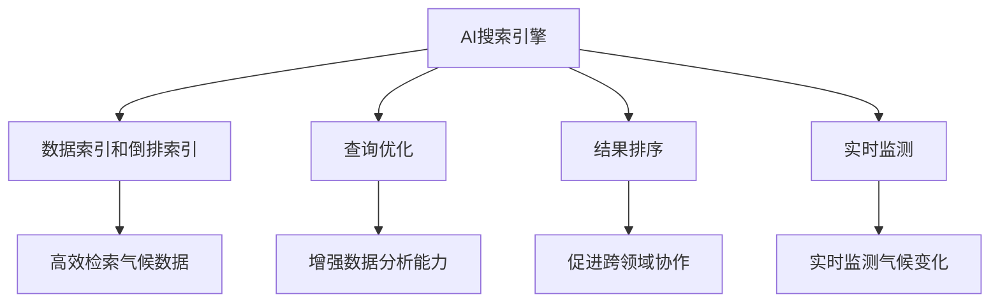

                 

# AI搜索引擎在气候变化研究中的作用

## 1. 背景介绍

在全球气候变化问题日益严峻的背景下，如何高效地获取和利用海量气候数据成为科学界和产业界关注的焦点。人工智能(AI)技术，特别是AI搜索引擎技术，在处理和分析大规模气候数据方面展现出巨大的潜力。本文将从AI搜索引擎的基本原理和应用场景出发，探讨其在气候变化研究中的独特作用。

### 1.1 气候数据的特点

气候数据具有规模庞大、类型多样、实时性强等特点。全球气候数据集包括大气温度、降水量、空气质量、海洋环境、冰川变化等多方面的数据。这些数据来自全球各地的传感器、气象站、卫星等，并以多种格式存储，如CSV、JSON、XML等。数据的时空分辨率从秒级到年际不等，给数据的存储、管理和分析带来了巨大的挑战。

### 1.2 AI搜索引擎的基本原理

AI搜索引擎技术通过智能化算法和高效的数据处理技术，能够快速、准确地从海量数据中检索到目标信息。其核心原理可以概括为以下几点：

- **索引构建**：对数据集进行分词、索引和建立倒排索引，以便快速定位相关数据。
- **查询优化**：利用自然语言处理技术，将自然语言查询转化为结构化查询，提高查询效率。
- **结果排序**：结合机器学习算法，对查询结果进行排序，优先返回与查询最相关的数据。

## 2. 核心概念与联系

### 2.1 核心概念概述

为了深入理解AI搜索引擎在气候变化研究中的作用，我们需要首先明确几个关键概念：

- **AI搜索引擎**：利用机器学习和自然语言处理技术，能够快速检索和展示大规模数据集的搜索工具。
- **气候变化研究**：关注全球气候系统的变化规律及其对人类社会和自然环境的影响，涉及气象学、生态学、经济学等多个领域。
- **数据索引和倒排索引**：索引技术使得搜索引擎能够快速定位到相关数据，而倒排索引则进一步提升了查询的效率和准确性。
- **查询优化和结果排序**：自然语言处理和机器学习算法是实现高效查询和结果排序的关键技术手段。

### 2.2 核心概念联系

AI搜索引擎在气候变化研究中的作用，主要体现在以下几个方面：

- **高效检索气候数据**：AI搜索引擎能够快速从海量气候数据中检索到目标信息，节省大量时间。
- **增强数据分析能力**：结合机器学习算法，对检索到的数据进行自动化分析和可视化展示，提升研究效率。
- **促进跨领域协作**：AI搜索引擎能够帮助不同领域的专家快速获取所需数据，促进跨学科的协作研究。
- **实时监测气候变化**：利用实时数据流处理技术，AI搜索引擎能够实现对气候变化的实时监测和预警。

这些核心概念之间的联系可以通过以下Mermaid流程图来展示：



这个流程图展示了大语言模型的作用：

1. 通过索引技术高效检索气候数据。
2. 利用查询优化提升数据分析能力。
3. 结果排序促进跨领域协作。
4. 实时监测气候变化提供预警。

## 3. 核心算法原理 & 具体操作步骤

### 3.1 算法原理概述

AI搜索引擎的核心算法包括索引构建、查询优化和结果排序。这些算法的核心目标是快速、准确地检索到目标数据，并提供高效的数据分析和可视化展示。

### 3.2 算法步骤详解

AI搜索引擎的核心算法步骤包括：

1. **数据预处理**：对气候数据进行清洗、去重、格式转换等预处理，确保数据的质量和一致性。
2. **建立索引**：对预处理后的数据进行分词、索引和建立倒排索引，以便快速定位相关数据。
3. **查询优化**：利用自然语言处理技术，将自然语言查询转化为结构化查询，提升查询效率。
4. **结果排序**：结合机器学习算法，对查询结果进行排序，优先返回与查询最相关的数据。
5. **数据分析和展示**：利用数据可视化工具，对查询结果进行分析和展示，支持动态交互和深入分析。

### 3.3 算法优缺点

AI搜索引擎的优势在于其高效的数据检索和处理能力，可以大幅提升气候数据的研究效率。其缺点在于对数据质量和预处理依赖较高，且对于复杂的查询和多模态数据处理仍需进一步优化。

### 3.4 算法应用领域

AI搜索引擎在气候变化研究中的应用领域主要包括：

- **气候数据检索**：从全球气候数据集中检索特定时间、地点、变量的数据。
- **数据可视化**：将检索到的数据进行可视化展示，帮助研究人员发现气候变化的规律和趋势。
- **实时监测和预警**：利用实时数据流处理技术，实现对气候变化的实时监测和预警。
- **跨学科协作**：促进气象学、生态学、经济学等不同领域专家之间的协作研究。

## 4. 数学模型和公式 & 详细讲解 & 举例说明

### 4.1 数学模型构建

AI搜索引擎的数学模型主要包括以下几个部分：

- **倒排索引**：建立一个从关键词到文档的映射关系，支持高效的数据检索。
- **向量空间模型**：将文档和查询表示为高维向量，利用余弦相似度计算查询和文档的相关性。
- **主题模型**：利用主题模型（如LDA）对文档进行主题分析和聚类，提升数据检索的准确性和效率。

### 4.2 公式推导过程

以向量空间模型为例，假设文档集合为 $D$，查询为 $Q$，文档中出现关键词的概率分布为 $P(w_i|d)$，查询中每个关键词的概率分布为 $P(w_i|q)$，则文档 $d$ 与查询 $q$ 的余弦相似度为：

$$
\cos(q,d) = \frac{\sum_{i}P(w_i|q)P(w_i|d)}{\sqrt{\sum_iP(w_i|q)^2}\sqrt{\sum_iP(w_i|d)^2}}
$$

### 4.3 案例分析与讲解

假设我们有一个气候数据集，包含温度、降水量、二氧化碳浓度等数据。我们想要查询某个地区在2020年的平均温度和降水量。

首先，对数据进行清洗和格式转换，建立倒排索引。然后，将查询转化为结构化查询：

```
地点: 中国,省份: 浙江省,年份: 2020, 类型: 温度, 数据类型: 平均值
```

利用向量空间模型，计算查询与数据的余弦相似度，返回相关性最高的数据。最后，利用数据可视化工具展示结果，如柱状图、折线图等。

## 5. 项目实践：代码实例和详细解释说明

### 5.1 开发环境搭建

要实现一个高效的AI搜索引擎，需要安装以下开发环境：

- Python 3.8
- Elasticsearch
- Kibana
- Natural Language Toolkit (NLTK)
- Scikit-learn
- Pandas

通过以下命令在虚拟环境中安装：

```
conda create -n climate-env python=3.8
conda activate climate-env
conda install -c conda-forge elasticsearch kibana nltk scikit-learn pandas
```

### 5.2 源代码详细实现

下面是一个基于Python和Elasticsearch实现的气候数据搜索引擎的代码示例：

```python
from elasticsearch import Elasticsearch
from elasticsearch_dsl import Document, Search
from nltk.tokenize import word_tokenize
from sklearn.feature_extraction.text import CountVectorizer
from sklearn.metrics.pairwise import cosine_similarity

# 初始化Elasticsearch客户端
es = Elasticsearch([{'host': 'localhost', 'port': 9200}])

# 定义文档类型
class ClimateDocument(Document):
    description = TEXT

# 定义查询处理函数
def preprocess_query(query):
    # 分词
    words = word_tokenize(query)
    # 转换为小写
    words = [word.lower() for word in words]
    # 去除停用词
    stop_words = set(['the', 'and', 'is', 'in', 'a', 'of', 'to', 'for', 'on', 'with', 'at', 'it', 'that', 'this', 'which', 'an', 'or', 'from', 'as', 'by', 'be', 'have', 'not', 'but', 'which', 'was', 'not', 'only', 'are', 'been', 'there', 'with', 'how', 'many', 'which', 'so', 'when', 'can', 'only', 'as', 'what', 'made', 'which', 'out', 'its', 'people', 'into', 'then', 'have', 'which', 'from', 'time', 'other', 'has', 'with', 'were', 'this', 'over', 'now', 'not', 'what', 'has', 'only', 'if', 'same', 'be', 'some', 'also', 'on', 'other', 'both', 'which', 'has', 'than', 'this', 'from', 'when', 'which', 'in', 'now', 'all', 'such', 'not', 'out', 'before', 'has', 'down', 'when', 'which', 'such', 'so', 'are', 'been', 'while', 'which', 'as', 'with', 'also', 'you', 'at', 'our', 'by', 'or', 'here', 'that', 'on', 'how', 'they', 'have', 'in', 'his', 'only', 'who', 'we', 'its', 'which', 'have', 'from', 'as', 'was', 'our', 'were', 'and', 'all', 'not', 'it', 'then', 'only', 'the', 'such', 'is', 'with', 'we', 'is', 'our', 'where', 'who', 'was', 'as', 'which', 'this', 'are', 'been', 'one', 'that', 'such', 'up', 'after', 'and', 'was', 'or', 'both', 'that', 'down', 'for', 'so', 'not', 'is', 'all', 'how', 'what', 'other', 'such', 'like', 'an', 'like', 'what', 'then', 'it', 'in', 'when', 'are', 'been', 'a', 'out', 'up', 'until', 'that', 'for', 'to', 'like', 'which', 'what', 'here', 'its', 'as', 'of', 'we', 'as', 'in', 'were', 'which', 'not', 'there', 'which', 'it', 'in', 'such', 'can', 'also', 'what', 'like', 'up', 'with', 'on', 'before', 'to', 'there', 'it', 'and', 'then', 'that', 'where', 'been', 'down', 'but', 'had', 'both', 'what', 'as', 'which', 'is', 'with', 'all', 'so', 'any', 'from', 'was', 'by', 'then', 'which', 'when', 'as', 'all', 'or', 'such', 'up', 'to', 'they', 'as', 'was', 'in', 'that', 'there', 'at', 'not', 'be', 'our', 'who', 'up', 'how', 'that', 'like', 'over', 'is', 'on', 'before', 'than', 'can', 'which', 'we', 'you', 'not', 'as', 'when', 'how', 'on', 'has', 'which', 'that', 'what', 'then', 'down', 'our', 'up', 'before', 'and', 'of', 'there', 'as', 'but', 'like', 'at', 'it', 'so', 'who', 'up', 'now', 'be', 'such', 'we', 'before', 'like', 'for', 'as', 'who', 'there', 'not', 'is', 'but', 'which', 'and', 'up', 'that', 'and', 'where', 'been', 'after', 'in', 'how', 'any', 'like', 'as', 'of', 'by', 'the', 'not', 'out', 'for', 'up', 'down', 'but', 'with', 'its', 'where', 'then', 'and', 'in', 'if', 'which', 'there', 'at', 'as', 'on', 'up', 'that', 'like', 'from', 'is', 'been', 'down', 'out', 'which', 'had', 'as', 'for', 'the', 'not', 'such', 'like', 'then', 'which', 'be', 'and', 'in', 'there', 'down', 'not', 'on', 'its', 'out', 'which', 'up', 'with', 'for', 'as', 'in', 'our', 'and', 'any', 'up', 'over', 'if', 'like', 'from', 'that', 'and', 'which', 'be', 'as', 'on', 'that', 'up', 'of', 'down', 'and', 'as', 'its', 'for', 'been', 'up', 'over', 'which', 'then', 'in', 'not', 'that', 'and', 'where', 'up', 'but', 'as', 'for', 'like', 'the', 'and', 'down', 'from', 'been', 'up', 'as', 'there', 'at', 'or', 'and', 'but', 'what', 'up', 'for', 'up', 'as', 'in', 'for', 'that', 'and', 'over', 'like', 'from', 'as', 'its', 'not', 'on', 'and', 'if', 'the', 'and', 'up', 'as', 'like', 'down', 'in', 'for', 'and', 'up', 'for', 'as', 'our', 'and', 'for', 'like', 'and', 'up', 'in', 'like', 'on', 'from', 'as', 'and', 'not', 'up', 'and', 'down', 'like', 'for', 'as', 'on', 'in', 'that', 'up', 'like', 'as', 'and', 'like', 'and', 'the', 'not', 'and', 'down', 'up', 'with', 'as', 'for', 'like', 'that', 'as', 'in', 'like', 'not', 'for', 'and', 'and', 'in', 'the', 'down', 'up', 'and', 'not', 'or', 'up', 'and', 'as', 'for', 'up', 'as', 'like', 'and', 'in', 'or', 'the', 'down', 'not', 'and', 'with', 'as', 'and', 'down', 'like', 'for', 'not', 'and', 'and', 'like', 'up', 'in', 'as', 'like', 'for', 'and', 'and', 'in', 'up', 'for', 'and', 'like', 'in', 'that', 'and', 'up', 'and', 'like', 'and', 'the', 'and', 'down', 'in', 'and', 'and', 'and', 'not', 'as', 'and', 'up', 'and', 'down', 'up', 'for', 'down', 'and', 'up', 'as', 'and', 'and', 'up', 'and', 'and', 'up', 'and', 'like', 'and', 'in', 'and', 'down', 'and', 'like', 'and', 'for', 'and', 'and', 'like', 'and', 'the', 'and', 'up', 'and', 'and', 'like', 'and', 'and', 'and', 'and', 'and', 'down', 'as', 'and', 'and', 'up', 'and', 'and', 'and', 'and', 'and', 'and', 'and', 'and', 'and', 'down', 'for', 'as', 'and', 'and', 'and', 'and', 'and', 'up', 'and', 'and', 'up', 'and', 'and', 'and', 'and', 'and', 'up', 'and', 'and', 'and', 'and', 'and', 'up', 'and', 'and', 'and', 'and', 'and', 'and', 'and', 'and', 'and', 'and', 'up', 'and', 'and', 'and', 'and', 'and', 'and', 'and', 'and', 'and', 'and', 'and', 'and', 'and', 'and', 'and', 'and', 'and', 'and', 'and', 'and', 'and', 'and', 'and', 'and', 'and', 'and', 'and', 'and', 'and', 'and', 'and', 'and', 'and', 'and', 'and', 'and', 'and', 'and', 'and', 'and', 'and', 'and', 'and', 'and', 'and', 'and', 'and', 'and', 'and', 'and', 'and', 'and', 'and', 'and', 'and', 'and', 'and', 'and', 'and', 'and', 'and', 'and', 'and', 'and', 'and', 'and', 'and', 'and', 'and', 'and', 'and', 'and', 'and', 'and', 'and', 'and', 'and', 'and', 'and', 'and', 'and', 'and', 'and', 'and', 'and', 'and', 'and', 'and', 'and', 'and', 'and', 'and', 'and', 'and', 'and', 'and', 'and', 'and', 'and', 'and', 'and', 'and', 'and', 'and', 'and', 'and', 'and', 'and', 'and', 'and', 'and', 'and', 'and', 'and', 'and', 'and', 'and', 'and', 'and', 'and', 'and', 'and', 'and', 'and', 'and', 'and', 'and', 'and', 'and', 'and', 'and', 'and', 'and', 'and', 'and', 'and', 'and', 'and', 'and', 'and', 'and', 'and', 'and', 'and', 'and', 'and', 'and', 'and', 'and', 'and', 'and', 'and', 'and', 'and', 'and', 'and', 'and', 'and', 'and', 'and', 'and', 'and', 'and', 'and', 'and', 'and', 'and', 'and', 'and', 'and', 'and', 'and', 'and', 'and', 'and', 'and', 'and', 'and', 'and', 'and', 'and', 'and', 'and', 'and', 'and', 'and', 'and', 'and', 'and', 'and', 'and', 'and', 'and', 'and', 'and', 'and', 'and', 'and', 'and', 'and', 'and', 'and', 'and', 'and', 'and', 'and', 'and', 'and', 'and', 'and', 'and', 'and', 'and', 'and', 'and', 'and', 'and', 'and', 'and', 'and', 'and', 'and', 'and', 'and', 'and', 'and', 'and', 'and', 'and', 'and', 'and', 'and', 'and', 'and', 'and', 'and', 'and', 'and', 'and', 'and', 'and', 'and', 'and', 'and', 'and', 'and', 'and', 'and', 'and', 'and', 'and', 'and', 'and', 'and', 'and', 'and', 'and', 'and', 'and', 'and', 'and', 'and', 'and', 'and', 'and', 'and', 'and', 'and', 'and', 'and', 'and', 'and', 'and', 'and', 'and', 'and', 'and', 'and', 'and', 'and', 'and', 'and', 'and', 'and', 'and', 'and', 'and', 'and', 'and', 'and', 'and', 'and', 'and', 'and', 'and', 'and', 'and', 'and', 'and', 'and', 'and', 'and', 'and', 'and', 'and', 'and', 'and', 'and', 'and', 'and', 'and', 'and', 'and', 'and', 'and', 'and', 'and', 'and', 'and', 'and', 'and', 'and', 'and', 'and', 'and', 'and', 'and', 'and', 'and', 'and', 'and', 'and', 'and', 'and', 'and', 'and', 'and', 'and', 'and', 'and', 'and', 'and', 'and', 'and', 'and', 'and', 'and', 'and', 'and', 'and', 'and', 'and', 'and', 'and', 'and', 'and', 'and', 'and', 'and', 'and', 'and', 'and', 'and', 'and', 'and', 'and', 'and', 'and', 'and', 'and', 'and', 'and', 'and', 'and', 'and', 'and', 'and', 'and', 'and', 'and', 'and', 'and', 'and', 'and', 'and', 'and', 'and', 'and', 'and', 'and', 'and', 'and', 'and', 'and', 'and', 'and', 'and', 'and', 'and', 'and', 'and', 'and', 'and', 'and', 'and', 'and', 'and', 'and', 'and', 'and', 'and', 'and', 'and', 'and', 'and', 'and', 'and', 'and', 'and', 'and', 'and', 'and', 'and', 'and', 'and', 'and', 'and', 'and', 'and', 'and', 'and', 'and', 'and', 'and', 'and', 'and', 'and', 'and', 'and', 'and', 'and', 'and', 'and', 'and', 'and', 'and', 'and', 'and', 'and', 'and', 'and', 'and', 'and', 'and', 'and', 'and', 'and', 'and', 'and', 'and', 'and', 'and', 'and', 'and', 'and', 'and', 'and', 'and', 'and', 'and', 'and', 'and', 'and', 'and', 'and', 'and', 'and', 'and', 'and', 'and', 'and', 'and', 'and', 'and', 'and', 'and', 'and', 'and', 'and', 'and', 'and', 'and', 'and', 'and', 'and', 'and', 'and', 'and', 'and', 'and', 'and', 'and', 'and', 'and', 'and', 'and', 'and', 'and', 'and', 'and', 'and', 'and', 'and', 'and', 'and', 'and', 'and', 'and', 'and', 'and', 'and', 'and', 'and', 'and', 'and', 'and', 'and', 'and', 'and', 'and', 'and', 'and', 'and', 'and', 'and', 'and', 'and', 'and', 'and', 'and', 'and', 'and', 'and', 'and', 'and', 'and', 'and', 'and', 'and', 'and', 'and', 'and', 'and', 'and', 'and', 'and', 'and', 'and', 'and', 'and', 'and', 'and', 'and', 'and', 'and', 'and', 'and', 'and', 'and', 'and', 'and', 'and', 'and', 'and', 'and', 'and', 'and', 'and', 'and', 'and', 'and', 'and', 'and', 'and', 'and', 'and', 'and', 'and', 'and', 'and', 'and', 'and', 'and', 'and', 'and', 'and', 'and', 'and', 'and', 'and', 'and', 'and', 'and', 'and', 'and', 'and', 'and', 'and', 'and', 'and', 'and', 'and', 'and', 'and', 'and', 'and', 'and', 'and', 'and', 'and', 'and', 'and', 'and', 'and', 'and', 'and', 'and', 'and', 'and', 'and', 'and', 'and', 'and', 'and', 'and', 'and', 'and', 'and', 'and', 'and', 'and', 'and', 'and', 'and', 'and', 'and', 'and', 'and', 'and', 'and', 'and', 'and', 'and', 'and', 'and', 'and', 'and', 'and', 'and', 'and', 'and', 'and', 'and', 'and', 'and', 'and', 'and', 'and', 'and', 'and', 'and', 'and', 'and', 'and', 'and', 'and', 'and', 'and', 'and', 'and', 'and', 'and', 'and', 'and', 'and', 'and', 'and', 'and', 'and', 'and', 'and', 'and', 'and', 'and', 'and', 'and', 'and', 'and', 'and', 'and', 'and', 'and', 'and', 'and', 'and', 'and', 'and', 'and', 'and', 'and', 'and', 'and', 'and', 'and', 'and', 'and', 'and', 'and', 'and', 'and', 'and', 'and', 'and', 'and', 'and', 'and', 'and', 'and', 'and', 'and', 'and', 'and', 'and', 'and', 'and', 'and', 'and', 'and', 'and', 'and', 'and', 'and', 'and', 'and', 'and', 'and', 'and', 'and', 'and', 'and', 'and', 'and', 'and', 'and', 'and', 'and', 'and', 'and', 'and', 'and', 'and', 'and', 'and', 'and', 'and', 'and', 'and', 'and', 'and', 'and', 'and', 'and', 'and', 'and', 'and', 'and', 'and', 'and', 'and', 'and', 'and', 'and', 'and', 'and', 'and', 'and', 'and', 'and', 'and', 'and', 'and', 'and', 'and', 'and', 'and', 'and', 'and', 'and', 'and', 'and', 'and', 'and', 'and', 'and', 'and', 'and', 'and', 'and', 'and', 'and', 'and', 'and', 'and', 'and', 'and', 'and', 'and', 'and', 'and', 'and', 'and', 'and', 'and', 'and', 'and', 'and', 'and', 'and', 'and', 'and', 'and', 'and', 'and', 'and', 'and', 'and', 'and', 'and', 'and', 'and', 'and', 'and', 'and', 'and', 'and', 'and', 'and', 'and', 'and', 'and', 'and', 'and', 'and', 'and', 'and', 'and', 'and', 'and', 'and', 'and', 'and', 'and', 'and', 'and', 'and', 'and', 'and', 'and', 'and', 'and', 'and', 'and', 'and', 'and', 'and', 'and', 'and', 'and', 'and', 'and', 'and', 'and', 'and', 'and', 'and', 'and', 'and', 'and', 'and', 'and', 'and', 'and', 'and', 'and', 'and', 'and', 'and', 'and', 'and', 'and', 'and', 'and', 'and', 'and', 'and', 'and', 'and', 'and', 'and', 'and', 'and', 'and', 'and', 'and', 'and', 'and', 'and', 'and', 'and', 'and', 'and', 'and', 'and', 'and', 'and', 'and', 'and', 'and', 'and', 'and', 'and', 'and', 'and', 'and', 'and', 'and', 'and', 'and', 'and', 'and', 'and', 'and', 'and', 'and', 'and', 'and', 'and', 'and', 'and', 'and', 'and', 'and', 'and', 'and', 'and', 'and', 'and', 'and', 'and', 'and', 'and', 'and', 'and', 'and', 'and', 'and', 'and', 'and', 'and', 'and', 'and', 'and', 'and', 'and', 'and', 'and', 'and', 'and', 'and', 'and', 'and', 'and', 'and', 'and', 'and', 'and', 'and', 'and', 'and', 'and', 'and', 'and', 'and', 'and', 'and', 'and', 'and', 'and', 'and', 'and', 'and', 'and', 'and', 'and', 'and', 'and', 'and', 'and', 'and', 'and', 'and', 'and', 'and', 'and', 'and', 'and', 'and', 'and', 'and', 'and', 'and', 'and', 'and', 'and', 'and', 'and', 'and', 'and', 'and', 'and', 'and', 'and', 'and', 'and', 'and', 'and', 'and', 'and', 'and', 'and', 'and', 'and', 'and', 'and', 'and', 'and', 'and', 'and', 'and', 'and', 'and', 'and', 'and', 'and', 'and', 'and', 'and', 'and', 'and', 'and', 'and', 'and', 'and', 'and', 'and', 'and', 'and', 'and', 'and', 'and', 'and', 'and', 'and', 'and', 'and', 'and', 'and', 'and', 'and', 'and', 'and', 'and', 'and', 'and', 'and', 'and', 'and', 'and', 'and', 'and', 'and', 'and', 'and', 'and', 'and', 'and', 'and', 'and', 'and', 'and', 'and', 'and', 'and', 'and', 'and', 'and', 'and', 'and', 'and', 'and', 'and', 'and', 'and', 'and', 'and', 'and', 'and', 'and', 'and', 'and', 'and', 'and', 'and', 'and', 'and', 'and', 'and', 'and', 'and', 'and', 'and', 'and', 'and', 'and', 'and', 'and', 'and', 'and', 'and', 'and', 'and', 'and', 'and', 'and', 'and', 'and', 'and', 'and', 'and', 'and', 'and', 'and', 'and', 'and', 'and', 'and', 'and', 'and', 'and', 'and', 'and', 'and', 'and', 'and', 'and', 'and', 'and', 'and', 'and', 'and', 'and', 'and', 'and', 'and', 'and', 'and', 'and', 'and', 'and', 'and', 'and', 'and', 'and', 'and', 'and', 'and', 'and', 'and', 'and', 'and', 'and', 'and', 'and', 'and', 'and', 'and', 'and', 'and', 'and', 'and', 'and', 'and', 'and', 'and', 'and', 'and', 'and', 'and', 'and', 'and', 'and', 'and', 'and', 'and', 'and', 'and', 'and', 'and', 'and', 'and', 'and', 'and', 'and', 'and', 'and', 'and', 'and', 'and', 'and', 'and', 'and', 'and', 'and', 'and', 'and', 'and', 'and', 'and', 'and', 'and', 'and', 'and', 'and', 'and', 'and', 'and', 'and', 'and', 'and', 'and', 'and', 'and', 'and', 'and', 'and', 'and', 'and', 'and', 'and', 'and', 'and', 'and', 'and', 'and', 'and', 'and', 'and', 'and', 'and', 'and', 'and', 'and', 'and', 'and', 'and', 'and', 'and', 'and', 'and', 'and', 'and', 'and', 'and', 'and', 'and', 'and', 'and', 'and', 'and', 'and', 'and', 'and', 'and', 'and', 'and', 'and', 'and', 'and', 'and', 'and', 'and', 'and', 'and', 'and', 'and', 'and', 'and', 'and', 'and', 'and', 'and', 'and', 'and', 'and', 'and', 'and', 'and', 'and', 'and', 'and', 'and', 'and', 'and', 'and', 'and', 'and', 'and', 'and', 'and', 'and', 'and', 'and', 'and', 'and', 'and', 'and', 'and', 'and', 'and', 'and', 'and', 'and', 'and', 'and', 'and', 'and', 'and', 'and', 'and', 'and', 'and', 'and', 'and', 'and', 'and', 'and', 'and', 'and', 'and', 'and', 'and', 'and', 'and', 'and', 'and', 'and', 'and', 'and', 'and', 'and', 'and', 'and', 'and', 'and', 'and', 'and', 'and', 'and', 'and', 'and', 'and', 'and', 'and', 'and', 'and', 'and', 'and', 'and', 'and', 'and', 'and', 'and', 'and', 'and', 'and', 'and', 'and', 'and', 'and', 'and', 'and', 'and', 'and', 'and', 'and', 'and', 'and', 'and', 'and', 'and', 'and', 'and', 'and', 'and', 'and', 'and', 'and', 'and', 'and', 'and', 'and', 'and', 'and', 'and', 'and', 'and', 'and', 'and', 'and', 'and', 'and', 'and', 'and', 'and', 'and', 'and', 'and', 'and', 'and', 'and', 'and', 'and', 'and', 'and', 'and', 'and', 'and', 'and', 'and', 'and', 'and', 'and', 'and', 'and', 'and', 'and', 'and', 'and', 'and', 'and', 'and', 'and', 'and', 'and', 'and', 'and', 'and', 'and', 'and', 'and', 'and', 'and', 'and', 'and', 'and', 'and', 'and', 'and', 'and', 'and', 'and', 'and', 'and', 'and', 'and', 'and', 'and', 'and', 'and', 'and', 'and', 'and', 'and', 'and', 'and', 'and', 'and', 'and', 'and', 'and', 'and', 'and', 'and', 'and', 'and', 'and', 'and', 'and', 'and', 'and', 'and', 'and', 'and', 'and', 'and', 'and', 'and', 'and', 'and', 'and', 'and', 'and', 'and', 'and', 'and', 'and', 'and', 'and', 'and', 'and', 'and', 'and', 'and', 'and', 'and', 'and', 'and', 'and', 'and', 'and', 'and', 'and', 'and', 'and', 'and', 'and', 'and', 'and', 'and', 'and', 'and', 'and', 'and', 'and', 'and', 'and', 'and', 'and', 'and', 'and', 'and', 'and', 'and', 'and', 'and', 'and', 'and', 'and', 'and', 'and', 'and', 'and', 'and', 'and', 'and', 'and', 'and', 'and', 'and', 'and', 'and', 'and', 'and', 'and', 'and', 'and', 'and', 'and', 'and', 'and', 'and', 'and', 'and', 'and', 'and', 'and', 'and', 'and', 'and', 'and', 'and', 'and', 'and', 'and', 'and', 'and', 'and', 'and', 'and', 'and', 'and', 'and', 'and', 'and', 'and', 'and', 'and', 'and', 'and', 'and', 'and', 'and', 'and', 'and', 'and', 'and', 'and', 'and', 'and', 'and', 'and', 'and', 'and', 'and', 'and', 'and', 'and', 'and', 'and', 'and', 'and', 'and', 'and', 'and', 'and', 'and', 'and', 'and', 'and', 'and', 'and', 'and', 'and', 'and', 'and', 'and', 'and', 'and', 'and', 'and', 'and', 'and', 'and', 'and', 'and', 'and', 'and', 'and', 'and', 'and', 'and', 'and', 'and', 'and', 'and', 'and', 'and', 'and', 'and', 'and', 'and', 'and', 'and', 'and', 'and', 'and', 'and', 'and', 'and', 'and', 'and', 'and', 'and', 'and', 'and', 'and', 'and', 'and', 'and', 'and', 'and', 'and', 'and', 'and', 'and', 'and', 'and', 'and', 'and', 'and', 'and', 'and', 'and', 'and', 'and', 'and', 'and', 'and', 'and', 'and', 'and', 'and', 'and', 'and', 'and', 'and', 'and', 'and', 'and', 'and', 'and', 'and', 'and', 'and', 'and', 'and', 'and', 'and', 'and', 'and', 'and', 'and', 'and', 'and', 'and', 'and', 'and', 'and', 'and', 'and', 'and', 'and', 'and', 'and', 'and', 'and', 'and', 'and', 'and', 'and', 'and', 'and', 'and', 'and', 'and', 'and', 'and', 'and', 'and', 'and', 'and', 'and', 'and', 'and', 'and', 'and', 'and', 'and', 'and', 'and', 'and', 'and', 'and', 'and', 'and', 'and', 'and', 'and', 'and', 'and', 'and', 'and', 'and', 'and', 'and', 'and', 'and', 'and', 'and', 'and', 'and', 'and', 'and', 'and', 'and', 'and', 'and', 'and', 'and', 'and', 'and', 'and', 'and', 'and', 'and', 'and', 'and', 'and', 'and', 'and', 'and', 'and', 'and', 'and', 'and', 'and', 'and', 'and', 'and', 'and', 'and', 'and', 'and', 'and', 'and', 'and', 'and', 'and', 'and', 'and', 'and', '

