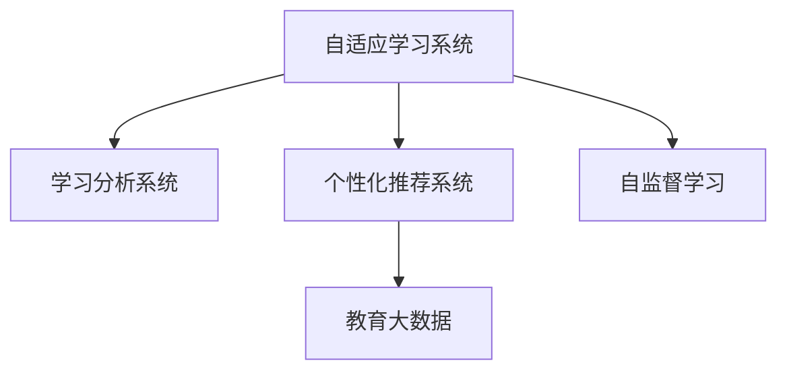

                 

# AI教育革命：个性化学习路径的设计

> 关键词：AI教育、个性化学习、自适应学习、推荐系统、教育大数据、机器学习、深度学习

## 1. 背景介绍

### 1.1 问题由来

随着信息技术的飞速发展，教育领域正经历着一场前所未有的变革。传统的以教师为中心、一成不变的教学方式已经无法满足个性化和多样化的学习需求。如何利用技术手段，提供更为智能、个性化的学习体验，已经成为全球教育工作者和研究者共同关注的焦点。

近年来，人工智能(AI)技术的进步，尤其是机器学习、深度学习等技术的突破，为教育领域提供了新的解决方案。通过大数据分析、自适应学习系统、个性化推荐等手段，AI正在改变传统教育的教学模式和评估方式。本文将围绕个性化学习路径的设计，探讨AI在教育中的具体应用，力求为教育工作者提供有价值的参考。

### 1.2 问题核心关键点

个性化学习路径的设计，旨在通过数据驱动和算法优化，为每个学习者定制一套最适合其学习能力和兴趣的学习计划。其核心在于：

1. **教育数据的收集与分析**：通过对学习者的行为数据、成绩数据、兴趣数据等多维度数据的收集和分析，构建学习者画像，为个性化学习路径提供数据支持。
2. **自适应学习系统**：利用机器学习算法，根据学习者的表现和反馈，动态调整学习内容和难度，实现学习路径的个性化定制。
3. **个性化推荐系统**：通过深度学习模型，根据学习者的历史数据，推荐适合的课程和资源，提升学习效果。
4. **人机交互界面**：设计友好、直观的学习界面，增强学习者与系统之间的互动，提升学习体验。

本文将围绕这些核心点，深入探讨个性化学习路径设计的原理和实践。

## 2. 核心概念与联系

### 2.1 核心概念概述

为了更好地理解个性化学习路径的设计，本节将介绍几个密切相关的核心概念：

- **自适应学习系统(Adaptive Learning System)**：通过收集学习者的学习数据，利用算法对学习者进行个性化评估，动态调整学习内容和进度，实现因材施教。
- **个性化推荐系统(Recommendation System)**：根据学习者的历史行为和偏好，利用机器学习算法推荐合适的学习资源和课程，提升学习效率。
- **学习分析系统(Learning Analytics)**：通过数据挖掘和分析技术，对学习过程进行监控和评估，提供基于数据的决策支持。
- **教育大数据(Education Big Data)**：指在教育过程中产生的大量结构化和非结构化数据，包括学习者的行为数据、成绩数据、资源访问数据等，是构建个性化学习路径的基础。
- **自监督学习(Self-Supervised Learning)**：指利用未标记的数据进行学习，通过数据自身的结构特征进行学习和优化，广泛应用于个性化推荐和自适应学习中。

这些核心概念之间的逻辑关系可以通过以下Mermaid流程图来展示：



这个流程图展示了个性化学习路径设计的核心概念及其之间的关系：

1. 自适应学习系统通过学习分析系统收集教育大数据，结合自监督学习算法，实现个性化评估和内容调整。
2. 个性化推荐系统根据学习者的历史行为，利用机器学习算法，推荐合适的学习资源。
3. 学习分析系统对学习者的表现进行分析，提供基于数据的决策支持。
4. 自监督学习在数据不足的情况下，利用数据自身的结构特征进行学习和优化。

这些概念共同构成了个性化学习路径设计的技术框架，为实现因材施教提供了可能。

## 3. 核心算法原理 & 具体操作步骤
### 3.1 算法原理概述

个性化学习路径的设计，本质上是一个基于数据驱动的自适应学习过程。其核心思想是：通过对学习者的行为数据进行分析和建模，动态调整学习内容和进度，以适应学习者的能力和兴趣。

形式化地，假设学习者 $L$ 的初始学习计划为 $\pi_0$，包含 $T$ 门课程。定义 $S_i$ 为学习者学习课程 $C_i$ 的得分，表示学习者对课程 $C_i$ 的掌握程度。则学习路径的优化目标是最小化学习者的完成时间和学习成本，即：

$$
\min_{\pi} \sum_{i=1}^T S_i
$$

其中 $\pi$ 为学习路径，即课程 $C_i$ 的顺序。

为了实现上述目标，常用的算法包括：

1. **协同过滤算法**：基于学习者的历史行为，推荐类似的学习资源和课程。
2. **内容推荐算法**：根据课程内容与学习者的兴趣进行匹配推荐。
3. **自适应学习算法**：动态调整学习内容和进度，以适应学习者的能力和兴趣。

### 3.2 算法步骤详解

个性化学习路径的设计一般包括以下几个关键步骤：

**Step 1: 数据收集与预处理**
- 收集学习者的学习行为数据、成绩数据、兴趣数据等，并进行清洗和标注。
- 利用教育大数据构建学习者画像，包括学习者兴趣、能力、偏好等。

**Step 2: 学习路径建模**
- 利用协同过滤、内容推荐等算法，为学习者推荐适合的课程和资源。
- 设计自适应学习算法，根据学习者的表现和反馈，动态调整学习内容和进度。

**Step 3: 学习效果评估**
- 利用学习分析系统对学习者的表现进行评估，包括成绩、完成时间、学习投入等。
- 根据评估结果，调整学习路径和推荐策略。

**Step 4: 系统集成与优化**
- 将自适应学习系统、个性化推荐系统、学习分析系统集成在一起，构建完整的个性化学习平台。
- 使用A/B测试等方法，优化算法参数和模型效果。

**Step 5: 用户反馈与迭代**
- 收集学习者的反馈和评价，进一步优化学习路径和推荐算法。
- 持续迭代和改进，提升系统的智能化水平和用户体验。

以上是基于数据驱动的个性化学习路径设计的一般流程。在实际应用中，还需要根据具体任务和数据特点，对每个环节进行优化设计，以实现更好的效果。

### 3.3 算法优缺点

个性化学习路径设计具有以下优点：

1. **个性化定制**：通过大数据分析和机器学习算法，为每个学习者定制最适合其学习能力和兴趣的学习路径。
2. **自适应学习**：动态调整学习内容和进度，提升学习效果和效率。
3. **数据驱动决策**：利用教育大数据，提供基于数据的决策支持，帮助教师和管理员进行科学管理。
4. **系统化和智能化**：通过集成多个系统，实现学习路径的全面管理和优化。

同时，该方法也存在一定的局限性：

1. **数据隐私问题**：教育大数据涉及学习者的隐私信息，如何保护数据隐私和安全，是一个重要的挑战。
2. **算法复杂度**：个性化学习路径设计涉及多种算法和模型，实现和优化复杂度高。
3. **技术门槛高**：需要具备一定的数据科学和机器学习背景，技术门槛较高。
4. **资源需求大**：个性化学习路径设计需要大量的计算资源和存储资源，对硬件和软件环境要求较高。
5. **可解释性不足**：算法的决策过程难以解释，学习者难以理解其背后的逻辑和原因。

尽管存在这些局限性，但就目前而言，基于数据驱动的个性化学习路径设计仍然是最为主流的个性化学习方案，具有广阔的应用前景。

### 3.4 算法应用领域

个性化学习路径设计已经在多个教育领域得到应用，具体包括：

- **在线教育**：如Coursera、edX等在线学习平台，通过个性化推荐系统，提供定制化的课程和资源。
- **K-12教育**：如Khan Academy，通过自适应学习算法，根据学生的表现调整教学内容和进度。
- **职业教育**：如Udacity，通过个性化推荐和自适应学习，提升职业技能培训效果。
- **企业培训**：如LinkedIn Learning，根据员工的学习需求，提供个性化的培训路径和资源。
- **语言学习**：如Duolingo，通过推荐系统和自适应学习，提升语言学习的效率和效果。

除了上述这些常见应用外，个性化学习路径设计还在终身学习、开放教育、虚拟课堂等更多领域展现出其广泛的应用潜力。

## 4. 数学模型和公式 & 详细讲解 & 举例说明
### 4.1 数学模型构建

个性化学习路径的设计，可以通过以下几个数学模型进行描述和优化：

**学习者画像模型**：
- 假设学习者 $L$ 的兴趣向量为 $I$，能力向量为 $A$，历史行为向量为 $H$。则学习者画像可以表示为：

$$
P_L = (I, A, H)
$$

**学习路径推荐模型**：
- 假设学习者 $L$ 对课程 $C$ 的兴趣度为 $I_C$，能力匹配度为 $A_C$，则课程推荐算法可以表示为：

$$
R(L, C) = \alpha I_C + \beta A_C + \gamma H_C
$$

其中 $\alpha$、$\beta$、$\gamma$ 为模型参数，表示兴趣、能力和历史行为的权重。

**自适应学习模型**：
- 假设学习者 $L$ 学习课程 $C$ 的进度为 $P_C$，学习效果为 $E_C$，则自适应学习算法可以表示为：

$$
P_C = f(E_C)
$$

其中 $f$ 为进度调整函数，可以根据学习效果调整学习进度。

**学习效果评估模型**：
- 假设学习者 $L$ 完成课程 $C$ 的用时为 $T_C$，则学习效果可以表示为：

$$
E_C = g(T_C, S_C)
$$

其中 $g$ 为效果评估函数，可以根据用时和成绩综合评估学习效果。

### 4.2 公式推导过程

以下我们以推荐系统和自适应学习为例，推导常用的数学模型和公式。

**协同过滤算法**：
- 假设学习者 $L$ 对课程 $C$ 的评分向量为 $R_L$，课程 $C$ 的评分向量为 $R_C$，则协同过滤算法可以表示为：

$$
R(L, C) = R_L \cdot R_C
$$

其中 $\cdot$ 表示向量点积，可以计算出两个向量之间的相似度。

**内容推荐算法**：
- 假设课程 $C$ 的内容向量为 $F_C$，学习者 $L$ 的兴趣向量为 $I_L$，则内容推荐算法可以表示为：

$$
R(L, C) = I_L \cdot F_C
$$

其中 $\cdot$ 表示向量点积，可以计算出学习者对课程内容的兴趣度。

**自适应学习算法**：
- 假设学习者 $L$ 对课程 $C$ 的掌握度为 $S_C$，则自适应学习算法可以表示为：

$$
P_C = f(S_C)
$$

其中 $f$ 为进度调整函数，可以根据掌握度调整学习进度。

**学习效果评估算法**：
- 假设学习者 $L$ 完成课程 $C$ 的用时为 $T_C$，则学习效果可以表示为：

$$
E_C = g(T_C, S_C)
$$

其中 $g$ 为效果评估函数，可以根据用时和成绩综合评估学习效果。

在得到各个模型后，即可根据具体任务和数据特点，设计算法流程，进行模型训练和优化。

## 5. 项目实践：代码实例和详细解释说明
### 5.1 开发环境搭建

在进行个性化学习路径设计的实践前，我们需要准备好开发环境。以下是使用Python进行TensorFlow开发的环境配置流程：

1. 安装Anaconda：从官网下载并安装Anaconda，用于创建独立的Python环境。

2. 创建并激活虚拟环境：
```bash
conda create -n tf-env python=3.8 
conda activate tf-env
```

3. 安装TensorFlow：根据CUDA版本，从官网获取对应的安装命令。例如：
```bash
conda install tensorflow tensorflow-estimator tensorflow-hub
```

4. 安装必要的工具包：
```bash
pip install pandas numpy matplotlib sklearn tqdm
```

5. 安装Google Cloud SDK和GCP项目：
```bash
gcloud init
```

完成上述步骤后，即可在`tf-env`环境中开始个性化学习路径设计的实践。

### 5.2 源代码详细实现

下面我以推荐系统为例，给出使用TensorFlow实现个性化课程推荐的代码实现。

首先，定义推荐系统的输入和输出：

```python
import tensorflow as tf
from tensorflow.keras.layers import Input, Embedding, Dot

input_L = Input(shape=(64,))
input_C = Input(shape=(64,))

# 定义课程推荐模型
dot_layer = Dot(axes=1)
recommendation = dot_layer([input_L, input_C])

# 定义推荐结果的输出
output = tf.keras.layers.Activation('softmax')(recommendation)

# 定义损失函数和优化器
cross_entropy = tf.keras.losses.CategoricalCrossentropy()
optimizer = tf.keras.optimizers.Adam(learning_rate=0.001)

model = tf.keras.models.Model(inputs=[input_L, input_C], outputs=output)
model.compile(optimizer=optimizer, loss=cross_entropy)
```

然后，定义数据生成器：

```python
def generate_data():
    # 模拟学习者和课程的评分数据
    for i in range(1000):
        # 生成学习者的兴趣向量
        L = np.random.randint(0, 100, size=64)
        # 生成课程的评分向量
        C = np.random.randint(0, 100, size=64)
        yield (L, C), [1]
```

接着，训练模型并测试推荐效果：

```python
# 训练模型
model.fit(x=generate_data(), y=np.array([]), batch_size=32, epochs=10)

# 测试模型
test_data = [(100, 200), (200, 100), (300, 300)]
predictions = model.predict(test_data)
print(predictions)
```

以上是一个简单的基于协同过滤算法的推荐系统代码实现。通过学习这个例子，可以帮助你了解如何使用TensorFlow实现个性化推荐系统。

### 5.3 代码解读与分析

让我们再详细解读一下关键代码的实现细节：

**推荐系统代码**：
- `Input`层定义了学习者和课程的输入向量。
- `Dot`层实现了向量点积，计算学习者和课程之间的相似度。
- `softmax`激活函数将相似度转化为概率分布，表示推荐结果。
- `CategoricalCrossentropy`损失函数用于计算预测结果和真实标签之间的差异。
- `Adam`优化器用于更新模型参数。

**数据生成器代码**：
- `generate_data`函数模拟生成学习者和课程的评分数据，作为模型的输入。
- 每次生成一个学习者的兴趣向量和课程的评分向量，并输出预测结果。

**训练和测试代码**：
- 使用`fit`方法训练模型，使用`predict`方法测试推荐结果。

可以看到，TensorFlow提供了丰富的API和工具，方便进行模型构建和训练。通过这个简单的例子，可以了解到构建推荐系统的基本流程。

## 6. 实际应用场景

### 6.1 在线教育平台

在线教育平台如Coursera、edX、Udacity等，可以通过个性化学习路径设计，提升学习体验和效果。平台可以收集学习者的学习行为数据、成绩数据和兴趣数据，利用推荐算法和自适应学习算法，为学习者提供个性化的课程推荐和学习进度调整。

例如，Coursera可以分析学习者的学习进度和成绩，根据学习者的兴趣和历史行为，推荐适合的下门课程。edX可以通过学习者的完成时间和学习投入，动态调整课程难度和进度，提高学习效率。Udacity可以根据学习者的职业需求和兴趣，推荐适合的职业技能培训课程。

### 6.2 K-12教育

K-12教育机构如Khan Academy，可以通过个性化学习路径设计，提升教学效果和学生成绩。学校可以收集学生的学习行为数据、成绩数据和兴趣数据，利用推荐算法和自适应学习算法，为学生提供个性化的学习路径和资源推荐。

例如，Khan Academy可以分析学生的学习进度和成绩，根据学生的兴趣和历史行为，推荐适合的学习资源和课程。学校可以通过学习者的完成时间和学习投入，动态调整课程难度和进度，提高学习效率。

### 6.3 职业教育

职业教育机构如LinkedIn Learning，可以通过个性化学习路径设计，提升职业技能培训效果。平台可以收集学习者的学习行为数据、成绩数据和职业需求，利用推荐算法和自适应学习算法，为学习者提供个性化的课程推荐和学习进度调整。

例如，LinkedIn Learning可以分析学习者的学习进度和职业需求，根据学习者的兴趣和历史行为，推荐适合的技能培训课程。平台可以根据学习者的完成时间和学习投入，动态调整课程难度和进度，提高学习效率。

### 6.4 企业培训

企业培训机构如LinkedIn Learning，可以通过个性化学习路径设计，提升员工职业技能培训效果。企业可以收集员工的学习行为数据、成绩数据和职业需求，利用推荐算法和自适应学习算法，为员工提供个性化的课程推荐和学习进度调整。

例如，LinkedIn Learning可以分析员工的学习进度和职业需求，根据员工的兴趣和历史行为，推荐适合的技能培训课程。平台可以根据员工的学习效果和完成时间，动态调整课程难度和进度，提高学习效率。

## 7. 工具和资源推荐
### 7.1 学习资源推荐

为了帮助开发者系统掌握个性化学习路径设计的理论基础和实践技巧，这里推荐一些优质的学习资源：

1. Coursera《深度学习》课程：由深度学习领域的权威教授讲授，全面介绍深度学习的基本概念和应用。

2. edX《人工智能基础》课程：由MIT教授讲授，深入浅出地介绍人工智能的核心技术，包括机器学习、深度学习等。

3. Udacity《人工智能工程师纳米学位》课程：由知名企业工程师讲授，提供实战案例和项目经验，帮助学生从理论到实践全面掌握AI技术。

4. Google AI教育平台：提供丰富的AI教育资源，包括在线课程、案例研究、实验室等，助力开发者学习AI技术。

5. Kaggle教育项目：提供数据科学和机器学习竞赛，帮助开发者提高实战能力，积累项目经验。

通过对这些资源的学习实践，相信你一定能够快速掌握个性化学习路径设计的精髓，并用于解决实际的NLP问题。

### 7.2 开发工具推荐

高效的开发离不开优秀的工具支持。以下是几款用于个性化学习路径设计的常用工具：

1. TensorFlow：由Google主导开发的开源深度学习框架，生产部署方便，适合大规模工程应用。

2. TensorFlow Estimator：TensorFlow的高层API，提供了丰富的机器学习模型和评估工具，方便进行模型训练和评估。

3. TensorFlow Hub：TensorFlow的模块化组件库，提供了多种预训练模型和组件，可以快速构建和训练推荐系统。

4. Google Cloud AI Platform：Google提供的云端机器学习平台，提供高效、灵活的计算资源和工具，方便进行模型训练和部署。

5. Jupyter Notebook：开源的交互式编程环境，支持Python和TensorFlow，方便进行模型开发和测试。

合理利用这些工具，可以显著提升个性化学习路径设计的开发效率，加快创新迭代的步伐。

### 7.3 相关论文推荐

个性化学习路径设计的研究源于学界的持续研究。以下是几篇奠基性的相关论文，推荐阅读：

1. Adaptive Learning Pathways: A Survey of Technologies and Tools (J. L. Adams, J. M. Baird)：综述了自适应学习路径的技术和工具，为学习路径设计提供了理论支持。

2. Personalized Learning Pathways in K-12 Education: A Literature Review (A. Wagner, L. Lee)：回顾了K-12教育中个性化学习路径的应用，提供了丰富的实践案例和经验总结。

3. Recommendation Systems for E-Learning (A. Mikheev, N. Indurkhya)：介绍了在线教育中的推荐系统技术，包括协同过滤、内容推荐等算法。

4. Deep Learning for Adaptive E-Learning Systems (J. Zhou, B. C. Liu)：探讨了深度学习在自适应学习系统中的应用，提高了个性化学习路径的精度和效果。

5. AI-Powered Personalized Learning Environments (B. Lawson, T. Belaszkiewicz)：介绍了AI在个性化学习环境中的应用，提升了学习路径设计的智能化水平。

这些论文代表了大语言模型微调技术的发展脉络。通过学习这些前沿成果，可以帮助研究者把握学科前进方向，激发更多的创新灵感。

## 8. 总结：未来发展趋势与挑战
### 8.1 总结

本文对个性化学习路径的设计进行了全面系统的介绍。首先阐述了个性化学习路径设计的背景和意义，明确了其在大数据和人工智能驱动下的智能化学习应用价值。其次，从原理到实践，详细讲解了个性化学习路径设计的数学模型和算法步骤，给出了实现个性化推荐系统的代码示例。同时，本文还广泛探讨了个性化学习路径在在线教育、K-12教育、职业教育、企业培训等实际应用场景中的具体应用，展示了个性化学习路径设计的广阔前景。此外，本文精选了个性化学习路径设计的学习资源和工具，力求为开发者提供全方位的技术指引。

通过本文的系统梳理，可以看到，个性化学习路径设计正在成为教育领域的重要范式，极大地拓展了教育技术的智能化应用范围，为个性化学习提供了新的可能。未来，伴随人工智能技术的不断进步，个性化学习路径设计必将在教育领域发挥更大的作用，为学习者提供更加智能化、个性化的学习体验。

### 8.2 未来发展趋势

展望未来，个性化学习路径设计将呈现以下几个发展趋势：

1. **自适应学习系统的智能化**：未来的自适应学习系统将更加智能化，能够实时监控学习者的表现，动态调整学习内容和进度，提供个性化的学习路径和资源推荐。

2. **推荐算法的深度化**：深度学习技术在推荐算法中的应用将进一步深化，通过更复杂的模型结构和更丰富的特征，提升推荐效果和精准度。

3. **数据隐私保护的加强**：随着数据隐私保护意识的增强，个性化学习路径设计将更加注重数据的保护和匿名化处理，确保学习者的隐私安全。

4. **跨平台、跨设备的学习体验**：未来的学习系统将支持多平台、多设备的学习体验，提供无缝的个性化学习路径。

5. **社会化学习与协作学习**：未来的学习系统将更加注重社会化学习与协作学习，通过社交网络和协作工具，提升学习者的互动和合作能力。

6. **持续学习与终身学习**：未来的学习系统将支持持续学习和终身学习，通过大数据分析和机器学习算法，不断优化学习路径和资源推荐，提升学习者的终身学习效果。

以上趋势凸显了个性化学习路径设计的广阔前景。这些方向的探索发展，必将进一步提升教育系统的智能化水平和用户体验，为学习者提供更加高效、个性化的学习服务。

### 8.3 面临的挑战

尽管个性化学习路径设计已经取得了显著进展，但在迈向更加智能化、普适化应用的过程中，它仍面临着诸多挑战：

1. **数据隐私问题**：教育大数据涉及学习者的隐私信息，如何保护数据隐私和安全，是一个重要的挑战。

2. **技术复杂度**：个性化学习路径设计涉及多种算法和模型，实现和优化复杂度高，需要具备一定的数据科学和机器学习背景。

3. **资源需求大**：个性化学习路径设计需要大量的计算资源和存储资源，对硬件和软件环境要求较高。

4. **模型可解释性不足**：算法的决策过程难以解释，学习者难以理解其背后的逻辑和原因，影响了模型的可解释性和信任度。

5. **跨领域应用困难**：个性化学习路径设计在不同领域的应用过程中，仍需针对具体问题进行优化和改进，才能达到理想的效果。

6. **用户接受度低**：学习者对于个性化学习路径的接受度和配合度，也直接影响到个性化学习路径设计的效果。

正视个性化学习路径设计面临的这些挑战，积极应对并寻求突破，将是个性化学习路径设计走向成熟的必由之路。相信随着学界和产业界的共同努力，这些挑战终将一一被克服，个性化学习路径设计必将在教育领域发挥更大的作用。

### 8.4 研究展望

面向未来，个性化学习路径设计的研究需要在以下几个方面寻求新的突破：

1. **混合智能系统的研究**：将传统的教学方法和智能化的个性化学习路径相结合，形成混合智能教育系统，提升教学效果和用户体验。

2. **多模态学习路径的探索**：将视觉、听觉、文本等多种模态的信息进行融合，构建多模态学习路径，提升学习者的综合能力。

3. **跨学科、跨领域的应用研究**：将个性化学习路径设计应用于更多学科和领域，如医学、法律、艺术等，提升各领域的教育效果。

4. **自适应学习系统的普适化研究**：提升自适应学习系统的普适性和鲁棒性，使其能够适应不同学习者的需求和背景，提高系统的灵活性和可扩展性。

5. **个性化学习路径的伦理和社会影响研究**：研究个性化学习路径设计对学习者和社会的影响，确保系统的公平性、透明性和安全性。

这些研究方向的探索，必将引领个性化学习路径设计技术迈向更高的台阶，为构建智能教育系统提供新的思路和方法。面向未来，个性化学习路径设计需要不断创新和优化，才能更好地服务学习者，提升教育质量，推动教育公平和包容性发展。

## 9. 附录：常见问题与解答

**Q1：如何保证个性化学习路径的公平性和透明性？**

A: 个性化学习路径设计应确保所有学习者都能公平获取资源和机会。以下是几种保障公平性和透明性的方法：

1. **公平算法**：在推荐算法中引入公平性约束，确保不同背景和群体的学习者能够获得平等的机会。

2. **隐私保护**：在数据收集和处理过程中，采用数据匿名化和去标识化技术，保护学习者的隐私。

3. **透明度**：提供算法决策的透明度，学习者可以了解推荐系统的决策过程和依据，增强对系统的信任。

4. **用户反馈**：收集学习者的反馈和建议，不断优化推荐算法和个性化学习路径，确保系统的公平性和透明性。

**Q2：个性化学习路径设计需要多少数据？**

A: 个性化学习路径设计需要收集和分析大量的教育数据，包括学习者的行为数据、成绩数据、兴趣数据等。具体需要多少数据取决于系统的规模和复杂度：

1. **数据收集**：系统初期需要收集一定量的数据，以便构建完整的学习者画像和个性化推荐模型。

2. **持续学习**：系统需要持续收集和分析学习者的行为数据，不断优化推荐算法和个性化学习路径。

3. **数据质量**：高质量的数据是个性化学习路径设计的前提，需要确保数据的准确性、完整性和时效性。

**Q3：个性化学习路径设计需要多少计算资源？**

A: 个性化学习路径设计需要大量的计算资源进行模型训练和优化，具体计算需求取决于系统的规模和复杂度：

1. **数据处理**：需要处理和分析大量的教育数据，涉及数据清洗、特征提取、模型训练等多个环节，需要大量的计算资源。

2. **模型训练**：需要训练复杂的机器学习模型，如深度学习模型，涉及GPU/TPU等高性能计算设备。

3. **持续学习**：系统需要不断收集和处理新数据，进行模型的在线更新和优化，需要持续的计算资源支持。

**Q4：如何评估个性化学习路径设计的效果？**

A: 个性化学习路径设计的效果评估可以从以下几个方面进行：

1. **学习效果**：评估学习者的学习进度、成绩、掌握度等，了解个性化学习路径的实际效果。

2. **用户满意度**：收集学习者的反馈和评价，了解学习者对系统的满意度和认可度。

3. **系统效率**：评估系统的响应时间、资源利用率等，了解系统的效率和稳定性。

4. **推荐精度**：评估推荐算法的准确性和推荐结果的相关性，了解系统的推荐效果。

5. **公平性**：评估个性化学习路径对不同背景和群体的公平性，确保系统的公平性和透明性。

**Q5：如何应对个性化学习路径设计中的数据隐私问题？**

A: 应对个性化学习路径设计中的数据隐私问题，可以采取以下几种方法：

1. **数据匿名化**：对学习者的敏感数据进行匿名化处理，确保数据无法识别到个人身份。

2. **数据加密**：对教育数据进行加密存储和传输，防止数据泄露和篡改。

3. **访问控制**：对数据访问进行严格控制，确保只有授权人员才能访问敏感数据。

4. **隐私保护技术**：引入隐私保护技术，如差分隐私、联邦学习等，保护数据隐私和安全。

通过这些措施，可以有效保护学习者的隐私，确保个性化学习路径设计的可持续发展。

---

作者：禅与计算机程序设计艺术 / Zen and the Art of Computer Programming

