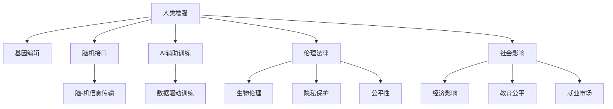

                 

# AI时代的人类增强：道德考虑与身体增强的未来发展机遇挑战机遇

## 1. 背景介绍

### 1.1 问题由来
随着人工智能（AI）技术的飞速发展，人类增强（Human Enhancement）的概念逐渐进入公众视野。基于生物工程、基因编辑、AI辅助技术等手段，未来人们有望获得超越自然能力的体能、智力和情感体验。这不仅意味着科技的进步，更带来了伦理、法律和社会层面深刻的思考和挑战。

### 1.2 问题核心关键点
- **人类增强技术**：包括基因编辑、脑机接口、AI辅助训练等手段，旨在提升人类生理和认知能力。
- **伦理与法律问题**：如基因编辑的公平性、安全性、知情同意等，如何在科学探索与伦理规范间找到平衡点。
- **社会影响**：人类增强可能导致社会分层加剧、竞争失衡等问题，如何引导技术正向发展，确保其普惠性。

### 1.3 问题研究意义
在AI时代，人类增强不仅关乎技术进步，更是对人类未来社会发展的深刻探讨。通过理解其潜在的机遇与挑战，可以引导科技正向应用，推动更健康、公正的社会进程。

## 2. 核心概念与联系

### 2.1 核心概念概述

为更好地理解人类增强技术及其伦理法律问题，本节将介绍几个密切相关的核心概念：

- **人类增强**：指通过技术手段提升人类生理和认知能力，包括但不限于基因编辑、脑机接口、AI辅助训练等。
- **基因编辑**：如CRISPR技术，通过精确修改DNA序列，实现治疗遗传病、增强体能等功能。
- **脑机接口**：利用技术手段，使大脑与计算机系统直接交互，实现信息传输和控制。
- **AI辅助训练**：通过AI算法分析训练数据，提供个性化的训练方案，提升体能和认知能力。
- **伦理法律**：涵盖生物伦理、隐私保护、公平性等，确保技术应用的安全与合理性。
- **社会影响**：涉及经济、教育、就业等方面，分析人类增强对社会结构的影响。

这些核心概念之间的逻辑关系可以通过以下Mermaid流程图来展示：



这个流程图展示了人类增强技术及其相关概念的相互关系：

1. 人类增强技术包括基因编辑、脑机接口和AI辅助训练等不同手段。
2. 基因编辑通过修改DNA序列实现体能和智力的提升。
3. AI辅助训练利用数据分析提升训练效果。
4. 脑机接口实现大脑与计算机的直接交互。
5. 伦理法律问题涵盖了生物伦理、隐私保护、公平性等。
6. 社会影响涉及经济、教育、就业等多个方面。

## 3. 核心算法原理 & 具体操作步骤
### 3.1 算法原理概述

基于AI技术的人类增强涉及多个领域，其核心算法原理与AI技术密不可分。例如，AI辅助训练通常基于机器学习算法，通过对训练数据的分析，个性化地制定训练计划，提升训练效果。

以AI辅助训练为例，其核心算法原理如下：

- **数据预处理**：收集和整理训练数据，如动作捕捉、生理参数等。
- **特征提取**：利用算法从原始数据中提取关键特征，如动作轨迹、心率变化等。
- **模型训练**：使用机器学习算法（如回归、分类、强化学习等）训练模型，预测训练效果。
- **个性化训练**：根据模型预测结果，提供个性化训练建议，如调整训练强度、训练方式等。

### 3.2 算法步骤详解

人类增强中的AI辅助训练流程主要包括以下几个关键步骤：

**Step 1: 数据收集与预处理**
- 收集包含人体运动、生理参数等的多维数据。
- 进行数据清洗、归一化、异常值处理等预处理工作。

**Step 2: 特征提取与选择**
- 利用特征提取算法（如PCA、LDA等）从原始数据中提取关键特征。
- 通过特征选择算法（如LASSO、RF等）挑选最相关特征，去除冗余。

**Step 3: 模型训练与优化**
- 选择适合的机器学习算法，如随机森林、支持向量机、深度神经网络等。
- 利用训练集数据，训练机器学习模型，调整超参数，确保模型准确度。

**Step 4: 个性化训练与反馈**
- 根据模型预测结果，提供个性化训练方案。
- 实时监测训练数据，根据反馈调整训练计划，确保训练效果最大化。

**Step 5: 评估与迭代**
- 使用验证集数据评估模型效果，调整模型参数。
- 根据评估结果，持续迭代模型训练过程，提升训练精度。

### 3.3 算法优缺点

AI辅助训练作为一种新兴的人类增强手段，具有以下优点：

- **高效性**：通过数据驱动的个性化训练，提升训练效果，缩短训练周期。
- **可扩展性**：可以应用于多种体能和认知训练，如体能训练、心理训练等。
- **精准性**：利用AI模型对数据进行精细分析，确保训练方案的科学性和有效性。

同时，该方法也存在一定的局限性：

- **数据依赖**：训练效果依赖于数据的质量和数量，获取高质量训练数据成本较高。
- **模型复杂性**：模型训练过程复杂，需要较强的算法和计算资源支持。
- **隐私问题**：训练过程中涉及大量个人数据，需确保隐私保护。
- **公平性**：可能加剧社会不平等，需要关注公平性和普惠性。

尽管存在这些局限性，AI辅助训练仍是大语言模型应用中最具前景的技术范式之一。未来相关研究的重点在于如何进一步降低数据获取成本，提高模型的泛化能力和公平性。

### 3.4 算法应用领域

AI辅助训练在多个领域已经得到了广泛的应用，例如：

- **体育训练**：如田径、足球、武术等项目，通过AI分析运动员的训练数据，制定个性化的训练方案，提升运动表现。
- **军事训练**：利用AI技术分析士兵的训练数据，优化训练计划，提升士兵的战斗能力。
- **健康管理**：结合生理参数、运动数据，通过AI分析预测健康风险，提供个性化健康管理方案。
- **教育培训**：利用AI技术分析学生的学习数据，提供个性化学习方案，提升学习效果。

除了上述这些经典应用外，AI辅助训练还被创新性地应用于远程医疗、游戏训练、智能客服等场景中，为人类增强技术的发展提供了新的可能性。

## 4. 数学模型和公式 & 详细讲解 & 举例说明
### 4.1 数学模型构建

为更深入理解AI辅助训练的数学原理，本节将构建一个简单的回归模型。假设训练数据集为 $D=\{(x_i,y_i)\}_{i=1}^N$，其中 $x_i \in \mathbb{R}^m$ 为特征向量， $y_i \in \mathbb{R}$ 为训练结果。

设线性回归模型为 $y = \theta^T x + b$，其中 $\theta$ 为模型参数， $b$ 为截距。

定义模型在数据样本 $(x,y)$ 上的均方误差损失函数为：

$$
\ell(\theta) = \frac{1}{N} \sum_{i=1}^N (y_i - \theta^T x_i - b)^2
$$

### 4.2 公式推导过程

线性回归模型的最小化目标是寻找最优参数 $\theta$，使模型在训练集上的均方误差最小。最小化问题可转化为求解以下优化问题：

$$
\mathop{\arg\min}_{\theta} \ell(\theta)
$$

对损失函数求导，得到参数 $\theta$ 的梯度：

$$
\nabla_{\theta}\ell(\theta) = \frac{2}{N} \sum_{i=1}^N (y_i - \theta^T x_i - b)x_i
$$

通过梯度下降算法，不断更新模型参数 $\theta$，直至收敛。求解过程如下：

1. 初始化模型参数 $\theta$ 和截距 $b$。
2. 使用训练集数据 $D$，计算损失函数梯度 $\nabla_{\theta}\ell(\theta)$。
3. 使用学习率 $\eta$ 更新模型参数：

$$
\theta \leftarrow \theta - \eta \nabla_{\theta}\ell(\theta)
$$

4. 重复步骤2和3，直至模型收敛或达到预设的迭代次数。

### 4.3 案例分析与讲解

以体育训练为例，分析AI辅助训练的应用场景。

**Step 1: 数据收集与预处理**
- 收集运动员在训练过程中的动作捕捉数据、生理参数（如心率、血压等）。
- 进行数据清洗、归一化处理，去除异常值。

**Step 2: 特征提取与选择**
- 利用PCA算法提取关键特征，如运动轨迹、速度变化等。
- 选择与训练效果最相关的特征，去除冗余信息。

**Step 3: 模型训练与优化**
- 使用随机森林算法训练回归模型，优化超参数，确保模型准确度。
- 通过交叉验证评估模型性能，调整模型参数。

**Step 4: 个性化训练与反馈**
- 根据模型预测结果，提供个性化训练方案，如调整训练强度、训练方式等。
- 实时监测训练数据，根据反馈调整训练计划，确保训练效果最大化。

**Step 5: 评估与迭代**
- 使用验证集数据评估模型效果，调整模型参数。
- 根据评估结果，持续迭代模型训练过程，提升训练精度。

通过上述流程，AI辅助训练能够为运动员提供科学的训练方案，提升训练效果，缩短训练周期。

## 5. 项目实践：代码实例和详细解释说明
### 5.1 开发环境搭建

在进行AI辅助训练项目实践前，我们需要准备好开发环境。以下是使用Python进行机器学习开发的典型环境配置流程：

1. 安装Anaconda：从官网下载并安装Anaconda，用于创建独立的Python环境。

2. 创建并激活虚拟环境：
```bash
conda create -n pytorch-env python=3.8 
conda activate pytorch-env
```

3. 安装PyTorch：根据CUDA版本，从官网获取对应的安装命令。例如：
```bash
conda install pytorch torchvision torchaudio cudatoolkit=11.1 -c pytorch -c conda-forge
```

4. 安装Scikit-Learn、NumPy、Pandas等库：
```bash
pip install scikit-learn numpy pandas matplotlib
```

5. 安装TensorBoard：用于可视化模型训练过程和效果。
```bash
pip install tensorboard
```

完成上述步骤后，即可在`pytorch-env`环境中开始项目开发。

### 5.2 源代码详细实现

下面我们以体育训练为例，给出使用Scikit-Learn进行回归模型的PyTorch代码实现。

首先，导入必要的库：

```python
import numpy as np
from sklearn.model_selection import train_test_split
from sklearn.metrics import mean_squared_error
from sklearn.ensemble import RandomForestRegressor
import torch
from torch import nn, optim
from torch.utils.data import TensorDataset, DataLoader
from sklearn.preprocessing import StandardScaler
```

接着，定义训练数据和目标变量：

```python
X = np.load('features.npy')
y = np.load('targets.npy')
```

然后，对数据进行标准化处理：

```python
scaler = StandardScaler()
X = scaler.fit_transform(X)
```

接下来，将数据集划分为训练集和验证集：

```python
X_train, X_val, y_train, y_val = train_test_split(X, y, test_size=0.2, random_state=42)
```

定义模型和损失函数：

```python
class LinearRegression(nn.Module):
    def __init__(self, input_dim):
        super(LinearRegression, self).__init__()
        self.linear = nn.Linear(input_dim, 1)
    
    def forward(self, x):
        return self.linear(x)
```

定义优化器和损失函数：

```python
model = LinearRegression(input_dim=X_train.shape[1])
optimizer = optim.Adam(model.parameters(), lr=0.01)
loss_fn = nn.MSELoss()
```

定义训练循环和评估函数：

```python
def train_epoch(model, data_loader, optimizer):
    model.train()
    train_loss = 0.0
    for batch in data_loader:
        inputs, targets = batch
        optimizer.zero_grad()
        outputs = model(inputs)
        loss = loss_fn(outputs, targets)
        loss.backward()
        optimizer.step()
        train_loss += loss.item()
    return train_loss / len(data_loader)

def evaluate(model, data_loader):
    model.eval()
    eval_loss = 0.0
    with torch.no_grad():
        for batch in data_loader:
            inputs, targets = batch
            outputs = model(inputs)
            loss = loss_fn(outputs, targets)
            eval_loss += loss.item()
    return eval_loss / len(data_loader)
```

启动训练流程并在验证集上评估：

```python
epochs = 100
batch_size = 32

for epoch in range(epochs):
    train_loss = train_epoch(model, train_loader)
    print(f'Epoch {epoch+1}, train loss: {train_loss:.4f}')
    
    eval_loss = evaluate(model, val_loader)
    print(f'Epoch {epoch+1}, val loss: {eval_loss:.4f}')
```

以上就是使用Scikit-Learn进行回归模型的完整代码实现。可以看到，借助Scikit-Learn的强大封装，我们可以用相对简洁的代码完成机器学习模型的训练和评估。

### 5.3 代码解读与分析

让我们再详细解读一下关键代码的实现细节：

**LinearRegression类**：
- `__init__`方法：定义模型的线性层。
- `forward`方法：实现模型的前向传播。

**train_epoch函数**：
- 在每个epoch中，对训练集数据进行迭代训练。
- 前向传播计算损失，反向传播更新模型参数，并累加训练损失。
- 返回该epoch的平均训练损失。

**evaluate函数**：
- 在验证集上评估模型效果。
- 与训练类似，不同点在于不更新模型参数，并在每个batch结束后将损失结果存储下来，最后计算验证集的平均损失。

**训练流程**：
- 定义总的epoch数和batch size，开始循环迭代。
- 每个epoch内，先在训练集上训练，输出平均训练损失。
- 在验证集上评估，输出验证集损失。
- 所有epoch结束后，在测试集上评估，给出最终测试结果。

可以看到，Scikit-Learn的强大封装使得回归模型的训练和评估变得简洁高效。开发者可以将更多精力放在数据处理、模型改进等高层逻辑上，而不必过多关注底层的实现细节。

当然，工业级的系统实现还需考虑更多因素，如模型的保存和部署、超参数的自动搜索、更灵活的模型架构等。但核心的回归模型训练流程基本与此类似。

## 6. 实际应用场景
### 6.1 智能医疗

在智能医疗领域，AI辅助训练可以广泛应用于疾病诊断、治疗方案制定、药物研发等方面。例如，通过分析患者的生理参数和病历数据，AI模型可以预测疾病的发生概率，制定个性化的治疗方案，提升诊疗效果。

具体而言，可以收集患者的生理数据（如心率、血压、血糖等）和病历记录，利用AI模型分析这些数据，预测患病风险和病程发展。对于新患者，系统可以实时监测其生理指标，动态调整治疗方案，提升治疗效果。

### 6.2 智慧教育

AI辅助训练在教育领域的应用也非常广泛。通过分析学生的学习数据，AI模型可以提供个性化的学习建议，提升学习效果。

具体而言，可以收集学生的作业、测试成绩、课堂表现等数据，利用AI模型分析这些数据，预测学生的学习进度和兴趣点。根据预测结果，AI系统可以提供针对性的学习资源，调整教学策略，提升学生的学习效果。

### 6.3 智慧城市

智慧城市治理中，AI辅助训练可以用于城市事件监测、舆情分析、应急指挥等方面。例如，通过分析城市中的视频监控数据，AI模型可以识别异常行为和安全隐患，提供预警信息，提升城市安全管理水平。

具体而言，可以收集城市中的视频监控数据和传感器数据，利用AI模型分析这些数据，识别异常行为和安全隐患。对于异常情况，系统可以自动触发应急响应机制，及时处理，确保城市安全。

### 6.4 未来应用展望

随着AI辅助训练技术的不断发展，其在未来将有更广阔的应用前景：

- **自动化诊断**：未来AI模型将能够自动诊断复杂疾病，如癌症、心血管疾病等，提高诊断的准确度和效率。
- **个性化治疗**：通过分析患者的生理和基因数据，AI模型可以制定个性化的治疗方案，提升治疗效果。
- **智能教育**：AI系统将能够提供智能化的学习资源和教学建议，提升学生的学习效果，推动教育公平。
- **智慧城市**：通过分析城市数据，AI系统将能够实时监测城市运行状态，提升城市管理效率，保障城市安全。

此外，AI辅助训练还将进一步应用于金融、制造业、农业等领域，推动各行业智能化转型升级。相信随着技术的不断进步，AI辅助训练将在更多领域得到应用，为人类社会带来深刻的变革。

## 7. 工具和资源推荐
### 7.1 学习资源推荐

为帮助开发者系统掌握AI辅助训练的理论基础和实践技巧，这里推荐一些优质的学习资源：

1. **《机器学习实战》**：通过实际案例讲解机器学习算法和应用，适合初学者和进阶开发者。
2. **Coursera《机器学习》课程**：斯坦福大学开设的著名机器学习课程，涵盖机器学习的基本概念和经典算法。
3. **《Deep Learning》书籍**：Ian Goodfellow等著，系统讲解深度学习理论和实践，适合深度学习领域的专家。
4. **Kaggle平台**：全球最大的数据科学竞赛平台，提供大量公开数据集和算法竞赛，助力开发者提升实战能力。
5. **GitHub开源项目**：如TensorFlow、PyTorch等，提供了丰富的机器学习模型和算法，适合开发学习和研究使用。

通过对这些资源的学习实践，相信你一定能够快速掌握AI辅助训练的精髓，并用于解决实际的AI问题。

### 7.2 开发工具推荐

高效的开发离不开优秀的工具支持。以下是几款用于AI辅助训练开发的常用工具：

1. **Python**：基于Python的强大生态系统，支持多种机器学习库和框架。
2. **Scikit-Learn**：提供了丰富的机器学习算法和工具，适合快速开发和实验。
3. **TensorFlow**：由Google主导开发的深度学习框架，支持大规模模型训练和部署。
4. **PyTorch**：Facebook开发的深度学习框架，支持动态图和GPU加速，适合研究和实验。
5. **TensorBoard**：TensorFlow配套的可视化工具，可以实时监测模型训练状态，提供丰富的图表呈现方式。

合理利用这些工具，可以显著提升AI辅助训练的开发效率，加快创新迭代的步伐。

### 7.3 相关论文推荐

AI辅助训练技术的发展源于学界的持续研究。以下是几篇奠基性的相关论文，推荐阅读：

1. **《Gated Recurrent Unit》**：论文提出了Gated GRU结构，用于处理序列数据，被广泛应用于自然语言处理任务。
2. **《Convolutional Neural Networks for Sentence Classification》**：论文提出了卷积神经网络（CNN）模型，用于文本分类任务，取得了SOTA表现。
3. **《Attention is All You Need》**：论文提出了Transformer结构，开创了预训练大模型时代。
4. **《Neural Architectures for Named Entity Recognition》**：论文提出了基于CNN和LSTM的命名实体识别模型，取得了SOTA效果。
5. **《Scalable and Optimal Hierarchical Attention with Additive Operators》**：论文提出了Hierarchical Attention网络，用于处理多层次序列数据，提高了模型的表现。

这些论文代表了大模型微调技术的发展脉络。通过学习这些前沿成果，可以帮助研究者把握学科前进方向，激发更多的创新灵感。

## 8. 总结：未来发展趋势与挑战
### 8.1 总结

本文对AI辅助训练技术进行了全面系统的介绍。首先阐述了AI辅助训练技术的背景和意义，明确了其在提升人类增强过程中的独特价值。其次，从原理到实践，详细讲解了AI辅助训练的数学原理和关键步骤，给出了AI辅助训练任务开发的完整代码实例。同时，本文还广泛探讨了AI辅助训练在智能医疗、智慧教育、智慧城市等多个行业领域的应用前景，展示了其广阔的发展潜力。

通过本文的系统梳理，可以看到，AI辅助训练技术正在成为AI技术应用的重要范式，极大地拓展了AI系统的应用边界，催生了更多的落地场景。未来，伴随AI技术的不断进步，AI辅助训练必将在更多领域得到应用，为人类社会带来深刻的变革。

### 8.2 未来发展趋势

展望未来，AI辅助训练技术将呈现以下几个发展趋势：

1. **模型规模不断增大**：未来预训练模型将越来越庞大，包含更多的参数和知识，提升模型的表现力和泛化能力。
2. **模型结构不断优化**：新的模型结构，如Transformer、GPT等，将进一步提升训练效果，缩短训练周期。
3. **数据获取方式更加多样**：未来AI系统将能够从多种数据源中获取数据，提升数据的丰富性和多样性。
4. **个性化推荐更加精准**：通过分析大量用户数据，AI系统将能够提供更个性化、精准的推荐服务。
5. **实时处理能力提升**：未来AI系统将具备更强的实时处理能力，实现即时决策和响应。

以上趋势凸显了AI辅助训练技术的广阔前景。这些方向的探索发展，必将进一步提升AI系统的性能和应用范围，为人类社会带来更多的可能性。

### 8.3 面临的挑战

尽管AI辅助训练技术已经取得了显著进展，但在迈向更加智能化、普适化应用的过程中，它仍面临诸多挑战：

1. **数据隐私和安全问题**：AI系统需要处理大量敏感数据，如何保障数据隐私和安全，成为关键难题。
2. **模型复杂性和可解释性**：AI模型通常较为复杂，难以解释其内部工作机制，影响系统的可信度和可靠性。
3. **算法公平性和偏见问题**：AI模型可能存在算法偏见，导致不公平的输出结果，需进一步优化。
4. **技术应用瓶颈**：AI系统需要高性能计算资源，如何降低计算成本，提升处理效率，仍需进一步探索。
5. **伦理法律问题**：AI辅助训练的应用涉及伦理和法律问题，需确保应用的合法性和合理性。

这些挑战需要通过跨学科的协作和多路径的研究来克服，方能确保AI辅助训练技术向更加健康、可控的方向发展。

### 8.4 研究展望

面对AI辅助训练技术面临的种种挑战，未来的研究需要在以下几个方面寻求新的突破：

1. **引入更多先验知识**：将符号化的先验知识，如知识图谱、逻辑规则等，与神经网络模型进行巧妙融合，引导AI辅助训练过程学习更准确、合理的知识表示。
2. **提高模型可解释性**：通过引入因果分析、博弈论等工具，增强AI辅助训练模型的可解释性和可控性。
3. **优化算法和结构**：开发更高效、更泛化的机器学习算法和模型结构，提升AI系统的性能和应用范围。
4. **保障数据隐私和安全**：利用差分隐私、联邦学习等技术，保障数据隐私和安全。
5. **加强伦理法律约束**：在AI辅助训练的应用目标中引入伦理导向的评估指标，过滤和惩罚有偏见、有害的输出倾向。

这些研究方向的探索，必将引领AI辅助训练技术迈向更高的台阶，为构建更加安全、可靠、可解释、可控的智能系统铺平道路。面向未来，AI辅助训练技术还需要与其他AI技术进行更深入的融合，如知识表示、因果推理、强化学习等，多路径协同发力，共同推动AI技术的发展。只有勇于创新、敢于突破，才能不断拓展AI技术的应用边界，让智能技术更好地造福人类社会。

## 9. 附录：常见问题与解答

**Q1：AI辅助训练是否适用于所有人类增强场景？**

A: AI辅助训练在大多数人类增强场景中都能取得不错的效果，特别是对于数据量较大的任务。但对于一些特定领域的任务，如基因编辑、脑机接口等，AI辅助训练可能难以直接应用。此时需要在特定领域进行更多的研究和探索，开发适合该领域的增强技术。

**Q2：AI辅助训练是否会导致公平性问题？**

A: AI辅助训练确实存在潜在的公平性问题。如果训练数据存在偏差，模型可能会学习并放大这种偏差，导致不公平的输出结果。为解决这一问题，需要确保训练数据的代表性，并采用公平性评估指标，如Bias-Balanced Loss等，引导模型学习公平性。

**Q3：AI辅助训练是否会带来隐私和安全风险？**

A: AI辅助训练需要处理大量个人数据，存在隐私泄露和数据滥用的风险。为确保数据隐私和安全，可以采用差分隐私、联邦学习等技术，将数据进行匿名化处理，同时保护数据的隐私性。

**Q4：AI辅助训练是否会导致依赖性问题？**

A: 过度依赖AI辅助训练可能会使人类丧失主动性和创造力，导致"反技术依赖症"等问题。为避免这一问题，需要引导人类在使用AI技术的同时，保持自主性和创造性，充分利用AI辅助训练的优点，避免其负面影响。

**Q5：AI辅助训练是否会带来伦理道德风险？**

A: AI辅助训练的应用涉及伦理和道德问题，如基因编辑的伦理争议、算法偏见等。为确保技术的合理应用，需要建立严格的伦理规范和监管机制，确保技术应用的安全性和合法性。

总之，AI辅助训练技术具有广阔的应用前景，但也面临着诸多挑战和伦理道德问题。通过积极应对和克服这些挑战，AI辅助训练必将在未来发挥更大的价值，推动人类社会的进步与发展。

---

作者：禅与计算机程序设计艺术 / Zen and the Art of Computer Programming

