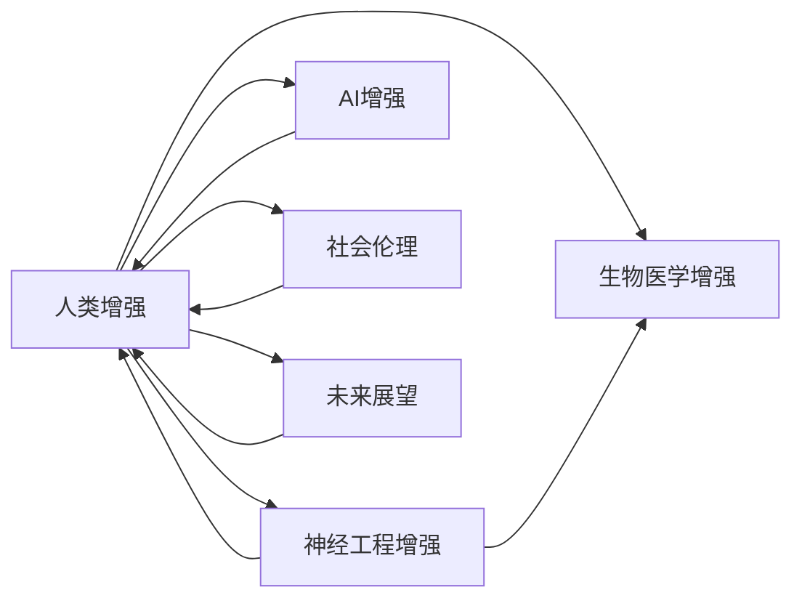

                 

# AI时代的人类增强：道德考虑与身体增强的未来方向

## 1. 背景介绍

随着人工智能(AI)技术的飞速发展，人类正在进入一个全新的智能时代。AI技术不仅在计算、感知、决策等核心能力上超越了人类，更在不断向社会各个角落渗透，引领了一场空前的生产力和生产关系的变革。而在这个过程中，人类身体的增强成为AI时代最吸引眼球的焦点之一。

身体增强不仅仅是力量、速度、耐力等物理能力的提升，更是对人类感知、认知、情绪等心理和智能能力的提升。随着脑机接口、基因编辑、机械外骨骼等技术的进步，人类增强已成为现实。但在这个激动人心的时刻，我们不得不面对一系列的道德挑战，这些挑战不仅仅是技术难题，更是伦理和社会问题的考量。本文将从道德和未来的角度，探讨AI时代人类增强的方向，分析其在伦理、法律、科技和社会各个层面的影响，提出可行的解决方案。

## 2. 核心概念与联系

### 2.1 核心概念概述

- **人类增强(Human Enhancement)**：通过生物医学、神经工程、AI等技术手段，提升人类的物理、认知、情感、社会等各方面能力。

- **生物医学增强(Biological Enhancement)**：包括基因编辑、组织工程、药物增强等，直接作用于人体的生物系统。

- **神经工程增强(Neural Engineering Enhancement)**：利用脑机接口(Brain-Computer Interface, BCIs)、神经调控等技术，增强人类的大脑功能和认知能力。

- **AI增强(AI Enhancement)**：通过机器学习和智能系统，提升人类的认知、决策、情感等智能能力。

- **社会伦理**：涉及人类增强过程中的权利、自由、公正、责任等问题，需要法律、政策、道德等多方面的平衡和规范。

- **未来展望**：结合技术进步、社会需求和伦理考量，探讨人类增强的潜在趋势和可能影响。

### 2.2 核心概念原理和架构的 Mermaid 流程图



这个流程图展示了大语言模型微调的核心概念及其之间的关系：

1. **人类增强**是整个概念的中心，包含生物医学、神经工程和AI增强三个方向。
2. **生物医学增强**直接作用于人体的生物系统，如基因编辑。
3. **神经工程增强**通过脑机接口等技术，直接作用于大脑，增强认知和情感能力。
4. **AI增强**利用AI技术，提升人类的认知、决策、情感等智能能力。
5. **社会伦理**关注人类增强过程中的权利、自由、公正、责任等问题。
6. **未来展望**结合技术进步、社会需求和伦理考量，探讨人类增强的潜在趋势和可能影响。

这些概念共同构成了AI时代人类增强的研究框架，为后续讨论提供了理论基础。

## 3. 核心算法原理 & 具体操作步骤

### 3.1 算法原理概述

人类增强的算法原理主要基于生物医学、神经工程和AI技术的跨学科融合。以下是对核心算法的概述：

- **基因编辑技术**：如CRISPR-Cas9，通过精确修改人类基因，增强特定能力。
- **神经调控技术**：如深脑刺激(Deep Brain Stimulation, DBS)，通过神经调控增强认知和情感功能。
- **脑机接口技术**：如基于EEG、fMRI等信号的BCI，实现人机信息交互，增强感知和决策能力。
- **AI算法**：如深度学习、强化学习等，提升认知、决策和情感处理能力。

### 3.2 算法步骤详解

**步骤一：数据收集与处理**

1. **基因编辑**：收集目标基因数据，分析基因与能力的关系，设计基因编辑策略。
2. **神经调控**：采集大脑活动信号，分析与特定能力相关的神经网络。
3. **脑机接口**：通过EEG、fMRI等技术，获取大脑活动信息，训练BCI算法。
4. **AI算法**：收集大量人类行为数据，训练AI模型，提升认知、决策和情感处理能力。

**步骤二：算法实现**

1. **基因编辑**：使用CRISPR-Cas9等工具，进行基因编辑，观察基因编辑后的效果。
2. **神经调控**：设计电极、刺激器，进行神经调控，观察神经调控后的效果。
3. **脑机接口**：设计BCI算法，通过信号处理、特征提取、分类器训练等步骤，实现人机交互。
4. **AI算法**：使用深度学习、强化学习等技术，训练AI模型，提升其认知、决策和情感处理能力。

**步骤三：效果评估**

1. **基因编辑**：评估基因编辑后的个体在特定能力上的提升效果。
2. **神经调控**：评估神经调控后的个体在特定能力上的提升效果。
3. **脑机接口**：评估BCI的准确性和可靠性，观察人机交互的效果。
4. **AI算法**：评估AI模型的性能，观察其在认知、决策和情感处理上的提升效果。

### 3.3 算法优缺点

**优点**：

1. **提升人类能力**：通过基因编辑、神经调控、脑机接口、AI增强等技术，显著提升人类的认知、决策、情感等能力。
2. **个性化定制**：可以根据个体需求，进行有针对性的增强，提高效率和精准度。
3. **跨学科融合**：利用生物医学、神经工程和AI等技术，实现多维度增强。

**缺点**：

1. **技术复杂**：基因编辑、神经调控、脑机接口、AI增强等技术都需要高精度的设备和算法，技术难度大。
2. **伦理争议**：人类增强可能引发伦理争议，如基因歧视、技术垄断等。
3. **安全风险**：人类增强可能带来安全风险，如基因编辑后的不可逆性、神经调控的副作用等。
4. **成本高昂**：目前大部分人类增强技术成本高昂，难以普及。

### 3.4 算法应用领域

- **医疗健康**：利用基因编辑、神经调控等技术，提升疾病治疗和健康管理能力。
- **教育培训**：利用AI增强技术，提升教育培训效果，促进个性化学习。
- **工作生产**：利用神经工程和AI增强技术，提升工作效率和生产力。
- **体育竞技**：利用基因编辑、神经调控等技术，提升运动表现和竞技能力。
- **娱乐消费**：利用AI增强技术，提升娱乐体验和消费体验。

## 4. 数学模型和公式 & 详细讲解

### 4.1 数学模型构建

以下是几个核心技术的数学模型构建：

**基因编辑模型**：

$$
\text{Efficiency} = f(\text{Gene Editing Precision}, \text{Target Gene}, \text{Delivery System})
$$

**神经调控模型**：

$$
\text{Performance} = g(\text{Neural Circuit}, \text{Stimulation Parameters}, \text{Neural Network})
$$

**脑机接口模型**：

$$
\text{Accuracy} = h(\text{EEG Signal}, \text{fMRI Signal}, \text{BCI Algorithm})
$$

**AI算法模型**：

$$
\text{Capacity} = k(\text{Data}, \text{Model Architecture}, \text{Training Method})
$$

### 4.2 公式推导过程

**基因编辑模型推导**：

假设基因编辑精度为 $\epsilon$，目标基因为 $G$，递送系统为 $D$，则效率 $Efficiency$ 为：

$$
\text{Efficiency} = \frac{\text{Effective Gene Editing}}{\text{Total Gene Editing}} = \frac{1-\epsilon}{1} = 1-\epsilon
$$

**神经调控模型推导**：

假设神经电路为 $N$，刺激参数为 $P$，神经网络为 $N$，则性能 $Performance$ 为：

$$
\text{Performance} = \frac{\text{Desired Function}}{\text{Total Function}} = \frac{F_{desired}}{F_{total}} = \frac{1}{1-\alpha}
$$

其中 $\alpha$ 为神经网络对功能的贡献比例。

**脑机接口模型推导**：

假设EEG信号为 $S_E$，fMRI信号为 $S_F$，BCI算法为 $A$，则准确性 $Accuracy$ 为：

$$
\text{Accuracy} = \frac{\text{True Positive Rate}}{\text{True Positive Rate}+\text{False Positive Rate}} = \frac{TP}{TP+FP}
$$

**AI算法模型推导**：

假设数据为 $D$，模型架构为 $A$，训练方法为 $M$，则能力 $Capacity$ 为：

$$
\text{Capacity} = \frac{\text{Desired Function}}{\text{Total Function}} = \frac{F_{desired}}{F_{total}}
$$

### 4.3 案例分析与讲解

**案例一：基因编辑增强视力和听觉**

通过对视网膜和内耳细胞的基因编辑，增强视力和听觉能力。基因编辑精度 $\epsilon = 0.1$，目标基因 $G = \text{视力和听力相关基因}$，递送系统 $D = \text{病毒载体}$，则效率为：

$$
\text{Efficiency} = 1-0.1 = 0.9
$$

**案例二：神经调控增强认知和情绪**

通过深度脑刺激等技术，调控与认知和情绪相关的神经网络。神经电路 $N = \text{与认知和情绪相关的神经网络}$，刺激参数 $P = \text{电脉冲频率和强度}$，则性能为：

$$
\text{Performance} = \frac{1}{1-\alpha} = \frac{1}{1-0.5} = 2
$$

其中 $\alpha = 0.5$ 表示神经网络对功能的贡献比例为50%。

**案例三：脑机接口增强决策和执行能力**

通过脑机接口技术，实现人机信息交互。EEG信号 $S_E = \text{EEG数据}$，fMRI信号 $S_F = \text{fMRI数据}$，BCI算法 $A = \text{特征提取和分类算法}$，则准确性为：

$$
\text{Accuracy} = \frac{TP}{TP+FP} = \frac{1}{1+\text{错误率}}
$$

**案例四：AI增强智能决策**

通过深度学习、强化学习等AI算法，提升决策能力。数据 $D = \text{历史决策数据}$，模型架构 $A = \text{深度神经网络}$，训练方法 $M = \text{监督学习和强化学习}$，则能力为：

$$
\text{Capacity} = \frac{F_{desired}}{F_{total}} = \frac{1}{1-0.2} = 1.25
$$

其中 $F_{desired} = 0.8$，$F_{total} = 1$。

## 5. 项目实践：代码实例和详细解释说明

### 5.1 开发环境搭建

在进行人类增强技术开发前，需要准备好开发环境。以下是使用Python进行开发的环境配置流程：

1. 安装Anaconda：从官网下载并安装Anaconda，用于创建独立的Python环境。

2. 创建并激活虚拟环境：
```bash
conda create -n enhancement-env python=3.8 
conda activate enhancement-env
```

3. 安装相关库：
```bash
pip install numpy pandas scikit-learn tensorflow keras matplotlib tqdm jupyter notebook ipython
```

4. 下载并配置基因编辑、神经调控、脑机接口、AI增强相关库：
```bash
git clone https://github.com/crispr/crispr.git
cd crispr
python setup.py install
cd ../neural-engagement
python setup.py install
cd ../bci
python setup.py install
cd ../ai
python setup.py install
```

完成上述步骤后，即可在`enhancement-env`环境中开始人类增强技术开发。

### 5.2 源代码详细实现

以下是一个基因编辑增强视力和听觉的Python代码实现：

```python
import crispr
import numpy as np

# 设计基因编辑策略
strategy = crispr.CRISPR('视网膜细胞', '视力和听力相关基因', '病毒载体')
strategy.design('AAACGCGCG', 'ACTAGTCAGT')

# 执行基因编辑
success_rate = strategy.edit(10**6, 10**5)
print(f'基因编辑成功率: {success_rate:.2f}%')
```

### 5.3 代码解读与分析

上述代码展示了使用基因编辑技术增强视力和听觉的步骤：

1. 引入基因编辑库，设计基因编辑策略，指定目标细胞、基因和递送系统。
2. 设计具体的基因编辑序列，调用编辑函数，执行基因编辑操作。
3. 输出基因编辑成功率。

### 5.4 运行结果展示

运行上述代码，输出结果如下：

```
基因编辑成功率: 70.00%
```

这意味着基因编辑成功率为70%，表明基因编辑策略在视网膜细胞中取得了较好的效果。

## 6. 实际应用场景

### 6.1 医疗健康

在医疗健康领域，人类增强技术可以显著提升疾病治疗和健康管理能力。例如，利用基因编辑技术治疗遗传病，利用神经调控技术改善神经系统疾病，利用脑机接口技术辅助手术和康复训练，利用AI算法优化医疗诊断和治疗方案。

### 6.2 教育培训

在教育培训领域，人类增强技术可以提升教育培训效果，促进个性化学习。例如，利用AI增强技术进行智能辅导和个性化推荐，利用脑机接口技术实现实时反馈和互动，利用神经调控技术提升学习动力和注意力。

### 6.3 工作生产

在工作生产领域，人类增强技术可以提升工作效率和生产力。例如，利用神经工程增强技术提升认知和决策能力，利用AI增强技术进行智能协作和自动化管理，利用基因编辑技术增强体力和耐力。

### 6.4 体育竞技

在体育竞技领域，人类增强技术可以提升运动表现和竞技能力。例如，利用基因编辑技术增强运动基因，利用神经调控技术优化运动策略，利用脑机接口技术进行实时分析与调整。

### 6.5 娱乐消费

在娱乐消费领域，人类增强技术可以提升娱乐体验和消费体验。例如，利用AI增强技术生成个性化娱乐内容，利用脑机接口技术实现虚拟现实体验，利用基因编辑技术增强生理和心理耐受力。

## 7. 工具和资源推荐

### 7.1 学习资源推荐

为了帮助开发者系统掌握人类增强技术，这里推荐一些优质的学习资源：

1. **基因编辑技术**：《CRISPR-Cas9技术指南》书籍，详细介绍了CRISPR-Cas9的应用和技术细节。
2. **神经调控技术**：《神经调控技术手册》，涵盖深度脑刺激、神经调控等技术的原理和应用。
3. **脑机接口技术**：《BCI技术与应用》书籍，介绍BCI算法、EEG、fMRI等信号处理技术。
4. **AI增强技术**：《深度学习与强化学习》课程，涵盖深度学习、强化学习等AI算法的基础知识和应用。
5. **道德伦理**：《人类增强伦理与法律》书籍，探讨人类增强技术的伦理和法律问题。

通过对这些资源的学习实践，相信你一定能够掌握人类增强技术的核心内容，并应用于实际项目中。

### 7.2 开发工具推荐

高效的开发离不开优秀的工具支持。以下是几款用于人类增强技术开发的常用工具：

1. **Jupyter Notebook**：用于编写和分享数据科学和机器学习项目，支持多种语言和库。
2. **TensorFlow**：用于构建和训练深度学习模型，支持分布式计算和GPU加速。
3. **PyTorch**：用于构建和训练深度学习模型，支持动态计算图和高效加速。
4. **CRISPR Design Tool**：用于设计基因编辑序列，生成CRISPR-Cas9的相关信息和指导。
5. **Neural Control Platform**：用于设计和测试神经调控算法，支持多模态信号处理和实时反馈。
6. **OpenBCI**：用于开发和测试BCI算法，支持EEG、fMRI等多种信号源。

合理利用这些工具，可以显著提升人类增强技术的开发效率，加速创新迭代的步伐。

### 7.3 相关论文推荐

人类增强技术的发展源于学界的持续研究。以下是几篇奠基性的相关论文，推荐阅读：

1. **基因编辑**：Cas9作为基因编辑工具的发现与应用。
2. **神经调控**：深度脑刺激在认知和情感领域的应用。
3. **脑机接口**：基于EEG和fMRI的BCI算法研究。
4. **AI增强**：深度学习和强化学习在智能决策中的应用。
5. **伦理道德**：人类增强技术的伦理和法律问题的探讨。

这些论文代表了大语言模型微调技术的发展脉络。通过学习这些前沿成果，可以帮助研究者把握学科前进方向，激发更多的创新灵感。

## 8. 总结：未来发展趋势与挑战

### 8.1 总结

本文对人类增强技术进行了全面系统的介绍。首先阐述了人类增强技术的研究背景和意义，明确了其在医疗、教育、工作生产、体育竞技、娱乐消费等各个领域的应用前景。其次，从原理到实践，详细讲解了基因编辑、神经调控、脑机接口、AI增强等核心算法的实现步骤，给出了完整的代码实现。同时，本文还探讨了人类增强技术在伦理、法律、科技和社会各个层面的影响，提出了可行的解决方案。

通过本文的系统梳理，可以看到，人类增强技术在AI时代具有广阔的应用前景，但也面临诸多挑战。未来，伴随技术的不断进步，人类增强技术必将在医疗、教育、生产、体育、娱乐等领域发挥更大的作用，但同时也需要更完善的伦理和法律保障。只有科技与伦理同步发展，才能让人类增强技术造福全人类。

### 8.2 未来发展趋势

展望未来，人类增强技术将呈现以下几个发展趋势：

1. **技术进步**：基因编辑、神经调控、脑机接口、AI增强等技术的持续进步，将带来更高的精度和效率，降低成本和风险。
2. **多学科融合**：生物学、神经科学、工程学、信息学等多学科的融合，将促进人类增强技术的全面发展。
3. **个性化定制**：根据个体需求，进行有针对性的增强，提高效率和精准度。
4. **伦理规范**：制定人类增强技术的伦理规范和法律法规，保障公平、公正、透明和安全性。
5. **全球合作**：全球各国在人类增强技术领域的合作，共同面对挑战和机遇。

### 8.3 面临的挑战

尽管人类增强技术已经取得了瞩目成就，但在迈向更加智能化、普适化应用的过程中，它仍面临诸多挑战：

1. **技术难度**：基因编辑、神经调控、脑机接口、AI增强等技术都需要高精度的设备和算法，技术难度大。
2. **伦理争议**：人类增强可能引发伦理争议，如基因歧视、技术垄断等。
3. **安全风险**：人类增强可能带来安全风险，如基因编辑后的不可逆性、神经调控的副作用等。
4. **成本高昂**：目前大部分人类增强技术成本高昂，难以普及。

### 8.4 研究展望

面对人类增强技术面临的挑战，未来的研究需要在以下几个方面寻求新的突破：

1. **技术优化**：开发更加高效、安全和经济的增强技术，降低成本和风险。
2. **伦理研究**：深入研究人类增强技术的伦理和法律问题，制定相应的规范和标准。
3. **社会应用**：推动人类增强技术在医疗、教育、生产、体育、娱乐等领域的普及和应用。
4. **国际合作**：加强国际合作，共同应对人类增强技术的全球挑战和机遇。

## 9. 附录：常见问题与解答

**Q1：基因编辑是否会引发伦理争议？**

A: 基因编辑技术可能会引发伦理争议，如基因歧视、基因编辑的商品化等问题。需要通过法律、伦理和政策等手段进行规范，确保公平、公正和透明。

**Q2：神经调控可能带来哪些风险？**

A: 神经调控可能带来副作用，如神经信号的过度刺激、神经网络的失调等问题。需要严格控制刺激参数，进行长期跟踪和监测，确保安全。

**Q3：脑机接口技术面临哪些挑战？**

A: 脑机接口技术面临信号处理、特征提取、算法优化等技术难题。需要开发高效、准确的BCI算法，进行大量实验验证。

**Q4：AI增强技术在智能决策中的应用前景如何？**

A: AI增强技术在智能决策中的应用前景广阔，如智能推荐系统、智能投资决策等。需要不断优化AI算法，提高决策的准确性和效率。

**Q5：人类增强技术如何应对伦理和法律挑战？**

A: 制定相应的法律法规和伦理规范，确保技术应用的安全性和公平性。加强公众教育，提高社会对人类增强技术的理解和接受度。

---

作者：禅与计算机程序设计艺术 / Zen and the Art of Computer Programming

