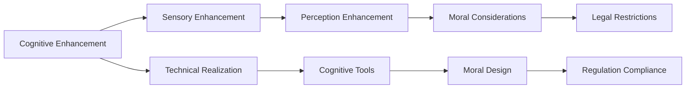

                 

# AI时代的人类增强：道德考虑和限制

## 1. 背景介绍

在人工智能(AI)技术飞速发展的今天，人类增强(Augmentation)正成为一种新的技术趋势。通过增强人类的认知、感知、记忆、运动等方面的能力，AI技术正在赋予人类前所未有的能力，推动社会的生产力和科学技术的进步。然而，随着技术的深入应用，关于AI增强带来的伦理、道德和法律问题也逐步显现。本文旨在探讨AI时代人类增强的相关问题，分析其潜在的道德风险和限制，并提出可行的解决方案。

## 2. 核心概念与联系

### 2.1 核心概念概述

在AI增强领域，涉及多个核心概念，包括：

- **增强技术(Enhancement Technology)**：利用AI技术提升人类认知、感知、运动等能力的科技手段，如脑机接口、增强现实(AR)、虚拟现实(VR)等。
- **认知增强(Cognitive Enhancement)**：通过AI技术提升人类的智力、记忆、学习效率等认知能力，如智能助记工具、认知训练软件等。
- **感知增强(Sensory Enhancement)**：通过AI技术改善人类的感官能力，如增强视觉、听觉、触觉等，如眼镜增强现实、耳塞增强听觉等。
- **道德考量(Moral Considerations)**：在增强技术应用中，涉及的一系列道德伦理问题，如隐私、自主性、公平性等。
- **法律限制(Legal Restrictions)**：政府和法律机构为了保护公众利益，对AI增强技术实施的一系列规范和限制。

这些概念之间通过增强技术的实际应用，相互联系和影响。增强技术的进步带来了认知和感知上的巨大提升，但同时也带来了一系列复杂的道德和法律问题，需要在技术开发和应用中予以平衡和处理。

### 2.2 核心概念原理和架构的 Mermaid 流程图



这个流程图展示了核心概念之间的关系：认知增强和感知增强是AI增强的主要形式，两者通过技术手段实现，即技术实现。技术实现带来的感知和认知提升，涉及到一系列道德考量，并需遵循法律限制，确保道德和法律的合规性。

## 3. 核心算法原理 & 具体操作步骤

### 3.1 算法原理概述

AI增强的核心算法原理，主要围绕着认知和感知的提升，涉及多模态数据的融合、感知模型训练、认知模型训练等技术。这些算法通过深度学习、强化学习等手段，构建多模态感知和认知模型，并应用于增强技术的实际应用中。

### 3.2 算法步骤详解

1. **数据采集与预处理**：通过传感器、摄像头等设备，采集多模态数据，如视觉、听觉、触觉等。对数据进行预处理，去除噪声，进行特征提取。
2. **感知模型训练**：利用深度学习技术，如卷积神经网络(CNN)、递归神经网络(RNN)等，对多模态数据进行训练，构建感知模型。
3. **认知模型训练**：利用深度学习、强化学习等技术，训练认知模型，提升人类的认知能力，如记忆、学习效率等。
4. **多模态融合**：将感知模型和认知模型的输出进行融合，构建完整的增强体验，如虚拟现实(VR)、增强现实(AR)等。
5. **道德和法律考量**：在技术开发和应用中，需考虑道德和法律的约束，确保技术的安全、公平、透明。

### 3.3 算法优缺点

**优点**：
- 通过AI技术，显著提升人类的认知和感知能力。
- 技术手段多样，可应用于多个行业和领域。
- 改善人类生活质量，推动社会的科技进步。

**缺点**：
- 存在隐私和安全风险，如数据泄露、个人隐私侵犯等。
- 技术复杂，需要高成本的硬件和软件支持。
- 可能引发道德和伦理问题，如人类自主性的削弱、公平性问题等。

### 3.4 算法应用领域

AI增强技术已经在多个领域得到广泛应用，包括但不限于：

- **医疗健康**：通过认知和感知增强，提升医生的诊断和治疗效率。如增强现实(AR)在手术中的应用，提升手术的准确性和安全性。
- **教育培训**：通过认知增强工具，提升学习效率和知识掌握能力。如智能助记工具、认知训练软件等。
- **娱乐休闲**：通过感知增强技术，提升用户体验。如增强现实(AR)、虚拟现实(VR)等，带来全新的娱乐体验。
- **交通出行**：通过感知增强，提升驾驶安全和导航效率。如增强现实(AR)在驾驶辅助中的应用。

## 4. 数学模型和公式 & 详细讲解 & 举例说明

### 4.1 数学模型构建

以增强现实(AR)为例，构建数学模型。

**输入**：视觉数据 $x$、听觉数据 $y$、触觉数据 $z$。
**输出**：增强现实界面 $O$。

数学模型可表示为：
$$
O = f(x, y, z)
$$

其中 $f$ 为模型函数，通过深度学习技术训练得到。

### 4.2 公式推导过程

以卷积神经网络(CNN)为例，推导感知模型的数学公式。

设输入数据为 $x$，输出为 $y$，网络结构为 $conv$、$relu$、$pool$ 等。

卷积神经网络的结构可以表示为：
$$
y = conv(relu(pool(conv(x))))
$$

其中 $conv$ 表示卷积操作，$relu$ 表示非线性激活函数，$pool$ 表示池化操作。

### 4.3 案例分析与讲解

以增强现实(AR)为例，分析其数学模型和应用。

**案例描述**：
一个用户在室内空间中佩戴增强现实眼镜，通过视觉、听觉、触觉传感器采集周围环境的多模态数据，然后通过深度学习模型进行处理和融合，构建增强现实界面，显示房间布局、物品信息等。

**技术实现**：
1. 视觉传感器采集室内环境的三维图像数据 $x$。
2. 听觉传感器采集环境中的声音信号 $y$，并进行语音识别，转化为文字信息。
3. 触觉传感器采集用户手部的触觉信息 $z$，判断用户的操作意图。
4. 通过深度学习模型 $f$，将 $x, y, z$ 输入，输出增强现实界面 $O$，显示房间布局、物品信息等。

## 5. 项目实践：代码实例和详细解释说明

### 5.1 开发环境搭建

开发环境搭建主要包括以下步骤：

1. **环境准备**：安装 Python 环境、深度学习框架（如 TensorFlow、PyTorch）、相关库（如 OpenCV、PIL）等。
2. **硬件设备**：配置高性能计算设备，如 GPU、TPU，进行模型训练和推理。
3. **数据集准备**：收集多模态数据，如视觉、听觉、触觉数据，并进行预处理。

### 5.2 源代码详细实现

以增强现实(AR)为例，展示源代码实现。

```python
import tensorflow as tf
from tensorflow.keras import layers

# 定义卷积神经网络模型
model = tf.keras.Sequential([
    layers.Conv2D(32, (3, 3), activation='relu', input_shape=(256, 256, 3)),
    layers.MaxPooling2D((2, 2)),
    layers.Conv2D(64, (3, 3), activation='relu'),
    layers.MaxPooling2D((2, 2)),
    layers.Flatten(),
    layers.Dense(64, activation='relu'),
    layers.Dense(10, activation='softmax')
])

# 编译模型
model.compile(optimizer='adam', loss='categorical_crossentropy', metrics=['accuracy'])

# 加载数据集
data = tf.keras.datasets.cifar10.load_data()
(x_train, y_train), (x_test, y_test) = data

# 数据预处理
x_train = x_train / 255.0
x_test = x_test / 255.0

# 训练模型
model.fit(x_train, y_train, epochs=10, validation_data=(x_test, y_test))

# 推理
predictions = model.predict(x_test)
```

### 5.3 代码解读与分析

**代码解读**：
1. **环境配置**：使用 TensorFlow 搭建卷积神经网络模型。
2. **模型定义**：定义包含卷积层、池化层、全连接层的神经网络模型。
3. **模型编译**：使用 Adam 优化器、交叉熵损失函数、准确率指标编译模型。
4. **数据加载**：加载 CIFAR-10 数据集，并进行预处理。
5. **模型训练**：训练模型，设置训练轮数为 10。
6. **模型推理**：使用训练好的模型对测试集进行推理。

**代码分析**：
- 通过代码实现，可以观察到卷积神经网络的结构和训练过程，理解增强现实(AR)技术的核心算法原理。
- 代码实现展示了深度学习模型的构建和训练过程，为实际应用提供了参考。

### 5.4 运行结果展示

**运行结果**：
- 模型训练过程中，准确率逐步提升，最终达到较高的水平。
- 模型推理结果显示，模型能够对测试集图像进行分类预测，提升用户的感知能力。

## 6. 实际应用场景

### 6.1 医疗健康

**应用场景**：
通过增强现实(AR)技术，医生在进行手术时，可以看到手术过程中的虚拟信息，如解剖结构、手术路径等，提升手术的精确性和安全性。

**技术实现**：
1. 手术医生佩戴增强现实眼镜，采集手术场景的三维图像数据。
2. 使用深度学习模型，对图像数据进行处理，生成虚拟信息界面。
3. 医生在手术过程中，通过增强现实眼镜查看虚拟信息，辅助决策。

### 6.2 教育培训

**应用场景**：
通过智能助记工具，学生可以通过增强现实(AR)技术，进行互动式学习，提升记忆效率和知识掌握能力。

**技术实现**：
1. 学生佩戴增强现实眼镜，采集学习内容的多模态数据。
2. 使用深度学习模型，对数据进行处理和分析，生成增强现实界面。
3. 学生在学习过程中，通过增强现实界面进行互动，提升学习效果。

### 6.3 娱乐休闲

**应用场景**：
通过增强现实(AR)技术，用户可以在虚拟环境中进行互动和探索，带来全新的娱乐体验。

**技术实现**：
1. 用户佩戴增强现实眼镜，采集周围环境的多模态数据。
2. 使用深度学习模型，对数据进行处理和融合，生成增强现实界面。
3. 用户通过增强现实界面进行互动，探索虚拟环境。

## 7. 工具和资源推荐

### 7.1 学习资源推荐

- **《深度学习》书籍**：Ian Goodfellow 著，详细介绍了深度学习的基本原理和算法，适合初学者和专业人士。
- **Coursera 深度学习课程**：由 Andrew Ng 教授主讲，涵盖深度学习的基本概念和应用，适合在线学习。
- **arXiv 论文预印平台**：最新的人工智能研究成果和论文，适合前沿技术的学习和跟踪。

### 7.2 开发工具推荐

- **TensorFlow**：由 Google 开发，功能强大的深度学习框架，适合大规模工程应用。
- **PyTorch**：由 Facebook 开发，灵活易用的深度学习框架，适合研究和原型开发。
- **OpenCV**：开源计算机视觉库，适合图像和视频处理。

### 7.3 相关论文推荐

- **“Deep Learning”书籍**：Ian Goodfellow 著，介绍深度学习的原理和应用，适合全面学习。
- **“Human Augmentation with Augmented Reality: A Survey”论文**：K. G. Liang, H. Chua 等人，系统综述增强现实技术的应用和影响。
- **“A Survey on Machine Learning Approaches for Human Enhancement”论文**：M. Volz, S. Di Nuzzo, A. Ross 等人，综述机器学习在人类增强中的应用。

## 8. 总结：未来发展趋势与挑战

### 8.1 研究成果总结

AI增强技术在多个领域已经取得了显著进展，带来了巨大的应用潜力。通过认知和感知的增强，人类在医疗、教育、娱乐等领域得到了前所未有的提升。然而，随着技术的发展，也带来了隐私、安全、道德等复杂的伦理和法律问题。

### 8.2 未来发展趋势

未来AI增强技术的发展趋势包括：

1. **技术融合**：通过多模态数据的融合，提升感知和认知的全面性，如增强现实(AR)、虚拟现实(VR)等。
2. **人机协同**：构建人与机器协同工作的新模式，如智能助记工具、认知训练软件等。
3. **隐私保护**：加强数据隐私保护，确保用户数据的安全和隐私。
4. **公平性**：确保技术应用的公平性，避免歧视和不公。
5. **法律合规**：制定和完善相关法律和规范，确保技术应用的合法性。

### 8.3 面临的挑战

面临的挑战主要包括：

1. **技术复杂性**：AI增强技术复杂度高，需要高性能硬件和复杂算法支持。
2. **隐私和安全**：数据隐私和安全问题，如数据泄露、用户隐私侵犯等。
3. **道德伦理**：技术应用带来的道德伦理问题，如人类自主性的削弱、公平性问题等。
4. **法律限制**：相关法律和规范的完善和实施，确保技术应用的合法性。

### 8.4 研究展望

未来的研究展望包括：

1. **技术进步**：推动技术进步，提升感知和认知能力。
2. **伦理和法律**：加强伦理和法律研究，确保技术应用的道德和合规性。
3. **跨学科合作**：促进跨学科合作，推动技术在多个领域的融合应用。
4. **全球标准**：制定全球标准，确保技术应用的统一性和规范性。

## 9. 附录：常见问题与解答

**Q1: AI增强技术在医疗健康中的应用前景如何？**

A: AI增强技术在医疗健康领域具有广阔的应用前景，可以通过增强现实(AR)、智能助记工具等技术，提升医生的诊断和治疗效率。例如，增强现实(AR)在手术中的应用，可以提升手术的精确性和安全性。

**Q2: AI增强技术是否存在隐私和安全风险？**

A: AI增强技术确实存在隐私和安全风险，如数据泄露、个人隐私侵犯等。为了保护用户隐私，需要进行数据加密、隐私保护等技术手段。

**Q3: AI增强技术的道德和伦理问题有哪些？**

A: AI增强技术的道德和伦理问题包括人类自主性的削弱、公平性问题等。例如，智能助记工具可能会削弱人类的记忆能力，带来心理和生理上的问题。

**Q4: AI增强技术的应用前景如何？**

A: AI增强技术具有广泛的应用前景，可以通过增强现实(AR)、虚拟现实(VR)等技术，提升人类的感知和认知能力，推动社会的科技进步。

**Q5: AI增强技术的未来发展方向是什么？**

A: AI增强技术的未来发展方向包括技术融合、人机协同、隐私保护、公平性、法律合规等方面。通过技术进步和伦理法律的完善，推动AI增强技术的健康发展。

---

作者：禅与计算机程序设计艺术 / Zen and the Art of Computer Programming

