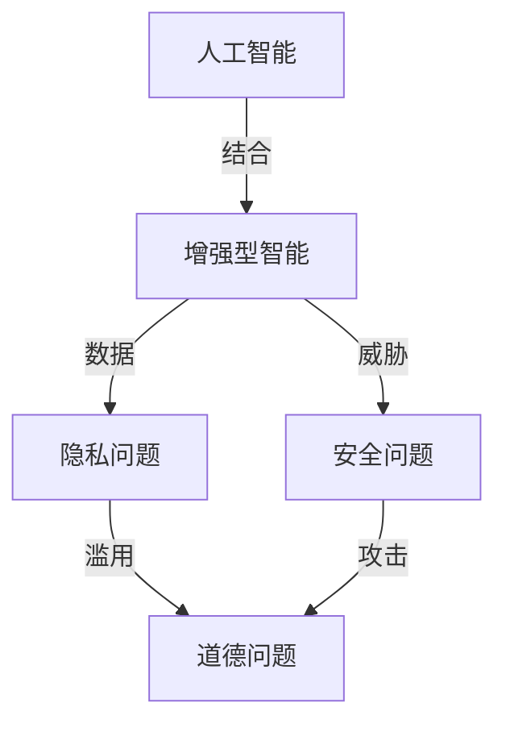

                 

# AI时代的人类增强：道德、隐私和安全挑战

## 1. 背景介绍

在AI技术快速发展的今天，人工智能正逐步渗透到各个领域，从医疗、教育到金融、制造，几乎无所不在。人工智能为人类提供了前所未有的增强手段，但也带来了新的道德、隐私和安全挑战。文章将从这些维度出发，深入探讨AI时代的人类增强，分析其潜力和风险，并提出相应的策略与建议。

## 2. 核心概念与联系

### 2.1 核心概念概述

**人工智能（Artificial Intelligence, AI）**：指利用计算机技术和算法，使机器能够模拟人类智能行为，如学习、推理、感知等。

**增强型智能（Augmented Intelligence, AI）**：结合人类专家知识和人工智能技术，旨在提升人类决策、学习和创造能力的智能系统。

**道德问题（Ethical Issues）**：指在AI应用中，可能出现的道德困境和伦理争议，如自动化伦理、算法偏见等。

**隐私问题（Privacy Issues）**：指在AI应用中，个人数据被不当收集、存储或使用，导致隐私泄露和滥用。

**安全问题（Security Issues）**：指在AI应用中，可能面临的威胁和攻击，如数据泄露、恶意软件等。

这些概念之间具有密切联系，互相影响。例如，道德问题可能影响隐私保护和数据安全，而隐私和安全问题也可能引发伦理争议和道德困境。

### 2.2 核心概念原理和架构的 Mermaid 流程图



这个流程图展示了人工智能如何通过增强型智能提升人类能力，同时又可能引发道德、隐私和安全问题。

## 3. 核心算法原理 & 具体操作步骤

### 3.1 算法原理概述

增强型智能通常基于人工智能的算法和模型。这些算法和模型通过学习历史数据和模式，能够在特定领域内提供辅助决策、预测分析和自动化处理等功能。

### 3.2 算法步骤详解

1. **数据收集与预处理**：收集领域相关的数据，并对数据进行清洗、标注和归一化处理。
2. **模型训练与调优**：选择适合的机器学习算法，如决策树、神经网络等，并对其进行训练和调优。
3. **集成与部署**：将训练好的模型集成到特定的应用场景中，并进行部署和监控。
4. **反馈与迭代**：根据实际应用反馈，对模型进行优化和迭代，提升其性能和鲁棒性。

### 3.3 算法优缺点

**优点**：
- 提升决策效率和准确性
- 减少人工干预和错误
- 拓展人类认知和技能边界

**缺点**：
- 可能引入算法偏见和歧视
- 数据隐私和安全风险
- 需要大量数据和计算资源

### 3.4 算法应用领域

增强型智能广泛应用于医疗、金融、制造、教育等领域，如智能诊断、金融风控、智能制造、个性化学习等。

## 4. 数学模型和公式 & 详细讲解 & 举例说明

### 4.1 数学模型构建

以决策树算法为例，构建一个简单的数学模型：

$$
\mathrm{Decision} = \begin{cases}
\text{Child Node 1} & \text{if } \text{Feature } x_i < \text{Threshold } t \\
\text{Child Node 2} & \text{if } \text{Feature } x_i \geq \text{Threshold } t \\
\end{cases}
$$

其中，$x_i$ 为输入特征，$n$ 为节点数，$t$ 为特征阈值。

### 4.2 公式推导过程

以一个简单的决策树为例，推导决策过程：

1. 选择最佳特征 $x_i$：计算每个特征的基尼指数或信息增益，选择最优特征。
2. 设定阈值 $t$：根据最优特征，设定划分阈值，将数据划分为两个子集。
3. 递归划分：对子集继续应用上述步骤，直到满足停止条件。

### 4.3 案例分析与讲解

在医疗领域，决策树算法可以用于诊断系统的构建。通过收集患者的症状数据，构建决策树模型，可以帮助医生快速诊断疾病，提升诊断效率和准确性。

## 5. 项目实践：代码实例和详细解释说明

### 5.1 开发环境搭建

1. 安装Python和必要的库，如Pandas、NumPy、Scikit-Learn等。
2. 准备数据集，并进行预处理和标注。
3. 搭建开发环境，包括虚拟环境和依赖包管理。

### 5.2 源代码详细实现

以下是一个简单的决策树实现代码：

```python
from sklearn.tree import DecisionTreeClassifier
from sklearn.model_selection import train_test_split
from sklearn.metrics import accuracy_score

# 准备数据
X = df.drop('target', axis=1)
y = df['target']
X_train, X_test, y_train, y_test = train_test_split(X, y, test_size=0.2)

# 构建模型
model = DecisionTreeClassifier()
model.fit(X_train, y_train)

# 预测和评估
y_pred = model.predict(X_test)
print("Accuracy: ", accuracy_score(y_test, y_pred))
```

### 5.3 代码解读与分析

**数据准备**：使用Pandas库对数据集进行处理，去除无用特征，进行特征编码和归一化。

**模型构建**：使用Scikit-Learn库中的DecisionTreeClassifier类构建决策树模型。

**训练与评估**：使用train_test_split函数将数据集划分为训练集和测试集，使用fit方法训练模型，使用predict方法进行预测，并使用accuracy_score函数评估模型性能。

### 5.4 运行结果展示

运行代码后，输出准确率等评估指标，用于验证模型的性能。

## 6. 实际应用场景

### 6.1 医疗诊断

在医疗诊断中，AI可以辅助医生进行疾病诊断和治疗方案选择。例如，基于决策树的算法可以分析患者的症状、检查结果等数据，给出疾病诊断建议。这不仅提高了诊断效率，还能减少误诊和漏诊。

### 6.2 金融风控

在金融领域，AI可以通过分析客户的交易行为和信用记录，预测其违约风险，帮助金融机构进行信用评估和风险控制。例如，基于决策树的算法可以构建信用评分模型，对客户进行风险分层，优化贷款审批流程。

### 6.3 智能制造

在制造业中，AI可以用于生产过程的优化和故障预测。例如，基于决策树的算法可以分析设备运行数据，预测设备故障，提前进行维护和检修，减少停机时间和生产成本。

## 7. 工具和资源推荐

### 7.1 学习资源推荐

1. 《Python机器学习》（本书系统介绍了机器学习算法和实现）
2. Coursera上的《机器学习》课程（由斯坦福大学教授Andrew Ng主讲）
3. Kaggle数据科学竞赛（提供大量数据集和竞赛，可以实践和提升技能）

### 7.2 开发工具推荐

1. PyTorch：深度学习框架，灵活高效
2. TensorFlow：Google开发的深度学习框架，功能丰富
3. Jupyter Notebook：交互式编程环境，便于调试和展示

### 7.3 相关论文推荐

1. "Adversarial Examples in Deep Learning"（2014年IEEE会议论文）
2. "Deep Learning in Natural Language Processing"（2018年NIPS会议论文）
3. "Ethical Considerations in the Development and Deployment of AI Systems"（2019年IEEE会议论文）

## 8. 总结：未来发展趋势与挑战

### 8.1 研究成果总结

AI和增强型智能在各个领域展现了巨大的潜力，提高了效率和决策质量。但也面临着算法偏见、数据隐私和安全等问题。

### 8.2 未来发展趋势

1. 算法和模型的不断优化和改进
2. 人工智能与人类专家知识的结合
3. 增强型智能系统的普及和应用

### 8.3 面临的挑战

1. 算法偏见和歧视问题
2. 数据隐私和安全问题
3. 算法的透明性和可解释性问题

### 8.4 研究展望

未来的研究将更多关注如何平衡AI的优势与风险，提升系统的透明度和可解释性，确保数据安全和隐私保护。

## 9. 附录：常见问题与解答

**Q1：AI技术会取代人类吗？**

A: AI技术的目标是增强人类能力，而不是取代人类。在某些特定领域，AI可以辅助人类提高效率和决策质量，但无法完全取代人类。

**Q2：AI技术存在哪些道德风险？**

A: AI技术可能引入算法偏见、自动化伦理等问题，需要在使用过程中进行监控和纠正。

**Q3：如何保护数据隐私？**

A: 使用数据匿名化、加密等技术，限制数据的访问和使用权限，确保数据隐私保护。

**Q4：AI系统是否需要透明性和可解释性？**

A: 是的，AI系统的透明性和可解释性对于确保其决策的正确性和公正性非常重要。

**Q5：AI系统的安全性如何保障？**

A: 通过加密、认证等技术手段，确保数据传输和存储的安全性，防止攻击和恶意使用。

作者：禅与计算机程序设计艺术 / Zen and the Art of Computer Programming

