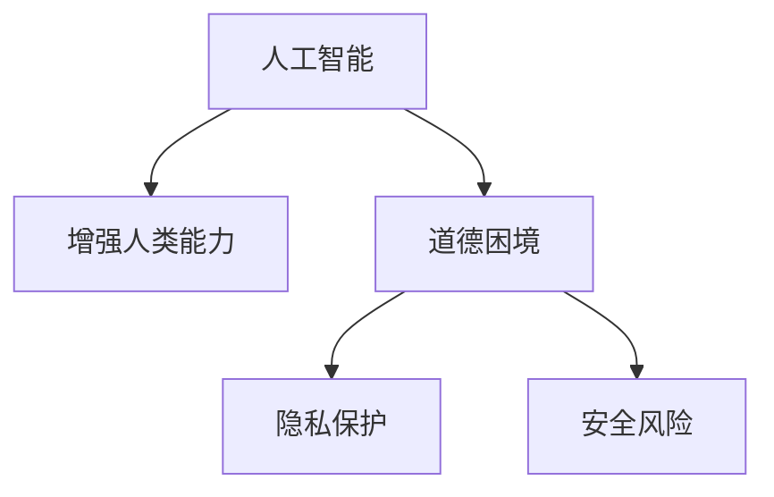

                 

# AI时代的人类增强：道德、隐私和安全挑战

> 关键词：人工智能,增强人类能力,道德困境,隐私保护,安全风险

## 1. 背景介绍

随着人工智能技术的飞速发展，越来越多的AI系统开始深入人类社会的各个方面，从医疗、教育、金融到娱乐，AI的应用范围几乎无所不包。AI技术的普及带来了前所未有的效率和便利，也开辟了人类能力的全新可能。然而，随着AI系统能力的不断增强，随之而来的道德、隐私和安全挑战也越来越严峻。

在医疗领域，AI医生助手可以高效地分析医学影像，辅助诊断疾病，但如何在保证诊断准确性的同时，避免偏见和误诊？在金融领域，AI算法能够精确地预测市场走势，但这些算法的决策过程是否透明、公正？在娱乐领域，AI创作的内容充满创意，但如何防止内容传播过程中侵害作者的知识产权？这些问题不仅关系到技术本身，更触及了伦理、法律和社会价值观的边界。

本文将从AI技术对人类能力的增强、面临的道德、隐私和安全挑战，以及未来应对策略三个方面，探讨AI时代的技术与人性交汇下的困境与出路。

## 2. 核心概念与联系

### 2.1 核心概念概述

为更好地理解AI时代人类增强的道德、隐私和安全挑战，本节将介绍几个密切相关的核心概念：

- 人工智能(AI)：指通过计算机程序模拟人脑智能的科技。包括机器学习、深度学习、自然语言处理等子领域。
- 增强人类能力(Augmentation of Human Capabilities)：通过AI技术提升人类在医疗、教育、工作等领域的效率和能力。
- 道德困境(Ethical Dilemmas)：指在AI应用过程中，技术与人性、伦理之间的冲突与抉择。
- 隐私保护(Privacy Protection)：保护个人信息不被滥用，确保数据使用符合伦理和法律规范。
- 安全风险(Security Risks)：指AI系统可能带来的网络攻击、数据泄露等安全问题。

这些核心概念之间的逻辑关系可以通过以下Mermaid流程图来展示：



这个流程图展示了大语言模型的核心概念及其之间的关系：

1. 人工智能通过技术手段提升人类能力。
2. 增强人类能力可能导致道德困境，引发技术伦理问题。
3. 增强能力的同时，需要重视隐私保护和防范安全风险。

## 3. 核心算法原理 & 具体操作步骤
### 3.1 算法原理概述

AI技术的核心在于通过算法模拟人脑的决策过程，实现对数据的自动分析和处理。其中，机器学习、深度学习等技术是实现这一目标的重要工具。AI算法通过学习大量数据，发现数据中的规律和模式，从而做出预测和决策。

以深度学习为例，其基本原理是通过构建多层神经网络，对输入数据进行特征提取和处理，再通过反向传播算法不断调整网络参数，优化模型的预测能力。深度学习模型包括卷积神经网络(CNN)、循环神经网络(RNN)、生成对抗网络(GAN)等，广泛应用于图像识别、语音识别、自然语言处理等领域。

### 3.2 算法步骤详解

AI算法在实际应用中的操作流程通常包括以下几个关键步骤：

**Step 1: 数据收集与预处理**
- 收集相关的数据集，确保数据的多样性和代表性。
- 对数据进行清洗和标注，去除噪声和错误。
- 进行数据增强，如数据扩充、转换等，提高数据的多样性。

**Step 2: 模型选择与训练**
- 根据任务需求选择合适的模型架构和参数。
- 使用大量标注数据对模型进行训练，通过反向传播算法调整参数。
- 应用正则化技术，防止过拟合。

**Step 3: 模型评估与优化**
- 在测试集上对训练好的模型进行评估，计算模型性能指标。
- 根据评估结果，调整模型参数或重新训练，优化模型性能。

**Step 4: 部署与应用**
- 将优化后的模型部署到实际应用场景中，进行实时推理。
- 根据反馈数据，不断迭代模型，提高模型适应性。

### 3.3 算法优缺点

AI算法在提升人类能力的同时，也存在一些问题和挑战：

**优点**：
1. 效率高：AI算法能够快速处理大量数据，自动化决策，显著提高工作效率。
2. 精度高：深度学习等算法在处理复杂问题时，精度往往优于人类。
3. 可扩展性好：AI系统可以轻松扩展，适用于各种规模的任务。

**缺点**：
1. 可解释性差：AI模型的决策过程通常是"黑盒"，难以解释和理解。
2. 依赖数据：AI算法的性能依赖于数据的丰富性和质量，缺乏数据的AI系统往往表现不佳。
3. 可能存在偏见：AI模型可能学习到数据中的偏见，导致决策不公正。
4. 隐私风险：AI系统在数据处理过程中可能泄露用户隐私，引发隐私问题。

## 4. 数学模型和公式 & 详细讲解 & 举例说明
### 4.1 数学模型构建

以深度学习模型为例，其核心是一个多层神经网络，由多个隐藏层和输出层组成。模型的目标是通过训练数据，学习输入和输出之间的映射关系，从而实现预测或分类。

假设输入数据为 $x$，输出数据为 $y$，模型参数为 $\theta$，则模型的输出可以表示为：

$$y = f_{\theta}(x)$$

其中 $f_{\theta}$ 为模型函数，通常为非线性函数，如 sigmoid、ReLU 等。

模型的目标是最小化预测输出与真实输出之间的误差，常用的损失函数包括均方误差(MSE)、交叉熵损失(Cross-Entropy Loss)等。以交叉熵损失为例，其公式如下：

$$\mathcal{L} = -\frac{1}{N}\sum_{i=1}^N \sum_{j=1}^C y_{ij}\log(p_{ij}) + (1-y_{ij})\log(1-p_{ij})$$

其中 $y_{ij}$ 为真实标签，$p_{ij}$ 为模型预测的概率，$N$ 为样本数，$C$ 为分类数。

### 4.2 公式推导过程

在深度学习模型中，前向传播和反向传播是两个关键步骤。前向传播是将输入数据通过多层神经网络，得到最终的预测输出；反向传播则是计算预测输出与真实输出之间的误差，并根据误差调整模型参数，以优化模型的预测能力。

以交叉熵损失为例，其前向传播过程如下：

1. 输入数据 $x$ 通过多个隐藏层，得到最终的预测输出 $p$。
2. 计算每个样本的损失函数 $\mathcal{L}$。
3. 对所有样本的损失函数求平均值，得到总损失函数 $\mathcal{L}$。

反向传播过程如下：

1. 计算损失函数 $\mathcal{L}$ 对每个参数的梯度 $\nabla_{\theta}\mathcal{L}$。
2. 根据梯度下降算法，更新模型参数 $\theta$。

### 4.3 案例分析与讲解

以图像识别为例，假设有一个识别猫和狗的深度学习模型，其前向传播和反向传播过程如下：

1. 输入一张猫的图片，通过多个卷积层和池化层，得到特征图。
2. 通过全连接层，将特征图转换为两个类别的概率分布。
3. 计算交叉熵损失。
4. 通过反向传播算法，计算每个参数的梯度，并更新模型参数。

这个过程中，模型通过学习大量的猫和狗的图片，识别出猫和狗的特征，从而实现分类任务。通过不断迭代优化，模型的识别准确率逐步提高，最终可以用于实际的图像识别应用。

## 5. 项目实践：代码实例和详细解释说明
### 5.1 开发环境搭建

在进行AI项目实践前，我们需要准备好开发环境。以下是使用Python进行TensorFlow开发的环境配置流程：

1. 安装Anaconda：从官网下载并安装Anaconda，用于创建独立的Python环境。

2. 创建并激活虚拟环境：
```bash
conda create -n tf-env python=3.8 
conda activate tf-env
```

3. 安装TensorFlow：根据CUDA版本，从官网获取对应的安装命令。例如：
```bash
pip install tensorflow==2.6.0
```

4. 安装各类工具包：
```bash
pip install numpy pandas scikit-learn matplotlib tqdm jupyter notebook ipython
```

完成上述步骤后，即可在`tf-env`环境中开始AI项目实践。

### 5.2 源代码详细实现

这里我们以图像识别为例，给出使用TensorFlow实现图像分类任务的程序代码。

首先，定义图像数据预处理函数：

```python
import tensorflow as tf
from tensorflow.keras.preprocessing.image import ImageDataGenerator

def preprocess_images(x_train, x_test):
    datagen = ImageDataGenerator(rescale=1./255,
                                shear_range=0.2,
                                zoom_range=0.2,
                                horizontal_flip=True)
    train_generator = datagen.flow(x_train, y_train, batch_size=32)
    test_generator = datagen.flow(x_test, y_test, batch_size=32)
    
    return train_generator, test_generator
```

然后，定义模型和优化器：

```python
from tensorflow.keras.models import Sequential
from tensorflow.keras.layers import Conv2D, MaxPooling2D, Flatten, Dense

model = Sequential([
    Conv2D(32, (3,3), activation='relu', input_shape=(64,64,3)),
    MaxPooling2D((2,2)),
    Conv2D(64, (3,3), activation='relu'),
    MaxPooling2D((2,2)),
    Flatten(),
    Dense(64, activation='relu'),
    Dense(2, activation='softmax')
])

optimizer = tf.keras.optimizers.Adam(lr=0.001)
```

接着，定义训练和评估函数：

```python
from tensorflow.keras import metrics

def train_epoch(model, train_generator, optimizer):
    model.compile(optimizer=optimizer,
                  loss='sparse_categorical_crossentropy',
                  metrics=[metrics.categorical_accuracy])
    
    model.fit(train_generator,
              steps_per_epoch=len(train_generator),
              epochs=50,
              validation_data=test_generator,
              validation_steps=len(test_generator))
    
    return model

def evaluate(model, test_generator):
    model.evaluate(test_generator, steps=len(test_generator))
```

最后，启动训练流程并在测试集上评估：

```python
x_train, x_test, y_train, y_test = load_data()
train_generator, test_generator = preprocess_images(x_train, x_test)
model = train_epoch(model, train_generator, optimizer)
evaluate(model, test_generator)
```

以上就是使用TensorFlow对图像分类任务进行训练和评估的完整代码实现。可以看到，TensorFlow提供了丰富的API，可以便捷地实现各种机器学习任务。

### 5.3 代码解读与分析

让我们再详细解读一下关键代码的实现细节：

**preprocess_images函数**：
- 定义了一个ImageDataGenerator，用于对输入数据进行预处理，包括数据增强、归一化等操作。
- 使用生成器生成训练集和测试集的批次数据。

**模型定义和优化器选择**：
- 定义了一个包含多个卷积层和全连接层的深度学习模型，用于图像分类任务。
- 选择了Adam优化器，并设置了学习率。

**训练和评估函数**：
- 使用模型.compile方法设置模型的优化器、损失函数和评估指标。
- 调用模型.fit方法进行训练，指定训练轮数和批次大小。
- 在测试集上评估模型性能，输出分类准确率。

**训练流程**：
- 加载训练集和测试集数据，并进行预处理。
- 定义和编译模型，选择合适的优化器。
- 调用模型.fit方法进行训练，不断迭代更新模型参数。
- 在测试集上评估模型，输出分类准确率。

可以看到，TensorFlow的API设计简洁高效，使用起来非常直观，能够显著提高开发效率。

## 6. 实际应用场景
### 6.1 医疗影像分析

AI在医疗领域的应用已经非常广泛，其中最典型的是医疗影像分析。AI可以通过分析大量的医疗影像数据，帮助医生进行疾病诊断和预测。

以肺结节检测为例，AI系统可以通过分析肺部CT扫描图像，自动识别出肺结节，并标注位置和大小。医生可以参考AI的标注结果，进一步确认诊断，提高诊疗效率和准确性。

在实践中，通常采用标注好的医疗影像数据，通过深度学习模型进行训练和微调，从而实现高精度的肺结节检测。AI系统在处理大量的影像数据时，可以大幅减少医生的工作负担，提升诊断的准确性和效率。

### 6.2 金融风险管理

AI在金融领域的应用也非常广泛，其中最典型的应用是风险管理。AI可以通过分析大量的金融数据，预测市场走势，识别潜在风险，提供风险管理策略。

以信用评估为例，AI系统可以通过分析个人的贷款记录、信用历史等数据，预测其信用风险，提供个性化的贷款审批方案。金融机构可以根据AI系统的预测结果，优化贷款审批流程，降低坏账率。

在实践中，通常采用标注好的金融数据，通过深度学习模型进行训练和微调，从而实现高精度的信用评估。AI系统在处理大量的金融数据时，可以大幅提高风险管理的效率和准确性。

### 6.3 智能推荐系统

AI在推荐系统中的应用也非常广泛，其中最典型的是个性化推荐。AI可以通过分析用户的浏览记录、购买记录等数据，推荐符合用户偏好的商品或内容。

以电商推荐为例，AI系统可以通过分析用户的浏览记录和购买历史，推荐用户可能感兴趣的商品。电商平台可以根据AI系统的推荐结果，优化商品展示策略，提升用户购买率。

在实践中，通常采用标注好的用户行为数据，通过深度学习模型进行训练和微调，从而实现高精度的个性化推荐。AI系统在处理大量的用户数据时，可以大幅提升推荐系统的效率和效果。

## 7. 工具和资源推荐
### 7.1 学习资源推荐

为了帮助开发者系统掌握AI技术的核心原理和实践技巧，这里推荐一些优质的学习资源：

1. 《深度学习》系列书籍：由深度学习领域专家撰写，系统介绍了深度学习的基本概念、算法和应用。

2. Coursera《深度学习专项课程》：由斯坦福大学Andrew Ng教授开设的深度学习课程，涵盖从基础到高级的内容，配套编程作业和项目。

3. Google AI Lab的博客：Google AI Lab发布的深度学习相关博客，涵盖最新的研究进展、应用案例和实战经验。

4. arXiv预印本库：最前沿的深度学习研究成果发布平台，可实时跟踪最新研究动态。

5. Kaggle竞赛平台：全球最大的数据科学竞赛平台，提供丰富的数据集和竞赛项目，实战提升数据处理和算法设计能力。

通过对这些资源的学习实践，相信你一定能够快速掌握AI技术的精髓，并用于解决实际的AI问题。

### 7.2 开发工具推荐

高效的开发离不开优秀的工具支持。以下是几款用于AI项目开发的常用工具：

1. TensorFlow：由Google主导开发的深度学习框架，功能强大，支持分布式计算，适合大规模工程应用。

2. PyTorch：由Facebook开发的开源深度学习框架，灵活易用，适合科研和快速迭代。

3. Jupyter Notebook：交互式编程环境，支持多种编程语言，方便调试和分享代码。

4. GitHub：全球最大的代码托管平台，提供版本控制、代码协作等功能，方便团队协作和代码管理。

5. Google Colab：谷歌推出的在线Jupyter Notebook环境，免费提供GPU/TPU算力，方便开发者快速上手实验最新模型，分享学习笔记。

合理利用这些工具，可以显著提升AI项目的开发效率，加快创新迭代的步伐。

### 7.3 相关论文推荐

AI技术的发展源于学界的持续研究。以下是几篇奠基性的相关论文，推荐阅读：

1. AlexNet：2012年ImageNet图像分类竞赛的冠军算法，标志着深度学习时代的到来。

2. AlphaGo：DeepMind开发的围棋AI程序，通过深度学习和蒙特卡洛树搜索，实现了对人类围棋选手的全面战胜。

3. GAN：生成对抗网络，通过两个神经网络相互博弈，生成高质量的图像、音频等。

4. Attention Is All You Need：Transformer结构被引入到机器翻译领域，显著提高了翻译效果。

5. Generative Adversarial Nets（GANs）：生成对抗网络，通过两个神经网络相互博弈，生成高质量的图像、音频等。

6. ResNet：通过残差连接解决深度神经网络训练中的梯度消失问题，实现了更深层次的卷积神经网络。

这些论文代表了大语言模型微调技术的发展脉络。通过学习这些前沿成果，可以帮助研究者把握学科前进方向，激发更多的创新灵感。

## 8. 总结：未来发展趋势与挑战
### 8.1 总结

本文对AI技术在提升人类能力的同时，面临的道德、隐私和安全挑战进行了全面系统的探讨。首先阐述了AI技术在医疗、金融、推荐等领域的广泛应用，提升了人类在各领域的效率和能力。其次，从伦理、隐私、安全等角度，详细分析了AI技术应用中的困境与挑战。最后，提出了一些应对策略，为AI技术在未来发展中的伦理道德、隐私保护和安全防范提供了方向。

通过本文的系统梳理，可以看到，AI技术在带来诸多益处的同时，也存在诸多伦理和法律的挑战。如何在技术进步的同时，兼顾伦理道德和法律规范，是未来AI发展的重要课题。

### 8.2 未来发展趋势

展望未来，AI技术将在更多领域得到广泛应用，为人类社会带来更大的变革：

1. 医疗诊断：AI医生助手将进一步提升诊断的准确性和效率，实现更精准的医疗服务。

2. 金融风控：AI风控系统将帮助金融机构更准确地识别风险，降低坏账率。

3. 推荐系统：AI推荐系统将为用户提供更加个性化、精准的内容和服务。

4. 自动驾驶：AI自动驾驶技术将大幅提高交通安全和效率，改变人们的出行方式。

5. 智能制造：AI在制造业中的应用将实现更高效的自动化生产，提升生产效率和质量。

6. 智慧城市：AI在智慧城市中的应用将实现更高效的资源管理和城市运营，提升城市管理水平。

这些领域的AI应用将进一步拓展AI技术的边界，为人类带来更多的便利和效益。

### 8.3 面临的挑战

尽管AI技术在各个领域的应用前景广阔，但其面临的挑战也不容忽视：

1. 道德困境：AI系统可能出现不公平、歧视等问题，引发道德和法律争议。

2. 隐私风险：AI系统在数据处理过程中可能泄露用户隐私，引发隐私问题。

3. 安全风险：AI系统可能受到网络攻击和数据泄露，引发安全问题。

4. 技术迭代：AI技术更新迅速，需要不断学习和调整，才能保持技术的领先性。

5. 伦理规范：AI技术应用需要遵循伦理规范，避免滥用和误导。

6. 数据质量：AI系统性能依赖于数据质量，需要不断优化数据采集和标注。

以上挑战都需要我们在技术进步的同时，不断完善伦理道德、隐私保护和安全防范的制度和规范。

### 8.4 研究展望

为应对未来AI技术的挑战，未来的研究需要在以下几个方面寻求新的突破：

1. 开发更公正、透明的AI算法，减少偏见和歧视。

2. 引入更多的隐私保护技术，如差分隐私、联邦学习等，保护用户数据安全。

3. 开发更安全、可靠的网络和数据安全技术，防止攻击和数据泄露。

4. 开发更具可解释性的AI模型，增强模型的透明度和可解释性。

5. 开发更高效的AI算法和数据处理方法，提高模型的性能和效率。

6. 制定更完善的AI伦理规范和法律法规，保障技术应用的合法性和合规性。

通过这些研究方向，相信未来AI技术将在社会各个领域广泛应用，为人类带来更多的便利和效益。

## 9. 附录：常见问题与解答

**Q1：如何保证AI系统的公平性和公正性？**

A: 保证AI系统的公平性和公正性，可以从以下几个方面进行：
1. 数据采集：确保数据采集的公平性，避免数据偏差。
2. 模型训练：采用公平性评估指标，如消除偏差、均衡分类等，训练公正的模型。
3. 数据预处理：通过数据增强、平衡处理等方法，消除数据中的偏差。
4. 模型监控：实时监控模型输出，及时发现和纠正偏差。

**Q2：如何保护用户隐私？**

A: 保护用户隐私，可以从以下几个方面进行：
1. 数据匿名化：通过数据脱敏、去标识化等技术，保护用户隐私。
2. 差分隐私：通过添加噪声、扰动等方法，保护用户隐私。
3. 数据加密：通过加密技术，保护用户数据的安全性。
4. 合规规范：遵循相关法律法规，如GDPR等，保护用户隐私。

**Q3：如何防范AI系统的安全风险？**

A: 防范AI系统的安全风险，可以从以下几个方面进行：
1. 安全评估：对AI系统进行安全评估，发现潜在的安全漏洞。
2. 安全加固：通过代码审查、漏洞修复等手段，加固AI系统的安全性。
3. 入侵检测：引入入侵检测技术，实时监控系统安全状态。
4. 应急响应：建立应急响应机制，及时应对安全事件。

**Q4：如何提高AI系统的可解释性？**

A: 提高AI系统的可解释性，可以从以下几个方面进行：
1. 可解释性模型：选择具有可解释性的模型，如决策树、线性模型等。
2. 模型可视化：使用可视化技术，如特征重要性、模型图等，解释模型决策过程。
3. 可解释性工具：使用可解释性工具，如LIME、SHAP等，解释模型预测结果。
4. 用户教育：通过用户教育，提高用户对AI系统的理解和信任。

**Q5：如何应对AI技术的快速迭代？**

A: 应对AI技术的快速迭代，可以从以下几个方面进行：
1. 持续学习：通过持续学习和迭代，保持技术领先性。
2. 社区交流：加入AI社区，与同行交流和分享，获取最新技术动态。
3. 技术创新：不断探索新的技术方向，推动技术创新。
4. 人才储备：培养和吸引优秀人才，保持技术团队的竞争力。

通过这些措施，相信AI技术将不断进步，为人类带来更多的便利和效益。

