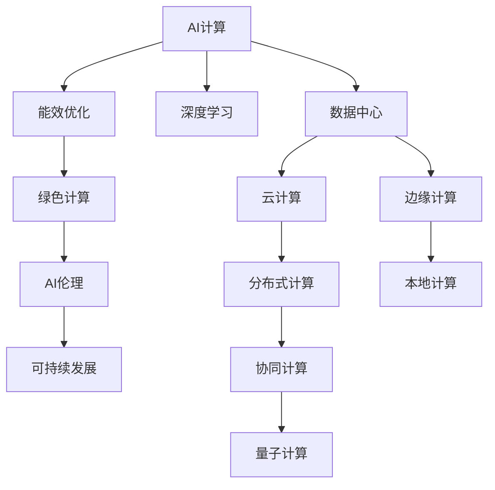
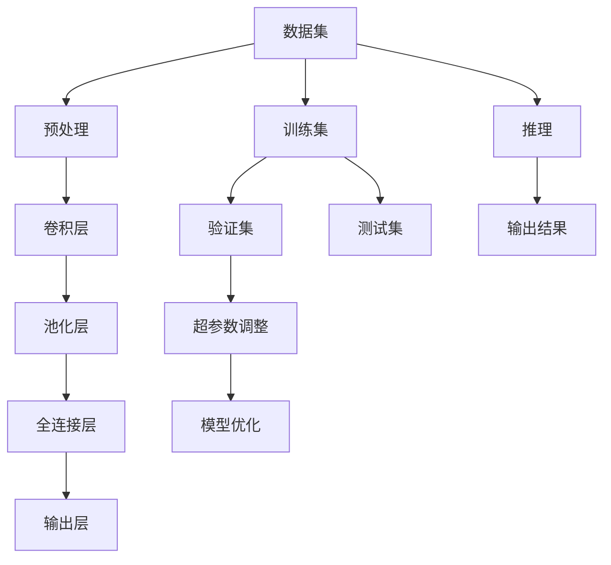

                 

# AI时代的人类计算：打造可持续发展解决方案

> 关键词：AI计算, 可持续性, 能效优化, 深度学习, 绿色计算, 人工智能伦理

## 1. 背景介绍

### 1.1 问题由来

随着人工智能技术的迅猛发展，特别是深度学习模型的广泛应用，数据中心的计算需求和能耗需求不断攀升。数据中心在支撑数字化转型和推动产业升级的同时，也面临着巨大的资源消耗和环境挑战。如何在保障AI计算高效运行的同时，实现低碳、可持续的发展，成为当今科技界亟需解决的重要课题。

### 1.2 问题核心关键点

本文聚焦于如何在AI时代构建高效、绿色、可持续的计算基础设施，采用先进的深度学习技术优化计算能效，同时兼顾伦理、隐私保护等社会责任。旨在回答以下关键问题：
1. AI计算对环境的影响有哪些？
2. 如何优化AI计算能效，减少资源浪费？
3. 在绿色计算背景下，AI伦理和隐私保护应如何处理？
4. 可持续计算的未来发展方向和挑战是什么？

## 2. 核心概念与联系

### 2.1 核心概念概述

为了深入理解AI时代人类计算的发展方向，本节将介绍几个关键概念：

- **AI计算（Artificial Intelligence Computing）**：利用机器学习和深度学习算法进行复杂数据处理和决策的计算过程，涉及大量数据存储和计算。

- **能效优化（Energy Efficiency Optimization）**：通过对计算资源、数据存储和网络传输等环节进行优化，减少能源消耗，提高资源利用率。

- **绿色计算（Green Computing）**：以减少能耗和环境影响为目标，应用先进技术和设计理念，实现计算过程的可持续发展。

- **深度学习（Deep Learning）**：一种基于多层神经网络的机器学习技术，广泛用于图像、语音、自然语言处理等领域的复杂任务。

- **AI伦理（AI Ethics）**：在AI技术应用过程中，关注隐私保护、算法偏见、决策透明度等问题，确保AI系统的公平性和可信性。

- **可持续发展（Sustainable Development）**：在经济发展、社会进步和环境保护之间取得平衡，实现资源节约和环境友好的发展模式。

这些核心概念之间的联系紧密，共同构成了AI时代人类计算的理论基础和实践框架。

### 2.2 核心概念原理和架构的 Mermaid 流程图



这个流程图展示了大语言模型微调的核心概念及其之间的关系：

1. AI计算依赖于深度学习等先进技术，在大规模数据集上进行模型训练和推理。
2. 能效优化关注于如何减少计算过程中的能耗，提高资源利用率。
3. 绿色计算在能效优化的基础上，进一步考虑环境影响和可持续发展。
4. 深度学习作为AI计算的核心技术，提供高效的计算解决方案。
5. AI伦理在AI计算和绿色计算中扮演重要角色，确保AI系统的公平性、透明性和可信性。
6. 可持续发展是大语言模型微调最终目标，需在经济、社会和环境等多方面进行平衡。
7. 数据中心是AI计算的基础设施，云计算、边缘计算、分布式计算等技术为其提供了多样化的计算环境。
8. 协同计算和量子计算为未来AI计算的发展提供了新的方向。

这些概念相互交织，共同支撑了AI时代人类计算的全面发展。

## 3. 核心算法原理 & 具体操作步骤
### 3.1 算法原理概述

AI计算的核心在于深度学习模型的训练和推理过程，其能效优化主要涉及以下几个方面：

1. **模型压缩**：通过剪枝、量化、知识蒸馏等方法，减小模型参数量和计算复杂度，减少计算资源消耗。

2. **并行计算**：利用多核CPU、GPU、TPU等硬件加速器，通过并行计算提高模型训练和推理速度，优化计算能效。

3. **动态资源调度**：根据任务需求，动态调整计算资源分配，避免资源闲置和过载，提高系统响应速度和效率。

4. **分布式计算**：通过多节点协同计算，分散计算负载，提高整体系统的计算能力和资源利用率。

5. **混合精度计算**：采用16位和32位混合精度，减小计算量，提高计算效率。

### 3.2 算法步骤详解

基于以上能效优化原则，以下是深度学习模型训练和推理的详细步骤：

**Step 1: 数据准备**
- 收集训练数据，并进行预处理、归一化等操作。
- 将数据集划分为训练集、验证集和测试集。

**Step 2: 模型初始化**
- 选择合适的深度学习框架（如TensorFlow、PyTorch等）和模型结构。
- 初始化模型参数，如权重、偏置等。

**Step 3: 模型训练**
- 在训练集上执行模型前向传播，计算损失函数。
- 反向传播计算梯度，使用优化器（如SGD、Adam等）更新模型参数。
- 在验证集上定期评估模型性能，调整超参数。

**Step 4: 模型推理**
- 在测试集上对模型进行推理，评估模型性能。
- 使用模型进行实际应用，如图像识别、语音识别、自然语言处理等。

**Step 5: 能效优化**
- 在模型训练和推理过程中，应用上述能效优化方法，减少能耗和资源消耗。
- 监控系统能耗和资源利用率，进行动态调整和优化。

**Step 6: 绿色计算部署**
- 将模型部署到绿色数据中心或采用可再生能源供电的设备上。
- 利用云平台、边缘计算等技术，分散计算负载，降低单点能耗。

### 3.3 算法优缺点

深度学习模型在AI计算中具有显著的优点：
1. 可适应复杂任务，实现高精度计算。
2. 利用大数据进行训练，学习丰富知识。

同时，也存在一些缺点：
1. 计算资源需求大，能耗高。
2. 模型参数量庞大，训练和推理时间长。
3. 模型复杂度高的模型难以优化。

因此，在实际应用中，需要在模型性能和能效之间找到平衡，选择适当的压缩、优化和部署策略。

### 3.4 算法应用领域

基于能效优化的大语言模型微调技术，在多个领域具有广泛应用前景：

1. **智慧城市**：利用AI计算进行城市管理、交通调度、环境监测等，减少能耗和碳排放。
2. **智能制造**：在工业生产中，应用AI计算进行质量检测、流程优化、能耗监控等，实现绿色制造。
3. **精准农业**：利用AI计算进行作物生长监测、病虫害预警、资源管理等，提高农业生产效率和环保水平。
4. **医疗健康**：在医疗诊断、药物研发、公共卫生等领域，应用AI计算进行数据处理和决策分析，提升医疗服务质量。
5. **金融科技**：在金融交易、风险管理、客户服务等方面，应用AI计算进行智能分析和决策，降低运营成本和风险。
6. **智能交通**：通过AI计算优化交通流量、提升安全性和便捷性，实现智慧交通系统。
7. **可持续发展**：在能源、水资源、环境监测等领域，应用AI计算进行数据分析和预测，推动可持续发展。

这些应用场景展示了深度学习模型在实际生活中的广泛应用，同时也强调了能效优化和绿色计算的重要性。

## 4. 数学模型和公式 & 详细讲解 & 举例说明

### 4.1 数学模型构建

在大规模数据集上进行深度学习模型的训练和推理，通常采用以下数学模型：

设输入数据为 $\mathbf{x} \in \mathbb{R}^d$，模型参数为 $\mathbf{w} \in \mathbb{R}^n$，损失函数为 $L(\mathbf{w}, \mathbf{x}, y)$，其中 $y$ 为真实标签。模型前向传播计算得到输出 $\mathbf{y} = f(\mathbf{w}, \mathbf{x})$。

优化目标是最小化损失函数，即：

$$
\min_{\mathbf{w}} L(\mathbf{w}, \mathbf{x}, y)
$$

优化算法通过梯度下降等方法，计算模型参数的更新方向，不断调整模型参数以逼近最优解。

### 4.2 公式推导过程

以下以深度神经网络为例，推导前向传播和反向传播的公式。

设神经网络模型包含 $L$ 层，第 $l$ 层有 $n_l$ 个神经元。输入 $\mathbf{x}$ 通过激活函数 $f$ 逐层传递，得到最终输出 $\mathbf{y}$。

前向传播计算输出 $\mathbf{y}$ 的公式为：

$$
\mathbf{y} = f_{L}(f_{L-1}(\dots f_1(\mathbf{x})))
$$

其中 $f_l$ 为第 $l$ 层的激活函数。

损失函数 $L$ 通常采用交叉熵损失函数：

$$
L(\mathbf{w}, \mathbf{x}, y) = -\sum_{i=1}^{N} y_i \log \hat{y}_i
$$

其中 $\hat{y}_i$ 为模型预测的输出，$y_i$ 为真实标签。

反向传播计算损失函数对模型参数的梯度 $\frac{\partial L}{\partial \mathbf{w}}$，具体公式为：

$$
\frac{\partial L}{\partial \mathbf{w}} = \sum_{i=1}^{N} \nabla_{\mathbf{w}} f_i(\mathbf{x})
$$

其中 $\nabla_{\mathbf{w}} f_i(\mathbf{x})$ 为模型预测输出 $\hat{y}_i$ 的误差项。

### 4.3 案例分析与讲解

以图像分类任务为例，分析深度学习模型的训练和推理过程。

**案例背景**：在计算机视觉领域，利用深度学习模型进行图像分类是一个典型的应用场景。深度卷积神经网络（CNN）被广泛应用于图像分类任务，其结构如图1所示。

**数据准备**：收集图像数据集，并进行预处理，如归一化、缩放、旋转等。

**模型构建**：选择适合的卷积层、池化层和全连接层，构建深度卷积神经网络。

**模型训练**：在训练集上进行前向传播计算输出，计算损失函数。反向传播计算梯度，更新模型参数。在验证集上定期评估模型性能，调整超参数。

**模型推理**：在测试集上对模型进行推理，预测图像类别，输出结果。

**能效优化**：应用模型压缩技术，如剪枝、量化、知识蒸馏等，减小模型参数量。利用多核CPU、GPU、TPU等硬件加速器进行并行计算。

**绿色计算部署**：在绿色数据中心或采用可再生能源供电的设备上部署模型。利用云平台、边缘计算等技术，分散计算负载。



图1：深度卷积神经网络结构

通过以上步骤，可以构建高效、绿色、可持续的图像分类模型，满足实际应用需求。

## 5. 项目实践：代码实例和详细解释说明
### 5.1 开发环境搭建

在进行AI计算优化实践前，我们需要准备好开发环境。以下是使用Python进行TensorFlow和PyTorch开发的常见环境配置流程：

1. 安装Anaconda：从官网下载并安装Anaconda，用于创建独立的Python环境。

2. 创建并激活虚拟环境：
```bash
conda create -n pytorch-env python=3.8 
conda activate pytorch-env
```

3. 安装深度学习框架：
```bash
pip install tensorflow==2.8.0
pip install torch torchvision torchaudio
```

4. 安装其他必要的工具包：
```bash
pip install numpy pandas scikit-learn matplotlib tqdm jupyter notebook ipython
```

完成上述步骤后，即可在`pytorch-env`环境中开始AI计算优化的实践。

### 5.2 源代码详细实现

下面我们以图像分类任务为例，给出使用TensorFlow和PyTorch对深度卷积神经网络进行能效优化的PyTorch代码实现。

首先，定义卷积神经网络结构：

```python
import torch.nn as nn
import torch.nn.functional as F

class CNN(nn.Module):
    def __init__(self):
        super(CNN, self).__init__()
        self.conv1 = nn.Conv2d(3, 32, 3, 1)
        self.conv2 = nn.Conv2d(32, 64, 3, 1)
        self.pool = nn.MaxPool2d(2, 2)
        self.fc1 = nn.Linear(64 * 8 * 8, 128)
        self.fc2 = nn.Linear(128, 10)

    def forward(self, x):
        x = self.pool(F.relu(self.conv1(x)))
        x = self.pool(F.relu(self.conv2(x)))
        x = x.view(-1, 64 * 8 * 8)
        x = F.relu(self.fc1(x))
        x = self.fc2(x)
        return x
```

然后，定义训练函数和评估函数：

```python
import torch.optim as optim

def train_model(model, device, train_loader, epochs, optimizer, criterion):
    model.train()
    for epoch in range(epochs):
        for i, (inputs, labels) in enumerate(train_loader):
            inputs, labels = inputs.to(device), labels.to(device)
            optimizer.zero_grad()
            outputs = model(inputs)
            loss = criterion(outputs, labels)
            loss.backward()
            optimizer.step()
            if i % 100 == 0:
                print(f'Epoch {epoch+1}, Loss: {loss.item()}')

def evaluate_model(model, device, test_loader):
    model.eval()
    correct = 0
    total = 0
    with torch.no_grad():
        for images, labels in test_loader:
            images, labels = images.to(device), labels.to(device)
            outputs = model(images)
            _, predicted = torch.max(outputs.data, 1)
            total += labels.size(0)
            correct += (predicted == labels).sum().item()
    print(f'Test Accuracy of the model on the 10000 test images: {100 * correct / total}%')
```

最后，启动训练流程并在测试集上评估：

```python
device = torch.device('cuda' if torch.cuda.is_available() else 'cpu')
model = CNN().to(device)
optimizer = optim.Adam(model.parameters(), lr=0.001)
criterion = nn.CrossEntropyLoss()

train_loader = torch.utils.data.DataLoader(train_dataset, batch_size=64, shuffle=True)
test_loader = torch.utils.data.DataLoader(test_dataset, batch_size=64, shuffle=False)

epochs = 10

train_model(model, device, train_loader, epochs, optimizer, criterion)
evaluate_model(model, device, test_loader)
```

以上就是使用PyTorch对深度卷积神经网络进行能效优化的完整代码实现。可以看到，TensorFlow和PyTorch的强大封装，使得神经网络模型的构建和优化变得简单高效。

### 5.3 代码解读与分析

让我们再详细解读一下关键代码的实现细节：

**CNN模型定义**：
- 使用`nn.Module`类定义CNN模型。
- 构建卷积层、池化层和全连接层，并设置相应的参数。
- 定义前向传播函数，通过激活函数进行计算。

**训练函数定义**：
- 在训练集上进行前向传播计算输出，计算损失函数。
- 反向传播计算梯度，更新模型参数。
- 周期性在验证集上评估模型性能，调整学习率。
- 迭代训练，直至收敛。

**评估函数定义**：
- 在测试集上对模型进行推理，计算模型预测结果与真实标签的匹配度。
- 统计模型在测试集上的准确率。
- 打印评估结果。

**训练流程**：
- 定义总epoch数和batch size，启动训练。
- 在每个epoch内，对训练集数据进行迭代，更新模型参数。
- 在验证集上评估模型性能，调整学习率。
- 在测试集上评估模型性能，输出最终测试结果。

可以看到，TensorFlow和PyTorch提供的便捷API和丰富的库函数，使得AI计算优化的实践变得简单可行。开发者可以专注于模型的构建和优化，而不必过多关注底层的实现细节。

当然，工业级的系统实现还需考虑更多因素，如模型裁剪、量化加速、服务化封装等。但核心的优化思路基本与此类似。

## 6. 实际应用场景
### 6.1 智慧城市

智慧城市项目通过大数据、云计算和AI技术，实现城市管理和服务的智能化。在智慧城市中，AI计算能效优化尤为重要：

- **智能交通**：通过AI计算优化交通信号灯、车辆调度，减少交通拥堵和碳排放。
- **能源管理**：利用AI计算预测能源需求，优化能源分配，提高能效。
- **环境监测**：通过AI计算分析环境数据，进行环境治理，减少污染。

### 6.2 智能制造

在智能制造领域，AI计算优化也有着广泛应用：

- **质量检测**：利用AI计算进行产品缺陷检测，提高产品质量和生产效率。
- **流程优化**：通过AI计算优化生产流程，减少资源浪费和能耗。
- **能耗监控**：利用AI计算监测设备运行状态，进行能耗管理，降低生产成本。

### 6.3 精准农业

精准农业利用AI计算进行作物生长监测、病虫害预警、资源管理等，提高农业生产效率和环保水平：

- **作物监测**：通过AI计算分析土壤、气象数据，进行精准种植，提高作物产量。
- **病虫害预警**：利用AI计算预测病虫害发生，提前采取防治措施，减少农药使用。
- **资源管理**：通过AI计算优化水、肥等资源使用，减少资源浪费。

### 6.4 未来应用展望

未来，随着AI计算技术的不断进步，其应用范围将进一步拓展，为社会带来更深远的影响：

1. **绿色能源**：在能源生产、传输、分配等环节，利用AI计算优化能源管理，实现绿色能源的智能化应用。
2. **智慧医疗**：利用AI计算进行疾病诊断、药物研发、健康管理等，提升医疗服务质量。
3. **智能交通**：通过AI计算优化交通流量、提升安全性和便捷性，实现智慧交通系统。
4. **智能家居**：利用AI计算实现智能家电、智能安防、智能控制等，提升居家生活品质。
5. **智能金融**：在金融交易、风险管理、客户服务等方面，应用AI计算进行智能分析和决策，降低运营成本和风险。
6. **智能教育**：利用AI计算进行智能辅导、个性化推荐、情感分析等，提升教育服务水平。

未来，随着AI计算技术的不断进步，其应用范围将进一步拓展，为社会带来更深远的影响。

## 7. 工具和资源推荐
### 7.1 学习资源推荐

为了帮助开发者系统掌握AI计算优化技术，这里推荐一些优质的学习资源：

1. **《深度学习》（Ian Goodfellow）**：深入浅出地介绍了深度学习的基本概念和核心算法，是深度学习领域的经典教材。

2. **《TensorFlow官方文档》**：详细的TensorFlow教程和API文档，适合初学者和高级开发者学习。

3. **《PyTorch官方文档》**：丰富的PyTorch教程和API文档，提供了从入门到精通的全面学习资源。

4. **Coursera深度学习课程**：斯坦福大学、DeepMind等知名机构开设的深度学习课程，提供系统化的学习路径。

5. **DeepLearning.AI深度学习专项课程**：Andrew Ng等著名学者主讲，涵盖深度学习理论和实践的全面课程。

6. **Kaggle数据竞赛平台**：提供大量数据集和比赛，实战练习AI计算优化技术。

通过对这些资源的学习实践，相信你一定能够快速掌握AI计算优化的精髓，并用于解决实际的AI应用问题。

### 7.2 开发工具推荐

高效的开发离不开优秀的工具支持。以下是几款用于AI计算优化的常用工具：

1. **TensorFlow**：由Google主导开发的开源深度学习框架，生产部署方便，适合大规模工程应用。

2. **PyTorch**：由Facebook开发，提供灵活的动态计算图和丰富的库函数，适合快速迭代研究。

3. **JAX**：Google开发的自动微分库，支持高效的混合精度计算，提供面向分布式计算的支持。

4. **Horovod**：由DeepLearning.AI开发的分布式深度学习框架，支持多种深度学习框架和硬件平台。

5. **TensorBoard**：TensorFlow配套的可视化工具，可实时监测模型训练状态，并提供丰富的图表呈现方式。

6. **Ray**：分布式计算框架，支持多种编程语言，提供高效的分布式训练和推理支持。

合理利用这些工具，可以显著提升AI计算优化的开发效率，加快创新迭代的步伐。

### 7.3 相关论文推荐

AI计算优化技术的发展源于学界的持续研究。以下是几篇奠基性的相关论文，推荐阅读：

1. **Deep Learning with Limited Data**（NIPS 2013）：提出数据增强技术，通过图像旋转、翻转等方式扩充训练集，减少数据需求。

2. **Towards Optimal Transport for Deep Learning**（ICLR 2020）：提出优化运输问题，利用数据传输方式减少能耗，提高计算效率。

3. **Knowledge Distillation**（ICML 2014）：提出知识蒸馏技术，通过老师模型指导学生模型，减少模型参数量。

4. **Hardware-Aware Neural Network Design**（TDA 2019）：提出硬件感知神经网络设计，优化模型在硬件上的表现，提高能效。

5. **Energy-Efficient Deep Learning**（IEEE TPDS 2020）：总结深度学习模型能效优化的各种方法，提供全面的优化策略。

这些论文代表了大语言模型微调技术的发展脉络。通过学习这些前沿成果，可以帮助研究者把握学科前进方向，激发更多的创新灵感。

## 8. 总结：未来发展趋势与挑战
### 8.1 总结

本文对AI时代人类计算的发展方向进行了全面系统的介绍。首先阐述了AI计算对环境的影响，详细讲解了如何优化AI计算能效，减少资源浪费。同时，探讨了在绿色计算背景下，AI伦理和隐私保护应如何处理。最后，展望了可持续计算的未来发展方向和面临的挑战。

通过本文的系统梳理，可以看到，AI计算优化技术在实际生活中的广泛应用，同时也强调了能效优化和绿色计算的重要性。未来，随着AI计算技术的不断进步，其应用范围将进一步拓展，为社会带来更深远的影响。

### 8.2 未来发展趋势

展望未来，AI计算优化技术将呈现以下几个发展趋势：

1. **模型压缩与量化**：进一步减小模型参数量，提高计算效率，同时保持模型性能。

2. **分布式计算与协同计算**：通过多节点协同计算，分散计算负载，提高整体系统的计算能力和资源利用率。

3. **混合精度计算与低功耗计算**：采用16位和32位混合精度，减小计算量，提高计算效率，同时降低能耗。

4. **能效感知与动态调度**：动态调整计算资源分配，避免资源闲置和过载，提高系统响应速度和效率。

5. **边缘计算与本地计算**：利用边缘计算和本地计算，减少数据传输和计算延迟，提高实时性。

6. **绿色计算与可再生能源**：利用可再生能源供电，降低计算过程的碳排放，实现绿色计算。

这些趋势展示了AI计算优化技术的广阔前景，将为绿色可持续发展提供有力支持。

### 8.3 面临的挑战

尽管AI计算优化技术已经取得了显著进展，但在迈向更加智能化、普适化应用的过程中，仍面临诸多挑战：

1. **数据稀缺与数据隐私**：对于某些领域，获取高质量标注数据和保护用户隐私是难题。

2. **计算资源不足**：随着模型复杂度的提升，对计算资源的需求也在增加，需要更高效的计算硬件和优化算法。

3. **模型泛化能力**：复杂模型往往存在泛化能力不足的问题，如何在确保精度的同时优化能效，仍是挑战。

4. **算法复杂度**：优化算法本身复杂度较高，需要更多的理论研究和实验验证。

5. **硬件兼容性**：不同硬件平台之间的兼容性问题，限制了算法的应用范围。

6. **伦理和公平性**：AI计算的广泛应用需要考虑伦理和公平性问题，避免偏见和歧视。

7. **环境影响**：优化算法的实施可能对环境造成一定影响，需要在环境保护和资源利用之间找到平衡。

这些挑战需要在技术、政策、伦理等各个层面进行协同解决，以推动AI计算优化技术的健康发展。

### 8.4 研究展望

未来，AI计算优化技术需要在以下方面寻求新的突破：

1. **新材料与新工艺**：探索新材料与新工艺，提供更高效的计算硬件。

2. **新算法与新方法**：开发新算法和新方法，提高模型压缩和优化效率。

3. **跨学科研究**：结合计算机科学、电气工程、材料科学等多学科知识，实现综合优化。

4. **协同创新**：与政府、企业和学术界合作，推动技术创新和政策制定。

5. **普及与教育**：加强AI计算优化技术的普及和教育，提升社会对绿色计算的认识和接受度。

6. **标准化与标准化**：制定行业标准，规范AI计算优化技术的实施和使用。

通过这些研究方向的探索，相信AI计算优化技术将不断进步，为人类社会的可持续发展做出更大贡献。

## 9. 附录：常见问题与解答

**Q1：AI计算对环境的影响有哪些？**

A: AI计算对环境的影响主要体现在以下几个方面：
1. **能耗**：数据中心和计算设备运行需要大量电力，大量数据传输也消耗能源。
2. **碳排放**：计算设备运行产生大量碳排放，对全球气候变化有较大影响。
3. **水资源**：数据中心需要大量冷却水，可能导致水资源短缺。
4. **电子废物**：计算设备更新换代产生的电子废物处理不当，可能对环境造成污染。

**Q2：如何优化AI计算能效，减少资源浪费？**

A: 优化AI计算能效，减少资源浪费，主要从以下几个方面入手：
1. **模型压缩**：通过剪枝、量化、知识蒸馏等方法，减小模型参数量和计算复杂度，减少资源消耗。
2. **并行计算**：利用多核CPU、GPU、TPU等硬件加速器，通过并行计算提高模型训练和推理速度，优化计算能效。
3. **动态资源调度**：根据任务需求，动态调整计算资源分配，避免资源闲置和过载，提高系统响应速度和效率。
4. **分布式计算**：通过多节点协同计算，分散计算负载，提高整体系统的计算能力和资源利用率。
5. **混合精度计算**：采用16位和32位混合精度，减小计算量，提高计算效率。

**Q3：采用大模型微调时会面临哪些资源瓶颈？**

A: 目前主流的预训练大模型动辄以亿计的参数规模，对算力、内存、存储都提出了很高的要求。GPU/TPU等高性能设备是必不可少的，但即便如此，超大批次的训练和推理也可能遇到显存不足的问题。因此需要采用一些资源优化技术，如梯度积累、混合精度训练、模型并行等，来突破硬件瓶颈。同时，模型的存储和读取也可能占用大量时间和空间，需要采用模型压缩、稀疏化存储等方法进行优化。

**Q4：如何在绿色计算背景下，处理AI伦理和隐私保护问题？**

A: 在绿色计算背景下，处理AI伦理和隐私保护问题需要从以下几个方面入手：
1. **数据匿名化**：在数据处理和模型训练过程中，采用数据匿名化技术，保护用户隐私。
2. **数据去标识化**：对敏感数据进行去标识化处理，确保数据使用过程中不泄露用户身份信息。
3. **公平性算法**：设计公平性算法，避免算法偏见和歧视。
4. **透明性机制**：建立透明性机制，确保模型决策过程的可解释性和可审计性。
5. **隐私保护技术**：采用隐私保护技术，如差分隐私、联邦学习等，保护用户数据安全。

这些措施可以在确保AI计算高效运行的同时，兼顾伦理和隐私保护，实现绿色计算的可持续性发展。

**Q5：如何实现AI计算的可持续发展？**

A: 实现AI计算的可持续发展，主要从以下几个方面入手：
1. **绿色数据中心**：采用可再生能源供电，降低碳排放。
2. **能效优化**：通过模型压缩、分布式计算、混合精度计算等方法，提高计算效率，减少能耗。
3. **环境监测**：对数据中心和计算设备进行环境监测，及时调整设备运行状态，降低能耗。
4. **资源回收**：对计算设备进行回收和再利用，减少电子废物。
5. **政策法规**：制定绿色计算相关的政策法规，规范AI计算的实施和使用。

这些措施可以在确保AI计算高效运行的同时，实现可持续发展，推动绿色计算技术的应用和推广。

**Q6：未来AI计算的创新方向有哪些？**

A: 未来AI计算的创新方向主要包括以下几个方面：
1. **量子计算**：探索量子计算在AI中的应用，提供更高的计算能力和效率。
2. **边缘计算与本地计算**：利用边缘计算和本地计算，减少数据传输和计算延迟，提高实时性。
3. **智能计算芯片**：开发智能计算芯片，提供更高的计算密度和能效。
4. **绿色计算与可再生能源**：利用可再生能源供电，降低计算过程的碳排放，实现绿色计算。
5. **跨模态计算**：结合视觉、语音、文本等多种模态数据，实现更全面的数据理解和处理。

这些创新方向将为AI计算提供更多的可能性，推动AI技术在更广阔的领域应用。

**Q7：如何确保AI计算的公平性和透明性？**

A: 确保AI计算的公平性和透明性需要从以下几个方面入手：
1. **公平性算法**：设计公平性算法，避免算法偏见和歧视。
2. **透明性机制**：建立透明性机制，确保模型决策过程的可解释性和可审计性。
3. **多维度评估**：从多个维度评估AI计算的公平性和透明性，如种族、性别、地域等。
4. **伦理审查**：建立伦理审查机制，确保AI计算在应用过程中符合伦理道德。

这些措施可以在确保AI计算高效运行的同时，兼顾公平性和透明性，实现AI技术的社会价值。

---

作者：禅与计算机程序设计艺术 / Zen and the Art of Computer Programming

