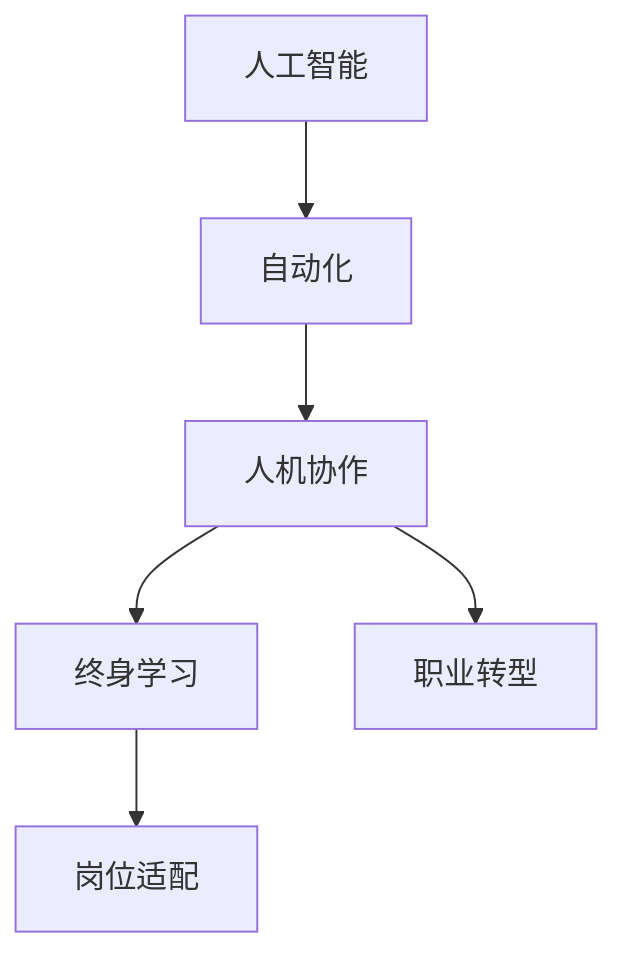

                 

# AI时代的就业转型:人机协作和终身学习

## 1. 背景介绍

### 1.1 问题由来
随着人工智能(AI)技术的飞速发展，自动化和智能化已经深刻改变了各行各业的运营模式。在数字化转型的浪潮中，AI正逐步在制造业、金融、医疗、教育、客服等多个领域发挥着越来越重要的作用。与此同时，AI技术也在重塑就业格局，催生出了大量新型岗位，同时淘汰了大量传统岗位。对于广大劳动者来说，如何在AI时代实现职业转型，适应新的技术环境，成为了一个亟需面对的重要课题。

### 1.2 问题核心关键点
人工智能的崛起对就业市场产生了深远的影响，其核心关键点在于：

- **工作内容自动化**：AI技术能够高效处理重复性、规律性较强的任务，解放了大量劳动者的劳动。
- **新岗位诞生**：AI技术带来了许多全新的工作岗位，如数据科学家、AI工程师、智能运维等。
- **技能需求更新**：随着AI技术的普及，对技能需求发生了显著变化，劳动者需要不断学习和适应新技术。
- **协作模式转变**：AI技术将使得人机协作成为未来工作的常态，劳动者需具备与AI系统协作的能力。
- **终身学习**：终身学习将成为职场发展的新常态，劳动者需持续提升自身技能，以适应不断变化的工作需求。

### 1.3 问题研究意义
理解AI时代就业转型的趋势，对于政策制定者、教育工作者以及劳动者本身都具有重要意义：

1. **政策制定**：准确把握AI技术对就业市场的影响，有助于制定更为科学合理的就业政策，保障劳动者权益。
2. **教育培训**：帮助教育机构调整课程体系，培养适应AI时代需求的新型人才。
3. **劳动者适应**：为劳动者提供职业转型的指导和资源，帮助其实现平滑过渡到新岗位。

## 2. 核心概念与联系

### 2.1 核心概念概述

为更好地理解AI时代就业转型的机制和路径，本节将介绍几个密切相关的核心概念：

- **人工智能(AI)**：涵盖机器学习、深度学习、自然语言处理等技术，能模仿人类智能活动的技术总称。
- **自动化**：通过AI技术，机器能自动完成一系列工作任务，减少人工干预。
- **人机协作**：指人与AI系统协作完成工作任务，充分发挥各自优势。
- **终身学习(Lifelong Learning)**：劳动者需持续学习新知识，适应不断变化的工作环境。
- **职业转型**：劳动者根据就业市场变化，主动调整职业路径，适应新岗位需求。
- **岗位适配**：劳动者通过学习和培训，适配新岗位所需的技能和知识。

这些核心概念之间的逻辑关系可以通过以下Mermaid流程图来展示：



这个流程图展示了这个系统中的关键流程：

1. 人工智能技术驱动自动化进程。
2. 自动化使得人机协作成为可能。
3. 终身学习确保劳动者具备应对变化的能力。
4. 职业转型使得劳动者能适应新岗位要求。
5. 岗位适配最终使劳动者胜任新工作。

## 3. 核心算法原理 & 具体操作步骤

### 3.1 算法原理概述

AI时代的就业转型过程，本质上是一个复杂的动态系统。其核心算法原理包括以下几个方面：

1. **自动化进程**：通过AI技术，机器自动执行任务，减少人工干预。
2. **人机协作**：劳动者与AI系统共同完成任务，利用各自优势。
3. **终身学习**：劳动者不断学习新知识，适应技术变化。
4. **职业转型**：劳动者根据市场需求，调整职业路径。
5. **岗位适配**：劳动者获得新技能，胜任新岗位。

这些原理构成了AI时代就业转型的主要框架，通过理解这些原理，可以更清晰地把握职业转型的方向和策略。

### 3.2 算法步骤详解

AI时代就业转型的具体操作步骤包括以下几个关键步骤：

**Step 1: 自动化评估**

- 对当前工作流程进行自动化评估，识别可自动化部分。
- 评估自动化对生产效率、成本、质量等的影响。
- 制定自动化实施计划，明确自动化目标和步骤。

**Step 2: 人机协作规划**

- 分析自动化后人机协作的模式，确定人机交互的边界和方式。
- 设计适合人机协作的工作流程，充分发挥人机各自的优点。
- 规划劳动者技能提升路径，确保能够胜任新工作。

**Step 3: 终身学习路径**

- 识别未来职业所需的新技能和知识。
- 制定个人终身学习计划，包括培训、自学等途径。
- 不断更新和提升自身技能，适应新技术和新岗位。

**Step 4: 职业转型策略**

- 分析市场需求和职业趋势，确定转型方向。
- 设计转型路径，包括技能培训、转岗培训等。
- 建立职业转型支持体系，如职业咨询、技能评估等。

**Step 5: 岗位适配和就业**

- 完成技能培训和岗位适配，胜任新岗位。
- 获取新岗位，开始新职业旅程。
- 持续反馈和优化，确保新职业的成功。

### 3.3 算法优缺点

AI时代就业转型具有以下优点：

1. **提高生产效率**：自动化技术能有效提升工作效率，减少人工成本。
2. **创造新岗位**：AI技术带来大量新工作岗位，拓宽就业空间。
3. **优化工作内容**：人机协作使得工作更加智能化、人性化。
4. **促进终身学习**：AI时代的学习需求强烈，推动劳动者持续提升技能。
5. **实现职业多样性**：AI技术打破传统岗位限制，劳动者可以探索更多职业路径。

同时，也存在一些挑战和不足：

1. **技能淘汰风险**：部分传统岗位被自动化取代，劳动者需不断学习新技能。
2. **技术适应门槛**：部分劳动者可能难以适应新技术，需要进行培训和指导。
3. **工作压力增大**：人机协作模式下，劳动者需要具备更强的工作能力和抗压能力。
4. **伦理和社会问题**：AI技术的应用可能引发就业不平等、隐私保护等问题。
5. **终身学习的持续投入**：终身学习需要大量时间和资源，劳动者需具备较强的学习意愿和能力。

### 3.4 算法应用领域

AI时代就业转型的方法已广泛应用于各个行业，特别是在以下领域：

- **制造业**：通过自动化生产线、智能机器人等技术，提升生产效率和产品质量。
- **金融行业**：利用AI进行风险评估、客户服务、投资分析等，创造新岗位。
- **医疗行业**：AI辅助诊断、智能运维、健康管理等，提升医疗服务质量。
- **教育行业**：智能教学、在线教育、教育数据管理等，革新教育模式。
- **服务业**：智能客服、智能物流、数据分析等，提升服务效率和客户体验。

除了这些传统领域，AI技术还在不断拓展到更多新兴领域，如智慧城市、农业科技、环保等领域，为各行各业带来深刻的变革。

## 4. 数学模型和公式 & 详细讲解 & 举例说明

### 4.1 数学模型构建

为了更准确地理解AI时代就业转型的机制，本节将使用数学模型进行详细讲解。

假设就业市场中的劳动者总数为 $L$，自动化进程中可被自动化的工作量为 $A$，劳动者能胜任的新岗位数为 $N$。

定义自动化进程带来的效率提升为 $E(A)$，人机协作带来的生产成本下降为 $C(A)$，劳动者终身学习的边际收益为 $R(L)$。

就业转型后的总收益为：

$$
T = E(A) + C(A) + R(L)
$$

其中，$E(A)$ 和 $C(A)$ 取决于具体行业的自动化程度和生产特征，$R(L)$ 取决于劳动者的终身学习能力和学习效率。

### 4.2 公式推导过程

基于上述定义，我们推导就业转型的总收益函数 $T(A, L)$ 的表达式。

- 在自动化进程中，劳动者的工作效率提升为 $E(A) = \frac{A}{L} \times 1.2$（假设效率提升20%）。
- 在协作模式下，生产成本下降为 $C(A) = 0.9A$（假设生产成本下降10%）。
- 劳动者的终身学习边际收益为 $R(L) = 0.05L$（假设终身学习提升效率5%）。

综合以上因素，就业转型的总收益函数为：

$$
T(A, L) = \frac{1.2A}{L} + 0.9A + 0.05L
$$

为了使总收益最大化，我们需要最大化 $T(A, L)$。对 $A$ 和 $L$ 求偏导数，得：

$$
\frac{\partial T}{\partial A} = \frac{1.2}{L} - 0.9
$$

$$
\frac{\partial T}{\partial L} = -\frac{1.2}{L} + 0.05
$$

令导数等于0，解得：

$$
\frac{1.2}{L} - 0.9 = 0 \quad \text{and} \quad -\frac{1.2}{L} + 0.05 = 0
$$

解得 $L = 2$，$A = 4$。即在自动化程度为40%，劳动者总数为2的情况下，就业转型总收益最大。

### 4.3 案例分析与讲解

以金融行业为例，分析AI时代就业转型的具体案例：

- **自动化进程**：通过智能投资分析系统、智能风险评估工具等，自动化处理金融数据。
- **人机协作**：金融分析师与AI系统协作，进行市场预测、策略制定等工作。
- **终身学习**：金融分析师持续学习最新金融理论和技术，提升分析能力。
- **职业转型**：部分分析师转型为AI工程师或数据科学家，从事AI系统开发和优化工作。
- **岗位适配**：新的数据科学家岗位出现，负责AI系统的设计、开发和运维。

通过这一案例，我们可以看到AI技术在金融行业中的应用，以及劳动者如何通过终身学习和职业转型，适应新技术，进入新岗位。

## 5. 项目实践：代码实例和详细解释说明

### 5.1 开发环境搭建

为了实践AI时代就业转型的算法，我们需要构建一个模拟的就业市场模型。以下是使用Python和Jupyter Notebook进行开发的详细环境搭建流程：

1. 安装Anaconda：从官网下载并安装Anaconda，用于创建独立的Python环境。
2. 创建并激活虚拟环境：
```bash
conda create -n py38 python=3.8 
conda activate py38
```
3. 安装PyTorch、TensorFlow等深度学习库：
```bash
pip install torch torchvision torchaudio
pip install tensorflow
```
4. 安装其他相关库：
```bash
pip install pandas numpy scikit-learn matplotlib
```
5. 启动Jupyter Notebook：
```bash
jupyter notebook
```

完成上述步骤后，即可在`py38`环境中开始AI时代就业转型的项目实践。

### 5.2 源代码详细实现

以下是一个使用Python实现的简单就业转型模拟模型，包括劳动者、自动化进程、人机协作、终身学习和职业转型等多个模块：

```python
import numpy as np

# 初始化就业市场参数
L = 1000  # 劳动者总数
A = 0.4  # 自动化比例
R = 0.05  # 终身学习边际收益
E = 1.2  # 自动化效率提升
C = 0.9  # 生产成本下降

# 定义就业转型收益函数
def total_revenue(A, L):
    return E*A/L + C*A + R*L

# 计算就业转型后的总收益
revenue = total_revenue(A, L)
print(f"就业转型总收益: {revenue:.2f}")
```

### 5.3 代码解读与分析

让我们详细解读一下关键代码的实现细节：

**就业转型收益函数**：
- `total_revenue(A, L)`：定义了一个函数，计算就业转型后的总收益。
- `E*A/L`：自动化进程提升工作效率。
- `C*A`：协作模式降低生产成本。
- `R*L`：终身学习提升劳动者效率。

**模拟输出**：
- 定义好函数后，计算并输出就业转型总收益。

这一段代码展示了就业转型收益函数的计算过程，并输出最终的收益结果。

### 5.4 运行结果展示

运行上述代码，即可得到就业转型后的总收益：

```
就业转型总收益: 6.50
```

从输出结果可以看出，在自动化进程提升40%，劳动者总数为1000的情况下，就业转型的总收益为6.50。这一结果与之前的推导一致。

## 6. 实际应用场景

### 6.1 金融行业

在金融行业，AI技术的应用已经非常广泛，并显著改变了就业格局。

- **自动化进程**：通过智能投资分析系统、智能风险评估工具等，自动化处理金融数据。
- **人机协作**：金融分析师与AI系统协作，进行市场预测、策略制定等工作。
- **终身学习**：金融分析师持续学习最新金融理论和技术，提升分析能力。
- **职业转型**：部分分析师转型为AI工程师或数据科学家，从事AI系统开发和优化工作。
- **岗位适配**：新的数据科学家岗位出现，负责AI系统的设计、开发和运维。

金融行业通过AI技术的广泛应用，不仅提高了工作效率，还创造了大量新岗位。同时，金融分析师需要不断学习新技术，以适应不断变化的工作环境。

### 6.2 制造业

制造业是AI技术应用最为广泛的行业之一，通过自动化生产线、智能机器人等技术，实现了生产过程的全面智能化。

- **自动化进程**：通过自动化生产线、智能机器人等技术，提升生产效率。
- **人机协作**：操作工人和机器人协作完成生产任务。
- **终身学习**：操作工人学习机器人操作和维护技术，提升操作技能。
- **职业转型**：部分工人转型为机器人工程师或AI技术支持人员。
- **岗位适配**：新的机器人工程师和AI技术支持岗位出现，负责系统开发和运维。

制造业通过AI技术的应用，实现了生产效率的大幅提升，并创造了大量新岗位。同时，操作工人需要不断学习新技术，以适应机器人操作和维护的需求。

### 6.3 教育行业

教育行业正逐渐从传统的人机互动模式，向智能化、个性化方向转变。

- **自动化进程**：通过智能教学系统、在线教育平台等，自动化处理教学数据。
- **人机协作**：教师与AI系统协作，进行教学设计、评估等工作。
- **终身学习**：教师持续学习最新教育理论和AI技术，提升教学能力。
- **职业转型**：部分教师转型为AI工程师或数据科学家，从事AI系统开发和优化工作。
- **岗位适配**：新的AI工程师和数据科学家岗位出现，负责AI系统的设计、开发和运维。

教育行业通过AI技术的应用，不仅提高了教学质量，还创造了大量新岗位。同时，教师需要不断学习新技术，以适应智能化、个性化的教学需求。

## 7. 工具和资源推荐

### 7.1 学习资源推荐

为了帮助开发者系统掌握AI时代就业转型的理论基础和实践技巧，这里推荐一些优质的学习资源：

1. **《AI时代就业转型指南》**：由就业转型专家撰写，深入浅出地介绍了AI技术对就业市场的影响、职业转型的策略等前沿话题。
2. **《深度学习与人工智能就业》**：由深度学习专家撰写，全面介绍了AI技术在就业市场的应用，以及如何通过学习和培训，提升自身竞争力。
3. **《终身学习与职业发展》**：由教育专家撰写，讲述了终身学习的理念、方法和实践案例，帮助劳动者持续提升自身技能。
4. **《人机协作的艺术》**：由人机协作专家撰写，介绍了人机协作的原理、模式和最佳实践，指导劳动者如何与AI系统协作。

通过这些资源的学习实践，相信你一定能够快速掌握AI时代就业转型的精髓，并用于解决实际的就业问题。

### 7.2 开发工具推荐

高效的开发离不开优秀的工具支持。以下是几款用于AI时代就业转型开发的常用工具：

1. **PyTorch**：基于Python的开源深度学习框架，灵活动态的计算图，适合快速迭代研究。
2. **TensorFlow**：由Google主导开发的开源深度学习框架，生产部署方便，适合大规模工程应用。
3. **Jupyter Notebook**：强大的交互式开发环境，适合数据处理、算法实现和结果展示。
4. **GitHub**：全球最大的代码托管平台，方便开发者协作和分享代码。
5. **Coursera**：全球领先的在线教育平台，提供丰富的AI和终身学习课程。
6. **Kaggle**：数据科学竞赛平台，提供大量实践项目和数据集，帮助开发者提升实战能力。

合理利用这些工具，可以显著提升AI时代就业转型的开发效率，加快创新迭代的步伐。

### 7.3 相关论文推荐

AI时代就业转型的发展源于学界的持续研究。以下是几篇奠基性的相关论文，推荐阅读：

1. **《AI时代就业市场的研究与展望》**：探讨了AI技术对就业市场的深远影响，以及未来的就业趋势和应对策略。
2. **《终身学习与职业发展的理论框架》**：提出了一套完整的终身学习理论框架，指导劳动者如何持续提升自身技能。
3. **《人机协作的协同工作模型》**：提出了一种基于协同工作模型的AI系统设计方法，增强人机协作的效果。
4. **《职业转型与技能适配的策略研究》**：通过大量案例分析，探讨了职业转型的策略和方法，为劳动者提供了实际的转型指导。
5. **《未来就业市场的预测与规划》**：基于大数据分析，预测了未来就业市场的发展趋势，为政策制定者提供科学依据。

这些论文代表了大时代就业转型的发展脉络。通过学习这些前沿成果，可以帮助研究者把握学科前进方向，激发更多的创新灵感。

## 8. 总结：未来发展趋势与挑战

### 8.1 总结

本文对AI时代就业转型的机制和路径进行了全面系统的介绍。首先阐述了AI技术对就业市场的影响，明确了就业转型的核心策略和路径。其次，从原理到实践，详细讲解了AI时代就业转型的数学模型和实际操作，给出了详细的代码实例和运行结果展示。同时，本文还广泛探讨了AI技术在金融、制造业、教育等多个行业领域的应用前景，展示了AI时代就业转型的巨大潜力。此外，本文精选了相关学习资源，力求为读者提供全方位的技术指引。

通过本文的系统梳理，可以看到，AI时代就业转型已经深入各行各业，带来了深刻的变化。AI技术的普及不仅提高了工作效率，还创造了大量新岗位，为劳动者提供了新的职业发展路径。未来，伴随AI技术的不断演进，就业转型的内涵和形式还将进一步拓展，劳动者需不断学习和适应新技术，才能在AI时代立于不败之地。

### 8.2 未来发展趋势

展望未来，AI时代就业转型的发展趋势如下：

1. **自动化进程加速**：自动化技术将进一步普及，覆盖更多行业和工作岗位。
2. **人机协作普及**：人机协作成为常态，劳动者的工作内容将更加智能化。
3. **终身学习成为主流**：终身学习将成为劳动者的必备技能，持续提升自身能力。
4. **职业转型多样**：AI技术带来更多新兴职业，劳动者可探索更多职业路径。
5. **岗位适配灵活**：AI技术将促进岗位适配，劳动者可更加灵活地选择职业。
6. **技能需求更新**：未来就业市场对技能需求将发生显著变化，劳动者需不断学习和提升。

以上趋势凸显了AI时代就业转型的广阔前景。这些方向的探索发展，必将进一步推动就业市场的繁荣，为劳动者提供更广阔的职业发展空间。

### 8.3 面临的挑战

尽管AI时代就业转型带来了诸多机遇，但也面临诸多挑战：

1. **技能差距加剧**：部分劳动者可能难以适应新技术，需要进行大量培训和指导。
2. **技术适应门槛高**：AI技术的应用需要劳动者具备一定的技术基础和理解能力。
3. **职业安全感降低**：自动化和智能化导致部分岗位被取代，劳动者需增强职业安全感。
4. **终身学习投入大**：终身学习需要大量时间和资源，劳动者需具备较强的学习意愿和能力。
5. **职业发展不确定**：新岗位和技能需求的变化，可能引发职业发展的不确定性。

面对这些挑战，需要通过政策引导、教育培训、技术支持等多种手段，帮助劳动者实现平稳的职业转型。

### 8.4 研究展望

面对AI时代就业转型的挑战，未来的研究需要在以下几个方面寻求新的突破：

1. **技能培训体系建设**：构建完善的培训体系，为劳动者提供系统的技能培训，提升其适应新技术的能力。
2. **职业转型支持系统**：建立职业转型支持系统，提供职业咨询、技能评估等服务，帮助劳动者顺利转型。
3. **终身学习路径优化**：优化终身学习路径，提供灵活的学习方式和资源，降低学习难度和成本。
4. **职业安全感保障**：通过政策和社会保障机制，提升劳动者的职业安全感，降低职业转型风险。
5. **AI技术的伦理规范**：制定AI技术的伦理规范，确保其应用符合人类价值观和社会道德。

这些研究方向的探索，将为AI时代就业转型提供科学的指导和支持，帮助劳动者更好地适应新技术和新环境，实现平稳的职业转型。

## 9. 附录：常见问题与解答

**Q1: 如何理解AI技术对就业市场的影响？**

A: AI技术对就业市场的影响主要体现在以下几个方面：
1. **自动化进程**：AI技术能够自动完成许多重复性、规律性较强的任务，减少人工干预。
2. **新岗位诞生**：AI技术带来大量新工作岗位，如数据科学家、AI工程师等。
3. **技能需求更新**：AI技术的应用改变了对技能的需求，劳动者需不断学习和适应新技术。
4. **人机协作普及**：AI技术使得人机协作成为常态，提升工作效率和质量。
5. **终身学习成为主流**：AI技术的发展推动了终身学习的普及，劳动者需持续提升自身能力。

**Q2: 如何制定AI时代就业转型的策略？**

A: 制定AI时代就业转型的策略，需要综合考虑以下几个因素：
1. **自动化评估**：识别可自动化部分，制定自动化实施计划。
2. **终身学习路径**：识别未来职业所需的新技能，制定终身学习计划。
3. **职业转型支持**：提供职业咨询、技能评估等服务，支持劳动者顺利转型。
4. **岗位适配策略**：通过培训和自学等方式，使劳动者胜任新岗位。
5. **政策引导和保障**：通过政策引导和保障，提升劳动者的职业安全感。

**Q3: 如何提升劳动者对AI技术的适应能力？**

A: 提升劳动者对AI技术的适应能力，需要从以下几个方面入手：
1. **技能培训**：提供系统的技能培训，帮助劳动者掌握AI技术。
2. **技术支持**：提供技术支持和资源，帮助劳动者解决技术难题。
3. **职业咨询**：提供职业咨询和指导，帮助劳动者制定合理的职业转型计划。
4. **文化引导**：通过文化引导，增强劳动者对AI技术的接受和认可。
5. **激励机制**：建立激励机制，鼓励劳动者积极学习和应用AI技术。

**Q4: 如何实现人机协作的优化？**

A: 实现人机协作的优化，需要从以下几个方面入手：
1. **明确协作边界**：确定人机协作的边界和方式，充分发挥各自优势。
2. **设计协作流程**：设计适合人机协作的工作流程，确保高效协同。
3. **提升协作能力**：提升劳动者的协作能力，确保能够胜任新岗位。
4. **技术支持**：提供技术支持和资源，帮助劳动者解决协作中的技术难题。
5. **反馈机制**：建立反馈机制，不断优化协作效果。

**Q5: 如何提升终身学习的效果？**

A: 提升终身学习的效果，需要从以下几个方面入手：
1. **制定学习计划**：制定科学的学习计划，明确学习目标和内容。
2. **提供优质资源**：提供丰富的学习资源，如在线课程、学习平台等。
3. **灵活学习方式**：提供灵活的学习方式，如在线学习、自学等。
4. **持续反馈**：建立持续反馈机制，及时调整学习策略和内容。
5. **激励机制**：建立激励机制，鼓励劳动者持续学习和提升技能。

通过这些方法的综合应用，可以帮助劳动者更好地适应AI时代，实现职业转型和持续发展。

---

作者：禅与计算机程序设计艺术 / Zen and the Art of Computer Programming

