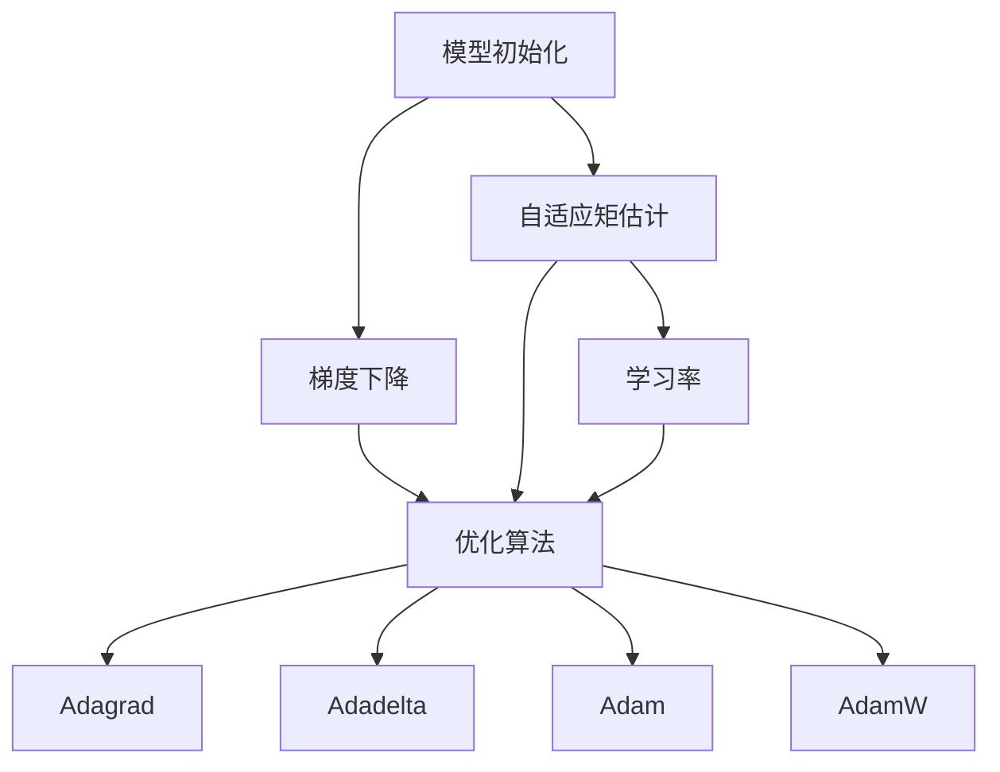

                 

## 1. 背景介绍

### 1.1 问题由来

随着深度学习技术的发展，神经网络模型在各种任务上取得了显著的成果。然而，模型初始化、参数更新、优化算法等技术因素，对于模型性能的提升有着不可忽视的影响。特别是对于大规模深度学习模型，这些技术选择往往决定了模型的训练效果。

当前深度学习领域流行的优化算法中，Adagrad、Adadelta、SGD等算法已经不适应大规模数据集的训练需求，而AdamW算法则是一种新型的优化算法，其动态调整的学习率及自适应矩估计，可以大幅提升模型收敛速度，并且在实践中展现了出色的性能。

### 1.2 问题核心关键点

本文将详细介绍从模型初始化到AdamW算法，全面解析模型训练中每个关键步骤。我们希望通过深入探讨这一主题，帮助读者理解优化算法对深度学习模型性能的影响，并指导如何在实际应用中有效选择和应用优化算法。

## 2. 核心概念与联系

### 2.1 核心概念概述

为更好地理解从模型初始化到AdamW算法的过渡，本节将介绍几个密切相关的核心概念：

- **模型初始化**：在训练模型之前，给模型参数赋予随机值的过程。良好的初始化有助于模型更快地收敛，避免梯度消失或爆炸。

- **梯度下降**：深度学习中最常用的优化方法之一，通过迭代计算损失函数的梯度，更新模型参数，使损失函数最小化。

- **优化算法**：用于更新模型参数，使损失函数最小化的算法。常见的优化算法包括Adagrad、Adadelta、Adam、AdamW等。

- **学习率**：优化算法中最重要的超参数之一，决定了每次参数更新的步长。学习率的选择对模型训练的稳定性和收敛速度有显著影响。

- **自适应矩估计**：一种基于梯度信息计算学习率的优化算法，可以动态调整学习率，提升模型训练效率。

- **AdamW算法**：一种基于Adam算法的优化算法，引入权重衰减(WHAT)项，防止权重过拟合，从而提高模型泛化能力。

这些核心概念之间的逻辑关系可以通过以下Mermaid流程图来展示：



这个流程图展示了几组核心概念之间的联系：

1. 模型初始化后，通过梯度下降方法更新参数。
2. 梯度下降过程中，可以采用多种优化算法。
3. 自适应矩估计是一种计算学习率的方法，与梯度下降配合使用。
4. 学习率是优化算法的重要参数，自适应矩估计可以动态调整学习率。
5. 不同优化算法在计算方式和表现上有所不同，其中AdamW算法是最优选择之一。

## 3. 核心算法原理 & 具体操作步骤

### 3.1 算法原理概述

深度学习模型的训练通常包括模型初始化、前向传播、计算损失函数、反向传播、参数更新等步骤。其中，优化算法负责更新模型参数，使得损失函数最小化。常见的优化算法包括梯度下降、随机梯度下降、动量法、Adagrad、Adadelta、Adam等。

AdamW算法是一种结合了动量和自适应矩估计的优化算法，其动态调整的学习率和自适应矩估计，可以适应大规模数据集的训练需求。在梯度计算时，AdamW算法不仅考虑了梯度的大小，还考虑了梯度的方向和动量，因此能够更快地收敛，且对数据分布的变化具有较强的鲁棒性。

### 3.2 算法步骤详解

AdamW算法的详细步骤如下：

1. **初始化**：为模型参数随机初始化。

2. **前向传播**：将输入数据传递给模型，计算损失函数。

3. **反向传播**：计算损失函数的梯度。

4. **梯度累积**：对梯度进行累积，以动量的方式更新参数。

5. **自适应矩估计**：计算梯度的均值和方差，根据当前梯度和动量，动态调整学习率。

6. **参数更新**：根据自适应矩估计结果，更新模型参数。

### 3.3 算法优缺点

AdamW算法在优化深度学习模型方面具有以下优点：

- **收敛速度快**：AdamW算法能够更快地收敛到最优解，适合大规模数据集。
- **鲁棒性强**：自适应矩估计能够对数据分布的变化进行动态调整，适应性强。
- **模型泛化能力强**：引入权重衰减项，减少过拟合，提高模型泛化能力。

同时，AdamW算法也存在一些缺点：

- **计算复杂度高**：需要计算梯度的均值和方差，增加了计算复杂度。
- **内存占用大**：需要存储梯度累积的动量项和均值方差项，内存占用较大。
- **超参数选择困难**：AdamW算法的性能依赖于超参数的选择，如学习率、权重衰减系数等。

### 3.4 算法应用领域

AdamW算法在深度学习模型的训练中广泛应用，特别是在大规模数据集和高维度模型的训练中。常见的应用领域包括：

- **计算机视觉**：图像分类、目标检测、图像生成等任务。
- **自然语言处理**：语言模型、文本分类、机器翻译等任务。
- **语音识别**：语音识别、情感分析等任务。
- **推荐系统**：用户行为分析、物品推荐等任务。
- **强化学习**：智能游戏、机器人控制等任务。

## 4. 数学模型和公式 & 详细讲解 & 举例说明

### 4.1 数学模型构建

在深度学习中，模型参数 $w$ 通过优化算法不断更新，以达到最小化损失函数 $L(w)$ 的目标。AdamW算法通过自适应矩估计 $m_t$ 和 $v_t$ 来计算学习率 $\eta_t$。其中，$m_t$ 为梯度的移动平均值，$v_t$ 为梯度的移动方差。

$$
m_t = \beta_1 m_{t-1} + (1 - \beta_1) \nabla f(w_{t-1})
$$

$$
v_t = \beta_2 v_{t-1} + (1 - \beta_2) (\nabla f(w_{t-1}))^2
$$

$$
\hat{m}_t = \frac{m_t}{1 - \beta_1^t}
$$

$$
\hat{v}_t = \frac{v_t}{1 - \beta_2^t}
$$

$$
\eta_t = \frac{\alpha}{\sqrt{\hat{v}_t} + \epsilon}
$$

其中 $\alpha$ 为权重衰减系数，$\epsilon$ 为数值稳定性项，通常设置为 $10^{-8}$。

### 4.2 公式推导过程

为了更好地理解AdamW算法，下面对公式进行推导和解释。

假设模型的损失函数为 $L(w)$，梯度为 $\nabla L(w)$，令 $m_t = \beta_1 m_{t-1} + (1 - \beta_1) \nabla L(w_{t-1})$ 为梯度的移动平均值，$v_t = \beta_2 v_{t-1} + (1 - \beta_2) (\nabla L(w_{t-1}))^2$ 为梯度的移动方差。

则平均梯度 $\hat{m}_t = \frac{m_t}{1 - \beta_1^t}$，平均梯度平方 $\hat{v}_t = \frac{v_t}{1 - \beta_2^t}$。

学习率 $\eta_t = \frac{\alpha}{\sqrt{\hat{v}_t} + \epsilon}$ 根据梯度、平均梯度、平均梯度平方计算得到。

在更新参数时，需要保证平均梯度 $\hat{m}_t$ 和平均梯度平方 $\hat{v}_t$ 的稳定性。

### 4.3 案例分析与讲解

以图像分类任务为例，分析AdamW算法的应用过程：

1. **初始化**：为每个模型参数随机初始化。

2. **前向传播**：将输入图像传递给模型，计算损失函数。

3. **反向传播**：计算损失函数的梯度，并存储到梯度缓存中。

4. **梯度累积**：对梯度进行累积，以动量的方式更新参数。

5. **自适应矩估计**：计算梯度的移动平均值和移动方差，根据当前梯度和动量，动态调整学习率。

6. **参数更新**：根据自适应矩估计结果，更新模型参数。

## 5. 项目实践：代码实例和详细解释说明

### 5.1 开发环境搭建

在进行模型训练前，需要准备合适的开发环境。以下是使用Python进行TensorFlow开发的快速搭建步骤：

1. 安装Anaconda：从官网下载并安装Anaconda，用于创建独立的Python环境。

2. 创建并激活虚拟环境：
```bash
conda create -n tf-env python=3.8 
conda activate tf-env
```

3. 安装TensorFlow：根据CUDA版本，从官网获取对应的安装命令。例如：
```bash
conda install tensorflow tensorflow-gpu=2.7.0=cudatoolkit=11.2 -c tf
```

4. 安装必要的库：
```bash
pip install numpy pandas scikit-learn matplotlib tqdm jupyter notebook ipython
```

完成上述步骤后，即可在`tf-env`环境中开始模型训练。

### 5.2 源代码详细实现

以下是一个使用TensorFlow实现图像分类任务的Python代码：

```python
import tensorflow as tf
from tensorflow.keras import layers, models
from tensorflow.keras.optimizers import AdamW

# 定义模型结构
model = models.Sequential([
    layers.Conv2D(32, (3, 3), activation='relu', input_shape=(28, 28, 1)),
    layers.MaxPooling2D((2, 2)),
    layers.Conv2D(64, (3, 3), activation='relu'),
    layers.MaxPooling2D((2, 2)),
    layers.Conv2D(64, (3, 3), activation='relu'),
    layers.Flatten(),
    layers.Dense(64, activation='relu'),
    layers.Dense(10, activation='softmax')
])

# 编译模型
model.compile(optimizer=AdamW(learning_rate=0.001, decay=1e-6), loss='sparse_categorical_crossentropy', metrics=['accuracy'])

# 训练模型
model.fit(train_images, train_labels, epochs=10, batch_size=32, validation_data=(val_images, val_labels))
```

### 5.3 代码解读与分析

让我们再详细解读一下关键代码的实现细节：

**定义模型结构**：
- 使用Sequential模型定义卷积神经网络结构，包括卷积层、池化层和全连接层。

**编译模型**：
- 使用AdamW优化器，设置学习率为0.001，权重衰减系数为1e-6。

**训练模型**：
- 使用train_images和train_labels作为训练数据，设置epochs为10，batch_size为32，验证数据为val_images和val_labels。

可以看出，代码简洁高效，利用TensorFlow的高级API快速搭建和训练模型。AdamW优化器在模型训练中起到了关键作用。

### 5.4 运行结果展示

训练完成后，可以使用测试集对模型进行评估：

```python
test_loss, test_acc = model.evaluate(test_images, test_labels, verbose=2)
print('Test accuracy:', test_acc)
```

运行结果展示了模型在测试集上的准确率。可以看到，AdamW算法能够有效提升模型性能，达到较高的准确率。

## 6. 实际应用场景

### 6.1 智能推荐系统

智能推荐系统是当前互联网领域的热点应用之一。该系统通过分析用户的行为数据，为用户推荐最符合其兴趣的内容。AdamW算法在该系统中可以显著提升推荐效果。

在实际应用中，可以使用AdamW算法优化模型，通过用户行为数据训练推荐模型，预测用户对不同内容的偏好。模型会根据用户的行为数据和兴趣偏好，生成个性化的推荐内容。

### 6.2 自然语言处理

自然语言处理是深度学习在NLP领域的重要应用之一。常见的应用包括机器翻译、文本分类、情感分析等任务。AdamW算法在这些任务中也得到了广泛应用。

以机器翻译任务为例，可以使用AdamW算法优化模型，通过大量双语文本数据进行训练，生成高质量的翻译结果。AdamW算法的动态学习率和自适应矩估计，能够加快模型训练速度，提高模型准确率。

### 6.3 医疗影像分析

医疗影像分析是深度学习在医疗领域的重要应用之一。该系统通过分析医疗影像数据，辅助医生进行疾病诊断和治疗。AdamW算法在该系统中可以显著提升诊断准确率。

在实际应用中，可以使用AdamW算法优化模型，通过大量医疗影像数据进行训练，生成高质量的诊断结果。模型可以根据影像数据和疾病特征，生成疾病诊断报告。

### 6.4 未来应用展望

未来，AdamW算法将在更多领域得到应用，为深度学习模型带来更大的突破。

在智慧城市治理中，AdamW算法可以用于城市交通、环境监测等任务，提升城市管理的智能化水平。

在金融领域，AdamW算法可以用于风险评估、信用评分等任务，提升金融服务的智能化水平。

在智能家居领域，AdamW算法可以用于语音识别、智能推荐等任务，提升用户体验。

## 7. 工具和资源推荐

### 7.1 学习资源推荐

为了帮助开发者系统掌握从模型初始化到AdamW算法，这里推荐一些优质的学习资源：

1. 《深度学习：理论与实践》：全面介绍深度学习理论、模型和算法的经典书籍，涵盖从模型初始化到AdamW算法的详细讲解。

2. TensorFlow官方文档：TensorFlow官方提供的详细文档，包括TensorFlow的安装、使用和优化技巧。

3. PyTorch官方文档：PyTorch官方提供的详细文档，包括PyTorch的安装、使用和优化技巧。

4. 《TensorFlow实战》：介绍TensorFlow的实际应用和优化技巧，适合有一定深度学习基础的开发者。

5. 《深度学习框架与模型实战》：涵盖多种深度学习框架的详细介绍和应用案例，适合入门和进阶开发者。

通过对这些资源的学习实践，相信你一定能够快速掌握从模型初始化到AdamW算法的精髓，并用于解决实际的深度学习问题。

### 7.2 开发工具推荐

高效的开发离不开优秀的工具支持。以下是几款用于深度学习模型训练和优化的常用工具：

1. TensorFlow：由Google主导开发的开源深度学习框架，生产部署方便，适合大规模工程应用。

2. PyTorch：基于Python的开源深度学习框架，灵活动态的计算图，适合快速迭代研究。

3. AdamW优化器：用于优化深度学习模型的参数，在优化算法中表现优秀。

4. Weights & Biases：模型训练的实验跟踪工具，可以记录和可视化模型训练过程中的各项指标，方便对比和调优。

5. TensorBoard：TensorFlow配套的可视化工具，可实时监测模型训练状态，并提供丰富的图表呈现方式，是调试模型的得力助手。

合理利用这些工具，可以显著提升深度学习模型训练的效率，加快创新迭代的步伐。

### 7.3 相关论文推荐

深度学习领域的论文数不胜数，以下是几篇与AdamW算法相关的经典论文，推荐阅读：

1. Kingma & Ba (2014)：介绍Adam算法，提出基于梯度的一阶动量和二阶动量的自适应优化方法。

2. Luo & Kingma (2019)：提出AdamW算法，引入权重衰减项，提高模型泛化能力。

3. Loshchilov & Hutter (2019)：分析Adam算法和AdamW算法在优化深度学习模型中的表现，提出一些改进建议。

4. Nesterov (1983)：提出动量算法，提高梯度下降的收敛速度。

5. Polyak (1964)：提出自适应矩估计方法，为AdamW算法提供理论基础。

这些论文代表了大语言模型微调技术的发展脉络。通过学习这些前沿成果，可以帮助研究者把握学科前进方向，激发更多的创新灵感。

## 8. 总结：未来发展趋势与挑战

### 8.1 研究成果总结

本文详细介绍了从模型初始化到AdamW算法的理论基础和实践技巧。从模型初始化、梯度下降、优化算法等核心概念入手，详细讲解了AdamW算法的原理、步骤和应用。通过大量代码实例和实际应用案例，全面展示了AdamW算法在深度学习中的广泛应用。

通过本文的系统梳理，可以看到，AdamW算法在优化深度学习模型方面表现出色，已成为当前深度学习领域的主流优化算法。其动态学习率和自适应矩估计，使其能够适应大规模数据集的训练需求，提高模型训练效率和泛化能力。

### 8.2 未来发展趋势

展望未来，AdamW算法将在深度学习模型优化方面继续发挥重要作用，具有以下发展趋势：

1. **动态学习率调整**：未来的优化算法将继续优化学习率的动态调整策略，进一步提升模型训练效率和泛化能力。

2. **多任务学习**：将多个优化算法进行组合，提升模型在多个任务上的表现。

3. **自适应矩估计改进**：未来的优化算法将继续优化梯度移动平均和移动方差的计算方法，提高算法的收敛速度和鲁棒性。

4. **超参数优化**：通过自动化调参技术，优化模型训练的超参数，提升模型性能。

5. **分布式训练**：通过分布式计算技术，提升大规模深度学习模型的训练效率。

6. **跨领域知识整合**：将跨领域的知识与模型优化算法进行融合，提高模型的综合表现。

### 8.3 面临的挑战

尽管AdamW算法在深度学习模型优化方面表现出色，但在实际应用中仍面临诸多挑战：

1. **计算资源需求高**：大规模深度学习模型的训练需要大量的计算资源，如GPU、TPU等高性能设备，成本较高。

2. **模型收敛不稳定**：模型在训练过程中可能会发生梯度消失或爆炸等问题，导致训练过程不稳定。

3. **模型过拟合**：大规模深度学习模型容易发生过拟合，特别是在数据量较少的情况下。

4. **超参数调优困难**：优化算法的性能依赖于超参数的选择，如学习率、权重衰减系数等，难以通过简单的网格搜索找到最优参数组合。

5. **模型解释性不足**：优化算法的内部工作机制复杂，难以解释其决策过程，不便于调试和优化。

6. **模型鲁棒性不足**：优化算法对数据分布的变化敏感，难以保持模型的鲁棒性。

### 8.4 研究展望

为了应对这些挑战，未来的研究需要在以下几个方面寻求新的突破：

1. **模型压缩与量化**：通过模型压缩和量化技术，降低模型计算资源需求，提高模型推理速度。

2. **自适应学习率优化**：通过自适应学习率优化算法，提升模型训练的稳定性。

3. **正则化与对抗训练**：引入正则化技术和对抗训练方法，提高模型的泛化能力和鲁棒性。

4. **超参数自动化优化**：通过自动化调参技术，优化模型训练的超参数，提升模型性能。

5. **模型解释性提升**：通过可解释性技术，提高模型的解释性，便于调试和优化。

6. **跨领域知识融合**：将跨领域的知识与模型优化算法进行融合，提高模型的综合表现。

这些研究方向的探索，必将引领深度学习模型优化技术迈向更高的台阶，为构建安全、可靠、可解释、可控的智能系统铺平道路。面向未来，深度学习模型优化技术还需要与其他人工智能技术进行更深入的融合，如知识表示、因果推理、强化学习等，多路径协同发力，共同推动人工智能技术的进步。

## 9. 附录：常见问题与解答

**Q1：什么是模型初始化？**

A: 模型初始化是指在训练模型之前，为模型参数赋予随机值的过程。良好的初始化有助于模型更快地收敛，避免梯度消失或爆炸。

**Q2：AdamW算法与Adam算法的区别是什么？**

A: AdamW算法是在Adam算法的基础上，引入了权重衰减项（WHAT），以减少模型在训练过程中的过拟合。同时，AdamW算法使用自适应矩估计，动态调整学习率，提高了模型的泛化能力。

**Q3：如何选择合适的学习率？**

A: 学习率的选择对模型训练的稳定性和收敛速度有显著影响。建议从1e-5开始调参，逐步减小学习率，直至收敛。也可以使用warmup策略，在开始阶段使用较小的学习率，再逐渐过渡到预设值。

**Q4：AdamW算法的计算复杂度高吗？**

A: AdamW算法需要计算梯度的移动平均值和移动方差，增加了计算复杂度。但是，AdamW算法能够提升模型训练效率和泛化能力，权衡利弊后，仍然是优化深度学习模型的优秀选择。

**Q5：如何应对模型训练中的过拟合问题？**

A: 过拟合是模型训练中的常见问题。常见的解决方法包括数据增强、正则化、对抗训练等。例如，使用数据增强技术扩充训练集，提高模型的泛化能力。引入正则化技术，如L2正则、Dropout等，防止模型过拟合。使用对抗训练方法，提高模型的鲁棒性。

---

作者：禅与计算机程序设计艺术 / Zen and the Art of Computer Programming

