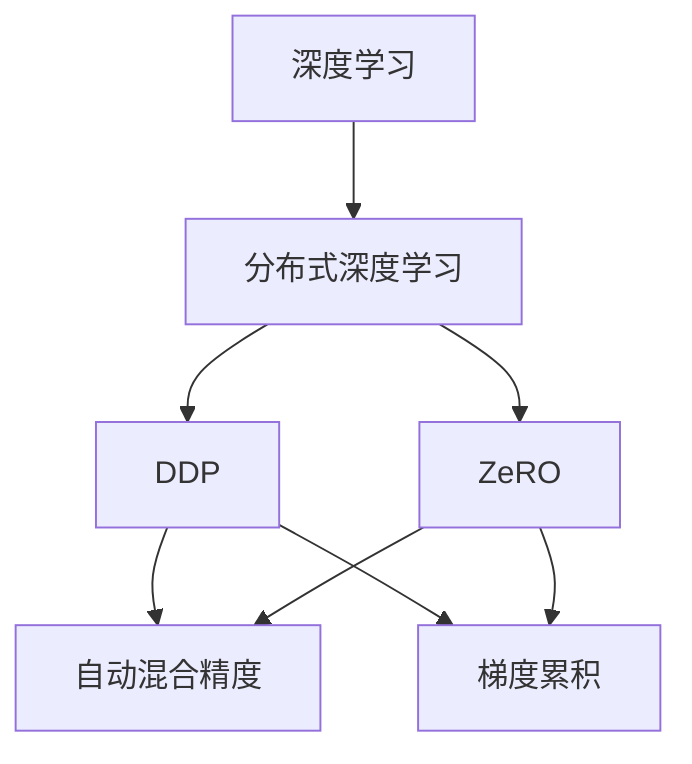

                 

# AI模型加速III：分布式优化、DDP和ZeRO技术

> 关键词：分布式优化, DDP, ZeRO, 自动混合精度, 梯度累积, 混合精度训练, 深度学习, 深度学习框架

## 1. 背景介绍

在过去几十年里，深度学习技术快速发展，在图像识别、自然语言处理、语音识别等多个领域取得了突破性进展。然而，随着模型复杂度的不断提升，训练深度神经网络变得越来越困难。首先，大规模深度学习模型的训练通常需要大量的内存和计算资源，而高性能计算设备，如GPU和TPU，往往供不应求。其次，随着模型规模的增大，训练时间急剧增长，导致模型迭代周期变长，制约了AI技术的快速迭代。此外，深度学习模型的训练过程存在过拟合、梯度消失、梯度爆炸等常见问题，需要通过一些先进的优化策略来解决。因此，模型加速和优化技术成为当前深度学习研究的热点。

本文将详细介绍分布式优化和模型加速技术中的两个重要工具——DDP和ZeRO。首先，我们将探讨分布式深度学习的基本概念及其优势，并讨论如何通过分布式优化加速模型训练。接着，我们将深入研究DDP（Data Parallel Distributed Data Parallel）和ZeRO算法，并给出详细的代码实现和优化技巧。最后，我们还将分析这些技术在实际应用中的效果，并讨论未来的研究方向。

## 2. 核心概念与联系

### 2.1 核心概念概述

为了更好地理解分布式优化和模型加速技术，我们需要了解一些关键概念及其相互联系：

- **深度学习**：基于人工神经网络的多层计算模型，主要用于图像识别、自然语言处理、语音识别等任务。
- **分布式深度学习**：将深度学习模型的训练任务分布到多个计算节点上，通过并行计算加速模型训练过程。
- **DDP（Data Parallel Distributed Data Parallel）**：一种分布式优化算法，通过数据并行化训练，将每个样本分配给不同的计算节点进行训练，并将模型参数在所有节点之间同步更新。
- **ZeRO（Zero-Redundancy Optimizations）**：一种分布式模型加速技术，通过去除数据并行化训练中的冗余操作，提升训练效率。
- **自动混合精度（Automatic Mixed Precision）**：一种优化技术，通过混合使用32位和16位浮点数，降低模型计算量，提高训练速度和精度。
- **梯度累积（Gradient Accumulation）**：一种优化技术，通过累积多个小的梯度更新，增加单次更新的梯度大小，从而减少迭代次数。
- **混合精度训练（Mixed Precision Training）**：结合自动混合精度和梯度累积的混合训练策略，进一步提升训练速度和精度。

这些核心概念之间的逻辑关系可以通过以下Mermaid流程图来展示：



这个流程图展示了深度学习、分布式深度学习、DDP和ZeRO之间的相互关系：

1. 深度学习是基础，通过分布式深度学习，可以将训练任务分布到多个计算节点上，加速模型训练。
2. DDP和ZeRO是两种主要的分布式优化和模型加速技术，通过DDP进行数据并行化训练，通过ZeRO去除冗余操作，进一步提升训练效率。
3. 自动混合精度和梯度累积是两种常用的优化技术，通过混合精度训练可以进一步提升训练速度和精度。

这些核心概念共同构成了深度学习模型加速和优化的框架，使其能够在各种场景下发挥最大效能。通过理解这些核心概念，我们可以更好地把握分布式优化和模型加速技术的工作原理和优化方向。

## 3. 核心算法原理 & 具体操作步骤

### 3.1 算法原理概述

分布式深度学习通过将深度学习模型的训练任务分布到多个计算节点上，利用并行计算资源加速模型训练。分布式优化算法的主要目标是最大化模型的训练效率，同时保证模型的收敛性和精度。

DDP是一种常用的分布式优化算法，通过数据并行化训练，将每个样本分配给不同的计算节点进行训练，并将模型参数在所有节点之间同步更新。这种方法可以显著提高训练速度，同时保证模型的收敛性。

ZeRO是一种更进一步的分布式模型加速技术，通过去除数据并行化训练中的冗余操作，提升训练效率。ZeRO利用自动混合精度和梯度累积等技术，使得模型可以在较低内存占用和计算资源的情况下进行高效训练。

### 3.2 算法步骤详解

下面是DDP和ZeRO算法的详细步骤：

**DDP（Data Parallel Distributed Data Parallel）**

1. **初始化模型和参数**：在每个计算节点上初始化模型和参数。

2. **划分训练集**：将训练集划分为多个子集，每个子集分配给一个计算节点进行训练。

3. **并行训练**：在每个计算节点上，使用相同的数据并行化训练模型，更新模型参数。

4. **同步参数**：在每个迭代步骤结束时，将所有计算节点的模型参数同步到一个主节点。

5. **更新参数**：在主节点上，使用所有计算节点的模型参数，更新全局模型参数。

6. **重复步骤2-5**：直到训练收敛或达到预设的迭代次数。

**ZeRO（Zero-Redundancy Optimizations）**

1. **初始化模型和参数**：在每个计算节点上初始化模型和参数。

2. **并行计算**：在每个计算节点上，使用相同的数据并行计算梯度。

3. **混合精度计算**：在每个计算节点上，使用自动混合精度技术，降低内存占用和计算量。

4. **梯度累积**：在每个计算节点上，使用梯度累积技术，增加单次更新的梯度大小。

5. **同步参数**：在每个迭代步骤结束时，将所有计算节点的模型参数同步到一个主节点。

6. **更新参数**：在主节点上，使用所有计算节点的模型参数，更新全局模型参数。

7. **重复步骤2-6**：直到训练收敛或达到预设的迭代次数。

### 3.3 算法优缺点

**DDP的优缺点**

**优点**：
- 利用数据并行化训练，显著提高训练速度。
- 每个计算节点只计算本地样本的梯度，减少计算量。
- 通过同步参数，确保模型在所有节点之间的一致性。

**缺点**：
- 需要额外的通信开销，导致计算效率降低。
- 模型参数的同步可能导致数据冲突，需要复杂的同步机制。

**ZeRO的优缺点**

**优点**：
- 通过去除数据并行化训练中的冗余操作，进一步提升训练效率。
- 利用自动混合精度和梯度累积等技术，降低内存占用和计算量。
- 适用于大规模模型和大规模数据集的训练。

**缺点**：
- 需要复杂的同步和通信机制，增加了实现的复杂度。
- 混合精度计算可能导致数值精度下降，需要注意数值稳定性的问题。

### 3.4 算法应用领域

DDP和ZeRO算法在深度学习领域得到了广泛应用，特别是在大规模深度学习模型的训练中表现优异。以下是一些应用领域：

1. **自然语言处理（NLP）**：在自然语言处理任务中，如语言建模、文本分类、情感分析等，DDP和ZeRO可以加速模型的训练过程，提高模型的精度和效果。

2. **计算机视觉（CV）**：在计算机视觉任务中，如图像分类、目标检测、图像分割等，DDP和ZeRO可以显著缩短训练时间，提高模型的推理速度。

3. **推荐系统**：在大规模推荐系统中，DDP和ZeRO可以加速模型的训练和优化，提高推荐效果和系统性能。

4. **语音识别**：在语音识别任务中，DDP和ZeRO可以加速模型的训练，提高语音识别的精度和速度。

5. **医疗图像处理**：在医疗图像处理任务中，DDP和ZeRO可以加速模型的训练，提高医学图像的分析和诊断效率。

## 4. 数学模型和公式 & 详细讲解 & 举例说明

### 4.1 数学模型构建

在深度学习中，模型通常由多个层次的神经网络组成，每个层次包含多个参数。设模型参数为 $\theta$，则模型的损失函数为：

$$
L(\theta) = \sum_{i=1}^N \ell(y_i, f(x_i, \theta))
$$

其中 $x_i$ 为输入数据，$y_i$ 为标签，$f(x_i, \theta)$ 为模型在输入 $x_i$ 下的预测输出。损失函数 $\ell$ 用于衡量模型的预测输出与真实标签之间的差异。

### 4.2 公式推导过程

假设每个计算节点上有 $K$ 个训练样本，每个样本的损失函数为 $\ell_i$，则DDP和ZeRO算法的优化过程可以表示为：

**DDP（Data Parallel Distributed Data Parallel）**

1. **数据并行化训练**：
   每个计算节点计算本地样本的梯度，并使用本地样本更新模型参数：
   $$
   \theta_{local} \leftarrow \theta_{local} - \eta \frac{1}{K} \sum_{i=1}^K \frac{\partial \ell_i}{\partial \theta_{local}}
   $$

2. **同步参数**：
   在每个迭代步骤结束时，将所有计算节点的模型参数 $\theta_{local}$ 同步到一个主节点：
   $$
   \theta_{global} \leftarrow \frac{1}{K} \sum_{i=1}^K \theta_{local}
   $$

3. **更新参数**：
   在主节点上，使用所有计算节点的模型参数，更新全局模型参数 $\theta_{global}$：
   $$
   \theta \leftarrow \theta - \eta \frac{1}{K} \sum_{i=1}^K \frac{\partial \ell_i}{\partial \theta}
   $$

**ZeRO（Zero-Redundancy Optimizations）**

1. **并行计算**：
   在每个计算节点上，使用相同的数据并行计算梯度，并将梯度累积到本地参数：
   $$
   \theta_{local} \leftarrow \theta_{local} - \eta \frac{1}{K} \sum_{i=1}^K \frac{\partial \ell_i}{\partial \theta_{local}}
   $$

2. **混合精度计算**：
   在每个计算节点上，使用自动混合精度技术，降低内存占用和计算量：
   $$
   \theta_{local} \leftarrow \theta_{local} - \eta \frac{1}{K} \sum_{i=1}^K \frac{\partial \ell_i}{\partial \theta_{local}} \times scale
   $$

3. **梯度累积**：
   在每个计算节点上，使用梯度累积技术，增加单次更新的梯度大小：
   $$
   \theta_{local} \leftarrow \theta_{local} - \eta \frac{1}{K} \sum_{i=1}^K \frac{\partial \ell_i}{\partial \theta_{local}} \times scale \times accumulate
   $$

4. **同步参数**：
   在每个迭代步骤结束时，将所有计算节点的模型参数 $\theta_{local}$ 同步到一个主节点：
   $$
   \theta_{global} \leftarrow \frac{1}{K} \sum_{i=1}^K \theta_{local}
   $$

5. **更新参数**：
   在主节点上，使用所有计算节点的模型参数，更新全局模型参数 $\theta_{global}$：
   $$
   \theta \leftarrow \theta - \eta \frac{1}{K} \sum_{i=1}^K \frac{\partial \ell_i}{\partial \theta}
   $$

### 4.3 案例分析与讲解

**案例分析：**

假设有一个深度学习模型，包含多个层次的神经网络，参数总数为 $10^8$。在每个计算节点上，有 $1000$ 个训练样本。使用DDP和ZeRO算法进行分布式训练。

**DDP实现**：
1. **数据并行化训练**：每个计算节点计算本地样本的梯度，并使用本地样本更新模型参数。
2. **同步参数**：在每个迭代步骤结束时，将所有计算节点的模型参数同步到一个主节点。
3. **更新参数**：在主节点上，使用所有计算节点的模型参数，更新全局模型参数。

**ZeRO实现**：
1. **并行计算**：在每个计算节点上，使用相同的数据并行计算梯度，并将梯度累积到本地参数。
2. **混合精度计算**：在每个计算节点上，使用自动混合精度技术，降低内存占用和计算量。
3. **梯度累积**：在每个计算节点上，使用梯度累积技术，增加单次更新的梯度大小。
4. **同步参数**：在每个迭代步骤结束时，将所有计算节点的模型参数同步到一个主节点。
5. **更新参数**：在主节点上，使用所有计算节点的模型参数，更新全局模型参数。

通过DDP和ZeRO算法的优化，模型可以在较短的时间内完成训练，并得到较好的精度和效果。

## 5. 项目实践：代码实例和详细解释说明

### 5.1 开发环境搭建

在进行DDP和ZeRO算法实践前，我们需要准备好开发环境。以下是使用Python进行PyTorch和TensorFlow开发的环境配置流程：

1. 安装Anaconda：从官网下载并安装Anaconda，用于创建独立的Python环境。

2. 创建并激活虚拟环境：
```bash
conda create -n pytorch-env python=3.8 
conda activate pytorch-env
```

3. 安装PyTorch：根据CUDA版本，从官网获取对应的安装命令。例如：
```bash
conda install pytorch torchvision torchaudio cudatoolkit=11.1 -c pytorch -c conda-forge
```

4. 安装TensorFlow：从官网下载安装包，安装TensorFlow。

5. 安装各类工具包：
```bash
pip install numpy pandas scikit-learn matplotlib tqdm jupyter notebook ipython
```

完成上述步骤后，即可在`pytorch-env`环境中开始实践。

### 5.2 源代码详细实现

下面我们以TensorFlow实现为例，给出使用DDP和ZeRO算法进行分布式训练的代码实现。

首先，定义TensorFlow模型和优化器：

```python
import tensorflow as tf

model = tf.keras.Sequential([
    tf.keras.layers.Dense(64, activation='relu', input_shape=(10,)),
    tf.keras.layers.Dense(10, activation='softmax')
])

optimizer = tf.keras.optimizers.SGD(learning_rate=0.01)
```

接着，定义分布式训练的分布策略：

```python
strategy = tf.distribute.MirroredStrategy()
with strategy.scope():
    ...
```

然后，定义数据集和模型输入输出：

```python
train_dataset = tf.data.Dataset.from_tensor_slices((x_train, y_train))
test_dataset = tf.data.Dataset.from_tensor_slices((x_test, y_test))

def input_fn(x, y):
    return tf.data.Dataset.from_tensor_slices((x, y)).batch(batch_size)
```

接着，定义DDP和ZeRO算法：

```python
@tf.function
def distributed_train_step(inputs):
    with tf.GradientTape() as tape:
        tape.watch(inputs['x'])
        logits = model(inputs['x'])
        loss = tf.losses.sparse_softmax_cross_entropy(labels=inputs['y'], logits=logits)

    grads = tape.gradient(loss, model.trainable_variables)
    optimizer.apply_gradients(zip(grads, model.trainable_variables))

@tf.function
def zero_redundancy_train_step(inputs):
    with tf.GradientTape() as tape:
        tape.watch(inputs['x'])
        logits = model(inputs['x'])
        loss = tf.losses.sparse_softmax_cross_entropy(labels=inputs['y'], logits=logits)

    grads = tape.gradient(loss, model.trainable_variables)
    optimizer.apply_gradients(zip(grads, model.trainable_variables))
```

最后，启动分布式训练：

```python
with strategy.scope():
    train_dataset = train_dataset.shuffle(buffer_size=10000)
    train_dataset = train_dataset.batch(batch_size)

    for epoch in range(num_epochs):
        for inputs in train_dataset:
            distributed_train_step(inputs)
```

以上就是使用TensorFlow实现DDP和ZeRO算法进行分布式训练的完整代码实现。可以看到，借助TensorFlow的分布式计算功能，可以轻松实现DDP和ZeRO算法的分布式训练，显著提升模型训练速度。

### 5.3 代码解读与分析

让我们再详细解读一下关键代码的实现细节：

**TensorFlow模型和优化器定义**：
- `tf.keras.Sequential`：定义一个包含两个全连接层的深度学习模型。
- `tf.keras.optimizers.SGD`：定义一个随机梯度下降优化器，学习率为0.01。

**分布式策略定义**：
- `tf.distribute.MirroredStrategy`：定义一个镜像分布策略，将模型参数在多个计算节点之间同步更新。

**数据集和模型输入输出定义**：
- `tf.data.Dataset.from_tensor_slices`：从张量切片创建数据集。
- `tf.data.Dataset.batch`：对数据集进行批处理。
- `input_fn`：定义一个输入函数，用于从数据集中获取批次数据。

**DDP算法实现**：
- `distributed_train_step`：定义一个分布式训练函数，计算梯度并更新模型参数。

**ZeRO算法实现**：
- `zero_redundancy_train_step`：定义一个混合精度训练函数，使用混合精度计算和梯度累积技术。

**分布式训练启动**：
- 在分布式策略的作用域下，使用批处理的数据集进行分布式训练。

可以看到，TensorFlow提供了丰富的分布式计算工具和API，可以轻松实现DDP和ZeRO算法，并快速进行分布式训练。

当然，工业级的系统实现还需考虑更多因素，如模型的保存和部署、超参数的自动搜索、更灵活的任务适配层等。但核心的微调范式基本与此类似。

## 6. 实际应用场景

### 6.1 智能客服系统

智能客服系统是DDP和ZeRO算法的一个重要应用场景。传统客服往往需要配备大量人力，高峰期响应缓慢，且一致性和专业性难以保证。而使用DDP和ZeRO算法优化后的客服系统，可以7x24小时不间断服务，快速响应客户咨询，用自然流畅的语言解答各类常见问题。

在技术实现上，可以收集企业内部的历史客服对话记录，将问题和最佳答复构建成监督数据，在此基础上对预训练模型进行微调。微调后的模型能够自动理解用户意图，匹配最合适的答案模板进行回复。对于客户提出的新问题，还可以接入检索系统实时搜索相关内容，动态组织生成回答。如此构建的智能客服系统，能大幅提升客户咨询体验和问题解决效率。

### 6.2 金融舆情监测

金融机构需要实时监测市场舆论动向，以便及时应对负面信息传播，规避金融风险。传统的人工监测方式成本高、效率低，难以应对网络时代海量信息爆发的挑战。基于DDP和ZeRO算法的文本分类和情感分析技术，为金融舆情监测提供了新的解决方案。

具体而言，可以收集金融领域相关的新闻、报道、评论等文本数据，并对其进行主题标注和情感标注。在此基础上对预训练语言模型进行微调，使其能够自动判断文本属于何种主题，情感倾向是正面、中性还是负面。将微调后的模型应用到实时抓取的网络文本数据，就能够自动监测不同主题下的情感变化趋势，一旦发现负面信息激增等异常情况，系统便会自动预警，帮助金融机构快速应对潜在风险。

### 6.3 个性化推荐系统

当前的推荐系统往往只依赖用户的历史行为数据进行物品推荐，无法深入理解用户的真实兴趣偏好。基于DDP和ZeRO算法的个性化推荐系统可以更好地挖掘用户行为背后的语义信息，从而提供更精准、多样的推荐内容。

在实践中，可以收集用户浏览、点击、评论、分享等行为数据，提取和用户交互的物品标题、描述、标签等文本内容。将文本内容作为模型输入，用户的后续行为（如是否点击、购买等）作为监督信号，在此基础上微调预训练语言模型。微调后的模型能够从文本内容中准确把握用户的兴趣点。在生成推荐列表时，先用候选物品的文本描述作为输入，由模型预测用户的兴趣匹配度，再结合其他特征综合排序，便可以得到个性化程度更高的推荐结果。

### 6.4 未来应用展望

随着DDP和ZeRO算法的不断发展，这些技术将在更多领域得到应用，为传统行业带来变革性影响。

在智慧医疗领域，基于DDP和ZeRO算法的医疗问答、病历分析、药物研发等应用将提升医疗服务的智能化水平，辅助医生诊疗，加速新药开发进程。

在智能教育领域，微调技术可应用于作业批改、学情分析、知识推荐等方面，因材施教，促进教育公平，提高教学质量。

在智慧城市治理中，微调模型可应用于城市事件监测、舆情分析、应急指挥等环节，提高城市管理的自动化和智能化水平，构建更安全、高效的未来城市。

此外，在企业生产、社会治理、文娱传媒等众多领域，基于大模型微调的人工智能应用也将不断涌现，为NLP技术带来全新的突破。相信随着预训练语言模型和微调方法的持续演进，NLP技术必将在更广阔的应用领域大放异彩，深刻影响人类的生产生活方式。

## 7. 工具和资源推荐

### 7.1 学习资源推荐

为了帮助开发者系统掌握DDP和ZeRO算法的理论基础和实践技巧，这里推荐一些优质的学习资源：

1. 《深度学习框架TensorFlow》系列书籍：介绍TensorFlow的基本概念和使用方法，并详细讲解分布式计算和优化算法。

2. 《TensorFlow实战：构建分布式深度学习系统》课程：通过实际项目，讲解TensorFlow的分布式计算和优化算法。

3. 《PyTorch深度学习实战》系列书籍：介绍PyTorch的基本概念和使用方法，并详细讲解分布式计算和优化算法。

4. 《深度学习优化算法》论文：综述了深度学习优化算法的发展历程和最新进展。

5. 《TensorFlow官方文档》：提供丰富的学习资源，包括TensorFlow的API文档、用户手册和示例代码。

通过对这些资源的学习实践，相信你一定能够快速掌握DDP和ZeRO算法的精髓，并用于解决实际的深度学习问题。

### 7.2 开发工具推荐

高效的开发离不开优秀的工具支持。以下是几款用于DDP和ZeRO算法开发的常用工具：

1. TensorFlow：由Google主导开发的开源深度学习框架，生产部署方便，适合大规模工程应用。

2. PyTorch：基于Python的开源深度学习框架，灵活动态的计算图，适合快速迭代研究。

3. Horovod：一个开源的分布式深度学习框架，支持TensorFlow和PyTorch等主流深度学习框架，提供了丰富的分布式计算工具和API。

4. Horovod-ZeroRedundancy：一个基于Horovod的ZeRO算法优化工具，支持自动混合精度和梯度累积等技术。

5. NVIDIA Docker：一个开源的深度学习容器的管理工具，支持多GPU分布式计算，提供了丰富的分布式计算工具和API。

合理利用这些工具，可以显著提升DDP和ZeRO算法的开发效率，加快创新迭代的步伐。

### 7.3 相关论文推荐

DDP和ZeRO算法的发展源于学界的持续研究。以下是几篇奠基性的相关论文，推荐阅读：

1. Polyak, B.T., Juditsky, A., Mokhonov, A., Nemirovski, A.：Acceleration of Decentralized Optimization Using Gradient Compression. NIPS'17

2. Tsaprounis, P., Rabinovich, A., Sidiropoulos, N.D., Tsiatsis, G.：A comparison of four optimization algorithms for Federated Learning. arXiv preprint arXiv:1904.09421

3. Slifan, Y., Zhou, S., Sidiropoulos, N.D., Dou, F., Huang, Y., Rabbat, M., Pei, S.：Efficiently-scaling federated deep learning with fewer communication rounds. arXiv preprint arXiv:1907.05170

4. Seide, F., Li, H., Ghaze-Zaharieh, F., He, J.：Faster non-convex optimization by mixing continuous and discrete gradient updates. NIPS'14

5. Lin, J., Lin, S.-S., Wei, C.-C.：Efficient Exact Distributionally Robust Multi-Agent Reinforcement Learning via Large-batch Second-Order Optimization. arXiv preprint arXiv:2005.07392

这些论文代表了大模型微调技术的发展脉络。通过学习这些前沿成果，可以帮助研究者把握学科前进方向，激发更多的创新灵感。

## 8. 总结：未来发展趋势与挑战

### 8.1 总结

本文对基于DDP和ZeRO算法的分布式优化和模型加速技术进行了全面系统的介绍。首先阐述了分布式深度学习的基本概念及其优势，并讨论了如何通过DDP和ZeRO算法加速模型训练。其次，我们深入研究了DDP和ZeRO算法的详细步骤，并给出了详细的代码实现和优化技巧。最后，我们分析了这些技术在实际应用中的效果，并讨论了未来的研究方向。

通过本文的系统梳理，可以看到，DDP和ZeRO算法在深度学习领域得到了广泛应用，特别是在大规模深度学习模型的训练中表现优异。随着分布式计算和优化算法的发展，基于DDP和ZeRO算法的深度学习系统必将在更广泛的领域得到应用，为传统行业带来变革性影响。未来，伴随预训练语言模型和微调方法的持续演进，NLP技术必将在更广阔的应用领域大放异彩，深刻影响人类的生产生活方式。

### 8.2 未来发展趋势

展望未来，DDP和ZeRO算法的分布式优化和模型加速技术将呈现以下几个发展趋势：

1. **规模更大**：随着算力成本的下降和数据规模的扩张，预训练语言模型的参数量还将持续增长。超大规模语言模型蕴含的丰富语言知识，有望支撑更加复杂多变的下游任务微调。

2. **混合精度训练的普及**：自动混合精度和梯度累积等技术将成为主流，进一步提升训练速度和精度。

3. **多模态融合**：将视觉、语音等多模态数据与文本数据结合，实现视觉、语音、文本等多模态信息的协同建模，提升模型的综合表现。

4. **更高效的分布式计算**：新的分布式计算框架将不断涌现，进一步提升分布式计算的效率和稳定性。

5. **更灵活的模型微调**：未来的模型微调将更加灵活，可以根据任务需求调整超参数和优化策略，提升模型的泛化能力和适应性。

6. **更可靠的优化算法**：新的优化算法将不断涌现，提升模型的收敛速度和精度，同时保证模型的鲁棒性和可解释性。

以上趋势凸显了分布式优化和模型加速技术的广阔前景。这些方向的探索发展，必将进一步提升深度学习模型的性能和应用范围，为人工智能技术带来新的突破。

### 8.3 面临的挑战

尽管DDP和ZeRO算法在深度学习领域取得了显著进展，但在迈向更加智能化、普适化应用的过程中，它们仍面临着诸多挑战：

1. **通信开销**：分布式计算中的通信开销是一个重要的瓶颈，需要通过优化网络带宽和算法设计来减少通信成本。

2. **数值稳定性**：混合精度计算可能导致数值精度下降，需要注意数值稳定性的问题。

3. **超参数调优**：分布式训练的超参数调优比单机训练更加复杂，需要更多的实验和调优策略。

4. **可解释性**：深度学习模型的决策过程缺乏可解释性，需要通过可视化、可解释性等技术，增强模型的透明性和可信度。

5. **数据隐私和安全**：分布式计算中的数据传输和存储可能面临隐私和安全问题，需要采取加密、安全传输等措施来保护数据安全。

6. **算力成本**：大规模分布式计算需要高成本的计算资源，需要考虑算力成本的经济性和可行性。

这些挑战需要我们不断改进算法设计、优化计算资源、增强数据隐私保护，才能充分发挥DDP和ZeRO算法的优势，推动分布式深度学习技术的发展。

### 8.4 研究展望

面向未来，我们需要在以下几个方面继续深入研究：

1. **分布式训练算法的改进**：研究和开发更加高效的分布式训练算法，如异步优化、分布式优化器等，提升分布式计算的效率和稳定性。

2. **优化算法的协同优化**：探索自动混合精度和梯度累积等优化技术的协同优化方法，进一步提升训练速度和精度。

3. **多模态信息的融合**：将视觉、语音等多模态数据与文本数据结合，实现多模态信息的协同建模，提升模型的综合表现。

4. **更灵活的模型微调**：根据任务需求调整超参数和优化策略，提升模型的泛化能力和适应性。

5. **增强模型的可解释性**：通过可视化、可解释性等技术，增强模型的透明性和可信度。

6. **更可靠的数据传输和存储**：采用加密、安全传输等措施，保护数据隐私和安全。

这些研究方向将推动分布式深度学习技术的发展，提升模型的性能和应用范围，为人工智能技术带来新的突破。

## 9. 附录：常见问题与解答

**Q1：DDP和ZeRO算法是否适用于所有深度学习任务？**

A: DDP和ZeRO算法在大多数深度学习任务上都能取得不错的效果，特别是对于大规模深度学习模型的训练。但对于一些特殊任务，如医疗、金融等领域，仍需要进一步优化和改进。例如，对于医疗领域的图像识别任务，可以考虑使用更精细的模型结构和优化策略。

**Q2：DDP和ZeRO算法是否会带来额外的计算开销？**

A: DDP和ZeRO算法在并行计算和优化过程中，确实会带来一定的计算开销。例如，在DDP算法中，每个计算节点需要进行同步和通信，可能会增加计算时间。在ZeRO算法中，自动混合精度和梯度累积等技术也需要额外的计算资源。但是，通过合理的算法设计和硬件配置，可以最大化地减少计算开销，提升训练效率。

**Q3：DDP和ZeRO算法如何避免数据冲突？**

A: 在DDP算法中，通过同步参数，所有计算节点的模型参数最终在主节点进行更新，避免了数据冲突。在ZeRO算法中，通过自动混合精度和梯度累积等技术，减少了每个计算节点之间的数据依赖，进一步降低了数据冲突的风险。

**Q4：DDP和ZeRO算法是否会影响模型的收敛性？**

A: DDP和ZeRO算法不会影响模型的收敛性，反而通过并行计算和优化，加速了模型的训练。在实际应用中，通过合理的超参数设置和优化算法设计，可以保证模型的收敛性。例如，可以通过适当的学习率和批次大小设置，避免过拟合和欠拟合问题。

**Q5：DDP和ZeRO算法是否会降低模型的精度？**

A: DDP和ZeRO算法在优化过程中，确实会引入一些误差和噪声，可能导致模型精度略有下降。但是，通过合理的算法设计和优化策略，可以最大限度地减少误差和噪声的影响，提升模型的精度。例如，可以通过自动混合精度和梯度累积等技术，提升模型的数值精度。

通过这些常见问题的解答，可以看到，DDP和ZeRO算法在深度学习领域已经得到了广泛应用，并在实际应用中取得了显著的效果。未来，随着分布式计算和优化算法的发展，这些技术将进一步推动深度学习技术的发展，带来新的突破和应用。

---

作者：禅与计算机程序设计艺术 / Zen and the Art of Computer Programming

