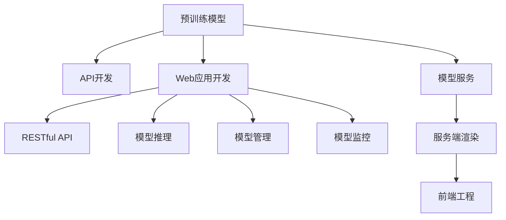

                 

# AI模型部署：构建API和Web应用

> 关键词：AI模型部署, API开发, Web应用, Flask, RESTful, 模型服务器, 服务端渲染, 前端工程

## 1. 背景介绍

### 1.1 问题由来

随着人工智能(AI)技术的迅猛发展，越来越多的AI模型被开发出来并应用于实际场景中。这些模型不仅需要高性能的训练过程，还需要稳定可靠的部署方式，以便在生产环境中被集成和调用。传统的部署方式如编写DLL、静态库等，已经难以满足当前需求，而基于API的Web应用部署成为了新一代的部署标准。

AI模型的部署不仅包括模型的训练和推理，还包括模型服务的管理、监控和优化。通过构建API和Web应用，可以将AI模型封装成易于访问和使用的服务，使得不同应用场景可以方便地调用和集成这些模型。

### 1.2 问题核心关键点

构建AI模型的API和Web应用，需要明确以下几个关键点：

- 选择合适的Web框架：基于Python的Flask和Django是常用的Web框架，具备灵活、易用的特点，适合快速开发。
- 确定API接口设计：需要定义清晰的API接口规范，以便不同客户端可以准确调用模型服务。
- 实现高效的模型推理：需要设计高效的推理框架，保证模型在生产环境中的性能和稳定性。
- 设计合理的数据传输格式：通常使用JSON作为数据传输格式，便于不同系统间的数据交互。
- 实现模型管理与监控：需要设计监控模块，及时发现模型服务的问题并进行预警，保证模型的高可用性和稳定性。

通过明确这些关键点，可以构建出一个稳定、高效、易用的AI模型API和Web应用。

## 2. 核心概念与联系

### 2.1 核心概念概述

为更好地理解基于API和Web应用的AI模型部署方法，本节将介绍几个密切相关的核心概念：

- 预训练模型：在大量无标签数据上进行预训练，学习通用的语言或图像特征表示，具备较强的泛化能力。
- API：应用程序编程接口，用于在不同的软件系统间传输数据和功能，支持各种客户端的调用。
- Web应用：通过Web服务器和浏览器进行交互的应用程序，具备高可用性和跨平台特性。
- RESTful API：符合REST架构风格的API，使用HTTP协议进行数据传输，支持CRUD操作。
- Flask：Python语言下的轻量级Web框架，简单易用，灵活高效，适用于快速开发API和Web应用。
- 模型服务：将AI模型封装成Web服务，通过API接口进行调用，便于集成到各种应用场景中。

这些核心概念之间的逻辑关系可以通过以下Mermaid流程图来展示：



这个流程图展示了她各个核心概念及其之间的关系：

1. 预训练模型通过API和Web应用进行部署，能够更好地适应各种应用场景。
2. API接口设计方便客户端调用，而Web应用提供用户界面，增强用户体验。
3. RESTful API是常用的API接口设计规范，支持高效的数据传输。
4. 模型服务通过API接口进行调用，便于集成到不同系统中。
5. 模型推理、管理与监控模块组成模型服务，保证模型的高可用性和稳定性。
6. 服务端渲染和前端工程构建完整的Web应用，实现前后端分离，提升开发效率。

## 3. 核心算法原理 & 具体操作步骤
### 3.1 算法原理概述

基于API和Web应用的AI模型部署，其核心思想是通过Web服务将AI模型封装成API接口，便于各种客户端进行调用。API接口的输入参数包括模型需要的输入数据、任务标识等，输出参数包括模型推理结果。

形式化地，假设模型为 $M_{\theta}$，其中 $\theta$ 为模型参数。API接口定义如下：

$$
\text{API}(x_i, y_i) = \{M_{\theta}(x_i)| x_i \in X, y_i \in Y\}
$$

其中 $X$ 为模型输入空间的集合，$Y$ 为模型输出空间的集合。API接口使用HTTP协议，支持GET、POST等请求方式，通常使用JSON格式传输数据。

### 3.2 算法步骤详解

基于API和Web应用的AI模型部署，一般包括以下几个关键步骤：

**Step 1: 构建Web应用框架**

- 选择合适的Web框架，如Flask或Django，搭建Web应用基础结构。
- 设计API接口规范，定义清晰的输入和输出数据格式。
- 实现API接口，使用Python代码实现API的业务逻辑。

**Step 2: 实现模型推理模块**

- 加载预训练模型，并进行必要的预处理。
- 实现模型的推理逻辑，支持多批次输入数据并行处理。
- 设计推理结果的编码和传输方式，保证数据的正确性和可读性。

**Step 3: 实现模型管理模块**

- 提供API接口，支持模型加载、保存、删除等基本管理操作。
- 设计模型版本控制策略，支持模型的回滚和更新。
- 提供模型性能评估和监控，及时发现模型服务的问题。

**Step 4: 实现模型监控模块**

- 设计监控指标，包括模型推理时间、内存占用、异常率等。
- 使用统计方法和告警机制，及时发现模型服务的异常情况。
- 提供可视化界面，展示模型服务的实时状态和历史数据。

**Step 5: 部署Web应用**

- 选择合适的部署平台，如AWS、阿里云等云服务平台。
- 配置Web服务器和数据库，保证系统的高可用性和稳定性。
- 进行系统测试和优化，保证Web应用的性能和安全性。

**Step 6: 维护和更新**

- 定期更新预训练模型，保持模型的高性能和泛化能力。
- 根据用户反馈和需求变化，优化API接口和服务功能。
- 监控系统性能和异常情况，及时处理和解决出现的问题。

以上是基于API和Web应用的AI模型部署的一般流程。在实际应用中，还需要针对具体任务的特点，对各个环节进行优化设计，如改进推理效率、设计更好的监控指标、引入更多的数据增强技术等，以进一步提升模型服务的性能和可靠性。

### 3.3 算法优缺点

基于API和Web应用的AI模型部署方法具有以下优点：

- 灵活高效：通过API接口实现模型的封装和调用，能够快速适应各种应用场景。
- 稳定可靠：将模型封装成服务，便于监控和管理，保证系统的高可用性和稳定性。
- 性能优越：基于Web应用的架构设计，支持水平扩展和负载均衡，保证模型推理的性能和吞吐量。
- 可扩展性强：支持多用户和多任务，能够灵活应对复杂的应用需求。
- 易于维护：API接口和Web应用分离开发，便于维护和更新。

同时，该方法也存在一些局限性：

- 依赖云服务：基于云平台部署，需要一定程度的资源和技术投入。
- 安全性问题：API接口的安全性问题需要特别注意，防止恶意攻击和数据泄露。
- 性能瓶颈：Web应用的架构设计需要优化，避免性能瓶颈和资源浪费。
- 数据传输延迟：基于HTTP协议的数据传输，可能存在一定的延迟，影响实时性需求。
- 技术门槛高：需要具备一定的Web开发和系统部署知识，技术门槛较高。

尽管存在这些局限性，但就目前而言，基于API和Web应用的部署方法仍是大模型应用的主流范式。未来相关研究的重点在于如何进一步降低技术门槛，提升模型的实时性和安全性，同时兼顾可扩展性和易用性。

### 3.4 算法应用领域

基于API和Web应用的AI模型部署方法，已经在多个领域得到广泛应用，例如：

- 自然语言处理(NLP)：将模型封装成API接口，支持文本分类、情感分析、机器翻译等任务。
- 计算机视觉(CV)：将模型封装成API接口，支持图像识别、目标检测、图像生成等任务。
- 智能推荐系统：将模型封装成API接口，支持商品推荐、内容推荐等任务。
- 智能客服系统：将模型封装成API接口，支持自动回复、意图识别等任务。
- 医疗诊断系统：将模型封装成API接口，支持疾病诊断、影像分析等任务。

除了上述这些经典应用外，基于API和Web应用的AI模型部署方法，还在更多的领域得到创新性地应用，如可控文本生成、对话系统、情感分析等，为AI技术的发展提供了新的方向。

## 4. 数学模型和公式 & 详细讲解  
### 4.1 数学模型构建

本节将使用数学语言对基于API和Web应用的AI模型部署过程进行更加严格的刻画。

假设预训练模型为 $M_{\theta}$，其中 $\theta$ 为模型参数。API接口定义为：

$$
\text{API}(x_i, y_i) = \{M_{\theta}(x_i)| x_i \in X, y_i \in Y\}
$$

其中 $X$ 为模型输入空间的集合，$Y$ 为模型输出空间的集合。API接口使用HTTP协议，支持GET、POST等请求方式，通常使用JSON格式传输数据。

### 4.2 公式推导过程

以下我们以自然语言处理任务中的文本分类为例，推导API接口的设计和数据传输格式。

假设模型 $M_{\theta}$ 的输入为文本序列 $x$，输出为文本类别 $y$，输出空间 $Y$ 为 $N$ 个预定义类别。API接口设计如下：

1. 输入参数：文本序列 $x$ 和任务标识 $y$。
2. 输出参数：模型推理结果，即文本类别 $y$。

API接口使用JSON格式传输数据，示例如下：

```json
{
    "input": "This is an example text.",
    "task": "text_classification"
}
```

API接口设计为GET请求，返回模型推理结果，示例如下：

```json
{
    "result": 3
}
```

其中，结果为整数形式，对应于模型推理得出的类别编号。

### 4.3 案例分析与讲解

**案例：图像分类**

假设要实现图像分类的API接口，输入为图像文件，输出为图像类别。API接口设计如下：

1. 输入参数：图像文件，格式为base64编码的字符串。
2. 输出参数：图像类别，整数形式。

API接口使用POST请求，返回模型推理结果，示例如下：

```json
{
    "input": "iVBORw0KGgoAAAANSUhEUgAAAQAAAAEACAYAAABhdkJvAAAANUlEQVR4nCwsACsKYgG9w4NzlMGRAAAAZdJREFUeNrs3X+0XHV56/HfdnB3iMkmGLx/4G8/EA1gh5YpZFDyGBXWXUhCnKmHUsIjNc5DEIyoj9A4ggNhNhN9ZihhDcWMkoI3BoA5u5Q3N5Ypzj9E8WiHtHORcdiL3z8+l6466uzx8bq1LqdOdO2e+zX8Zr+uwn0qhraU+DIF8gqgAQ+KXQ4AFOlE+P8AAQWGdAKn8VBCMVWQah9gh4tF7V4AKTF7xByp/AAgI/4kAGIvYIc3DADkAIHEEEoCDX1cwBeuXIF8/niGcIYGAjiJ6TuoAaQCD34F8CEP7AACnSj5eI6wyBnqAWlWqvgSkJHEhy9QgAPLA/z/BJP7CGnglyE4SkDpy5kAso3w98A7Qvz9COHQ0gS6aykTw9+VjwME/47A0Qkh9aUZyMF7C6CTyBqIPr7uQESR6AqPTQ3A7AwqzZaAYXQAy5YjNQiEIPi7o4ZQGjeBwDGBvYIzGEx6vFxCaQC/gL4+c3jsgQQ7pYqjwDkf6dELMfj/MctK04yAmE5Ae9g0EgAfiH2YODG28BEGjQn8m4zQoPIVlh0NMfQ+hXHqmYCMPC7pBAi9fLwV6oTXthDqj7lksqwRKPJpJ+0wF/AykviP7fBOyNemzWTpA77ZIuEajnAtEMOh9I7kChtCA+xIEcDl4Dsv3CwEy7YM4sYeP2X2xMTp8A8nn6zA/K7h3SkKQ3IPh/9VQIvPGC0PwVY5qeG8G7Ch1sEDwY1Aog2bN9BLgJzHthwYF0LsGzhao2pE/oG+7l1cFfZ9XnJ6hn7ZHuGzh5h8eYc4S4XEdPDr7Od4AaoUoEfBz7Cj6BfO/EGh6v9rN/q1q1a4K2In0Xe0AgFk5o5UK2Z+vYUZQYvj9T9QfN3gH7kj4QgN+gtzJH+Qn1/CGYq0XE3X3F4U4M+ghh9vFkEopzFgGk/xQTCN2aC8DV4eK6YTvC7f5uOAhFUERXoqO8PBYgKjnweSI3ELQAClAow5wogtZ0a8GPr29FbDx7u7goI9ABJG8B3Q3QiPTSweyE2E9JJ0lDNR+BxTTghK3nB9iAovkhRhgA4qKcGXoKzWlGIMN6A7oZsT9pWK8BzGCf5BQqMYBXAPShg1FY4zgk8hCO4JAMvE+QKR2Zq9QP6w1RHyjuQn3qAAZa/4PcC6vngzgEnYWjeJuD7wGtivnCnB8Z2h7bL7oPupRZ2AviA3QP9dCukq/XmuCM5h2HPGnBZI7ewlzOO4KzFyY/9vDjA6hnMAzMf3K9/vF2EuH8C6fsd7T5WruD8rX/AJDSLTXktwFkN6jeQX5Xvhz2O5G/bxL2A31BZiMuf0E6C6hX0NuTmwzq0Za1A3PgXU1ncwBXt6nVmAnhOoP/BVwBu8f4P8nN5qkA5B/UCeEfs7P+9/+K3uA8+TcItP6WQjv1+kA9B0oGcArP4Iaq9znc5r9+gDLH7X4WyPwLJnC2EYIC/1bSY+x/4LZz9Ht7nEK3wPujvSEq8P7bKb3vqkFJ/8WOBsgXhOyB+ML9X/o6B9gZwMYGscPAkqXGqh3I1wXhUoyuWb6O2Am2C/Amo6IjcF5K/oaqAL47KP29fMQqfW3OBoL9aOvChIoKd+G7SQ+x/CjCP4NWy21x46C/nZmFPOhBe6a0I79O6C4gnBvoXcDz/48hG1IdQBfV1dCRHcD9tI9jLyY/jv2B/bP9Oz6HPXnA1RjqATqRnTvgy6GLI5xCO5dAbyIfE7PfMB74U/kKlV4H/dL/Slz33jWz8oA8JyCK73H/Bg9oBfoPjCv8//DBMvF+k3oP4QG9ePhHYHPynQn5T7A9xkAe9/X+AX3oCO7/+aYHl2Z6P3Dp1uKowO0FmCfEK/vuHnvQJ60f3wXKH+5u/3A0EfeDxgrmRmEGf95t2m0BvA/Qn4vz0Nfd42D/iVbMgH3/0u7DX8w8rt7qD9Bd9n7n7Pm37n3w+mZDmP/nE/Z9H/zXAmT/8T4CwnuP+X++3nvQ/u2h38tBm4Ij+SPpe+OPhkA7AVx5/kfZ+79Zfj/YH4Cwb/B4W8OzYCob5eAj8QyR/A7ovPW+zvyA/PxK/x4ZhD4ZxJsEw7L+oN5B7xzMftz4ZxBOE+3Qy/4092BvU5QjIzMGj/zk4HZjz/GZF/EL/s2x28F92/ibk1Ey+4P93G6bGLTQ8h9ibk3PqGO+P7dVgJmC9ozI/kLZ+Mx+Cq7n5PIXYi+6P4uA9s+ywVjELwF3Fed9l0YT+ht1ewG2hJiLyT3qFuP2OWUraBPfZeSf0Pp/O3fsFbQWYvIz/a+gSQ+xm3O+LnBzAt6SvjfSR9kv4M1Jj8b0D9D1V8Ge1wALw+E+3t2h6Z0B9rK6EvOftW8J2ZMV6Z8Vx3h5keJP2l7Af8K/QbYb8X86/pP6M1In8s/Rl+i34kfZX+t9J/S/8kfCv81/hf6f2GWEPwHbDFoL4QPwJM7iQ/jDcX6P/nf+T6i2gGw9EfTJYb+Q9hRo1bqL8XhP4Mv9L6J/B9K/RDwj+L+F2i0ZfQ8wPwXVkdx2gPoSIR/APSMhP4PqJtH3A/D7/0a/Hvmk/Z/pfZn8vyjK/h9Drk/QL87P8r6Iex34Gfgz+o7xj9V/Kr6L9K/Ff4f4S9J/Fvh7RrJ/Oj8x/q9hJsPqOMpF5f4v2Mqy6zD5XrM7aLsHjK3i7I7ytpq+SM/YBcRq58CfiqseI6jVzzH3QJ6Q3EH9xLxaoYm/gPCNThi8QJ2PyE+j9zj8fLwHkgJ8s+Vd28eH3yLtFPnD+Suv9YQIQJ9wPb/LloaNfgn7+wDiP4b6b/L6ANzr9nQZ1PyU+l9hfq/7T+l/iP6M+qX9yfh6mJy/4T7U/Zr8L5oYJ58QH1yOPHtAv1D9vfxhqKUax1Yw9Xt6xUHmX82cB98P3Gj+B3wGKrPZa5F3LDgJ/gdI1cBvKT9Hv8Fh3YF/j8Uo7EVJQP4LAL9CqOYA7ywGJW/xjH+S9hevH0zWvzV9r4IU+H/ErQNg5Qy+yDB1iHmPHjowOMzGwPy7vAnxAvGcI9G+6p/X8hP8/lP9OI8c+B1Zf7Gv1YzP1wDB/Cziw3+O3a5r5a/klzGpD8yKxwEZj7F2kH++9mIhBvmjm7mXigEVjnRfKP1h6KfCH4l+HfgL9f/FfwdKJ85fsj9Cvk7/R/MrmcY+PJk3XJbge9kYQNt45ugcjyVdV2hXaXu7idvzD7m8cN2XIbMj4WmSLi/4H8k/Snoj3KfQH0C/E/gpMvOe+DZLwj7B/gw5/9r8LHJWcV9LmLuN+Vrj63P8J/Kz87PVn4z6hveJh55vmJ/IO1bRdrr4o6pBgrXFd9g9IuO/j2Pfpr6u+O3Q33g8w+5iFz/7E5n7C/EVw38/8L/K7v8a7APjK2/DO2H/D/zDk6cT7+Ps0+n+DdwIH9C34KXbF/jvGvysE2/M5k/8TJ9/hv5ZPm+9sXPJ9htn3H1vhRu9n0iv8Sfy73rP4APJ39evmH/Vn4Rv3X9VfwD3jB/6n5O8R5rR9x71T8C/LF5+fnc/Gb3v8I9Qvf7j9b/7R8q3nvJf7q+gXWqfgj5bvmA/fXyK7nR8jL4BvX1+0byD/P9w1vHyz3PyRfRX4m+Hzj6+O+C/+p/Pz1f8vfQ/k5+HvjO+Sf1j8zX7w+fHy9f+Qfkn9T6T/nt8Ffn5+N/kG9bX3/+n/FP6P4T+av4O9D/KP1f8WfO76b+Tf6y+O/6v+Wf1RfDp8Z3t/8EjFOfDqd3x+x/xZ+eJ9vNt8b8Ovi1+Hvj8+E3/4j+f/jx+Lv9jT/DLz9/7vfD76b/Pn9H6Jz4/6Q/W/yg+jXwPfPz6q+fX+6/j18KHxp/RPy0+Bq3Q0PfQ9mHX36IHwn/G34fuEo9PzL9SD8Xvjg9L/kb+LH4vOOf2p/Zn1v+M7tqd7I/f4EdsGXgf+X7xg4Vj0P9D/hvG3B/4P+Sj0/1b/Ef4MPmM+v6b/B/8fPqj8fXiP+FvweeKr+MnjS9bz7yFu5sXfoq/BR4Rvhs+BXxXfFh8QvxV8C3xaPFe8RHxBfDh8KngC+FT8CPhR8YnxG+Cj4FPiM+DL4qPhA+Cj4Jvgx+Gj4Qvhb8JnxyfCF4KngY+GnwpeMvwceG/4JvjZ8KnwpfC14qPCp8N3hP8BHiK8FnwMehO9C/hk+B70R+Fz0E+Hr4TPS34BvRI+LTwTvBv4HPRL4MPhS8EzwYvBu8HfwH+BD4Ivgw8FrwVvC58IXhq8Ivw7eCH4DvBp8IPhi8HrwIvB68E7wevB/8HzwNPA98HvwvfB98JfwzfCr4PPgJ+GD4Tvhe8DL4Cvhq+F74hvBk8DzwMfAZ8D/w2fD58GPwafBx8IHwZfAp8CHwJfA18LnwRfA98C3wffAp8MnwFfBJ8FnwNfCp8HngVfBt8I3w0fBJ8H3wJfA98G3wMfAu8F3wAfA98D/wEvA78CXwI/Ai8BLwPfAc8BfwfL/F6Aji5I/g/ANxKp2+JXHdHg5BdH7R7CpZD9nzI3F+C54MZ/6CmP5M+M+4UfDavLX5KvG+4KZu3PjRuLCj+CdxnueGjcf1HuGD8AD4TfAe8D/w4+HjyKfBd8J3gG+Fz0BvA8+ELyA3l0bQ2cUf0t+e/yc8Jnla+GzzF3Ot8vvhF/xb/Ub4b/TX5T8W7g1/LP6A/HP6X+Fv4z/Yn+Dv+U/zx8HPgn9An4J/DZ4E3gq8Afww+BN4BrgEeAz4EPgJ+A74PvhO8Dvww+Bn4F/hi+DLwB/AH8A/xj+BfwDfAd8B/wUeJvwo+LdgOfAvcAvwPfAn8BnwK+FDwEPgF8D7wEvA68BdwKfBZ8JvgceAN4HbgNeA/4GfA78Cfw1eDfwL+B/wl/CO4n/C4cBrwD3AScAVwK/AIcBLwEHAJcBfww/AXwC/DR4VfAOcA1wD3AFcA5wDvAOcCxwHnAK8A/wUeB/4SzgcuB94A+4CzgZuB84Bvgt+AP4E3gT+AL4NPgyeDp4PrgaeD14O3g7eD54OHg8eDx4Prg3eDh4OngxeDd4MfgyeDF4P3gzeDt4Onoxmz0G/i/4CHgR+Bj4C/hZ8A/wDfBt8J3g1+Cp4GfgCeA54BrgS+B14A/gAuAz4L3gReB74BvgyeC54M7g0+C/4JPgZeBv4IPg1eDV4M/g2+D54D3gPeA94C3gBeA94CPgLuA34B3gI+A34MvgOeA74B7gG+AX4Efgv+C/4HPgXeAf4A/gV+Cz4LvgCeAz4DbgduBd4DzgJ+A84HfgeeB/4H3gJeB/4L3gbeB/4N7gG+Ct4PrgTuA84GzgTOA74I3gUeDh4O7gzuDS4OLg8uD64NLg8uD64MHgxeD54PXgzuD64PLg9uDy4MfgyuD64PHg+uD6YLpwY/B94BXwBfBt8J3gHeA34EvgZeBv4CPgOeB94B3wNfAt8G3wAfAz8AfwR+B/4O3gX+C/4K/g0eEZ4I/gC+Dn4LPgKeB/4A/gK+Bz4PXg/2CZ4Afgh+C74IPg6eDb4LvgkeC74L/gu+C/4NrgIeDx4N3g9eDt4NHg1eDl4MrgyuDS4NHg2eDL4Mrg8uDJ4P/g1+D/4NHg7eD/4MHg/eDf4PHg+2D74NXg/eDt4Prg/eD+4O3g/eDj4MfgyuD94OfgzeD54O3g4+DJ4NHg+eDR4NvgzuDx4NfgyeDl4PHg/eDz4Nnkw+D74M/g2eDl4N3g++D74Nvgy+DJ4NPgyeD74M/gzeD74Mvgy+D74MfgxeDJ4Png2+D/4MfgyeDb4M/g1+D74M/g7+Dz4MHg3+D/4Nvgy+D74N/gy+D74M/gxeDJ4NfgyeDn4MfgyeDJ4M/gxeDJ4Nfgy+Dl4M/gxeDJ4OvgxeD/4Nvgy+D74MvgxeD74M/gxeDJ4OvgxeD74MvgxeD14P/gxeD/4Nfgy+D74MfgyeDl4PrgxeDl4O3g0+D/4PXg++D54PXg6eDz4Png7eDp4M3g3eD54OXg3eD/4PrgOeDV4Mrg5+DJ4LPgy+Cp4MvgU+B34GPgJ+B74Cvg9+Bz4FvgT+Cj4NrgNeA54BrgEeA74C/gE+C74Efgf+C34KfgO+C/4BHgFeB/4M/gLeC24LrgNOB34O3gXeB/4LXgZ+B34Cvg3+B34L3gYeC34HPgF+B/4GPgS+A34DvgV+Bj4Avgm+B74EPgT+B34KPgV+Bb4A3gX+Dj4LHgNuB74B7gHOAf4GzgfOBd4CPgLeB84FrgUuBT4Fvge+C/4LXgNuB64BrgGeA24DrgDuAj4BPgC+Az4APgA+B/4E/gE+AL4GngIuB74B/gTOBz4FrgF+Bf4G7gYuBT4F3gVOB34H3gcuB/4HbgbuBd4F3gbeB/4BrgT+Bn4C/gGOA54HrgROB14G/gCeB34H7gbuB64FrgS+B/4BvgCOAj4BvgaOBj4ErgVeAj4Hvga+Bt4G7gT+B34Fvga+B74E7gX+B74HPgZ+B/4G7gbeBn4Hvga+Bv4G7gduBf4GrgDuB14BPgX+BH4HXgL+Bj4G/gD+B/4F/gM+An4GjgP+BL4CPgJ+Ar4APgR+AL4CPgP+A74CvgX+BH4APgF+AP4HjgCeBT4GfgZ+B34FjgN+B74GrgO+A74CPgC+Az4APgA+AP4C/gT+B/4EHgIuBf4FrgY+Br4CrgN+B74GrgN+B34G/gV+B34D3gO+BH4G/gBuA34EjgT+Bz4FrgW+Bb4GXgC+Bv4EjgA+B34FjgM+B74FfgU+Bf4DjgR+Bb4LXgNuB14DjgH+Br4EjgE+Bn4Hfge+Bv4FrgPeA34ErgPeA34GvgCuA74G/gBuB/4ErgZ+B74GrgD+A34EjgS+Bv4GjgO+B54BjgFeA34F/gXeBh4HjgZ+B74GjgO+A74CjgCeA34Evge+C/4CXgXeBr4ErgMeB54FjgZ+B54HrgS+Bv4GjgB+Bn4FjgN+B74FvgV+B34DrgS+B/4CrgHeA34ErgPeA74D7gSuB/4BrgXuB74FrgN+B/4DrgfuB54CrgO+B/4BrgDuB14CrgVuB74FrgXuB/4BrgXuB/4HrgTeB74FrgduB74DrgTuB/4A7gTuB/4CrgGuB34CrgOuB/4BrgJuA34DrgM+B54ErgB+Bf4B7gMOBH4BPgG+A54DjgGeB/4B7gZuB64DrgGeA/4CrgOuA/4DrgT+B/4D7gUuB74BrgXuB74BrgTuB/4HrgHuB74BrgTuB/4HrgXuB/4BrgXuB/4GrgNuB/4DrgHuB/4FrgTuB/4HrgXuB/4DrgTuB/4GrgNuB/4FrgTuB/4HrgXuB/4DrgXuB/4HrgNuB/4FrgTuB/4GrgXuB/4FrgTuB/4HrgXuB/4FrgTuB/4HrgXuB/4FrgTuB/4HrgXuB/4FrgTuB/4GrgNuB/4FrgTuB/4GrgXuB/4FrgTuB/4HrgXuB/4FrgTuB/4HrgXuB/4FrgTuB/4GrgNuB/4FrgTuB/4GrgXuB/4FrgTuB/4HrgXuB/4FrgTuB/4GrgNuB/4FrgTuB/4GrgXuB/4FrgTuB/4HrgXuB/4FrgTuB/4GrgNuB/4FrgTuB/4GrgXuB/4FrgTuB/4HrgXuB/4FrgTuB/4GrgNuB/4FrgTuB/4GrgXuB/4FrgTuB/4HrgXuB/4FrgTuB/4GrgNuB/4FrgTuB/4GrgXuB/4FrgTuB/4HrgXuB/4FrgTuB/4GrgNuB/4FrgTuB/4GrgXuB/4FrgTuB/4HrgXuB/4FrgTuB/4GrgNuB/4FrgTuB/4GrgXuB/4FrgTuB/4HrgXuB/4FrgTuB/4GrgNuB/4FrgTuB/4GrgXuB/4FrgTuB/4HrgXuB/4FrgTuB/4GrgNuB/4FrgTuB/4GrgXuB/4FrgTuB/4HrgXuB/4FrgTuB/4GrgNuB/4FrgTuB/4GrgXuB/4FrgTuB/4HrgXuB/4FrgTuB/4GrgNuB/4FrgTuB/4GrgXuB/4FrgTuB/4HrgXuB/4FrgTuB/4GrgNuB/4FrgTuB/4GrgXuB/4FrgTuB/4HrgXuB/4FrgTuB/4GrgNuB/4FrgTuB/4GrgXuB/4FrgTuB/4HrgXuB/4FrgTuB/4GrgNuB/4FrgTuB/4GrgXuB/4FrgTuB/4HrgXuB/4FrgTuB/4GrgNuB/4FrgTuB/4GrgXuB/4FrgTuB/4HrgXuB/4FrgTuB/4GrgNuB/4FrgTuB/4GrgXuB/4FrgTuB/4HrgXuB/4FrgTuB/4GrgNuB/4FrgTuB/4GrgXuB/4FrgTuB/4HrgXuB/4FrgTuB/4GrgNuB/4FrgTuB/4GrgXuB/4FrgTuB/4HrgXuB/4FrgTuB/4GrgNuB/4FrgTuB/4GrgXuB/4FrgTuB/4HrgXuB/4FrgTuB/4GrgNuB/4FrgTuB/4GrgXuB/4FrgTuB/4HrgXuB/4FrgTuB/4GrgNuB/4FrgTuB/4GrgXuB/4FrgTuB/4HrgXuB/4FrgTuB

