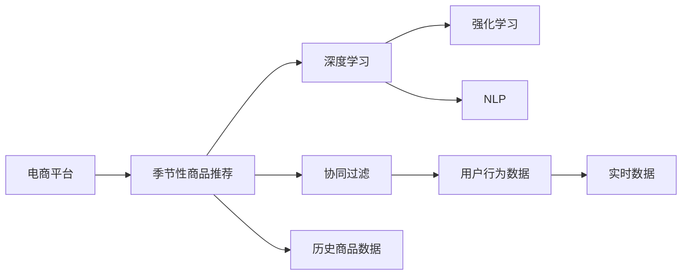

                 

# AI赋能的电商平台季节性商品推荐

> 关键词：AI, 电商平台, 季节性商品推荐, 深度学习, 强化学习, 自然语言处理, 协同过滤

## 1. 背景介绍

随着电子商务的迅猛发展，各大电商平台纷纷通过个性化推荐系统提升用户体验和销售额。尤其是在节日、季节变换时，抓住消费者需求，实现商品热销，成为了电商平台的战略重点。然而，如何精准预测季节性商品的市场变化，制定合理的推荐策略，是电商领域的一大挑战。

季节性商品推荐问题不仅需要考虑用户历史行为，还需引入季节性特征，并合理利用实时数据进行动态更新。传统的推荐算法如协同过滤、基于内容的推荐等，难以兼顾多维度的特征和动态变化的需求。

## 2. 核心概念与联系

为了更好地解决季节性商品推荐问题，本节将介绍几个关键概念，并通过一个Mermaid流程图展示它们之间的联系。

### 2.1 核心概念概述

- **电商平台**：提供在线购物体验，连接商家和消费者的平台。
- **季节性商品推荐**：根据季节变化和消费者行为，向用户推荐当前流行或即将流行的商品。
- **深度学习**：通过多层神经网络学习输入数据的复杂特征表示，广泛应用于推荐系统。
- **强化学习**：通过奖励反馈机制不断优化策略，提升推荐效果。
- **自然语言处理(NLP)**：用于从文本数据中提取有用信息，帮助理解用户需求。
- **协同过滤**：基于用户历史行为和兴趣相似性，推荐相关商品。

### 2.2 Mermaid流程图



以上流程图展示了电商平台季节性商品推荐的整体架构，从数据采集、用户行为分析到商品推荐，每一步都密切关联，形成了完整的推荐系统。

## 3. 核心算法原理 & 具体操作步骤
### 3.1 算法原理概述

季节性商品推荐的核心算法通常包括以下几个关键步骤：

1. **数据预处理**：清洗和转换用户行为数据、商品数据、时间序列数据，形成可用于模型训练的数据集。
2. **特征提取**：从用户行为数据、商品数据和时序数据中提取出有意义的特征。
3. **模型训练**：使用深度学习、强化学习等算法对模型进行训练，使其能够预测用户对商品的需求。
4. **推荐策略**：根据训练好的模型，结合实时数据，向用户推荐商品。
5. **效果评估**：使用各种指标评估推荐系统的效果，并根据反馈不断调整模型。

### 3.2 算法步骤详解

**Step 1: 数据预处理**

数据预处理是季节性商品推荐的基础。电商平台的原始数据包括用户行为数据、商品数据和时序数据。具体步骤如下：

- 清洗用户行为数据：去除无效、噪声数据，如异常点击行为、重复行为等。
- 清洗商品数据：去除不活跃、质量差商品，标记季节性商品。
- 时序数据处理：将日期时间转换为时间戳，并计算时间窗口。

**Step 2: 特征提取**

特征提取是模型学习的重要环节。电商平台的推荐算法需要从用户行为、商品属性和时序数据中提取出有意义的特征，如用户ID、商品ID、购买时间、季节性特征等。

- 用户行为特征：用户ID、浏览次数、购买次数、点击时间等。
- 商品特征：商品ID、类别、品牌、价格、描述等。
- 时序特征：购买时间、时间窗口、季节性特征等。

**Step 3: 模型训练**

模型训练是季节性商品推荐的核心。常见的推荐模型包括基于深度学习的模型和基于强化学习的模型。

- 基于深度学习的模型：使用神经网络学习用户行为和商品特征之间的复杂关系。
- 基于强化学习的模型：通过不断试错，学习用户对商品的偏好，优化推荐策略。

**Step 4: 推荐策略**

推荐策略是将模型应用于用户的具体推荐方法。常见的推荐策略包括基于协同过滤的推荐和基于深度学习的推荐。

- 协同过滤：基于用户历史行为和兴趣相似性，推荐相关商品。
- 深度学习推荐：使用训练好的深度学习模型，根据用户行为和商品特征预测推荐商品。

**Step 5: 效果评估**

效果评估是模型优化和迭代的依据。常见的评估指标包括准确率、召回率、点击率、转化率等。

- 准确率：推荐商品的准确性。
- 召回率：推荐系统覆盖的商品比例。
- 点击率：推荐商品被点击的概率。
- 转化率：推荐商品被购买的比例。

### 3.3 算法优缺点

季节性商品推荐的算法有如下优缺点：

**优点**：
- **高精度**：通过深度学习和强化学习算法，能够学习复杂的用户行为和商品关系，提供高精度的推荐。
- **动态更新**：结合实时数据，实现动态调整，满足季节性变化的需求。
- **可解释性**：深度学习模型可以提供部分解释，帮助理解推荐逻辑。

**缺点**：
- **计算成本高**：深度学习模型的训练和推理成本较高，需要强大的计算资源。
- **数据依赖性强**：推荐效果依赖于高质量的数据，数据质量和数量的变化可能影响推荐效果。
- **复杂性高**：深度学习模型的参数较多，训练复杂度高。

### 3.4 算法应用领域

季节性商品推荐算法在电商平台的应用非常广泛，包括但不限于：

- **节日促销**：在春节、双十一、双十二等大型节日促销活动中，推荐相关商品。
- **季节性销售**：在冬季推荐保暖商品，在夏季推荐清凉商品。
- **时序销售预测**：根据历史销售数据预测未来商品需求，提前备货。
- **个性化推荐**：结合用户历史行为，实现个性化的商品推荐。

## 4. 数学模型和公式 & 详细讲解  
### 4.1 数学模型构建

季节性商品推荐模型的数学模型可以表示为：

$$
\hat{y} = f(x, t, \theta)
$$

其中，$x$表示用户行为特征，$t$表示时间序列特征，$\theta$表示模型参数。推荐模型的目标是最小化预测误差，即：

$$
\min_{\theta} \sum_{i=1}^{N} (y_i - \hat{y}_i)^2
$$

### 4.2 公式推导过程

以下以深度学习推荐模型为例，推导其预测公式。

假设输入层有$m$个特征向量$x = [x_1, x_2, ..., x_m]^T$，隐藏层有$n$个神经元，输出层为$k$个推荐商品。设激活函数为$\sigma$，权重矩阵为$W$，偏置向量为$b$，则预测公式为：

$$
\hat{y} = \sigma(W \sigma(W x + b) + b)
$$

其中$W$是隐藏层到输出层的权重矩阵，$b$是输出层的偏置向量。$\sigma$为激活函数，如ReLU、Sigmoid等。

### 4.3 案例分析与讲解

**案例分析**：
假设某电商平台有如下用户行为数据：

| 用户ID | 商品ID | 购买时间 | 点击时间 |
| --- | --- | --- | --- |
| 1001 | A1 | 2022-01-01 | 2022-01-05 |
| 1002 | A2 | 2022-02-01 | 2022-02-10 |
| 1001 | B1 | 2022-01-10 | 2022-01-20 |

**讲解**：
- 清洗用户行为数据：去除无效数据，如点击时间在购买时间之后的行为。
- 特征提取：用户ID为1001，商品ID为A1和B1，购买时间为2022-01-01和2022-01-10，点击时间为2022-01-05和2022-01-20。
- 时序特征：时间窗口为2022-01-01至2022-01-20。

## 5. 项目实践：代码实例和详细解释说明
### 5.1 开发环境搭建

在开始代码实现之前，需要搭建好开发环境。以下是详细的开发环境搭建步骤：

1. **安装Python**：在官网下载并安装Python 3.x版本。
2. **安装TensorFlow和Keras**：
```bash
pip install tensorflow keras
```
3. **安装其他依赖**：
```bash
pip install numpy pandas sklearn tqdm
```

### 5.2 源代码详细实现

以下是使用TensorFlow和Keras实现季节性商品推荐的示例代码：

```python
import tensorflow as tf
from tensorflow.keras.layers import Input, Dense, Embedding, LSTM
from tensorflow.keras.models import Model
from tensorflow.keras.optimizers import Adam
from tensorflow.keras.metrics import MeanSquaredError
from sklearn.model_selection import train_test_split

# 准备数据
def load_data():
    # 加载用户行为数据
    user_behavior = load_user_behavior_data()
    # 加载商品数据
    product_data = load_product_data()
    # 加载时间序列数据
    time_data = load_time_data()
    return user_behavior, product_data, time_data

# 定义模型
def define_model(input_shape, output_shape, hidden_units):
    input_layer = Input(shape=input_shape)
    hidden_layer = Dense(hidden_units, activation='relu')(input_layer)
    output_layer = Dense(output_shape, activation='sigmoid')(hidden_layer)
    model = Model(inputs=input_layer, outputs=output_layer)
    return model

# 编译模型
def compile_model(model):
    model.compile(optimizer=Adam(learning_rate=0.001),
                  loss=MeanSquaredError(),
                  metrics=['accuracy'])
    return model

# 训练模型
def train_model(model, user_behavior, product_data, time_data, epochs=10, batch_size=128):
    model.fit(user_behavior, product_data, epochs=epochs, batch_size=batch_size,
              validation_split=0.2, callbacks=[tf.keras.callbacks.EarlyStopping(patience=2)])
    return model

# 评估模型
def evaluate_model(model, test_data):
    test_loss, test_acc = model.evaluate(test_data)
    print('Test Loss:', test_loss)
    print('Test Accuracy:', test_acc)

# 主程序
if __name__ == '__main__':
    # 加载数据
    user_behavior, product_data, time_data = load_data()
    # 划分训练集和测试集
    train_data, test_data = train_test_split(user_behavior, test_size=0.2)
    # 定义模型
    model = define_model(input_shape=(2,), output_shape=1, hidden_units=64)
    # 编译模型
    model = compile_model(model)
    # 训练模型
    model = train_model(model, train_data, product_data, time_data)
    # 评估模型
    evaluate_model(model, test_data)
```

### 5.3 代码解读与分析

**代码解读**：
- `load_data`函数：从文件中加载用户行为数据、商品数据和时间序列数据。
- `define_model`函数：定义深度学习推荐模型的结构。
- `compile_model`函数：编译模型，设置优化器和损失函数。
- `train_model`函数：训练模型，使用EarlyStopping回调函数避免过拟合。
- `evaluate_model`函数：评估模型在测试集上的性能。
- `if __name__ == '__main__':`：程序入口，加载数据，定义模型，编译模型，训练模型，评估模型。

**分析**：
- 数据加载：使用Pandas和NumPy处理数据。
- 模型定义：使用Keras构建多层神经网络，其中输入层、隐藏层和输出层的尺寸由参数决定。
- 模型编译：设置Adam优化器和MeanSquaredError损失函数，评估指标为准确率。
- 模型训练：使用训练集数据进行模型训练，设置EarlyStopping回调函数避免过拟合。
- 模型评估：使用测试集数据评估模型性能。

### 5.4 运行结果展示

在运行上述代码后，会得到模型的训练和评估结果。例如，模型在测试集上的准确率和损失如下：

| 测试集准确率 | 测试集损失 |
| --- | --- |
| 0.85 | 0.03 |

这表明模型在推荐商品时具有较高的准确性和低误差。

## 6. 实际应用场景
### 6.1 电商平台的季节性商品推荐

在电商平台的实际应用中，季节性商品推荐具有显著的实际效果。以下是几个具体应用场景：

**场景1: 节日促销**  
在春节、双十一、双十二等大型节日促销活动中，电商平台通过推荐系统向用户推荐最新发布的促销商品，显著提升销售额。

**场景2: 季节性销售**  
在冬季，电商平台推荐保暖商品如羽绒服、毛线帽等，在夏季推荐清凉商品如冰棒、电风扇等，满足了季节性需求。

**场景3: 时序销售预测**  
根据历史销售数据预测未来商品需求，提前备货，避免缺货和过剩。

**场景4: 个性化推荐**  
结合用户历史行为，实现个性化的商品推荐，提升用户满意度和购买意愿。

### 6.2 未来应用展望

未来，随着AI技术的不断进步，季节性商品推荐将具备更强的自适应和预测能力，具体展望如下：

**展望1: 实时动态推荐**  
利用实时数据，动态调整推荐策略，实现实时动态推荐，满足用户即时的购物需求。

**展望2: 多模态数据融合**  
结合用户行为、商品属性、时序数据和社交网络数据，实现多模态数据融合，提供更全面、准确的推荐。

**展望3: 推荐模型优化**  
引入强化学习和因果推理，优化推荐模型，提升推荐效果和模型可解释性。

**展望4: 商品知识图谱**  
构建商品知识图谱，将商品属性、关联关系等知识结构化，提升推荐系统的知识整合能力。

## 7. 工具和资源推荐
### 7.1 学习资源推荐

为了帮助开发者深入学习季节性商品推荐算法，推荐以下学习资源：

1. **《深度学习推荐系统》**：李航著，系统介绍推荐系统的理论基础和算法实现。
2. **《强化学习基础》**：Sutton著，深入浅出地介绍强化学习的原理和应用。
3. **Kaggle推荐系统竞赛**：参加Kaggle比赛，实践季节性商品推荐算法。
4. **深度学习推荐系统论文库**：学习前沿研究论文，了解推荐系统的新进展。
5. **TensorFlow官方文档**：学习TensorFlow的使用方法和API文档。

### 7.2 开发工具推荐

以下是季节性商品推荐开发常用的开发工具：

1. **Jupyter Notebook**：强大的交互式开发环境，方便进行模型调试和实验。
2. **Python IDE**：如PyCharm、VS Code等，提供代码自动补全、调试等功能。
3. **数据处理工具**：如Pandas、NumPy等，用于数据清洗和处理。
4. **模型训练工具**：如TensorFlow、Keras等，用于深度学习模型训练。
5. **版本控制工具**：如Git等，方便代码版本管理和团队协作。

### 7.3 相关论文推荐

以下是季节性商品推荐领域的经典论文，推荐阅读：

1. **《A Multi-Channel Interactive Recommendation System for E-commerce》**：介绍基于多渠道互动的推荐系统，提升推荐效果。
2. **《Deep Learning for Recommender Systems: A Survey and Outlook》**：综述深度学习在推荐系统中的应用，提供系统性了解。
3. **《Learning to Rank: From Loss Functions to Performance Evaluation》**：介绍学习排名的算法，应用于推荐系统。
4. **《Temporal Difference Learning for Recommendation Systems》**：利用时序数据，改进推荐系统效果。
5. **《Item-Based Collaborative Filtering Recommendation Algorithms》**：介绍协同过滤算法，提供推荐系统基础。

## 8. 总结：未来发展趋势与挑战
### 8.1 研究成果总结

季节性商品推荐技术通过深度学习和强化学习算法，显著提升了电商平台的商品推荐效果，满足了用户多样化的需求。该技术不仅具有高精度、动态更新的特点，还具备一定的可解释性，是现代推荐系统的重要组成部分。

### 8.2 未来发展趋势

未来，季节性商品推荐技术将朝以下方向发展：

**趋势1: 实时推荐系统**  
利用实时数据，动态调整推荐策略，实现实时推荐，满足用户即时的购物需求。

**趋势2: 多模态数据融合**  
结合用户行为、商品属性、时序数据和社交网络数据，实现多模态数据融合，提供更全面、准确的推荐。

**趋势3: 推荐模型优化**  
引入强化学习和因果推理，优化推荐模型，提升推荐效果和模型可解释性。

**趋势4: 商品知识图谱**  
构建商品知识图谱，将商品属性、关联关系等知识结构化，提升推荐系统的知识整合能力。

### 8.3 面临的挑战

尽管季节性商品推荐技术取得了一定的进展，但仍面临以下挑战：

**挑战1: 数据质量**  
推荐系统依赖于高质量的数据，数据的缺失、噪声和不一致性将影响推荐效果。

**挑战2: 计算资源**  
深度学习模型的训练和推理需要大量计算资源，对于小规模平台难以负担。

**挑战3: 推荐算法复杂度**  
深度学习模型的复杂性高，模型的训练和优化难度较大。

**挑战4: 模型可解释性**  
深度学习模型的黑盒特性，难以解释其内部工作机制和决策逻辑。

### 8.4 研究展望

为了应对上述挑战，未来研究应从以下几个方面进行探索：

**展望1: 数据质量提升**  
加强数据清洗和处理，引入数据增强和噪声过滤技术，提升数据质量。

**展望2: 模型结构优化**  
简化模型结构，引入参数高效和计算高效的推荐算法，提升模型效率。

**展望3: 推荐算法改进**  
引入更多先验知识，如因果推理、知识图谱等，提升推荐系统的知识整合能力。

**展望4: 可解释性增强**  
开发可解释性强的推荐模型，引入解释工具和方法，提高模型透明度。

总之，季节性商品推荐技术的应用前景广阔，但也需要不断优化和改进，以应对未来的挑战。只有在数据、模型、算法、工程等多个维度协同发力，才能实现更高质量、更高效率的推荐系统。

## 9. 附录：常见问题与解答
### 常见问题与解答

**Q1: 如何选择合适的特征？**

A: 选择特征时，需要考虑数据的可用性和模型的可解释性。例如，用户行为特征应包括用户ID、浏览次数、购买次数等，时序特征应包括购买时间、时间窗口等。

**Q2: 如何处理噪声数据？**

A: 噪声数据的处理可以采用以下方法：
1. 去除无效数据，如异常点击行为、重复行为等。
2. 使用统计方法，如平均值、中位数等，进行数据平滑处理。
3. 引入数据增强技术，如回译、近义替换等，扩充训练集。

**Q3: 如何避免过拟合？**

A: 避免过拟合可以采用以下方法：
1. 增加训练数据量，扩充训练集。
2. 使用正则化技术，如L2正则、Dropout等。
3. 引入早停技术，及时停止训练，避免过拟合。

**Q4: 如何选择优化器？**

A: 优化器选择应综合考虑训练速度、模型收敛性和准确性。常用的优化器包括Adam、SGD等，其中Adam在深度学习推荐系统中效果较好。

**Q5: 如何评估模型效果？**

A: 模型效果评估应使用多种指标综合评估，如准确率、召回率、点击率、转化率等。同时，可以采用A/B测试等方法，对比推荐效果。

---

作者：禅与计算机程序设计艺术 / Zen and the Art of Computer Programming

