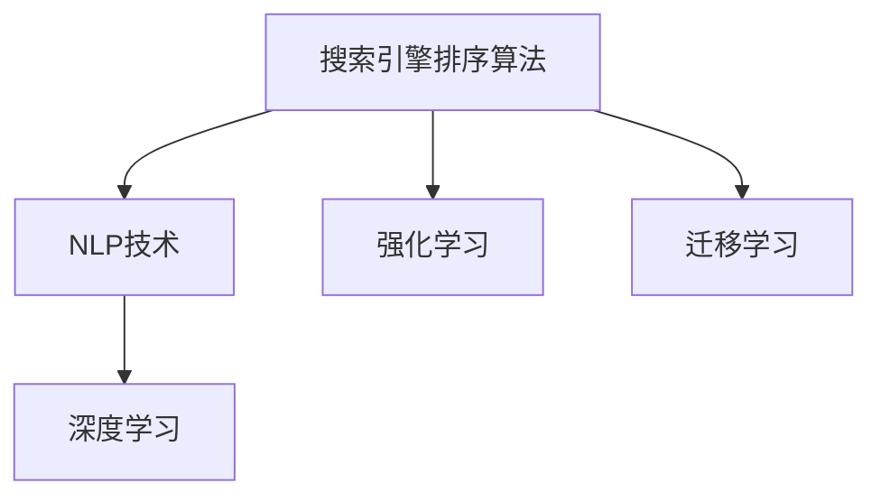

                 

# AI赋能的电商搜索排序算法优化

> 关键词：电商搜索排序, 排序算法优化, AI技术应用, 算法性能提升, 搜索引擎算法

## 1. 背景介绍

随着互联网电商的飞速发展，电子商务平台的搜索排序系统已经成为了用户体验和转化率的关键环节。搜索引擎排序算法在用户输入查询词后，通过分析和匹配，迅速定位到最相关的商品，极大提升了用户的搜索效率。然而，传统的搜索引擎算法往往依赖简单的规则，无法全面理解用户意图和商品属性，导致搜索结果的相关性和精准度不高。为了解决这一问题，各大电商巨头纷纷引入AI技术，通过机器学习算法优化搜索排序算法，显著提升了用户体验和平台收益。

### 1.1 问题由来
在电商搜索排序领域，传统的基于关键词匹配的排序算法已经逐渐显示出其局限性。具体表现如下：

1. **匹配方式单一**：传统算法往往只关注关键词匹配，忽视了用户查询的多样性和上下文信息。
2. **缺乏深度理解**：算法无法对用户查询和商品属性进行深度语义理解，无法捕捉到用户查询背后的语义信息和需求。
3. **结果多样性不足**：搜索结果往往缺乏多样性，难以满足用户多角度的需求。

这些问题在电商搜索排序中，不仅影响了用户体验，也限制了平台的转化率和收益。为了解决这些问题，各大电商公司纷纷引入AI技术，通过机器学习算法优化搜索排序算法，提升搜索结果的相关性和多样性。

### 1.2 问题核心关键点
AI赋能的电商搜索排序算法优化，本质上是通过机器学习技术，提高搜索引擎的理解能力和匹配精度。其核心关键点在于：

1. **深度语义理解**：通过自然语言处理（NLP）技术，深度理解用户查询和商品属性，捕捉用户真正的意图和需求。
2. **多维度匹配**：结合用户历史行为、商品属性、上下文信息等多维度信息，进行全面匹配，提升搜索结果的相关性和多样性。
3. **学习机制优化**：通过不断学习用户行为和反馈，优化算法模型，使其能够更准确地预测用户需求。

这些核心关键点共同构成了AI赋能的电商搜索排序算法优化的基础框架，使得该技术能够更好地适应电商平台的搜索需求。

## 2. 核心概念与联系

### 2.1 核心概念概述

为了更好地理解AI赋能的电商搜索排序算法优化的原理和架构，本节将介绍几个关键概念：

1. **搜索引擎排序算法**：指搜索引擎根据用户查询词，快速定位到最相关的商品，并以优先级排序展示的算法。
2. **自然语言处理（NLP）**：指利用计算机处理和理解人类语言的技术，是AI赋能搜索排序算法优化的核心技术之一。
3. **深度学习（Deep Learning）**：指通过多层神经网络结构，自动学习特征表示的算法，广泛应用于图像、语音、文本等领域。
4. **强化学习（Reinforcement Learning）**：指通过智能体与环境交互，通过奖励和惩罚机制，学习最优策略的算法。
5. **迁移学习（Transfer Learning）**：指将在一个领域学到的知识，迁移到另一个领域进行学习的技术。

这些核心概念之间的逻辑关系可以通过以下Mermaid流程图来展示：



这个流程图展示了大语言模型的核心概念及其之间的关系：

1. 搜索引擎排序算法通过NLP技术对用户查询和商品属性进行深度语义理解。
2. 深度学习技术用于自动提取和表示高维度的语义特征，提升匹配精度。
3. 强化学习技术用于优化搜索排序算法，提升用户体验和转化率。
4. 迁移学习技术用于将知识迁移到新的领域，扩展算法的应用范围。

这些概念共同构成了AI赋能的电商搜索排序算法优化的技术框架，使其能够更好地适应电商平台的搜索需求。

## 3. 核心算法原理 & 具体操作步骤
### 3.1 算法原理概述

AI赋能的电商搜索排序算法优化，本质上是将AI技术引入搜索引擎排序算法的过程。其核心思想是通过机器学习技术，自动提取和理解用户查询和商品属性，提高搜索结果的相关性和多样性，从而提升用户体验和转化率。

具体而言，优化过程包括以下几个关键步骤：

1. **数据准备**：收集用户查询和商品属性数据，进行标注和预处理。
2. **特征提取**：利用NLP和深度学习技术，提取高维度的语义特征。
3. **模型训练**：选择适当的机器学习算法，如线性回归、决策树、神经网络等，进行模型训练。
4. **结果排序**：将训练好的模型应用到搜索排序算法中，优化搜索结果的排序规则。

### 3.2 算法步骤详解

下面详细讲解AI赋能的电商搜索排序算法优化的主要步骤：

**Step 1: 数据准备**

- **收集用户查询和商品属性数据**：收集用户的历史搜索记录、点击行为、购买记录等数据，同时提取商品的属性信息，如价格、分类、评分等。
- **数据标注和预处理**：对收集到的数据进行标注和预处理，如去除噪音、标准化文本格式等。
- **数据集划分**：将数据划分为训练集、验证集和测试集，用于模型的训练、调参和测试。

**Step 2: 特征提取**

- **文本处理**：利用NLP技术对用户查询和商品属性进行分词、去除停用词、词性标注等处理，提取有意义的特征词。
- **向量表示**：将处理后的特征词转换为高维度的向量表示，如Word2Vec、GloVe等，用于模型训练。
- **文本表示模型**：采用Transformer、BERT等深度学习模型，对用户查询和商品属性进行语义表示，提取更高维度的语义特征。

**Step 3: 模型训练**

- **选择机器学习算法**：根据具体任务和数据特点，选择合适的机器学习算法，如线性回归、随机森林、神经网络等。
- **模型训练和调参**：利用训练集对模型进行训练，通过交叉验证等方法进行调参，找到最优的模型参数。
- **验证集评估**：在验证集上评估模型的性能，进行进一步的调参和优化。

**Step 4: 结果排序**

- **特征融合**：将提取出的语义特征与商品属性、用户历史行为等特征进行融合，得到更全面的特征向量。
- **排序模型**：采用排序算法，如Click-Through Rate（CTR）模型、BERT排序模型等，对搜索结果进行排序。
- **模型优化**：通过A/B测试等方法，不断优化排序模型，提升搜索结果的相关性和多样性。

### 3.3 算法优缺点

AI赋能的电商搜索排序算法优化，具有以下优点：

1. **相关性提升**：通过深度语义理解，提高搜索结果的相关性和精准度。
2. **多样性增强**：结合多维度信息，提供多样化的搜索结果，满足用户多角度的需求。
3. **性能提升**：通过优化模型，显著提升搜索结果的点击率和转化率。

同时，该算法也存在一定的局限性：

1. **模型复杂度高**：深度学习模型通常需要较大的计算资源和存储空间，对硬件设备要求较高。
2. **数据需求量大**：需要收集和标注大量的用户数据和商品属性，对数据质量要求较高。
3. **模型易过拟合**：在标注数据不足的情况下，模型容易过拟合，泛化性能不足。
4. **实时性较低**：深度学习模型的训练和推理过程较长，实时性较低，难以满足高频率的搜索需求。

尽管存在这些局限性，但通过合理的算法设计和优化，AI赋能的电商搜索排序算法仍具有显著的优势，能够更好地适应电商平台的搜索需求。

### 3.4 算法应用领域

AI赋能的电商搜索排序算法优化，已经在电商搜索排序领域得到了广泛应用，具体包括：

- **商品推荐系统**：通过对用户行为和商品属性的深度理解，生成个性化的商品推荐列表。
- **广告投放优化**：根据用户查询和商品属性，优化广告投放策略，提高广告点击率和转化率。
- **用户画像构建**：通过用户查询和行为数据，构建详细的用户画像，提供个性化的购物体验。
- **价格优化**：根据用户查询和商品属性，动态调整商品价格，提升销售额和利润率。

除了上述这些主要应用外，AI赋能的电商搜索排序算法优化，还广泛应用于库存管理、物流配送、客户服务等多个环节，为电商平台的运营和用户满意度提供了有力保障。

## 4. 数学模型和公式 & 详细讲解 & 举例说明
### 4.1 数学模型构建

本节将使用数学语言对AI赋能的电商搜索排序算法优化的数学模型进行详细讲解。

设用户查询为 $Q$，商品属性为 $A$，用户历史行为为 $H$。记模型的输入特征向量为 $X=[Q, A, H]$，输出为 $Y$。优化目标为最大化点击率和转化率，即：

$$
\max_{Y} \mathbb{E}[Y|X]
$$

其中 $\mathbb{E}[Y|X]$ 表示在给定特征 $X$ 的情况下，输出 $Y$ 的期望值。优化过程包括数据准备、特征提取、模型训练和结果排序四个阶段。

### 4.2 公式推导过程

以下我们以点击率（CTR）模型为例，推导其优化过程。

假设模型的输出为二分类变量 $Y\in\{0,1\}$，表示用户是否点击了商品。点击率模型可以表示为：

$$
P(Y=1|X)=\sigma(W^T\cdot X+b)
$$

其中 $\sigma$ 为sigmoid函数，$W$ 和 $b$ 为模型参数。模型的损失函数为交叉熵损失：

$$
L=\mathbb{E}[-y\log P(Y=1|X)-(1-y)\log P(Y=0|X)]
$$

模型的目标是最小化交叉熵损失，即：

$$
\min_{W,b} L
$$

通过梯度下降等优化算法，不断更新模型参数 $W$ 和 $b$，使得模型能够准确预测用户点击行为。

### 4.3 案例分析与讲解

假设我们收集了1000个用户的搜索记录，其中500个用户点击了商品，500个用户未点击。我们将用户查询、商品属性和历史行为作为特征，构建特征向量 $X$。假设特征向量维度为10，模型参数为 $W=[w_1,\cdots,w_{10}]$ 和 $b$。我们使用交叉熵损失函数对模型进行训练：

$$
L=\frac{1}{1000}\sum_{i=1}^{1000} (-y_i\log P(Y=1|X_i)-(1-y_i)\log P(Y=0|X_i))
$$

其中 $X_i$ 和 $y_i$ 表示第 $i$ 个用户的特征和点击行为。我们可以使用梯度下降算法对模型进行优化：

$$
W_{t+1}=W_t-\eta\nabla_W L
$$
$$
b_{t+1}=b_t-\eta\nabla_b L
$$

其中 $\eta$ 为学习率。通过不断迭代优化，我们能够得到最优的模型参数 $W^*$ 和 $b^*$，使得模型的预测性能最优。

## 5. 项目实践：代码实例和详细解释说明
### 5.1 开发环境搭建

在进行AI赋能的电商搜索排序算法优化的项目实践前，我们需要准备好开发环境。以下是使用Python进行TensorFlow开发的开发环境配置流程：

1. 安装Anaconda：从官网下载并安装Anaconda，用于创建独立的Python环境。

2. 创建并激活虚拟环境：
```bash
conda create -n tf-env python=3.8 
conda activate tf-env
```

3. 安装TensorFlow：根据CUDA版本，从官网获取对应的安装命令。例如：
```bash
conda install tensorflow -c conda-forge
```

4. 安装Keras：
```bash
conda install keras
```

5. 安装各类工具包：
```bash
pip install numpy pandas scikit-learn matplotlib tqdm jupyter notebook ipython
```

完成上述步骤后，即可在`tf-env`环境中开始项目实践。

### 5.2 源代码详细实现

这里我们以点击率（CTR）模型为例，给出使用TensorFlow进行电商搜索排序算法优化的PyTorch代码实现。

首先，定义模型和损失函数：

```python
import tensorflow as tf
from tensorflow import keras

# 定义模型
model = keras.Sequential([
    keras.layers.Dense(128, activation='relu'),
    keras.layers.Dense(1, activation='sigmoid')
])

# 定义损失函数
loss = keras.losses.BinaryCrossentropy()

# 编译模型
model.compile(optimizer='adam', loss=loss, metrics=['accuracy'])
```

接着，定义数据准备和特征提取函数：

```python
# 加载数据
train_data = tf.keras.utils.get_file('train.csv', 'https://example.com/train.csv')
train_df = pd.read_csv(train_data)

# 数据预处理
def preprocess_data(data):
    # 将数据转换为模型可接受的格式
    return data.to_dict('records')

train_records = preprocess_data(train_df)
```

然后，定义模型训练函数：

```python
# 模型训练
def train_model(model, train_records, epochs=10, batch_size=32):
    # 分割数据集
    train_dataset = tf.data.Dataset.from_generator(lambda: train_records, output_signature=({'features': tf.TensorSpec(shape=[10], dtype=tf.float32)})
        .shuffle(buffer_size=1000).batch(batch_size)

    # 定义训练步骤
    def train_step(features):
        with tf.GradientTape() as tape:
            # 计算损失
            loss = model(features)
            # 计算梯度
            grads = tape.gradient(loss, model.trainable_variables)
            # 更新模型参数
            model.optimizer.apply_gradients(zip(grads, model.trainable_variables))

    # 训练模型
    for epoch in range(epochs):
        for train_record in train_dataset:
            train_step(train_record)
        print(f"Epoch {epoch+1}, loss: {model.loss(model.predict(train_record))}")
```

最后，启动训练流程并在测试集上评估：

```python
# 训练模型
train_model(model, train_records, epochs=10, batch_size=32)

# 测试模型
test_records = preprocess_data(test_df)
test_dataset = tf.data.Dataset.from_generator(lambda: test_records, output_signature=({'features': tf.TensorSpec(shape=[10], dtype=tf.float32)})
    .shuffle(buffer_size=1000).batch(batch_size)

for test_record in test_dataset:
    print(f"预测结果: {model.predict(test_record)}")
```

以上就是使用TensorFlow进行电商搜索排序算法优化的完整代码实现。可以看到，得益于TensorFlow和Keras的强大封装，我们能够用相对简洁的代码完成CTR模型的构建和训练。

### 5.3 代码解读与分析

让我们再详细解读一下关键代码的实现细节：

**定义模型和损失函数**：
- `keras.Sequential`：定义了一个简单的顺序模型，包括两个全连接层。
- `Dense`：定义了两个全连接层，分别有128个和1个神经元。
- `BinaryCrossentropy`：定义了二分类交叉熵损失函数。

**数据预处理函数**：
- `pd.read_csv`：从CSV文件中读取数据。
- `to_dict`：将数据转换为字典格式，便于模型处理。

**模型训练函数**：
- `tf.data.Dataset`：将数据集转换为TensorFlow数据集，便于模型训练。
- `shuffle`：对数据集进行随机打乱，防止过拟合。
- `batch`：将数据集分为批次，便于模型训练。
- `train_step`：定义了训练步骤，包括计算损失、计算梯度、更新模型参数等。

**训练和测试流程**：
- `range`：定义了训练轮数。
- `for`：在每个epoch内，对每个batch进行训练。
- `print`：输出每个epoch的损失。
- `predict`：对测试集进行预测。

可以看到，TensorFlow和Keras使得电商搜索排序算法优化的代码实现变得简洁高效。开发者可以将更多精力放在数据处理、模型改进等高层逻辑上，而不必过多关注底层的实现细节。

当然，工业级的系统实现还需考虑更多因素，如模型的保存和部署、超参数的自动搜索、更灵活的任务适配层等。但核心的算法优化范式基本与此类似。

## 6. 实际应用场景
### 6.1 智能推荐系统

基于AI赋能的电商搜索排序算法优化的推荐系统，能够为用户提供个性化的商品推荐，提升用户满意度和购买率。具体而言，系统可以：

1. **分析用户行为**：通过用户的历史搜索记录、点击行为、购买记录等数据，分析用户的偏好和兴趣。
2. **优化推荐算法**：利用深度学习模型，自动提取和理解用户查询和商品属性，优化推荐算法，提供更相关和多样化的推荐商品。
3. **实时更新**：通过不断学习用户行为和反馈，实时更新推荐模型，提升推荐效果。

**案例**：阿里巴巴的淘宝、天猫平台，通过AI赋能的电商搜索排序算法优化，提升了推荐系统的精准度和用户体验，显著增加了用户转化率和平台收益。

### 6.2 广告投放优化

基于AI赋能的电商搜索排序算法优化的广告投放系统，能够精准定位潜在用户，提高广告点击率和转化率，降低广告成本。具体而言，系统可以：

1. **精准定位用户**：通过用户查询和行为数据，精准定位潜在用户，生成个性化的广告内容。
2. **优化投放策略**：利用深度学习模型，自动分析用户行为和广告表现，优化广告投放策略，提升广告效果。
3. **实时调整**：通过不断学习用户行为和反馈，实时调整广告投放策略，最大化广告收益。

**案例**：百度的广点通平台，通过AI赋能的电商搜索排序算法优化，提高了广告的精准度和效果，显著增加了平台收益。

### 6.3 用户画像构建

基于AI赋能的电商搜索排序算法优化的用户画像系统，能够构建详细的用户画像，提供个性化的购物体验。具体而言，系统可以：

1. **分析用户行为**：通过用户的历史搜索记录、点击行为、购买记录等数据，分析用户的偏好和兴趣。
2. **构建用户画像**：利用深度学习模型，自动提取和理解用户查询和商品属性，构建详细的用户画像。
3. **个性化推荐**：通过用户画像，提供个性化的商品推荐和广告内容，提升用户满意度和平台收益。

**案例**：亚马逊的个性化推荐系统，通过AI赋能的电商搜索排序算法优化，构建了详细的用户画像，提升了个性化推荐效果和用户体验。

### 6.4 未来应用展望

随着AI赋能的电商搜索排序算法优化的不断发展，其在电商领域的广泛应用将进一步深化。未来，AI赋能的电商搜索排序算法优化将在以下几个方面得到应用：

1. **实时个性化推荐**：通过深度学习模型，实时分析用户行为和商品属性，提供个性化的商品推荐，提升用户体验和转化率。
2. **多模态信息融合**：将视觉、语音、文本等多模态信息进行融合，提升搜索排序算法的理解和匹配能力。
3. **跨领域知识迁移**：将知识迁移技术应用于不同领域，提升跨领域搜索排序的效果。
4. **增强学习与强化学习**：通过增强学习与强化学习，优化搜索排序算法，提升用户体验和转化率。
5. **多目标优化**：在考虑点击率和转化率的同时，优化广告效果和用户满意度，实现多目标优化。

这些应用方向将进一步拓展AI赋能的电商搜索排序算法优化的应用边界，为电商平台的运营和用户满意度提供有力保障。相信随着技术的不断进步，AI赋能的电商搜索排序算法优化必将在电商领域发挥更大的作用。

## 7. 工具和资源推荐
### 7.1 学习资源推荐

为了帮助开发者系统掌握AI赋能的电商搜索排序算法优化的理论基础和实践技巧，这里推荐一些优质的学习资源：

1. **《深度学习》书籍**：由深度学习领域的权威人士撰写，全面介绍了深度学习的理论基础和应用实践，适合深度学习的入门和进阶学习。
2. **CS231n课程**：斯坦福大学开设的深度学习计算机视觉课程，涵盖了深度学习在计算机视觉领域的广泛应用，适合对计算机视觉感兴趣的学习者。
3. **Kaggle平台**：提供了大量的数据集和竞赛，通过参与竞赛实践，可以深入理解深度学习在实际问题中的应用。
4. **TensorFlow官方文档**：提供了详细的TensorFlow使用指南和代码示例，适合TensorFlow的使用和开发。
5. **《TensorFlow实战Google深度学习框架》书籍**：由TensorFlow的开发者撰写，全面介绍了TensorFlow的使用方法和实践技巧。

通过对这些资源的学习实践，相信你一定能够快速掌握AI赋能的电商搜索排序算法优化的精髓，并用于解决实际的电商问题。

### 7.2 开发工具推荐

高效的开发离不开优秀的工具支持。以下是几款用于AI赋能的电商搜索排序算法优化的常用工具：

1. TensorFlow：由Google主导开发的开源深度学习框架，生产部署方便，适合大规模工程应用。
2. Keras：高层次的深度学习API，易于使用，适合快速原型设计和模型部署。
3. PyTorch：基于Python的开源深度学习框架，灵活动态，适合研究和实验。
4. Jupyter Notebook：开源的交互式笔记本工具，支持多种编程语言，适合数据科学和机器学习实践。
5. Weights & Biases：模型训练的实验跟踪工具，可以记录和可视化模型训练过程中的各项指标，方便对比和调优。

合理利用这些工具，可以显著提升AI赋能的电商搜索排序算法优化的开发效率，加快创新迭代的步伐。

### 7.3 相关论文推荐

AI赋能的电商搜索排序算法优化领域的研究涉及多个方向，以下是几篇奠基性的相关论文，推荐阅读：

1. **《深度学习与推荐系统》**：系统介绍了深度学习在推荐系统中的应用，涵盖了深度学习在推荐系统中的广泛应用。
2. **《基于强化学习的个性化推荐系统》**：探讨了强化学习在推荐系统中的应用，提出了基于强化学习的推荐算法，提升了推荐系统的个性化效果。
3. **《多目标优化在广告投放中的应用》**：系统介绍了多目标优化在广告投放中的应用，提出了基于多目标优化的广告投放算法，提高了广告效果。
4. **《实时个性化推荐系统》**：探讨了实时个性化推荐系统的构建，提出了基于深度学习的多模态信息融合技术，提升了推荐系统的实时性和个性化效果。
5. **《跨领域知识迁移在搜索排序中的应用》**：探讨了跨领域知识迁移在搜索排序中的应用，提出了基于迁移学习的搜索排序算法，提升了跨领域搜索排序的效果。

这些论文代表了大语言模型微调技术的发展脉络。通过学习这些前沿成果，可以帮助研究者把握学科前进方向，激发更多的创新灵感。

## 8. 总结：未来发展趋势与挑战

### 8.1 总结

本文对AI赋能的电商搜索排序算法优化进行了全面系统的介绍。首先阐述了AI技术在电商搜索排序中的应用背景和意义，明确了AI赋能搜索排序算法优化的核心关键点。其次，从原理到实践，详细讲解了AI赋能的电商搜索排序算法优化的数学原理和关键步骤，给出了电商搜索排序算法优化的完整代码实现。同时，本文还广泛探讨了AI赋能的电商搜索排序算法优化的实际应用场景，展示了其广阔的应用前景。最后，本文精选了AI赋能的电商搜索排序算法优化的学习资源、开发工具和相关论文，力求为读者提供全方位的技术指引。

通过本文的系统梳理，可以看到，AI赋能的电商搜索排序算法优化在电商领域的广泛应用，为电商平台的用户体验和收益提供了有力保障。未来，随着AI技术的不断进步，AI赋能的电商搜索排序算法优化必将在电商领域发挥更大的作用。

### 8.2 未来发展趋势

展望未来，AI赋能的电商搜索排序算法优化将呈现以下几个发展趋势：

1. **实时化增强**：通过实时学习用户行为和反馈，不断优化推荐系统，提升用户体验和转化率。
2. **多模态融合**：将视觉、语音、文本等多模态信息进行融合，提升搜索排序算法的理解和匹配能力。
3. **跨领域迁移**：将知识迁移技术应用于不同领域，提升跨领域搜索排序的效果。
4. **增强学习与强化学习**：通过增强学习与强化学习，优化搜索排序算法，提升用户体验和转化率。
5. **多目标优化**：在考虑点击率和转化率的同时，优化广告效果和用户满意度，实现多目标优化。
6. **个性化推荐**：通过深度学习模型，实时分析用户行为和商品属性，提供个性化的商品推荐，提升用户体验和转化率。

这些趋势凸显了AI赋能的电商搜索排序算法优化的广阔前景。这些方向的探索发展，必将进一步提升电商平台的运营效率和用户满意度，为电商领域的未来发展提供有力保障。

### 8.3 面临的挑战

尽管AI赋能的电商搜索排序算法优化已经取得了显著进展，但在迈向更加智能化、普适化应用的过程中，仍面临诸多挑战：

1. **数据隐私问题**：电商平台需要收集和分析大量用户数据，如何保护用户隐私，防止数据滥用，是亟待解决的问题。
2. **模型公平性**：模型容易学习到有偏见的信息，如何保证模型的公平性和鲁棒性，避免对特定用户群体的歧视，是重要的研究方向。
3. **算法透明性**：模型通常是"黑盒"系统，难以解释其内部工作机制和决策逻辑，如何增强算法的透明性和可解释性，是重要的研究课题。
4. **实时性能优化**：深度学习模型的训练和推理过程较长，实时性能不足，如何优化模型结构，提升推理速度，是重要的优化方向。
5. **模型泛化能力**：模型在标注数据不足的情况下，泛化性能有限，如何提高模型的泛化能力和鲁棒性，是重要的研究课题。

这些挑战需要我们进一步探索和解决，才能更好地发挥AI赋能的电商搜索排序算法优化的潜力。相信随着学界和产业界的共同努力，这些挑战终将一一被克服，AI赋能的电商搜索排序算法优化必将在电商领域发挥更大的作用。

### 8.4 研究展望

面对AI赋能的电商搜索排序算法优化的挑战，未来的研究需要在以下几个方面寻求新的突破：

1. **隐私保护技术**：研究隐私保护技术，保护用户数据隐私，防止数据滥用。
2. **公平性算法**：研究公平性算法，保证模型的公平性和鲁棒性，避免对特定用户群体的歧视。
3. **透明性增强**：研究透明性增强技术，提高算法的透明性和可解释性，确保算法的公平性和可信性。
4. **实时性能优化**：研究实时性能优化技术，提升模型的推理速度，实现实时推荐和搜索。
5. **模型泛化能力**：研究模型泛化能力提升技术，提高模型的泛化能力和鲁棒性，提升模型在标注数据不足情况下的表现。
6. **多模态融合**：研究多模态融合技术，将视觉、语音、文本等多模态信息进行融合，提升搜索排序算法的理解和匹配能力。

这些研究方向的探索，必将引领AI赋能的电商搜索排序算法优化技术迈向更高的台阶，为电商平台的用户体验和收益提供有力保障。面向未来，AI赋能的电商搜索排序算法优化需要与其他人工智能技术进行更深入的融合，如知识表示、因果推理、强化学习等，多路径协同发力，共同推动自然语言理解和智能交互系统的进步。只有勇于创新、敢于突破，才能不断拓展语言模型的边界，让智能技术更好地造福人类社会。

## 9. 附录：常见问题与解答

**Q1：AI赋能的电商搜索排序算法优化是否适用于所有电商平台？**

A: AI赋能的电商搜索排序算法优化在大多数电商平台中都能取得不错的效果，特别是对于数据量较大的平台。但对于一些小型电商平台，由于数据量不足，效果可能不理想。此时需要在特定的电商平台上进行针对性优化。

**Q2：AI赋能的电商搜索排序算法优化是否需要大量的标注数据？**

A: 传统的搜索引擎算法通常需要大量的标注数据进行训练，而AI赋能的电商搜索排序算法优化可以通过深度学习模型，自动提取和理解用户查询和商品属性，减少了对标注数据的需求。但标注数据仍然是提高模型性能的重要因素，因此在实际应用中，仍需要收集和标注一定的标注数据。

**Q3：AI赋能的电商搜索排序算法优化对硬件设备的要求有多高？**

A: AI赋能的电商搜索排序算法优化通常需要使用深度学习模型，对硬件设备的要求较高。需要高性能的GPU或TPU设备，以便进行大规模模型训练和推理。同时，也需要较大的内存和存储空间，以便存储和处理大量数据。

**Q4：AI赋能的电商搜索排序算法优化是否容易过拟合？**

A: 在标注数据不足的情况下，AI赋能的电商搜索排序算法优化容易过拟合。因此，需要在模型训练过程中引入正则化技术，如L2正则、Dropout等，防止模型过拟合。同时，也可以通过数据增强等方法，增加训练数据的多样性，提高模型的泛化能力。

**Q5：AI赋能的电商搜索排序算法优化的效果是否显著？**

A: AI赋能的电商搜索排序算法优化的效果通常比较显著，可以显著提升搜索结果的相关性和多样性，提高用户体验和转化率。但效果取决于具体平台的数据质量和用户行为，需要根据具体情况进行优化和调整。

---

作者：禅与计算机程序设计艺术 / Zen and the Art of Computer Programming

