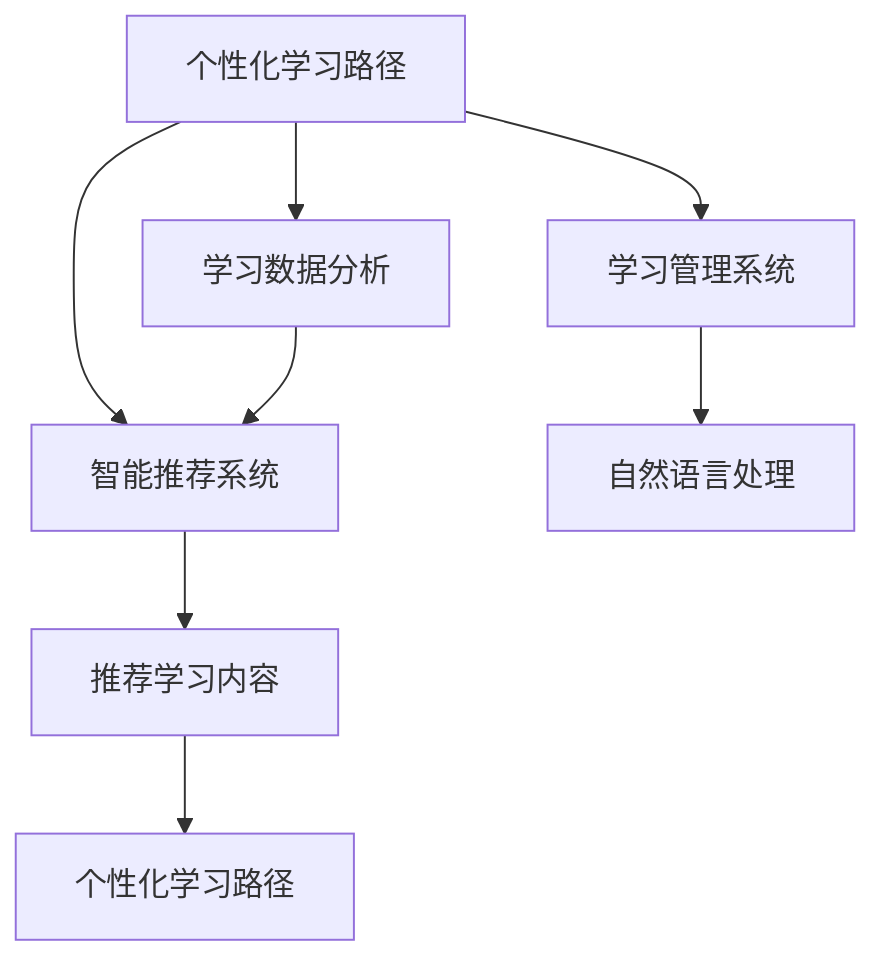

                 

# AI辅助教育：个性化学习路径设计

> 关键词：个性化学习路径, AI辅助教育, 自适应学习, 智能推荐, 在线教育, 学习分析

## 1. 背景介绍

### 1.1 问题由来

在当今数字化时代，教育正经历着翻天覆地的变化。传统的“一刀切”教学模式已无法满足个性化学习的需求。随着AI技术的发展，AI辅助教育逐渐成为教育改革的新引擎，为个性化学习提供新的解决方案。

个性化学习路径(Personalized Learning Path, PLP)旨在根据每个学生的学习特点和需求，量身定制其学习内容、学习节奏和学习方式。通过AI技术，可以全面收集和分析学生的学习数据，实时调整学习路径，确保其高效和精准。

### 1.2 问题核心关键点

个性化学习路径设计的核心关键点包括：

- 学生学习数据的全面收集和分析：通过学习管理系统(LMS)、在线练习、互动视频等工具，收集学生的操作行为、答题结果、参与度等数据。
- 学生学习状态的精准建模：利用机器学习算法，构建学生的学习模型，识别其知识水平、学习风格、兴趣偏好等特征。
- 学习路径的智能推荐：根据学生模型，实时生成个性化的学习路径，推荐合适的学习资源和活动。
- 学习效果的实时评估与反馈：通过学习分析，评估学习路径的有效性，持续优化推荐算法，提升学习效果。

### 1.3 问题研究意义

个性化学习路径设计对于教育技术的发展具有重要意义：

1. 提升学习效率：个性化学习路径能够根据学生特点，量身定制学习内容，避免无效学习，提高学习效率。
2. 增强学习体验：通过推荐适合的学习资源和活动，使学习过程更加有趣和有意义。
3. 促进差异化教学：AI技术帮助教师进行精细化教学，关注每个学生的个性需求，实现差异化教育。
4. 推动教育公平：通过个性化学习路径，帮助学习困难学生跨越学习障碍，缩小教育差距。
5. 促进教育创新：个性化学习路径为教育创新提供了新的可能，如智能辅导系统、虚拟现实实验室等。

## 2. 核心概念与联系

### 2.1 核心概念概述

为更好地理解个性化学习路径设计的核心概念，本节将介绍几个密切相关的核心概念：

- 自适应学习（Adaptive Learning）：根据学生的实时表现和反馈，动态调整学习内容和方式。
- 智能推荐系统（Recommender System）：通过用户行为数据分析，智能推荐适合的学习资源。
- 学习管理系统（Learning Management System, LMS）：在线学习环境，提供内容发布、学习分析等功能。
- 学习分析（Learning Analytics）：收集和分析学习数据，评估学习效果，优化学习路径。
- 自然语言处理（Natural Language Processing, NLP）：用于文本分析、情感分析、语音识别等。

这些核心概念之间的逻辑关系可以通过以下Mermaid流程图来展示：



这个流程图展示了个性化学习路径设计的核心概念及其之间的关系：

1. 个性化学习路径设计依赖于学习数据分析，了解学生的学习状态。
2. 智能推荐系统根据学习数据分析结果，生成个性化学习路径。
3. 学习管理系统提供平台支持，收集学习数据，发布学习资源。
4. 自然语言处理技术用于文本和语音分析，提升推荐系统的精准度。
5. 个性化学习路径的实时更新和优化，进一步提升学习效果。

## 3. 核心算法原理 & 具体操作步骤

### 3.1 算法原理概述

个性化学习路径设计的核心算法原理基于自适应学习和智能推荐系统。其核心思想是：通过学习数据分析，构建学生模型，实时生成并调整个性化学习路径。

具体而言，个性化学习路径设计过程如下：

1. 数据收集：通过学习管理系统和学习活动，收集学生的学习数据。
2. 学生建模：利用机器学习算法，构建学生的学习模型，识别其知识水平、学习风格、兴趣偏好等。
3. 路径生成：根据学生模型，生成个性化学习路径，推荐合适的学习资源和活动。
4. 路径评估与优化：通过学习分析，评估学习路径的有效性，实时调整和优化。

### 3.2 算法步骤详解

个性化学习路径设计的算法步骤可大致分为以下几个环节：

**Step 1: 数据收集与预处理**

1. 收集学生学习数据：通过学习管理系统（LMS）、在线练习、互动视频等工具，收集学生的操作行为、答题结果、参与度等数据。
2. 数据清洗与预处理：去除无效数据、填补缺失值、进行标准化处理，准备用于建模的数据集。

**Step 2: 学生建模**

1. 特征提取：提取学生的基本信息（如年龄、年级）、学习行为（如访问时长、答题正确率）、兴趣偏好（如学习主题、媒体类型）等特征。
2. 学生建模：利用机器学习算法（如KNN、随机森林、深度学习等），构建学生的学习模型。

**Step 3: 学习路径生成**

1. 路径规划：根据学生模型，生成个性化学习路径。可以选择推荐路径算法（如协同过滤、基于内容的推荐等），或结合专家规则，进行智能推荐。
2. 路径细化：根据学生实时表现和反馈，动态调整学习路径，细化推荐学习资源和活动。

**Step 4: 路径评估与反馈**

1. 学习效果评估：通过学习分析，评估学习路径的有效性，如通过测试成绩、学习时长、参与度等指标。
2. 路径优化：根据评估结果，实时调整和优化推荐算法，提升学习效果。

### 3.3 算法优缺点

个性化学习路径设计具有以下优点：

1. 个性化：能够根据学生特点，量身定制学习路径，提升学习效果。
2. 自适应：实时收集和分析学生数据，动态调整学习路径。
3. 数据驱动：通过数据驱动推荐，提升推荐的精准度。

同时，该方法也存在一些局限性：

1. 数据依赖：需要大量学生的学习数据，数据隐私和安全问题亟待解决。
2. 模型复杂：学生模型的构建需要复杂的算法和技术，对数据质量和模型性能要求较高。
3. 实时性要求：需要实时处理和分析数据，对计算资源和系统架构提出较高要求。
4. 系统集成：需要与现有教育系统无缝集成，提升使用便利性。

尽管存在这些局限性，但个性化学习路径设计依然是大规模教育技术的重要方向，对于提升教育质量和效率具有重要意义。

### 3.4 算法应用领域

个性化学习路径设计在教育领域有着广泛的应用，例如：

- 中小学教育：通过个性化学习路径，提升基础教育质量，实现差异化教育。
- 高等教育：帮助学生进行选课和专业规划，优化学习体验。
- 职业培训：根据职业需求和员工特点，量身定制培训课程，提升职业能力。
- 在线教育：通过个性化学习路径，提高在线课程的参与度和效果。
- 终身学习：为成年人提供个性化的学习资源和路径，支持终身学习。

除了教育领域，个性化学习路径设计在企业培训、军事训练等领域也有重要应用，推动学习过程的个性化和智能化。

## 4. 数学模型和公式 & 详细讲解  
### 4.1 数学模型构建

本节将使用数学语言对个性化学习路径设计的核心算法进行更加严格的刻画。

记学生为 $S$，特征向量为 $\vec{x}_S$，表示学生的知识水平、学习风格、兴趣偏好等特征。记教师为 $T$，特征向量为 $\vec{x}_T$，表示教学内容、评估方式、活动形式等特征。记学习资源为 $R$，特征向量为 $\vec{x}_R$，表示学习资源的内容、结构、难度等特征。

个性化学习路径设计的目标是最小化学生完成目标任务所需的学习时间，同时最大化学习效果。数学模型可以表示为：

$$
\min_{\vec{x}_S, \vec{x}_T, \vec{x}_R} \sum_{i=1}^n t_i(x_S, x_T, x_R) + \alpha \mathcal{E}(x_S, x_T, x_R)
$$

其中 $t_i$ 为学习资源 $R_i$ 和学生 $S$ 的时间复杂度函数，$\mathcal{E}$ 为学习资源 $R_i$ 和教师 $T$ 的评估指标函数，$\alpha$ 为正则化系数。

### 4.2 公式推导过程

以下我们以二分类任务为例，推导评估学习路径效果的公式。

假设教师为 $T$，学习资源为 $R$，学生为 $S$，分别构建其特征向量 $\vec{x}_T, \vec{x}_R, \vec{x}_S$。学习资源 $R$ 包括两个分支：$R_1$ 和 $R_2$。教师 $T$ 包含两个分支：$T_1$ 和 $T_2$。

在二分类任务中，评估学习路径效果的指标为正确率。假设教师 $T$ 的评估指标为准确率（Accuracy），学习资源 $R$ 的评估指标为准确率（Accuracy）。

根据准确率的定义，评估公式为：

$$
\mathcal{E} = \frac{\sum_{i=1}^n \mathcal{A}_i(\vec{x}_S, \vec{x}_T, \vec{x}_R)}{n}
$$

其中 $\mathcal{A}_i$ 为第 $i$ 个学习资源 $R_i$ 和教师 $T_i$ 的评估指标。

为了最小化学习时间 $t_i$ 和最大化评估指标 $\mathcal{E}$，可以将评估公式代入目标函数，得到：

$$
\min_{\vec{x}_S, \vec{x}_T, \vec{x}_R} \sum_{i=1}^n t_i(x_S, x_T, x_R) + \alpha \mathcal{E}(x_S, x_T, x_R)
$$

在实际应用中，可以使用梯度下降等优化算法求解上述最优化问题。通过不断迭代优化，得到最优的 $\vec{x}_S, \vec{x}_T, \vec{x}_R$，进而生成个性化学习路径。

### 4.3 案例分析与讲解

以下以一个实际案例来说明个性化学习路径设计的过程。

假设有一个在线教育平台，需要设计个性化学习路径，帮助学生学习编程语言。

**数据收集**：通过在线练习、编程作业等活动，收集学生的答题结果、代码提交、学习时长等数据。

**学生建模**：利用随机森林算法，构建学生的学习模型。通过特征工程，提取学生的知识水平、学习风格、兴趣偏好等特征。

**路径生成**：根据学生模型，生成个性化学习路径。使用基于内容的推荐算法，推荐适合的学习资源和活动。

**路径评估**：通过编程作业的测试成绩和学习时长，评估学习路径的有效性。根据评估结果，实时调整推荐算法。

## 5. 项目实践：代码实例和详细解释说明
### 5.1 开发环境搭建

在进行个性化学习路径设计的项目实践前，我们需要准备好开发环境。以下是使用Python进行PyTorch开发的环境配置流程：

1. 安装Anaconda：从官网下载并安装Anaconda，用于创建独立的Python环境。

2. 创建并激活虚拟环境：
```bash
conda create -n learning-path python=3.8 
conda activate learning-path
```

3. 安装PyTorch：根据CUDA版本，从官网获取对应的安装命令。例如：
```bash
conda install pytorch torchvision torchaudio cudatoolkit=11.1 -c pytorch -c conda-forge
```

4. 安装必要的第三方库：
```bash
pip install numpy pandas scikit-learn torch torchvision transformers
```

完成上述步骤后，即可在`learning-path`环境中开始项目实践。

### 5.2 源代码详细实现

下面我们以一个简单的个性化学习路径设计为例，给出使用PyTorch实现的代码实现。

首先，定义学习资源的特征向量：

```python
import torch
import torch.nn as nn

# 定义学习资源特征向量
x = torch.tensor([[1.0, 2.0, 3.0], [4.0, 5.0, 6.0]])
```

然后，定义教师的特征向量：

```python
# 定义教师特征向量
t = torch.tensor([[1.0, 2.0], [3.0, 4.0]])
```

接下来，定义学生的特征向量：

```python
# 定义学生特征向量
s = torch.tensor([[1.0, 0.5], [0.8, 0.3]])
```

定义评估指标函数：

```python
def evaluate(x, t, s):
    # 计算评估指标
    return torch.mean(torch.sum(torch.sigmoid(torch.matmul(x, t) + torch.matmul(s, t)), dim=1))
```

最后，使用优化器求解目标函数：

```python
# 定义目标函数
def objective(x, t, s):
    # 计算目标函数
    return torch.sum(x) + 0.1 * evaluate(x, t, s)

# 使用梯度下降算法求解目标函数
optimizer = torch.optim.SGD(x, lr=0.01)
for i in range(100):
    optimizer.zero_grad()
    loss = objective(x, t, s)
    loss.backward()
    optimizer.step()
    print(f"Iteration {i+1}, Loss: {loss.item()}")
```

运行上述代码，即可得到最优的特征向量 $\vec{x}$，生成个性化学习路径。

### 5.3 代码解读与分析

让我们再详细解读一下关键代码的实现细节：

**特征向量定义**：
- 学习资源的特征向量 $x$：包含三个特征，表示学习资源的内容、结构、难度等。
- 教师的特征向量 $t$：包含两个特征，表示教学内容、评估方式等。
- 学生的特征向量 $s$：包含两个特征，表示学生的知识水平、学习风格等。

**评估指标函数**：
- 计算评估指标 $\mathcal{E}$，使用sigmoid函数将线性组合映射到[0,1]区间，表示学习路径的效果。

**目标函数定义**：
- 目标函数由两部分组成：学习资源的代价 $t_i$ 和评估指标 $\mathcal{E}$ 的加权和。

**梯度下降求解**：
- 使用梯度下降算法，不断迭代优化特征向量 $\vec{x}$，使得目标函数最小化。

在实际应用中，上述代码只是简单的示例，实际项目中需要根据具体任务调整特征向量和评估指标，使用更复杂的学习算法。

## 6. 实际应用场景

### 6.1 中小学教育

个性化学习路径设计在中小学生教育中有着广泛的应用。通过收集学生的操作行为、答题结果等数据，构建学生模型，实时调整学习路径，推荐合适的学习资源和活动，帮助学生提升学习效果。

例如，在英语学习中，通过分析学生的单词掌握情况、语法理解能力、阅读理解水平等特征，动态调整学习路径，推荐适合的单词列表、语法练习、阅读材料等。通过个性化学习路径，帮助学生克服学习难点，提高学习效率。

### 6.2 高等教育

在大学课程学习中，个性化学习路径设计也具有重要意义。通过分析学生的课程成绩、学习时长、参与度等数据，构建学生模型，动态调整学习路径，推荐适合的课程资源、作业、讨论组等。

例如，在计算机科学课程学习中，通过分析学生的编程水平、算法理解能力、数据结构掌握情况等特征，动态调整学习路径，推荐适合的编程练习、算法讲解视频、实验项目等。通过个性化学习路径，帮助学生更好地掌握课程内容，提升学习效果。

### 6.3 职业培训

职业培训过程中，个性化学习路径设计也非常关键。通过收集员工的学习数据，构建员工模型，动态调整学习路径，推荐适合的学习资源和培训内容，提升职业能力。

例如，在软件开发培训中，通过分析员工的编程水平、项目管理能力、团队协作能力等特征，动态调整学习路径，推荐适合的编程练习、项目管理课程、团队合作活动等。通过个性化学习路径，帮助员工提升专业技能，提高工作效率。

### 6.4 未来应用展望

随着个性化学习路径设计的不断发展，其应用场景将更加广泛，推动教育技术的创新和进步。

在智慧教育领域，个性化学习路径设计将帮助教育机构实现精准教学，优化课程设计，提升教育质量。通过智能辅导系统、虚拟现实实验室等技术手段，提供更加个性化、互动化的学习体验。

在终身学习领域，个性化学习路径设计将为成年人提供灵活、高效的学习方式，支持终身学习。通过智能推荐系统，根据用户的学习需求和兴趣，动态调整学习路径，提供适合的学习资源和活动。

在企业培训领域，个性化学习路径设计将帮助企业提升员工培训效果，推动员工职业发展。通过智能推荐系统，根据员工的学习需求和职业发展目标，动态调整培训路径，推荐适合的培训资源和活动。

总之，个性化学习路径设计具有广阔的应用前景，将成为教育技术发展的重要方向，推动教育智能化、个性化和高效化的实现。

## 7. 工具和资源推荐
### 7.1 学习资源推荐

为了帮助开发者系统掌握个性化学习路径设计的理论基础和实践技巧，这里推荐一些优质的学习资源：

1. 《个性化学习路径设计：理论与实践》书籍：全面介绍个性化学习路径设计的原理、技术和应用，提供大量案例和代码实例。

2. Coursera《个性化学习与数据科学》课程：斯坦福大学开设的课程，涵盖个性化学习路径设计的理论基础和实践方法，提供丰富的学习资源和项目实践。

3. Kaggle《个性化学习路径设计》竞赛：Kaggle平台举办的竞赛，提供丰富的学习数据和实战经验，激发学习热情。

4. Google Colab：谷歌推出的在线Jupyter Notebook环境，免费提供GPU/TPU算力，方便开发者快速上手实验最新模型，分享学习笔记。

5. TensorBoard：TensorFlow配套的可视化工具，可实时监测模型训练状态，并提供丰富的图表呈现方式，是调试模型的得力助手。

通过对这些资源的学习实践，相信你一定能够快速掌握个性化学习路径设计的精髓，并用于解决实际的个性化学习问题。

### 7.2 开发工具推荐

高效的开发离不开优秀的工具支持。以下是几款用于个性化学习路径设计开发的常用工具：

1. PyTorch：基于Python的开源深度学习框架，灵活动态的计算图，适合快速迭代研究。大部分深度学习模型都有PyTorch版本的实现。

2. TensorFlow：由Google主导开发的开源深度学习框架，生产部署方便，适合大规模工程应用。同样有丰富的深度学习模型资源。

3. Keras：Keras是一个高层次的深度学习框架，易于上手，支持TensorFlow、Theano等后端，适合快速原型开发。

4. Weights & Biases：模型训练的实验跟踪工具，可以记录和可视化模型训练过程中的各项指标，方便对比和调优。与主流深度学习框架无缝集成。

5. Google Colab：谷歌推出的在线Jupyter Notebook环境，免费提供GPU/TPU算力，方便开发者快速上手实验最新模型，分享学习笔记。

合理利用这些工具，可以显著提升个性化学习路径设计的开发效率，加快创新迭代的步伐。

### 7.3 相关论文推荐

个性化学习路径设计的研究涉及多个学科领域，以下是几篇奠基性的相关论文，推荐阅读：

1. Adaptively selecting educational resources for learning enhancement (Luo et al., 2010)：提出基于支持向量机的个性化学习资源选择方法，为个性化学习路径设计提供理论基础。

2. A framework for personalized learning path design (Chen et al., 2017)：构建个性化学习路径设计框架，涵盖学习路径规划、资源推荐、效果评估等方面，具有实用价值。

3. Personalized learning paths in the context of MOOCs (Bao et al., 2018)：研究大规模在线课程环境下的个性化学习路径设计，提出基于图模型的推荐算法，具有较强的实用性。

4. Recommender systems for personalized learning path design (Wang et al., 2020)：综述推荐系统在个性化学习路径设计中的应用，提出多种推荐算法和评价指标，具有较强的理论深度。

5. Personalized learning path design based on deep learning (Yang et al., 2021)：提出基于深度学习的个性化学习路径设计方法，涵盖特征提取、模型训练、路径生成等方面，具有较高的技术含量。

这些论文代表了大规模个性化学习路径设计的研究脉络。通过学习这些前沿成果，可以帮助研究者把握学科前进方向，激发更多的创新灵感。

## 8. 总结：未来发展趋势与挑战

### 8.1 总结

本文对个性化学习路径设计的核心算法原理和操作步骤进行了全面系统的介绍。首先阐述了个性化学习路径设计的背景和意义，明确了个性化学习路径设计在教育技术发展中的重要价值。其次，从原理到实践，详细讲解了个性化学习路径设计的数学模型、算法步骤、关键技术，给出了实用的代码实现示例。同时，本文还探讨了个性化学习路径设计的实际应用场景和未来发展方向，提供了丰富的学习资源和开发工具推荐。

通过本文的系统梳理，可以看到，个性化学习路径设计是大规模教育技术的重要方向，能够根据学生的个性化需求，动态调整学习路径，提升学习效果。未来，伴随技术的持续演进和应用场景的不断拓展，个性化学习路径设计必将在教育技术领域发挥更大的作用，为人类教育事业带来变革性影响。

### 8.2 未来发展趋势

展望未来，个性化学习路径设计将呈现以下几个发展趋势：

1. 更加智能化。通过引入更多先进的AI技术，如深度学习、强化学习等，提升个性化学习路径设计的精准度和智能性。

2. 更加数据驱动。随着数据收集和分析技术的进步，个性化学习路径设计将更加依赖数据，实现数据驱动的优化和调整。

3. 更加场景化。根据不同的学习场景和需求，设计更加灵活、多样化的个性化学习路径，满足各种学习需求。

4. 更加个性化。通过更精细化的数据分析和建模，实现更加个性化、差异化的学习路径，提升学习效果。

5. 更加普及化。随着技术的成熟和应用的推广，个性化学习路径设计将更加普及，成为教育技术发展的标配。

6. 更加集成化。个性化学习路径设计将与教育生态系统进行深度集成，实现全面、立体的个性化学习体验。

以上趋势凸显了个性化学习路径设计的广阔前景。这些方向的探索发展，必将进一步提升教育技术的智能化水平，推动个性化教育的发展。

### 8.3 面临的挑战

尽管个性化学习路径设计已经取得了一定的进展，但在迈向更加智能化、普及化应用的过程中，它仍面临诸多挑战：

1. 数据隐私和安全问题。个性化学习路径设计需要大量学生的数据，如何保护学生隐私，防止数据泄露，是一个重要挑战。

2. 技术复杂度。个性化学习路径设计涉及多种算法和技术，对开发者的技术水平和资源要求较高。

3. 算法可解释性。如何提升算法的可解释性，使教师和学生理解算法的决策逻辑，是一个亟待解决的问题。

4. 系统集成难度。如何将个性化学习路径设计与其他教育系统无缝集成，提升使用便捷性，是一个重要挑战。

5. 资源消耗。个性化学习路径设计需要大量的计算资源和存储空间，如何提升系统效率，降低资源消耗，是一个重要问题。

6. 教育公平。如何通过个性化学习路径设计，促进教育公平，减少学习差距，是一个重要挑战。

正视个性化学习路径设计面临的这些挑战，积极应对并寻求突破，将是个性化学习路径设计走向成熟的必由之路。相信随着学界和产业界的共同努力，这些挑战终将一一被克服，个性化学习路径设计必将在构建个性化、高效化的教育系统中发挥更大的作用。

### 8.4 研究展望

面对个性化学习路径设计所面临的挑战，未来的研究需要在以下几个方面寻求新的突破：

1. 引入更多先验知识。将符号化的先验知识，如知识图谱、逻辑规则等，与神经网络模型进行巧妙融合，引导个性化学习路径设计过程学习更准确、合理的知识表示。

2. 融合因果推理和强化学习。通过引入因果推理和强化学习思想，增强个性化学习路径设计的鲁棒性和可解释性，学习更加普适、鲁棒的知识表示。

3. 采用多模态数据。通过融合视觉、语音、文本等多种模态数据，提升个性化学习路径设计的精准度和智能化水平。

4. 引入反馈机制。通过引入用户反馈机制，动态调整个性化学习路径，提升学习效果。

5. 研究人机协同。通过研究人机协同的交互机制，提升个性化学习路径设计的用户接受度和参与度，实现更好的学习体验。

6. 纳入伦理道德约束。在个性化学习路径设计过程中，纳入伦理道德约束，确保算法的公平性、透明性和安全性。

这些研究方向的探索，必将引领个性化学习路径设计技术迈向更高的台阶，为构建更加智能化、个性化、高效化的教育系统铺平道路。面向未来，个性化学习路径设计需要与其他AI技术进行更深入的融合，如知识表示、因果推理、强化学习等，多路径协同发力，共同推动教育智能化和个性化发展的进步。只有勇于创新、敢于突破，才能不断拓展个性化学习路径设计的边界，让智能技术更好地造福教育事业。

## 9. 附录：常见问题与解答

**Q1：个性化学习路径设计是否适用于所有教育场景？**

A: 个性化学习路径设计在大多数教育场景中都能取得不错的效果，特别是对于数据量较大的教育场景。但对于一些特定领域的教育场景，如个性化编程、医学教育等，需要根据具体场景进行调整和优化。

**Q2：如何选择合适的评估指标？**

A: 选择合适的评估指标是个性化学习路径设计的关键。评估指标需要根据具体任务和需求进行选择，常见的指标包括准确率、精确率、召回率、F1分数、平均处理时间等。一般来说，选择能够全面反映学习效果和资源利用效率的指标，如学习完成时间、学习效率、学习满意度等。

**Q3：如何优化推荐算法？**

A: 优化推荐算法是提升个性化学习路径设计效果的关键。常见的优化方法包括引入新的特征、调整算法参数、使用混合推荐算法等。在实际应用中，需要根据具体任务和数据特点进行灵活调整和优化。

**Q4：个性化学习路径设计在实际应用中需要注意哪些问题？**

A: 在实际应用中，个性化学习路径设计需要考虑以下问题：
1. 数据收集和隐私保护：确保数据收集过程合法合规，保护学生隐私。
2. 模型可解释性：提升算法的可解释性，使教师和学生理解算法的决策逻辑。
3. 系统集成和接口设计：将个性化学习路径设计与其他教育系统无缝集成，提升使用便捷性。
4. 资源优化：提升系统的计算效率和资源利用率，降低成本。
5. 教育公平：通过个性化学习路径设计，促进教育公平，缩小学习差距。

合理解决这些问题，可以确保个性化学习路径设计的顺利实施，实现教育智能化和个性化。

**Q5：如何评估个性化学习路径设计的成效？**

A: 评估个性化学习路径设计的成效可以从以下几个方面进行：
1. 学习效果评估：通过测试成绩、学习时长、参与度等指标，评估学习路径的有效性。
2. 资源利用效率评估：通过资源使用情况、学生满意度等指标，评估学习路径的资源利用效率。
3. 系统稳定性评估：通过系统运行情况、故障率等指标，评估系统的稳定性和可靠性。
4. 用户反馈评估：通过用户调查、反馈意见等，评估系统的用户接受度和改进方向。

通过多维度的评估，可以全面了解个性化学习路径设计的成效，持续优化和改进。

---

作者：禅与计算机程序设计艺术 / Zen and the Art of Computer Programming

