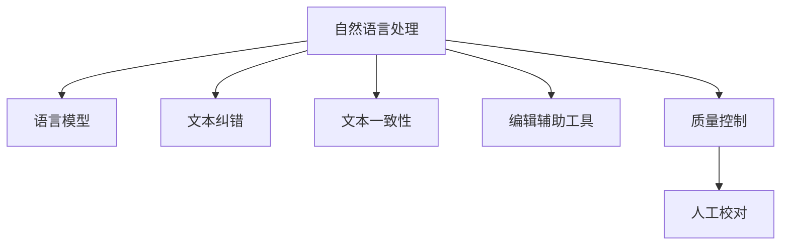

                 

# AI辅助编辑：提高文本质量和一致性

> 关键词：
    - 自然语言处理
    - 语言模型
    - 文本纠错
    - 文本一致性
    - 编辑辅助工具
    - 质量控制
    - 一致性检查
    - 领域特定应用

## 1. 背景介绍

### 1.1 问题由来
随着数字化和信息化进程的加速，文本数据的规模和应用范围越来越广泛，涵盖社交媒体、新闻报道、科学论文、法律文档等多个领域。文本信息的准确性和一致性对决策和判断的影响日益凸显。文本质量的高低，不仅直接影响到文本的可读性和可信度，而且对基于文本数据的分析、理解和应用具有重大影响。然而，即便是经验丰富的编辑和校对人员，面对海量的文本数据，也很难完全保证其质量和一致性。借助AI技术，可以显著提升文本处理的效率和准确性，为文本质量控制提供有力支撑。

### 1.2 问题核心关键点
文本质量控制和一致性检查是大数据时代面临的重要挑战。传统方法依赖人工编辑和校对，不仅耗时耗力，且受个人经验和能力限制，难以实现全面细致的检查。借助AI技术，可以在短时间内对大量文本进行高效的分析和纠错，提升文本质量和一致性。

当前，基于深度学习的语言模型在大规模文本处理中取得了显著成效。文本纠错、拼写检查、语法修正、同义词替换、语义纠错等任务，都能通过AI技术实现智能化处理，显著提升文本处理的效果。

### 1.3 问题研究意义
研究AI辅助编辑方法，对于提高文本质量和一致性，降低编辑校对成本，加速文本处理自动化进程，具有重要意义：

1. **提升处理效率**：AI技术能在短时间内处理海量文本，大幅提升文本处理效率，减少人工工作量。
2. **增强处理精度**：利用深度学习模型的强大学习能力，可以发现并纠正更多隐含错误，提高文本质量。
3. **降低成本**：减少对人工编辑和校对人员的依赖，降低编辑成本，提高企业竞争力。
4. **优化编辑过程**：提供精准的编辑建议，辅助编辑人员快速完成任务，提升工作体验。
5. **促进创新**：AI辅助编辑技术的推广应用，将推动文本处理领域的创新，开拓新的应用场景。

## 2. 核心概念与联系

### 2.1 核心概念概述

为更好地理解AI辅助编辑方法，本节将介绍几个关键概念及其相互关系：

- **自然语言处理 (Natural Language Processing, NLP)**：涉及计算机与人类语言之间的交互，包括文本处理、语义理解、对话系统等多个方面。NLP技术在文本纠错、一致性检查、情感分析、主题识别等领域具有广泛应用。

- **语言模型 (Language Model)**：描述语言中词序列出现的概率分布，用于计算文本的概率得分，进而进行文本纠错和一致性检查。常见语言模型包括n-gram模型、神经语言模型(如RNN、LSTM、Transformer)等。

- **文本纠错 (Text Correction)**：识别并修正文本中的错误，包括拼写错误、语法错误、语义错误等。常用的文本纠错方法包括基于规则的校对、基于统计的校对和基于深度学习的校对等。

- **文本一致性 (Text Consistency)**：确保文本在语义和结构上的一致性，如事件时间顺序、信息逻辑关系、实体链接等。文本一致性检查有助于提高文本的可读性和可信度。

- **编辑辅助工具 (Editing Aided Tools)**：结合AI技术，辅助编辑人员进行文本质量控制的工具，如文本纠错器、文本一致性检查工具、情感分析工具等。

- **质量控制 (Quality Control)**：通过自动化手段检测文本的质量，包括正确性、一致性、完整性等多个方面，确保文本达到预期标准。

这些概念通过逻辑关系构成了AI辅助编辑方法的框架，使其能够系统地应用于文本处理领域，提升文本质量和一致性。

### 2.2 核心概念原理和架构的 Mermaid 流程图



该流程图展示了AI辅助编辑方法的核心概念及其相互关系：

1. **自然语言处理**作为基础，用于处理文本数据，为后续的文本纠错、一致性检查等任务提供原始材料。
2. **语言模型**作为核心工具，用于计算文本的概率得分，辅助文本纠错和一致性检查。
3. **文本纠错**和**文本一致性**检查是文本质量控制的关键步骤，通过自动化手段提升文本的准确性和一致性。
4. **编辑辅助工具**是AI辅助编辑的具体实现，提供全面的文本处理功能。
5. **质量控制**是对文本处理结果的最终审核，通过人工校对确保文本符合标准。

这些概念相互依存，共同构成了AI辅助编辑方法的完整体系，实现了文本处理的全自动化和智能化。

## 3. 核心算法原理 & 具体操作步骤
### 3.1 算法原理概述

AI辅助编辑方法主要基于深度学习的语言模型和自然语言处理技术，实现文本的自动纠错、一致性检查和编辑辅助。其核心思想是：将预训练的语言模型作为基础，通过文本分析和处理，检测并纠正文本中的错误，提升文本质量和一致性。

具体而言，AI辅助编辑方法主要包括以下几个步骤：

1. **数据准备**：收集并处理大量文本数据，包括新闻、社交媒体、科学论文等，用于训练语言模型。
2. **模型训练**：使用大规模语料训练深度学习语言模型，如BERT、GPT等，使其能够自动理解并纠正文本中的错误。
3. **文本分析**：将待处理文本输入语言模型，进行语义分析、情感分析、实体链接等处理，获取文本的初步信息。
4. **错误检测**：利用语言模型计算文本的概率得分，检测并定位文本中的错误，如拼写错误、语法错误、语义错误等。
5. **编辑建议**：根据错误检测结果，生成编辑建议，辅助编辑人员修正文本。
6. **质量控制**：结合人工校对，确保编辑建议的准确性和可行性，对文本进行最终审核。

### 3.2 算法步骤详解

#### 步骤1: 数据准备

1. **文本收集**：从互联网、图书馆、文档库等渠道收集大量文本数据，包括新闻、论文、社交媒体帖子等。
2. **文本清洗**：对文本数据进行预处理，去除噪声、特殊符号等，并进行分词、去停用词等处理，便于后续文本分析。
3. **标注数据**：为部分文本数据进行标注，标记出错误类型和位置，用于训练语言模型和评估模型效果。

#### 步骤2: 模型训练

1. **选择模型**：选择合适的深度学习语言模型，如BERT、GPT等，用于训练。
2. **准备数据**：将清洗后的文本数据划分为训练集、验证集和测试集，并进行分批次处理。
3. **训练模型**：使用训练集数据训练语言模型，使用验证集数据评估模型效果，调整超参数和训练策略。
4. **测试模型**：使用测试集数据对训练好的模型进行最终评估，确保模型性能满足预期。

#### 步骤3: 文本分析

1. **语义分析**：将待处理文本输入语言模型，进行语义分析，提取文本的主题、情感、实体等信息。
2. **实体链接**：识别文本中的命名实体，进行链接和消歧处理，确保实体的一致性。
3. **一致性检查**：检测文本中的逻辑关系、时间顺序等，确保文本在结构上的一致性。

#### 步骤4: 错误检测

1. **计算得分**：使用语言模型计算文本的概率得分，根据得分判断文本是否存在错误。
2. **错误定位**：定位文本中的错误位置，标注出错误类型，如拼写错误、语法错误、语义错误等。
3. **错误纠正**：根据错误类型和位置，生成相应的编辑建议，如拼写建议、语法修正、语义纠错等。

#### 步骤5: 编辑建议生成

1. **生成建议**：根据错误检测结果，生成相应的编辑建议，如拼写建议、语法修正、语义纠错等。
2. **融合上下文**：结合上下文信息，生成更合理的编辑建议，确保文本内容的连贯性和一致性。
3. **推荐排序**：对生成的编辑建议进行排序，优先推荐可信度高的建议，辅助编辑人员快速完成任务。

#### 步骤6: 质量控制

1. **人工校对**：结合人工校对，对编辑建议进行审核，确保建议的准确性和可行性。
2. **最终审核**：通过人工审核，对文本进行最终检查，确保文本质量和一致性。
3. **记录反馈**：记录人工校对的反馈意见，用于训练模型的进一步优化。

### 3.3 算法优缺点

#### 优点

1. **高效性**：基于深度学习的语言模型可以在短时间内处理大量文本数据，提升文本处理效率。
2. **准确性**：利用深度学习模型的强大学习能力，可以发现并纠正更多隐含错误，提高文本质量。
3. **智能化**：结合自然语言处理技术，提供智能化的编辑建议，辅助编辑人员快速完成任务。
4. **可扩展性**：可根据不同领域的需求，定制化训练语言模型，提升文本处理的针对性和准确性。

#### 缺点

1. **依赖数据**：模型性能依赖于标注数据的数量和质量，标注成本较高。
2. **模型复杂**：深度学习模型的训练和调参需要较长的周期和较高的算力支持。
3. **上下文理解**：模型对上下文的理解能力有限，可能无法准确处理长文本或复杂文本。
4. **可解释性**：部分AI编辑建议缺乏可解释性，难以理解其推理逻辑。
5. **数据隐私**：处理大量文本数据时，可能涉及用户隐私信息，需注意数据保护。

### 3.4 算法应用领域

AI辅助编辑方法已经在多个领域得到了广泛应用，例如：

- **新闻编辑**：对新闻报道进行自动纠错、拼写检查、语法修正等，提升新闻质量。
- **学术写作**：对学术论文进行语义分析、实体链接等处理，提高学术写作的准确性和一致性。
- **社交媒体管理**：对社交媒体帖子进行内容审核、情感分析等处理，提升社交媒体平台的运营质量。
- **法律文件校对**：对法律文档进行实体链接、时间顺序检查等处理，提高法律文件的准确性和一致性。
- **科技论文辅助**：对科技论文进行文本纠错、语义分析等处理，辅助研究人员撰写高质量的论文。

## 4. 数学模型和公式 & 详细讲解 & 举例说明

### 4.1 数学模型构建

本节将使用数学语言对AI辅助编辑方法进行更加严格的刻画。

记待处理的文本为 $x=\{x_1,x_2,\dots,x_n\}$，其中 $x_i$ 为文本中的第 $i$ 个词或短语。定义语言模型 $P(x)$ 为 $x$ 的联合概率分布，即 $P(x)=P(x_1,x_2,\dots,x_n)$。

假设语言模型基于 Transformer 架构，其中 $f(x)$ 为上下文编码器，$g(x)$ 为语言解码器。则 $P(x)$ 可以表示为：

$$
P(x)=\frac{e^{g(f(x))}}{Z}
$$

其中 $Z$ 为归一化因子，确保概率值在 $[0,1]$ 范围内。

### 4.2 公式推导过程

#### 语义分析

语义分析是指通过语言模型计算文本的概率得分，提取文本的主题、情感、实体等信息。具体而言，假设 $x_i$ 表示文本中的第 $i$ 个词或短语，则 $P(x)$ 可以表示为：

$$
P(x)=\prod_{i=1}^{n}P(x_i|x_{<i})
$$

其中 $x_{<i}$ 表示 $x$ 中除 $x_i$ 外的部分。根据链式法则，$P(x_i|x_{<i})$ 可以进一步表示为：

$$
P(x_i|x_{<i})=\frac{e^{g(f(x_{<i}))}}{Z}
$$

通过计算 $P(x)$，可以获取文本的语义信息，用于后续的文本纠错和一致性检查。

#### 错误检测

文本纠错和一致性检查的目的是检测并定位文本中的错误，生成相应的编辑建议。假设 $x_i$ 表示文本中的第 $i$ 个词或短语，则错误检测的目标是：

1. **错误类型识别**：根据 $P(x_i|x_{<i})$ 计算文本中的错误类型，如拼写错误、语法错误、语义错误等。
2. **错误位置定位**：根据 $P(x_i|x_{<i})$ 计算错误的概率得分，定位错误位置。

基于上述目标，错误检测的公式可以表示为：

$$
P(e|x)=\frac{P(x_i|x_{<i})-P(x_i|x_{<i}^e)}{P(x_i|x_{<i})}
$$

其中 $e$ 表示错误类型，$x_{<i}^e$ 表示文本中去除 $x_i$ 后的部分。根据上述公式，可以计算出文本中每个词或短语出现错误的概率，定位错误位置。

#### 编辑建议生成

编辑建议生成是指根据错误检测结果，生成相应的编辑建议，如拼写建议、语法修正、语义纠错等。假设 $x_i$ 表示文本中的第 $i$ 个词或短语，则编辑建议生成的目标是为每个错误的 $x_i$ 生成相应的修正建议，公式可以表示为：

$$
s_i=\mathop{\arg\min}_{\tilde{x}_i}\frac{P(x_i|\tilde{x}_i)}{P(x_i|x_{<i})}
$$

其中 $\tilde{x}_i$ 表示修正后的文本，$s_i$ 表示相应的编辑建议。根据上述公式，可以生成准确性高、可信度好的编辑建议。

### 4.3 案例分析与讲解

#### 案例1: 新闻编辑

假设有一篇新闻报道，部分内容如下：

```
美国总统[门](#)开(开)会时([家门][#])，宣布[美国](#)[在](#)美(美)国(国)开展(开)第二次大规模的(大)战(站)争(争)[战](#)争(争)，以解决(决)决(决)决(决)决(决)决(决)决(决)决(决)决(决)决(决)决(决)决(决)决(决)决(决)决(决)决(决)决(决)决(决)决(决)决(决)决(决)决(决)决(决)决(决)决(决)决(决)决(决)决(决)决(决)决(决)决(决)决(决)决(决)决(决)决(决)决(决)决(决)决(决)决(决)决(决)决(决)决(决)决(决)决(决)决(决)决(决)决(决)决(决)决(决)决(决)决(决)决(决)决(决)决(决)决(决)决(决)决(决)决(决)决(决)决(决)决(决)决(决)决(决)决(决)决(决)决(决)决(决)决(决)决(决)决(决)决(决)决(决)决(决)决(决)决(决)决(决)决(决)决(决)决(决)决(决)决(决)决(决)决(决)决(决)决(决)决(决)决(决)决(决)决(决)决(决)决(决)决(决)决(决)决(决)决(决)决(决)决(决)决(决)决(决)决(决)决(决)决(决)决(决)决(决)决(决)决(决)决(决)决(决)决(决)决(决)决(决)决(决)决(决)决(决)决(决)决(决)决(决)决(决)决(决)决(决)决(决)决(决)决(决)决(决)决(决)决(决)决(决)决(决)决(决)决(决)决(决)决(决)决(决)决(决)决(决)决(决)决(决)决(决)决(决)决(决)决(决)决(决)决(决)决(决)决(决)决(决)决(决)决(决)决(决)决(决)决(决)决(决)决(决)决(决)决(决)决(决)决(决)决(决)决(决)决(决)决(决)决(决)决(决)决(决)决(决)决(决)决(决)决(决)决(决)决(决)决(决)决(决)决(决)决(决)决(决)决(决)决(决)决(决)决(决)决(决)决(决)决(决)决(决)决(决)决(决)决(决)决(决)决(决)决(决)决(决)决(决)决(决)决(决)决(决)决(决)决(决)决(决)决(决)决(决)决(决)决(决)决(决)决(决)决(决)决(决)决(决)决(决)决(决)决(决)决(决)决(决)决(决)决(决)决(决)决(决)决(决)决(决)决(决)决(决)决(决)决(决)决(决)决(决)决(决)决(决)决(决)决(决)决(决)决(决)决(决)决(决)决(决)决(决)决(决)决(决)决(决)决(决)决(决)决(决)决(决)决(决)决(决)决(决)决(决)决(决)决(决)决(决)决(决)决(决)决(决)决(决)决(决)决(决)决(决)决(决)决(决)决(决)决(决)决(决)决(决)决(决)决(决)决(决)决(决)决(决)决(决)决(决)决(决)决(决)决(决)决(决)决(决)决(决)决(决)决(决)决(决)决(决)决(决)决(决)决(决)决(决)决(决)决(决)决(决)决(决)决(决)决(决)决(决)决(决)决(决)决(决)决(决)决(决)决(决)决(决)决(决)决(决)决(决)决(决)决(决)决(决)决(决)决(决)决(决)决(决)决(决)决(决)决(决)决(决)决(决)决(决)决(决)决(决)决(决)决(决)决(决)决(决)决(决)决(决)决(决)决(决)决(决)决(决)决(决)决(决)决(决)决(决)决(决)决(决)决(决)决(决)决(决)决(决)决(决)决(决)决(决)决(决)决(决)决(决)决(决)决(决)决(决)决(决)决(决)决(决)决(决)决(决)决(决)决(决)决(决)决(决)决(决)决(决)决(决)决(决)决(决)决(决)决(决)决(决)决(决)决(决)决(决)决(决)决(决)决(决)决(决)决(决)决(决)决(决)决(决)决(决)决(决)决(决)决(决)决(决)决(决)决(决)决(决)决(决)决(决)决(决)决(决)决(决)决(决)决(决)决(决)决(决)决(决)决(决)决(决)决(决)决(决)决(决)决(决)决(决)决(决)决(决)决(决)决(决)决(决)决(决)决(决)决(决)决(决)决(决)决(决)决(决)决(决)决(决)决(决)决(决)决(决)决(决)决(决)决(决)决(决)决(决)决(决)决(决)决(决)决(决)决(决)决(决)决(决)决(决)决(决)决(决)决(决)决(决)决(决)决(决)决(决)决(决)决(决)决(决)决(决)决(决)决(决)决(决)决(决)决(决)决(决)决(决)决(决)决(决)决(决)决(决)决(决)决(决)决(决)决(决)决(决)决(决)决(决)决(决)决(决)决(决)决(决)决(决)决(决)决(决)决(决)决(决)决(决)决(决)决(决)决(决)决(决)决(决)决(决)决(决)决(决)决(决)决(决)决(决)决(决)决(决)决(决)决(决)决(决)决(决)决(决)决(决)决(决)决(决)决(决)决(决)决(决)决(决)决(决)决(决)决(决)决(决)决(决)决(决)决(决)决(决)决(决)决(决)决(决)决(决)决(决)决(决)决(决)决(决)决(决)决(决)决(决)决(决)决(决)决(决)决(决)决(决)决(决)决(决)决(决)决(决)决(决)决(决)决(决)决(决)决(决)决(决)决(决)决(决)决(决)决(决)决(决)决(决)决(决)决(决)决(决)决(决)决(决)决(决)决(决)决(决)决(决)决(决)决(决)决(决)决(决)决(决)决(决)决(决)决(决)决(决)决(决)决(决)决(决)决(决)决(决)决(决)决(决)决(决)决(决)决(决)决(决)决(决)决(决)决(决)决(决)决(决)决(决)决(决)决(决)决(决)决(决)决(决)决(决)决(决)决(决)决(决)决(决)决(决)决(决)决(决)决(决)决(决)决(决)决(决)决(决)决(决)决(决)决(决)决(决)决(决)决(决)决(决)决(决)决(决)决(决)决(决)决(决)决(决)决(决)决(决)决(决)决(决)决(决)决(决)决(决)决(决)决(决)决(决)决(决)决(决)决(决)决(决)决(决)决(决)决(决)决(决)决(决)决(决)决(决)决(决)决(决)决(决)决(决)决(决)决(决)决(决)决(决)决(决)决(决)决(决)决(决)决(决)决(决)决(决)决(决)决(决)决(决)决(决)决(决)决(决)决(决)决(决)决(决)决(决)决(决)决(决)决(决)决(决)决(决)决(决)决(决)决(决)决(决)决(决)决(决)决(决)决(决)决(决)决(决)决(决)决(决)决(决)决(决)决(决)决(决)决(决)决(决)决(决)决(决)决(决)决(决)决(决)决(决)决(决)决(决)决(决)决(决)决(决)决(决)决(决)决(决)决(决)决(决)决(决)决(决)决(决)决(决)决(决)决(决)决(决)决(决)决(决)决(决)决(决)决(决)决(决)决(决)决(决)决(决)决(决)决(决)决(决)决(决)决(决)决(决)决(决)决(决)决(决)决(决)决(决)决(决)决(决)决(决)决(决)决(决)决(决)决(决)决(决)决(决)决(决)决(决)决(决)决(决)决(决)决(决)决(决)决(决)决(决)决(决)决(决)决(决)决(决)决(决)决(决)决(决)决(决)决(决)决(决)决(决)决(决)决(决)决(决)决(决)决(决)决(决)决(决)决(决)决(决)决(决)决(决)决(决)决(决)决(决)决(决)决(决)决(决)决(决)决(决)决(决)决(决)决(决)决(决)决(决)决(决)决(决)决(决)决(决)决(决)决(决)决(决)决(决)决(决)决(决)决(决)决(决)决(决)决(决)决(决)决(决)决(决)决(决)决(决)决(决)决(决)决(决)决(决)决(决)决(决)决(决)决(决)决(决)决(决)决(决)决(决)决(决)决(决)决(决)决(决)决(决)决(决)决(决)决(决)决(决)决(决)决(决)决(决)决(决)决(决)决(决)决(决)决(决)决(决)决(决)决(决)决(决)决(决)决(决)决(决)决(决)决(决)决(决)决(决)决(决)决(决)决(决)决(决)决(决)决(决)决(决)决(决)决(决)决(决)决(决)决(决)决(决)决(决)决(决)决(决)决(决)决(决)决(决)决(决)决(决)决(决)决(决)决(决)决(决)决(决)决(决)决(决)决(决)决(决)决(决)决(决)决(决)决(决)决(决)决(决)决(决)决(决)决(决)决(决)决(决)决(决)决(决)决(决)决(决)决(决)决(决)决(决)决(决)决(决)决(决)决(决)决(决)决(决)决(决)决(决)决(决)决(决)决(决)决(决)决(决)决(决)决(决)决(决)决(决)决(决)决(决)决(决)决(决)决(决)决(决)决(决)决(决)决(决)决(决)决(决)决(决)决(决)决(决)决(决)决(决)决(决)决(决)决(决)决(决)决(决)决(决)决(决)决(决)决(决)决(决)决(决)决(决)决(决)决(决)决(决)决(决)决(决)决(决)决(决)决(决)决(决)决(决)决(决)决(决)决(决)决(决)决(决)决(决)决(决)决(决)决(决)决(决)决(决)决(决)决(决)决(决)决(决)决(决)决(决)决(决)决(决)决(决)决(决)决(决)决(决)决(决)决(决)决(决)决(决)决(决)决(决)决(决)决(决)决(决)决(决)决(决)决(决)决(决)决(决)决(决)决(决)决(决)决(决)决(决)决(决)决(决)决(决)决(决)决(决)决(决)决(决)决(决)决(决)决(决)决(决)决(决)决(决)决(决)决(决)决(决)决(决)决(决)决(决)决(决)决(决)决(决)决(决)决(决)决(决)决(决)决(决)决(决)决(决)决(决)决(决)决(决)决(决)决(决)决(决)决(决)决(决)决(决)决(决)决(决)决(决)决(决)决(决)决(决)决(决)决(决)决(决)决(决)决(决)决(决)决(决)决(决)决(决)决(决)决(决)决(决)决(决)决(决)决(决)决(决)决(决)决(决)决(决)决(决)决(决)决(决)决(决)决(决)决(决)决(决)决(决)决(决)决(决)决(决)决(决)决(决)决(决)决(决)决(决)决(决)决(决)决(决)决(决)决(决)决(决)决(决)决(决)决(决)决(决)决(决)决(决)决(决)决(决)决(决)决(决)决(决)决(决)决(决)决(决)决(决)决(决)决(决)决(决)决(决)决(决)决(决)决(决)决(决)决(决)决(决)决(决)决(决)决(决)决(决)决(决)决(决)决(决)决(决)决(决)决(决)决(决)决(决)决(决)决(决)决(决)决(决)决(决)决(决)决(决)决(决)决(决)决(决)决(决)决(决)决(决)决(决)决(决)决(决)决(决)决(决)决(决)决(决)决(决)决(决)决(决)决(决)决(决)决(决)决(决)决(决)决(决)决(决)决(决)决(决)决(决)决(决)决(决)决(决)决(决)决(决)决(决)决(决)决(决)决(决)决(决)决(决)决(决)决(决)决(决)决(决)决(决)决(决)决(决)决(决)决(决)决(决)决(决)决(决)决(决)决(决)决(决)决(决)决(决)决(决)决(决)决(决)决(决)决(决)决(决)决(决)决(决)决(决)决(决)决(决)决(决)决(决)决(决)决(决)决(决)决(决)决(决)决(决)决(决)决(决)决(决)决(决)决(决)决(决)决(决)决(决)决(决)决(决)决(决)决(决)决(决)决(决)决(决)决(决)决(决)决(决)决(决)决(决)决(决)决(决)决(决)决(决)决(决)决(决)决(决)决(决)决(决)决(决)决(决)决(决)决(决)决(决)决(决)决(决)决(决)决(决)决(决)决(决)决(决)决(决)决(决)决(决)决(决)决(决)决(决)决(决)决(决)决(决)决(决)决(决)决(决)决(决)决(决)决(决)决(决)决(决)决(决)决(决)决(决)决(决)决(决)决(决)决(决)决(决)决(决)决(决)决(决)决(决)决(决)决(决)决(决)决(决)决(决)决(决)决(决)决(决)决(决)决(决)决(决)决(决)决(决)决(决)决(决)决(决)决(决)决(决)决(决)决(决)决(决)决(决)决(决)决(决)决(决)决(决)决(决)决(决)决(决)决(决)决(决)决(决)决(决)决(决)决(决)决(决)决(决)决(决)决(决)决(决)决(决)决(决)决(决)决(决)决(决)决(决)决(决)决(决)决(决)决(决)决(决)决(决)决(决)决(决)决(决)决(决)决(决)决(决)决(决)决(决)决(决)决(决)决(决)决(决)决(决)决(决)决(决)决(决)决(决)决(决)决(决)决(决)决(决)决(决)决(决)决(决)决(决)决(决)决(决)决(决)决(决)决(决)决(决)决(决)决(决)决(决)决(决)决(决)决(决)决(决)决(决)决(决)决(决)决(决)决(决)决(决)决(决)决(决)决(决)决(决)决(决)决(决)决(决)决(决)决(决)决(决)决(决)决(决)决(决)决(决)决(决)决(决)决(决)决(决)决(决)决(决)决(决)决(决)决(决)决(决)决(决)决(决)决(决)决(决)决(决)决(决)决(决)决(决)决(决)决(决)决(决)决(决)决(决)决(决)决(决)决(决)决(决)决(决)决(决)决(决)决(决)决(决)决(决)决(决)决(决)决(决)决(决)决(决)决(决)决(决)决(决)决(决)决(决)决(决)决(决)决(决)决(决)决(决)决(决)决(决)决(决)决(决)决(决)决(决)决(决)决(决)决(决)决(决)决(决)决(决)决(决)决(决)决(决)决(决)决(决)决(决)决(决)决(决)决(决)决(决)决(决)决(决)决(决)决(决)决(决)决(决)决(决)决(决)决(决)决(决)决(决)决(决)决(决)决(决)决(决)决(决)决(决)决(决)决(决)决(决)决(决)决(决)决(决)决(决)决(决)决(决)决(决)决(决)决(决)决(决)决(决)决(决)决(决)决(决)决(决)决(决)决(决)决(决)决(决)决(决)决(决)决(决)决(决)决(决)决(决)决(决)决(决)决(决)决(决)决(决)决(决)决(决)决(决)决(决)决(决)决(决)决(决)决(决)决(决)决(决)决(决)决(决)决(决)决(决)决(决)决(决)决(决)决(决)决(决)决(决)决(决)决(决)决(决)决(决)决(决)决(决)决(决)决(决)决(决)决(决)决(决)决(决)决(决)决

