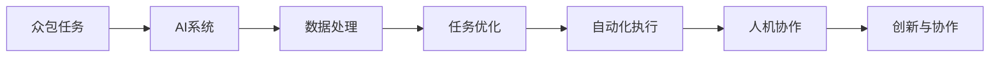

                 

# AI驱动的众包：增强创新和协作

## 1. 背景介绍

在科技发展的推动下，人工智能（AI）技术正迅速改变各个行业的工作方式。随着AI在自然语言处理、计算机视觉、机器人学等领域取得突破，AI正在从辅助工具逐步走向核心生产力，帮助企业和个人在众多场景中实现自动化和智能化。

然而，AI技术的高复杂性和应用难度，使得很多企业和个人难以独立部署和利用。特别是在创新和协作领域，AI驱动的众包模式应运而生，利用集体智慧和资源，打破传统模式的局限，大幅提升创新效率和协作效果。

## 2. 核心概念与联系

### 2.1 核心概念概述

在探索AI驱动的众包模式时，我们需要了解一些关键概念和其联系。

- **AI驱动的众包**：指通过AI技术，如机器学习、自然语言处理、计算机视觉等，在众包平台中自动化处理任务，提升任务效率和准确性。

- **增强创新和协作**：AI驱动的众包平台不仅自动化任务，还能通过数据和算法优化，提供更好的创意和协作环境，促进团队间的信息共享和创新合作。

- **人机协作**：AI系统与人类工作者相结合，共同完成复杂任务，互补各自的优势。

这些核心概念共同构成了AI驱动的众包模式，旨在通过技术手段实现更高效、更智能的众包工作。

### 2.2 核心概念原理和架构的 Mermaid 流程图(Mermaid 流程节点中不要有括号、逗号等特殊字符)



在这个流程图中，A代表原始众包任务，B代表AI系统，C代表数据处理过程，D代表任务优化，E代表自动化执行，F代表人机协作，G代表创新与协作的最终效果。这些环节相互依存，共同推动了AI驱动的众包模式的运作。

## 3. 核心算法原理 & 具体操作步骤

### 3.1 算法原理概述

AI驱动的众包模式，通过AI技术和众包机制结合，利用机器学习、深度学习等算法，对任务进行自动化处理和优化。其核心算法原理包括：

- **数据预处理**：对原始数据进行清洗、标注、归一化等预处理，提高数据质量，为后续算法训练提供坚实基础。
- **模型训练**：利用机器学习算法（如随机森林、神经网络）或深度学习算法（如卷积神经网络、循环神经网络），训练出适合的模型，用于任务自动化处理。
- **任务自动化**：将训练好的模型部署到众包平台上，自动处理众包任务，提升任务执行效率。
- **人机协作**：通过AI算法优化任务分配和调度，提高人工工作者在任务中的参与度和效率。

### 3.2 算法步骤详解

AI驱动的众包模式通常包括以下关键步骤：

**Step 1: 数据收集与预处理**
- 收集众包任务的原始数据，包括文本、图像、视频等多种形式。
- 对数据进行预处理，如去噪、标注、归一化等，确保数据质量。

**Step 2: 数据划分与标注**
- 将数据划分为训练集、验证集和测试集。
- 对训练集和验证集进行标注，生成带标签的数据集。

**Step 3: 模型选择与训练**
- 选择合适的机器学习或深度学习模型。
- 利用标注数据集对模型进行训练，调整超参数以优化模型性能。

**Step 4: 模型部署与任务自动化**
- 将训练好的模型部署到众包平台。
- 自动化处理众包任务，如文本分类、图像识别、视频分析等。

**Step 5: 人机协作与创新**
- 根据任务处理结果，通过AI算法优化任务分配和调度，提升人工工作者的效率和参与度。
- 利用协作工具和数据共享平台，促进团队间的信息交流和创新合作。

**Step 6: 持续优化与改进**
- 定期收集新数据，对模型进行重新训练，提高模型性能。
- 通过用户反馈和协作数据，持续优化任务处理流程和协作效果。

### 3.3 算法优缺点

AI驱动的众包模式具有以下优点：

- **效率提升**：通过自动化任务处理，大幅提升任务执行效率，节省人力资源。
- **成本降低**：减少人工干预，降低人力成本和错误率。
- **质量优化**：AI算法能够提供更为精准和一致的任务处理结果，提升任务质量。
- **创新促进**：人机协作环境鼓励创意和合作，推动创新发展。

同时，该模式也存在一定的局限性：

- **数据依赖**：模型的效果很大程度上依赖于数据的质量和多样性，数据收集和标注成本较高。
- **技术门槛**：AI技术复杂度高，需要专业的技术人员进行模型训练和部署。
- **算法鲁棒性**：AI算法可能对异常数据或复杂场景处理效果不佳，需要进一步优化和改进。
- **人机协作难度**：人机协作中的沟通和协调问题，仍需依靠人工干预和经验。

尽管存在这些局限性，但AI驱动的众包模式仍然为各个行业带来了巨大的变革潜力，值得进一步探索和应用。

### 3.4 算法应用领域

AI驱动的众包模式在多个领域都有广泛应用，具体包括：

- **自然语言处理**：如文本分类、情感分析、机器翻译等。利用AI技术，自动化处理文本数据，提升文本处理的效率和准确性。
- **计算机视觉**：如图像识别、目标检测、人脸识别等。通过AI算法，自动处理图像数据，提高图像识别的准确性和效率。
- **机器人学**：如自动驾驶、服务机器人等。利用AI技术，优化机器人行为和任务处理，提升机器人的智能化水平。
- **智能制造**：如设备维护、质量检测等。通过AI技术，自动化处理制造数据，提升生产效率和产品质量。
- **健康医疗**：如医学影像分析、智能问诊等。利用AI技术，自动化处理医疗数据，提高医疗诊断和处理的效率和准确性。

这些应用领域展示了AI驱动的众包模式在各个行业中的广泛应用，体现了其强大的适应性和应用潜力。

## 4. 数学模型和公式 & 详细讲解 & 举例说明

### 4.1 数学模型构建

在本节中，我们将通过数学模型和公式，详细讲解AI驱动的众包模式的核心算法原理。

假设有一个文本分类任务，我们需要对文本数据进行自动分类，以判断文本所属的类别。我们假设原始文本为 $X$，其类别为 $Y$。

**Step 1: 数据预处理**
- 对原始文本进行去噪、分词、标注等预处理，生成带标签的训练数据集 $D$。

**Step 2: 模型训练**
- 选择一个适合的分类器（如支持向量机、神经网络），记为 $M$。
- 利用训练数据集 $D$ 对分类器 $M$ 进行训练，得到最优参数 $\theta$。
- 训练过程中，通过正则化技术（如L2正则），避免过拟合。

**Step 3: 任务自动化**
- 将训练好的分类器 $M$ 部署到众包平台上。
- 对新的文本数据进行自动化分类，输出类别概率分布。

**Step 4: 人机协作与创新**
- 利用协作平台，展示分类结果和任务反馈。
- 通过AI算法优化任务分配和调度，提高人工工作者的参与度和效率。

### 4.2 公式推导过程

我们以文本分类为例，推导核心算法公式。

假设分类器 $M$ 输出文本分类结果的概率分布为 $P(Y|X)$，其与真实标签 $Y$ 的似然函数为 $L(Y|X)$，则分类器的损失函数为：

$$
L = -\log \sum_{y \in Y} P(Y=y|X)
$$

通过最小化损失函数，优化分类器 $M$ 的参数 $\theta$。在训练过程中，通过反向传播算法更新模型参数，实现模型的迭代优化。

### 4.3 案例分析与讲解

以图像识别为例，说明AI驱动的众包模式在计算机视觉领域的应用。

**Step 1: 数据收集与预处理**
- 收集图像数据集，如CIFAR-10、ImageNet等。
- 对图像进行预处理，如裁剪、缩放、归一化等。

**Step 2: 数据划分与标注**
- 将数据划分为训练集、验证集和测试集。
- 对训练集和验证集进行标注，生成带标签的图像数据集。

**Step 3: 模型选择与训练**
- 选择卷积神经网络（CNN）作为模型，利用标注数据集对模型进行训练。
- 使用交叉熵损失函数和反向传播算法，优化模型参数。

**Step 4: 模型部署与任务自动化**
- 将训练好的CNN模型部署到众包平台，如Amazon Mechanical Turk。
- 自动处理众包任务，如图像分类、目标检测等。

**Step 5: 人机协作与创新**
- 利用协作平台，展示分类结果和任务反馈。
- 通过AI算法优化任务分配和调度，提高人工工作者的参与度和效率。

## 5. 项目实践：代码实例和详细解释说明

### 5.1 开发环境搭建

在进行AI驱动的众包模式实践前，我们需要准备好开发环境。以下是使用Python进行PyTorch开发的简单配置流程：

1. 安装Anaconda：从官网下载并安装Anaconda，用于创建独立的Python环境。

2. 创建并激活虚拟环境：
```bash
conda create -n pytorch-env python=3.8 
conda activate pytorch-env
```

3. 安装PyTorch：根据CUDA版本，从官网获取对应的安装命令。例如：
```bash
conda install pytorch torchvision torchaudio cudatoolkit=11.1 -c pytorch -c conda-forge
```

4. 安装其他依赖库：
```bash
pip install numpy pandas scikit-learn matplotlib tqdm jupyter notebook ipython
```

完成上述步骤后，即可在`pytorch-env`环境中开始项目实践。

### 5.2 源代码详细实现

下面我们以图像识别任务为例，给出使用PyTorch进行CNN模型训练和微调的代码实现。

首先，定义数据处理函数：

```python
import torch
from torchvision import transforms
from torch.utils.data import DataLoader
from torchvision.datasets import CIFAR10

class CIFAR10DataLoader:
    def __init__(self, batch_size=64):
        self.train_dataset = CIFAR10(root='data/cifar10/', train=True, download=True, transform=transforms.Compose([
            transforms.ToTensor(),
            transforms.Normalize((0.5, 0.5, 0.5), (0.5, 0.5, 0.5))
        ]))
        self.test_dataset = CIFAR10(root='data/cifar10/', train=False, download=True, transform=transforms.Compose([
            transforms.ToTensor(),
            transforms.Normalize((0.5, 0.5, 0.5), (0.5, 0.5, 0.5))
        ]))
        self.train_loader = DataLoader(self.train_dataset, batch_size=batch_size, shuffle=True)
        self.test_loader = DataLoader(self.test_dataset, batch_size=batch_size, shuffle=False)
```

然后，定义模型和损失函数：

```python
from torch import nn, optim
from torch.nn import functional as F

class CNN(nn.Module):
    def __init__(self):
        super(CNN, self).__init__()
        self.conv1 = nn.Conv2d(3, 64, 3, 1)
        self.conv2 = nn.Conv2d(64, 128, 3, 1)
        self.fc1 = nn.Linear(128 * 8 * 8, 128)
        self.fc2 = nn.Linear(128, 10)

    def forward(self, x):
        x = F.relu(self.conv1(x))
        x = F.max_pool2d(x, 2, 2)
        x = F.relu(self.conv2(x))
        x = F.max_pool2d(x, 2, 2)
        x = x.view(-1, 128 * 8 * 8)
        x = F.relu(self.fc1(x))
        x = self.fc2(x)
        return F.log_softmax(x, dim=1)

model = CNN()
criterion = nn.CrossEntropyLoss()
```

接着，定义训练和评估函数：

```python
def train_epoch(model, loader, criterion, optimizer, device):
    model.to(device)
    model.train()
    epoch_loss = 0
    for data, target in loader:
        data, target = data.to(device), target.to(device)
        optimizer.zero_grad()
        output = model(data)
        loss = criterion(output, target)
        loss.backward()
        optimizer.step()
        epoch_loss += loss.item()
    return epoch_loss / len(loader)

def evaluate(model, loader, criterion, device):
    model.eval()
    epoch_loss = 0
    correct = 0
    with torch.no_grad():
        for data, target in loader:
            data, target = data.to(device), target.to(device)
            output = model(data)
            loss = criterion(output, target)
            epoch_loss += loss.item()
            _, predicted = torch.max(output.data, 1)
            correct += (predicted == target).sum().item()
    return epoch_loss / len(loader), correct / len(loader.dataset)

device = torch.device('cuda') if torch.cuda.is_available() else torch.device('cpu')
```

最后，启动训练流程并在测试集上评估：

```python
epochs = 10
batch_size = 64

for epoch in range(epochs):
    train_loss = train_epoch(model, train_loader, criterion, optim, device)
    print(f"Epoch {epoch+1}, train loss: {train_loss:.3f}")
    
    test_loss, accuracy = evaluate(model, test_loader, criterion, device)
    print(f"Epoch {epoch+1}, test loss: {test_loss:.3f}, accuracy: {accuracy:.2%}")
    
print("Final accuracy:", accuracy)
```

以上就是使用PyTorch进行图像识别任务训练和微调的完整代码实现。可以看到，PyTorch提供了简洁易用的API，使得模型的开发和训练过程更加高效。

### 5.3 代码解读与分析

让我们再详细解读一下关键代码的实现细节：

**CIFAR10DataLoader类**：
- `__init__`方法：初始化训练集和测试集，并设置数据加载器。
- `transforms.Compose`：定义数据预处理步骤，包括将图片转换为张量并进行归一化。

**CNN模型**：
- `__init__`方法：定义卷积层、全连接层等网络结构。
- `forward`方法：定义前向传播过程，包括卷积、池化、线性层等操作。

**训练和评估函数**：
- `train_epoch`函数：对模型进行前向传播、反向传播和参数更新，计算训练集的损失。
- `evaluate`函数：对模型进行前向传播，计算测试集的损失和准确率。

**训练流程**：
- 循环迭代多个epoch，在每个epoch内分别在训练集和测试集上评估模型性能。

可以看到，通过PyTorch，我们可以轻松实现CNN模型的训练和评估，提升图像识别的准确性和效率。

## 6. 实际应用场景

### 6.1 医疗影像分析

医疗影像分析是AI驱动众包模式的一个重要应用场景。传统医疗影像分析依赖于专业医生的人工标注，耗时长、成本高。利用AI技术，可以快速自动处理大量医疗影像数据，提高影像分析的效率和准确性。

具体而言，可以利用AI系统自动化标注影像数据，如X光片、CT扫描、MRI等。通过AI算法优化任务分配和调度，提升人工医生的参与度和效率。同时，AI系统可以实时提供分析结果，帮助医生快速做出诊断决策，提高诊疗效率和准确性。

### 6.2 智能制造

智能制造领域，AI驱动的众包模式可以应用于设备维护、质量检测等环节。利用AI技术，可以自动化处理设备数据，实时监测设备状态，预测潜在故障，提供维修建议。

具体而言，可以利用AI系统自动处理传感器数据，通过算法分析设备状态和性能指标，识别异常情况和故障预警。通过协作平台，及时通知相关人员进行维护，提升设备运行的稳定性和可靠性。同时，利用协作工具，记录维修历史和反馈，持续优化AI模型，提高故障预测和处理的准确性。

### 6.3 个性化推荐系统

个性化推荐系统是AI驱动众包模式在电商、社交媒体等领域的典型应用。传统推荐系统依赖于用户行为数据，难以挖掘更深层次的用户兴趣和偏好。利用AI技术，可以通过多模态数据融合，提升推荐系统的个性化和精准度。

具体而言，可以利用AI系统自动处理用户行为数据、商品属性数据、评论数据等，通过算法分析用户兴趣和商品特征，生成个性化推荐结果。通过协作平台，展示推荐结果和用户反馈，持续优化推荐算法，提升推荐效果。同时，利用协作工具，收集用户反馈和行为数据，丰富推荐模型，提高推荐系统的智能性。

### 6.4 未来应用展望

随着AI技术的不断发展，AI驱动的众包模式将在更多领域得到应用，为各个行业带来深远影响。

在智慧城市治理中，AI系统可以应用于城市事件监测、舆情分析、应急指挥等环节，提高城市管理的自动化和智能化水平，构建更安全、高效的未来城市。在智能家居领域，AI系统可以自动处理家庭设备数据，优化家居环境，提升生活质量。在教育领域，AI系统可以应用于智能辅导、作业批改等环节，提高教育效率和质量。

## 7. 工具和资源推荐

### 7.1 学习资源推荐

为了帮助开发者系统掌握AI驱动的众包技术，这里推荐一些优质的学习资源：

1. **Deep Learning Specialization**（深度学习专项课程）：由Andrew Ng主讲的Coursera课程，深入浅出地讲解了深度学习的基本概念和核心算法。
2. **Hands-On Machine Learning with Scikit-Learn, Keras, and TensorFlow**（动手学深度学习）：由李沐主讲的Python深度学习教程，提供了丰富的实践案例，帮助读者快速上手。
3. **Computer Vision: Foundations and Applications**（计算机视觉基础与应用）：由Szegedy等主讲的Coursera课程，详细讲解了计算机视觉的算法和应用。
4. **Natural Language Processing Specialization**（自然语言处理专项课程）：由Coursera的多个课程组成的系列课程，全面介绍了自然语言处理的基本概念和核心算法。
5. **OpenAI Codex**（OpenAI代码库）：由OpenAI提供的代码生成工具，通过代码片段和示例，帮助开发者快速构建AI应用。

通过对这些资源的学习实践，相信你一定能够快速掌握AI驱动的众包技术的精髓，并用于解决实际的AI应用问题。

### 7.2 开发工具推荐

高效的开发离不开优秀的工具支持。以下是几款用于AI驱动众包开发的常用工具：

1. **Jupyter Notebook**：提供交互式编程环境，支持多语言编程，方便开发者进行代码测试和实验。
2. **TensorBoard**：提供模型训练和推理的可视化工具，方便开发者实时监测模型性能和调试问题。
3. **Weights & Biases**：提供模型训练的实验跟踪工具，记录和可视化模型训练过程中的各项指标，方便对比和调优。
4. **PyTorch**：提供灵活的深度学习框架，支持动态计算图和GPU加速，适合快速迭代研究。
5. **Keras**：提供高层次的API，方便开发者快速搭建深度学习模型，支持多种后端引擎。

合理利用这些工具，可以显著提升AI驱动众包项目的开发效率，加快创新迭代的步伐。

### 7.3 相关论文推荐

AI驱动的众包技术的发展源于学界的持续研究。以下是几篇奠基性的相关论文，推荐阅读：

1. **Deep Learning for Crowdsourcing: A Survey**：综述了深度学习在众包中的各种应用，提供了丰富的实例和案例。
2. **Harnessing Crowd Intelligence**：探讨了利用众包平台进行智能数据分析和处理的方法，提供了丰富的实践经验和理论支持。
3. **Human-AI Collaboration for Smart Manufacturing**：探讨了人机协作在智能制造中的应用，提供了多学科合作的成功案例。
4. **AI-Powered Personalization in Recommendation Systems**：探讨了AI技术在个性化推荐系统中的应用，提供了丰富的算法和优化方法。
5. **Healthcare AI in AI-Powered Crowdsourcing**：探讨了AI技术在医疗影像分析和个性化医疗中的应用，提供了丰富的实例和案例。

这些论文代表了大规模众包技术的最新发展脉络，通过学习这些前沿成果，可以帮助研究者把握学科前进方向，激发更多的创新灵感。

## 8. 总结：未来发展趋势与挑战

### 8.1 总结

本文对AI驱动的众包模式进行了全面系统的介绍。首先阐述了AI技术在众包中的应用背景和意义，明确了众包平台通过AI技术提升任务效率和效果的核心思想。其次，从原理到实践，详细讲解了AI驱动的众包模式的数学模型和关键步骤，给出了具体的代码实例。同时，本文还探讨了AI驱动众包模式在多个行业领域的应用前景，展示了其强大的应用潜力。

通过本文的系统梳理，可以看到，AI驱动的众包模式通过技术手段提升了众包平台的任务处理效率和效果，为各行各业带来了深远的变革。未来，随着AI技术的不断进步，AI驱动的众包模式将在更多领域得到广泛应用，为人工智能技术的发展注入新的动力。

### 8.2 未来发展趋势

展望未来，AI驱动的众包模式将呈现以下几个发展趋势：

1. **多模态融合**：AI驱动的众包模式将不仅仅处理文本、图像数据，而是进一步融合视觉、听觉、触觉等多模态数据，提升系统的智能性。
2. **人机协作深度化**：通过自然语言处理和机器翻译技术，提升人机沟通效率，增强协作效果。
3. **任务自动化和智能化**：利用AI技术，自动处理更复杂的任务，提高任务执行效率和质量。
4. **个性化推荐系统普及化**：AI驱动的众包模式将广泛应用于个性化推荐系统，提升推荐系统的智能性和精准度。
5. **实时协作和反馈**：利用协作平台，实时收集用户反馈，动态优化AI模型，提升系统的适应性和灵活性。
6. **跨领域应用拓展**：AI驱动的众包模式将不仅仅应用于电商、医疗等特定领域，而是向更多垂直行业扩展，提升全社会的智能化水平。

以上趋势展示了AI驱动的众包模式在各个行业的广阔前景，体现了其强大的应用潜力和发展空间。

### 8.3 面临的挑战

尽管AI驱动的众包模式已经取得了瞩目成就，但在迈向更加智能化、普适化应用的过程中，它仍面临着诸多挑战：

1. **数据质量问题**：AI驱动的众包模式高度依赖高质量的数据，数据收集和标注成本较高，数据质量直接影响系统性能。
2. **技术复杂度**：AI驱动的众包模式涉及多学科知识，需要高度的专业技术支持，对开发者的技术水平要求较高。
3. **算法鲁棒性**：AI算法可能对异常数据或复杂场景处理效果不佳，需要进一步优化和改进。
4. **人机协作难度**：人机协作中的沟通和协调问题，仍需依靠人工干预和经验。
5. **伦理和隐私问题**：AI驱动的众包模式涉及大量用户数据，需要严格保护用户隐私和数据安全。
6. **计算资源限制**：AI驱动的众包模式需要强大的计算资源支持，特别是在大数据和复杂模型的训练过程中，计算资源限制成为重要瓶颈。

这些挑战需要通过持续的技术创新和优化，逐步克服和解决。只有不断提升技术水平和用户体验，才能真正实现AI驱动的众包模式的大规模应用。

### 8.4 研究展望

面对AI驱动的众包模式面临的挑战，未来的研究需要在以下几个方面寻求新的突破：

1. **数据增强和质量优化**：探索如何利用数据增强技术和自动化标注技术，提升数据质量，降低数据收集和标注成本。
2. **模型鲁棒性和泛化能力**：开发鲁棒性强、泛化能力好的AI模型，提升系统在不同场景下的适应性和鲁棒性。
3. **人机协作优化**：利用自然语言处理和机器翻译技术，提升人机协作的效率和效果，降低人工干预的成本。
4. **计算资源优化**：采用分布式计算、模型压缩等技术，优化计算资源使用，降低计算成本和资源限制。
5. **隐私保护和安全**：引入隐私保护技术和数据加密技术，保护用户数据安全和隐私。

这些研究方向将推动AI驱动的众包模式走向更加成熟和稳定的应用阶段，为各行各业带来更高效、更智能的协作和创新。

## 9. 附录：常见问题与解答

**Q1：AI驱动的众包模式与传统众包模式有何不同？**

A: AI驱动的众包模式利用AI技术自动化处理任务，大幅提升任务执行效率和准确性。与传统众包模式相比，AI驱动的众包模式减少了人工干预，降低了人力成本和错误率，提升了任务质量。同时，AI驱动的众包模式还可以实时收集用户反馈和协作数据，动态优化AI模型，提升系统的智能化水平。

**Q2：AI驱动的众包模式在哪些领域有应用前景？**

A: AI驱动的众包模式在多个领域都有广泛应用前景，包括医疗影像分析、智能制造、个性化推荐系统、智能客服等。这些领域都涉及大量的数据处理和复杂的任务执行，AI驱动的众包模式能够提供高效、准确的解决方案，提升各个行业的智能化水平。

**Q3：AI驱动的众包模式如何处理异常数据和复杂场景？**

A: AI驱动的众包模式通过多模态数据融合和鲁棒性优化，提升了系统的适应性和鲁棒性。在处理异常数据和复杂场景时，可以利用数据增强技术和异常检测技术，提升模型的鲁棒性和泛化能力。同时，可以通过人机协作和人工干预，及时处理复杂和异常数据，确保系统的稳定性和可靠性。

**Q4：AI驱动的众包模式需要哪些技术和资源支持？**

A: AI驱动的众包模式需要多学科技术的综合支持，包括机器学习、深度学习、自然语言处理、计算机视觉等。同时，需要强大的计算资源支持，包括高性能GPU/TPU、分布式计算等。此外，还需要数据增强、异常检测、隐私保护等技术手段，确保系统的稳定性和安全性。

**Q5：AI驱动的众包模式是否适用于所有应用场景？**

A: AI驱动的众包模式在数据量大、任务复杂、处理效率要求高的场景中，具有显著优势。但对于一些简单、低技术门槛的任务，传统众包模式可能更为合适。同时，对于一些需要深度专业知识和经验的任务，AI驱动的众包模式也需要进一步优化和改进。

总之，AI驱动的众包模式为各个行业带来了深远的变革，通过技术手段提升了众包平台的任务处理效率和效果，为各行各业带来了新的发展机遇。然而，AI驱动的众包模式仍然面临诸多挑战，需要在技术创新和优化中不断探索和突破，才能实现更广泛的应用和普及。

