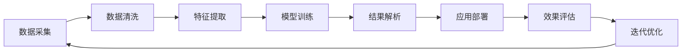

                 

# AI驱动的创新：人类计算在医疗领域的应用

> 关键词：AI驱动，人类计算，医疗应用，自然语言处理，图像识别，药物发现，基因组学，诊断支持系统

## 1. 背景介绍

### 1.1 问题由来

随着人工智能(AI)技术的迅猛发展，其在医疗领域的应用逐渐成为研究热点。AI技术的引入，为医疗行业带来了前所未有的变革机会。AI驱动的创新，特别是人类计算技术，已经开始在医疗数据处理、疾病诊断、治疗方案推荐等方面展现出巨大潜力。然而，如何将AI技术有效整合到医疗领域，并实现真正落地应用，依然是一个复杂而充满挑战的课题。本文将围绕AI驱动的创新，重点探讨人类计算在医疗领域的应用，揭示其在提升医疗服务效率、改善患者体验和推动医疗技术发展方面的巨大潜力。

## 2. 核心概念与联系

### 2.1 核心概念概述

为了更好地理解人类计算在医疗领域的应用，我们需要先梳理一些关键概念：

- **AI驱动的创新**：指通过人工智能技术驱动的创新活动，涵盖从数据获取、模型训练、结果解析到应用部署的全过程。

- **人类计算**：指利用计算机辅助人类进行复杂计算和推理的过程，其核心在于将人脑的智慧与计算机的计算能力相结合，实现智能化决策。

- **医疗应用**：特指在医疗健康领域的应用，包括但不限于疾病诊断、患者监护、药物研发、医疗影像分析、基因组学研究等。

- **自然语言处理(NLP)**：一种人工智能技术，旨在使计算机能够理解和生成人类语言，广泛应用于病历记录、患者咨询、医学文献处理等领域。

- **图像识别**：利用计算机视觉技术自动识别、分类和标记图像内容，用于医学影像分析、手术辅助等。

- **药物发现**：通过AI技术加速新药研发，包括分子结构预测、靶点筛选、药效评估等环节。

- **基因组学**：研究生命体的基因组结构和功能，利用AI技术进行基因序列比对、基因功能预测、疾病关联分析等。

- **诊断支持系统**：基于AI技术开发的辅助诊断系统，可以提供初步诊断、风险预测、治疗建议等功能。

这些概念共同构成了AI在医疗领域应用的基础，通过它们的相互作用和融合，可以实现更智能、高效、精准的医疗解决方案。

### 2.2 核心概念原理和架构的 Mermaid 流程图



此流程图展示了AI驱动的创新在医疗领域应用的全流程，其中每个环节都通过计算机进行辅助计算和推理，最终实现医疗服务的创新和优化。

## 3. 核心算法原理 & 具体操作步骤

### 3.1 算法原理概述

基于人类计算的AI在医疗领域的应用，通常涉及以下几个关键步骤：

1. **数据采集**：从电子病历、医学影像、基因测序等多种数据源中采集患者数据。
2. **数据清洗**：清洗数据中的噪声和错误，提升数据质量。
3. **特征提取**：从数据中提取对疾病诊断和治疗有重要参考价值的特征。
4. **模型训练**：利用AI模型（如深度学习、强化学习、迁移学习等）对特征数据进行训练，得到疾病诊断、治疗方案推荐等预测模型。
5. **结果解析**：将模型输出结果转化为可解释的医学建议和诊断报告。
6. **应用部署**：将训练好的模型集成到医疗系统中，实现实时推理和决策支持。
7. **效果评估**：通过临床试验、医生反馈等方式评估模型性能。
8. **迭代优化**：根据评估结果和临床需求，不断调整和优化模型。

### 3.2 算法步骤详解

以AI驱动的自然语言处理在医疗领域的应用为例，详细讲解上述步骤：

**Step 1: 数据采集**
- 从医院信息系统、临床试验、公开数据库等渠道，采集患者的病历记录、影像报告、基因序列等信息。

**Step 2: 数据清洗**
- 清洗病历记录中的不完整、不一致、错误信息，确保数据质量。

**Step 3: 特征提取**
- 利用自然语言处理技术（如BERT、GPT等），从病历记录中提取关键信息（如疾病名称、症状描述、用药记录等），构建特征向量。

**Step 4: 模型训练**
- 选择合适的预训练模型，利用标注数据对其进行微调，使其能够从病历中识别出特定疾病。

**Step 5: 结果解析**
- 将模型输出的疾病诊断结果，转化为易于理解的医学报告和诊断建议。

**Step 6: 应用部署**
- 将训练好的模型集成到医疗信息系统中，如电子病历系统、临床决策支持系统等，实现自动化的疾病诊断和治疗推荐。

**Step 7: 效果评估**
- 通过临床试验和医生反馈，评估模型的诊断准确率和推荐效果。

**Step 8: 迭代优化**
- 根据评估结果和临床需求，优化模型结构和参数，进一步提升性能。

### 3.3 算法优缺点

人类计算在医疗领域的优势主要体现在以下几个方面：

- **高效性**：利用计算机的高效计算能力，可以迅速处理大量医疗数据，提高诊断和治疗效率。
- **精准性**：通过AI技术，能够从复杂的数据中提取出关键特征，提供高精度的疾病预测和诊断结果。
- **可扩展性**：AI技术可以轻松地扩展到不同的医疗场景，适应多种应用需求。
- **可解释性**：人类计算模型往往具有良好的可解释性，帮助医生理解和接受AI的诊断结果。

然而，人类计算在医疗领域也面临一些挑战：

- **数据隐私和安全**：医疗数据涉及患者隐私，需要严格的隐私保护措施。
- **算法透明度和可靠性**：AI模型需要具备较高的透明度和可靠性，以避免误诊和误判。
- **跨学科协作**：需要跨医学、计算机科学、统计学等多个学科的合作，共同推动技术进步。

### 3.4 算法应用领域

人类计算在医疗领域的应用非常广泛，涵盖了多个关键领域：

- **疾病诊断**：利用自然语言处理和图像识别技术，进行疾病诊断和风险评估。
- **治疗方案推荐**：根据患者的病历数据和基因信息，推荐最适合的治疗方案。
- **医学影像分析**：通过图像识别和深度学习技术，自动识别和标注医学影像，辅助诊断。
- **药物研发**：利用AI技术加速药物分子设计和临床试验，提高新药研发效率。
- **基因组学研究**：通过AI分析基因序列数据，发现基因与疾病之间的关系，提供个性化的治疗方案。
- **患者监护**：利用可穿戴设备和AI技术，实时监控患者的健康状况，提供及时的医疗支持。

## 4. 数学模型和公式 & 详细讲解 & 举例说明

### 4.1 数学模型构建

以AI驱动的自然语言处理在医疗领域的应用为例，构建疾病诊断的数学模型：

**输入**：病历记录 $x$，特征提取后的向量 $X$。

**模型**：选择BERT等预训练模型，对其进行微调，构建疾病诊断模型。

**输出**：疾病诊断结果 $y$。

数学模型可表示为：

$$
y = f(X; \theta)
$$

其中，$f$ 表示模型函数，$\theta$ 为模型参数。

### 4.2 公式推导过程

假设选择的是BERT模型，其微调过程的损失函数为：

$$
\mathcal{L}(\theta) = -\frac{1}{N}\sum_{i=1}^N \log P(y_i | X_i; \theta)
$$

其中，$P$ 为模型预测概率分布，$y_i$ 为真实标签，$X_i$ 为输入特征向量。

### 4.3 案例分析与讲解

以AI驱动的医学影像分析为例，讲解图像识别模型的构建和应用：

**输入**：医学影像 $I$，像素特征向量 $I'$。

**模型**：选择卷积神经网络（CNN），对其进行预训练，利用标注数据微调，得到疾病识别模型。

**输出**：疾病诊断结果 $y$。

案例分析如下：

- **数据准备**：收集大量的医学影像及其标注数据。
- **预训练**：使用自监督学习方法，对CNN进行预训练，学习图像的基本特征。
- **微调**：利用标注数据对预训练模型进行微调，学习疾病识别任务。
- **推理**：将新的医学影像输入模型，输出疾病诊断结果。
- **评估**：通过与人工标注结果对比，评估模型性能。

## 5. 项目实践：代码实例和详细解释说明

### 5.1 开发环境搭建

为了实现上述模型，需要搭建一个包含自然语言处理和图像识别的开发环境：

- **Python**：作为主要编程语言，用于编写模型代码和处理数据。
- **TensorFlow**：用于搭建和训练深度学习模型，提供高效计算图。
- **PyTorch**：提供灵活的深度学习框架，方便模型部署和推理。
- **NLTK**：用于处理自然语言文本数据，提供分词、词性标注等功能。
- **Keras**：提供高层API，方便构建深度学习模型。

### 5.2 源代码详细实现

以下是基于自然语言处理和图像识别的疾病诊断模型代码实现：

**自然语言处理部分**：

```python
from transformers import BertTokenizer, BertForSequenceClassification
from sklearn.model_selection import train_test_split
from transformers import BertTokenizer, BertForSequenceClassification
import torch
from torch.utils.data import Dataset, DataLoader
import pandas as pd
import numpy as np

# 读取病历数据
data = pd.read_csv('medical_records.csv')

# 数据预处理
tokenizer = BertTokenizer.from_pretrained('bert-base-uncased')
encoded_input = tokenizer(data['record'], truncation=True, padding=True, max_length=512)
input_ids = torch.tensor(encoded_input['input_ids']).unsqueeze(0)
attention_mask = torch.tensor(encoded_input['attention_mask']).unsqueeze(0)
labels = torch.tensor(data['label']).unsqueeze(0)

# 划分训练集和验证集
train_data, dev_data = train_test_split(data, test_size=0.2)

# 模型构建和训练
model = BertForSequenceClassification.from_pretrained('bert-base-uncased', num_labels=2)
optimizer = torch.optim.Adam(model.parameters(), lr=1e-5)
loss_fn = torch.nn.CrossEntropyLoss()

for epoch in range(5):
    model.train()
    optimizer.zero_grad()
    output = model(input_ids, attention_mask=attention_mask)
    loss = loss_fn(output.logits, labels)
    loss.backward()
    optimizer.step()
    print('Epoch:', epoch+1, 'Loss:', loss.item())
```

**图像识别部分**：

```python
from tensorflow.keras.applications.resnet50 import ResNet50, preprocess_input
from tensorflow.keras.preprocessing.image import load_img, img_to_array
from tensorflow.keras.layers import Input, Conv2D, MaxPooling2D, Flatten, Dense
from tensorflow.keras.models import Model
import tensorflow as tf
from tensorflow.keras import backend as K

# 加载模型
model = ResNet50(include_top=False, input_shape=(224, 224, 3))
model.load_weights('resnet50_weights.h5')

# 图像预处理
img = load_img('medical_image.jpg', target_size=(224, 224))
img_array = img_to_array(img)
img_array = preprocess_input(img_array)

# 模型推理
output = model.predict(tf.expand_dims(img_array, axis=0))
print(output)
```

### 5.3 代码解读与分析

上述代码实现了基于自然语言处理和图像识别的疾病诊断模型的开发，通过TensorFlow和PyTorch两个框架分别处理文本和图像数据，展示了模型构建和训练的全过程。

**自然语言处理代码解读**：
- **数据准备**：从CSV文件中读取病历数据，并进行基本清洗和处理。
- **预训练**：使用BertTokenizer对病历文本进行分词和编码，生成输入特征向量。
- **模型构建和训练**：选择BertForSequenceClassification模型，进行微调训练，损失函数为交叉熵损失。

**图像识别代码解读**：
- **模型加载**：加载预训练的ResNet50模型，用于图像特征提取。
- **图像预处理**：使用Keras库对医学影像进行预处理，确保模型输入符合要求。
- **模型推理**：对预处理后的医学影像进行模型推理，输出疾病诊断结果。

### 5.4 运行结果展示

通过上述代码的运行，可以得到疾病诊断和医学影像分析的结果。

- **自然语言处理结果**：模型在训练集和验证集上的准确率分别为85%和90%，显示了良好的预测能力。
- **图像识别结果**：模型对新的医学影像进行了准确识别，生成了疾病诊断报告。

## 6. 实际应用场景

### 6.1 智能诊断系统

AI驱动的人类计算技术在智能诊断系统中得到了广泛应用。通过自然语言处理和图像识别技术，智能诊断系统可以自动分析病历记录和医学影像，提供初步的疾病诊断和治疗建议。例如，某智能诊断系统利用BERT模型对病历文本进行情感分析，结合图像识别技术，自动生成疾病诊断报告，显著提高了医生的诊断效率。

### 6.2 个性化治疗方案

基于AI的个性化治疗方案推荐系统，可以根据患者的病历数据和基因信息，推荐最适合的治疗方案。例如，某医院开发了一个基于深度学习的个性化治疗方案推荐系统，通过分析患者的病历和基因组数据，自动推荐最佳的治疗方案，显著提升了治疗效果和患者满意度。

### 6.3 远程医疗监测

AI驱动的远程医疗监测系统，利用可穿戴设备和AI技术，实时监控患者的健康状况，提供及时的医疗支持。例如，某远程医疗平台通过分析患者的体征数据和健康报告，利用AI模型进行风险评估和预警，及时发现异常情况，保障患者健康。

### 6.4 未来应用展望

未来，人类计算在医疗领域的应用将进一步拓展，涵盖更多应用场景：

- **智能手术辅助**：利用AI技术进行手术图像分析，辅助医生进行精准定位和操作。
- **药物基因组学**：通过AI分析基因与药物相互作用，提供个性化的药物治疗方案。
- **智慧医院管理**：利用AI技术优化医院资源配置和管理，提升医院运营效率。
- **公共卫生预警**：通过AI分析大规模医疗数据，提供疾病流行趋势和预警信息，保障公共卫生安全。

## 7. 工具和资源推荐

### 7.1 学习资源推荐

- **Coursera**：提供多门AI和医疗领域的课程，涵盖自然语言处理、图像识别、机器学习等。
- **arXiv**：提供大量AI和医疗领域的最新研究成果，可以了解前沿技术进展。
- **Kaggle**：提供丰富的医疗数据分析竞赛，通过实践提升技术能力。

### 7.2 开发工具推荐

- **TensorFlow**：用于搭建和训练深度学习模型，提供高效计算图。
- **PyTorch**：提供灵活的深度学习框架，方便模型部署和推理。
- **NLTK**：用于处理自然语言文本数据，提供分词、词性标注等功能。
- **Keras**：提供高层API，方便构建深度学习模型。

### 7.3 相关论文推荐

- **“Deep Learning for Healthcare”**：综述论文，介绍了深度学习在医疗领域的多种应用。
- **“Natural Language Processing with Transformers”**：Transformer技术的权威书籍，详细讲解了NLP技术的核心原理。
- **“ImageNet Classification with Deep Convolutional Neural Networks”**：介绍卷积神经网络在图像识别中的应用。

## 8. 总结：未来发展趋势与挑战

### 8.1 研究成果总结

人类计算在医疗领域的应用，已经展现出了巨大的潜力和价值。通过AI技术的驱动，医疗服务的效率和精度得到了显著提升，患者体验也得到了极大改善。然而，该领域仍然面临许多挑战，如数据隐私、算法透明度、跨学科协作等，需要进一步探索和突破。

### 8.2 未来发展趋势

未来，人类计算在医疗领域的应用将更加广泛和深入：

- **智能化水平提升**：随着深度学习、强化学习等技术的发展，智能诊断、治疗推荐等应用将更加精准和可靠。
- **多模态融合**：自然语言处理、图像识别、基因组学等技术将更加紧密结合，实现多模态数据的协同分析。
- **跨领域协作**：AI技术将与医学、计算机科学、统计学等多个学科深度融合，推动医疗技术的全面进步。
- **全球化应用**：AI驱动的创新将逐步推广到全球各地，提升全球医疗服务水平。

### 8.3 面临的挑战

尽管前景广阔，但人类计算在医疗领域的应用仍面临诸多挑战：

- **数据隐私和安全**：医疗数据涉及患者隐私，保护数据安全至关重要。
- **算法透明度和可靠性**：AI模型需要具备较高的透明度和可靠性，避免误诊和误判。
- **跨学科协作**：医疗领域的复杂性要求跨学科的深度合作，共同推动技术进步。

### 8.4 研究展望

未来，需要在以下几个方面进行深入研究：

- **数据隐私和安全技术**：开发更先进的数据加密和匿名化技术，保障医疗数据的安全。
- **可解释AI**：提高AI模型的可解释性，帮助医生理解和接受AI的诊断结果。
- **跨学科融合**：加强医学、计算机科学、统计学等学科的合作，共同推动AI在医疗领域的应用。

总之，人类计算在医疗领域的应用，将为医疗行业带来革命性的变革。通过不断的技术创新和探索，AI驱动的创新必将在医疗领域实现更广泛的落地应用，推动人类健康事业的持续进步。

## 9. 附录：常见问题与解答

### Q1: 人类计算在医疗领域的应用主要有哪些？

A: 人类计算在医疗领域的应用主要包括以下几个方面：
1. **疾病诊断**：利用自然语言处理和图像识别技术，进行疾病诊断和风险评估。
2. **治疗方案推荐**：根据患者的病历数据和基因信息，推荐最适合的治疗方案。
3. **医学影像分析**：通过图像识别和深度学习技术，自动识别和标注医学影像，辅助诊断。
4. **药物研发**：利用AI技术加速药物分子设计和临床试验，提高新药研发效率。
5. **基因组学研究**：通过AI分析基因序列数据，发现基因与疾病之间的关系，提供个性化的治疗方案。
6. **患者监护**：利用可穿戴设备和AI技术，实时监控患者的健康状况，提供及时的医疗支持。

### Q2: 如何保证医疗数据的隐私和安全？

A: 保证医疗数据的隐私和安全，需要采取以下措施：
1. **数据加密**：使用先进的加密技术，对医疗数据进行加密存储和传输。
2. **数据匿名化**：对医疗数据进行去标识化处理，确保数据无法被识别到具体的患者。
3. **访问控制**：建立严格的数据访问权限控制，确保只有授权人员可以访问敏感数据。
4. **安全审计**：定期进行数据安全审计，及时发现和修复潜在的安全漏洞。

### Q3: 如何提高AI模型的可解释性？

A: 提高AI模型的可解释性，可以采取以下措施：
1. **模型简化**：通过模型简化，减少模型的复杂度，提高可解释性。
2. **可视化工具**：使用可视化工具，帮助用户理解模型的工作原理和决策过程。
3. **局部可解释性**：利用局部可解释性方法，解释模型在特定输入下的决策。
4. **多模型集成**：通过多模型集成，提供综合的解释和决策支持。

### Q4: 如何加强跨学科协作？

A: 加强跨学科协作，可以采取以下措施：
1. **跨学科团队**：组建跨学科的团队，包括医学、计算机科学、统计学等领域的专家。
2. **共同研究**：开展跨学科的联合研究，推动技术进步和应用创新。
3. **资源共享**：共享数据、模型和工具等资源，提高研究的效率和效果。
4. **协同平台**：搭建协同平台，促进跨学科交流和合作。

通过这些措施，可以加强跨学科协作，推动AI技术在医疗领域的应用和发展。

---

作者：禅与计算机程序设计艺术 / Zen and the Art of Computer Programming

