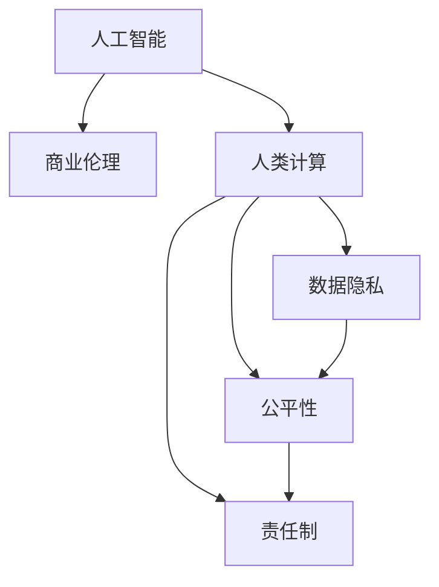

                 

# AI驱动的创新：人类计算在商业中的道德与伦理考虑

> 关键词：人工智能,商业伦理,人类计算,数据隐私,公平性,责任制

## 1. 背景介绍

### 1.1 问题由来
随着人工智能(AI)技术的飞速发展，AI在商业领域的应用已经逐步深入到决策、管理、营销等各个环节，成为了提升企业竞争力的重要工具。然而，在享受AI带来便利的同时，也伴随着一系列道德和伦理问题。如何在确保商业利益最大化的同时，兼顾社会责任和人类福祉，是当前AI应用中迫切需要解决的重要议题。

### 1.2 问题核心关键点
AI在商业中的应用，不仅涉及技术本身的算法和模型，还牵涉到数据隐私、公平性、责任制等伦理道德问题。这些问题直接关系到AI系统的可接受性和可持续性，需要在设计、开发、部署和使用过程中予以充分考虑。

### 1.3 问题研究意义
深入探讨AI在商业中的道德与伦理问题，对于构建一个公平、透明、负责任的AI生态系统，推动AI技术的健康发展，具有重要意义：

1. 提升企业社会责任：确保AI应用不侵犯隐私、不产生歧视、不造成社会不公，有助于塑造企业品牌形象，增强社会信任。
2. 保障消费者权益：确保AI服务透明、可解释，有助于消费者理解和使用AI产品，保障其知情权和选择权。
3. 促进技术规范发展：建立AI应用中的伦理标准和法规，有助于规范市场秩序，避免技术滥用，推动AI技术的可持续发展。
4. 增强公共安全：确保AI系统不引入安全隐患，有助于保护国家安全和公众利益，构建和谐社会。

## 2. 核心概念与联系

### 2.1 核心概念概述

为更好地理解AI在商业中的道德与伦理问题，本节将介绍几个密切相关的核心概念：

- 人工智能(AI)：指通过算法和计算实现的各种智能行为，包括感知、推理、学习等能力。
- 商业伦理(Ethics in Business)：涉及企业在经营活动中遵循的道德规范和价值取向，包括公正性、责任性、透明度等。
- 人类计算(Human Computation)：指利用AI技术帮助人类进行计算和决策，包括自然语言处理、数据挖掘、智能推荐等。
- 数据隐私(Privacy)：指保护个人、企业或其他组织的数据不被非法获取、使用或泄露，确保数据安全。
- 公平性(Fairness)：指AI系统在处理数据和提供服务时不产生歧视，确保所有用户享有平等机会和权利。
- 责任制(Accountability)：指AI系统在执行决策和操作时，有明确的责任归属和追责机制。

这些核心概念之间的逻辑关系可以通过以下Mermaid流程图来展示：



这个流程图展示了大语言模型的工作原理和优化方向：

1. 人工智能通过算法和计算实现各种智能行为。
2. 商业伦理确保AI应用遵循道德规范，推动公平、透明、责任的AI系统。
3. 人类计算利用AI技术帮助人类进行计算和决策。
4. 数据隐私涉及保护用户数据，确保数据安全。
5. 公平性指AI系统不产生歧视，确保用户享有平等机会。
6. 责任制指AI系统有明确的责任归属和追责机制。

这些概念共同构成了AI应用的核心框架，确保AI技术在商业中的健康发展。通过理解这些核心概念，我们可以更好地把握AI应用的方向和原则。

## 3. 核心算法原理 & 具体操作步骤
### 3.1 算法原理概述

AI在商业中的应用，本质上是将AI技术应用于各种商业场景中，通过算法和计算帮助企业实现决策、管理、营销等目标。其核心思想是：利用人工智能技术，辅助企业进行数据分析、模式识别、预测和决策，提升企业运营效率和盈利能力。

形式化地，假设企业有初始的业务数据集 $D=\{(x_i,y_i)\}_{i=1}^N$，其中 $x_i$ 为业务变量，$y_i$ 为对应的业务目标。企业希望通过AI模型学习到 $x_i$ 与 $y_i$ 之间的映射关系，从而在新的业务场景下预测 $y_i$。

具体而言，可以分为以下几个步骤：

1. 数据预处理：收集、清洗、标注、归一化等处理，确保数据质量。
2. 模型训练：选择合适的AI模型，如决策树、随机森林、神经网络等，在标注数据上训练模型，学习到 $x_i$ 与 $y_i$ 之间的映射关系。
3. 模型评估：使用测试集对训练好的模型进行评估，确保模型泛化能力。
4. 模型部署：将训练好的模型部署到企业系统中，实现自动化决策支持。
5. 模型优化：根据业务反馈和数据更新，定期重新训练和优化模型，提升模型性能。

### 3.2 算法步骤详解

以下是AI在商业中具体应用的一些关键步骤：

**Step 1: 数据收集与预处理**
- 收集企业的历史业务数据，包括客户信息、销售记录、市场调研等。
- 对数据进行清洗、标注、归一化等预处理，确保数据质量。

**Step 2: 模型选择与训练**
- 根据业务需求选择合适的AI模型，如回归模型、分类模型、聚类模型等。
- 使用标注数据对模型进行训练，调整模型参数，使其能够学习到业务数据与目标之间的映射关系。

**Step 3: 模型评估与调优**
- 使用测试集对训练好的模型进行评估，计算准确率、召回率、F1值等指标，确保模型泛化能力。
- 根据评估结果调整模型参数，进一步优化模型性能。

**Step 4: 模型部署与集成**
- 将训练好的模型部署到企业系统中，实现自动化决策支持。
- 集成到业务系统中，与企业现有的IT架构和流程无缝对接。

**Step 5: 监控与优化**
- 实时监控模型的运行状态和业务效果，收集业务反馈数据。
- 根据业务反馈和数据更新，定期重新训练和优化模型，确保模型性能持续提升。

### 3.3 算法优缺点

AI在商业中的应用，具有以下优点：
1. 提高运营效率：通过自动化数据分析和决策支持，大幅提高企业运营效率和盈利能力。
2. 降低成本：减少人工干预和决策偏差，降低运营成本。
3. 提供精准决策支持：基于数据驱动的决策支持，提升决策的精准度和科学性。
4. 促进创新：AI技术推动业务模式创新，带来新的商业机会。

同时，AI在商业中也存在一些局限性：
1. 依赖数据质量：AI模型的效果高度依赖于数据质量，数据偏差可能导致模型失效。
2. 透明性不足：AI模型的决策过程复杂，难以解释，难以实现透明和可控。
3. 安全风险：AI模型的自动化决策可能导致安全风险，需要严格的监控和控制。
4. 公平性问题：AI模型可能引入数据偏见和歧视，需要考虑公平性问题。
5. 隐私保护：AI模型需要大量数据进行训练，涉及数据隐私和保护问题。

尽管存在这些局限性，但AI在商业中的应用前景仍然广阔，仍需克服这些挑战，推动AI技术在商业中的健康发展。

### 3.4 算法应用领域

AI在商业中的应用领域非常广泛，涵盖以下几个主要方向：

- 客户关系管理(CRM)：通过AI分析客户行为和需求，提供个性化营销和客户服务。
- 营销自动化：利用AI进行市场分析、用户画像、个性化推荐等，提高营销效率和效果。
- 供应链管理：利用AI进行需求预测、库存优化、物流调度和风险管理，提升供应链效率。
- 智能客服：利用AI进行自然语言处理、智能推荐和对话生成，提供高效、可靠的客户服务。
- 智能财务：利用AI进行财务预测、风险评估、审计和合规管理，提升财务管理水平。
- 人力资源管理：利用AI进行招聘、培训、绩效评估和员工关系管理，优化人力资源配置。
- 健康医疗：利用AI进行疾病预测、患者管理、医疗影像分析和药物研发，提升医疗服务水平。

这些应用领域展示了AI技术在商业中的广泛应用，有助于企业实现数字化转型和智能化升级。

## 4. 数学模型和公式 & 详细讲解 & 举例说明（备注：数学公式请使用latex格式，latex嵌入文中独立段落使用 $$，段落内使用 $)
### 4.1 数学模型构建

AI在商业中的应用，通常需要建立数学模型来描述和预测业务变量之间的关系。以下是几个常见的数学模型：

- **线性回归模型**：用于预测连续型目标变量，模型形式为 $y_i = \beta_0 + \beta_1 x_{i1} + \ldots + \beta_k x_{ik} + \epsilon_i$，其中 $\beta$ 为回归系数，$\epsilon$ 为误差项。

- **逻辑回归模型**：用于预测二分类或多分类目标变量，模型形式为 $\text{Pr}(y_i=1) = \frac{1}{1+\exp(-\beta_0 - \beta_1 x_{i1} - \ldots - \beta_k x_{ik})$，其中 $\beta$ 为回归系数。

- **决策树模型**：用于处理分类和回归问题，模型通过递归地将数据集划分为多个子集，每个子集对应一个决策规则，最终形成一个树形结构。

- **随机森林模型**：是决策树的集成方法，通过随机采样和特征选择，提高模型的泛化能力和稳定性。

### 4.2 公式推导过程

以线性回归模型为例，推导其公式和参数估计方法。

假设业务数据集为 $D=\{(x_i,y_i)\}_{i=1}^N$，其中 $x_i = (x_{i1},x_{i2},\ldots,x_{ik})$，目标变量为 $y_i$。线性回归模型的目标是最小化样本均方误差，即：

$$
\min_{\beta} \sum_{i=1}^N (y_i - \beta_0 - \beta_1 x_{i1} - \ldots - \beta_k x_{ik})^2
$$

通过求导和极值求解，得到回归系数 $\beta$ 的估计值为：

$$
\beta = (X^T X)^{-1} X^T Y
$$

其中 $X = [x_1, x_2, \ldots, x_N]$，$Y = [y_1, y_2, \ldots, y_N]^T$。

### 4.3 案例分析与讲解

考虑一家电商企业的销售额预测问题，假设收集了客户浏览记录、购买记录、客户年龄、性别等信息，构建线性回归模型进行预测。具体步骤如下：

1. 收集客户数据，预处理数据，确保数据质量。
2. 构建特征向量 $X = [浏览记录, 购买记录, 客户年龄, 性别]$，目标变量 $Y = [销售额]$。
3. 使用最小二乘法估计回归系数 $\beta$，构建模型 $y_i = \beta_0 + \beta_1 x_{i1} + \ldots + \beta_k x_{ik}$。
4. 在测试集上评估模型，计算均方误差，确保模型泛化能力。
5. 根据业务反馈和数据更新，定期重新训练和优化模型。

## 5. 项目实践：代码实例和详细解释说明
### 5.1 开发环境搭建

在进行AI项目实践前，我们需要准备好开发环境。以下是使用Python进行PyTorch开发的环境配置流程：

1. 安装Anaconda：从官网下载并安装Anaconda，用于创建独立的Python环境。

2. 创建并激活虚拟环境：
```bash
conda create -n pytorch-env python=3.8 
conda activate pytorch-env
```

3. 安装PyTorch：根据CUDA版本，从官网获取对应的安装命令。例如：
```bash
conda install pytorch torchvision torchaudio cudatoolkit=11.1 -c pytorch -c conda-forge
```

4. 安装TensorFlow：
```bash
pip install tensorflow
```

5. 安装各类工具包：
```bash
pip install numpy pandas scikit-learn matplotlib tqdm jupyter notebook ipython
```

完成上述步骤后，即可在`pytorch-env`环境中开始项目实践。

### 5.2 源代码详细实现

这里我们以电商企业销售额预测为例，给出使用TensorFlow进行线性回归模型训练的PyTorch代码实现。

```python
import tensorflow as tf
import pandas as pd
from sklearn.model_selection import train_test_split
import numpy as np

# 读取数据集
data = pd.read_csv('sales_data.csv')

# 数据预处理
X = data[['browsing_time', 'purchase_amount', 'age', 'gender']]
Y = data['sales_amount']

# 划分训练集和测试集
X_train, X_test, Y_train, Y_test = train_test_split(X, Y, test_size=0.2, random_state=42)

# 定义模型
def linear_regression(X, Y, learning_rate=0.01, num_epochs=1000):
    m = tf.keras.Sequential([
        tf.keras.layers.Dense(1, input_dim=X.shape[1])
    ])
    optimizer = tf.keras.optimizers.SGD(learning_rate)
    
    # 训练模型
    for epoch in range(num_epochs):
        with tf.GradientTape() as tape:
            y_pred = m(X)
            loss = tf.losses.mean_squared_error(Y, y_pred)
        gradients = tape.gradient(loss, m.trainable_weights)
        optimizer.apply_gradients(zip(gradients, m.trainable_weights))
        if epoch % 100 == 0:
            print(f'Epoch {epoch+1}, Loss: {loss.numpy()}')
    
    return m

# 模型训练
m = linear_regression(X_train, Y_train)
```

以上是使用TensorFlow进行线性回归模型训练的完整代码实现。可以看到，利用TensorFlow的高阶API，我们可以轻松构建和训练线性回归模型。

### 5.3 代码解读与分析

让我们再详细解读一下关键代码的实现细节：

**linear_regression函数**：
- 定义了线性回归模型，包括输入层、输出层和优化器。
- 在每个epoch中，使用梯度下降更新模型参数，计算并输出loss。

**数据预处理**：
- 使用Pandas读取数据集，并进行数据预处理。
- 使用sklearn的train_test_split函数将数据划分为训练集和测试集。

**模型训练**：
- 定义模型并初始化优化器。
- 在每个epoch中，计算loss并更新模型参数，定期输出loss以监控训练过程。

**模型部署与集成**：
- 将训练好的模型部署到企业系统中，实现自动化决策支持。
- 集成到企业现有的IT架构和流程中，形成完整的AI商业解决方案。

## 6. 实际应用场景
### 6.1 智能客服系统

AI驱动的智能客服系统，利用自然语言处理和机器学习技术，通过分析客户咨询记录，自动生成回答，提供个性化服务。智能客服系统能够7x24小时不间断服务，快速响应客户咨询，提升客户满意度。

在技术实现上，可以收集企业内部的历史客服数据，将问题和最佳答复构建成监督数据，在此基础上对预训练模型进行微调。微调后的模型能够自动理解客户意图，匹配最合适的答案模板进行回复。对于客户提出的新问题，还可以接入检索系统实时搜索相关内容，动态组织生成回答。如此构建的智能客服系统，能大幅提升客户咨询体验和问题解决效率。

### 6.2 金融舆情监测

金融机构需要实时监测市场舆论动向，以便及时应对负面信息传播，规避金融风险。传统的人工监测方式成本高、效率低，难以应对网络时代海量信息爆发的挑战。利用AI驱动的文本分类和情感分析技术，为金融舆情监测提供了新的解决方案。

具体而言，可以收集金融领域相关的新闻、报道、评论等文本数据，并对其进行主题标注和情感标注。在此基础上对预训练语言模型进行微调，使其能够自动判断文本属于何种主题，情感倾向是正面、中性还是负面。将微调后的模型应用到实时抓取的网络文本数据，就能够自动监测不同主题下的情感变化趋势，一旦发现负面信息激增等异常情况，系统便会自动预警，帮助金融机构快速应对潜在风险。

### 6.3 个性化推荐系统

当前的推荐系统往往只依赖用户的历史行为数据进行物品推荐，无法深入理解用户的真实兴趣偏好。利用AI驱动的个性化推荐系统，可以更好地挖掘用户行为背后的语义信息，从而提供更精准、多样的推荐内容。

在实践中，可以收集用户浏览、点击、评论、分享等行为数据，提取和用户交互的物品标题、描述、标签等文本内容。将文本内容作为模型输入，用户的后续行为（如是否点击、购买等）作为监督信号，在此基础上微调预训练语言模型。微调后的模型能够从文本内容中准确把握用户的兴趣点。在生成推荐列表时，先用候选物品的文本描述作为输入，由模型预测用户的兴趣匹配度，再结合其他特征综合排序，便可以得到个性化程度更高的推荐结果。

### 6.4 未来应用展望

随着AI技术的不断发展，基于AI驱动的商业应用场景将更加多样。以下是对未来应用前景的展望：

1. 智能供应链管理：利用AI进行需求预测、库存优化、物流调度和风险管理，提升供应链效率。
2. 智能财务分析：利用AI进行财务预测、风险评估、审计和合规管理，提升财务管理水平。
3. 智能医疗诊断：利用AI进行疾病预测、患者管理、医疗影像分析和药物研发，提升医疗服务水平。
4. 智能营销决策：利用AI进行市场分析、用户画像、个性化推荐等，提高营销效率和效果。
5. 智能人力资源管理：利用AI进行招聘、培训、绩效评估和员工关系管理，优化人力资源配置。

这些应用场景展示了AI技术在商业中的广泛应用，有助于企业实现数字化转型和智能化升级。

## 7. 工具和资源推荐
### 7.1 学习资源推荐

为了帮助开发者系统掌握AI在商业中的应用，这里推荐一些优质的学习资源：

1. Coursera《AI for Everyone》课程：由斯坦福大学教授Andrew Ng开设的入门级AI课程，介绍AI的基本概念和应用场景。
2. edX《Introduction to Artificial Intelligence》课程：由MIT教授Patrick Winston主讲，深入浅出地讲解AI的基本原理和算法。
3. TensorFlow官方文档：TensorFlow的官方文档，提供丰富的教程、API文档和代码示例，是学习TensorFlow的重要资源。
4. PyTorch官方文档：PyTorch的官方文档，提供丰富的教程、API文档和代码示例，是学习PyTorch的重要资源。
5. 《Deep Learning with Python》书籍：Francois Chollet撰写的经典书籍，系统介绍深度学习的基本概念和TensorFlow应用。

通过对这些资源的学习实践，相信你一定能够快速掌握AI在商业中的应用。

### 7.2 开发工具推荐

高效的开发离不开优秀的工具支持。以下是几款用于AI项目开发的常用工具：

1. Jupyter Notebook：免费的开源Jupyter Notebook环境，支持多种编程语言，方便编写和运行代码。
2. Google Colab：谷歌提供的免费在线Jupyter Notebook环境，支持GPU/TPU算力，方便快速实验最新模型。
3. PyCharm：开源的Python IDE，功能强大，支持PyTorch、TensorFlow等多种框架。
4. Visual Studio Code：微软的开源代码编辑器，支持多种编程语言和插件，方便编写和调试代码。

合理利用这些工具，可以显著提升AI项目开发的效率，加快创新迭代的步伐。

### 7.3 相关论文推荐

AI在商业中的应用研究源于学界的持续探索。以下是几篇奠基性的相关论文，推荐阅读：

1. "Deep Learning" by Ian Goodfellow, Yoshua Bengio, and Aaron Courville：介绍深度学习的基本概念和应用，是学习深度学习的重要资源。
2. "Machine Learning Yearning" by Andrew Ng：介绍机器学习的基本概念和实践技巧，适用于工业界的工程师和研究人员。
3. "Fairness, Accountability, and Transparency" by Zuboff：探讨AI技术对社会公正的影响，呼吁构建公平、透明、负责任的AI生态系统。
4. "The AI Alignment Summit"：AI社区举办的讨论会，探讨AI技术的伦理道德问题，推动AI技术的健康发展。
5. "Human-AI Collaboration" by Fei-Fei Li：探讨AI技术与人类协作的未来方向，推动AI技术的普适化和人性化。

这些论文代表了大语言模型微调技术的发展脉络。通过学习这些前沿成果，可以帮助研究者把握学科前进方向，激发更多的创新灵感。

## 8. 总结：未来发展趋势与挑战
### 8.1 总结

本文对AI在商业中的应用进行了全面系统的介绍。首先阐述了AI在商业中的道德与伦理问题，明确了商业伦理和AI技术的相互关系。其次，从原理到实践，详细讲解了AI在商业中的关键步骤，给出了AI商业应用项目的完整代码实例。同时，本文还广泛探讨了AI在多个行业领域的应用前景，展示了AI技术的广阔前景。

通过本文的系统梳理，可以看到，AI在商业中的应用前景广阔，但其背后也面临着诸多挑战。如何在确保商业利益最大化的同时，兼顾社会责任和人类福祉，是当前AI应用中迫切需要解决的重要议题。

### 8.2 未来发展趋势

展望未来，AI在商业中的应用将呈现以下几个发展趋势：

1. 数据驱动的决策支持：AI技术将更多地应用于数据分析和决策支持，提升决策的科学性和准确性。
2. 自动化运营管理：AI技术将更多地应用于自动化运营管理，提升企业运营效率和盈利能力。
3. 跨领域的知识整合：AI技术将更多地应用于跨领域的知识整合，推动AI技术的普适化和人性化。
4. 个性化和定制化服务：AI技术将更多地应用于个性化和定制化服务，提升用户体验和满意度。
5. 动态调整与优化：AI技术将更多地应用于动态调整与优化，确保系统在不断变化的环境下持续高效运行。

这些趋势凸显了AI技术在商业中的广泛应用前景，有助于企业实现数字化转型和智能化升级。

### 8.3 面临的挑战

尽管AI在商业中的应用前景广阔，但在迈向更加智能化、普适化应用的过程中，仍面临诸多挑战：

1. 数据隐私保护：AI系统需要大量数据进行训练，涉及数据隐私和保护问题。如何在确保数据隐私的前提下，实现高效的AI训练，是一大难题。
2. 算法透明性和可解释性：AI系统的决策过程复杂，难以解释，难以实现透明和可控。如何提高AI系统的透明性和可解释性，是一大挑战。
3. 模型公平性问题：AI模型可能引入数据偏见和歧视，需要考虑公平性问题。如何在模型设计中引入公平性约束，是一大挑战。
4. 系统安全性问题：AI系统的自动化决策可能导致安全风险，需要严格的监控和控制。如何在保证系统安全性的同时，实现高效的AI训练和应用，是一大挑战。
5. 伦理道德问题：AI系统的自动化决策可能带来伦理道德问题，如决策歧视、隐私泄露等。如何在模型设计中引入伦理道德约束，是一大挑战。

这些挑战凸显了AI技术在商业中的应用需要谨慎和审慎，需要多方面的努力才能实现AI技术的健康发展。

### 8.4 研究展望

面对AI在商业中面临的诸多挑战，未来的研究需要在以下几个方面寻求新的突破：

1. 数据隐私保护技术：开发新的数据隐私保护技术，确保AI系统在保证数据隐私的前提下，实现高效的AI训练和应用。
2. 算法透明性和可解释性技术：开发新的算法透明性和可解释性技术，确保AI系统的决策过程透明和可控，提高用户信任度。
3. 公平性约束技术：开发新的公平性约束技术，确保AI模型不引入数据偏见和歧视，实现公平的AI应用。
4. 安全监控技术：开发新的安全监控技术，确保AI系统的自动化决策不会带来安全风险，实现高效和安全的AI应用。
5. 伦理道德约束技术：开发新的伦理道德约束技术，确保AI系统的自动化决策符合伦理道德规范，实现负责任的AI应用。

这些研究方向将推动AI技术在商业中的健康发展，为构建安全、可靠、可解释、可控的智能系统铺平道路。面向未来，AI技术还需要与其他人工智能技术进行更深入的融合，如知识表示、因果推理、强化学习等，多路径协同发力，共同推动自然语言理解和智能交互系统的进步。

## 9. 附录：常见问题与解答

**Q1：AI在商业中的应用有哪些常见问题？**

A: AI在商业中的应用常见问题包括：
1. 数据隐私问题：AI系统需要大量数据进行训练，涉及数据隐私和保护问题。
2. 算法透明性和可解释性问题：AI系统的决策过程复杂，难以解释，难以实现透明和可控。
3. 模型公平性问题：AI模型可能引入数据偏见和歧视，需要考虑公平性问题。
4. 系统安全性问题：AI系统的自动化决策可能导致安全风险，需要严格的监控和控制。
5. 伦理道德问题：AI系统的自动化决策可能带来伦理道德问题，如决策歧视、隐私泄露等。

**Q2：如何应对AI在商业中的伦理与道德问题？**

A: 应对AI在商业中的伦理与道德问题，可以从以下几个方面入手：
1. 数据隐私保护：确保数据收集和使用过程中遵守隐私法规，保护用户隐私。
2. 算法透明性和可解释性：确保AI系统的决策过程透明和可控，提高用户信任度。
3. 模型公平性：在模型设计中引入公平性约束，确保模型不引入数据偏见和歧视。
4. 系统安全性：开发新的安全监控技术，确保AI系统的自动化决策不会带来安全风险。
5. 伦理道德约束：在模型设计中引入伦理道德约束，确保AI系统的自动化决策符合伦理道德规范。

**Q3：AI在商业中的未来发展方向是什么？**

A: AI在商业中的未来发展方向包括：
1. 数据驱动的决策支持：AI技术将更多地应用于数据分析和决策支持，提升决策的科学性和准确性。
2. 自动化运营管理：AI技术将更多地应用于自动化运营管理，提升企业运营效率和盈利能力。
3. 跨领域的知识整合：AI技术将更多地应用于跨领域的知识整合，推动AI技术的普适化和人性化。
4. 个性化和定制化服务：AI技术将更多地应用于个性化和定制化服务，提升用户体验和满意度。
5. 动态调整与优化：AI技术将更多地应用于动态调整与优化，确保系统在不断变化的环境下持续高效运行。

这些发展方向凸显了AI技术在商业中的广泛应用前景，有助于企业实现数字化转型和智能化升级。

---

作者：禅与计算机程序设计艺术 / Zen and the Art of Computer Programming

