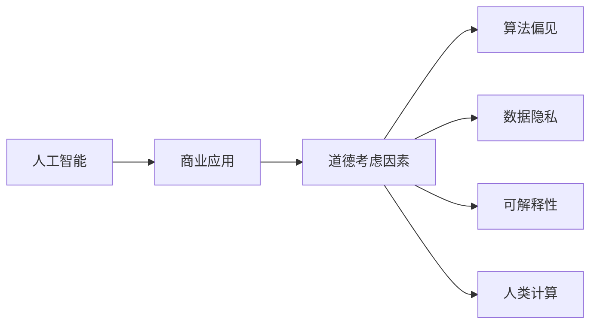

                 

# AI驱动的创新：人类计算在商业中的道德考虑因素总结

> 关键词：人工智能, 商业应用, 道德考虑, 算法偏见, 数据隐私, 可解释性, 人类计算, 自动化, 负责任创新

## 1. 背景介绍

### 1.1 问题由来

随着人工智能(AI)技术的迅猛发展，特别是深度学习和大数据的应用，AI已经渗透到各行各业，为商业创新带来了前所未有的机遇。从智能客服、推荐系统到自动驾驶，再到精准医疗，AI正在重塑人们的生活和工作方式。然而，AI在商业应用中的道德考虑因素也日益凸显。从算法偏见到数据隐私，从可解释性到自动化决策，AI的道德问题已经不能被忽视。如何在使用AI驱动创新的同时，确保其安全性、公正性和透明度，成为了亟需解决的重要问题。

### 1.2 问题核心关键点

AI在商业应用中的道德问题主要集中在以下几个方面：

- **算法偏见**：AI算法可能会因为训练数据的质量问题或者算法设计的不足，导致输出结果存在系统性偏差，从而对特定群体产生不公正的影响。
- **数据隐私**：AI系统往往依赖大量个人数据进行训练，如何保护用户的隐私成为一大挑战。
- **可解释性**：许多AI系统被视为“黑箱”，用户和监管机构难以理解和解释其决策过程。
- **自动化决策**：AI系统的自动化决策可能会对用户的自由意志和权益产生影响，需要谨慎对待。

### 1.3 问题研究意义

研究AI在商业应用中的道德问题，对于推动负责任的AI技术创新，保护用户权益，以及构建公平、透明的商业环境具有重要意义：

1. **促进负责任创新**：通过明确AI系统的道德边界，可以避免因技术滥用而带来的潜在风险，确保技术创新的正面影响。
2. **保护用户隐私**：在AI系统中引入隐私保护机制，可以保护用户数据不被滥用，增强用户信任。
3. **提升可解释性**：通过可解释性技术，可以增强AI系统的透明度，使用户和监管机构能够理解和监督AI决策。
4. **实现公正决策**：通过识别和纠正算法偏见，可以确保AI系统在应用中不歧视任何群体，促进社会公正。
5. **优化自动化决策**：通过引入人类计算和监督机制，可以在确保自动化决策高效的同时，保障用户自由意志和权益。

## 2. 核心概念与联系

### 2.1 核心概念概述

要理解AI在商业应用中的道德问题，首先需要明确几个核心概念：

- **人工智能**：指利用算法和计算技术模拟人类智能行为的技术，包括感知、学习、推理、决策等能力。
- **商业应用**：指AI技术在商业环境中的具体应用，如智能客服、推荐系统、自动驾驶等。
- **道德考虑因素**：指在使用AI驱动商业创新过程中，需要考虑的道德、伦理和法律问题。
- **算法偏见**：指AI算法在训练和应用过程中对特定群体产生的不公平对待。
- **数据隐私**：指在AI系统中处理个人数据时，保护用户隐私不被滥用的能力。
- **可解释性**：指AI系统输出结果可以被解释和理解的程度。
- **人类计算**：指在AI系统中结合人类智慧和判断，以提升系统的可靠性和伦理性。

这些概念之间存在紧密的联系，共同构成了AI在商业应用中的道德框架。

### 2.2 核心概念原理和架构的 Mermaid 流程图



这个流程图展示了AI在商业应用中的道德框架：

1. 人工智能是商业应用的基础。
2. 商业应用中需考虑的道德问题包括算法偏见、数据隐私、可解释性、人类计算等。
3. 这些道德问题相互影响，共同构成AI在商业应用中的伦理边界。

## 3. 核心算法原理 & 具体操作步骤

### 3.1 算法原理概述

AI在商业应用中的道德考虑因素，往往涉及到算法的设计和训练过程。因此，理解这些因素的算法原理，对于构建道德的AI系统至关重要。

在AI算法中，道德考虑因素主要体现在以下几个方面：

- **算法设计**：如何确保算法不偏向特定群体，不歧视任何个体。
- **数据处理**：如何保护数据隐私，确保数据使用合法合规。
- **决策过程**：如何使AI系统的决策过程透明、可解释，符合用户和监管的期望。
- **交互设计**：如何设计人机交互界面，确保用户对AI系统的理解和控制。

### 3.2 算法步骤详解

AI在商业应用中的道德考虑因素，涉及到算法设计、数据处理、决策过程和交互设计等多个环节。以下将详细讲解这些步骤。

**步骤1：算法设计**

算法设计是AI系统的基础，必须考虑到道德因素：

1. **公平性**：在设计算法时，确保算法对所有群体公平无偏。可以使用统计学方法和数据集平衡技术来减少偏见。
2. **透明性**：在算法设计中引入可解释性机制，使得算法决策过程可以被理解和解释。可以使用可解释性技术，如特征重要性分析、模型可视化和决策树等。
3. **隐私保护**：在数据收集和处理中，采取隐私保护措施，如数据匿名化、差分隐私等，确保用户隐私不被滥用。

**步骤2：数据处理**

数据处理是AI系统中另一个关键环节，必须遵守道德规范：

1. **数据质量**：确保数据集的多样性和代表性，避免数据偏见。可以使用多样性数据集和平衡采样技术。
2. **数据匿名**：对个人数据进行匿名化处理，确保数据不可识别。可以使用去标识化、泛化等技术。
3. **数据共享**：在使用数据时，确保数据共享透明、合规，遵守数据保护法律和规范。

**步骤3：决策过程**

决策过程是AI系统的核心，必须考虑到道德因素：

1. **透明度**：确保AI系统的决策过程透明、可解释，符合用户和监管的期望。可以使用可解释性技术，如可解释性模型、特征重要性分析等。
2. **公正性**：确保AI系统的决策结果公正无偏，不歧视任何群体。可以使用公平性评估方法，如公平性指标、反事实分析等。
3. **责任归属**：确保AI系统的决策责任明确、可追溯，避免不可预见的风险。可以使用责任追踪机制，如责任归属模型、审计日志等。

**步骤4：交互设计**

交互设计是AI系统与用户互动的关键环节，必须考虑到道德因素：

1. **用户控制**：设计用户友好的交互界面，确保用户对AI系统的理解和控制。可以使用交互设计原则，如易用性、可访问性等。
2. **反馈机制**：提供有效的反馈机制，使用户能够理解AI系统的输出和决策。可以使用反馈设计方法，如解释性提示、交互反馈等。
3. **安全性**：确保AI系统在交互过程中，不会对用户造成潜在的威胁和风险。可以使用安全设计技术，如输入验证、异常检测等。

### 3.3 算法优缺点

AI在商业应用中的道德考虑因素，具有以下优缺点：

**优点**：

1. **提高效率**：AI系统可以处理大量数据和复杂任务，提高工作效率。
2. **增强决策质量**：AI系统可以基于数据和算法进行决策，减少人为错误和偏见。
3. **改善用户体验**：AI系统可以提供个性化和智能化的服务，提升用户体验。

**缺点**：

1. **数据偏见**：AI系统可能存在数据偏见，对特定群体产生不公正的影响。
2. **隐私风险**：AI系统在处理数据时，可能侵犯用户隐私，造成潜在风险。
3. **可解释性不足**：许多AI系统被视为“黑箱”，难以解释其决策过程，使用户和监管机构难以理解和监督。

### 3.4 算法应用领域

AI在商业应用中的道德考虑因素，广泛应用在以下领域：

- **金融科技**：在信用评分、反欺诈、投资策略等领域，AI系统需要确保算法公正、透明，保护用户隐私。
- **医疗健康**：在疾病预测、治疗方案、医疗影像等领域，AI系统需要确保数据安全和患者隐私，提升诊断准确性。
- **智能制造**：在生产自动化、质量控制、供应链管理等领域，AI系统需要确保算法透明、可解释，提升生产效率和安全性。
- **智能客服**：在客户服务、自动化客服、个性化推荐等领域，AI系统需要确保用户理解、控制和反馈，提升服务质量。

## 4. 数学模型和公式 & 详细讲解 & 举例说明

### 4.1 数学模型构建

AI在商业应用中的道德考虑因素，涉及多个数学模型和公式。以下将详细讲解这些模型和公式。

**模型1：公平性模型**

公平性模型用于评估AI系统的公正性，确保对所有群体无偏。假设AI系统的输出为 $y$，输入为 $x$，模型参数为 $\theta$，则公平性模型可以表示为：

$$
y = f(x;\theta)
$$

其中，$f(\cdot)$ 为模型的预测函数，$\theta$ 为模型参数。

公平性模型通常使用以下公平性指标来评估：

- **等概率原则**：对于所有输入 $x$，输出 $y$ 的概率分布应该相等。即 $P(y|x) = P(y|x')$，其中 $x'$ 为与 $x$ 不同的输入。
- **均等原则**：对于所有输入 $x$，输出 $y$ 的概率分布应该均等。即 $P(y|x) = 0.5$。

**模型2：透明性模型**

透明性模型用于评估AI系统的可解释性，确保用户和监管机构能够理解和监督AI决策。假设AI系统的输出为 $y$，输入为 $x$，模型参数为 $\theta$，则透明性模型可以表示为：

$$
y = f(x;\theta)
$$

透明性模型通常使用以下可解释性技术：

- **特征重要性分析**：评估输入特征 $x_i$ 对输出 $y$ 的影响程度。可以使用LIME、SHAP等技术。
- **模型可视化**：通过可视化技术，展示模型决策过程和特征依赖关系。可以使用决策树、热力图等技术。
- **决策树**：构建决策树模型，解释AI系统的决策过程。可以使用ID3、C4.5等算法。

**模型3：隐私保护模型**

隐私保护模型用于评估AI系统的隐私保护能力，确保用户隐私不被滥用。假设AI系统的输入为 $x$，输出为 $y$，模型参数为 $\theta$，则隐私保护模型可以表示为：

$$
y = f(x;\theta)
$$

隐私保护模型通常使用以下隐私保护技术：

- **数据匿名化**：对输入数据进行去标识化处理，确保数据不可识别。可以使用泛化技术、差分隐私等。
- **数据加密**：对输入数据进行加密处理，确保数据传输和存储的安全性。可以使用AES、RSA等加密算法。
- **访问控制**：对数据访问进行严格控制，确保数据使用合法合规。可以使用访问控制列表、权限管理等技术。

### 4.2 公式推导过程

以下将详细推导公平性模型、透明性模型和隐私保护模型的公式。

**公平性模型的公式推导**

假设AI系统的输出为 $y$，输入为 $x$，模型参数为 $\theta$，则公平性模型的公式可以表示为：

$$
y = f(x;\theta)
$$

公平性模型的等概率原则可以表示为：

$$
P(y|x) = P(y|x')
$$

其中，$x'$ 为与 $x$ 不同的输入。

**透明性模型的公式推导**

假设AI系统的输出为 $y$，输入为 $x$，模型参数为 $\theta$，则透明性模型的公式可以表示为：

$$
y = f(x;\theta)
$$

透明性模型的特征重要性分析可以使用LIME技术，假设输入特征 $x_i$ 对输出 $y$ 的影响为 $\Delta y_i$，则特征重要性可以表示为：

$$
\Delta y_i = \frac{\partial f(x;\theta)}{\partial x_i}
$$

**隐私保护模型的公式推导**

假设AI系统的输入为 $x$，输出为 $y$，模型参数为 $\theta$，则隐私保护模型的公式可以表示为：

$$
y = f(x;\theta)
$$

隐私保护模型的数据匿名化可以使用泛化技术，假设输入数据 $x$ 的原始值为 $x_{\text{original}}$，匿名化后的值为 $x_{\text{anonymized}}$，则数据匿名化的公式可以表示为：

$$
x_{\text{anonymized}} = g(x_{\text{original}})
$$

其中，$g(\cdot)$ 为数据匿名化函数。

### 4.3 案例分析与讲解

**案例1：公平性模型**

假设一个AI系统用于信用评分，模型输出为 $y$，输入为 $x$（包括性别、年龄、收入等），模型参数为 $\theta$。根据等概率原则，对于所有输入 $x$，输出 $y$ 的概率分布应该相等。即 $P(y|x) = P(y|x')$，其中 $x'$ 为与 $x$ 不同的输入。

**案例2：透明性模型**

假设一个AI系统用于疾病预测，模型输出为 $y$（病种），输入为 $x$（症状、病史、遗传信息等），模型参数为 $\theta$。为了提升模型的可解释性，可以使用特征重要性分析技术，评估输入特征 $x_i$ 对输出 $y$ 的影响程度。

**案例3：隐私保护模型**

假设一个AI系统用于智能客服，模型输出为 $y$（回答），输入为 $x$（用户提问），模型参数为 $\theta$。为了保护用户隐私，可以使用数据匿名化技术，对输入数据进行去标识化处理，确保数据不可识别。

## 5. 项目实践：代码实例和详细解释说明

### 5.1 开发环境搭建

在进行AI系统开发时，需要搭建良好的开发环境。以下是使用Python进行TensorFlow开发的环境配置流程：

1. 安装Anaconda：从官网下载并安装Anaconda，用于创建独立的Python环境。

2. 创建并激活虚拟环境：
```bash
conda create -n tf-env python=3.8 
conda activate tf-env
```

3. 安装TensorFlow：根据CUDA版本，从官网获取对应的安装命令。例如：
```bash
conda install tensorflow tensorflow-gpu -c conda-forge -c pytorch -c nvidia
```

4. 安装相关库：
```bash
pip install numpy pandas scikit-learn matplotlib tensorflow-text tensorflow-addons jupyter notebook ipython
```

完成上述步骤后，即可在`tf-env`环境中开始AI系统开发。

### 5.2 源代码详细实现

这里我们以公平性模型为例，给出使用TensorFlow进行公平性模型开发的PyTorch代码实现。

首先，定义公平性模型的输入和输出：

```python
import tensorflow as tf
import tensorflow_text as text

input_data = tf.data.Dataset.from_tensor_slices(([1.0, 2.0, 3.0], [0.1, 0.2, 0.3]))
output_data = tf.data.Dataset.from_tensor_slices(([0.8, 0.9, 0.7], [0.9, 0.8, 0.6]))
```

然后，定义公平性模型的参数：

```python
model = tf.keras.Sequential([
    tf.keras.layers.Dense(10, activation='relu', input_shape=(3,)),
    tf.keras.layers.Dense(1, activation='sigmoid')
])
```

接着，定义公平性模型的公平性指标：

```python
@tf.function
def fair_loss(model, input_data, output_data):
    # 定义公平性指标
    def fairness_loss(y_true, y_pred):
        # 计算预测概率
        p = tf.reduce_sum(y_pred * input_data, axis=1) / tf.reduce_sum(input_data, axis=1)
        # 计算公平性指标
        return tf.reduce_mean(tf.square(y_true - p))

    # 计算公平性指标的平均值
    loss = tf.reduce_mean(fairness_loss(tf.argmax(output_data, axis=1), tf.argmax(model(input_data), axis=1)))
    return loss
```

最后，训练公平性模型：

```python
optimizer = tf.keras.optimizers.Adam()
epochs = 100

for epoch in range(epochs):
    with tf.GradientTape() as tape:
        loss = fair_loss(model, input_data, output_data)
    gradients = tape.gradient(loss, model.trainable_variables)
    optimizer.apply_gradients(zip(gradients, model.trainable_variables))
```

以上就是使用TensorFlow进行公平性模型开发的完整代码实现。可以看到，TensorFlow提供了丰富的API，方便进行公平性模型的开发和训练。

### 5.3 代码解读与分析

让我们再详细解读一下关键代码的实现细节：

**公平性模型的定义**：
- `input_data`和`output_data`分别定义了公平性模型的输入和输出数据。
- `model`定义了公平性模型的参数，包括一个全连接层和一个sigmoid输出层。

**公平性指标的计算**：
- `fair_loss`函数定义了公平性指标的计算方法。首先计算每个输入的预测概率，然后计算预测概率与真实标签之间的差异，最后计算公平性指标的平均值。

**模型的训练**：
- `optimizer`定义了优化器，使用Adam优化器。
- `epochs`定义了训练轮数，共100轮。
- 在每个epoch中，使用`tf.GradientTape`计算损失函数和梯度，使用`optimizer.apply_gradients`更新模型参数。

可以看到，TensorFlow提供了丰富的API和工具，方便进行公平性模型的开发和训练。开发者可以根据具体需求，灵活设计和优化公平性模型。

## 6. 实际应用场景

### 6.1 金融科技

在金融科技领域，AI系统广泛应用于信用评分、反欺诈、投资策略等方面。AI系统需要确保算法公正、透明，保护用户隐私。例如，一个信用评分系统可以通过公平性模型，确保对所有客户公平无偏，避免因性别、种族等因素导致的歧视。

### 6.2 医疗健康

在医疗健康领域，AI系统广泛应用于疾病预测、治疗方案、医疗影像等方面。AI系统需要确保数据安全和患者隐私，提升诊断准确性。例如，一个医疗影像诊断系统可以通过隐私保护模型，确保患者影像数据不被滥用，保护患者隐私。

### 6.3 智能制造

在智能制造领域，AI系统广泛应用于生产自动化、质量控制、供应链管理等方面。AI系统需要确保算法透明、可解释，提升生产效率和安全性。例如，一个智能制造系统可以通过透明性模型，解释生产过程中的决策依据，提升生产效率和质量。

### 6.4 未来应用展望

随着AI技术的发展，AI系统将在更多领域得到应用，带来深刻的变革。

未来，AI系统将更加智能化、普适化，能够处理更复杂、更多样的任务。例如，智能客服系统可以通过多模态信息融合，实现语音、文本、图像等多种信息的综合分析，提升客户服务质量。

同时，AI系统将更加注重道德和伦理问题，确保技术的安全、公正和透明。例如，自动驾驶系统需要确保决策过程透明、可解释，确保行驶安全。

## 7. 工具和资源推荐

### 7.1 学习资源推荐

为了帮助开发者系统掌握AI在商业应用中的道德问题，这里推荐一些优质的学习资源：

1. 《人工智能伦理与法律》系列博文：由AI伦理专家撰写，深入浅出地介绍了AI伦理、法律和道德问题的关键点。

2. 《深度学习理论与实践》课程：斯坦福大学开设的深度学习课程，涵盖AI伦理、可解释性、隐私保护等多个主题。

3. 《负责任的AI技术创新》书籍：由AI伦理专家所著，全面介绍了AI伦理和道德问题的最新研究进展和实践案例。

4. Google AI道德指南：Google发布的AI伦理指南，包含AI伦理、隐私保护、可解释性等关键内容。

5. IEEE 《道德与技术标准》：IEEE发布的AI伦理和技术标准，提供了AI伦理和道德问题的规范和指南。

通过对这些资源的学习实践，相信你一定能够快速掌握AI在商业应用中的道德问题，并用于解决实际的AI问题。

### 7.2 开发工具推荐

高效的开发离不开优秀的工具支持。以下是几款用于AI系统开发的常用工具：

1. TensorFlow：由Google主导开发的深度学习框架，功能丰富，支持GPU/TPU算力，适合大规模工程应用。

2. PyTorch：基于Python的开源深度学习框架，灵活高效，适合快速迭代研究。

3. TensorFlow Extended (TFX)：Google开发的AI系统开发平台，集成了数据标注、模型训练、部署等多个环节。

4. Apache Beam：用于大规模数据处理的开源框架，支持多种数据源和计算模型。

5. Kubeflow：Kubernetes上的AI系统开发平台，提供从数据处理到模型部署的完整流程支持。

合理利用这些工具，可以显著提升AI系统开发的效率和质量，加快创新迭代的步伐。

### 7.3 相关论文推荐

AI在商业应用中的道德问题，涉及广泛的研究方向。以下是几篇奠基性的相关论文，推荐阅读：

1. Fairness, Accountability, and Transparency in Machine Learning（FAccT会议论文）：系统总结了AI伦理和道德问题的最新研究成果。

2. Explaining AI: An Overview（JAIR论文）：全面介绍了AI可解释性技术的研究进展和方法。

3. Privacy-Preserving Machine Learning（IEEE论文）：介绍了隐私保护技术在AI系统中的应用方法和技术。

4. The Ethics of Automated Adversarial Systems（IEEE论文）：探讨了AI自动化决策中的伦理问题和道德挑战。

5. Ethics and the Algorithmic Future（PLOS One论文）：分析了AI技术在社会伦理中的影响和挑战。

这些论文代表了大AI在商业应用中的道德问题的发展脉络。通过学习这些前沿成果，可以帮助研究者把握学科前进方向，激发更多的创新灵感。

## 8. 总结：未来发展趋势与挑战

### 8.1 总结

本文对AI在商业应用中的道德问题进行了全面系统的介绍。首先阐述了AI在商业应用中的道德问题及其重要性，明确了公平性、透明性、隐私保护等关键概念。其次，从算法设计、数据处理、决策过程、交互设计等多个环节，详细讲解了AI系统的道德考虑因素。最后，本文还介绍了一些工具和资源，以帮助开发者系统掌握AI在商业应用中的道德问题。

通过本文的系统梳理，可以看到，AI在商业应用中的道德问题是一个复杂且多维度的领域，涉及到算法设计、数据处理、决策过程等多个环节。只有全面考虑这些因素，才能构建道德、公正、透明的AI系统，确保其安全性、公正性和透明度，从而推动负责任的AI技术创新。

### 8.2 未来发展趋势

展望未来，AI在商业应用中的道德问题将呈现以下几个发展趋势：

1. **公平性保障**：未来AI系统将更加注重公平性问题，确保算法公正、透明，不歧视任何群体。
2. **隐私保护加强**：随着数据隐私保护的法律法规逐渐完善，AI系统将更加注重隐私保护，确保用户数据安全。
3. **可解释性提升**：未来AI系统将更加注重可解释性，确保用户和监管机构能够理解和监督AI决策。
4. **人类计算融合**：未来AI系统将更加注重人类计算，确保AI系统在高效、公正的同时，也能够结合人类智慧和判断。
5. **跨领域应用推广**：未来AI系统将更加注重跨领域应用，提升AI系统在更多场景下的适用性和效率。

以上趋势凸显了AI在商业应用中的道德问题的重要性和复杂性，需要从多个角度进行深入研究和技术创新。

### 8.3 面临的挑战

尽管AI在商业应用中的道德问题已经得到了越来越多的关注，但在实践中仍然面临诸多挑战：

1. **数据质量问题**：AI系统依赖高质量数据进行训练，数据质量问题会导致算法偏见和决策不公。
2. **隐私保护难题**：如何在确保数据隐私的同时，满足商业需求，仍然是一个难题。
3. **可解释性不足**：许多AI系统被视为“黑箱”，难以解释其决策过程，使用户和监管机构难以理解和监督。
4. **跨领域应用难题**：AI系统在不同领域中的应用，需要考虑不同的伦理和法律问题，难以统一标准。
5. **技术与伦理平衡**：AI技术在商业应用中，需要在效率和伦理之间找到平衡点，确保技术创新的正面影响。

解决这些挑战，需要学界和产业界的共同努力，持续探索和创新。

### 8.4 研究展望

未来的研究需要在以下几个方面进行深入探索：

1. **公平性算法研究**：开发更多公平性算法，确保算法公正、透明，不歧视任何群体。
2. **隐私保护技术研究**：研究更加高效、安全的隐私保护技术，确保用户数据安全。
3. **可解释性技术研究**：开发更多可解释性技术，确保AI系统的决策过程透明、可理解。
4. **人类计算融合技术研究**：研究如何更好地融合人类智慧和判断，提升AI系统的可靠性和伦理性。
5. **跨领域应用研究**：研究不同领域中的AI应用，确保AI系统符合不同领域的伦理和法律要求。

这些研究方向的探索，必将引领AI在商业应用中的道德问题走向更高的台阶，为构建安全、可靠、可解释、可控的智能系统铺平道路。面向未来，AI在商业应用中的道德问题还需要与其他人工智能技术进行更深入的融合，如知识表示、因果推理、强化学习等，多路径协同发力，共同推动自然语言理解和智能交互系统的进步。只有勇于创新、敢于突破，才能不断拓展AI的边界，让智能技术更好地造福人类社会。

## 9. 附录：常见问题与解答

**Q1：如何确保AI系统在商业应用中的公平性？**

A: 确保AI系统在商业应用中的公平性，主要从以下几个方面入手：

1. **数据质量**：确保数据集的多样性和代表性，避免数据偏见。可以使用多样性数据集和平衡采样技术。
2. **公平性算法**：开发公平性算法，确保算法公正、透明，不歧视任何群体。可以使用公平性指标、反事实分析等技术。
3. **公平性指标**：使用公平性指标评估AI系统的公正性，确保对所有群体无偏。可以使用等概率原则、均等原则等。

**Q2：如何保护AI系统中的数据隐私？**

A: 保护AI系统中的数据隐私，主要从以下几个方面入手：

1. **数据匿名化**：对输入数据进行去标识化处理，确保数据不可识别。可以使用泛化技术、差分隐私等。
2. **数据加密**：对输入数据进行加密处理，确保数据传输和存储的安全性。可以使用AES、RSA等加密算法。
3. **访问控制**：对数据访问进行严格控制，确保数据使用合法合规。可以使用访问控制列表、权限管理等技术。

**Q3：如何提升AI系统的可解释性？**

A: 提升AI系统的可解释性，主要从以下几个方面入手：

1. **特征重要性分析**：评估输入特征 $x_i$ 对输出 $y$ 的影响程度。可以使用LIME、SHAP等技术。
2. **模型可视化**：通过可视化技术，展示模型决策过程和特征依赖关系。可以使用决策树、热力图等技术。
3. **可解释性模型**：构建可解释性模型，解释AI系统的决策过程。可以使用决策树、逻辑回归等算法。

**Q4：如何处理AI系统中的算法偏见？**

A: 处理AI系统中的算法偏见，主要从以下几个方面入手：

1. **多样性数据集**：确保数据集的多样性和代表性，避免数据偏见。可以使用多样性数据集和平衡采样技术。
2. **公平性算法**：开发公平性算法，确保算法公正、透明，不歧视任何群体。可以使用公平性指标、反事实分析等技术。
3. **偏见检测**：定期检测AI系统的偏见，及时纠正。可以使用偏见检测工具和算法。

**Q5：如何确保AI系统在商业应用中的责任归属？**

A: 确保AI系统在商业应用中的责任归属，主要从以下几个方面入手：

1. **责任追踪机制**：建立责任追踪机制，确保AI系统的决策责任明确、可追溯。可以使用责任归属模型、审计日志等。
2. **用户控制权**：设计用户友好的交互界面，确保用户对AI系统的理解和控制。可以使用交互设计原则、反馈设计等技术。
3. **法律法规合规**：确保AI系统的决策符合法律法规，避免法律风险。可以使用法律合规审核机制。

这些问题及其解答，涵盖了AI在商业应用中的主要道德问题，希望能为你提供有用的参考。

---

作者：禅与计算机程序设计艺术 / Zen and the Art of Computer Programming

