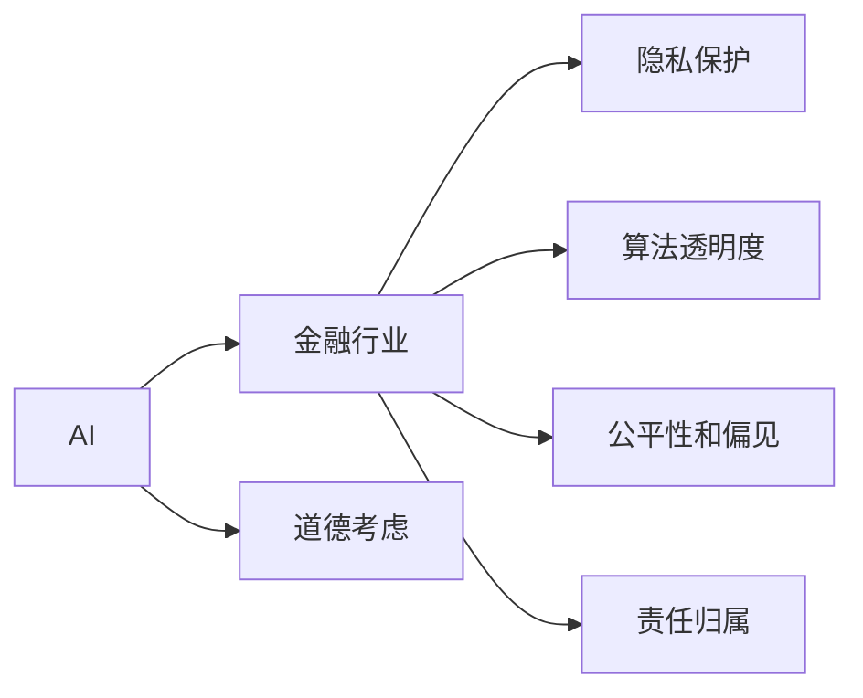
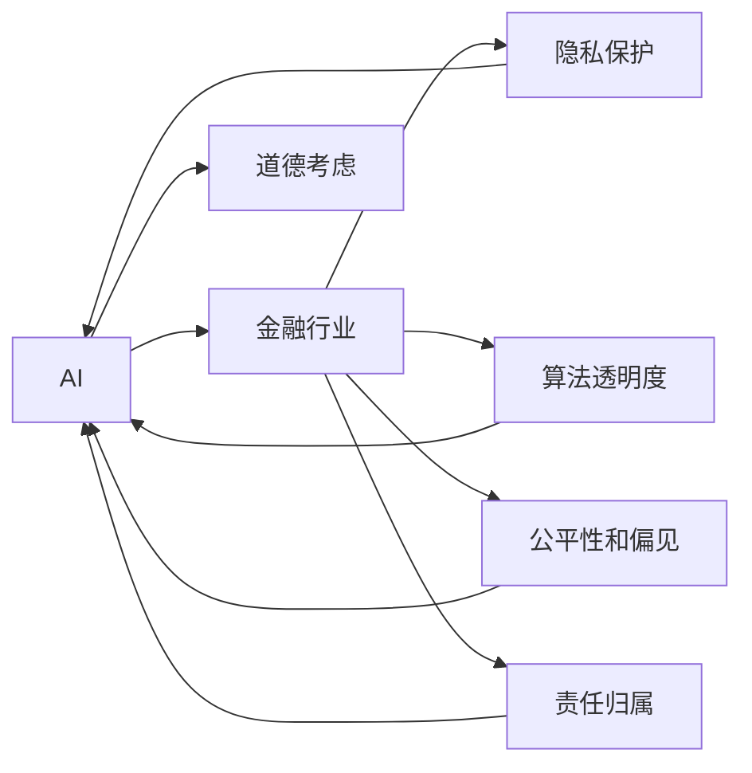

                 

# AI驱动的创新：人类计算在金融行业的道德考虑

## 1. 背景介绍

在当今数字化、智能化的社会中，金融行业正经历着前所未有的变革。AI驱动的计算，以其高效、精确、智能的特点，正在重新定义传统的金融服务模式，催生出新的业态和商业模式。然而，随着AI技术的深入应用，关于伦理、隐私、安全等道德问题的讨论也愈发激烈。本文将从AI在金融行业的具体应用出发，探讨在推动金融创新同时，应如何妥善考虑和处理相关的道德问题。

### 1.1 AI在金融行业的应用现状

金融行业一直是技术应用的前沿领域。从风险控制、合规管理、客户服务，到资产管理、智能投顾、反欺诈等环节，AI技术正在全面渗透，提升金融服务的效率和质量。以下列举了几个典型的应用案例：

**风险控制：** 利用机器学习算法，通过分析历史数据和实时交易数据，预测并识别潜在风险，提前预警和防范。如基于信用评分模型，对客户信用风险进行评估和监控。

**合规管理：** 通过自然语言处理(NLP)技术，对合同、报告等文本进行自动审核，确保遵守法律法规和行业规范。如使用文本生成模型，自动生成合规性评估报告。

**客户服务：** 使用聊天机器人等NLP技术，提供24小时不间断的客户咨询和问题解答，提升客户体验。如智能客服系统，可处理多语言、多渠道的客户服务请求。

**资产管理：** 应用AI进行量化交易和资产配置，优化投资策略，实现更精准的投资决策。如使用强化学习模型，自动调整资产组合，应对市场波动。

**智能投顾：** 基于机器学习和大数据技术，为客户提供个性化、智能化的投资建议和资产管理服务。如通过分析用户历史交易数据，推荐最佳投资方案。

**反欺诈：** 利用深度学习算法，实时监控和分析交易行为，识别并预防潜在的欺诈行为。如通过异常检测模型，及时发现和拦截非法交易。

### 1.2 道德问题的提出

尽管AI在金融行业带来了诸多创新和效率提升，但其带来的道德问题也日渐凸显。主要包括：

**隐私保护：** 金融数据涉及个人隐私，AI系统在处理这些数据时，如何保证数据安全，防止数据泄露，是亟待解决的问题。

**算法透明度：** 金融决策越来越依赖于AI模型，但许多模型的黑盒特性，使得其决策过程缺乏可解释性，容易产生误导。

**公平性和偏见：** AI模型在训练过程中，可能会因为数据偏见而产生不公平的决策结果，影响金融服务的公正性。

**责任归属：** AI系统在金融决策中扮演重要角色，但发生错误时，责任归属问题如何界定，也是一个复杂的话题。

## 2. 核心概念与联系

### 2.1 核心概念概述

本文的核心概念包括AI、金融行业、道德考虑等。这些概念通过一定的联系机制相互连接，共同构成了本文探讨的框架。

**AI（人工智能）：** 一种模拟人类智能行为的计算技术，涵盖感知、学习、推理、自然语言处理等多个领域。

**金融行业：** 包括银行、证券、保险、投资、支付等多个子行业，以货币和金融工具为核心的服务领域。

**道德考虑：** 在AI技术应用中，关于隐私、透明、公平、责任等伦理问题的思考和处理。

这些概念之间的关系如下图所示：



### 2.2 核心概念原理和架构的 Mermaid 流程图

为更好地理解这些核心概念之间的联系，我们构建了如下Mermaid流程图：



## 3. 核心算法原理 & 具体操作步骤

### 3.1 算法原理概述

AI在金融行业的应用，主要依赖于两大类算法：一是监督学习（如分类、回归）和无监督学习（如聚类、降维），用于数据建模和预测；二是强化学习，用于智能决策和策略优化。这些算法通过计算和优化，实现对金融数据的分析和决策，提升金融服务的效率和质量。

### 3.2 算法步骤详解

以下以风险控制为例，详细说明AI在金融行业的应用流程：

**Step 1: 数据准备**
- 收集金融历史交易数据、市场数据、客户数据等，进行清洗、整理和标注。
- 采用标准化的数据格式，进行归一化、特征提取等预处理。

**Step 2: 模型训练**
- 选择合适的机器学习算法或深度学习模型，如线性回归、随机森林、卷积神经网络等。
- 使用标注数据对模型进行训练，调整模型参数，提升预测准确性。
- 使用交叉验证、网格搜索等技术，进行模型选择和调优。

**Step 3: 模型评估**
- 在测试数据集上评估模型的性能指标，如准确率、召回率、F1-score等。
- 分析模型预测结果与真实结果的差异，进行模型诊断。
- 根据评估结果，进行模型迭代和优化。

**Step 4: 模型部署**
- 将训练好的模型集成到金融系统中，进行实时计算和预测。
- 部署模型于高性能计算集群或云平台，确保计算速度和稳定性。
- 设定实时监控和预警机制，及时发现和处理异常情况。

### 3.3 算法优缺点

AI在金融行业的应用，带来了诸多优点，但也存在一些显著的局限：

**优点：**
- **效率提升：** AI算法能够处理海量金融数据，提升决策和分析的速度。
- **精准预测：** 通过精确建模，实现更准确的预测和风险预警。
- **智能决策：** 利用机器学习和大数据技术，实现个性化、智能化的服务。

**缺点：**
- **数据依赖：** 模型训练依赖于大量高质量的数据，数据获取和标注成本高。
- **模型复杂：** 深度学习模型复杂，训练和推理耗时，对硬件资源要求高。
- **黑盒特性：** 许多模型的决策过程缺乏可解释性，难以理解和调试。
- **偏差和偏见：** 训练数据可能带有偏见，导致模型决策不公平。

### 3.4 算法应用领域

AI在金融行业的应用领域非常广泛，涵盖风险控制、合规管理、客户服务、资产管理、智能投顾等多个方面：

- **风险控制：** 利用AI进行信用评分、风险预警、反欺诈等，提升金融风险管理能力。
- **合规管理：** 使用NLP技术自动审核合同、报告等文本，确保合规性。
- **客户服务：** 部署智能客服系统，提供24小时不间断的客户咨询服务。
- **资产管理：** 应用量化交易和资产配置算法，优化投资策略。
- **智能投顾：** 基于机器学习和大数据技术，提供个性化投资建议和资产管理。

## 4. 数学模型和公式 & 详细讲解

### 4.1 数学模型构建

在金融风险控制中，常用的数学模型包括线性回归、逻辑回归、决策树、随机森林、神经网络等。以线性回归为例，模型的构建过程如下：

设金融交易数据为 $(x_1, x_2, \cdots, x_n)$，目标变量为 $y$，模型为线性回归：

$$ y = \theta_0 + \theta_1 x_1 + \theta_2 x_2 + \cdots + \theta_n x_n + \epsilon $$

其中 $\theta_i$ 为模型参数，$\epsilon$ 为误差项。

### 4.2 公式推导过程

线性回归模型的训练过程，即通过最小化均方误差（MSE）来求解模型参数：

$$ \min_{\theta} \frac{1}{N}\sum_{i=1}^N (y_i - \theta_0 - \theta_1 x_{1i} - \theta_2 x_{2i} - \cdots - \theta_n x_{ni})^2 $$

利用梯度下降法，求解 $\theta$：

$$ \theta = (\mathbf{X}^T \mathbf{X})^{-1} \mathbf{X}^T \mathbf{y} $$

其中 $\mathbf{X} = [x_{11}, x_{12}, \cdots, x_{1n}; x_{21}, x_{22}, \cdots, x_{2n}; \cdots; x_{n1}, x_{n2}, \cdots, x_{nn}]$，$\mathbf{y} = [y_1, y_2, \cdots, y_n]$。

### 4.3 案例分析与讲解

**案例分析：信用评分模型**

假设某银行利用线性回归模型对客户信用进行评分，数据集为 $(x_1, x_2, \cdots, x_n)$，目标变量为 $y$。数据集包含客户基本信息、历史交易记录、资产负债情况等特征。模型训练步骤如下：

1. **数据准备**：收集银行内部客户的金融交易数据，进行清洗、标注和归一化处理。
2. **模型训练**：选择线性回归模型，使用历史交易数据进行训练，调整模型参数。
3. **模型评估**：在测试数据集上评估模型性能，计算准确率、召回率等指标。
4. **模型部署**：将训练好的模型集成到银行系统中，实时计算客户信用评分。

## 5. 项目实践：代码实例和详细解释说明

### 5.1 开发环境搭建

以下是使用Python和PyTorch搭建AI金融项目环境的详细步骤：

1. **安装Python和PyTorch**：
   - 从官网下载安装Python 3.x，推荐安装Anaconda。
   - 在Anaconda中使用以下命令安装PyTorch：
     ```
     conda install torch torchvision torchaudio -c pytorch -c conda-forge
     ```
   - 确认PyTorch版本和设备（CUDA或CPU）。

2. **安装其他依赖包**：
   - 安装TensorBoard用于模型可视化：
     ```
     pip install tensorboard
     ```
   - 安装Scikit-learn用于数据处理：
     ```
     pip install scikit-learn
     ```

### 5.2 源代码详细实现

以下是一个基于线性回归模型的信用评分预测示例代码：

```python
import torch
from sklearn.datasets import fetch_openml
from sklearn.model_selection import train_test_split
from sklearn.preprocessing import StandardScaler
from sklearn.linear_model import LinearRegression
from sklearn.metrics import mean_squared_error
import matplotlib.pyplot as plt
import tensorboardX as tb

# 加载数据集
X, y = fetch_openml('credit-g', version=1, as_frame=True).data, fetch_openml('credit-g', version=1, as_frame=True).target

# 数据预处理
scaler = StandardScaler()
X = scaler.fit_transform(X)
X_train, X_test, y_train, y_test = train_test_split(X, y, test_size=0.2, random_state=42)

# 模型训练
model = LinearRegression()
model.fit(X_train, y_train)

# 模型评估
y_pred = model.predict(X_test)
mse = mean_squared_error(y_test, y_pred)

# 可视化
writer = tb.SummaryWriter('./logs/credit-g')
writer.add_scalar('MSE', mse, 0)
writer.add_histogram('predictions', y_pred, 0)
writer.add_histogram('targets', y_test, 0)
writer.close()
```

### 5.3 代码解读与分析

上述代码主要实现了线性回归模型的训练、评估和可视化：

1. **数据加载和预处理**：使用Scikit-learn加载信用评分数据集，进行标准化处理。
2. **模型训练**：使用LinearRegression模型进行训练，调整模型参数。
3. **模型评估**：计算均方误差（MSE），评估模型性能。
4. **可视化**：使用TensorBoard进行模型可视化，展示MSE和模型预测结果。

## 6. 实际应用场景

### 6.1 风险控制

AI在金融风险控制中的应用，可以有效提升风险识别和预警能力。以下是一个风险控制的实际应用场景：

**场景描述**：某银行利用深度学习算法，对客户交易行为进行实时监控和分析，识别异常交易并及时预警。具体步骤如下：

1. **数据收集**：收集客户历史交易数据、实时交易数据，进行清洗和标注。
2. **模型训练**：使用深度学习算法，如RNN、CNN等，对交易数据进行建模，提取特征。
3. **模型评估**：在测试数据集上评估模型性能，计算准确率、召回率等指标。
4. **模型部署**：将训练好的模型集成到实时监控系统中，实时分析客户交易行为，生成预警信号。

### 6.2 合规管理

AI在合规管理中的应用，能够自动化地审核金融文本文档，确保合规性。以下是一个合规管理的实际应用场景：

**场景描述**：某证券公司利用NLP技术，自动审核合同、报告等文本，确保其符合法律法规和行业规范。具体步骤如下：

1. **数据收集**：收集合同、报告等文本数据，进行清洗和标注。
2. **模型训练**：使用NLP模型，如BERT、GPT等，进行文本审核。
3. **模型评估**：在测试数据集上评估模型性能，计算准确率、召回率等指标。
4. **模型部署**：将训练好的模型集成到合规管理系统，自动审核文本文档。

### 6.3 客户服务

AI在客户服务中的应用，可以提升客户体验和响应速度。以下是一个智能客服的实际应用场景：

**场景描述**：某银行利用聊天机器人，提供24小时不间断的客户咨询服务，解答客户问题。具体步骤如下：

1. **数据收集**：收集客户历史咨询数据，进行清洗和标注。
2. **模型训练**：使用NLP模型，如Transformer等，进行对话生成和问答匹配。
3. **模型评估**：在测试数据集上评估模型性能，计算对话生成质量等指标。
4. **模型部署**：将训练好的模型集成到智能客服系统，自动响应客户咨询。

### 6.4 未来应用展望

未来，AI在金融行业的应用将更加广泛和深入，有望带来以下突破：

1. **智能投顾**：利用AI进行个性化投资建议和资产管理，优化投资策略，提升客户满意度。
2. **反欺诈**：通过深度学习算法，实时监控和分析交易行为，预防欺诈行为。
3. **合规审核**：使用NLP技术，自动审核金融文本文档，确保合规性。
4. **金融数据分析**：应用AI进行金融市场分析和预测，提供更精准的决策支持。

## 7. 工具和资源推荐

### 7.1 学习资源推荐

为帮助读者系统掌握AI在金融行业的应用和道德考虑，以下是一些推荐的学习资源：

1. **《机器学习实战》**：深入浅出地介绍了机器学习算法和实践，涵盖金融数据分析、信用评分、反欺诈等多个领域。
2. **《Python金融数据分析》**：详细介绍Python在金融数据分析中的应用，涵盖数据处理、模型训练、结果可视化等。
3. **《金融大数据分析》**：介绍大数据技术在金融领域的应用，涵盖数据采集、处理、建模等多个环节。
4. **Coursera《深度学习专项课程》**：由斯坦福大学开设，涵盖深度学习的基础理论和实践应用，适合初学者和进阶者。
5. **Kaggle金融数据集**：提供丰富的金融数据集，涵盖信用评分、股票交易、金融市场预测等多个领域，适合实践练习。

### 7.2 开发工具推荐

为帮助开发者高效开发AI金融应用，以下是一些推荐的工具：

1. **Jupyter Notebook**：交互式开发环境，支持代码编写、数据可视化、结果展示。
2. **TensorFlow**：强大的深度学习框架，支持分布式计算、GPU加速等。
3. **PyTorch**：灵活高效的深度学习框架，支持动态计算图。
4. **TensorBoard**：可视化工具，支持模型训练和结果展示。
5. **Scikit-learn**：数据处理和机器学习工具，支持多种算法和模型。
6. **Keras**：高层次的深度学习框架，易于上手和调试。

### 7.3 相关论文推荐

为深入了解AI在金融行业的最新进展和应用，以下是一些推荐的研究论文：

1. **《利用深度学习进行金融数据分析》**：介绍深度学习在金融数据分析中的应用，涵盖信用评分、风险控制、股票交易等多个领域。
2. **《NLP技术在金融文本分析中的应用》**：介绍NLP技术在金融文本审核、合规管理等方面的应用。
3. **《基于强化学习的金融市场预测》**：介绍强化学习在金融市场预测中的应用，涵盖量化交易、投资策略优化等多个方向。
4. **《金融智能投顾系统》**：介绍智能投顾系统在金融领域的应用，涵盖个性化投资建议、资产管理等多个方面。
5. **《金融反欺诈系统》**：介绍深度学习在金融反欺诈中的应用，涵盖异常检测、行为分析等多个方向。

## 8. 总结：未来发展趋势与挑战

### 8.1 研究成果总结

本文探讨了AI在金融行业的应用和道德考虑，提出了AI技术在金融风险控制、合规管理、客户服务等方面的具体应用。通过案例分析和代码实现，展示了AI在金融数据分析和决策支持中的重要作用。

### 8.2 未来发展趋势

未来，AI在金融行业的应用将更加广泛和深入，有望带来以下趋势：

1. **智能化和个性化**：利用AI进行更精准、个性化的金融服务，提升客户满意度和用户体验。
2. **实时化和自动化**：实现实时监控和自动化处理，提高金融服务的效率和稳定性。
3. **数据驱动和模型优化**：利用大数据和先进算法，提升金融决策的准确性和科学性。
4. **跨行业融合和创新**：AI与区块链、物联网等技术的融合，带来金融新业态和新模式。

### 8.3 面临的挑战

尽管AI在金融行业的应用前景广阔，但也面临以下挑战：

1. **数据质量和安全**：金融数据涉及隐私和敏感信息，如何保证数据安全和隐私保护是关键问题。
2. **模型复杂和透明**：AI模型往往复杂且黑盒，如何增强模型透明性和可解释性是重要研究方向。
3. **伦理和公平**：AI模型可能带有偏见，如何实现公平和公正的决策是重要挑战。
4. **法规和合规**：AI在金融行业的应用，需要符合相关法律法规和行业规范，如何合规应用是关键问题。
5. **技术标准和规范**：金融行业需要制定统一的技术标准和规范，确保AI应用的安全性和一致性。

### 8.4 研究展望

为应对未来AI在金融行业的挑战，建议从以下方向进行深入研究：

1. **数据隐私和安全**：研究数据隐私保护技术，确保数据安全和合规使用。
2. **模型透明和可解释**：开发透明、可解释的AI模型，增强模型可理解性和可调试性。
3. **公平和公正**：研究公平性算法，消除模型偏见，实现公正的决策。
4. **法规和合规**：制定AI在金融行业的应用规范，确保合规性和公正性。
5. **技术标准和规范**：制定AI在金融行业的应用标准，确保技术一致性和安全性。

通过不断探索和创新，相信AI在金融行业的道德问题将得到有效解决，AI技术将更好地服务于金融业和社会。

## 9. 附录：常见问题与解答

### Q1: AI在金融行业的优势有哪些？

**A**：AI在金融行业的应用，带来了诸多优势，包括：
- **效率提升**：AI算法能够处理海量金融数据，提升决策和分析的速度。
- **精准预测**：通过精确建模，实现更准确的预测和风险预警。
- **智能决策**：利用机器学习和大数据技术，实现个性化、智能化的服务。

### Q2: 如何保证AI模型的公平性和公正性？

**A**：为了保证AI模型的公平性和公正性，可以从以下几个方面入手：
- **数据清洗**：确保训练数据的多样性和代表性，避免数据偏见。
- **算法设计**：选择公平性算法，如等权重、对抗训练等，消除模型偏见。
- **透明和可解释**：增强模型透明性和可解释性，方便理解和调试。
- **法规和合规**：遵守相关法律法规和行业规范，确保合规性和公正性。

### Q3: 如何处理AI模型中的伦理和道德问题？

**A**：在AI模型中处理伦理和道德问题，可以从以下几个方面入手：
- **隐私保护**：确保数据安全和隐私保护，防止数据泄露。
- **透明和可解释**：增强模型透明性和可解释性，避免决策黑盒。
- **公平和公正**：消除模型偏见，实现公正的决策。
- **责任归属**：明确模型和算法的责任归属，确保责任清晰。

### Q4: 如何提高AI模型的效率和稳定性？

**A**：为了提高AI模型的效率和稳定性，可以从以下几个方面入手：
- **模型优化**：选择高效的模型架构，优化参数和超参数。
- **硬件加速**：利用GPU、TPU等高性能设备，加速模型训练和推理。
- **模型压缩**：采用模型压缩和稀疏化存储，减少计算资源占用。
- **实时监控**：实时监控和反馈系统性能，及时发现和处理异常情况。

### Q5: 如何在AI应用中保护客户隐私？

**A**：为了在AI应用中保护客户隐私，可以从以下几个方面入手：
- **数据匿名化**：对客户数据进行匿名化处理，确保数据隐私保护。
- **访问控制**：设置访问权限，控制数据的访问和使用。
- **数据加密**：采用数据加密技术，防止数据泄露和窃取。
- **合规使用**：遵守相关法律法规和行业规范，确保合规使用。

通过以上措施，可以有效保护客户隐私，确保AI应用的道德性和安全性。

---

作者：禅与计算机程序设计艺术 / Zen and the Art of Computer Programming

