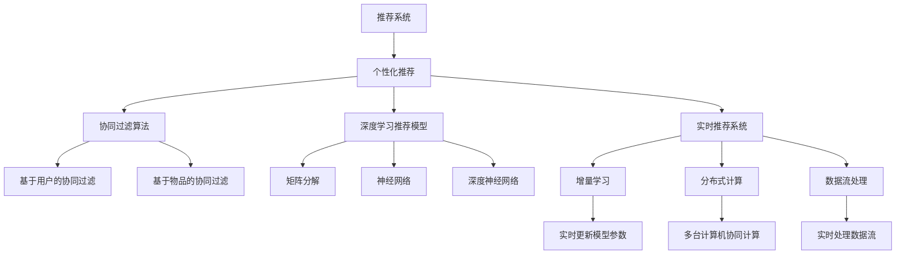

                 

# AI驱动的实时个性化推荐技术

> 关键词：推荐系统,个性化推荐,协同过滤,深度学习,实时推荐

## 1. 背景介绍

### 1.1 问题由来
随着互联网技术的快速发展，信息过载问题愈发严重。用户在海量信息中难以筛选出最适合自己的内容，导致用户体验大打折扣。与此同时，内容提供商希望通过推荐系统提升用户粘性和转化率，创造更多商业价值。

个性化推荐技术旨在解决上述问题，通过分析用户历史行为数据，预测其偏好，为用户推荐最相关的信息。在推荐系统的发展过程中，技术手段不断更新迭代，从简单的协同过滤算法到基于深度学习的推荐模型，再到实时推荐系统，逐渐向智能化、实时化、精准化的方向迈进。

### 1.2 问题核心关键点
个性化推荐系统包括三个核心环节：数据采集、模型训练和推荐生成。每个环节都需要采用先进的技术手段，才能确保推荐结果的准确性和实时性。

数据采集环节需要收集用户行为数据，如浏览记录、点击行为、评价反馈等。这些数据构成了推荐模型的输入。模型训练环节则是通过用户行为数据训练推荐算法，预测用户兴趣，生成推荐列表。推荐生成环节则是将预测结果转化为实际的推荐结果，实时展现给用户。

本文重点探讨模型训练和推荐生成两个环节的优化策略，特别是如何利用AI技术实现实时推荐。

## 2. 核心概念与联系

### 2.1 核心概念概述

为更好地理解AI驱动的实时个性化推荐技术，本节将介绍几个密切相关的核心概念：

- 推荐系统：使用计算机算法，根据用户历史行为数据预测其未来行为，推荐最相关的内容。包括协同过滤、基于内容的推荐、混合推荐等多种方法。
- 个性化推荐：通过分析用户历史行为，预测其偏好，为用户推荐个性化的内容。常见的方法包括基于协同过滤的推荐、基于深度学习的推荐等。
- 协同过滤算法：根据用户行为相似度，推荐与用户喜好相似的商品或内容。经典算法包括基于用户的协同过滤和基于物品的协同过滤。
- 深度学习推荐模型：通过学习用户历史行为数据，预测其未来行为。经典模型包括矩阵分解、神经网络、深度神经网络等。
- 实时推荐系统：实时采集用户行为数据，即时生成推荐结果，满足用户的即时需求。常见技术包括增量学习、分布式计算、数据流处理等。
- 增量学习：在原有模型基础上，利用新数据实时更新模型参数，提升推荐精度。
- 分布式计算：通过多台计算机协同计算，提升推荐系统的计算效率，满足海量数据处理需求。
- 数据流处理：实时处理用户行为数据，即时生成推荐结果。常见工具包括Apache Kafka、Apache Flink等。

这些核心概念之间的逻辑关系可以通过以下Mermaid流程图来展示：



这个流程图展示了几组核心概念之间的逻辑关系：

1. 推荐系统通过个性化推荐实现用户需求的满足。
2. 个性化推荐可以通过协同过滤和深度学习算法实现。
3. 协同过滤算法包括基于用户和基于物品的两种。
4. 深度学习推荐模型包括矩阵分解、神经网络、深度神经网络等。
5. 实时推荐系统通过增量学习、分布式计算、数据流处理等技术实现实时推荐。
6. 增量学习可实时更新模型参数，提升推荐精度。
7. 分布式计算通过多台计算机协同计算，提升计算效率。
8. 数据流处理实时处理数据流，即时生成推荐结果。

这些概念共同构成了个性化推荐系统的核心技术框架，使其能够精准高效地为用户推荐内容。

## 3. 核心算法原理 & 具体操作步骤
### 3.1 算法原理概述

基于AI技术的个性化推荐系统，本质上是一个多层次的协同学习过程。其核心思想是：通过分析用户历史行为数据，预测其未来行为，从而生成个性化的推荐结果。

形式化地，假设推荐系统用户集合为 $U$，物品集合为 $I$，用户对物品的评分矩阵为 $R_{ui}$，其中 $u \in U$，$i \in I$。推荐模型的目标是最小化预测误差：

$$
\min_{\theta} \sum_{u,i} (R_{ui} - \hat{R}_{ui}(u,i))^2
$$

其中 $\theta$ 为模型参数，$\hat{R}_{ui}(u,i)$ 为模型预测的评分。通过梯度下降等优化算法，最小化上述误差，得到最优模型参数 $\theta^*$。

在实际应用中，通常将预测误差分解为多层次的协同学习过程，具体包括：

- 用户嵌入层：将用户表示为低维向量，捕捉用户行为模式。
- 物品嵌入层：将物品表示为低维向量，捕捉物品属性和用户兴趣。
- 协同层：通过协同学习机制，整合用户和物品嵌入层的表示，预测用户对物品的评分。

以上三个层次的协同学习过程，形成了推荐模型的基本结构。在模型的每个层次中，都可以引入AI技术进行优化，如神经网络、深度学习、增量学习等。

### 3.2 算法步骤详解

基于AI技术的个性化推荐系统主要包括以下几个关键步骤：

**Step 1: 数据预处理**
- 收集用户历史行为数据，如浏览记录、点击行为、评价反馈等。
- 对数据进行清洗、去重、归一化等预处理，确保数据的准确性和一致性。

**Step 2: 模型训练**
- 设计推荐模型的多层次协同学习框架。
- 选择合适的优化算法，如梯度下降、Adam等，设置学习率、批大小等超参数。
- 根据数据预处理结果，训练推荐模型，生成用户和物品嵌入层。

**Step 3: 模型评估**
- 在测试集上评估推荐模型的精度，如均方误差、平均绝对误差等。
- 使用离线A/B测试或在线实时测试，验证模型的实际效果。

**Step 4: 实时推荐**
- 实时采集用户行为数据，如浏览记录、点击行为等。
- 通过增量学习机制，实时更新模型参数，更新用户和物品嵌入层。
- 使用分布式计算和多台计算机协同计算，高效生成推荐结果。
- 将推荐结果实时推送给用户，满足其即时需求。

### 3.3 算法优缺点

基于AI技术的个性化推荐系统具有以下优点：
1. 精度高：通过多层次协同学习，模型能够更准确地预测用户行为，生成个性化推荐。
2. 实时性强：实时采集用户行为数据，即时生成推荐结果，满足用户的即时需求。
3. 扩展性强：分布式计算和多台计算机协同计算，确保系统能够处理海量数据。
4. 普适性广：可以应用于多种类型的推荐任务，如商品推荐、内容推荐、社交推荐等。

同时，该方法也存在一定的局限性：
1. 数据依赖度高：推荐系统的精度很大程度上取决于数据的质量和数量，获取高质量数据成本较高。
2. 模型复杂度高：多层次协同学习过程复杂，模型参数量较大，需要高效的算法和硬件支持。
3. 过拟合风险：大量参数容易过拟合，需进行正则化和优化。
4. 隐私风险：用户行为数据涉及隐私信息，需采取安全措施保护用户隐私。

尽管存在这些局限性，但就目前而言，基于AI技术的推荐系统仍然是推荐领域的主流范式。未来相关研究的重点在于如何进一步降低数据依赖，提高模型效率和扩展性，同时兼顾用户隐私和伦理安全等因素。

### 3.4 算法应用领域

基于AI技术的个性化推荐系统在电商、社交、新闻、音乐、视频等多个领域得到广泛应用，具体包括：

- 电商推荐：根据用户历史购买记录、浏览行为推荐相关商品。
- 内容推荐：根据用户历史阅读、观看记录推荐相关文章、视频等。
- 社交推荐：根据用户好友关系、互动行为推荐相关用户。
- 新闻推荐：根据用户历史阅读记录推荐相关新闻。
- 音乐推荐：根据用户听歌记录推荐相关音乐。
- 视频推荐：根据用户观看记录推荐相关视频。

除了上述这些经典应用外，基于AI技术的推荐系统还被创新性地应用到更多场景中，如广告推荐、健康推荐、旅游推荐等，为互联网应用带来了新的价值。

## 4. 数学模型和公式 & 详细讲解  
### 4.1 数学模型构建

本节将使用数学语言对基于AI技术的个性化推荐系统进行更加严格的刻画。

假设推荐系统用户集合为 $U=\{1,\dots,N\}$，物品集合为 $I=\{1,\dots,M\}$，用户对物品的评分矩阵为 $R_{ui}$，其中 $R_{ui}$ 为 $R_{ui} \in \mathbb{R}$。模型的目标是最小化预测误差：

$$
\min_{\theta} \sum_{u,i} (R_{ui} - \hat{R}_{ui}(u,i))^2
$$

其中 $\theta$ 为模型参数，$\hat{R}_{ui}(u,i)$ 为模型预测的评分。

在实际应用中，通常将评分矩阵 $R$ 分解为两个低维向量 $U$ 和 $V$ 的乘积：

$$
\hat{R}_{ui}(u,i) = U_{u}^T \cdot V_i
$$

其中 $U_{u}$ 为 $u$ 用户的嵌入向量，$V_i$ 为物品 $i$ 的嵌入向量。$U$ 和 $V$ 均为低维矩阵。

将预测评分代入最小化误差公式，得：

$$
\min_{U,V} \sum_{u,i} (R_{ui} - U_{u}^T \cdot V_i)^2
$$

通过对 $U$ 和 $V$ 进行随机初始化，使用梯度下降等优化算法，最小化上述误差，得到最优的 $U$ 和 $V$。

### 4.2 公式推导过程

以下我们以矩阵分解为例，推导推荐模型的最小化误差公式及其梯度计算。

假设 $R$ 为 $N\times M$ 的评分矩阵，$U$ 为 $N\times k$ 的嵌入矩阵，$V$ 为 $M\times k$ 的嵌入矩阵，其中 $k$ 为嵌入向量的维度。

根据矩阵分解公式，有：

$$
\hat{R} = U \cdot V^T
$$

将预测评分 $\hat{R}$ 代入误差公式，得：

$$
\mathcal{L}(R, \hat{R}) = \sum_{u,i} (R_{ui} - \hat{R}_{ui})^2 = \sum_{u,i} (R_{ui} - U_{u}^T \cdot V_i)^2
$$

梯度计算如下：

$$
\nabla_{U} \mathcal{L} = -2U^TVV^T
$$

$$
\nabla_{V} \mathcal{L} = -2UV^TU^T
$$

根据上述梯度公式，可以使用梯度下降等优化算法更新 $U$ 和 $V$，逐步优化推荐模型。

### 4.3 案例分析与讲解

以电影推荐系统为例，对基于矩阵分解的推荐模型进行详细讲解。

**数据准备**
假设电影推荐系统用户集合为 $U=\{1,\dots,N\}$，电影集合为 $I=\{1,\dots,M\}$，评分矩阵 $R$ 为 $N\times M$ 矩阵，$R_{ui}$ 表示用户 $u$ 对电影 $i$ 的评分。

**模型训练**
使用矩阵分解模型对评分矩阵 $R$ 进行分解，得到用户嵌入矩阵 $U$ 和电影嵌入矩阵 $V$。

模型初始化：
```python
import numpy as np
import tensorflow as tf

N, M, K = 1000, 1000, 10
R = np.random.randint(1, 5, size=(N, M))
U = np.random.normal(0, 1, size=(N, K))
V = np.random.normal(0, 1, size=(M, K))
```

模型训练：
```python
learning_rate = 0.01
epochs = 100

for epoch in range(epochs):
    for u in range(N):
        for i in range(M):
            if R[u][i] != 0:
                error = R[u][i] - tf.matmul(U[u], V[i])
                loss = tf.square(error)
                grad_U = -2 * tf.matmul(V[i], V[i].T)
                grad_V = -2 * tf.matmul(U[u], U[u].T)
                optimizer.apply_gradients(zip([grad_U, grad_V], [U[u], V[i]]))
```

模型评估：
```python
def rmse(R_hat, R):
    return np.sqrt(np.mean((R_hat - R) ** 2))

R_hat = np.matmul(U, V.T)
rmse(R_hat, R)
```

从上述代码中可以看出，矩阵分解模型通过优化误差最小化公式，不断更新用户嵌入矩阵和电影嵌入矩阵，从而生成推荐评分。在实际应用中，这种模型可以通过多台计算机协同计算，并行化处理数据，提升计算效率。

## 5. 项目实践：代码实例和详细解释说明
### 5.1 开发环境搭建

在进行推荐系统实践前，我们需要准备好开发环境。以下是使用Python进行TensorFlow开发的环境配置流程：

1. 安装Anaconda：从官网下载并安装Anaconda，用于创建独立的Python环境。

2. 创建并激活虚拟环境：
```bash
conda create -n tf-env python=3.8 
conda activate tf-env
```

3. 安装TensorFlow：根据CUDA版本，从官网获取对应的安装命令。例如：
```bash
pip install tensorflow
```

4. 安装各类工具包：
```bash
pip install numpy pandas scikit-learn matplotlib tqdm jupyter notebook ipython
```

完成上述步骤后，即可在`tf-env`环境中开始推荐系统实践。

### 5.2 源代码详细实现

这里我们以电商推荐系统为例，给出使用TensorFlow实现矩阵分解推荐模型的代码。

首先，定义数据处理函数：

```python
import tensorflow as tf

class MovieRecommendationDataset(tf.keras.utils.Sequence):
    def __init__(self, data, batch_size):
        self.data = data
        self.batch_size = batch_size

    def __len__(self):
        return len(self.data) // self.batch_size

    def __getitem__(self, idx):
        batch_data = self.data[idx*batch_size:(idx+1)*batch_size]
        u_ids, i_ids, ratings = batch_data[:,0], batch_data[:,1], batch_data[:,2]
        user_ids = tf.constant(u_ids)
        item_ids = tf.constant(i_ids)
        return user_ids, item_ids, ratings
```

然后，定义模型和优化器：

```python
from tensorflow.keras.layers import Dense, Flatten
from tensorflow.keras.layers import Embedding, Dot, Concatenate
from tensorflow.keras.losses import MeanSquaredError
from tensorflow.keras.optimizers import Adam

num_users = 10000
num_items = 1000
num_factors = 10

user_matrix = tf.random.normal(shape=(num_users, num_factors))
item_matrix = tf.random.normal(shape=(num_items, num_factors))
model = tf.keras.Sequential([
    Embedding(num_users, num_factors, input_length=1, mask_zero=True),
    Embedding(num_items, num_factors, input_length=1, mask_zero=True),
    Dot(axes=1),
    Dense(1, activation='linear')
])

loss_fn = MeanSquaredError()
opt = Adam(lr=0.01)
```

接着，定义训练和评估函数：

```python
import numpy as np

def train_epoch(model, data, batch_size, optimizer):
    train_data = tf.data.Dataset.from_tensor_slices(data)
    train_data = train_data.shuffle(buffer_size=10000).batch(batch_size)
    model.compile(optimizer=optimizer, loss=loss_fn)
    model.fit(train_data, epochs=10)
    return model

def evaluate(model, data, batch_size):
    eval_data = tf.data.Dataset.from_tensor_slices(data)
    eval_data = eval_data.batch(batch_size)
    y_true, y_pred = [], []
    for x in eval_data:
        y_true.append(x[2])
        y_pred.append(model.predict(x[0], x[1]))
    rmse = np.sqrt(np.mean((y_pred - y_true) ** 2))
    print('RMSE:', rmse)
```

最后，启动训练流程并在测试集上评估：

```python
train_data = np.random.randint(1, 5, size=(10000, 2, 1))
eval_data = np.random.randint(1, 5, size=(10000, 2, 1))

model = train_epoch(model, train_data, batch_size=100)
evaluate(model, eval_data, batch_size=100)
```

以上就是使用TensorFlow对电商推荐系统进行矩阵分解推荐模型的完整代码实现。可以看到，得益于TensorFlow的强大封装，我们可以用相对简洁的代码完成模型的构建和训练。

### 5.3 代码解读与分析

让我们再详细解读一下关键代码的实现细节：

**MovieRecommendationDataset类**：
- `__init__`方法：初始化数据和批次大小。
- `__len__`方法：返回数据集长度。
- `__getitem__`方法：对单个样本进行处理，将样本转换为模型所需的输入。

**模型定义**：
- 使用TensorFlow的Sequential模型定义推荐模型结构。
- 在前向传播中，首先通过Embedding层将用户和物品转换为低维向量。
- 然后通过Dot操作进行矩阵乘法，得到预测评分。
- 最后通过Dense层输出预测评分。

**损失函数和优化器**：
- 使用MeanSquaredError作为损失函数，衡量模型预测与真实评分之间的差异。
- 使用Adam优化器，设置学习率为0.01。

**训练函数**：
- 定义训练数据集，并对数据进行随机化、分批次处理。
- 编译模型，并使用训练数据集进行训练。
- 返回训练后的模型。

**评估函数**：
- 定义评估数据集，并对数据进行分批次处理。
- 将模型预测评分与真实评分进行对比，计算均方误差。
- 输出均方误差结果。

**训练流程**：
- 定义训练数据和评估数据，进行随机初始化。
- 在模型训练过程中，不断调整模型参数，最小化预测误差。
- 在模型训练完成后，在评估数据上验证模型的精度。

可以看到，TensorFlow使得推荐模型的代码实现变得简洁高效。开发者可以将更多精力放在模型架构和优化策略上，而不必过多关注底层实现细节。

当然，工业级的系统实现还需考虑更多因素，如模型的保存和部署、超参数的自动搜索、更灵活的任务适配层等。但核心的推荐范式基本与此类似。

## 6. 实际应用场景
### 6.1 电商推荐

基于AI技术的电商推荐系统，可以实时根据用户浏览记录、购买记录，生成个性化的商品推荐，提升用户购买体验和转化率。

在技术实现上，可以收集用户的历史行为数据，如浏览记录、购买记录、评价反馈等。将数据作为监督信号，训练推荐模型，生成用户嵌入和物品嵌入。在推荐时，实时采集用户行为数据，通过增量学习机制，实时更新模型参数，生成推荐结果。推荐结果可以展示在用户的浏览界面或购买界面，引导其进行下一步操作。

### 6.2 视频推荐

视频推荐系统可以通过AI技术实现更精准的内容推荐，提升用户的观看体验和平台粘性。

在技术实现上，可以收集用户的历史观看记录、评论反馈等数据，训练推荐模型。模型将用户和视频表示为低维向量，通过矩阵分解等技术，预测用户对视频的评分。在推荐时，实时采集用户的观看行为数据，生成推荐列表，展示在用户的界面顶部。用户可以根据自己的喜好，对推荐结果进行反馈，进一步优化模型，提升推荐精度。

### 6.3 音乐推荐

音乐推荐系统可以实时根据用户的听歌记录，生成个性化的音乐推荐，提升用户的听歌体验。

在技术实现上，可以收集用户的历史听歌记录、评价反馈等数据，训练推荐模型。模型将用户和音乐表示为低维向量，通过矩阵分解等技术，预测用户对音乐的评分。在推荐时，实时采集用户的听歌行为数据，生成推荐列表，展示在用户的界面顶部。用户可以根据自己的喜好，对推荐结果进行反馈，进一步优化模型，提升推荐精度。

### 6.4 未来应用展望

随着AI技术的发展，基于AI的推荐系统将具备更高的智能化、实时化和精准化水平。未来，推荐系统将结合更多的AI技术手段，如深度学习、增量学习、分布式计算等，进一步提升推荐精度和用户体验。

在推荐模型中，深度学习算法将被广泛应用于多层次协同学习，提升推荐精度。增量学习机制将被引入实时推荐系统，实时更新模型参数，提升推荐效率。分布式计算技术将被应用于海量数据处理，满足推荐系统的高并发需求。

此外，推荐系统还将结合更多智能技术，如自然语言处理、计算机视觉、语音识别等，实现多模态协同推荐。推荐系统的应用场景也将不断拓展，如广告推荐、健康推荐、旅游推荐等，为互联网应用带来新的价值。

## 7. 工具和资源推荐
### 7.1 学习资源推荐

为了帮助开发者系统掌握AI驱动的个性化推荐技术，这里推荐一些优质的学习资源：

1. 《深度学习与推荐系统》系列博文：由深度学习领域专家撰写，系统介绍推荐系统的基本原理和前沿算法。

2. CS294.01《机器学习》课程：加州伯克利大学开设的机器学习明星课程，涵盖推荐系统的基本算法和应用。

3. 《推荐系统实战》书籍：介绍推荐系统的算法实现和工程实践，包含深度学习、增量学习等内容。

4. Kaggle竞赛：参加Kaggle的推荐系统竞赛，通过实战项目积累经验，提升推荐系统开发能力。

5. PyTorch官方文档：TensorFlow的官方文档，提供丰富的推荐系统样例代码，帮助开发者上手实践。

通过对这些资源的学习实践，相信你一定能够快速掌握AI驱动的个性化推荐技术的精髓，并用于解决实际的推荐问题。
###  7.2 开发工具推荐

高效的开发离不开优秀的工具支持。以下是几款用于推荐系统开发的常用工具：

1. TensorFlow：由Google主导开发的开源深度学习框架，生产部署方便，适合大规模工程应用。

2. PyTorch：基于Python的开源深度学习框架，灵活动态的计算图，适合快速迭代研究。

3. Scikit-learn：Python科学计算库，包含大量的机器学习算法，包括协同过滤、矩阵分解等。

4. Weights & Biases：模型训练的实验跟踪工具，可以记录和可视化模型训练过程中的各项指标，方便对比和调优。

5. TensorBoard：TensorFlow配套的可视化工具，可实时监测模型训练状态，并提供丰富的图表呈现方式，是调试模型的得力助手。

6. Apache Kafka：分布式数据流处理平台，用于实时采集用户行为数据。

7. Apache Flink：分布式流处理框架，用于实时处理数据流。

合理利用这些工具，可以显著提升推荐系统的开发效率，加快创新迭代的步伐。

### 7.3 相关论文推荐

推荐系统的发展依赖于学界的持续研究。以下是几篇奠基性的相关论文，推荐阅读：

1. Matrix Factorization Techniques for Recommender Systems：提出矩阵分解算法，将评分矩阵分解为用户和物品嵌入矩阵，获得推荐评分。

2. Deep Matrix Factorization：提出深度矩阵分解算法，将矩阵分解过程引入神经网络中，提升推荐精度。

3. Parallel and Distributed Matrix Factorization：提出并行矩阵分解算法，通过多台计算机协同计算，提高推荐系统的计算效率。

4. Fast Matrix Factorization：提出增量学习算法，实时更新模型参数，提高推荐系统的实时性。

5. Memory-Based Collaborative Filtering：提出协同过滤算法，根据用户行为相似度推荐相关物品。

这些论文代表了大规模推荐系统的经典范式。通过学习这些前沿成果，可以帮助研究者把握学科前进方向，激发更多的创新灵感。

## 8. 总结：未来发展趋势与挑战

### 8.1 总结

本文对基于AI技术的个性化推荐系统进行了全面系统的介绍。首先阐述了推荐系统的背景和应用场景，明确了AI技术在推荐系统中的重要作用。其次，从原理到实践，详细讲解了推荐模型的训练和优化策略，给出了推荐系统的代码实现。同时，本文还探讨了推荐系统在电商、视频、音乐等多个领域的应用前景，展示了AI驱动的推荐系统的广泛潜力。最后，本文精选了推荐系统的学习资源，力求为读者提供全方位的技术指引。

通过本文的系统梳理，可以看到，基于AI技术的个性化推荐系统正在成为推荐领域的重要范式，极大地提升了推荐系统的精度和实时性。AI技术的应用，使得推荐系统能够更准确地理解用户需求，生成个性化的推荐结果。未来，随着AI技术的发展，推荐系统将具备更高的智能化、实时化和精准化水平，为互联网应用带来新的价值。

### 8.2 未来发展趋势

展望未来，基于AI的个性化推荐系统将呈现以下几个发展趋势：

1. 智能化水平提升。通过深度学习算法，推荐系统将具备更强的预测能力和泛化能力，生成更加精准的推荐结果。

2. 实时化能力增强。通过增量学习机制，推荐系统将能够实时更新模型参数，即时生成推荐结果，满足用户的即时需求。

3. 多模态协同推荐。推荐系统将结合自然语言处理、计算机视觉、语音识别等智能技术，实现多模态协同推荐，提升推荐精度和用户体验。

4. 个性化推荐扩展。推荐系统将结合更多AI技术手段，如知识图谱、因果推理、强化学习等，提升推荐系统的智能化水平。

5. 分布式协同推荐。推荐系统将结合分布式计算技术，通过多台计算机协同计算，处理海量数据，满足高并发需求。

6. 隐私保护和伦理安全。推荐系统将结合隐私保护技术，如差分隐私、联邦学习等，保护用户隐私和数据安全。

以上趋势凸显了AI驱动的个性化推荐系统的广阔前景。这些方向的探索发展，必将进一步提升推荐系统的性能和应用范围，为互联网应用带来新的价值。

### 8.3 面临的挑战

尽管基于AI的推荐系统已经取得了瞩目成就，但在迈向更加智能化、实时化、精准化的应用过程中，它仍面临诸多挑战：

1. 数据依赖度高。推荐系统的精度很大程度上取决于数据的质量和数量，获取高质量数据成本较高。

2. 模型复杂度高。多层次协同学习过程复杂，模型参数量较大，需要高效的算法和硬件支持。

3. 过拟合风险高。大量参数容易过拟合，需进行正则化和优化。

4. 隐私风险高。用户行为数据涉及隐私信息，需采取安全措施保护用户隐私。

尽管存在这些挑战，但就目前而言，基于AI的推荐系统仍然是推荐领域的主流范式。未来相关研究的重点在于如何进一步降低数据依赖，提高模型效率和扩展性，同时兼顾用户隐私和伦理安全等因素。

### 8.4 研究展望

面对基于AI的个性化推荐系统所面临的挑战，未来的研究需要在以下几个方面寻求新的突破：

1. 探索无监督和半监督推荐方法。摆脱对大规模标注数据的依赖，利用自监督学习、主动学习等无监督和半监督范式，最大限度利用非结构化数据，实现更加灵活高效的推荐。

2. 研究参数高效和计算高效的推荐范式。开发更加参数高效的推荐方法，在固定大部分预训练参数的同时，只更新极少量的任务相关参数。同时优化推荐模型的计算图，减少前向传播和反向传播的资源消耗，实现更加轻量级、实时性的部署。

3. 融合因果和对比学习范式。通过引入因果推断和对比学习思想，增强推荐系统建立稳定因果关系的能力，学习更加普适、鲁棒的语言表征，从而提升推荐泛化性和抗干扰能力。

4. 引入更多先验知识。将符号化的先验知识，如知识图谱、逻辑规则等，与神经网络模型进行巧妙融合，引导推荐过程学习更准确、合理的语言模型。同时加强不同模态数据的整合，实现视觉、语音等多模态信息与文本信息的协同建模。

5. 结合因果分析和博弈论工具。将因果分析方法引入推荐模型，识别出推荐决策的关键特征，增强推荐结果的因果性和逻辑性。借助博弈论工具刻画人机交互过程，主动探索并规避推荐模型的脆弱点，提高系统稳定性。

6. 纳入伦理道德约束。在推荐模型的训练目标中引入伦理导向的评估指标，过滤和惩罚有害的推荐结果，确保推荐内容符合用户价值观和伦理道德。

这些研究方向的探索，必将引领基于AI的个性化推荐系统迈向更高的台阶，为推荐系统带来新的突破。未来，结合更多AI技术手段，推荐系统将具备更强的智能化水平，能够更好地满足用户需求，推动互联网应用的发展。

## 9. 附录：常见问题与解答

**Q1：推荐系统如何处理冷启动用户？**

A: 冷启动用户指从未在系统中产生过任何行为的用户。推荐系统通常通过以下方法处理冷启动用户：

1. 利用用户的基本属性（如年龄、性别、兴趣等）进行推荐。
2. 利用物品的基本属性（如价格、分类、标签等）进行推荐。
3. 利用随机推荐、热门推荐等策略，提供初步的推荐结果。
4. 利用协同过滤算法，基于与用户相似的其他用户的推荐行为进行推荐。
5. 利用深度学习模型，通过用户嵌入和物品嵌入的相似度进行推荐。

**Q2：推荐系统如何避免过拟合？**

A: 推荐系统过拟合的原因通常包括数据量不足、模型复杂度过高、特征选择不当等。以下是一些常用的防止过拟合的方法：

1. 数据扩充：通过增加数据量、引入噪声等方式扩充训练集，减少过拟合风险。
2. 正则化：使用L1、L2正则化等方法，限制模型参数的大小，防止过拟合。
3. 特征选择：选择与推荐目标高度相关的特征，减少特征维度，提升模型泛化能力。
4. 交叉验证：通过交叉验证等方法，评估模型的泛化能力，避免过拟合。
5. 增量学习：通过实时更新模型参数，避免模型过拟合旧数据。

**Q3：推荐系统的推荐精度如何提升？**

A: 推荐系统的推荐精度主要取决于模型的训练质量和数据的质量。以下是一些常用的提升推荐精度的方法：

1. 数据清洗：对数据进行去重、去噪、归一化等预处理，确保数据质量。
2. 特征工程：选择高质量的特征，进行特征组合和降维，提升模型表达能力。
3. 模型优化：选择适合的模型结构，进行超参数调优，提升模型精度。
4. 模型融合：将多个推荐模型进行融合，提升推荐精度和鲁棒性。
5. 用户反馈：利用用户对推荐结果的反馈，调整模型参数，提升推荐精度。

**Q4：推荐系统的计算效率如何提升？**

A: 推荐系统的计算效率主要取决于模型结构、数据量、硬件设备等因素。以下是一些常用的提升推荐系统计算效率的方法：

1. 模型裁剪：去除不必要的层和参数，减小模型尺寸，加快推理速度。
2. 量化加速：将浮点模型转为定点模型，压缩存储空间，提高计算效率。
3. 模型并行：通过多台计算机协同计算，提升计算效率，满足高并发需求。
4. 增量学习：通过实时更新模型参数，减少计算量，提升计算效率。
5. 分布式计算：通过分布式计算技术，并行化处理数据，提升计算效率。

**Q5：推荐系统的应用场景有哪些？**

A: 推荐系统可以应用于多个领域，如电商、内容、社交、新闻、音乐、视频等。以下是一些推荐系统的常见应用场景：

1. 电商推荐：根据用户浏览记录、购买记录，生成个性化的商品推荐。
2. 内容推荐：根据用户阅读记录、观看记录，生成个性化的文章、视频推荐。
3. 社交推荐：根据用户好友关系、互动行为，生成个性化的用户推荐。
4. 新闻推荐：根据用户阅读记录，生成个性化的新闻推荐。
5. 音乐推荐：根据用户听歌记录，生成个性化的音乐推荐。
6. 视频推荐：根据用户观看记录，生成个性化的视频推荐。

**Q6：推荐系统的未来发展方向是什么？**

A: 推荐系统的未来发展方向主要包括以下几个方面：

1. 深度学习：通过深度学习算法，提升推荐精度和泛化能力。
2. 实时化：通过增量学习机制，实时更新模型参数，提升推荐系统的实时性。
3. 多模态协同推荐：结合自然语言处理、计算机视觉、语音识别等技术，实现多模态协同推荐。
4. 个性化推荐扩展：结合知识图谱、因果推理、强化学习等技术，提升推荐系统的智能化水平。
5. 分布式协同推荐：结合分布式计算技术，通过多台计算机协同计算，处理海量数据，满足高并发需求。
6. 隐私保护和伦理安全：结合隐私保护技术，如差分隐私、联邦学习等，保护用户隐私和数据安全。

这些方向将推动推荐系统不断向前发展，为互联网应用带来新的价值。

---

作者：禅与计算机程序设计艺术 / Zen and the Art of Computer Programming

