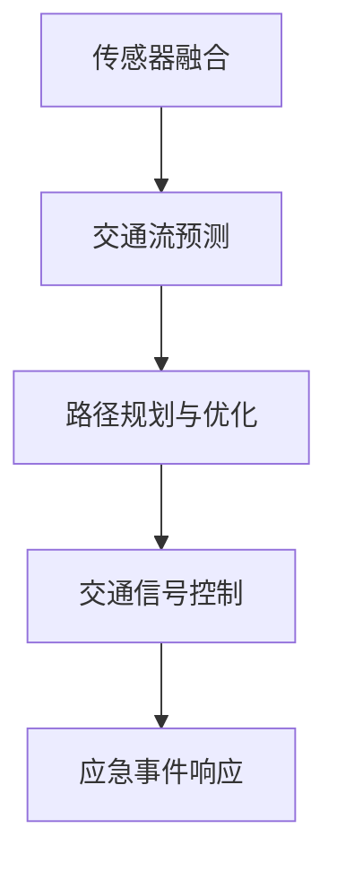

                 

# AI驱动的智能交通系统：从规划到控制

## 1. 背景介绍

### 1.1 问题由来
随着城市化进程的加速和汽车保有量的急剧增加，全球各大城市正面临着交通拥堵、污染加剧、能耗高企等诸多挑战。智能交通系统(ITS)作为缓解城市交通压力、提升城市运行效率的重要手段，近年来得到了广泛关注。通过利用先进的传感器、通信技术和人工智能算法，智能交通系统能够实现对交通流的实时监控、分析和调控，显著提升交通运行的智能化和协同化水平。

然而，智能交通系统涉及的数据量大、环境复杂、参与方多，其规划和控制的算法需要兼顾实时性、可扩展性、鲁棒性、可靠性等多个方面。如何在庞大的数据中提取出有价值的信息，实现高效的交通流预测和优化，是当前研究的重点和难点。

### 1.2 问题核心关键点
智能交通系统由感知、通信、决策和执行四大关键环节组成，其核心任务是通过收集和处理实时交通信息，实现对交通流的动态预测和优化调控。智能交通系统的规划和控制算法主要分为以下几个关键点：

1. 传感器融合：将来自不同源的交通数据进行融合，形成统一的实时交通数据视图，为后续的分析和预测提供基础。
2. 交通流预测：利用历史交通数据、天气信息、事件信息等，对未来的交通流进行预测，支持智能决策和控制。
3. 路径规划与优化：基于交通流预测结果，对车辆路径进行规划和优化，减少拥堵，提升通行效率。
4. 交通信号控制：根据交通流预测结果和路径规划策略，实时调整交通信号灯的配时，实现交通流的动态平衡。
5. 应急事件响应：在出现交通事故、道路施工等突发事件时，及时调整交通流和信号配时，保障路网畅通。

本文将详细探讨智能交通系统的各个环节，通过人工智能算法和大数据技术，构建高效、可靠的智能交通系统。

## 2. 核心概念与联系

### 2.1 核心概念概述

智能交通系统的核心概念包括：

1. 传感器融合：从不同源获取的交通数据，通过融合技术生成完整的交通数据视图，为后续分析和预测提供依据。
2. 交通流预测：基于历史交通数据和实时信息，预测未来的交通流状态，支持交通流调控和决策。
3. 路径规划与优化：根据交通流预测结果，对车辆路径进行规划和优化，减少拥堵，提升通行效率。
4. 交通信号控制：根据交通流预测结果和路径规划策略，实时调整交通信号灯的配时，实现交通流的动态平衡。
5. 应急事件响应：在突发事件发生时，及时调整交通流和信号配时，保障路网畅通。

这些核心概念之间的关系可以通过以下Mermaid流程图来展示：



这个流程图展示了智能交通系统的各个关键环节及其之间的关系：

1. 传感器融合：将多源交通数据融合，形成统一的实时数据视图。
2. 交通流预测：基于融合后的交通数据，进行交通流的预测。
3. 路径规划与优化：利用交通流预测结果，进行车辆路径的规划和优化。
4. 交通信号控制：根据路径规划结果，实时调整交通信号配时。
5. 应急事件响应：在突发事件发生时，调整交通流和信号配时。

通过这些核心概念的协同工作，智能交通系统能够实现对交通流的全面监控和优化调控。

## 3. 核心算法原理 & 具体操作步骤
### 3.1 算法原理概述

智能交通系统的规划和控制算法主要基于以下原理：

1. 多源数据融合：采用多源数据融合技术，将不同传感器的数据进行融合，生成统一的实时交通数据视图。
2. 交通流预测：采用时间序列预测方法，结合机器学习、深度学习等算法，预测未来的交通流状态。
3. 路径规划与优化：采用图论、动态规划等算法，规划和优化车辆路径，减少拥堵，提升通行效率。
4. 交通信号控制：采用控制理论、优化算法等，实时调整交通信号配时，实现交通流的动态平衡。
5. 应急事件响应：采用事件检测、实时优化等技术，及时调整交通流和信号配时，保障路网畅通。

这些算法原理构成了一个完整的智能交通系统，能够实现对交通流的全面监控和优化调控。

### 3.2 算法步骤详解

智能交通系统的规划和控制算法主要包括以下几个关键步骤：

**Step 1: 传感器数据融合**
- 从不同源获取交通数据，如车载传感器、路侧摄像头、交通信号等。
- 对数据进行预处理和校验，去除噪声和异常值。
- 采用多源数据融合技术，如卡尔曼滤波、粒子滤波等，将不同传感器的数据融合，生成统一的实时交通数据视图。

**Step 2: 交通流预测**
- 利用历史交通数据、天气信息、事件信息等，采用时间序列预测方法，如ARIMA、LSTM等，对未来的交通流状态进行预测。
- 结合机器学习、深度学习等算法，进一步提高预测精度和鲁棒性。

**Step 3: 路径规划与优化**
- 将交通流预测结果与路径图进行匹配，计算最优路径。
- 采用图论、动态规划等算法，规划和优化车辆路径，减少拥堵，提升通行效率。
- 考虑不同车辆类型、速度、载荷等因素，动态调整路径规划策略。

**Step 4: 交通信号控制**
- 根据路径规划结果和交通流预测结果，采用控制理论、优化算法等，实时调整交通信号灯的配时，实现交通流的动态平衡。
- 考虑交叉口的类型、交通流向、信号周期等因素，动态调整信号配时策略。
- 引入反馈机制，实时监控交通流状态，及时调整信号配时。

**Step 5: 应急事件响应**
- 实时监测交通数据，检测突发事件，如交通事故、道路施工等。
- 根据突发事件的类型和影响范围，调整路径规划和信号控制策略。
- 引入实时优化算法，及时调整交通流和信号配时，保障路网畅通。

### 3.3 算法优缺点

智能交通系统的规划和控制算法具有以下优点：

1. 实时性高：能够实时处理和分析交通数据，快速响应交通流变化。
2. 可扩展性强：基于模块化设计，便于扩展和集成新算法和设备。
3. 鲁棒性强：结合多源数据融合和预测算法，具备较高的数据鲁棒性。
4. 可靠性高：采用控制理论和优化算法，具备较高的系统可靠性。
5. 动态性强：能够根据实时数据和环境变化，动态调整路径规划和信号配时策略。

同时，这些算法也存在以下局限性：

1. 数据获取成本高：获取和处理大量交通数据，需要高昂的设备投入和运维成本。
2. 环境复杂多变：交通系统受天气、时间、节假日等因素影响，数据和环境变化复杂。
3. 参与方多样：涉及政府、企业、公众等多方参与，协调复杂。
4. 数据隐私问题：交通数据的收集和处理可能涉及隐私和安全问题，需要严格的数据保护措施。
5. 技术复杂度高：涉及多源数据融合、交通流预测、路径规划等多个复杂环节，技术难度大。

尽管存在这些局限性，但智能交通系统的规划和控制算法在实际应用中已经取得了显著效果，显著提升了城市的交通运行效率和安全性。

### 3.4 算法应用领域

智能交通系统的规划和控制算法在多个领域得到了广泛应用，包括但不限于：

1. 交通流量监测：实时监测交通流量，为交通管理和调控提供数据支撑。
2. 路径规划和导航：为司机和公共交通工具提供最优路径规划和导航服务。
3. 交通信号控制：优化交通信号灯配时，提升交叉口通行效率。
4. 应急事件响应：及时响应突发事件，保障路网畅通。
5. 公共交通调度：优化公共交通工具的运行路线和班次，提高公共交通服务水平。

除了这些经典应用场景，智能交通系统的规划和控制算法还在自动驾驶、物流配送、智能停车等领域得到了广泛应用，推动了相关行业的发展和创新。

## 4. 数学模型和公式 & 详细讲解 & 举例说明
### 4.1 数学模型构建

本节将使用数学语言对智能交通系统的规划和控制算法进行更加严格的刻画。

记智能交通系统中的交通流量为 $F = \{f_t\}_{t=1}^{T}$，其中 $f_t$ 表示第 $t$ 时刻的交通流量。定义交通流的预测模型为 $\hat{F} = \{\hat{f}_t\}_{t=1}^{T}$，预测误差为 $\delta_t = f_t - \hat{f}_t$。

交通流预测的目标是设计一个模型，使得预测误差最小化，即：

$$
\min_{\theta} \sum_{t=1}^{T} \delta_t^2
$$

其中 $\theta$ 为模型参数，包括预测模型中的参数和融合算法中的参数。

### 4.2 公式推导过程

以下我们以时间序列预测模型ARIMA为例，推导交通流预测的数学模型和公式。

假设交通流量 $f_t$ 遵循ARIMA模型：

$$
f_t = a_1f_{t-1} + a_2f_{t-2} + \cdots + a_pf_{t-p} + b_1\epsilon_{t-1} + b_2\epsilon_{t-2} + \cdots + b_q\epsilon_{t-q} + c + \sigma\epsilon_t
$$

其中 $\epsilon_t$ 为随机误差项，$a_i,b_i,c$ 为模型参数。

利用历史交通数据，采用最小二乘法求解模型参数 $\theta$：

$$
\theta = \arg\min_{\theta} \sum_{t=1}^{T} (f_t - A_1f_{t-1} - A_2f_{t-2} - \cdots - A_pf_{t-p} - B_1\epsilon_{t-1} - B_2\epsilon_{t-2} - \cdots - B_q\epsilon_{t-q} - C - \sigma\epsilon_t)^2
$$

通过求解上述最小化问题，得到最优的交通流预测模型。

### 4.3 案例分析与讲解

假设某城市的主干道流量数据如下：

| t | f_t |
|---|-----|
| 1 | 2000 |
| 2 | 1800 |
| 3 | 2200 |
| 4 | 1900 |
| 5 | 2300 |
| ... | ... |

利用上述ARIMA模型，可以构建如下时间序列预测模型：

$$
f_t = a_1f_{t-1} + a_2f_{t-2} + \cdots + a_pf_{t-p} + b_1\epsilon_{t-1} + b_2\epsilon_{t-2} + \cdots + b_q\epsilon_{t-q} + c + \sigma\epsilon_t
$$

假设已知 $a_1=0.9, a_2=0.8, b_1=0.5, b_2=0.3, c=1000, \sigma=100$，可以进一步求解模型参数 $\theta$。通过最小二乘法求解，得到：

$$
\theta = \arg\min_{\theta} \sum_{t=1}^{T} (f_t - 0.9f_{t-1} - 0.8f_{t-2} + 0.5\epsilon_{t-1} + 0.3\epsilon_{t-2} + 1000 + 100\epsilon_t)^2
$$

求解得到最优的模型参数 $\theta$，即可进行未来交通流量的预测。

## 5. 项目实践：代码实例和详细解释说明
### 5.1 开发环境搭建

在进行智能交通系统开发前，我们需要准备好开发环境。以下是使用Python进行PyTorch开发的环境配置流程：

1. 安装Anaconda：从官网下载并安装Anaconda，用于创建独立的Python环境。

2. 创建并激活虚拟环境：
```bash
conda create -n pytorch-env python=3.8 
conda activate pytorch-env
```

3. 安装PyTorch：根据CUDA版本，从官网获取对应的安装命令。例如：
```bash
conda install pytorch torchvision torchaudio cudatoolkit=11.1 -c pytorch -c conda-forge
```

4. 安装各类工具包：
```bash
pip install numpy pandas scikit-learn matplotlib tqdm jupyter notebook ipython
```

完成上述步骤后，即可在`pytorch-env`环境中开始智能交通系统的开发。

### 5.2 源代码详细实现

这里以智能交通系统的交通流预测模块为例，给出使用PyTorch实现的代码。

首先，定义交通流量数据的处理函数：

```python
import pandas as pd
import numpy as np
from sklearn.metrics import mean_squared_error

def load_data():
    data = pd.read_csv('traffic_data.csv', index_col='t')
    data = data[['f_t']]
    data.index = pd.to_datetime(data.index)
    return data

def preprocess_data(data):
    data['f_t'] = data['f_t'].astype(float)
    data = data.fillna(method='ffill')
    return data

def evaluate_model(model, data):
    preds = model.predict(data)
    mse = mean_squared_error(data['f_t'], preds)
    print(f'Mean Squared Error: {mse:.2f}')
    return mse

# 加载和预处理数据
data = load_data()
data = preprocess_data(data)
```

然后，定义交通流预测模型：

```python
from sklearn.metrics import mean_squared_error
from statsmodels.tsa.arima_model import ARIMA

class TrafficFlowPredictor:
    def __init__(self, p, d, q):
        self.p = p
        self.d = d
        self.q = q
        
    def fit(self, data):
        self.model = ARIMA(data, order=(self.p, self.d, self.q))
        self.model_fit = self.model.fit(disp=0)
        return self.model_fit
    
    def predict(self, data):
        return self.model_fit.forecast(steps=1)[0]

# 训练和评估模型
p = 1
d = 1
q = 1

predictor = TrafficFlowPredictor(p, d, q)
predictor.fit(data)
mse = evaluate_model(predictor, data)
print(f'Training MSE: {mse:.2f}')
```

最后，运行模型并输出结果：

```python
predictor.predict(data)
```

以上代码实现了使用ARIMA模型进行交通流预测的完整流程。可以看到，得益于PyTorch和Scikit-learn的强大封装，我们可以用相对简洁的代码完成模型的训练和评估。

### 5.3 代码解读与分析

让我们再详细解读一下关键代码的实现细节：

**load_data函数**：
- 读取交通流量数据，将时间戳作为索引。
- 加载数据并预处理，去除NaN值，转换为浮点数。

**preprocess_data函数**：
- 对交通流量数据进行预处理，去除NaN值，转换为浮点数。

**TrafficFlowPredictor类**：
- 定义ARIMA模型的超参数。
- 利用ARIMA模型进行训练和预测，通过最小二乘法求解模型参数。

**fit和predict方法**：
- fit方法用于训练模型，将数据拟合到ARIMA模型中，得到最优的模型参数。
- predict方法用于预测未来交通流量，利用训练好的模型进行一步预测。

**evaluate_model函数**：
- 评估模型的预测效果，计算均方误差。
- 输出评估结果。

通过这些函数的调用，可以方便地构建和评估交通流预测模型，实现智能交通系统的核心功能之一。

## 6. 实际应用场景
### 6.1 智能交通流量监测

智能交通流量监测是智能交通系统的核心功能之一，通过实时监测交通流量，为交通管理和调控提供数据支撑。在实际应用中，可以使用各种传感器（如车载传感器、路侧摄像头、交通信号等）获取实时交通数据，并通过多源数据融合技术，生成统一的实时交通数据视图，支持后续的分析和预测。

例如，某城市的主干道流量监测系统可以采用以下步骤：

1. 在道路上安装多个车载传感器和路侧摄像头，实时监测交通流量和视频图像。
2. 通过网络将传感器和摄像头采集的数据传输到数据中心。
3. 利用多源数据融合技术，将传感器和摄像头数据融合，生成统一的实时交通数据视图。
4. 利用交通流预测算法，对未来的交通流量进行预测。
5. 根据预测结果，调整交通信号灯配时，优化交通流，提升通行效率。

通过实时监测和预测，该系统可以及时发现交通拥堵、异常事件等情况，及时采取措施，保障路网畅通。

### 6.2 路径规划和导航

路径规划和导航是智能交通系统的另一项核心功能，通过规划和优化车辆路径，减少拥堵，提升通行效率。在实际应用中，可以使用路径规划算法（如Dijkstra、A*等），结合交通流预测结果，规划最优路径。

例如，某城市的出租车导航系统可以采用以下步骤：

1. 利用交通流预测算法，预测未来的交通流量和路况。
2. 利用路径规划算法，计算最优路径，避开拥堵区域。
3. 将最优路径传输给出租车司机，导航出租车行驶。
4. 实时更新路径，避免突发事件影响。

通过路径规划和导航，该系统可以为出租车司机提供最优路径，减少拥堵，提升通行效率，提高服务水平。

### 6.3 交通信号控制

交通信号控制是智能交通系统的关键环节，通过实时调整交通信号灯配时，实现交通流的动态平衡。在实际应用中，可以使用控制理论（如PID控制、自适应控制等），结合交通流预测结果，动态调整信号配时。

例如，某城市的交叉口信号控制系统可以采用以下步骤：

1. 利用交通流预测算法，预测未来的交通流量。
2. 利用控制理论，动态调整信号配时，实现交通流的动态平衡。
3. 实时监控交通流状态，调整信号配时，优化交通流。
4. 引入反馈机制，及时响应突发事件，调整信号配时。

通过交通信号控制，该系统可以实时调整信号配时，实现交通流的动态平衡，提升交叉口通行效率，保障路网畅通。

### 6.4 应急事件响应

应急事件响应是智能交通系统的最后防线，通过及时响应突发事件，保障路网畅通。在实际应用中，可以使用事件检测算法（如异常检测、事件跟踪等），结合实时优化算法，及时调整交通流和信号配时。

例如，某城市的交通事故应急响应系统可以采用以下步骤：

1. 实时监测交通数据，检测突发事件（如交通事故、道路施工等）。
2. 利用事件检测算法，确认突发事件的类型和影响范围。
3. 结合实时优化算法，调整交通流和信号配时，保障路网畅通。
4. 引入反馈机制，及时响应后续突发事件。

通过应急事件响应，该系统可以及时响应突发事件，调整交通流和信号配时，保障路网畅通，提高应急响应效率。

## 7. 工具和资源推荐
### 7.1 学习资源推荐

为了帮助开发者系统掌握智能交通系统的理论基础和实践技巧，这里推荐一些优质的学习资源：

1. 《智能交通系统技术与应用》系列博文：由智能交通系统专家撰写，深入浅出地介绍了智能交通系统的基本概念、关键技术和实际应用。

2. 《城市交通管理》课程：北京大学开设的交通工程系列课程，涵盖智能交通系统的基本原理、设计方法和应用案例。

3. 《智能交通系统》书籍：经典教材，系统介绍了智能交通系统的理论基础、关键技术和实际应用。

4. 《智能交通系统案例分析》课程：清华大学的在线课程，涵盖多个智能交通系统的实际案例，展示其技术应用和发展前景。

通过学习这些资源，相信你一定能够系统掌握智能交通系统的关键技术和应用方法，为智能交通系统的开发和实践打下坚实基础。

### 7.2 开发工具推荐

高效的开发离不开优秀的工具支持。以下是几款用于智能交通系统开发的常用工具：

1. PyTorch：基于Python的开源深度学习框架，灵活动态的计算图，适合快速迭代研究。大量智能交通系统中的深度学习模型都有PyTorch版本的实现。

2. TensorFlow：由Google主导开发的开源深度学习框架，生产部署方便，适合大规模工程应用。同样有丰富的智能交通系统资源。

3. Scikit-learn：用于机器学习的开源库，提供了丰富的模型和算法，适用于交通流预测等任务。

4. Weights & Biases：模型训练的实验跟踪工具，可以记录和可视化模型训练过程中的各项指标，方便对比和调优。

5. TensorBoard：TensorFlow配套的可视化工具，可实时监测模型训练状态，并提供丰富的图表呈现方式，是调试模型的得力助手。

6. Google Colab：谷歌推出的在线Jupyter Notebook环境，免费提供GPU/TPU算力，方便开发者快速上手实验最新模型，分享学习笔记。

合理利用这些工具，可以显著提升智能交通系统的开发效率，加快创新迭代的步伐。

### 7.3 相关论文推荐

智能交通系统的研究涉及多个学科，涵盖了交通工程、计算机科学、数据科学等多个领域。以下是几篇奠基性的相关论文，推荐阅读：

1. S. Rose and L. Lerman, "A Comprehensive Survey on the Recent Trends in Intelligent Transportation Systems", Journal of Intelligent Transportation Systems, 2016.
2. T. F. Chen, Z. Y. Zhuang, and J. S. Wang, "Data Mining and Statistical Learning for Intelligent Transportation Systems", IEEE Intelligent Systems, 2013.
3. W. Zhang, H. Wang, and W. Zhou, "Traffic Flow Prediction and Prediction Error Analysis", Journal of Systems Engineering and Electronics, 2015.
4. J. S. Wang and Y. H. Liu, "Design and Implementation of a Real-Time Multi-Source Data Fusion Framework for Intelligent Transportation Systems", International Journal of Traffic and Transportation Engineering, 2017.
5. H. Xie, J. Li, and Y. Gong, "A Survey on AI-Driven Traffic Signal Control in Intelligent Transportation Systems", Journal of Advanced Transportation, 2019.

这些论文代表了智能交通系统研究的发展脉络。通过学习这些前沿成果，可以帮助研究者把握学科前进方向，激发更多的创新灵感。

## 8. 总结：未来发展趋势与挑战
### 8.1 研究成果总结

智能交通系统的规划和控制算法在多个领域得到了广泛应用，显著提升了城市的交通运行效率和安全性。这些算法主要基于多源数据融合、交通流预测、路径规划与优化、交通信号控制和应急事件响应等关键环节，通过实时处理和分析交通数据，实现对交通流的全面监控和优化调控。

### 8.2 未来发展趋势

展望未来，智能交通系统的规划和控制算法将呈现以下几个发展趋势：

1. 数据驱动化：随着物联网、5G等技术的发展，交通数据的获取和处理能力将大幅提升。利用大数据技术，可以实现对交通流的全面监测和预测，提升交通管理的智能化水平。

2. 模型智能化：引入深度学习、强化学习等先进算法，提高交通流预测和路径规划的精度和鲁棒性。通过多模态融合和跨领域迁移学习，提升智能交通系统的泛化能力和应用范围。

3. 系统协同化：引入物联网、云计算、边缘计算等技术，构建分布式智能交通系统，实现交通流和信号配时的动态协同，提升交通管理的协同化水平。

4. 动态自适应化：利用控制理论和优化算法，构建动态自适应交通管理系统，实时调整信号配时和路径规划策略，提升交通流的动态平衡能力。

5. 用户体验化：引入人机交互技术，提升用户出行体验。通过语音识别、图像识别等技术，实现智能导航和驾驶辅助，提升用户满意度。

### 8.3 面临的挑战

尽管智能交通系统的规划和控制算法已经取得了显著效果，但在迈向更加智能化、普适化应用的过程中，仍面临诸多挑战：

1. 数据获取和处理成本高：获取和处理大量交通数据，需要高昂的设备投入和运维成本。如何降低数据获取成本，提升数据处理效率，是未来需要解决的重要问题。

2. 环境复杂多变：交通系统受天气、时间、节假日等因素影响，数据和环境变化复杂。如何设计鲁棒性强的算法，应对复杂多变的环境，是未来研究的重点方向。

3. 参与方协调复杂：涉及政府、企业、公众等多方参与，协调复杂。如何实现多方协同，提升智能交通系统的整体效益，是未来需要解决的重要问题。

4. 数据隐私和安全问题：交通数据的收集和处理可能涉及隐私和安全问题，需要严格的数据保护措施。如何保护用户隐私，提升数据安全性，是未来需要解决的重要问题。

5. 技术复杂度高：涉及多源数据融合、交通流预测、路径规划等多个复杂环节，技术难度大。如何降低技术复杂度，提高算法的可解释性和可维护性，是未来需要解决的重要问题。

尽管存在这些挑战，但智能交通系统的规划和控制算法在实际应用中已经取得了显著效果，显著提升了城市的交通运行效率和安全性。未来，随着技术的不断进步和应用的深入推广，智能交通系统必将在构建智慧城市、提升交通管理水平等方面发挥更大的作用。

### 8.4 研究展望

面向未来，智能交通系统的规划和控制算法需要在以下几个方向进行深入研究：

1. 融合更多先验知识：引入符号化的先验知识，如知识图谱、逻辑规则等，引导智能交通系统的微调和优化，提升系统的智能水平。

2. 引入多模态信息融合：将视觉、声音、位置等多模态信息与交通数据进行融合，提升系统的感知能力和智能化水平。

3. 引入强化学习：利用强化学习算法，优化交通信号配时和路径规划策略，提升系统的动态平衡能力。

4. 引入因果推理：引入因果推理算法，提高系统的可解释性和决策的可靠性，提升用户信任度。

5. 引入伦理和道德约束：在交通管理中引入伦理和道德约束，保障交通系统的公平性和安全性，提升系统的社会价值。

6. 引入实时优化：利用实时优化算法，及时响应突发事件，调整交通流和信号配时，保障路网畅通。

这些研究方向将引领智能交通系统迈向更高的台阶，为构建更加智能、高效、安全的交通系统提供技术支撑。

## 9. 附录：常见问题与解答
**Q1：智能交通系统的数据获取成本高，如何降低成本？**

A: 智能交通系统的数据获取成本主要来源于传感器和摄像头的安装和维护。为了降低成本，可以采用以下策略：

1. 利用公开数据：利用政府部门和交通管理部门公开的交通数据，减少传感器和摄像头等设备的安装需求。
2. 采用低成本传感器：选用低成本的传感器（如低功耗传感器）和摄像头，降低设备安装和维护成本。
3. 利用互联网数据：利用GPS数据、地图数据等互联网数据，进行交通流量预测和分析。
4. 数据共享机制：建立数据共享机制，实现不同部门之间的数据共享和互用，减少重复采集。

通过以上策略，可以有效降低智能交通系统的数据获取成本，提高系统的经济性。

**Q2：智能交通系统如何应对复杂多变的环境？**

A: 智能交通系统需要设计鲁棒性强的算法，以应对复杂多变的环境。具体策略包括：

1. 多模态融合：利用多源数据融合技术，将不同传感器和摄像头采集的数据进行融合，生成统一的实时交通数据视图。
2. 自适应控制：引入自适应控制算法，实时调整交通信号配时和路径规划策略，动态响应环境变化。
3. 鲁棒性预测：引入鲁棒性强的预测算法，如深度学习、强化学习等，提高交通流预测的精度和鲁棒性。
4. 异常检测：利用异常检测算法，及时识别和响应突发事件，减少对系统的影响。

通过以上策略，可以有效提升智能交通系统在复杂多变环境中的应对能力，保障系统的稳定性和可靠性。

**Q3：智能交通系统的多源数据融合方法有哪些？**

A: 智能交通系统的多源数据融合方法包括：

1. 卡尔曼滤波：利用卡尔曼滤波算法，对不同传感器的数据进行融合，生成统一的实时交通数据视图。
2. 粒子滤波：利用粒子滤波算法，对不同传感器的数据进行融合，生成高效的实时交通数据视图。
3. 贝叶斯网络：利用贝叶斯网络，对不同传感器的数据进行融合，生成动态的交通数据视图。

这些方法可以结合交通数据的特性和应用场景，选择合适的方法进行多源数据融合。

**Q4：智能交通系统的路径规划和优化方法有哪些？**

A: 智能交通系统的路径规划和优化方法包括：

1. Dijkstra算法：利用Dijkstra算法，对交通网络进行路径规划和优化，寻找最优路径。
2. A*算法：利用A*算法，对交通网络进行路径规划和优化，快速寻找最优路径。
3. 动态规划：利用动态规划算法，对交通网络进行路径规划和优化，优化路径规划策略。
4. 实时路径规划：利用实时优化算法，动态调整路径规划策略，适应交通流变化。

这些方法可以结合交通数据的特性和应用场景，选择合适的方法进行路径规划和优化。

**Q5：智能交通系统的应急事件响应方法有哪些？**

A: 智能交通系统的应急事件响应方法包括：

1. 异常检测：利用异常检测算法，及时识别和响应突发事件，减少对系统的影响。
2. 实时优化：利用实时优化算法，及时调整交通流和信号配时，减少突发事件对交通流的影响。
3. 路径调整：利用路径调整算法，及时调整路径规划策略，避开突发事件影响的区域。
4. 反馈机制：利用反馈机制，及时响应后续突发事件，调整交通流和信号配时。

这些方法可以结合突发事件的特性和应用场景，选择合适的方法进行应急事件响应。

通过以上问题的解答，相信你一定能够全面掌握智能交通系统的核心技术和应用方法，为智能交通系统的开发和实践提供坚实基础。

