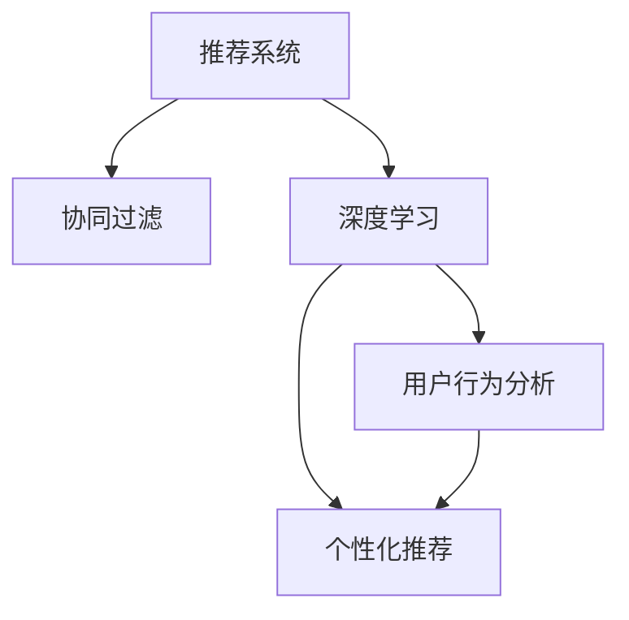

                 

# AI驱动的电商个性化推送内容与时机优化

> 关键词：人工智能，电商，个性化推荐，推荐系统，算法优化，用户行为分析

## 1. 背景介绍

随着电子商务的快速发展，个性化推荐系统成为各大电商平台提高用户粘性、提升销售转化的重要手段。传统的推荐系统主要以用户的历史行为数据为基础，通过协同过滤、矩阵分解等方法进行推荐。然而，随着用户行为模式的多样化和个性化需求的不断增长，这种基于历史数据的推荐方式显得捉襟见肘。人工智能技术的应用，尤其是基于深度学习的推荐算法，为电商个性化推荐系统带来了新的突破，显著提升了推荐的精准度和效率。

## 2. 核心概念与联系

### 2.1 核心概念概述

为更好地理解AI驱动的电商个性化推荐系统，本节将介绍几个密切相关的核心概念：

- 推荐系统(Recommendation System)：通过分析用户的历史行为数据，为用户推荐符合其兴趣或需求的物品的系统。
- 协同过滤(Collaborative Filtering)：基于用户行为数据的相似度，推测出用户可能感兴趣的新物品。
- 深度学习(Deep Learning)：通过构建多层次的神经网络模型，模拟人脑的计算过程，学习复杂的输入特征映射关系。
- 用户行为分析(User Behavior Analysis)：通过分析用户在电商平台上的浏览、点击、购买等行为数据，了解用户偏好和需求。
- 个性化推荐(Personalized Recommendation)：根据用户的行为特征和个性化需求，实时调整推荐策略，提高推荐的个性化程度。

这些概念之间的逻辑关系可以通过以下Mermaid流程图来展示：



这个流程图展示推荐的各个核心概念及其之间的关系：

1. 推荐系统通过协同过滤、深度学习等方式，对用户行为进行分析。
2. 深度学习模型可以更好地处理大规模、高维度的用户行为数据。
3. 用户行为分析能够更准确地捕捉用户的个性化需求和行为模式。
4. 个性化推荐根据用户行为特征，实时调整推荐内容，满足用户的个性化需求。

## 3. 核心算法原理 & 具体操作步骤
### 3.1 算法原理概述

基于深度学习的电商个性化推荐系统，本质上是一种自监督学习的推荐算法。其核心思想是：利用用户的历史行为数据，训练一个推荐模型，该模型能够学习到用户的行为特征和偏好，从而预测用户可能感兴趣的新物品。

形式化地，假设用户 $u$ 的历史行为数据为 $X_u=\{x_{u,i}\}_{i=1}^N$，其中 $x_{u,i}$ 表示用户 $u$ 对物品 $i$ 的评分或行为标签。推荐系统的目标是找到最优的推荐模型 $f_\theta$，使得：

$$
f_\theta(X_u) \approx X_u^*
$$

其中 $X_u^*$ 表示用户 $u$ 的理想评分或行为标签，$f_\theta$ 为推荐模型，$\theta$ 为模型参数。

推荐模型的损失函数通常为均方误差或交叉熵等，训练目标为最小化模型输出与理想标签之间的差异。通过梯度下降等优化算法，不断调整模型参数 $\theta$，最小化损失函数，得到用户 $u$ 的理想推荐 $R_u$。

### 3.2 算法步骤详解

基于深度学习的电商个性化推荐系统一般包括以下几个关键步骤：

**Step 1: 数据收集与预处理**
- 收集用户的历史行为数据，包括点击、购买、浏览、评分等。
- 对数据进行清洗和预处理，去除异常值和噪声。
- 将数据划分训练集、验证集和测试集，用于模型训练和性能评估。

**Step 2: 构建深度学习模型**
- 选择合适的深度学习模型，如深度矩阵分解、深度协同过滤、深度神经网络等。
- 设计模型的输入和输出层，确定损失函数和优化算法。
- 定义模型的超参数，如学习率、批大小、迭代轮数等。

**Step 3: 模型训练**
- 使用训练集数据，通过梯度下降等优化算法，更新模型参数，最小化损失函数。
- 在验证集上评估模型性能，根据性能指标（如准确率、召回率、F1值等）决定是否调整模型参数或停止训练。
- 在测试集上再次评估模型性能，对比微调前后的效果。

**Step 4: 实时推荐**
- 将用户的历史行为数据输入模型，得到推荐结果。
- 根据推荐结果和用户行为特征，动态调整推荐策略，如调整推荐内容、优化推荐时机等。
- 将推荐结果展示给用户，并进行实时反馈和优化。

### 3.3 算法优缺点

基于深度学习的电商个性化推荐系统具有以下优点：
1. 精度高。深度学习模型能够学习到用户行为的复杂特征，提高推荐结果的准确性和多样性。
2. 可解释性强。深度模型可以通过特征可视化等手段，解释模型的决策过程和特征重要性。
3. 适应性强。深度模型能够适应用户行为模式的变化，实时更新推荐策略。
4. 灵活性高。模型可以根据具体应用场景，选择不同的网络结构、激活函数等设计。

同时，该方法也存在一些局限性：
1. 对标注数据依赖大。推荐系统通常需要大量的用户行为数据进行训练，数据采集成本较高。
2. 计算复杂度高。深度模型参数量较大，计算资源消耗较大。
3. 数据冷启动问题。对于新用户或新物品，推荐系统难以取得理想的推荐效果。
4. 算法黑箱。深度模型通常难以解释其决策过程，用户难以理解推荐结果。
5. 公平性问题。推荐模型可能受到数据分布偏差的影响，产生歧视性推荐。

尽管存在这些局限性，基于深度学习的推荐算法仍是大规模电商推荐系统的主流范式。未来相关研究的方向在于如何进一步降低数据需求，提高计算效率，解决冷启动和公平性问题，增强模型的可解释性和可解释性。

### 3.4 算法应用领域

基于深度学习的电商个性化推荐算法已经在电商、内容推荐、金融等领域得到了广泛应用，显著提升了用户体验和平台收益：

- 电商：提升用户购买率、购物车转化率等关键指标。
- 内容推荐：增加用户对平台的黏性，提升内容的阅读量和观看量。
- 金融：精准推荐理财、保险、基金等金融产品，提高用户满意度和收益率。

除了这些传统应用外，深度推荐算法还被创新性地应用到更多场景中，如广告推荐、社交网络推荐、新闻推荐等，为不同领域的数据密集型业务带来了新的机遇。

## 4. 数学模型和公式 & 详细讲解 & 举例说明

### 4.1 数学模型构建

本节将使用数学语言对基于深度学习的电商个性化推荐系统进行更加严格的刻画。

记用户 $u$ 的历史行为数据为 $X_u=\{x_{u,i}\}_{i=1}^N$，推荐模型的输入为 $x_u \in \mathbb{R}^d$，推荐结果为 $r_u \in \mathbb{R}$。推荐模型的目标函数为：

$$
L(u) = \frac{1}{N} \sum_{i=1}^N \ell(x_{u,i},r_u)
$$

其中 $\ell$ 为损失函数，如均方误差 $L_2$ 或交叉熵 $L_{CE}$。训练目标为最小化目标函数 $L(u)$。

### 4.2 公式推导过程

以均方误差损失为例，推导推荐模型的训练过程：

设推荐模型的参数为 $\theta$，输入 $x_u$，输出 $r_u$，则推荐模型可以表示为 $r_u = f_\theta(x_u)$。

训练目标为最小化均方误差损失，即：

$$
\min_{\theta} \frac{1}{N} \sum_{i=1}^N (x_{u,i} - f_\theta(x_u))^2
$$

通过梯度下降算法更新模型参数 $\theta$，每次迭代更新量为：

$$
\theta \leftarrow \theta - \eta \nabla_\theta \frac{1}{N} \sum_{i=1}^N (x_{u,i} - f_\theta(x_u))^2
$$

其中 $\eta$ 为学习率，$\nabla_\theta$ 为梯度算子。

通过不断迭代，直至损失函数收敛，得到最终的推荐模型参数 $\theta^*$。

### 4.3 案例分析与讲解

以深度协同过滤为例，分析其训练和推理过程：

假设推荐模型为深度协同过滤模型，输入为用户 $u$ 和物品 $i$ 的嵌入表示，输出为推荐分数。模型结构如图：


其中 $x_u$ 为用户 $u$ 的嵌入表示，$x_i$ 为物品 $i$ 的嵌入表示，$f_{W_1}$ 和 $f_{W_2}$ 为全连接层，$\sigma$ 为激活函数。训练目标为最小化均方误差损失：

$$
\min_{W_1,W_2,b_1,b_2} \frac{1}{N} \sum_{i=1}^N (y_i - z_i)^2
$$

其中 $y_i$ 为实际评分，$z_i = f_{W_1}(x_u) \cdot f_{W_2}(x_i)$ 为模型预测分数。

通过梯度下降算法更新模型参数 $W_1,W_2,b_1,b_2$，直到收敛，得到最终的推荐模型。

## 5. 项目实践：代码实例和详细解释说明
### 5.1 开发环境搭建

在进行推荐系统开发前，我们需要准备好开发环境。以下是使用Python进行TensorFlow开发的环境配置流程：

1. 安装Anaconda：从官网下载并安装Anaconda，用于创建独立的Python环境。

2. 创建并激活虚拟环境：
```bash
conda create -n tf-env python=3.8 
conda activate tf-env
```

3. 安装TensorFlow：从官网获取对应的安装命令。例如：
```bash
conda install tensorflow -c conda-forge -c pytorch
```

4. 安装TensorBoard：TensorFlow配套的可视化工具，用于实时监测模型训练状态，提供丰富的图表呈现方式，是调试模型的得力助手。
```bash
pip install tensorboard
```

5. 安装Flask：用于搭建API接口，方便模型服务化封装。
```bash
pip install flask
```

完成上述步骤后，即可在`tf-env`环境中开始推荐系统开发。

### 5.2 源代码详细实现

下面以电商推荐系统为例，给出使用TensorFlow进行深度协同过滤模型开发的PyTorch代码实现。

首先，定义模型和优化器：

```python
import tensorflow as tf
from tensorflow.keras import layers, models

# 定义模型结构
model = models.Sequential([
    layers.Dense(64, activation='relu', input_shape=(N,)),
    layers.Dense(64, activation='relu'),
    layers.Dense(1)
])

# 定义优化器
optimizer = tf.keras.optimizers.Adam(learning_rate=0.001)
```

然后，定义训练和评估函数：

```python
def train_step(model, X_train, y_train):
    with tf.GradientTape() as tape:
        y_pred = model(X_train)
        loss = tf.losses.mean_squared_error(y_train, y_pred)
    grads = tape.gradient(loss, model.trainable_variables)
    optimizer.apply_gradients(zip(grads, model.trainable_variables))

def evaluate(model, X_test, y_test):
    y_pred = model(X_test)
    loss = tf.losses.mean_squared_error(y_test, y_pred)
    mse = tf.keras.metrics.Mean()
    mse(y_test, y_pred)
    return loss, mse
```

最后，启动训练流程并在测试集上评估：

```python
epochs = 100
batch_size = 64

for epoch in range(epochs):
    train_step(model, X_train, y_train)
    loss, mse = evaluate(model, X_test, y_test)
    print(f"Epoch {epoch+1}, loss: {loss:.4f}, mse: {mse.result():.4f}")
```

以上就是使用TensorFlow对电商推荐系统进行深度协同过滤模型微调的完整代码实现。可以看到，借助TensorFlow的高级API，深度推荐模型的开发变得简单高效。

### 5.3 代码解读与分析

让我们再详细解读一下关键代码的实现细节：

**train_step函数**：
- 定义了模型的前向传播和反向传播过程，计算损失函数，并使用Adam优化器更新模型参数。

**evaluate函数**：
- 计算模型在测试集上的均方误差，并返回损失值和均方误差。

**训练流程**：
- 定义总的epoch数和batch size，开始循环迭代
- 每个epoch内，在训练集上训练，输出损失值
- 在测试集上评估，输出均方误差

可以看到，TensorFlow配合TensorBoard等工具，使得深度推荐模型的开发和调试变得更加简单高效。开发者可以将更多精力放在模型改进和算法优化上，而不必过多关注底层的实现细节。

当然，工业级的系统实现还需考虑更多因素，如模型的保存和部署、超参数的自动搜索、更灵活的任务适配层等。但核心的微调范式基本与此类似。

## 6. 实际应用场景
### 6.1 电商推荐系统优化

基于深度学习的电商推荐系统，可以广泛应用于电商平台的用户推荐，提高用户购物体验和平台收益。

在技术实现上，可以收集用户的历史浏览、点击、购买等行为数据，将其编码成向量形式输入模型。模型通过前向传播输出推荐分数，结合用户行为特征进行排序，生成个性化的推荐列表。对于用户的后续行为，可以实时反馈和调整推荐策略，进一步优化推荐效果。

### 6.2 金融理财推荐

金融理财产品种类繁多，用户难以筛选出适合自己的产品。基于深度学习的理财推荐系统，可以精准推荐符合用户风险偏好和收益预期的产品，提升用户满意度和收益率。

在实践中，可以收集用户的历史交易记录、风险承受能力、收益预期等数据，构建推荐模型。模型通过对用户特征和产品特征进行匹配，预测用户的潜在购买意愿，从而生成个性化的推荐列表。同时，模型可以根据用户的实时反馈，动态调整推荐策略，优化推荐效果。

### 6.3 社交网络推荐

社交网络平台希望用户能够发现更多符合自己兴趣的群组、内容等。基于深度学习的社交网络推荐系统，可以自动发现用户间的共同兴趣，生成个性化的推荐内容，提高平台活跃度和用户满意度。

在实现上，可以收集用户在平台上的浏览、点赞、评论等行为数据，构建推荐模型。模型通过对用户特征和内容特征进行匹配，预测用户的兴趣点，生成个性化的推荐内容。同时，模型可以根据用户的实时反馈，动态调整推荐策略，优化推荐效果。

### 6.4 未来应用展望

随着深度学习技术的发展，基于深度学习的推荐系统将在更多领域得到应用，为各行各业带来新的机遇：

- 医疗：推荐适合用户病情和偏好的诊疗方案，提高诊疗效果和患者满意度。
- 教育：推荐适合用户学习进度和兴趣的课程，提高学习效率和课程完成率。
- 娱乐：推荐适合用户口味的影视剧、游戏等娱乐内容，提高娱乐体验和用户黏性。
- 交通：推荐适合用户出行需求和偏好的交通方式，提高出行效率和舒适度。

此外，在企业生产、社会治理、文娱传媒等众多领域，基于深度学习的推荐系统也将不断涌现，为数据密集型业务带来新的活力。相信随着技术的日益成熟，推荐系统必将在更广阔的应用领域大放异彩。

## 7. 工具和资源推荐
### 7.1 学习资源推荐

为了帮助开发者系统掌握深度学习推荐系统的理论基础和实践技巧，这里推荐一些优质的学习资源：

1. 《深度学习推荐系统》书籍：深入浅出地介绍了深度学习推荐系统的理论和实践，涵盖协同过滤、深度学习等多个方面。

2. 《Recommender Systems: Algorithms and Application》书籍：系统介绍了推荐系统的原理、算法和应用场景，适合深入研究推荐系统。

3. 《推荐系统实战》书籍：通过实战项目，介绍了推荐系统的构建、优化和部署，适合工程实践。

4. Udacity《深度学习推荐系统》课程：由深度学习专家授课，讲解推荐系统的基本概念和常见算法，适合初学者入门。

5. 《Recommender Systems》在线课程：由斯坦福大学开设的课程，系统介绍了推荐系统的理论和实践，适合系统学习。

通过对这些资源的学习实践，相信你一定能够快速掌握深度学习推荐系统的精髓，并用于解决实际的电商推荐问题。

### 7.2 开发工具推荐

高效的开发离不开优秀的工具支持。以下是几款用于深度学习推荐系统开发的常用工具：

1. TensorFlow：由Google主导开发的开源深度学习框架，生产部署方便，适合大规模工程应用。

2. PyTorch：基于Python的开源深度学习框架，灵活动态的计算图，适合快速迭代研究。

3. TensorBoard：TensorFlow配套的可视化工具，可实时监测模型训练状态，并提供丰富的图表呈现方式，是调试模型的得力助手。

4. HuggingFace Transformers：集成了众多SOTA推荐模型，支持多种深度学习框架，是进行推荐系统开发的利器。

5. NLTK、spaCy：自然语言处理工具库，可用于数据预处理、特征提取等任务。

6. Scikit-learn：常用的机器学习库，可用于数据处理、模型评估等任务。

合理利用这些工具，可以显著提升深度学习推荐系统的开发效率，加快创新迭代的步伐。

### 7.3 相关论文推荐

深度学习推荐系统的发展源于学界的持续研究。以下是几篇奠基性的相关论文，推荐阅读：

1. TensorFlow官方文档：《TensorFlow Recommender》：提供了推荐系统的实现和优化指南，适合工程实践。

2. 《Deep Collaborative Filtering》论文：提出深度协同过滤模型，将深度学习引入推荐系统，取得了显著效果。

3. 《Neural Collaborative Filtering》论文：提出神经协同过滤模型，引入神经网络结构，进一步提升推荐效果。

4. 《Attention-Based Recommender Systems》论文：提出基于注意力机制的推荐模型，提高推荐的可解释性和效果。

5. 《BPR: Bayesian Personalized Ranking from Implicit Feedback》论文：提出基于贝叶斯概率模型的推荐算法，用于处理稀疏反馈数据。

这些论文代表了大数据推荐系统的进展方向。通过学习这些前沿成果，可以帮助研究者把握学科前进方向，激发更多的创新灵感。

## 8. 总结：未来发展趋势与挑战
### 8.1 总结

本文对基于深度学习的电商个性化推荐系统进行了全面系统的介绍。首先阐述了推荐系统的研究背景和意义，明确了深度学习在提升推荐精度和效率方面的独特价值。其次，从原理到实践，详细讲解了深度学习推荐系统的数学原理和关键步骤，给出了推荐系统开发的完整代码实例。同时，本文还广泛探讨了推荐系统在电商、金融、社交等多个领域的应用前景，展示了深度学习推荐系统的广阔前景。

通过本文的系统梳理，可以看到，基于深度学习的推荐系统已经在电商、金融、社交等多个领域得到广泛应用，为各行各业带来了新的机遇。未来，伴随深度学习技术的发展，推荐系统必将进一步提升精准度和效率，实现个性化推荐。

### 8.2 未来发展趋势

展望未来，深度学习推荐系统将呈现以下几个发展趋势：

1. 推荐模型更加复杂。未来的推荐模型将融入更多的神经网络结构和注意力机制，提高推荐结果的准确性和多样性。
2. 推荐内容更加多样。推荐系统将从传统的物品推荐，拓展到任务推荐、关系推荐等多种形式。
3. 推荐场景更加丰富。推荐系统将从电商、金融等特定场景，拓展到医疗、教育、娱乐等多个领域。
4. 推荐时间更加动态。推荐系统将结合用户的实时行为数据，动态调整推荐内容，实现实时推荐。
5. 推荐过程更加透明。推荐系统将提供更强大的解释能力和可解释性，使用户能够理解推荐结果的生成过程。

以上趋势凸显了深度学习推荐系统的广阔前景。这些方向的探索发展，必将进一步提升推荐系统的性能和应用范围，为各行各业带来新的机遇。

### 8.3 面临的挑战

尽管深度学习推荐系统已经取得了瞩目成就，但在迈向更加智能化、普适化应用的过程中，它仍面临着诸多挑战：

1. 数据需求量大。推荐系统通常需要大量的用户行为数据进行训练，数据采集成本较高。如何降低数据需求，提高模型精度和效率，将是一大难题。
2. 计算资源消耗大。深度推荐模型参数量大，计算资源消耗较大。如何优化模型结构，提高计算效率，是重要的优化方向。
3. 模型解释性不足。深度模型通常难以解释其决策过程，用户难以理解推荐结果。如何提高模型的可解释性，增强用户信任，将是亟待攻克的难题。
4. 公平性和歧视问题。推荐模型可能受到数据分布偏差的影响，产生歧视性推荐。如何消除模型偏见，确保推荐公平性，也将是重要的研究方向。
5. 冷启动问题。对于新用户或新物品，推荐系统难以取得理想的推荐效果。如何通过少样本学习和迁移学习等方法，解决冷启动问题，将是一大挑战。

尽管存在这些挑战，基于深度学习的推荐算法仍是大规模推荐系统的主流范式。未来相关研究的方向在于如何进一步降低数据需求，提高计算效率，解决冷启动和公平性问题，增强模型的可解释性和公平性。

### 8.4 研究展望

面对深度学习推荐系统所面临的挑战，未来的研究需要在以下几个方面寻求新的突破：

1. 探索无监督和半监督推荐方法。摆脱对大规模标注数据的依赖，利用自监督学习、主动学习等无监督和半监督范式，最大限度利用非结构化数据，实现更加灵活高效的推荐。
2. 研究参数高效和计算高效的推荐范式。开发更加参数高效的推荐方法，在固定大部分预训练参数的同时，只更新极少量的任务相关参数。同时优化推荐模型的计算图，减少前向传播和反向传播的资源消耗，实现更加轻量级、实时性的部署。
3. 融合因果和对比学习范式。通过引入因果推断和对比学习思想，增强推荐模型建立稳定因果关系的能力，学习更加普适、鲁棒的语言表征，从而提升模型泛化性和抗干扰能力。
4. 引入更多先验知识。将符号化的先验知识，如知识图谱、逻辑规则等，与神经网络模型进行巧妙融合，引导推荐过程学习更准确、合理的推荐结果。同时加强不同模态数据的整合，实现视觉、语音等多模态信息与文本信息的协同建模。
5. 结合因果分析和博弈论工具。将因果分析方法引入推荐模型，识别出推荐决策的关键特征，增强推荐结果的因果性和逻辑性。借助博弈论工具刻画人机交互过程，主动探索并规避推荐模型的脆弱点，提高系统稳定性。

这些研究方向的探索，必将引领深度学习推荐系统迈向更高的台阶，为构建安全、可靠、可解释、可控的智能系统铺平道路。面向未来，深度学习推荐系统还需要与其他人工智能技术进行更深入的融合，如知识表示、因果推理、强化学习等，多路径协同发力，共同推动自然语言理解和智能交互系统的进步。只有勇于创新、敢于突破，才能不断拓展推荐系统的边界，让智能技术更好地造福人类社会。

## 9. 附录：常见问题与解答

**Q1：深度学习推荐系统的优点和缺点是什么？**

A: 深度学习推荐系统的优点包括：
1. 精度高。深度学习模型能够学习到用户行为的复杂特征，提高推荐结果的准确性和多样性。
2. 可解释性强。深度模型可以通过特征可视化等手段，解释模型的决策过程和特征重要性。
3. 适应性强。深度模型能够适应用户行为模式的变化，实时更新推荐策略。
4. 灵活性高。模型可以根据具体应用场景，选择不同的网络结构、激活函数等设计。

缺点包括：
1. 对标注数据依赖大。推荐系统通常需要大量的用户行为数据进行训练，数据采集成本较高。
2. 计算复杂度高。深度模型参数量较大，计算资源消耗较大。
3. 数据冷启动问题。对于新用户或新物品，推荐系统难以取得理想的推荐效果。
4. 算法黑箱。深度模型通常难以解释其决策过程，用户难以理解推荐结果。
5. 公平性问题。推荐模型可能受到数据分布偏差的影响，产生歧视性推荐。

尽管存在这些局限性，基于深度学习的推荐算法仍是大规模电商推荐系统的主流范式。未来相关研究的方向在于如何进一步降低数据需求，提高计算效率，解决冷启动和公平性问题，增强模型的可解释性和公平性。

**Q2：如何降低深度学习推荐系统的数据需求？**

A: 降低深度学习推荐系统的数据需求，可以通过以下方法实现：
1. 利用用户隐式反馈。推荐系统可以通过收集用户的浏览、点击等隐式反馈数据，减少对显式评分数据的依赖。
2. 利用用户画像和行为分析。通过构建用户画像和行为分析模型，预测用户的潜在兴趣，减少对历史行为数据的依赖。
3. 利用少样本学习和迁移学习。通过少样本学习和迁移学习等方法，利用少量标注数据和领域知识，快速适应新用户和新物品。
4. 利用协同过滤和矩阵分解。协同过滤和矩阵分解等无监督学习方法，可以在较少标注数据的情况下，取得较好的推荐效果。

这些方法可以结合使用，进一步降低深度学习推荐系统的数据需求，提高模型精度和效率。

**Q3：如何优化深度学习推荐系统的计算效率？**

A: 优化深度学习推荐系统的计算效率，可以通过以下方法实现：
1. 模型压缩和稀疏化。通过剪枝、量化、稀疏化等技术，减少模型的参数量，降低计算资源消耗。
2. 分布式训练。通过分布式训练技术，将训练任务分配到多台设备上并行计算，提高训练速度。
3. 模型并行和混合精度训练。通过模型并行和混合精度训练等技术，提高计算效率和模型精度。
4. 计算图优化。通过优化计算图结构，减少不必要的计算量，提高计算效率。

这些方法可以结合使用，进一步优化深度学习推荐系统的计算效率，提升模型的实时性和响应速度。

**Q4：如何提高深度学习推荐系统的可解释性？**

A: 提高深度学习推荐系统的可解释性，可以通过以下方法实现：
1. 特征可视化。通过可视化特征权重和特征重要性，帮助用户理解推荐模型的决策过程。
2. 局部可解释性。通过局部可解释性技术，对用户行为特征进行解释，说明推荐结果的生成原因。
3. 规则引擎和知识图谱。结合规则引擎和知识图谱等外部知识，提高推荐结果的逻辑性和可解释性。

这些方法可以结合使用，进一步提高深度学习推荐系统的可解释性，增强用户信任和满意度。

**Q5：如何应对深度学习推荐系统的公平性问题？**

A: 应对深度学习推荐系统的公平性问题，可以通过以下方法实现：
1. 数据预处理。通过数据预处理技术，消除数据分布偏差，减少推荐模型的不公平性。
2. 模型公平性约束。在推荐模型的训练目标中引入公平性约束，惩罚歧视性推荐。
3. 多样性约束。在推荐模型的训练目标中引入多样性约束，确保推荐结果的多样性。
4. 多样性奖励。在推荐模型的训练目标中引入多样性奖励，激励模型生成多样化的推荐结果。

这些方法可以结合使用，进一步应对深度学习推荐系统的公平性问题，提升推荐模型的公平性和鲁棒性。

---

作者：禅与计算机程序设计艺术 / Zen and the Art of Computer Programming

