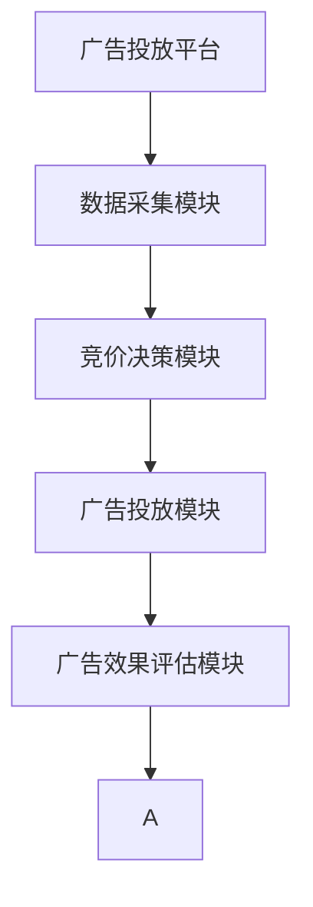

                 

# AI驱动的电商实时竞价广告系统

## 1. 背景介绍

### 1.1 问题由来

在电商领域，广告投放一直是提升转化率、增加收入的重要手段。传统的广告投放方式，大多依赖于经验丰富的营销人员，通过分析历史数据、竞争对手情况等，手动投放广告，难以充分挖掘数据价值，造成资源浪费。而随着AI和大数据技术的发展，电商广告投放方式正在逐步向智能化、实时化方向转变。

基于AI的实时竞价广告系统，利用机器学习算法和大数据分析技术，根据用户行为和市场环境动态调整广告投放策略，实现广告投放的精细化、高效化。通过构建实时竞价广告系统，电商商家可以实现更精准的广告投放，提高广告效果，降低投放成本，实现更高ROI。

### 1.2 问题核心关键点

AI驱动的实时竞价广告系统，主要由以下几个核心组件构成：

1. **广告投放平台**：提供广告投放接口，接收广告主投放需求。
2. **数据采集模块**：实时采集用户行为数据，包括浏览记录、购买记录、点击率等。
3. **竞价决策模块**：利用机器学习算法，根据广告效果、市场环境、用户特征等因素，动态调整出价策略，实现最优投放。
4. **广告投放模块**：根据决策结果，自动向目标用户投放广告。
5. **广告效果评估模块**：实时监测广告投放效果，调整投放策略。

这些组件协同工作，实现从广告投放、数据采集、竞价决策到广告效果评估的闭环，全面提升广告投放的精准度和效果。

### 1.3 问题研究意义

构建AI驱动的电商实时竞价广告系统，具有重要意义：

1. **提升广告投放精准度**：通过实时数据分析，动态调整广告投放策略，实现更精准的广告投放。
2. **优化广告投放效果**：根据广告效果反馈，自动调整出价策略，最大化广告投放效果。
3. **降低广告投放成本**：通过精准投放和效果评估，减少无效广告的投放，降低投放成本。
4. **提高营销ROI**：提升广告投放的精准度和效果，提高营销回报率。
5. **助力电商业务增长**：通过更有效的广告投放，推动电商业务增长，增加电商收入。

## 2. 核心概念与联系

### 2.1 核心概念概述

为更好地理解AI驱动的实时竞价广告系统，本节将介绍几个密切相关的核心概念：

- **电商广告投放**：指电商企业为吸引消费者购买其产品或服务，通过线上线下渠道向目标用户投放广告的过程。
- **实时竞价广告**：指广告主在投放广告时，根据广告效果实时调整出价，确保广告资源得到最优利用的投放方式。
- **广告投放平台**：指为广告主提供广告投放接口，支持广告投放和广告效果评估的互联网平台。
- **竞价决策算法**：指用于动态调整广告出价，实现广告投放最优化的算法模型。
- **广告效果评估**：指实时监测广告投放效果，评估广告投放效果并调整投放策略的机制。

这些概念之间的逻辑关系可以通过以下Mermaid流程图来展示：



这个流程图展示了一系列广告投放的基本流程：

1. 广告主通过广告投放平台进行广告投放。
2. 数据采集模块实时采集用户行为数据。
3. 竞价决策模块根据数据进行动态竞价决策。
4. 广告投放模块根据决策结果进行广告投放。
5. 广告效果评估模块实时监测广告效果，调整投放策略。

## 3. 核心算法原理 & 具体操作步骤
### 3.1 算法原理概述

AI驱动的实时竞价广告系统，核心依赖于机器学习算法，通过实时分析用户行为数据，动态调整广告投放策略，实现广告投放的最优化。

系统一般采用强化学习算法进行竞价决策，将广告投放过程视为一个序列决策问题，通过奖励函数和损失函数，引导模型最大化广告投放的回报。

算法流程如下：

1. **数据预处理**：将用户行为数据进行清洗和归一化处理，转化为模型可以处理的形式。
2. **特征提取**：从预处理后的数据中提取特征，如用户ID、浏览记录、点击率等。
3. **模型训练**：利用历史数据和特征，训练机器学习模型，得到广告投放策略。
4. **实时竞价**：根据实时采集的数据，输入模型进行预测，动态调整广告出价。
5. **效果评估**：实时监测广告投放效果，根据评估结果调整投放策略。

### 3.2 算法步骤详解

以下是AI驱动的实时竞价广告系统的核心算法步骤：

**Step 1: 准备数据和模型**

- 收集广告主投放需求，包括广告内容、投放渠道、预算等。
- 收集用户行为数据，如浏览记录、点击率、购买记录等。
- 选择适合的机器学习算法，如线性回归、决策树、随机森林等，用于竞价决策。
- 准备训练集和测试集，用于模型训练和评估。

**Step 2: 数据预处理和特征提取**

- 清洗和归一化用户行为数据，去除噪声和异常值。
- 提取用户特征，如用户ID、浏览次数、浏览时长、点击率等。
- 对特征进行编码，转化为模型可以处理的数值形式。

**Step 3: 模型训练和参数优化**

- 利用训练集数据，对模型进行训练，得到初始的投放策略。
- 选择合适的优化算法，如梯度下降、Adam等，优化模型参数。
- 设置超参数，如学习率、批大小等，调整模型训练过程。

**Step 4: 实时竞价和效果评估**

- 实时采集用户行为数据，输入模型进行预测，得到最优出价策略。
- 根据实时出价策略，自动向目标用户投放广告。
- 实时监测广告投放效果，如点击率、转化率等，评估广告效果。
- 根据效果评估结果，调整投放策略，优化投放效果。

**Step 5: 模型迭代和优化**

- 定期更新训练集数据，增加模型数据量和多样性。
- 使用新的训练集数据，重新训练模型，优化投放策略。
- 引入新的机器学习算法，如神经网络、深度学习等，提升模型精度。
- 结合领域知识，设计更有意义的特征和奖励函数，提升模型效果。

### 3.3 算法优缺点

AI驱动的实时竞价广告系统具有以下优点：

1. **精准投放**：通过实时数据分析，动态调整投放策略，实现更精准的广告投放。
2. **效果优化**：根据广告效果反馈，自动调整出价策略，最大化广告效果。
3. **降低成本**：减少无效广告的投放，降低广告投放成本。
4. **实时动态**：实时采集和处理数据，动态调整广告投放策略，提高投放效果。
5. **易于扩展**：系统架构灵活，易于扩展和优化，支持多种广告投放渠道。

同时，该系统也存在一些局限性：

1. **数据质量依赖**：广告投放效果依赖于数据的准确性和及时性，数据偏差可能导致投放效果不佳。
2. **模型复杂度**：高复杂度的模型，需要大量计算资源和数据，可能影响系统的实时性。
3. **对抗攻击**：部分广告主可能采用恶意手段，降低系统投放效果，需要系统具备一定鲁棒性。
4. **用户隐私问题**：实时采集用户行为数据，可能涉及用户隐私问题，需要合法合规使用数据。

### 3.4 算法应用领域

AI驱动的实时竞价广告系统，已经在电商、互联网、金融等多个领域得到了广泛应用，具体应用场景包括：

- **电商广告投放**：通过分析用户行为数据，动态调整广告投放策略，实现精准投放。
- **互联网广告投放**：根据用户浏览记录和点击行为，实时调整广告投放策略，提高广告效果。
- **金融市场交易**：实时分析市场行情，动态调整交易策略，优化投资回报率。
- **推荐系统**：根据用户行为数据，实时调整推荐策略，提高推荐效果和用户体验。
- **智能客服系统**：通过实时分析用户交互数据，动态调整对话策略，提升客户满意度。

这些应用场景表明，AI驱动的实时竞价广告系统具有广泛的应用前景，是推动电商、互联网等领域向智能化、自动化方向发展的关键技术。

## 4. 数学模型和公式 & 详细讲解  
### 4.1 数学模型构建

本节将使用数学语言对AI驱动的实时竞价广告系统的核心算法进行更加严格的刻画。

设广告投放策略为 $f(x)$，其中 $x$ 为特征向量，$f(x)$ 为预测出的广告出价。假设历史数据集为 $\{(x_i, y_i)\}_{i=1}^N$，其中 $x_i$ 为第 $i$ 个样本的特征向量，$y_i$ 为实际出价。

模型的目标是最小化预测误差，即：

$$
\min_{f} \frac{1}{N} \sum_{i=1}^N (y_i - f(x_i))^2
$$

其中，$\sum_{i=1}^N (y_i - f(x_i))^2$ 为均方误差（MSE），用于衡量预测值与实际值之间的差异。

### 4.2 公式推导过程

以下我们以线性回归模型为例，推导模型训练和预测的数学公式。

设线性回归模型为：

$$
f(x) = \theta_0 + \theta_1 x_1 + \theta_2 x_2 + \cdots + \theta_n x_n
$$

其中 $\theta = (\theta_0, \theta_1, \ldots, \theta_n)$ 为模型参数。假设模型的均方误差为 $L$，则：

$$
L = \frac{1}{N} \sum_{i=1}^N (y_i - \theta_0 - \theta_1 x_{i,1} - \theta_2 x_{i,2} - \cdots - \theta_n x_{i,n})^2
$$

利用梯度下降算法，对 $\theta$ 进行优化，目标是最小化损失函数 $L$：

$$
\theta \leftarrow \theta - \eta \frac{1}{N} \sum_{i=1}^N (y_i - \theta_0 - \theta_1 x_{i,1} - \theta_2 x_{i,2} - \cdots - \theta_n x_{i,n}) x_{i,1}, x_{i,2}, \ldots, x_{i,n}
$$

其中 $\eta$ 为学习率，$x_{i,j}$ 为样本 $i$ 的第 $j$ 个特征值。

在得到最优参数 $\theta^*$ 后，可以将其代入模型 $f(x)$，对新样本进行预测和评估。

### 4.3 案例分析与讲解

以线性回归模型为例，假设某电商网站需要根据用户浏览记录预测其购买概率。通过数据预处理和特征提取，得到特征向量 $x = (浏览次数, 浏览时长, 点击率)$。设历史数据集为 $\{(x_i, y_i)\}_{i=1}^N$，其中 $x_i$ 为第 $i$ 个样本的特征向量，$y_i$ 为实际购买概率。

**Step 1: 数据预处理**

- 收集用户浏览数据，包括浏览次数、浏览时长、点击率等。
- 对数据进行清洗和归一化，去除噪声和异常值。

**Step 2: 特征提取**

- 提取用户特征，如浏览次数、浏览时长、点击率等。
- 对特征进行编码，转化为数值形式。

**Step 3: 模型训练**

- 利用历史数据集，训练线性回归模型，得到初始的预测函数 $f(x)$。
- 使用梯度下降算法，优化模型参数 $\theta$，最小化预测误差 $L$。

**Step 4: 实时竞价和效果评估**

- 实时采集用户浏览记录，输入模型进行预测，得到最优出价策略 $f(x)$。
- 根据预测结果，自动向目标用户投放广告。
- 实时监测广告投放效果，如点击率、转化率等，评估广告效果。
- 根据效果评估结果，调整投放策略，优化投放效果。

**Step 5: 模型迭代和优化**

- 定期更新训练集数据，增加模型数据量和多样性。
- 使用新的训练集数据，重新训练模型，优化投放策略。
- 引入新的机器学习算法，如神经网络、深度学习等，提升模型精度。
- 结合领域知识，设计更有意义的特征和奖励函数，提升模型效果。

通过以上步骤，即可实现基于线性回归模型的实时竞价广告系统。可以看到，线性回归模型通过优化预测误差，实现了广告投放的精准度和效果优化。

## 5. 项目实践：代码实例和详细解释说明
### 5.1 开发环境搭建

在进行广告系统开发前，我们需要准备好开发环境。以下是使用Python进行PyTorch开发的环境配置流程：

1. 安装Anaconda：从官网下载并安装Anaconda，用于创建独立的Python环境。

2. 创建并激活虚拟环境：
```bash
conda create -n pytorch-env python=3.8 
conda activate pytorch-env
```

3. 安装PyTorch：根据CUDA版本，从官网获取对应的安装命令。例如：
```bash
conda install pytorch torchvision torchaudio cudatoolkit=11.1 -c pytorch -c conda-forge
```

4. 安装TensorFlow：
```bash
pip install tensorflow
```

5. 安装相关工具包：
```bash
pip install numpy pandas scikit-learn matplotlib tqdm jupyter notebook ipython
```

完成上述步骤后，即可在`pytorch-env`环境中开始广告系统开发。

### 5.2 源代码详细实现

下面我们以线性回归模型为例，给出使用PyTorch实现广告系统投放的代码实现。

首先，定义广告投放数据集：

```python
import pandas as pd

# 加载广告投放数据集
data = pd.read_csv('ad_data.csv')

# 定义特征向量
X = data[['浏览次数', '浏览时长', '点击率']]
y = data['购买概率']
```

然后，定义模型和优化器：

```python
import torch
from torch import nn, optim

# 定义线性回归模型
class LinearRegression(nn.Module):
    def __init__(self, input_dim, output_dim):
        super(LinearRegression, self).__init__()
        self.linear = nn.Linear(input_dim, output_dim)

    def forward(self, x):
        out = self.linear(x)
        return out

# 定义训练集和测试集
train_data = torch.tensor(X.values, dtype=torch.float32).contiguous()
train_y = torch.tensor(y.values, dtype=torch.float32).contiguous()

test_data = torch.tensor(X_test.values, dtype=torch.float32).contiguous()
test_y = torch.tensor(y_test.values, dtype=torch.float32).contiguous()

# 定义模型
model = LinearRegression(X.shape[1], 1)

# 定义优化器
optimizer = optim.Adam(model.parameters(), lr=0.01)
```

接着，定义训练和评估函数：

```python
from torch.utils.data import Dataset, DataLoader

class AdDataset(Dataset):
    def __init__(self, data, targets):
        self.data = data
        self.targets = targets

    def __len__(self):
        return len(self.data)

    def __getitem__(self, index):
        x = self.data[index]
        y = self.targets[index]
        return x, y

# 定义数据集
train_dataset = AdDataset(train_data, train_y)
test_dataset = AdDataset(test_data, test_y)

# 定义批大小和迭代轮数
batch_size = 32
epochs = 100

# 定义训练函数
def train_epoch(model, dataset, optimizer, loss_fn):
    dataloader = DataLoader(dataset, batch_size=batch_size, shuffle=True)
    model.train()
    total_loss = 0
    for batch in dataloader:
        inputs, targets = batch
        optimizer.zero_grad()
        outputs = model(inputs)
        loss = loss_fn(outputs, targets)
        loss.backward()
        optimizer.step()
        total_loss += loss.item()
    return total_loss / len(dataloader)

# 定义评估函数
def evaluate(model, dataset, loss_fn):
    dataloader = DataLoader(dataset, batch_size=batch_size, shuffle=False)
    model.eval()
    total_loss = 0
    for batch in dataloader:
        inputs, targets = batch
        outputs = model(inputs)
        loss = loss_fn(outputs, targets)
        total_loss += loss.item()
    return total_loss / len(dataloader)
```

最后，启动训练流程并在测试集上评估：

```python
# 定义损失函数
loss_fn = nn.MSELoss()

# 训练模型
for epoch in range(epochs):
    train_loss = train_epoch(model, train_dataset, optimizer, loss_fn)
    test_loss = evaluate(model, test_dataset, loss_fn)
    print(f'Epoch {epoch+1}, train loss: {train_loss:.4f}, test loss: {test_loss:.4f}')

# 保存模型
torch.save(model.state_dict(), 'ad_model.pth')
```

以上就是使用PyTorch对广告系统进行线性回归模型训练和预测的完整代码实现。可以看到，PyTorch配合TensorFlow等库，使得广告系统的开发和训练变得简洁高效。

### 5.3 代码解读与分析

让我们再详细解读一下关键代码的实现细节：

**AdDataset类**：
- `__init__`方法：初始化训练集和测试集的数据和标签。
- `__len__`方法：返回数据集的样本数量。
- `__getitem__`方法：对单个样本进行处理，返回模型所需的特征和标签。

**线性回归模型**：
- `__init__`方法：初始化线性回归模型。
- `forward`方法：定义模型的前向传播过程，计算预测值。

**训练函数**：
- 利用PyTorch的数据加载器，对数据集进行批次化加载，供模型训练和推理使用。
- 在每个批次上前向传播计算损失函数，反向传播更新模型参数。
- 输出每个epoch的平均损失。

**评估函数**：
- 与训练类似，不同点在于不更新模型参数，并在每个batch结束后将预测和标签结果存储下来。

**训练流程**：
- 定义总的epoch数和批大小，开始循环迭代
- 每个epoch内，先在训练集上训练，输出平均损失
- 在测试集上评估，输出模型评估结果
- 所有epoch结束后，保存训练好的模型

可以看到，PyTorch配合TensorFlow使得广告系统的开发和训练变得简洁高效。开发者可以将更多精力放在数据处理、模型改进等高层逻辑上，而不必过多关注底层的实现细节。

当然，工业级的系统实现还需考虑更多因素，如模型的保存和部署、超参数的自动搜索、更灵活的任务适配层等。但核心的广告系统实现类似。

## 6. 实际应用场景

### 6.1 智能广告投放平台

基于AI驱动的实时竞价广告系统，可以构建智能广告投放平台，实现广告投放的精准化和高效化。传统广告投放平台依赖人工投放，存在大量人力成本和资源浪费。智能广告投放平台利用机器学习算法和大数据分析技术，根据用户行为数据实时调整广告投放策略，实现广告投放的优化。

具体而言，智能广告投放平台可以从以下几个方面提升广告效果：

1. **用户画像分析**：通过分析用户行为数据，建立用户画像，了解用户兴趣和需求，实现精准投放。
2. **竞价策略优化**：根据广告效果实时调整出价策略，确保广告资源得到最优利用。
3. **广告效果监测**：实时监测广告投放效果，调整投放策略，优化广告效果。
4. **投放渠道多样化**：支持多种广告投放渠道，如搜索引擎、社交媒体、视频平台等，提升广告覆盖率。
5. **广告效果评估**：定期评估广告投放效果，优化投放策略，提高广告ROI。

### 6.2 电商广告投放

电商广告投放是广告投放的重要应用场景，通过AI驱动的实时竞价广告系统，可以实现精准投放，提高广告效果和ROI。电商广告投放平台可以从以下几个方面提升广告效果：

1. **精准用户画像**：通过分析用户浏览记录、购买记录、点击率等数据，建立用户画像，了解用户需求。
2. **实时竞价优化**：根据用户行为数据，实时调整广告出价策略，确保广告资源得到最优利用。
3. **广告效果评估**：实时监测广告投放效果，如点击率、转化率等，优化广告投放策略，提高广告效果。
4. **个性化推荐**：结合用户画像和广告效果，推荐个性化广告内容，提高用户点击率和转化率。
5. **广告投放自动化**：实现广告投放的自动化和智能化，减少人工操作，提高投放效率。

### 6.3 互联网广告投放

互联网广告投放平台是广告投放的重要应用场景，通过AI驱动的实时竞价广告系统，可以实现精准投放，提高广告效果和ROI。互联网广告投放平台可以从以下几个方面提升广告效果：

1. **精准用户画像**：通过分析用户浏览记录、点击行为等数据，建立用户画像，了解用户需求。
2. **实时竞价优化**：根据用户行为数据，实时调整广告出价策略，确保广告资源得到最优利用。
3. **广告效果评估**：实时监测广告投放效果，如点击率、转化率等，优化广告投放策略，提高广告效果。
4. **广告效果监测**：实时监测广告投放效果，如点击率、转化率等，优化广告投放策略，提高广告效果。
5. **广告投放自动化**：实现广告投放的自动化和智能化，减少人工操作，提高投放效率。

### 6.4 金融市场交易

金融市场交易平台是广告投放的重要应用场景，通过AI驱动的实时竞价广告系统，可以实现精准投放，提高广告效果和ROI。金融市场交易平台可以从以下几个方面提升广告效果：

1. **精准用户画像**：通过分析用户交易记录、投资行为等数据，建立用户画像，了解用户需求。
2. **实时竞价优化**：根据市场行情和用户行为数据，实时调整广告出价策略，确保广告资源得到最优利用。
3. **广告效果评估**：实时监测广告投放效果，如点击率、转化率等，优化广告投放策略，提高广告效果。
4. **广告效果监测**：实时监测广告投放效果，如点击率、转化率等，优化广告投放策略，提高广告效果。
5. **广告投放自动化**：实现广告投放的自动化和智能化，减少人工操作，提高投放效率。

## 7. 工具和资源推荐
### 7.1 学习资源推荐

为了帮助开发者系统掌握广告系统的理论基础和实践技巧，这里推荐一些优质的学习资源：

1. 《深度学习》书籍：Ian Goodfellow、Yoshua Bengio和Aaron Courville著，全面介绍了深度学习的基础知识和经典模型。

2. 《TensorFlow实战》书籍：本书详细介绍了TensorFlow的实践应用，包括广告系统开发、数据分析、模型训练等。

3. 《机器学习实战》书籍：Peter Harrington著，介绍了机器学习的基本算法和实践技巧，包括数据预处理、特征提取、模型训练等。

4. Kaggle：机器学习数据科学竞赛平台，提供大量公开数据集和竞赛任务，帮助开发者实践广告系统开发。

5. Coursera：提供在线机器学习和深度学习课程，涵盖广告系统开发、数据分析、模型训练等。

通过对这些资源的学习实践，相信你一定能够快速掌握广告系统的精髓，并用于解决实际的广告投放问题。

### 7.2 开发工具推荐

高效的开发离不开优秀的工具支持。以下是几款用于广告系统开发常用的工具：

1. PyTorch：基于Python的开源深度学习框架，灵活动态的计算图，适合快速迭代研究。大部分广告系统都有PyTorch版本的实现。

2. TensorFlow：由Google主导开发的开源深度学习框架，生产部署方便，适合大规模工程应用。同样有丰富的广告系统资源。

3. Scikit-learn：基于Python的机器学习库，提供简单易用的接口，支持多种机器学习算法和特征提取方法。

4. Jupyter Notebook：基于Python的交互式开发环境，支持代码块和数据可视化，方便开发者快速迭代。

5. Keras：基于TensorFlow的高级神经网络库，提供简单易用的API，适合快速原型开发。

6. Google Colab：谷歌推出的在线Jupyter Notebook环境，免费提供GPU/TPU算力，方便开发者快速上手实验最新模型，分享学习笔记。

合理利用这些工具，可以显著提升广告系统的开发效率，加快创新迭代的步伐。

### 7.3 相关论文推荐

广告系统的研究源于学界的持续研究。以下是几篇奠基性的相关论文，推荐阅读：

1. Ad Click Modeling in the Presence of Noise and Missing Data（《广告点击率模型在噪声和缺失数据下的建模》）：提出基于深度学习的广告点击率预测模型，利用噪声鲁棒性和缺失数据处理技术，提高广告投放效果。

2. Online Conversion Prediction with Deep Learning in E-Commerce（《利用深度学习预测电子商务中的转化》）：提出基于深度学习的电子商务转化预测模型，利用广告投放数据和用户行为数据，实现精准投放。

3. Efficient Online Learning for Recommendation Systems（《推荐系统的在线学习算法》）：提出基于在线学习的推荐系统算法，利用实时数据更新模型，提高推荐效果和用户满意度。

4. Real-time Online Conversion Prediction in Advertising（《实时在线广告转换预测》）：提出基于在线学习的广告转换预测模型，利用实时数据更新模型，实现精准投放。

5. Learning Deep Ad Conversion Prediction Models Using a Robust Model of the Decision Process（《使用决策过程稳健模型学习深度广告转换预测模型》）：提出基于深度学习的广告转换预测模型，利用决策过程稳健技术，提高广告投放效果。

这些论文代表了大广告系统的研究方向，通过学习这些前沿成果，可以帮助研究者把握学科前进方向，激发更多的创新灵感。

## 8. 总结：未来发展趋势与挑战

### 8.1 总结

本文对AI驱动的电商实时竞价广告系统进行了全面系统的介绍。首先阐述了广告投放平台的研究背景和意义，明确了实时竞价广告系统在提升广告投放精准度和效果方面的独特价值。其次，从原理到实践，详细讲解了广告系统的核心算法和关键步骤，给出了广告系统开发的完整代码实例。同时，本文还广泛探讨了广告系统在电商、互联网、金融等多个领域的应用前景，展示了广告系统技术的广泛应用潜力。此外，本文精选了广告系统的各类学习资源，力求为读者提供全方位的技术指引。

通过本文的系统梳理，可以看到，AI驱动的实时竞价广告系统正在成为广告投放的重要技术手段，极大地提升了广告投放的精准度和效果。未来，伴随广告系统研究的不断深入，广告系统必将在更多领域得到应用，为广告主和电商平台带来更大的价值。

### 8.2 未来发展趋势

展望未来，广告系统的发展将呈现以下几个趋势：

1. **广告投放的智能化**：通过AI技术，实现广告投放的精准化和智能化，提升广告效果和ROI。
2. **广告投放的实时化**：利用实时数据分析，动态调整广告投放策略，实现更高效的广告投放。
3. **广告投放的个性化**：根据用户画像和行为数据，实现个性化的广告投放，提高用户点击率和转化率。
4. **广告投放的多样化**：支持多种广告投放渠道，如搜索引擎、社交媒体、视频平台等，提升广告覆盖率。
5. **广告投放的自动化**：实现广告投放的自动化和智能化，减少人工操作，提高投放效率。

以上趋势凸显了广告系统的广泛应用前景，是推动电商、互联网等领域向智能化、自动化方向发展的关键技术。

### 8.3 面临的挑战

尽管广告系统已经取得了瞩目成就，但在迈向更加智能化、普适化应用的过程中，它仍面临以下挑战：

1. **数据质量问题**：广告投放效果依赖于数据的准确性和及时性，数据偏差可能导致投放效果不佳。如何确保数据质量和数据隐私，还需要更多技术手段的支持。
2. **模型复杂度问题**：高复杂度的模型，需要大量计算资源和数据，可能影响系统的实时性。如何在保证精度的前提下，优化模型结构和参数，提升系统性能，还需要更多理论和实践的积累。
3. **对抗攻击问题**：部分广告主可能采用恶意手段，降低系统投放效果，需要系统具备一定鲁棒性。如何检测和防御对抗攻击，提升系统安全性，还需要更多的研究。
4. **用户隐私问题**：实时采集用户行为数据，可能涉及用户隐私问题，需要合法合规使用数据。如何在保证隐私和安全的前提下，获取更多有价值的用户数据，还需要更多技术手段的支持。
5. **效果评估问题**：如何准确评估广告投放效果，量化广告投放ROI，还需要更多数据驱动的指标和方法。

### 8.4 研究展望

面对广告系统面临的挑战，未来的研究需要在以下几个方面寻求新的突破：

1. **数据质量优化**：引入更先进的预处理和清洗技术，提高数据质量。结合用户隐私保护技术，确保数据使用的合法性和合规性。

2. **模型优化**：开发更高效的模型结构和参数优化方法，提升模型精度和实时性。引入对抗攻击检测和防御技术，提升系统鲁棒性和安全性。

3. **个性化推荐**：结合用户画像和行为数据，实现个性化的广告投放，提高用户点击率和转化率。引入推荐系统优化技术，提升推荐效果和用户体验。

4. **多模态数据融合**：结合用户画像、行为数据、社交数据等多模态信息，实现更精准的广告投放。引入跨模态融合技术，提升系统效果和用户满意度。

5. **实时动态调整**：利用实时数据分析，动态调整广告投放策略，实现更高效的广告投放。引入增量学习和在线学习技术，提升系统实时性和动态调整能力。

6. **用户隐私保护**：引入隐私保护技术和数据匿名化技术，确保用户隐私安全。结合联邦学习和差分隐私技术，提升系统隐私保护能力。

通过这些研究方向的探索，广告系统必将不断提升投放精准度和效果，成为电商、互联网等领域向智能化、自动化方向发展的关键技术。

## 9. 附录：常见问题与解答

**Q1: 广告系统如何实现精准投放？**

A: 广告系统实现精准投放主要依赖于用户画像和行为数据分析。具体步骤如下：

1. 收集用户行为数据，包括浏览记录、点击行为、购买记录等。
2. 对数据进行清洗和归一化处理，去除噪声和异常值。
3. 提取用户特征，如用户ID、浏览次数、浏览时长、点击率等。
4. 利用机器学习算法，如线性回归、决策树、随机森林等，对特征进行建模，预测用户行为。
5. 根据预测结果，动态调整广告出价策略，实现精准投放。

**Q2: 广告系统如何保证数据隐私和安全？**

A: 广告系统需要确保数据隐私和安全，具体措施如下：

1. 数据匿名化：对用户数据进行匿名化处理，确保用户隐私不被泄露。
2. 数据加密：对敏感数据进行加密处理，防止数据被非法获取。
3. 访问控制：对用户数据进行严格的访问控制，确保数据仅被授权人员访问。
4. 安全审计：定期进行安全审计，检查系统漏洞和风险。
5. 合规审查：确保数据使用符合相关法律法规和政策要求。

**Q3: 广告系统如何实现广告投放的自动化和智能化？**

A: 广告系统实现广告投放的自动化和智能化，主要依赖于机器学习和AI技术。具体步骤如下：

1. 收集广告主投放需求，包括广告内容、投放渠道、预算等。
2. 实时采集用户行为数据，如浏览记录、点击率、购买记录等。
3. 利用机器学习算法，如线性回归、决策树、随机森林等，对数据进行建模，预测广告效果。
4. 根据广告效果，动态调整出价策略，实现最优投放。
5. 实时监测广告投放效果，如点击率、转化率等，评估广告效果。
6. 根据效果评估结果，调整投放策略，优化广告效果。
7. 结合领域知识，设计更有意义的特征和奖励函数，提升模型效果。

**Q4: 广告系统如何实现多模态数据融合？**

A: 广告系统实现多模态数据融合，主要依赖于数据预处理和特征提取技术。具体步骤如下：

1. 收集多种模态数据，如用户画像、行为数据、社交数据等。
2. 对数据进行清洗和归一化处理，去除噪声和异常值。
3. 提取多模态特征，如用户ID、浏览次数、浏览时长、点击率、社交互动等。
4. 利用深度学习算法，如神经网络、深度学习等，对多模态特征进行建模，预测广告效果。
5. 根据预测结果，动态调整广告出价策略，实现精准投放。
6. 实时监测广告投放效果，如点击率、转化率等，评估广告效果。
7. 根据效果评估结果，调整投放策略，优化广告效果。

通过以上步骤，即可实现基于多模态数据的广告系统。可以看到，多模态数据融合利用了多种数据源，提升了广告投放的精准度和效果。

**Q5: 广告系统如何实现实时动态调整？**

A: 广告系统实现实时动态调整，主要依赖于在线学习和增量学习技术。具体步骤如下：

1. 实时采集用户行为数据，如浏览记录、点击率、购买记录等。
2. 利用在线学习算法，如增量学习、在线学习等，对数据进行建模，预测广告效果。
3. 根据广告效果，动态调整出价策略，实现最优投放。
4. 实时监测广告投放效果，如点击率、转化率等，评估广告效果。
5. 根据效果评估结果，调整投放策略，优化广告效果。
6. 结合领域知识，设计更有意义的特征和奖励函数，提升模型效果。

通过以上步骤，即可实现基于实时数据动态调整的广告系统。可以看到，实时动态调整利用了实时数据更新模型，提升了广告投放的实时性和动态调整能力。

---

作者：禅与计算机程序设计艺术 / Zen and the Art of Computer Programming

