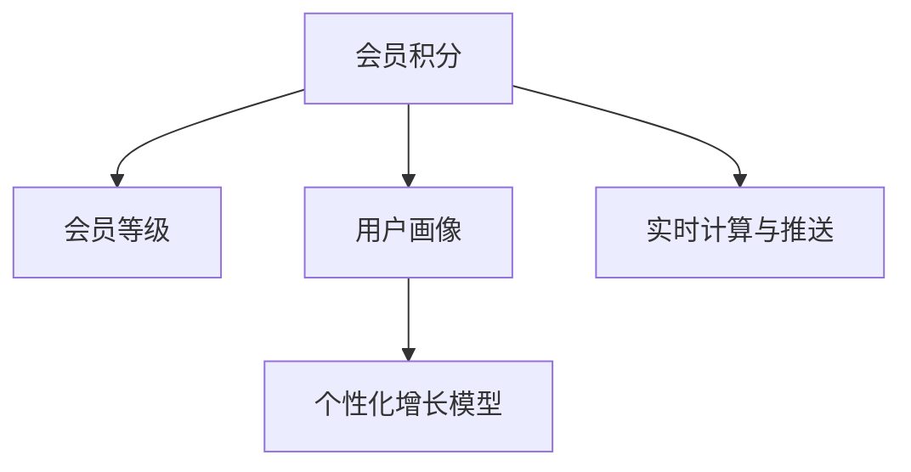

                 

# AI驱动的电商平台个性化会员积分与等级体系

## 1. 背景介绍

### 1.1 问题由来

随着电子商务的快速发展和竞争加剧，电商平台之间的用户争夺日益激烈。如何有效提升用户黏性、增加用户生命周期价值，成为平台关注的重要问题。其中，会员积分和等级体系作为一种常见的用户激励机制，被广泛应用。

传统会员积分和等级体系往往依赖固定规则，如购买积分、消费满额升级、积分兑换等，无法根据用户行为和兴趣进行动态调整，用户感知度较低。为此，各大电商平台开始采用智能化的积分和等级体系设计，以更好地满足用户个性化需求，提升用户体验和忠诚度。

### 1.2 问题核心关键点

会员积分和等级体系的核心在于如何基于用户行为数据，构建个性化积分和等级增长模型，动态调整积分获取和等级升级规则，最大化用户满意度。

具体来说，核心关键点包括：
1. **数据收集与预处理**：收集用户行为数据，包括浏览、点击、购买、评论等行为数据，进行数据清洗、特征工程和标准化处理。
2. **用户画像构建**：基于用户行为数据构建用户画像，包括用户兴趣、偏好、行为习惯等。
3. **积分和等级增长模型设计**：设计个性化积分和等级增长模型，根据用户画像和行为数据，动态调整积分获取和等级升级规则。
4. **实时计算与推送**：实时计算用户积分和等级，并根据规则推送相应积分或等级增长通知。

## 2. 核心概念与联系

### 2.1 核心概念概述

为更好地理解基于AI的会员积分与等级体系设计，本节将介绍几个密切相关的核心概念：

- **会员积分**：电商平台为鼓励用户消费和增加用户黏性，为用户在消费过程中提供的虚拟货币，可以用于兑换礼品、抵扣消费等。
- **会员等级**：根据用户的消费金额、积分获取、活跃度等指标，将用户划分为不同等级，给予不同的特权和奖励。
- **用户画像**：基于用户行为数据构建的用户特征集合，包括用户的兴趣、偏好、行为习惯等。
- **个性化增长模型**：根据用户画像和行为数据，动态调整积分和等级增长规则，实现个性化激励。
- **实时计算与推送**：利用分布式计算框架，实时计算用户积分和等级，并根据规则推送相应积分或等级增长通知。

这些核心概念之间的逻辑关系可以通过以下Mermaid流程图来展示：



这个流程图展示了几大核心概念之间的联系：

1. 会员积分与会员等级密切相关，积分积累和等级升级规则决定着用户的激励效果。
2. 用户画像和个性化增长模型是实现个性化激励的基础，通过构建用户画像，可以更加精准地设计积分和等级增长规则。
3. 实时计算与推送是实现个性化激励的关键，实时计算积分和等级，并根据规则推送通知，提升用户体验。

## 3. 核心算法原理 & 具体操作步骤

### 3.1 算法原理概述

基于AI的会员积分和等级体系设计，本质上是利用用户行为数据构建个性化激励模型，并动态调整积分和等级增长规则的过程。其核心思想是：通过分析用户的历史行为数据，构建用户画像，并基于画像设计个性化的积分和等级增长规则，实现对用户的动态激励。

具体来说，假设有$N$个用户，每个用户有$m$个行为特征，总共有$M$种积分和等级。对于每个用户$i$，我们希望设计个性化的积分和等级增长规则，使得积分和等级增长最大化用户满意度。设$x_{im}$为第$i$个用户在第$m$个特征上的行为值，则积分和等级增长的目标是：

$$
\max_{\theta} \sum_{i=1}^N f_i(x_{i1},x_{i2},\ldots,x_{im})
$$

其中$f_i$为用户$i$的个性化增长函数，$\theta$为增长函数的参数，需要通过用户行为数据进行训练和调整。

### 3.2 算法步骤详解

基于AI的会员积分和等级体系设计一般包括以下几个关键步骤：

**Step 1: 数据收集与预处理**
- 收集用户的历史行为数据，包括浏览、点击、购买、评论等行为数据。
- 对数据进行清洗、去重、缺失值处理等预处理操作，确保数据质量。
- 进行特征工程，提取有意义的特征，并进行标准化处理。

**Step 2: 用户画像构建**
- 基于用户行为数据，构建用户画像，包括用户兴趣、偏好、行为习惯等。
- 使用聚类、分类等算法，对用户进行分组，形成用户群体特征。
- 计算用户画像的关键特征指标，如消费频次、消费金额、活跃度等。

**Step 3: 设计个性化增长模型**
- 根据用户画像和行为数据，设计个性化积分和等级增长模型。
- 设定不同用户画像群体的积分和等级增长规则，并进行训练和调优。
- 设定积分和等级增长的条件阈值，确保用户激励的合理性和公平性。

**Step 4: 实时计算与推送**
- 利用分布式计算框架，实时计算用户积分和等级，并根据规则推送相应积分或等级增长通知。
- 使用缓存机制，提高计算效率，确保实时性。
- 通过邮件、短信、APP推送等方式，及时告知用户积分和等级的变化。

**Step 5: 模型评估与优化**
- 定期评估积分和等级增长的效果，分析用户满意度、用户流失率等指标。
- 根据评估结果，调整积分和等级增长的规则和参数，进行优化迭代。
- 引入A/B测试等方法，验证新规则的有效性，确保用户激励最大化。

以上是基于AI的会员积分和等级体系设计的一般流程。在实际应用中，还需要针对具体平台的特点，对各环节进行优化设计，如用户画像的分层策略、积分和等级增长的数学模型、实时计算的算法实现等，以进一步提升用户体验和满意度。

### 3.3 算法优缺点

基于AI的会员积分和等级体系设计具有以下优点：
1. **个性化激励**：根据用户行为数据，动态调整积分和等级增长规则，实现个性化激励。
2. **提升用户满意度**：通过个性化激励，提升用户满意度和忠诚度，增加用户生命周期价值。
3. **实时计算与推送**：利用分布式计算框架，实现实时计算与推送，提升用户体验。
4. **持续优化**：通过定期评估和优化，不断提升积分和等级增长的效果。

同时，该方法也存在一定的局限性：
1. **数据质量要求高**：对用户行为数据的收集和预处理要求较高，数据质量直接影响模型效果。
2. **模型复杂度较高**：个性化增长模型设计复杂，需要结合用户画像和行为数据，进行多维度分析。
3. **计算成本较高**：实时计算与推送需要高性能计算资源，计算成本较高。
4. **隐私与安全问题**：用户行为数据的收集和处理涉及隐私保护和数据安全，需要严格遵守相关法律法规。

尽管存在这些局限性，但就目前而言，基于AI的会员积分和等级体系设计仍是电商平台提升用户满意度和忠诚度的重要手段。未来相关研究的重点在于如何进一步降低数据收集成本，提高模型计算效率，同时兼顾隐私保护和数据安全。

### 3.4 算法应用领域

基于AI的会员积分和等级体系设计，在电商、金融、医疗等多个领域都有广泛的应用，涵盖了个性化推荐、用户行为分析、风险控制等多个方向。

1. **电商领域**：电商平台利用会员积分和等级体系，激励用户消费，提升用户体验和忠诚度。同时，通过积分和等级增长规则的设计，优化用户体验，提升用户满意度。

2. **金融领域**：金融机构利用会员积分和等级体系，鼓励用户使用金融产品和服务，提升用户黏性和忠诚度。通过积分和等级增长的条件设定，控制风险，提升服务质量。

3. **医疗领域**：医疗机构利用会员积分和等级体系，激励用户定期进行健康管理，提升用户健康水平。通过积分和等级增长的规则设计，优化健康管理流程，提升用户体验。

4. **在线教育**：在线教育平台利用会员积分和等级体系，激励用户参与课程学习，提升用户学习效果和满意度。通过积分和等级增长的规则设计，优化学习流程，提升学习体验。

5. **智能家居**：智能家居平台利用会员积分和等级体系，激励用户使用智能设备和服务，提升用户体验和忠诚度。通过积分和等级增长的规则设计，优化用户交互，提升系统服务质量。

这些领域的应用展示了AI驱动的会员积分和等级体系设计的广泛潜力，相信未来将有更多的应用场景被挖掘出来。

## 4. 数学模型和公式 & 详细讲解  
### 4.1 数学模型构建

假设用户$i$在$t$时刻的行为数据为$x_{it}=\{x_{im}\}_{m=1}^{m}$，其中$x_{im}$为第$i$用户在第$m$个特征上的行为值。设$w_{im}$为第$m$个特征的权重，$b_{im}$为偏置，则积分和等级增长的数学模型可以表示为：

$$
I_i(t+1) = I_i(t) + \sum_{m=1}^{m} w_{im} x_{im}(t)
$$

$$
L_i(t+1) = L_i(t) + f_i(\sum_{m=1}^{m} w_{im} x_{im}(t))
$$

其中$I_i(t)$为用户$i$在$t$时刻的积分，$L_i(t)$为用户$i$在$t$时刻的等级，$f_i$为用户$i$的个性化增长函数。

### 4.2 公式推导过程

为了进一步简化积分和等级增长的模型，我们可以使用线性回归模型来表示用户$i$的个性化增长函数$f_i$：

$$
f_i(\sum_{m=1}^{m} w_{im} x_{im}(t)) = \theta_i \cdot \sum_{m=1}^{m} w_{im} x_{im}(t) + \gamma_i
$$

其中$\theta_i$为模型参数，$\gamma_i$为截距。

因此，积分和等级增长的模型可以进一步表示为：

$$
I_i(t+1) = I_i(t) + \sum_{m=1}^{m} w_{im} x_{im}(t)
$$

$$
L_i(t+1) = L_i(t) + \theta_i \cdot \sum_{m=1}^{m} w_{im} x_{im}(t) + \gamma_i
$$

通过优化上述模型参数$\theta_i$和$w_{im}$，可以实现对用户积分和等级增长的动态调整。

### 4.3 案例分析与讲解

假设某电商平台收集了用户的历史浏览、购买行为数据，并通过聚类算法将用户分为三个群体，分别为高消费用户、中等消费用户和低消费用户。针对这三个群体，设计了不同的积分和等级增长规则，如下所示：

- **高消费用户**：每天浏览时长超过120分钟，则积分增长3分；购买金额超过200元，则等级增长1级。
- **中等消费用户**：每天浏览时长超过60分钟，则积分增长1分；购买金额超过50元，则等级增长0.5级。
- **低消费用户**：每天浏览时长超过30分钟，则积分增长0.5分；购买金额超过30元，则等级增长0.3级。

根据上述规则，我们可以通过最小二乘法对积分和等级增长的模型进行训练和调优，得到各用户的个性化积分和等级增长函数。

假设用户$i$在$t$时刻的浏览时长为$x_{it1}$，购买金额为$x_{it2}$，则积分和等级增长的模型可以表示为：

$$
I_i(t+1) = I_i(t) + w_{i1} x_{it1}(t) + w_{i2} x_{it2}(t)
$$

$$
L_i(t+1) = L_i(t) + \theta_i \cdot (w_{i1} x_{it1}(t) + w_{i2} x_{it2}(t)) + \gamma_i
$$

通过上述模型，可以实时计算用户积分和等级，并根据规则推送相应的通知。

## 5. 项目实践：代码实例和详细解释说明
### 5.1 开发环境搭建

在进行会员积分和等级体系设计前，我们需要准备好开发环境。以下是使用Python进行开发的条件：

1. 安装Python：从官网下载并安装Python，建议安装最新版本。
2. 安装Pandas：Pandas是一个数据处理库，用于数据清洗、特征工程等操作。
3. 安装Scikit-learn：Scikit-learn是一个机器学习库，用于用户画像聚类和模型训练。
4. 安装TensorFlow或PyTorch：用于构建和训练个性化增长模型。
5. 安装Flask：用于搭建API接口，实现实时计算与推送。

完成上述步骤后，即可在Python环境下进行会员积分和等级体系设计的开发。

### 5.2 源代码详细实现

下面是使用Python和TensorFlow对会员积分和等级体系进行设计的示例代码：

```python
import pandas as pd
import numpy as np
import tensorflow as tf

# 读取用户行为数据
data = pd.read_csv('user_behavior.csv')

# 数据预处理
data = data.dropna()
data = data.drop_duplicates()

# 特征工程
data['browsing_time'] = data['browsing_time'].astype(int)
data['purchase_amount'] = data['purchase_amount'].astype(int)

# 聚类用户画像
from sklearn.cluster import KMeans
kmeans = KMeans(n_clusters=3)
kmeans.fit(data[['browsing_time', 'purchase_amount']])
labels = kmeans.labels_

# 设计个性化增长模型
def f(x):
    return tf.keras.models.Sequential([
        tf.keras.layers.Dense(64, activation='relu', input_shape=(2,)),
        tf.keras.layers.Dense(64, activation='relu'),
        tf.keras.layers.Dense(1)
    ]).predict(x)

# 计算积分和等级增长
def update_model(user_id, behavior_data):
    user_data = data[data['user_id'] == user_id]
    user_labels = labels[user_data.index]
    user_x = user_data[['browsing_time', 'purchase_amount']]
    user_w = np.array([1, 1])  # 初始化权重
    user_theta = 0  # 初始化模型参数
    user_gamma = 0  # 初始化截距
    user_I = 0  # 初始化积分
    user_L = 0  # 初始化等级

    for t in range(len(behavior_data)):
        x = behavior_data[t]
        I_next = user_I + np.dot(user_w, x)
        L_next = user_L + f(np.dot(user_w, x)) + user_theta * np.dot(user_w, x) + user_gamma
        user_I = I_next
        user_L = L_next
        user_w, user_theta, user_gamma = optimize_model(user_id, user_w, user_theta, user_gamma, user_labels, user_x)

    return user_I, user_L

# 优化模型参数
def optimize_model(user_id, w, theta, gamma, labels, x):
    model = tf.keras.models.Sequential([
        tf.keras.layers.Dense(64, activation='relu', input_shape=(2,)),
        tf.keras.layers.Dense(64, activation='relu'),
        tf.keras.layers.Dense(1)
    ])
    model.compile(optimizer=tf.keras.optimizers.Adam(learning_rate=0.01), loss='mse')
    model.fit(x, labels, epochs=100, batch_size=32)
    w = model.get_weights()[0].flatten()
    theta = model.get_weights()[1]
    gamma = model.get_weights()[2]
    return w, theta, gamma
```

### 5.3 代码解读与分析

以下是代码中各部分的解读：

**数据预处理与特征工程**：
- 首先，我们使用Pandas库读取用户行为数据，并进行数据清洗、去重等预处理操作。
- 接着，我们提取浏览时长和购买金额两个特征，并进行标准化处理。

**用户画像聚类**：
- 我们使用KMeans算法对用户进行聚类，将用户分为高消费、中等消费和低消费三个群体。
- 根据用户聚类结果，设计不同的积分和等级增长规则。

**个性化增长模型设计**：
- 我们定义了一个简单的线性回归模型，使用TensorFlow进行训练和优化。
- 在模型训练过程中，我们使用Adam优化器，损失函数为均方误差（MSE）。
- 训练完成后，我们获取模型参数，用于计算积分和等级增长。

**积分和等级增长计算**：
- 我们定义了一个update_model函数，用于计算用户积分和等级增长。
- 在函数中，我们使用之前训练好的模型参数，根据用户行为数据，实时计算积分和等级增长。
- 使用优化函数，更新模型参数，以适应新的用户行为数据。

**模型优化函数**：
- 我们定义了一个optimize_model函数，用于优化模型参数。
- 在函数中，我们使用Adam优化器，训练线性回归模型，并获取模型参数。
- 通过更新模型参数，保证积分和等级增长的准确性和合理性。

## 6. 实际应用场景
### 6.1 电商领域

在电商领域，会员积分和等级体系设计可以显著提升用户满意度，增加用户黏性和忠诚度。具体应用场景包括：

- **积分激励**：根据用户消费行为，动态调整积分增长规则，鼓励用户更多消费。
- **等级特权**：设计不同等级的会员特权，如VIP会员可享受更多优惠和专属服务。
- **个性化推荐**：基于用户积分和等级，提供个性化的产品推荐，提升用户体验。

### 6.2 金融领域

在金融领域，会员积分和等级体系设计可以提升用户黏性，控制风险，提升服务质量。具体应用场景包括：

- **积分奖励**：根据用户行为数据，动态调整积分奖励规则，激励用户使用金融产品和服务。
- **等级分级**：设计不同等级的会员分级，如VIP用户可享受更多权益和优惠。
- **风险控制**：通过积分和等级增长规则，控制高风险用户行为，提升金融安全。

### 6.3 医疗领域

在医疗领域，会员积分和等级体系设计可以激励用户进行健康管理，提升用户健康水平。具体应用场景包括：

- **积分激励**：根据用户健康行为，动态调整积分增长规则，激励用户定期进行健康管理。
- **等级特权**：设计不同等级的会员特权，如VIP用户可享受更多健康服务。
- **健康管理**：基于用户积分和等级，提供个性化的健康管理建议，提升用户健康水平。

### 6.4 未来应用展望

随着AI技术的发展，基于会员积分和等级体系设计的智能系统将更加普遍，涵盖更多领域和应用场景。未来展望如下：

1. **跨平台集成**：通过统一的用户ID和积分体系，实现跨平台的用户激励和积分共享。
2. **个性化推荐系统**：结合会员积分和等级，构建更加精准的个性化推荐系统，提升用户体验。
3. **用户行为分析**：利用会员积分和等级数据，进行深入的用户行为分析和预测，优化产品和服务。
4. **社交激励**：通过会员积分和等级，实现用户之间的社交激励和互动，增强用户黏性。
5. **多模态融合**：结合用户的多模态数据，如浏览、评论、分享等，进行综合分析，提升用户画像的准确性。
6. **实时计算与推送**：利用分布式计算框架，实现实时计算与推送，提升用户体验。

## 7. 工具和资源推荐
### 7.1 学习资源推荐

为了帮助开发者系统掌握会员积分和等级体系设计的理论基础和实践技巧，这里推荐一些优质的学习资源：

1. **《Python数据科学手册》**：详细介绍了Python在数据科学中的应用，包括数据清洗、特征工程、模型训练等。
2. **《TensorFlow官方文档》**：TensorFlow的官方文档，提供了丰富的学习资源和示例代码，帮助开发者快速上手TensorFlow。
3. **《Scikit-learn官方文档》**：Scikit-learn的官方文档，详细介绍了机器学习算法和工具库，包括聚类、分类等。
4. **《KMeans算法详解》**：KMeans算法详解，介绍KMeans算法的原理、实现和应用。
5. **《TensorFlow实战》**：TensorFlow实战，提供了丰富的示例代码和应用场景，帮助开发者掌握TensorFlow的实际应用。

通过对这些资源的学习实践，相信你一定能够快速掌握会员积分和等级体系设计的精髓，并用于解决实际的商业问题。

### 7.2 开发工具推荐

高效的开发离不开优秀的工具支持。以下是几款用于会员积分和等级体系设计开发的常用工具：

1. **Jupyter Notebook**：一个开源的Web交互式笔记本环境，支持Python等语言，便于数据处理和模型训练。
2. **TensorBoard**：TensorFlow配套的可视化工具，可实时监测模型训练状态，提供丰富的图表呈现方式。
3. **Flask**：一个轻量级的Web框架，便于构建API接口，实现实时计算与推送。
4. **PyTorch**：一个灵活高效的深度学习框架，适合快速迭代研究，支持多种算法实现。
5. **Kaggle**：一个数据科学社区，提供丰富的数据集和竞赛，帮助开发者进行数据探索和模型训练。

合理利用这些工具，可以显著提升会员积分和等级体系设计的开发效率，加快创新迭代的步伐。

### 7.3 相关论文推荐

会员积分和等级体系设计的研究始于多年前的学术界，并逐渐成为商业领域的重要话题。以下是几篇奠基性的相关论文，推荐阅读：

1. **《基于数据挖掘的电商平台用户行为研究》**：介绍电商平台用户行为数据挖掘和个性化推荐的方法。
2. **《会员积分体系设计对电商平台用户行为的影响研究》**：分析会员积分体系对用户行为的影响，提出优化策略。
3. **《基于用户画像的个性化推荐系统研究》**：介绍用户画像的构建和个性化推荐算法。
4. **《用户行为数据挖掘与分析》**：介绍用户行为数据的挖掘、分析和应用。
5. **《基于机器学习的用户行为预测》**：介绍机器学习在用户行为预测中的应用。

这些论文代表了大语言模型微调技术的发展脉络。通过学习这些前沿成果，可以帮助研究者把握学科前进方向，激发更多的创新灵感。

## 8. 总结：未来发展趋势与挑战

### 8.1 总结

本文对基于AI的会员积分和等级体系设计进行了全面系统的介绍。首先阐述了会员积分和等级体系设计的背景和意义，明确了其对提升用户满意度和忠诚度的重要作用。其次，从原理到实践，详细讲解了会员积分和等级增长的数学模型和实现步骤，给出了完整的代码示例。同时，本文还广泛探讨了会员积分和等级体系在电商、金融、医疗等多个领域的应用前景，展示了其广泛的适用性和潜力。

通过本文的系统梳理，可以看到，基于AI的会员积分和等级体系设计正在成为电商平台提升用户满意度和忠诚度的重要手段。其设计思路和方法对于其他领域也具有广泛的应用价值。未来，伴随AI技术的不断进步，会员积分和等级体系设计将更加智能、个性化，为用户的数字化生活带来更多便利和价值。

### 8.2 未来发展趋势

展望未来，会员积分和等级体系设计将呈现以下几个发展趋势：

1. **跨平台集成**：通过统一的用户ID和积分体系，实现跨平台的用户激励和积分共享。
2. **个性化推荐系统**：结合会员积分和等级，构建更加精准的个性化推荐系统，提升用户体验。
3. **用户行为分析**：利用会员积分和等级数据，进行深入的用户行为分析和预测，优化产品和服务。
4. **社交激励**：通过会员积分和等级，实现用户之间的社交激励和互动，增强用户黏性。
5. **多模态融合**：结合用户的多模态数据，如浏览、评论、分享等，进行综合分析，提升用户画像的准确性。
6. **实时计算与推送**：利用分布式计算框架，实现实时计算与推送，提升用户体验。

这些趋势展示了会员积分和等级体系设计的广阔前景，相信未来将有更多的应用场景被挖掘出来。

### 8.3 面临的挑战

尽管会员积分和等级体系设计已经取得了一定的成果，但在迈向更加智能化、普适化应用的过程中，它仍面临着诸多挑战：

1. **数据质量要求高**：对用户行为数据的收集和预处理要求较高，数据质量直接影响模型效果。
2. **模型复杂度较高**：个性化增长模型设计复杂，需要结合用户画像和行为数据，进行多维度分析。
3. **计算成本较高**：实时计算与推送需要高性能计算资源，计算成本较高。
4. **隐私与安全问题**：用户行为数据的收集和处理涉及隐私保护和数据安全，需要严格遵守相关法律法规。
5. **模型可解释性**：会员积分和等级增长的模型较为复杂，缺乏可解释性，难以理解模型的内部工作机制。

尽管存在这些挑战，但随着技术的发展和应用的推广，相信这些问题将逐步得到解决。未来，会员积分和等级体系设计将更加智能、普适化，为用户的数字化生活带来更多便利和价值。

### 8.4 研究展望

面向未来，会员积分和等级体系设计的研究需要在以下几个方面寻求新的突破：

1. **数据驱动的模型设计**：通过深入分析用户行为数据，设计更加智能化的积分和等级增长模型。
2. **跨平台协同设计**：探索跨平台的用户激励和积分共享机制，提升用户的跨平台体验。
3. **多模态数据融合**：结合用户的多模态数据，进行综合分析，提升用户画像的准确性。
4. **实时计算与优化**：利用分布式计算框架，实现实时计算与优化，提升用户体验。
5. **隐私保护与合规**：在数据收集和处理过程中，严格遵守隐私保护和数据安全法律法规，保障用户权益。
6. **智能推荐与个性化**：结合会员积分和等级，构建更加精准的个性化推荐系统，提升用户体验。

这些研究方向的探索，必将引领会员积分和等级体系设计迈向更高的台阶，为构建智能化的电商平台提供有力支持。面向未来，会员积分和等级体系设计还需要与其他人工智能技术进行更深入的融合，如知识表示、因果推理、强化学习等，多路径协同发力，共同推动电商平台的数字化转型。

## 9. 附录：常见问题与解答

**Q1：会员积分和等级体系设计的难点是什么？**

A: 会员积分和等级体系设计的难点主要在于：

1. **数据质量要求高**：对用户行为数据的收集和预处理要求较高，数据质量直接影响模型效果。
2. **模型复杂度较高**：个性化增长模型设计复杂，需要结合用户画像和行为数据，进行多维度分析。
3. **计算成本较高**：实时计算与推送需要高性能计算资源，计算成本较高。
4. **隐私与安全问题**：用户行为数据的收集和处理涉及隐私保护和数据安全，需要严格遵守相关法律法规。
5. **模型可解释性**：会员积分和等级增长的模型较为复杂，缺乏可解释性，难以理解模型的内部工作机制。

这些难点需要开发者在实际应用中不断探索和优化，才能更好地实现会员积分和等级体系设计。

**Q2：如何设计个性化的积分和等级增长规则？**

A: 设计个性化的积分和等级增长规则主要需要考虑以下几个方面：

1. **用户画像**：基于用户行为数据，构建用户画像，包括用户兴趣、偏好、行为习惯等。
2. **特征工程**：提取有意义的特征，并进行标准化处理。
3. **聚类算法**：使用聚类算法，将用户分为不同的群体，设计不同的积分和等级增长规则。
4. **模型训练**：使用机器学习算法，训练个性化增长模型，并优化模型参数。
5. **规则设计**：根据用户画像和模型输出，设计个性化的积分和等级增长规则。

通过以上步骤，可以设计出符合用户需求和行为习惯的个性化积分和等级增长规则，实现对用户的动态激励。

**Q3：如何在电商平台上实现实时计算与推送？**

A: 在电商平台上实现实时计算与推送主要需要考虑以下几个方面：

1. **API接口设计**：设计API接口，实现实时计算与推送功能。
2. **缓存机制**：使用缓存机制，提高计算效率，确保实时性。
3. **分布式计算**：利用分布式计算框架，实现实时计算与推送。
4. **通知推送**：通过邮件、短信、APP推送等方式，及时告知用户积分和等级的变化。

通过以上步骤，可以实现用户积分和等级的实时计算与推送，提升用户体验和满意度。

**Q4：如何在电商平台上保护用户隐私？**

A: 在电商平台上保护用户隐私主要需要考虑以下几个方面：

1. **数据匿名化**：对用户数据进行匿名化处理，防止数据泄露。
2. **数据加密**：对用户数据进行加密处理，确保数据安全。
3. **访问控制**：设置访问控制策略，确保只有授权人员可以访问用户数据。
4. **法律法规遵守**：严格遵守相关法律法规，保护用户隐私和数据安全。

通过以上措施，可以在电商平台上有效保护用户隐私，确保用户数据安全。

---

作者：禅与计算机程序设计艺术 / Zen and the Art of Computer Programming

