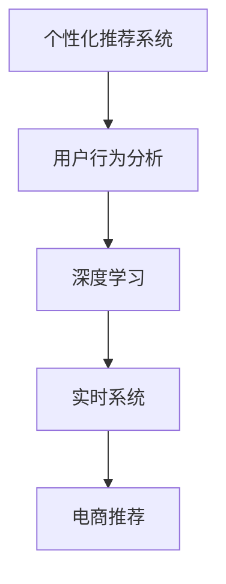

                 

# AI驱动的电商平台实时个性化推送

> 关键词：个性化推荐、用户行为分析、电商、机器学习、深度学习、实时系统

## 1. 背景介绍

随着电子商务的蓬勃发展，电商平台已逐渐成为人们日常购物的重要渠道。然而，如何在海量商品中精准匹配用户需求，是每一个电商平台必须面对的挑战。传统的推荐算法如协同过滤、内容推荐等，在处理大规模、高维度的用户行为数据时，往往难以避免过拟合、计算复杂度高、推荐效果不佳等问题。而基于AI的实时个性化推荐系统，通过深度学习模型和实时数据处理技术，可以显著提升电商平台的推荐效果，为用户提供更精准的购物体验。

本文聚焦于AI驱动的电商平台实时个性化推荐系统，从算法原理、实践技巧和应用前景三个方面，系统地介绍该系统如何通过深度学习技术，在电商平台上实现实时、高效的个性化推荐。

## 2. 核心概念与联系

### 2.1 核心概念概述

为更好地理解AI驱动的电商平台实时个性化推荐系统，本节将介绍几个关键核心概念：

- 个性化推荐系统：根据用户的历史行为和偏好，推荐可能感兴趣的物品，提升购物体验和满意度。
- 用户行为分析：通过分析用户在电商平台上的浏览、点击、购买等行为数据，理解用户的兴趣偏好，挖掘潜在购买意向。
- 深度学习：一种基于神经网络的机器学习技术，通过多层次的特征提取和融合，实现对复杂非线性数据的建模和预测。
- 实时系统：指能够在毫秒级别内快速响应用户请求，处理海量数据，并即时更新推荐结果的系统。
- 电商推荐：针对电商平台的特定需求，通过个性化推荐技术提升用户购物体验和销售转化率。

这些核心概念之间的逻辑关系可以通过以下Mermaid流程图来展示：



这个流程图展示了个性化推荐系统的工作原理和各个关键组件：

1. 用户行为分析：通过分析用户行为数据，理解用户兴趣。
2. 深度学习：利用神经网络模型提取高维数据的特征，捕捉用户偏好的复杂模式。
3. 实时系统：快速响应用户请求，处理实时数据，更新推荐结果。
4. 电商推荐：将个性化推荐应用于电商平台，提升用户满意度和销售转化率。

## 3. 核心算法原理 & 具体操作步骤

### 3.1 算法原理概述

AI驱动的电商平台实时个性化推荐系统，通过深度学习模型进行用户行为预测和物品匹配，实现个性化推荐。其核心思想是：将用户的历史行为数据作为输入，通过深度神经网络模型进行特征提取和转换，得到用户兴趣向量；同时，将物品的属性和特征进行编码，得到物品特征向量。在每个推荐时刻，将用户兴趣向量和物品特征向量进行匹配计算，得到物品的相关度评分，从而选择评分最高的物品进行推荐。

形式化地，假设用户的历史行为数据为 $X=\{x_1, x_2, \ldots, x_n\}$，其中 $x_i$ 为第 $i$ 次行为数据；物品的属性和特征为 $Y=\{y_1, y_2, \ldots, y_m\}$，其中 $y_i$ 为第 $i$ 个物品的特征向量。设用户兴趣向量为 $u \in \mathbb{R}^d$，物品特征向量为 $v \in \mathbb{R}^d$，其中 $d$ 为向量维度。推荐算法通过相似度度量函数 $f: \mathbb{R}^d \times \mathbb{R}^d \rightarrow \mathbb{R}$ 计算用户和物品的相关度，即：

$$
\text{score}(u,v) = f(u, v)
$$

最后根据分数从高到低选择推荐物品。

### 3.2 算法步骤详解

基于深度学习的电商平台实时个性化推荐系统的构建，一般包括以下几个关键步骤：

**Step 1: 数据收集与预处理**

1. 数据收集：从电商平台的日志系统中收集用户的历史行为数据，如浏览记录、点击行为、购买历史等。
2. 数据预处理：对原始数据进行清洗、去重、归一化等处理，确保数据的质量和一致性。

**Step 2: 特征工程**

1. 特征提取：从原始数据中提取关键特征，如用户浏览时长、点击位置、物品价格、类别等。
2. 特征编码：将提取的特征进行编码，转化为机器学习模型能够处理的数值类型。

**Step 3: 模型训练**

1. 选择合适的深度学习模型：如DNN、RNN、LSTM、CNN等，根据任务特点进行选择。
2. 划分训练集和测试集：将数据集分为训练集和测试集，一般采用交叉验证的方式进行模型训练。
3. 模型训练：使用训练集数据对模型进行训练，通过反向传播算法优化模型参数。
4. 模型评估：在测试集上对模型进行评估，选择最优的模型参数。

**Step 4: 实时推荐**

1. 数据流处理：构建实时数据流处理系统，如Apache Kafka、Apache Flink等，处理用户实时行为数据。
2. 模型推理：将实时数据流输入到训练好的深度学习模型中，进行实时预测和推理。
3. 推荐输出：根据模型的预测结果，实时生成个性化推荐列表，返回给用户。

**Step 5: 系统集成与优化**

1. 系统集成：将推荐系统集成到电商平台的推荐界面中，与购物车、订单系统等模块联动。
2. 系统优化：根据用户反馈和系统性能，不断优化推荐算法和模型参数，提升推荐效果。

### 3.3 算法优缺点

基于深度学习的电商平台实时个性化推荐系统，具有以下优点：

1. 高精度：深度学习模型能够自动提取高维数据中的复杂特征，提升推荐精度。
2. 高效性：实时数据流处理系统能够快速响应用户请求，实时更新推荐结果。
3. 自适应：深度学习模型可以动态调整推荐策略，适应用户行为的动态变化。
4. 多模态：结合用户行为数据和物品属性信息，实现多模态数据的融合，提升推荐效果。

同时，该算法也存在以下缺点：

1. 计算复杂度高：深度学习模型参数量大，计算复杂度高，需要高性能硬件支持。
2. 数据需求大：深度学习模型对数据质量要求高，需要大量标注数据进行训练和验证。
3. 模型泛化能力不足：深度学习模型容易过拟合，泛化能力有限，需要更多正则化技术。
4. 冷启动问题：对于新用户或新物品，模型缺乏足够数据，难以进行有效推荐。

尽管存在这些局限性，基于深度学习的实时个性化推荐系统仍是目前电商推荐的主流范式，尤其在数据丰富、计算资源充足的应用场景中，表现出色。未来相关研究的重点在于如何进一步降低计算复杂度，提高模型泛化能力，解决冷启动问题，提升推荐系统在更广泛场景下的应用效果。

### 3.4 算法应用领域

基于深度学习的实时个性化推荐系统，在电商领域已经得到了广泛的应用，具体包括：

- 商品推荐：根据用户历史行为和当前需求，推荐可能感兴趣的商品。
- 促销推荐：根据用户的消费行为和偏好，推荐相应的促销活动。
- 价格推荐：根据市场价格和用户购买记录，推荐最优价格区间。
- 库存推荐：根据用户需求和库存情况，推荐备货商品。
- 用户画像生成：通过用户行为数据分析，生成用户兴趣画像，用于个性化推荐和营销。

除了上述这些经典应用外，实时个性化推荐系统还被创新性地应用到更多场景中，如跨平台推荐、内容生成、智能客服等，为电商平台带来了全新的突破。

## 4. 数学模型和公式 & 详细讲解  
### 4.1 数学模型构建

本节将使用数学语言对基于深度学习的电商平台实时个性化推荐系统进行更加严格的刻画。

假设用户的历史行为数据为 $X=\{x_1, x_2, \ldots, x_n\}$，其中 $x_i \in \mathbb{R}^d$ 为第 $i$ 次行为数据的特征向量；物品的属性和特征为 $Y=\{y_1, y_2, \ldots, y_m\}$，其中 $y_i \in \mathbb{R}^d$ 为第 $i$ 个物品的特征向量。设用户兴趣向量为 $u \in \mathbb{R}^d$，物品特征向量为 $v \in \mathbb{R}^d$。

推荐算法通过相似度度量函数 $f: \mathbb{R}^d \times \mathbb{R}^d \rightarrow \mathbb{R}$ 计算用户和物品的相关度，即：

$$
\text{score}(u,v) = f(u, v)
$$

常见的相似度度量函数包括余弦相似度、欧式距离等。余弦相似度定义为：

$$
\text{cosine similarity}(u,v) = \frac{u \cdot v}{\|u\|\|v\|}
$$

其中 $\cdot$ 表示向量点乘，$\|u\|$ 和 $\|v\|$ 表示向量的范数。

### 4.2 公式推导过程

以下我们以余弦相似度为例，推导其计算公式和代码实现。

假设用户兴趣向量为 $u$，物品特征向量为 $v$，则余弦相似度的计算公式为：

$$
\text{cosine similarity}(u,v) = \frac{u \cdot v}{\|u\|\|v\|}
$$

使用Python和PyTorch进行余弦相似度的计算代码如下：

```python
import torch
import torch.nn as nn
from torch.nn import functional as F

# 定义模型参数
user_embedding = nn.Embedding(user_num, embedding_dim)
item_embedding = nn.Embedding(item_num, embedding_dim)
cosine_similarity = nn.CosineSimilarity(dim=1, eps=1e-8)

# 定义输入数据
user_input = torch.tensor([user_id], dtype=torch.long)
item_input = torch.tensor([item_id], dtype=torch.long)

# 将用户和物品的ID转换为向量
user_vector = user_embedding(user_input)
item_vector = item_embedding(item_input)

# 计算余弦相似度
similarity = cosine_similarity(user_vector, item_vector).item()
print(similarity)
```

其中，`nn.Embedding`表示词嵌入层，将用户和物品的ID转换为向量表示；`nn.CosineSimilarity`表示余弦相似度计算函数。通过以上代码，即可计算用户和物品之间的余弦相似度。

### 4.3 案例分析与讲解

为了更好地理解深度学习在电商平台推荐中的应用，以下我们通过一个具体案例进行分析讲解。

假设某电商平台收集了用户的历史浏览记录，包括浏览时间、浏览商品ID、点击位置等。通过特征提取和编码，可以得到每个用户的历史行为特征向量。同时，收集了商品的属性信息，如价格、类别、品牌等，通过特征提取和编码，可以得到每个商品的属性特征向量。

我们使用DNN模型对用户和商品进行特征提取和转换，得到用户兴趣向量和物品特征向量。通过余弦相似度计算用户和物品的相关度，得到推荐分数。将推荐分数从高到低排序，选择前N个物品作为推荐结果。

## 5. 项目实践：代码实例和详细解释说明
### 5.1 开发环境搭建

在进行实时个性化推荐系统开发前，我们需要准备好开发环境。以下是使用Python进行PyTorch开发的环境配置流程：

1. 安装Anaconda：从官网下载并安装Anaconda，用于创建独立的Python环境。

2. 创建并激活虚拟环境：
```bash
conda create -n pytorch-env python=3.8 
conda activate pytorch-env
```

3. 安装PyTorch：根据CUDA版本，从官网获取对应的安装命令。例如：
```bash
conda install pytorch torchvision torchaudio cudatoolkit=11.1 -c pytorch -c conda-forge
```

4. 安装TensorFlow：
```bash
pip install tensorflow
```

5. 安装各类工具包：
```bash
pip install numpy pandas scikit-learn matplotlib tqdm jupyter notebook ipython
```

完成上述步骤后，即可在`pytorch-env`环境中开始推荐系统开发。

### 5.2 源代码详细实现

下面我们以商品推荐为例，给出使用PyTorch对DNN模型进行商品推荐系统微调的PyTorch代码实现。

首先，定义DNN模型和优化器：

```python
import torch
import torch.nn as nn
from torch.optim import Adam

# 定义模型结构
class DNN(nn.Module):
    def __init__(self, input_dim, hidden_dim, output_dim):
        super(DNN, self).__init__()
        self.fc1 = nn.Linear(input_dim, hidden_dim)
        self.fc2 = nn.Linear(hidden_dim, hidden_dim)
        self.fc3 = nn.Linear(hidden_dim, output_dim)

    def forward(self, x):
        x = F.relu(self.fc1(x))
        x = F.relu(self.fc2(x))
        x = self.fc3(x)
        return x

# 定义优化器
optimizer = Adam(model.parameters(), lr=0.001)
```

然后，定义训练和评估函数：

```python
# 训练函数
def train(model, optimizer, train_loader, device, num_epochs):
    for epoch in range(num_epochs):
        model.train()
        for batch in train_loader:
            inputs, labels = batch
            inputs, labels = inputs.to(device), labels.to(device)
            optimizer.zero_grad()
            outputs = model(inputs)
            loss = F.cross_entropy(outputs, labels)
            loss.backward()
            optimizer.step()

# 评估函数
def evaluate(model, test_loader, device):
    model.eval()
    total_loss = 0
    correct = 0
    with torch.no_grad():
        for batch in test_loader:
            inputs, labels = batch
            inputs, labels = inputs.to(device), labels.to(device)
            outputs = model(inputs)
            _, predicted = torch.max(outputs.data, 1)
            total_loss += F.cross_entropy(outputs, labels, reduction='sum').item()
            correct += (predicted == labels).sum().item()
    return total_loss / len(test_loader), correct / len(test_loader.dataset)
```

接着，构建数据集和数据加载器：

```python
# 定义数据集
class RecommendationDataset(torch.utils.data.Dataset):
    def __init__(self, features, labels):
        self.features = features
        self.labels = labels

    def __len__(self):
        return len(self.features)

    def __getitem__(self, idx):
        features = self.features[idx]
        labels = self.labels[idx]
        return features, labels

# 划分训练集和测试集
features_train, labels_train = ...
features_test, labels_test = ...

train_dataset = RecommendationDataset(features_train, labels_train)
test_dataset = RecommendationDataset(features_test, labels_test)

# 定义数据加载器
train_loader = torch.utils.data.DataLoader(train_dataset, batch_size=32, shuffle=True)
test_loader = torch.utils.data.DataLoader(test_dataset, batch_size=32, shuffle=False)
```

最后，启动训练流程并在测试集上评估：

```python
# 定义模型
model = DNN(input_dim, hidden_dim, output_dim)

# 训练模型
train(model, optimizer, train_loader, device, num_epochs)

# 评估模型
loss, acc = evaluate(model, test_loader, device)
print('Test loss: {:.4f}, Accuracy: {:.2f}%'.format(loss, acc * 100))
```

以上就是使用PyTorch对DNN模型进行商品推荐系统微调的完整代码实现。可以看到，得益于PyTorch的强大封装，我们能够用相对简洁的代码完成深度学习模型的构建和微调。

### 5.3 代码解读与分析

让我们再详细解读一下关键代码的实现细节：

**DNN模型定义**：
- 使用`nn.Linear`定义全连接层，通过`relu`激活函数增加非线性关系。
- 设置合适的隐藏层和输出层维度，以满足推荐任务的需求。

**训练函数定义**：
- 使用`nn.CrossEntropyLoss`计算交叉熵损失，用于衡量模型预测和真实标签之间的差异。
- 使用`Adam`优化器更新模型参数。

**数据集定义**：
- 使用`RecommendationDataset`自定义数据集，将特征和标签封装成Tensor，并返回给模型。
- 使用`DataLoader`将数据集划分为训练集和测试集，供模型训练和评估使用。

**训练和评估流程**：
- 在每个epoch内，使用训练集数据进行前向传播和反向传播，更新模型参数。
- 在测试集上评估模型性能，打印出损失和准确率。

可以看到，PyTorch的Tensor和自动微分机制极大地简化了深度学习模型的构建和微调过程。开发者可以将更多精力放在模型设计、数据处理等高层逻辑上，而不必过多关注底层的实现细节。

## 6. 实际应用场景

### 6.1 智能客服系统

基于实时个性化推荐技术的智能客服系统，可以显著提升客服人员的工作效率和用户满意度。智能客服系统通过分析用户的咨询记录，理解用户的咨询意图，推荐相关FAQ或引导用户进入人工客服，减少客服人员的工作负担。

在技术实现上，可以收集历史客服记录和用户咨询问题，构建监督数据集，训练深度学习模型。模型能够自动学习用户的咨询偏好和常见问题，推荐最合适的FAQ或转接到人工客服。智能客服系统通过实时分析用户输入，动态调整推荐策略，提供更精准的咨询建议，提升用户满意度。

### 6.2 电商个性化推荐

实时个性化推荐技术在电商领域的应用非常广泛。通过分析用户的浏览、点击、购买记录，电商推荐系统能够为用户推荐最感兴趣的商品，提升用户的购买体验和转化率。

电商推荐系统通过深度学习模型捕捉用户兴趣和行为特征，结合物品属性信息，实现个性化推荐。推荐结果通过实时数据流处理系统，实时更新到推荐界面中，供用户选择。电商推荐系统能够动态调整推荐策略，适应用户行为的动态变化，提升推荐效果。

### 6.3 金融交易系统

金融交易系统需要对用户的交易行为进行实时分析，发现潜在的投资机会和风险。实时个性化推荐技术通过分析用户的交易记录和市场数据，为用户推荐最合适的投资组合或风险控制策略。

在金融交易系统中，推荐模型需要同时考虑市场趋势、用户偏好、风险承受能力等多方面因素，提供个性化的交易建议。推荐结果通过实时数据流处理系统，动态更新到交易界面中，供用户参考。金融交易系统能够动态调整推荐策略，应对市场变化和用户行为的变化。

### 6.4 未来应用展望

随着实时个性化推荐技术的不断发展，其应用场景将更加广泛，具体包括：

1. 内容推荐：针对视频、音乐、书籍等媒体内容，通过分析用户的观看、收听行为，推荐最相关的作品。
2. 新闻推荐：根据用户的阅读兴趣和行为，推荐最相关的热点新闻和深度报道。
3. 医疗推荐：分析患者的病历记录和行为数据，推荐最合适的治疗方案和健康建议。
4. 游戏推荐：分析玩家的偏好和游戏行为，推荐最合适的游戏和游戏内容。
5. 广告推荐：根据用户的浏览记录和行为，推荐最相关的广告内容，提升广告效果。

未来，实时个性化推荐技术将与更多领域进行融合，为不同行业带来全新的突破。

## 7. 工具和资源推荐

### 7.1 学习资源推荐

为了帮助开发者系统掌握深度学习技术的应用，这里推荐一些优质的学习资源：

1. 《深度学习》书籍：Ian Goodfellow、Yoshua Bengio、Aaron Courville著，系统讲解了深度学习的基本概念和前沿技术。
2. 《Python深度学习》书籍：Francois Chollet著，基于Keras框架详细介绍了深度学习模型的构建和优化。
3. 《机器学习实战》书籍：Peter Harrington著，通过实战项目演示了机器学习技术在电商推荐中的应用。
4. Coursera《深度学习专项课程》：由Andrew Ng等人授课，包含五门深度学习相关课程，涵盖从基础到高级的内容。
5. PyTorch官方文档：详细介绍了PyTorch框架的使用方法，包含丰富的教程和示例代码。

通过对这些资源的学习实践，相信你一定能够快速掌握深度学习技术，并将其应用于实际推荐系统开发。

### 7.2 开发工具推荐

高效的开发离不开优秀的工具支持。以下是几款用于深度学习推荐系统开发的常用工具：

1. PyTorch：基于Python的开源深度学习框架，灵活性强，支持动态图和静态图，适合研究型应用。
2. TensorFlow：由Google主导开发的开源深度学习框架，性能优异，支持分布式计算，适合工程型应用。
3. Keras：基于TensorFlow的高级深度学习API，使用方便，适合快速原型开发。
4. Jupyter Notebook：交互式编程环境，支持多种语言和库，适合快速原型开发和实验验证。
5. Apache Kafka：高性能消息队列系统，支持实时数据流处理，适合数据收集和处理。

合理利用这些工具，可以显著提升推荐系统开发的效率，加速创新迭代的步伐。

### 7.3 相关论文推荐

深度学习技术在推荐系统中的应用，已经得到了学界的广泛关注。以下是几篇奠基性的相关论文，推荐阅读：

1. Deep Collaborative Filtering (DCF)：利用深度神经网络对协同过滤模型进行改进，提升推荐效果。
2. Sequence-aware Recommender Networks (SAR-Net)：通过循环神经网络捕捉用户行为序列，提升推荐效果。
3. Neural Collaborative Filtering (NCF)：利用深度神经网络对协同过滤模型进行改进，提升推荐效果。
4. Multi-view Recommendation Deep Network (MR-DN)：通过多视图融合技术，提升推荐效果。
5. Hierarchical Attention Networks for Dimensionality Reduction (HAN-DR)：通过多层次注意力机制，提升推荐效果。

这些论文代表了大规模推荐系统的发展脉络。通过学习这些前沿成果，可以帮助研究者把握学科前进方向，激发更多的创新灵感。

## 8. 总结：未来发展趋势与挑战

### 8.1 研究成果总结

本文对基于深度学习的电商平台实时个性化推荐系统进行了全面系统的介绍。首先介绍了该系统在电商平台中的重要性和实现原理，其次详细讲解了深度学习模型构建和微调的具体步骤，最后探讨了推荐系统在电商、智能客服、金融交易等多个场景中的应用前景。

通过本文的系统梳理，可以看到，基于深度学习的实时个性化推荐技术在电商推荐领域已经取得了卓越的成效，显著提升了用户的购物体验和销售转化率。未来，随着深度学习模型和推荐算法的不断进步，推荐系统在更广泛的应用领域将发挥更大的作用，为用户的日常生活和商务活动带来便利和价值。

### 8.2 未来发展趋势

展望未来，实时个性化推荐技术将呈现以下几个发展趋势：

1. 模型规模持续增大。随着算力成本的下降和数据规模的扩张，深度学习模型的参数量还将持续增长。超大规模模型蕴含的丰富知识，有望支撑更加复杂多变的推荐任务。
2. 推荐算法多样化。未来将涌现更多高效的推荐算法，如基于深度学习的协同过滤、多模态推荐、图神经网络等，提升推荐系统的综合性能。
3. 实时系统优化。随着数据量的激增和计算需求的增加，实时数据流处理系统也将不断优化，支持更大的数据规模和更高的计算速度。
4. 联邦推荐兴起。为保护用户隐私，联邦推荐技术将逐步兴起，通过分布式训练和模型聚合，实现推荐模型的本地化处理。
5. 推荐系统全面化。未来的推荐系统将不仅仅关注商品推荐，还会拓展到服务推荐、内容推荐、活动推荐等多个方面，实现更全面的用户服务。

以上趋势凸显了实时个性化推荐技术的广阔前景。这些方向的探索发展，必将进一步提升推荐系统的性能和用户体验，为电商和其他行业带来更大的价值。

### 8.3 面临的挑战

尽管实时个性化推荐技术已经取得了显著成效，但在迈向更加智能化、普适化应用的过程中，仍面临诸多挑战：

1. 数据需求巨大。深度学习模型对数据量要求高，需要大量标注数据进行训练和验证。数据获取成本高，数据隐私保护也是一个重要问题。
2. 模型泛化能力不足。深度学习模型容易过拟合，泛化能力有限，需要更多正则化技术。
3. 计算资源需求高。深度学习模型参数量大，计算复杂度高，需要高性能硬件支持。
4. 冷启动问题。对于新用户或新物品，模型缺乏足够数据，难以进行有效推荐。
5. 实时性能问题。推荐系统需要快速响应用户请求，处理海量数据，实时更新推荐结果，对实时系统性能提出了高要求。

尽管存在这些挑战，实时个性化推荐技术仍将在电商和其他领域得到广泛应用，带来巨大的商业价值和社会效益。未来，需要通过技术创新和产业协同，不断突破这些挑战，推动推荐技术的发展。

### 8.4 研究展望

面对实时个性化推荐技术所面临的挑战，未来的研究需要在以下几个方面寻求新的突破：

1. 探索无监督和半监督推荐方法。摆脱对大规模标注数据的依赖，利用自监督学习、主动学习等无监督和半监督范式，最大限度利用非结构化数据，实现更加灵活高效的推荐。
2. 研究参数高效和计算高效的推荐算法。开发更加参数高效的推荐算法，在固定大部分模型参数的情况下，只更新极少量的推荐参数。同时优化推荐系统的计算图，减少前向传播和反向传播的资源消耗，实现更加轻量级、实时性的部署。
3. 融合因果分析和博弈论工具。将因果分析方法引入推荐模型，识别出推荐决策的关键特征，增强推荐结果的因果性和逻辑性。借助博弈论工具刻画人机交互过程，主动探索并规避推荐系统的脆弱点，提高系统稳定性。
4. 纳入伦理道德约束。在推荐模型训练目标中引入伦理导向的评估指标，过滤和惩罚有害的推荐结果，确保推荐内容的安全性和伦理道德性。
5. 结合知识图谱和逻辑规则。将符号化的知识图谱、逻辑规则等专家知识与推荐模型进行融合，引导推荐过程学习更全面、准确的信息整合能力。

这些研究方向的探索，必将引领实时个性化推荐技术迈向更高的台阶，为构建更加智能化、普适化的推荐系统铺平道路。面向未来，推荐技术还需要与其他人工智能技术进行更深入的融合，如知识表示、因果推理、强化学习等，多路径协同发力，共同推动自然语言理解和智能交互系统的进步。只有勇于创新、敢于突破，才能不断拓展推荐系统的边界，让智能技术更好地造福人类社会。

## 9. 附录：常见问题与解答

**Q1：深度学习模型在推荐系统中如何处理稀疏数据？**

A: 深度学习模型处理稀疏数据的方法主要包括：
1. 数据补全：对缺失值进行填补，如均值填补、随机填补、插值填补等。
2. 稀疏矩阵分解：将稀疏矩阵分解为低秩矩阵，减少计算复杂度。
3. 正则化技术：如L1正则、Dropout等，防止模型过拟合。

**Q2：推荐系统的实时性如何保证？**

A: 推荐系统的实时性可以通过以下方式保证：
1. 数据流处理系统：使用Apache Kafka、Apache Flink等实时数据流处理系统，处理海量数据。
2. 分布式计算：使用Spark、Hadoop等分布式计算框架，提升计算效率。
3. 模型优化：通过模型剪枝、量化加速等技术，减少模型复杂度和计算资源消耗。

**Q3：推荐系统如何避免过拟合？**

A: 推荐系统避免过拟合的方法主要包括：
1. 数据增强：通过数据扩充、对抗样本生成等技术，增加数据多样性。
2. 正则化技术：如L2正则、Dropout等，防止模型过拟合。
3. 模型集成：通过模型融合、Bagging等技术，提升模型的泛化能力。

**Q4：推荐系统如何处理多模态数据？**

A: 推荐系统处理多模态数据的方法主要包括：
1. 多视图融合：将不同模态的数据融合在一起，提高推荐效果。
2. 多模态学习：利用深度学习模型对不同模态的数据进行联合学习，提升模型的综合性能。
3. 跨模态匹配：通过多模态特征对齐技术，提升不同模态数据之间的相关性。

这些方法可以帮助推荐系统更好地处理多模态数据，提升推荐效果。

