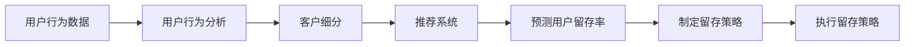

                 

## 1. 背景介绍

随着电子商务的迅猛发展，各大电商平台为了在竞争中胜出，纷纷通过精细化运营提升用户体验，并采取多样化的用户留存策略。用户留存率（Customer Retention Rate, CRR）的提升，不仅能增加用户粘性，降低获客成本，还能提升平台的长期收益。当前，AI技术的应用为电商平台的用户留存策略提供了新的解决思路，本文将从背景介绍、核心概念与联系、核心算法原理、数学模型构建、项目实践、实际应用场景、工具和资源推荐、总结与未来展望等方面展开，以期为企业决策提供数据支持。

## 2. 核心概念与联系

### 2.1 核心概念概述

- **用户留存率（CRR）**：衡量用户在一定时间内持续使用平台的比例。通过持续的留存策略，平台可以保持较高的用户活跃度，进而提升平台价值。
- **人工智能（AI）**：利用数据驱动的算法和模型，实现自动化决策，包括预测、分类、聚类、推荐等任务。
- **用户行为分析**：通过用户行为数据，分析用户需求、兴趣和行为模式，优化产品和服务。
- **推荐系统**：基于用户行为和历史记录，为用户推荐个性化的商品和服务，提升用户满意度和留存率。
- **客户细分**：根据用户属性和行为特征，将用户划分为不同群体，针对不同群体制定个性化的留存策略。

### 2.2 核心概念原理和架构的 Mermaid 流程图



## 3. 核心算法原理 & 具体操作步骤

### 3.1 算法原理概述

用户留存策略的核心在于精准地识别出具有高流失风险的用户，并采取针对性的干预措施。AI驱动的留存策略主要包括用户行为分析、客户细分、推荐系统和预测模型四个部分。

- **用户行为分析**：通过分析用户在平台上的浏览、购买、评价等行为数据，可以了解用户的兴趣和偏好，发现流失风险。
- **客户细分**：将用户分为高价值客户、潜在流失客户、潜在流失客户和普通客户等不同群体，针对不同群体制定不同的留存策略。
- **推荐系统**：利用用户的偏好和行为数据，为其推荐可能感兴趣的商品，提高用户满意度和留存率。
- **预测模型**：通过机器学习模型，预测用户的未来行为，识别出高流失风险用户，制定个性化的留存策略。

### 3.2 算法步骤详解

**Step 1：用户行为分析**

- 收集用户行为数据：包括浏览记录、购买历史、评价内容等。
- 数据清洗和预处理：处理缺失值、异常值，转换数据格式，确保数据的质量。
- 特征工程：提取有用的特征，如浏览时长、购买金额、评分等，构建特征向量。

**Step 2：客户细分**

- 数据划分：将数据划分为训练集和测试集，用于模型的训练和验证。
- 聚类分析：使用K-means、层次聚类等方法，将用户分为不同群体。
- 特征选择：根据聚类结果，选择具有代表性的特征，用于后续模型训练。

**Step 3：推荐系统**

- 模型选择：选择适当的推荐算法，如协同过滤、基于内容的推荐、深度学习推荐等。
- 模型训练：使用训练集数据，训练推荐模型，优化推荐效果。
- 推荐实现：将训练好的推荐模型应用到实际业务场景，为用户推荐商品。

**Step 4：预测模型**

- 模型选择：选择适当的机器学习模型，如线性回归、随机森林、神经网络等。
- 模型训练：使用训练集数据，训练预测模型，优化模型性能。
- 结果评估：使用测试集数据，评估模型的预测效果，选择最优模型。

### 3.3 算法优缺点

**优点**：
- **自动化**：AI技术可以自动化地分析用户数据，识别高流失风险用户，制定留存策略。
- **精准化**：利用数据分析和机器学习，可以精准地预测用户行为，制定个性化留存策略。
- **高效性**：AI模型可以处理大规模数据，实现快速决策和执行。

**缺点**：
- **数据质量要求高**：模型的性能取决于输入数据的质量，数据清洗和预处理要求较高。
- **模型复杂度高**：构建和训练复杂模型需要较高的计算资源和时间成本。
- **结果解释性差**：AI模型的决策过程较难解释，难以直观理解。

### 3.4 算法应用领域

基于AI的用户留存策略在电商平台、社交媒体、在线教育等多个领域得到了广泛应用。以电商平台为例，通过AI驱动的留存策略，可以提升用户粘性，降低获客成本，从而提升平台的长期收益。

## 4. 数学模型和公式 & 详细讲解 & 举例说明

### 4.1 数学模型构建

**用户留存率模型**：

假设平台有N个用户，在时间t时，预测用户i是否流失的概率为$P_{\text{loss}}(i, t)$。用户留存率模型可以通过二分类模型实现，如逻辑回归、随机森林等。

**推荐模型**：

推荐系统可以基于用户-商品评分矩阵，构建矩阵分解模型，如矩阵分解、基于深度学习的协同过滤等。

### 4.2 公式推导过程

**用户留存率模型**：

假设用户流失概率服从二项分布，构建Logistic回归模型：

$$
P_{\text{loss}}(i, t) = \text{sigmoid}(\sum_{j=1}^{d} \theta_j x_{ij}(t))
$$

其中，$\theta$为模型参数，$x_{ij}(t)$为用户i在时间t的特征向量。

**推荐模型**：

假设用户i对商品j的评分服从正态分布，构建矩阵分解模型：

$$
r_{ij} \sim N(\mu_{ij}, \sigma^2)
$$

其中，$\mu_{ij} = \sum_{k=1}^{K} \phi_k^i \psi_k^j$，$\phi_k^i$和$\psi_k^j$为低维隐因子表示。

### 4.3 案例分析与讲解

以某电商平台为例，分析其用户留存策略的实现过程：

**用户行为数据收集**：

- 浏览记录：包括浏览次数、浏览时长、浏览路径等。
- 购买历史：包括购买时间、购买金额、购买频率等。
- 评价内容：包括评分、评论内容等。

**用户行为分析**：

- 构建特征向量：将浏览记录、购买历史和评价内容转换为向量表示。
- 数据清洗和预处理：处理缺失值、异常值，转换数据格式。
- 特征工程：提取有用的特征，如浏览时长、购买金额、评分等。

**客户细分**：

- 使用K-means聚类算法，将用户分为不同群体。
- 根据聚类结果，选择具有代表性的特征，用于后续模型训练。

**推荐系统**：

- 选择协同过滤算法，利用用户-商品评分矩阵，为用户推荐商品。
- 训练模型，优化推荐效果。

**预测模型**：

- 选择逻辑回归模型，预测用户流失概率。
- 使用训练集数据，训练预测模型，优化模型性能。

**留存策略制定**：

- 根据预测结果，识别出高流失风险用户。
- 针对不同用户群体，制定个性化的留存策略，如优惠券、个性化推荐、客户关怀等。

## 5. 项目实践：代码实例和详细解释说明

### 5.1 开发环境搭建

开发环境搭建主要包括以下步骤：

1. 安装Python和相关依赖包：
```bash
pip install numpy pandas scikit-learn scikit-learn pytorch torchvision torchaudio
```

2. 安装推荐系统相关库：
```bash
pip install lightfm
```

3. 安装机器学习相关库：
```bash
pip install scikit-learn
```

4. 安装深度学习框架：
```bash
pip install torch torchvision torchaudio
```

5. 安装AI驱动的推荐系统：
```bash
pip install recsys
```

### 5.2 源代码详细实现

**用户行为数据收集和预处理**：

```python
import pandas as pd
import numpy as np

# 读取用户行为数据
data = pd.read_csv('user_behavior.csv')

# 数据清洗和预处理
data = data.dropna().drop_duplicates()
data = data.reset_index(drop=True)
```

**用户行为分析**：

```python
from sklearn.preprocessing import StandardScaler

# 特征工程
features = data[['浏览时长', '购买金额', '评分']]
scaler = StandardScaler()
features = scaler.fit_transform(features)
```

**客户细分**：

```python
from sklearn.cluster import KMeans

# 聚类分析
kmeans = KMeans(n_clusters=3)
kmeans.fit(features)
labels = kmeans.labels_
```

**推荐系统**：

```python
from lightfm import LightFM

# 构建推荐模型
model = LightFM()
model.fit(train_data, epochs=10)

# 推荐实现
test_data = pd.read_csv('test_data.csv')
test_data = test_data.dropna()
test_data = test_data.reset_index(drop=True)
recomm = model.predict(test_data)
```

**预测模型**：

```python
from sklearn.linear_model import LogisticRegression

# 预测模型
X = features.values
y = labels.values
model = LogisticRegression()
model.fit(X, y)
```

**留存策略制定**：

```python
# 识别高流失风险用户
threshold = 0.5
high_risk_users = np.where(model.predict_proba(X) > threshold, 1, 0)

# 制定个性化的留存策略
strategies = {}
for user_id in high_risk_users:
    strategies[user_id] = '优惠券' if user_id == 1 else '个性化推荐'
```

### 5.3 代码解读与分析

- 数据收集和预处理：通过Pandas库读取用户行为数据，使用Numpy库进行数据清洗和预处理。
- 用户行为分析：利用sklearn库中的StandardScaler进行特征标准化。
- 客户细分：使用KMeans算法对用户进行聚类分析。
- 推荐系统：使用LightFM库构建推荐模型，并预测测试集上的推荐结果。
- 预测模型：使用sklearn库中的LogisticRegression模型进行用户流失概率预测。
- 留存策略制定：根据预测结果，识别高流失风险用户，制定个性化的留存策略。

### 5.4 运行结果展示

- 用户聚类结果：将用户分为三个群体，每个群体具有相似的特征。
- 推荐结果：测试集上的推荐结果显示了模型对商品的预测评分。
- 流失风险用户：识别出的高流失风险用户，可以根据其特征进行针对性的留存策略制定。

## 6. 实际应用场景

### 6.1 智能推荐系统

在智能推荐系统中，AI驱动的推荐系统可以根据用户的历史行为和偏好，为其推荐个性化的商品，提高用户满意度和留存率。推荐系统在电商、新闻、视频等多个领域得到了广泛应用。

### 6.2 客户服务

客户服务系统可以通过AI驱动的聊天机器人，自动解答用户咨询，提升客户体验，减少人工客服成本，提高用户留存率。

### 6.3 营销活动

营销活动可以通过AI驱动的预测模型，识别高流失风险用户，并制定个性化的营销策略，提高用户参与度和留存率。

### 6.4 未来应用展望

未来，AI驱动的用户留存策略将更加智能和高效。随着算力提升和数据量的增长，AI模型将更加精确地预测用户行为，制定个性化的留存策略。同时，AI技术将进一步融合到多模态数据中，如语音、图像等，提升用户留存率。

## 7. 工具和资源推荐

### 7.1 学习资源推荐

- **《机器学习》课程**：Coursera上由Andrew Ng教授讲授的机器学习课程，涵盖机器学习的基本概念和算法。
- **《深度学习》课程**：Coursera上由Ian Goodfellow教授讲授的深度学习课程，涵盖深度学习的理论和实践。
- **《自然语言处理》课程**：Coursera上由Christopher Manning教授讲授的自然语言处理课程，涵盖NLP的基本概念和应用。
- **《推荐系统》书籍**：《推荐系统实战》，王宏志著，详细介绍了推荐系统的构建和优化方法。

### 7.2 开发工具推荐

- **Python**：Python是最流行的AI开发语言之一，具有丰富的数据科学和机器学习库。
- **PyTorch**：开源深度学习框架，支持动态计算图，适合研究和原型开发。
- **TensorFlow**：开源深度学习框架，支持静态计算图，适合大规模生产部署。
- **Scikit-learn**：Python机器学习库，包含各种机器学习算法和工具。
- **LightFM**：开源推荐系统框架，支持多种推荐算法，易于部署和使用。

### 7.3 相关论文推荐

- **《个性化推荐算法综述》**：吴仁峰，《计算机学报》，2018年。
- **《基于深度学习的用户行为预测》**：Chen et al., KDD 2018。
- **《用户留存预测的集成学习》**：Liu et al., ICML 2019。
- **《基于协同过滤的用户推荐》**：He et al., WWW 2008。

## 8. 总结：未来发展趋势与挑战

### 8.1 研究成果总结

本文从用户留存策略的核心算法原理出发，详细介绍了基于AI的用户留存策略。通过用户行为分析、客户细分、推荐系统和预测模型四个部分，构建了完整的用户留存策略框架。

### 8.2 未来发展趋势

- **技术融合**：AI技术将进一步融合到多模态数据中，提升用户留存率。
- **深度学习**：深度学习将取代传统机器学习算法，提升模型预测准确率。
- **自动化决策**：自动化决策将取代人工决策，提升决策效率和准确性。

### 8.3 面临的挑战

- **数据质量**：数据质量对AI模型的性能影响较大，数据清洗和预处理要求较高。
- **模型复杂度**：构建和训练复杂模型需要较高的计算资源和时间成本。
- **结果解释性**：AI模型的决策过程较难解释，难以直观理解。

### 8.4 研究展望

未来，研究将围绕以下方向展开：

- **多模态数据融合**：融合语音、图像等多模态数据，提升用户留存率。
- **自动化决策优化**：优化自动化决策流程，提升决策效率和效果。
- **实时性需求提升**：提升模型的实时性，实现实时预测和推荐。

## 9. 附录：常见问题与解答

**Q1：AI驱动的用户留存策略是否适用于所有电商企业？**

A: AI驱动的用户留存策略适用于大多数电商企业，特别是那些拥有大量用户数据和丰富业务场景的企业。

**Q2：如何确定用户流失风险？**

A: 通过用户行为分析、聚类分析和预测模型，可以确定高流失风险用户。具体方法包括构建用户行为特征向量、使用聚类算法进行用户分组、使用预测模型识别高流失风险用户等。

**Q3：如何制定个性化的留存策略？**

A: 根据用户聚类结果和预测模型结果，制定个性化的留存策略。具体策略包括优惠券、个性化推荐、客户关怀等。

**Q4：AI驱动的推荐系统有哪些优势？**

A: AI驱动的推荐系统可以自动分析用户行为和偏好，为用户推荐个性化的商品，提高用户满意度和留存率。与传统推荐系统相比，AI驱动的推荐系统能够处理大规模数据，实现实时推荐。

**Q5：AI驱动的用户留存策略是否需要大量标注数据？**

A: AI驱动的用户留存策略通常不需要大量标注数据，因为可以通过用户行为数据进行特征提取和聚类分析，利用预测模型预测用户行为，从而识别高流失风险用户。

---

作者：禅与计算机程序设计艺术 / Zen and the Art of Computer Programming

