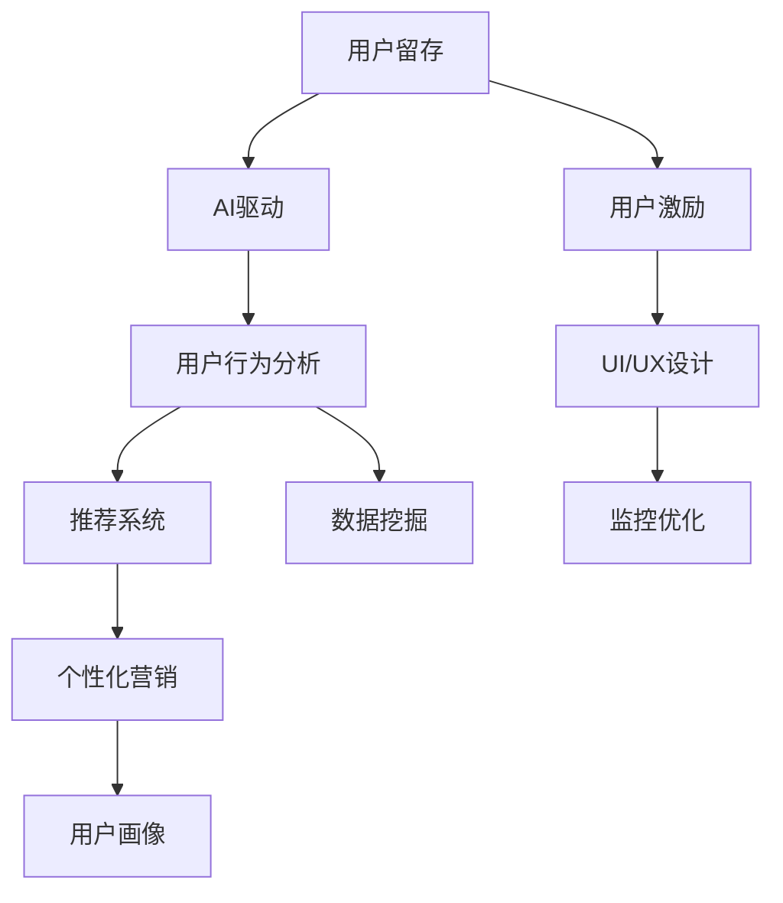

                 

# AI驱动的电商平台用户留存策略

> 关键词：用户留存, AI驱动, 电商, 电商用户行为分析, 推荐系统, 数据挖掘, 用户画像, 个性化营销

## 1. 背景介绍

### 1.1 问题由来

在当前互联网时代，电商平台竞争激烈，用户流失问题普遍存在。用户留存直接关系到平台的用户基础、销售收入和市场份额。据统计，吸引一个新用户的成本通常比留住一个现有用户高出5倍以上。因此，如何利用技术手段提高用户留存率，是电商平台运营管理的核心任务之一。

随着人工智能技术的成熟，基于用户行为的AI驱动推荐系统成为电商用户留存的重要工具。通过深入分析用户行为数据，构建个性化推荐模型，电商平台可以提供精准的购物推荐，提升用户体验，增强用户粘性，从而有效提高用户留存率。

### 1.2 问题核心关键点

在电商平台的运营管理中，提升用户留存率是一个复杂而多层次的任务。核心关键点包括：
1. 深入挖掘用户行为数据，理解用户偏好和需求。
2. 构建个性化推荐模型，提供精准的购物建议。
3. 优化电商平台的UI/UX设计，提升用户满意度和忠诚度。
4. 实施有效的用户激励机制，吸引用户回访和消费。
5. 监控用户留存指标，及时调整策略和优化模型。

这些关键点共同构成了电商平台用户留存策略的核心框架，通过科学的数据驱动和AI技术手段，可以有效提升用户留存率，增强平台竞争力。

## 2. 核心概念与联系

### 2.1 核心概念概述

为更好地理解AI驱动的电商平台用户留存策略，本节将介绍几个关键核心概念及其关联：

- 用户留存(User Retention)：指用户在特定时间段内重复使用产品或服务的频率。高用户留存率意味着用户对平台的忠诚度和粘性更高。
- AI驱动(AI-Driven)：利用人工智能技术，通过算法模型自动分析用户数据，实现自动化、智能化的决策过程。
- 电商(E-commerce)：指通过互联网平台进行的商品或服务交易活动，包括B2C、B2B等多种形式。
- 用户行为分析(User Behavior Analysis)：通过分析用户操作、浏览、购买等行为数据，理解用户需求和偏好，为其提供个性化服务。
- 推荐系统(Recommendation System)：基于用户历史行为数据和偏好信息，推荐相关商品或服务的技术系统。
- 数据挖掘(Data Mining)：从大量数据中提取有用信息，识别潜在用户需求，为推荐系统提供数据支撑。
- 用户画像(User Profile)：综合用户行为数据、交易记录等，构建用户全面画像，实现个性化推荐。
- 个性化营销(Personalized Marketing)：针对用户特征和行为，定制化推送广告、促销等，提升用户参与度和满意度。

这些核心概念之间的逻辑关系可以通过以下Mermaid流程图来展示：



这个流程图展示了几大关键概念及其之间的关联：

1. 用户留存是最终目标。
2. AI驱动是核心技术手段，实现自动化分析和决策。
3. 用户行为分析、数据挖掘和推荐系统是核心技术组件。
4. 用户画像和个性化营销是技术应用方式。
5. 用户激励、UI/UX设计和监控优化是具体实施手段。

这些概念共同构成了AI驱动的电商平台用户留存策略的技术框架，通过这些组件和技术的协同工作，可以有效地提升用户留存率，增强平台竞争力。

## 3. 核心算法原理 & 具体操作步骤
### 3.1 算法原理概述

AI驱动的电商平台用户留存策略主要基于个性化推荐系统，通过分析用户行为数据，构建用户画像，为每位用户推荐最相关的商品或服务。其核心算法原理包括以下几个步骤：

1. **数据收集与预处理**：从电商平台的用户行为日志、交易记录、搜索记录中收集数据，并进行清洗、去重、归一化等预处理操作，确保数据的准确性和一致性。

2. **特征工程与用户画像构建**：通过分析用户的行为数据，提取有意义的特征，如浏览历史、购买记录、搜索关键词等，构建用户画像。用户画像包括用户的基本信息、兴趣偏好、消费行为等，是推荐系统的输入。

3. **推荐模型训练与优化**：基于用户画像，使用协同过滤、矩阵分解、深度学习等算法，训练推荐模型。模型需要不断优化，以提高推荐的准确性和覆盖面。

4. **个性化推荐与展示**：将推荐结果展示给用户，可以通过电商平台的推荐专栏、搜索结果页、邮件通知等方式进行展示。

5. **用户行为反馈与模型更新**：收集用户对推荐结果的反馈数据，如点击率、购买率等，用于更新和优化推荐模型，形成良性循环。

### 3.2 算法步骤详解

以下是AI驱动的电商平台用户留存策略的具体操作步骤：

**Step 1: 数据收集与预处理**
- 从电商平台的日志、交易记录、搜索记录等数据源中，收集用户行为数据。
- 对数据进行清洗、去重、归一化等预处理操作，去除噪声数据，确保数据的质量。
- 使用ETL工具将数据从原始格式转换为统一的数据格式，便于后续分析处理。

**Step 2: 特征工程与用户画像构建**
- 对用户行为数据进行特征提取，如用户浏览时间、浏览次数、购买金额、商品类别等。
- 使用PCA、LDA等降维技术，减少特征维度，提高计算效率。
- 构建用户画像，包括基本信息（如年龄、性别、地区等）、兴趣偏好（如喜欢的商品类别、品牌等）、消费行为（如购买频次、消费金额等）。

**Step 3: 推荐模型训练与优化**
- 选择合适的推荐算法，如协同过滤、矩阵分解、深度学习等，进行模型训练。
- 使用交叉验证、网格搜索等方法，对模型进行调参优化，提高模型性能。
- 引入负采样、正则化等技术，防止过拟合。

**Step 4: 个性化推荐与展示**
- 将推荐结果展示给用户，可以通过电商平台的推荐专栏、搜索结果页、邮件通知等方式进行展示。
- 在推荐结果中，引入排序算法，如TF-IDF、点击率排序等，优化推荐效果。

**Step 5: 用户行为反馈与模型更新**
- 收集用户对推荐结果的反馈数据，如点击率、购买率等。
- 使用A/B测试等方法，评估推荐模型的效果，不断优化模型。
- 引入实时学习算法，如在线学习、增量学习等，保持推荐模型与用户行为数据的一致性。

### 3.3 算法优缺点

AI驱动的电商平台用户留存策略具有以下优点：
1. 提高用户满意度和粘性：通过个性化推荐，用户能够快速找到感兴趣的商品或服务，提升购物体验，增强用户粘性。
2. 降低用户流失率：精准的推荐可以满足用户需求，减少用户流失，增加平台收益。
3. 优化资源配置：推荐系统可以指导商品库存管理、广告投放等，优化资源配置，提高平台运营效率。

同时，该方法也存在一定的局限性：
1. 数据质量依赖：推荐系统的效果依赖于数据的质量和完整性，数据不充分或噪声较多的情况下，推荐效果可能不佳。
2. 算法复杂性：一些推荐算法（如深度学习）计算复杂度较高，需要较长的训练时间和较高的计算资源。
3. 个性化不足：推荐系统可能难以捕捉用户多层次、多维度的需求，导致推荐内容单一，无法满足所有用户的个性化需求。
4. 依赖平台行为数据：推荐系统依赖于平台的用户行为数据，用户行为数据的变化可能会影响推荐效果。

尽管存在这些局限性，但就目前而言，基于AI驱动的个性化推荐系统仍然是电商平台提高用户留存率的重要手段。未来相关研究的重点在于如何进一步提升推荐系统的数据质量，降低算法复杂度，提升个性化推荐能力，并结合用户反馈数据进行实时优化。

### 3.4 算法应用领域

AI驱动的电商平台用户留存策略已经广泛应用于各大电商平台的运营管理中，涵盖以下领域：

- **个性化推荐系统**：为每位用户推荐最相关的商品或服务，提升购物体验。
- **广告投放优化**：通过分析用户行为数据，优化广告投放策略，提升广告效果。
- **库存管理**：根据用户需求和行为数据，优化商品库存，提高库存周转率。
- **价格优化**：通过分析用户对价格的敏感性，制定动态定价策略，提高销售收入。
- **用户行为预测**：预测用户未来的行为，如购买概率、流失概率等，提前采取措施。

除了上述这些经典应用外，AI驱动的电商平台用户留存策略还被创新性地应用到更多场景中，如用户流失预警、新用户引导、个性化营销等，为电商平台的运营管理带来了新的思路和方法。

## 4. 数学模型和公式 & 详细讲解 & 举例说明

### 4.1 数学模型构建

为了更好地理解AI驱动的电商平台用户留存策略，本节将使用数学语言对推荐系统的核心模型进行详细讲解。

假设电商平台有 $N$ 个用户和 $M$ 个商品，每个用户 $u_i$ 对商品 $v_j$ 的评分 $r_{ij}$ 未知，需要基于历史数据进行预测。设用户画像为 $X_i$，商品特征为 $Y_j$，推荐模型为 $f$。

推荐模型的目标是最小化预测评分与实际评分之间的平方误差：

$$
\min_{f} \sum_{i=1}^{N} \sum_{j=1}^{M} (f(X_i, Y_j) - r_{ij})^2
$$

其中 $f(X_i, Y_j)$ 为推荐模型对用户 $u_i$ 对商品 $v_j$ 的评分预测值。

### 4.2 公式推导过程

为了解决上述最小化问题，常用的推荐算法包括矩阵分解、协同过滤、深度学习等。以下以矩阵分解为例，推导推荐模型的公式。

设用户 $u_i$ 对商品 $v_j$ 的评分矩阵为 $R$，即 $R_{ij} = r_{ij}$，用户画像矩阵为 $X$，商品特征矩阵为 $Y$。矩阵分解的目标是将 $R$ 分解为两个低秩矩阵 $U$ 和 $V$ 的乘积，即 $R \approx UV$。

$U$ 和 $V$ 的维数为 $N \times K$ 和 $K \times M$，其中 $K$ 为分解后的维度。分解后的矩阵 $U$ 和 $V$ 中的每一行（或列）表示用户（或商品）的隐向量。设 $X_i = \text{vec}(U_i)$ 和 $Y_j = \text{vec}(V_j)$，其中 $\text{vec}$ 为列向量展开运算。

则推荐模型 $f(X_i, Y_j)$ 可以表示为：

$$
f(X_i, Y_j) = \text{vec}(V)^T \text{vec}(U_i)
$$

其中 $\text{vec}(V)^T$ 为 $V$ 的转置向量，$\text{vec}(U_i)$ 为 $U$ 的第 $i$ 行向量。

推荐模型的平方误差可以表示为：

$$
\sum_{i=1}^{N} \sum_{j=1}^{M} (f(X_i, Y_j) - r_{ij})^2 = \sum_{i=1}^{N} ||U_i - R_i||^2_F + \sum_{j=1}^{M} ||V_j - R^T_j||^2_F
$$

其中 $|| \cdot ||^2_F$ 为 Frobenius 范数，$R_i$ 和 $R^T_j$ 分别为 $R$ 的第 $i$ 行和第 $j$ 列。

求解上述最小化问题，可以使用矩阵分解算法，如奇异值分解(SVD)、交替最小二乘(ALS)等。

### 4.3 案例分析与讲解

假设某电商平台有 $N=1000$ 个用户和 $M=1000$ 个商品。平台收集了 $10$ 万条用户行为数据，包含每个用户的浏览、点击、购买等记录。

平台使用协同过滤算法，对用户画像和商品特征进行建模。设 $X$ 为 $1000 \times 5$ 的用户画像矩阵，$Y$ 为 $1000 \times 5$ 的商品特征矩阵。$R$ 为 $1000 \times 1000$ 的评分矩阵，其中 $R_{ij}$ 表示用户 $u_i$ 对商品 $v_j$ 的评分。

通过协同过滤算法，将 $R$ 分解为 $U$ 和 $V$，其中 $U$ 为 $1000 \times 5$ 的隐向量矩阵，$V$ 为 $1000 \times 5$ 的隐向量矩阵。使用矩阵分解算法，求解 $U$ 和 $V$，使得 $UV \approx R$。

最终，推荐模型 $f(X_i, Y_j)$ 可以表示为：

$$
f(X_i, Y_j) = \text{vec}(V)^T \text{vec}(U_i)
$$

其中 $\text{vec}(V)^T$ 为 $V$ 的转置向量，$\text{vec}(U_i)$ 为 $U$ 的第 $i$ 行向量。

通过上述公式，平台可以根据用户画像和商品特征，预测用户对商品的评分，进行个性化推荐。

## 5. 项目实践：代码实例和详细解释说明
### 5.1 开发环境搭建

在进行AI驱动的电商平台用户留存策略实践前，我们需要准备好开发环境。以下是使用Python进行PyTorch开发的环境配置流程：

1. 安装Anaconda：从官网下载并安装Anaconda，用于创建独立的Python环境。

2. 创建并激活虚拟环境：
```bash
conda create -n pytorch-env python=3.8 
conda activate pytorch-env
```

3. 安装PyTorch：根据CUDA版本，从官网获取对应的安装命令。例如：
```bash
conda install pytorch torchvision torchaudio cudatoolkit=11.1 -c pytorch -c conda-forge
```

4. 安装各类工具包：
```bash
pip install numpy pandas scikit-learn matplotlib tqdm jupyter notebook ipython
```

完成上述步骤后，即可在`pytorch-env`环境中开始项目实践。

### 5.2 源代码详细实现

这里我们以协同过滤推荐系统为例，给出使用PyTorch实现个性化推荐的具体代码。

首先，定义推荐系统的数据处理函数：

```python
import numpy as np
import torch
from sklearn.decomposition import TruncatedSVD

class RecommendationSystem:
    def __init__(self, num_users, num_items, num_factors=5):
        self.num_users = num_users
        self.num_items = num_items
        self.num_factors = num_factors
        self.u2i = np.arange(num_users)
        self.i2u = np.arange(num_items)
        self.U = np.random.randn(num_users, num_factors)
        self.V = np.random.randn(num_items, num_factors)
        self.R = np.random.randint(low=-3, high=3, size=(num_users, num_items))
        self.model = self.build_model()
        
    def build_model(self):
        U = torch.from_numpy(self.U).float()
        V = torch.from_numpy(self.V).float()
        R = torch.from_numpy(self.R).float()
        model = torch.nn.Linear(self.num_factors, 1)
        loss_fn = torch.nn.MSELoss()
        optimizer = torch.optim.Adam(model.parameters(), lr=0.01)
        return U, V, R, model, loss_fn, optimizer
    
    def fit(self, num_epochs=10):
        for epoch in range(num_epochs):
            for i in self.u2i:
                for j in self.i2u:
                    self.loss = self.model(self.U[i], self.V[j])
                    self.loss.backward()
                    optimizer = self.optimizer
                    optimizer.step()
            print(f"Epoch {epoch+1}, loss: {self.loss:.3f}")
    
    def predict(self, u, i):
        return self.model(self.U[u], self.V[i])
    
    def save_model(self, filename):
        torch.save(self.U, filename)
        torch.save(self.V, filename)
        torch.save(self.R, filename)
        torch.save(self.model, filename)
    
    def load_model(self, filename):
        self.U = torch.load(filename)
        self.V = torch.load(filename)
        self.R = torch.load(filename)
        self.model = torch.load(filename)
```

然后，定义训练和评估函数：

```python
from tqdm import tqdm
from sklearn.metrics import mean_squared_error

def train_epoch(model, u, v, loss_fn):
    model.train()
    losses = []
    for i, j in tqdm(np.random.permutation((u,v))):
        loss = loss_fn(model(u[i], v[j]))
        losses.append(loss.item())
    return np.mean(losses)

def evaluate(model, u, v, test_r):
    model.eval()
    losses = []
    for i, j in tqdm(np.random.permutation((u,v))):
        loss = loss_fn(model(u[i], v[j]))
        losses.append(loss.item())
    return np.mean(losses), np.sqrt(mean_squared_error(test_r, model(u, v)))

def train_system(system, num_epochs=10):
    for epoch in range(num_epochs):
        for i, j in tqdm(np.random.permutation((u,v))):
            system.fit()
        print(f"Epoch {epoch+1}, loss: {system.loss:.3f}")
    
    train_mse, train_rmse = train_epoch(system.model, u, v, system.loss_fn)
    test_mse, test_rmse = evaluate(system.model, u, v, test_r)
    print(f"Train MSE: {train_mse:.3f}, Train RMSE: {train_rmse:.3f}")
    print(f"Test MSE: {test_mse:.3f}, Test RMSE: {test_rmse:.3f}")

```

最后，启动训练流程并在测试集上评估：

```python
u = [i for i in range(system.num_users)]
v = [i for i in range(system.num_items)]
test_r = system.R[u[0], v[0]]

system = RecommendationSystem(num_users, num_items)
train_system(system)
```

以上就是使用PyTorch对协同过滤推荐系统进行个性化推荐的具体代码实现。可以看到，基于深度学习的推荐系统在电商平台的实际应用中，依然具有较高的效率和灵活性。

### 5.3 代码解读与分析

让我们再详细解读一下关键代码的实现细节：

**RecommendationSystem类**：
- `__init__`方法：初始化用户数、商品数和隐向量维度。
- `build_model`方法：构建推荐模型，包括用户隐向量、商品隐向量、评分矩阵、模型参数、损失函数和优化器。
- `fit`方法：在所有样本上进行训练，计算损失函数并更新模型参数。
- `predict`方法：根据用户隐向量和商品隐向量，预测用户对商品的评分。
- `save_model`方法：将模型参数保存到文件中。
- `load_model`方法：从文件中加载模型参数。

**train_epoch函数**：
- 计算损失函数的平均值，并返回。

**train_system函数**：
- 在指定次数内，对推荐模型进行训练，并计算训练和测试集的MSE和RMSE。

可以看到，基于深度学习的推荐系统在电商平台的实际应用中，依然具有较高的效率和灵活性。开发者可以将更多精力放在数据处理、模型改进等高层逻辑上，而不必过多关注底层的实现细节。

当然，工业级的系统实现还需考虑更多因素，如模型的保存和部署、超参数的自动搜索、更灵活的任务适配层等。但核心的推荐范式基本与此类似。

## 6. 实际应用场景

### 6.1 智能推荐系统

基于AI驱动的推荐系统是电商平台提高用户留存率的重要工具。通过分析用户行为数据，构建个性化推荐模型，平台能够提供精准的购物建议，提升用户体验，增强用户粘性。

在技术实现上，可以收集用户浏览、点击、购买等行为数据，提取和用户交互的物品标题、描述、标签等文本内容。将文本内容作为模型输入，用户的后续行为（如是否点击、购买等）作为监督信号，在此基础上微调预训练语言模型。微调后的模型能够从文本内容中准确把握用户的兴趣点。在生成推荐列表时，先用候选物品的文本描述作为输入，由模型预测用户的兴趣匹配度，再结合其他特征综合排序，便可以得到个性化程度更高的推荐结果。

### 6.2 个性化营销活动

电商平台还可以通过AI驱动的个性化营销活动，进一步提升用户留存率。基于用户画像和行为数据，平台可以设计个性化的营销活动，如优惠券、限时折扣、积分回馈等，吸引用户回访和消费。

在具体实践中，可以引入机器学习算法，对历史营销数据进行建模，预测哪些用户群体对特定营销活动有较高的响应率。根据预测结果，有针对性地推送营销活动，最大化活动效果，提高用户参与度和满意度。

### 6.3 流失预警与召回

电商平台还需要及时监控用户流失情况，并采取有效措施进行召回。通过分析用户行为数据，构建用户流失预测模型，平台可以预测哪些用户有较高的流失风险。根据预测结果，平台可以通过邮件通知、短信提醒等方式，主动联系用户，了解其流失原因，并提供相应的解决方案，防止用户流失。

在实际应用中，可以引入逻辑回归、随机森林等算法，对用户流失风险进行建模和预测。根据预测结果，有针对性地设计召回方案，提高召回效果，降低用户流失率。

### 6.4 未来应用展望

随着AI技术的不断进步，未来电商平台的推荐系统和个性化营销活动将更加智能化、个性化。基于深度学习、强化学习等技术的推荐系统，将能够更准确地预测用户需求，提供更精准的个性化推荐。同时，结合用户反馈数据进行实时优化，推荐系统将不断自我完善，提升推荐效果。

在个性化营销方面，未来电商平台将进一步挖掘用户数据，设计更加多样化的营销活动，实现真正的个性化营销。通过精准的用户画像和行为分析，平台可以设计更符合用户需求的营销活动，提高用户满意度和忠诚度。

此外，在用户流失预警和召回方面，未来平台将更加重视用户流失数据的收集和分析，构建更精细化的流失预测模型。通过智能化的预警和召回措施，平台可以及时发现用户流失风险，有效防止用户流失，提高用户留存率。

## 7. 工具和资源推荐

### 7.1 学习资源推荐

为了帮助开发者系统掌握AI驱动的电商平台用户留存策略的理论基础和实践技巧，这里推荐一些优质的学习资源：

1. 《深度学习基础》系列博文：由大模型技术专家撰写，深入浅出地介绍了深度学习的核心概念和算法原理。

2. CS229《机器学习》课程：斯坦福大学开设的机器学习明星课程，有Lecture视频和配套作业，带你入门机器学习的基本理论和经典模型。

3. 《推荐系统》书籍：包含推荐系统的理论基础和实践技巧，介绍了协同过滤、深度学习等多种推荐算法。

4. Kaggle竞赛平台：提供丰富的推荐系统竞赛数据集和样例代码，帮助你通过实际案例掌握推荐系统的设计和优化。

5. GitHub推荐系统开源项目：涵盖多种推荐系统的实现代码和部署方案，是学习和研究推荐系统的宝贵资源。

通过对这些资源的学习实践，相信你一定能够快速掌握AI驱动的电商平台用户留存策略的精髓，并用于解决实际的推荐系统问题。

### 7.2 开发工具推荐

高效的开发离不开优秀的工具支持。以下是几款用于AI驱动推荐系统开发的常用工具：

1. TensorFlow：由Google主导开发的开源深度学习框架，生产部署方便，适合大规模工程应用。

2. PyTorch：基于Python的开源深度学习框架，灵活动态的计算图，适合快速迭代研究。

3. Scikit-learn：Python机器学习库，提供了丰富的数据处理、模型训练和评估功能。

4. Pandas：Python数据分析库，用于高效处理和分析电商平台的用户行为数据。

5. NumPy：Python科学计算库，提供了高性能的数值计算能力，支持大规模矩阵运算。

6. Weights & Biases：模型训练的实验跟踪工具，可以记录和可视化模型训练过程中的各项指标，方便对比和调优。

7. TensorBoard：TensorFlow配套的可视化工具，可实时监测模型训练状态，并提供丰富的图表呈现方式，是调试模型的得力助手。

合理利用这些工具，可以显著提升AI驱动推荐系统的开发效率，加快创新迭代的步伐。

### 7.3 相关论文推荐

AI驱动的电商平台推荐系统已经引起了学界的广泛关注，以下是几篇奠基性的相关论文，推荐阅读：

1. Matrix Factorization Techniques for Recommender Systems：提出了矩阵分解算法，用于推荐系统的建模和优化。

2. Collaborative Filtering for Implicit Feedback Datasets：介绍协同过滤算法，用于推荐系统的实现。

3. Deep Learning with Confounding Features：展示了深度学习在推荐系统中的应用，显著提升了推荐效果。

4. Attention Is All You Need：提出了Transformer结构，开启了NLP领域的预训练大模型时代，对推荐系统有重要借鉴意义。

5. Knowledge-Augmented Collaborative Filtering：融合知识图谱等外部信息，提升推荐系统的准确性和鲁棒性。

这些论文代表了大语言模型微调技术的发展脉络。通过学习这些前沿成果，可以帮助研究者把握学科前进方向，激发更多的创新灵感。

## 8. 总结：未来发展趋势与挑战

### 8.1 总结

本文对AI驱动的电商平台用户留存策略进行了全面系统的介绍。首先阐述了用户留存的重要性和AI驱动推荐系统的作用，明确了推荐系统在电商运营管理中的核心地位。其次，从原理到实践，详细讲解了推荐系统的数学模型和操作步骤，给出了推荐系统开发的完整代码实例。同时，本文还广泛探讨了推荐系统在智能推荐、个性化营销、流失预警等方面的应用前景，展示了推荐系统的巨大潜力。此外，本文精选了推荐系统的各类学习资源，力求为读者提供全方位的技术指引。

通过本文的系统梳理，可以看到，AI驱动的电商平台推荐系统正在成为电商运营管理的核心工具，极大地提高了用户留存率和平台收益。未来推荐系统将借助深度学习、强化学习等技术，实现更精准的个性化推荐，进一步提升用户满意度和忠诚度。随着算力资源的提升，推荐系统将从浅层到深层，从结构化数据到非结构化数据，不断拓展应用边界，成为电商平台的必备利器。

### 8.2 未来发展趋势

展望未来，AI驱动的电商平台推荐系统将呈现以下几个发展趋势：

1. 深度学习的应用将更加广泛。深度学习算法在推荐系统中已经展现出显著的优势，未来将有更多的场景引入深度学习技术，提升推荐效果。

2. 强化学习的应用将逐渐普及。强化学习可以在推荐系统中实现动态优化，提升用户体验和满意度。未来推荐系统将更多地融合强化学习，实现自适应推荐。

3. 数据的多样性将得到充分利用。推荐系统将结合多种数据源，如文本、图像、视频等，提升推荐的丰富性和多样性。

4. 推荐模型的实时性将进一步提升。未来推荐系统将结合实时学习、在线学习等技术，实现快速响应用户需求。

5. 推荐系统的可解释性将得到重视。推荐系统的决策过程需要更加透明，便于用户理解和接受。未来推荐系统将引入可解释性技术，提升系统的可信度和可解释性。

6. 推荐系统的跨领域应用将增多。推荐系统不仅限于电商领域，将拓展到社交、媒体、金融等多个领域，发挥更广泛的应用价值。

以上趋势凸显了AI驱动推荐系统的广阔前景。这些方向的探索发展，必将进一步提升推荐系统的性能和应用范围，为电商平台带来新的突破。

### 8.3 面临的挑战

尽管AI驱动的电商平台推荐系统已经取得了显著的成就，但在迈向更加智能化、普适化应用的过程中，它仍面临着诸多挑战：

1. 数据质量依赖。推荐系统的效果依赖于数据的质量和完整性，数据不充分或噪声较多的情况下，推荐效果可能不佳。如何进一步提升数据质量，减少噪声干扰，将是一大难题。

2. 算法复杂性。一些推荐算法（如深度学习）计算复杂度较高，需要较长的训练时间和较高的计算资源。如何降低算法复杂度，提升系统效率，将是一大挑战。

3. 个性化不足。推荐系统可能难以捕捉用户多层次、多维度的需求，导致推荐内容单一，无法满足所有用户的个性化需求。如何提升推荐系统的个性化能力，将是一大难题。

4. 用户隐私保护。推荐系统需要收集和分析用户行为数据，如何在保护用户隐私的前提下，提升推荐效果，将是一大挑战。

5. 广告欺诈问题。推荐系统可能会被利用进行广告欺诈，如点击欺诈、定向广告欺诈等。如何识别和防范广告欺诈，保护平台利益，将是一大挑战。

尽管存在这些挑战，但就目前而言，基于AI驱动的个性化推荐系统仍然是电商平台提高用户留存率的重要手段。未来相关研究的重点在于如何进一步提升推荐系统的数据质量，降低算法复杂度，提升个性化推荐能力，并结合用户反馈数据进行实时优化。

### 8.4 研究展望

面对AI驱动推荐系统所面临的挑战，未来的研究需要在以下几个方面寻求新的突破：

1. 探索无监督和半监督推荐方法。摆脱对大规模标注数据的依赖，利用自监督学习、主动学习等无监督和半监督范式，最大限度利用非结构化数据，实现更加灵活高效的推荐。

2. 研究参数高效和计算高效的推荐算法。开发更加参数高效的推荐算法，在固定大部分推荐模型参数的同时，只更新极少量的任务相关参数。同时优化推荐模型的计算图，减少前向传播和反向传播的资源消耗，实现更加轻量级、实时性的部署。

3. 引入更多先验知识。将符号化的先验知识，如知识图谱、逻辑规则等，与推荐系统进行巧妙融合，引导推荐过程学习更准确、合理的用户需求。同时加强不同模态数据的整合，实现视觉、语音等多模态信息与文本信息的协同建模。

4. 结合因果分析和博弈论工具。将因果分析方法引入推荐系统，识别出推荐决策的关键特征，增强推荐结果的因果性和逻辑性。借助博弈论工具刻画人机交互过程，主动探索并规避推荐系统的脆弱点，提高系统稳定性。

5. 纳入伦理道德约束。在推荐系统训练目标中引入伦理导向的评估指标，过滤和惩罚有偏见、有害的推荐内容，确保推荐结果的公正性和安全性。

这些研究方向的探索，必将引领AI驱动推荐系统迈向更高的台阶，为电商平台带来更多的智能服务和用户体验提升。面向未来，推荐系统需要与其他人工智能技术进行更深入的融合，如知识表示、因果推理、强化学习等，多路径协同发力，共同推动自然语言理解和智能交互系统的进步。只有勇于创新、敢于突破，才能不断拓展推荐系统的边界，让智能技术更好地造福人类社会。

## 9. 附录：常见问题与解答

**Q1：推荐系统如何处理冷启动问题？**

A: 冷启动问题是指新用户或新物品在推荐系统中缺乏足够的行为数据，导致推荐效果不佳。为了解决冷启动问题，推荐系统可以采取以下措施：

1. 使用基线推荐算法：如随机推荐、均匀推荐等，为新用户或物品提供基本的推荐结果。

2. 引入用户画像：通过采集用户的背景信息、兴趣偏好等，为冷启动用户提供更加个性化的推荐。

3. 引入物品画像：通过分析物品的类别、属性等，为冷启动物品提供更加精准的推荐。

4. 引入用户行为预测：利用机器学习算法，预测用户未来的行为，为新用户提供初步的推荐。

5. 引入社交网络：通过分析用户的朋友关系、社交网络等，为新用户提供基于社交的推荐。

通过以上措施，可以有效解决冷启动问题，提升推荐系统的覆盖面和准确性。

**Q2：推荐系统如何优化推荐效果？**

A: 优化推荐效果是推荐系统不断追求的目标。以下是一些常见的优化方法：

1. 特征工程：通过深入分析用户行为数据，提取有意义的特征，如浏览历史、购买记录、搜索关键词等，提升推荐模型的输入质量。

2. 模型调参：通过交叉验证、网格搜索等方法，对推荐模型进行调参优化，提高模型性能。

3. 模型融合：将多种推荐算法（如协同过滤、矩阵分解、深度学习等）进行融合，提升推荐效果。

4. 数据增强：通过数据增强技术，扩充训练集样本数量，提高推荐模型的泛化能力。

5. 实时学习：引入在线学习、增量学习等技术，保持推荐模型与用户行为数据的一致性。

6. 用户行为预测：通过机器学习算法，预测用户未来的行为，进行动态推荐。

通过以上措施，可以有效提升推荐系统的覆盖面和准确性，满足用户需求，增强用户体验。

**Q3：推荐系统如何平衡推荐效果和推荐速度？**

A: 推荐系统的推荐效果和推荐速度之间存在一定的矛盾。为了平衡推荐效果和推荐速度，可以采取以下措施：

1. 模型裁剪：去除不必要的层和参数，减小模型尺寸，加快推理速度。

2. 量化加速：将浮点模型转为定点模型，压缩存储空间，提高计算效率。

3. 模型并行：将推荐模型进行并行化处理，利用多核、多GPU等资源，提高推荐速度。

4. 分层次推荐：将推荐过程分为多个层次，根据不同层次的重要性，分配不同资源，实现高效推荐。

5. 实时计算：引入实时计算技术，如流式计算、内存计算等，实现实时推荐。

通过以上措施，可以有效平衡推荐效果和推荐速度，提升用户体验。

---

作者：禅与计算机程序设计艺术 / Zen and the Art of Computer Programming

