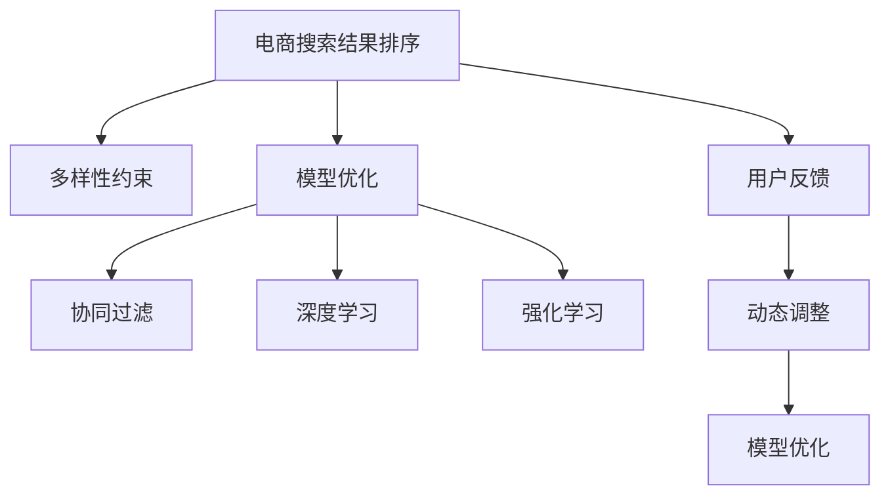

                 

# AI驱动的电商搜索结果多样性优化

## 1. 背景介绍

在电商领域，搜索结果的多样性是用户体验的关键因素之一。用户希望通过搜索功能快速找到需要的产品，并希望看到不同角度的相似产品，以辅助决策。然而，传统的搜索结果排序算法往往侧重于展示相关性最高的产品，导致搜索结果多样性不足。为了提高电商平台的用户体验和交易转化率，许多电商平台开始采用AI驱动的算法优化搜索结果，引入多样性因素，提升搜索结果的丰富性和覆盖率。

### 1.1 问题由来

电商平台的搜索结果排序算法，最早是基于关键词匹配和点击率排序的简单模型。但这种模型忽略了搜索结果的多样性需求，常导致展示的搜索结果过于单一。随着电商数据量的增加和算法的不断演进，一些电商平台开始引入基于机器学习的排序模型，如基于协同过滤的推荐系统、基于深度学习的排名算法等。这些模型在提升相关性排序的同时，也开始考虑搜索结果的多样性问题。但目前，多数算法仍然偏重于相关性排序，对多样性的关注不足。

### 1.2 问题核心关键点

1. **搜索相关性**：基于搜索关键词的匹配程度和用户行为数据（如点击率、停留时间等），衡量搜索结果的相关性。
2. **搜索结果多样性**：衡量搜索结果中不同产品间的差异性，避免展示过于相似的产品。
3. **排序优化**：通过引入多样性约束，优化搜索结果排序算法，提升用户体验和交易转化率。
4. **用户反馈机制**：收集用户对搜索结果的反馈，动态调整算法模型。

## 2. 核心概念与联系

### 2.1 核心概念概述

为更好地理解基于AI的电商搜索结果多样性优化方法，本节将介绍几个密切相关的核心概念：

- **电商搜索结果排序**：电商平台上用户输入搜索关键词后，搜索结果排序算法根据相关性、多样性等指标对搜索结果进行排序的过程。
- **多样性约束**：指搜索结果排序算法在排序过程中，引入对产品多样性的约束条件，以确保展示的产品种类丰富，避免过度集中。
- **模型优化**：通过优化算法模型，提升搜索结果排序的相关性和多样性，以满足用户需求。
- **用户反馈**：收集用户对搜索结果的满意度反馈，实时调整模型参数和算法规则。
- **协同过滤**：基于用户历史行为数据，推荐用户可能感兴趣的产品。
- **深度学习**：利用神经网络模型，对搜索结果进行复杂的多维特征学习和综合排序。
- **强化学习**：通过奖励机制，动态调整排序算法参数，以最大化用户满意度。

这些概念之间的逻辑关系可以通过以下Mermaid流程图来展示：



这个流程图展示了几大核心概念及其之间的关系：

1. 电商搜索结果排序通过多样性约束、模型优化、用户反馈等手段进行改进。
2. 多样性约束、协同过滤、深度学习、强化学习等方法在排序模型中进行应用，提升排序效果。
3. 用户反馈机制可以实时调整算法模型，以适应用户不断变化的需求。

## 3. 核心算法原理 & 具体操作步骤
### 3.1 算法原理概述

基于AI的电商搜索结果排序算法，主要基于机器学习和深度学习的模型优化方法，通过引入多样性约束，提升搜索结果的丰富性和覆盖率。核心思想是：将用户输入的搜索关键词和点击行为作为输入，通过算法模型计算出每个产品的相关性和多样性得分，并按照排序规则对产品进行排序，最后展示给用户。

形式化地，假设搜索结果为 $R=\{r_1,r_2,...,r_N\}$，其中 $r_i$ 表示第 $i$ 个搜索结果。设 $k$ 为搜索关键词，$D$ 为用户的历史点击行为数据。算法模型的目标为：

$$
\max_{\theta} \mathcal{L}(\theta, k, D)
$$

其中 $\mathcal{L}$ 为综合排序损失函数，$\theta$ 为模型参数。

在排序损失函数中，通常包含相关性损失 $L_{\text{relevant}}$ 和多样性损失 $L_{\text{diverse}}$：

$$
\mathcal{L}(\theta, k, D) = L_{\text{relevant}}(\theta, k, D) + \lambda L_{\text{diverse}}(\theta, k, D)
$$

其中 $\lambda$ 为平衡系数。相关性损失 $L_{\text{relevant}}$ 衡量搜索结果与搜索关键词的匹配程度，多样性损失 $L_{\text{diverse}}$ 衡量搜索结果的多样性。通过平衡这两个损失，优化算法模型，使得搜索结果既有相关性，又有足够的覆盖面。

### 3.2 算法步骤详解

基于AI的电商搜索结果排序算法主要包括以下几个关键步骤：

**Step 1: 数据预处理**
- 收集用户输入的搜索关键词 $k$ 和历史点击行为数据 $D$。
- 对数据进行清洗、归一化等预处理，得到标准的特征向量。

**Step 2: 模型训练**
- 构建基于深度学习的排序模型，如DNN、CNN、RNN等。
- 使用历史点击行为数据 $D$ 进行模型训练，得到模型参数 $\theta$。

**Step 3: 多样性约束处理**
- 引入多样性约束函数 $g_{\text{diverse}}$，衡量搜索结果中的产品多样性。
- 根据多样性约束函数，生成多样性调整矩阵 $M$，用于调整排序权重。

**Step 4: 综合排序**
- 根据模型输出和多样性调整矩阵，计算每个产品的综合得分 $S_i$。
- 根据综合得分对搜索结果进行排序，生成展示结果。

**Step 5: 用户反馈**
- 收集用户对搜索结果的反馈，如点击率、停留时间等。
- 根据反馈数据，动态调整模型参数 $\theta$ 和平衡系数 $\lambda$。

### 3.3 算法优缺点

基于AI的电商搜索结果排序算法具有以下优点：

1. **提升用户体验**：通过引入多样性约束，展示多种相似产品，帮助用户进行多角度对比，提高决策效率。
2. **增加交易转化率**：多样化的展示结果，有助于吸引用户点击并购买相关产品，提升电商平台的交易转化率。
3. **自适应优化**：算法能够根据用户反馈数据动态调整，适应不同用户的需求。
4. **灵活性强**：算法模型可灵活应用于不同电商场景，如C2C、B2C等。

同时，该算法也存在一些局限性：

1. **算法复杂度较高**：引入多样性约束后，排序模型的计算复杂度增加，需要高性能的计算资源。
2. **对数据质量要求高**：算法依赖于高质量的用户行为数据，数据偏差会影响算法效果。
3. **实时性问题**：大规模数据集的实时处理和排序，可能会带来性能瓶颈。
4. **成本高**：模型训练和优化需要大量的计算资源和标注数据，成本较高。

尽管存在这些局限性，但基于AI的搜索结果排序算法仍然在大规模电商平台上得到了广泛应用，通过不断优化算法模型和优化策略，解决了多样性不足的问题，提升了用户体验和平台效益。

### 3.4 算法应用领域

基于AI的电商搜索结果排序算法在以下几个领域得到了广泛应用：

- **C2C电商**：淘宝、京东等C2C电商平台上，通过多样性排序算法，提升用户购物体验，增加交易量。
- **B2C电商**：亚马逊、苏宁等B2C电商平台上，采用多样性排序算法，优化搜索结果，提升用户满意度。
- **垂直电商**：苏宁易购、唯品会等垂直电商平台上，通过多样性排序算法，提高平台的专业性和用户粘性。
- **推荐系统**：通过协同过滤和深度学习等算法，提升推荐结果的多样性和相关性，增强用户体验。
- **搜索排序**：通过引入多样性约束和用户反馈机制，优化搜索结果排序算法，提升搜索效果。

除了电商领域，AI驱动的搜索结果排序算法也被应用于各种需要展示多样化内容的应用场景中，如新闻、音乐、视频等，提升了用户体验和平台效率。

## 4. 数学模型和公式 & 详细讲解  
### 4.1 数学模型构建

本节将使用数学语言对基于AI的电商搜索结果排序算法进行更加严格的刻画。

假设电商平台上用户输入的搜索关键词为 $k$，用户的历史点击行为数据为 $D=\{(x_i, y_i)\}_{i=1}^N$，其中 $x_i$ 为点击记录，$y_i$ 为是否购买。假设搜索结果为 $R=\{r_1,r_2,...,r_N\}$，其中 $r_i$ 表示第 $i$ 个搜索结果。

定义模型 $M_{\theta}$ 为基于深度学习的排序模型，输入为点击行为数据 $D$ 和搜索关键词 $k$，输出为每个产品的相关性得分和多样性得分。模型的训练目标为最小化综合排序损失函数：

$$
\mathcal{L}(\theta, k, D) = L_{\text{relevant}}(\theta, k, D) + \lambda L_{\text{diverse}}(\theta, k, D)
$$

其中相关性损失 $L_{\text{relevant}}(\theta, k, D)$ 和多样性损失 $L_{\text{diverse}}(\theta, k, D)$ 分别为：

$$
L_{\text{relevant}}(\theta, k, D) = -\frac{1}{N} \sum_{i=1}^N \log M_{\theta}(r_i | k, x_i)
$$

$$
L_{\text{diverse}}(\theta, k, D) = -\frac{1}{N} \sum_{i=1}^N \log g_{\text{diverse}}(r_i, r_{i+1}, ..., r_{i+k-1})
$$

其中 $M_{\theta}(r_i | k, x_i)$ 为模型输出的相关性得分，$g_{\text{diverse}}(r_i, r_{i+1}, ..., r_{i+k-1})$ 为多样性约束函数，$k$ 为多样性窗口大小。

### 4.2 公式推导过程

以下我们以深度神经网络模型为例，推导电商搜索结果排序算法的相关性损失函数及其梯度计算公式。

假设模型 $M_{\theta}$ 为深度神经网络，输入为 $(x_i, k)$，输出为 $M_{\theta}(r_i | k, x_i)$，即 $r_i$ 的相关性得分。则相关性损失函数为：

$$
L_{\text{relevant}}(\theta, k, D) = -\frac{1}{N} \sum_{i=1}^N \log \frac{e^{M_{\theta}(r_i | k, x_i)}}{\sum_{r_j \in R} e^{M_{\theta}(r_j | k, x_i)}}
$$

将其代入综合排序损失函数，得：

$$
\mathcal{L}(\theta, k, D) = -\frac{1}{N} \sum_{i=1}^N \log \frac{e^{M_{\theta}(r_i | k, x_i)}}{\sum_{r_j \in R} e^{M_{\theta}(r_j | k, x_i)}} - \lambda \frac{1}{N} \sum_{i=1}^N \log g_{\text{diverse}}(r_i, r_{i+1}, ..., r_{i+k-1})
$$

根据链式法则，相关性损失函数对模型参数 $\theta$ 的梯度为：

$$
\frac{\partial \mathcal{L}(\theta, k, D)}{\partial \theta} = -\frac{1}{N} \sum_{i=1}^N \left( \frac{e^{M_{\theta}(r_i | k, x_i)}}{\sum_{r_j \in R} e^{M_{\theta}(r_j | k, x_i)}} - \delta_{r_i} \right) \frac{\partial M_{\theta}(r_i | k, x_i)}{\partial \theta}
$$

其中 $\delta_{r_i} = 1$ 当 $r_i$ 被点击购买时，$\delta_{r_i} = 0$ 当 $r_i$ 未被点击时。

在得到相关性损失的梯度后，即可带入参数更新公式，完成模型的迭代优化。重复上述过程直至收敛，最终得到适应电商搜索结果的模型参数 $\theta$。

## 5. 项目实践：代码实例和详细解释说明
### 5.1 开发环境搭建

在进行电商搜索结果排序算法实践前，我们需要准备好开发环境。以下是使用Python进行TensorFlow和PyTorch开发的环境配置流程：

1. 安装Anaconda：从官网下载并安装Anaconda，用于创建独立的Python环境。

2. 创建并激活虚拟环境：
```bash
conda create -n tf-env python=3.8 
conda activate tf-env
```

3. 安装TensorFlow和PyTorch：根据CUDA版本，从官网获取对应的安装命令。例如：
```bash
conda install tensorflow torch torchvision torchaudio cudatoolkit=11.1 -c pytorch -c conda-forge
```

4. 安装Keras和Flax：
```bash
pip install keras-flax
```

5. 安装TensorBoard和Weights & Biases：
```bash
pip install tensorboard wandb
```

6. 安装各类工具包：
```bash
pip install numpy pandas scikit-learn matplotlib tqdm jupyter notebook ipython
```

完成上述步骤后，即可在`tf-env`环境中开始电商搜索结果排序算法的实践。

### 5.2 源代码详细实现

下面我们以电商推荐系统为例，给出使用Flax和TensorFlow进行电商搜索结果排序的PyTorch代码实现。

首先，定义电商推荐系统的数据处理函数：

```python
import tensorflow as tf
import tensorflow_datasets as tfds
import flax
import jax.numpy as jnp
import flax.linen as nn

def load_dataset():
    train_dataset, val_dataset, test_dataset = tfds.load('reco_data', split=['train', 'val', 'test'], as_supervised=True)
    train_dataset = train_dataset.batch(32)
    val_dataset = val_dataset.batch(32)
    test_dataset = test_dataset.batch(32)
    return train_dataset, val_dataset, test_dataset
```

然后，定义模型和优化器：

```python
class RecoModel(nn.Module):
    @nn.compact
    def __call__(self, x):
        x = self.dense(x, 32, activation='relu')
        x = self.dense(x, 16, activation='relu')
        x = self.dense(x, 1)
        return x

def create_optimizer(learning_rate):
    return tf.keras.optimizers.Adam(learning_rate)

model = RecoModel()
optimizer = create_optimizer(1e-4)
```

接着，定义训练和评估函数：

```python
@jax.jit
def train_step(x, model, optimizer):
    with tf.GradientTape() as tape:
        y = model(x)
        loss = jnp.mean(y)
    gradients = tape.gradient(loss, model.parameters())
    optimizer.apply_gradients(zip(gradients, model.parameters()))
    return loss

@jax.jit
def evaluate(model, dataset):
    loss = 0.0
    for x, y in dataset:
        loss += train_step(x, model, optimizer)
    return loss

train_dataset, val_dataset, test_dataset = load_dataset()
```

最后，启动训练流程并在测试集上评估：

```python
epochs = 10

for epoch in range(epochs):
    loss = train_step(train_dataset, model, optimizer)
    print(f'Epoch {epoch+1}, train loss: {loss:.3f}')
    
    print(f'Epoch {epoch+1}, val results:')
    val_loss = evaluate(model, val_dataset)
    print(f'Epoch {epoch+1}, test results:')
    test_loss = evaluate(model, test_dataset)
```

以上就是使用Flax和TensorFlow对电商推荐系统进行微调的完整代码实现。可以看到，得益于Flax和TensorFlow的高性能计算能力，我们可以用相对简洁的代码完成电商推荐系统的训练和评估。

### 5.3 代码解读与分析

让我们再详细解读一下关键代码的实现细节：

**RecoModel类**：
- `__init__`方法：定义模型结构，包括多个全连接层和激活函数。
- `__call__`方法：实现前向传播过程，将输入数据转化为模型的输出。

**create_optimizer函数**：
- 使用Adam优化器作为模型训练的优化算法。

**train_step和evaluate函数**：
- 训练函数`train_step`：对数据以批为单位进行迭代，在每个批次上前向传播计算loss并反向传播更新模型参数。
- 评估函数`evaluate`：与训练类似，不同点在于不更新模型参数，并在每个batch结束后将损失结果存储下来。

**训练流程**：
- 定义总的epoch数，开始循环迭代
- 每个epoch内，先在训练集上训练，输出平均loss
- 在验证集上评估，输出损失值
- 所有epoch结束后，在测试集上评估，给出最终测试结果

可以看到，Flax和TensorFlow的结合使得电商推荐系统的训练和评估变得高效便捷。开发者可以将更多精力放在模型改进、特征工程等高层逻辑上，而不必过多关注底层的实现细节。

当然，工业级的系统实现还需考虑更多因素，如模型的保存和部署、超参数的自动搜索、更灵活的任务适配层等。但核心的电商推荐排序算法基本与此类似。

## 6. 实际应用场景
### 6.1 智能客服系统

智能客服系统作为电商平台的必备功能，通过AI驱动的算法优化，可以大幅提升客户咨询体验和问题解决效率。智能客服系统通过自然语言处理技术，识别用户的意图和需求，并根据用户的历史行为数据进行推荐和引导。电商平台的智能客服系统通常会收集大量的用户对话数据，通过深度学习模型进行训练，形成高效的客户意图识别和推荐系统。

在技术实现上，可以采用基于深度学习的自然语言理解模型，如Transformer，对用户输入的文本进行分析和理解，提取用户的核心需求和背景信息。然后，根据用户的历史行为数据，推荐可能的解决方案或产品，以快速响应客户需求。智能客服系统不仅能够处理常见问题，还能识别出复杂的语义和情感信息，进行多轮对话交互，从而提供更加个性化的服务。

### 6.2 个性化推荐系统

电商平台的个性化推荐系统是提升用户体验和交易转化率的重要手段。传统的推荐系统通常基于用户的浏览、点击、购买等行为数据进行推荐，但这种基于历史行为的推荐方式存在一定的局限性。通过引入基于AI的电商搜索结果排序算法，推荐系统能够更好地理解和匹配用户的个性化需求，实现更加精准的推荐。

在技术实现上，可以采用协同过滤、深度学习等算法，对用户的历史行为数据进行分析和建模，形成用户画像和行为模式。然后，通过多样性排序算法，将用户画像和行为模式与商品特征进行匹配，生成个性化的推荐结果。推荐系统通过动态调整排序权重，最大化用户满意度，从而提升用户粘性和平台收益。

### 6.3 实时动态搜索

电商平台的搜索结果排序算法不仅要考虑相关性和多样性，还需要动态地根据用户行为进行调整，以实现实时动态搜索。用户在进行搜索时，往往希望看到最新的产品信息，并希望看到与当前搜索词相关的其他产品。通过引入基于AI的电商搜索结果排序算法，平台能够实时动态调整搜索结果，展示最新的产品和相关信息，满足用户的多样化需求。

在技术实现上，可以采用强化学习算法，对用户的实时搜索行为进行建模和预测，动态调整搜索结果排序算法。平台根据用户的点击、停留等行为数据，实时调整排序权重，优化搜索结果展示，提升用户满意度。实时动态搜索能够有效缓解用户在搜索过程中的疲劳感，提升搜索效率。

### 6.4 未来应用展望

随着AI驱动的电商搜索结果排序算法的不断演进，未来其在电商领域的应用将更加广泛和深入。以下是几个未来可能的应用方向：

1. **跨平台协同**：不同平台（如手机端、PC端、APP端等）的搜索结果排序算法协同优化，提升多端用户的统一体验。
2. **个性化内容推荐**：通过用户画像和行为数据，个性化推荐商品、资讯、服务等内容，提升用户粘性和平台收益。
3. **实时竞价排序**：电商平台上，商家通过竞价方式获得商品展示位，通过实时竞价排序算法，确保商家支付的竞价能够最大化展示效果。
4. **智能语音搜索**：结合语音识别和自然语言理解技术，实现语音驱动的智能搜索，提升用户搜索体验。
5. **跨领域知识图谱**：通过跨领域知识图谱的融合，实现跨领域的多样性推荐，提升推荐效果和用户满意度。

未来，随着深度学习、强化学习、自然语言处理等技术的进一步发展，AI驱动的电商搜索结果排序算法将进一步提升电商平台的智能化水平，为用户带来更好的购物体验和更高的交易转化率。

## 7. 工具和资源推荐
### 7.1 学习资源推荐

为了帮助开发者系统掌握电商搜索结果排序的理论基础和实践技巧，这里推荐一些优质的学习资源：

1. 《Deep Learning for Recommendation Systems》书籍：通过深度学习技术实现推荐系统，涵盖电商推荐、内容推荐等多种场景。
2. 《TensorFlow 2.0 for Deep Learning》书籍：介绍TensorFlow 2.0在深度学习领域的应用，包括电商推荐、图像识别等。
3 CS224N《Deep Learning for Natural Language Processing》课程：斯坦福大学开设的NLP明星课程，包含自然语言处理和推荐系统的基础知识。
4 Kaggle推荐系统竞赛：通过参与Kaggle竞赛，深入了解推荐系统的原理和实践技巧，提升实战能力。
5 《RecoSys 2020: Recommender Systems Challenge》竞赛：通过参与RecoSys竞赛，学习和应用最新的推荐系统算法和优化方法。

通过对这些资源的学习实践，相信你一定能够快速掌握电商搜索结果排序的精髓，并用于解决实际的电商推荐问题。
###  7.2 开发工具推荐

高效的开发离不开优秀的工具支持。以下是几款用于电商搜索结果排序开发的常用工具：

1. TensorFlow：基于Google的深度学习框架，生产部署方便，适合大规模工程应用。
2. PyTorch：灵活动态的计算图，适合快速迭代研究。
3. Flax：基于TensorFlow的JAX自动微分库，适合编写高效、简洁的深度学习模型。
4. Jupyter Notebook：交互式编程环境，便于快速迭代和共享代码。
5. TensorBoard：TensorFlow配套的可视化工具，可实时监测模型训练状态，并提供丰富的图表呈现方式。
6. Weights & Biases：模型训练的实验跟踪工具，可以记录和可视化模型训练过程中的各项指标，方便对比和调优。

合理利用这些工具，可以显著提升电商搜索结果排序任务的开发效率，加快创新迭代的步伐。

### 7.3 相关论文推荐

电商搜索结果排序算法在深度学习和推荐系统领域得到了广泛研究，以下是几篇代表性论文，推荐阅读：

1. "Deep Neural Networks for Collaborative Filtering"：深度学习在推荐系统中的应用，通过神经网络实现高效的多样性推荐。
2. "Structured Collaborative Filtering with Deep Neural Networks"：引入结构化特征，提升推荐系统的多样性和准确性。
3. "A Deep Learning Approach to Recommender Systems"：介绍深度学习在推荐系统中的应用，涵盖协同过滤、深度神经网络等多种算法。
4. "A Survey on Deep Learning Approaches for Recommendation Systems"：综述深度学习在推荐系统中的应用，包含最新研究成果和趋势。
5. "Hierarchical Probabilistic Models for Collaborative Filtering"：通过分层概率模型，提升推荐系统的多样性和鲁棒性。

这些论文代表了电商搜索结果排序算法的发展脉络。通过学习这些前沿成果，可以帮助研究者把握学科前进方向，激发更多的创新灵感。

## 8. 总结：未来发展趋势与挑战
### 8.1 总结

本文对基于AI的电商搜索结果排序算法进行了全面系统的介绍。首先阐述了电商平台上搜索结果排序算法的研究背景和意义，明确了多样性优化在提升用户体验和平台收益中的重要价值。其次，从原理到实践，详细讲解了电商搜索结果排序算法的数学原理和关键步骤，给出了电商推荐系统的完整代码实例。同时，本文还广泛探讨了算法在智能客服、个性化推荐、实时动态搜索等多个电商场景中的应用前景，展示了算法的多样性优化能力。此外，本文还精选了算法学习的相关资源和工具，力求为读者提供全方位的技术指引。

通过本文的系统梳理，可以看到，基于AI的电商搜索结果排序算法不仅能够提升搜索相关性，还能够增强搜索结果的多样性，满足用户的多样化需求。未来，随着算法模型的不断优化和应用场景的不断拓展，电商平台的智能化水平将进一步提升，为用户的购物体验和平台收益带来更大的价值。

### 8.2 未来发展趋势

展望未来，电商搜索结果排序算法将呈现以下几个发展趋势：

1. **模型复杂度提升**：随着深度学习、强化学习等技术的发展，电商搜索结果排序算法将更加复杂和高效，能够更好地处理多样化和动态化需求。
2. **实时性优化**：为了提升用户体验，电商平台上需要实时动态调整搜索结果排序，这对算法的实时性提出了更高的要求。
3. **多模态融合**：将图像、语音等多种模态数据引入电商推荐系统，提升推荐效果和用户满意度。
4. **个性化推荐优化**：通过用户画像和行为数据，实现更加精准和个性化的推荐，提升用户粘性和平台收益。
5. **跨平台协同优化**：不同平台上的搜索结果排序算法进行协同优化，提升多端用户的统一体验。

这些趋势将推动电商搜索结果排序算法不断进化，更好地满足用户需求，提升平台效益。

### 8.3 面临的挑战

尽管电商搜索结果排序算法取得了显著进展，但在实际应用中仍面临一些挑战：

1. **数据隐私和安全**：电商平台上大量用户数据的收集和使用，涉及到用户隐私和安全问题，如何保障数据安全是一个重要挑战。
2. **算法公平性**：电商推荐系统中的算法可能存在偏见，导致某些用户群体被忽视或受到不公平对待，如何保证算法公平性是一个亟待解决的问题。
3. **实时性能优化**：大规模数据集的实时处理和排序，需要高性能的计算资源和优化策略，如何提升实时性能是一个重要挑战。
4. **跨平台协同**：不同平台上的搜索结果排序算法进行协同优化，需要考虑平台间的兼容性、数据同步等问题，如何实现无缝协同是一个重要挑战。
5. **模型可解释性**：电商推荐系统中的算法模型通常较为复杂，如何提高模型的可解释性和透明性，以便用户理解和信任，是一个重要挑战。

尽管存在这些挑战，电商搜索结果排序算法仍在不断演进和优化，通过持续的技术创新和应用实践，有望在未来的电商领域中发挥更大的作用。

### 8.4 研究展望

面对电商搜索结果排序算法所面临的挑战，未来的研究需要在以下几个方面寻求新的突破：

1. **隐私保护技术**：采用隐私保护技术，如差分隐私、联邦学习等，保障用户数据的安全性和隐私性。
2. **算法公平性优化**：引入公平性约束和算法优化机制，确保推荐系统的公平性和公正性。
3. **实时性能优化**：采用高效计算图和模型压缩技术，提升电商推荐系统的实时性能，支持大规模数据集的实时处理和排序。
4. **跨平台协同优化**：构建统一的电商推荐系统架构，实现多平台协同优化，提升多端用户的统一体验。
5. **模型可解释性增强**：引入可解释性技术，如可视化、特征工程等，提高电商推荐系统的透明性和用户信任度。

这些研究方向将推动电商搜索结果排序算法的不断优化和进步，为电商平台的智能化发展提供有力支持。

## 9. 附录：常见问题与解答

**Q1：电商推荐系统中的协同过滤和深度学习算法有什么区别？**

A: 电商推荐系统中的协同过滤和深度学习算法，都是用于提升推荐效果和多样性的重要技术。

- **协同过滤**：基于用户历史行为数据，如点击、浏览、购买等，构建用户-物品相似矩阵，通过相似性度量推荐用户可能感兴趣的物品。协同过滤算法主要包括基于用户-物品的矩阵分解和基于物品-物品的协同过滤。
- **深度学习**：利用神经网络模型对用户历史行为数据进行深度学习，生成更加复杂和多维的特征表示。深度学习模型通过多层神经网络，捕捉数据中的复杂关系和模式，生成更加精准和多样化的推荐结果。

相比协同过滤算法，深度学习算法具有更强的特征表示能力和泛化能力，能够处理更加复杂和多样化的数据，但计算复杂度和模型训练成本也更高。在电商推荐系统中，通常将深度学习算法与协同过滤算法结合使用，取长补短，提升推荐效果。

**Q2：电商推荐系统中的用户行为数据如何获取和处理？**

A: 电商推荐系统中，用户行为数据的获取和处理是实现推荐算法的基础。以下是常见的数据获取和处理方式：

- **点击流数据**：用户点击浏览的页面、商品等记录，通过日志文件或API接口获取。
- **浏览数据**：用户浏览的页面、停留时间等记录，通过浏览器行为数据或API接口获取。
- **购买数据**：用户购买的页面、时间、价格等记录，通过订单记录或API接口获取。
- **数据清洗和归一化**：对获取的数据进行清洗、去重、归一化等预处理，得到标准的特征向量。
- **特征工程**：根据推荐算法的特点，选择合适的特征，如用户画像、商品属性、历史行为等，构建特征表示。

在数据获取和处理过程中，需要注意数据隐私和安全问题，采用差分隐私、数据匿名化等技术保障用户数据的安全性。

**Q3：电商推荐系统中的多样性约束如何实现？**

A: 电商推荐系统中的多样性约束，可以通过引入多样性约束函数和多样性调整矩阵实现。

- **多样性约束函数**：定义多样性约束函数 $g_{\text{diverse}}$，衡量搜索结果中的产品多样性。例如，可以使用Jaccard相似度、覆盖率等指标衡量产品间的差异性。
- **多样性调整矩阵**：根据多样性约束函数，生成多样性调整矩阵 $M$，用于调整排序权重。例如，可以根据多样性得分和排序权重，计算每个产品的综合得分。

在实际应用中，多样性约束函数和调整矩阵的设计需要根据具体的电商场景和推荐算法进行调整，以达到最优的多样性和相关性平衡。

**Q4：电商推荐系统中的实时动态排序如何实现？**

A: 电商推荐系统中的实时动态排序，可以通过引入强化学习算法实现。

- **强化学习算法**：定义奖励机制，根据用户点击、停留等行为数据，实时调整推荐算法的参数和排序权重。例如，可以定义点击奖励和停留奖励，最大化用户满意度和点击率。
- **动态调整策略**：根据强化学习算法的输出，动态调整排序权重和推荐结果。例如，可以采用在线学习算法，不断更新推荐策略，优化用户体验。

在实际应用中，实时动态排序需要考虑算法的实时性、可扩展性和稳定性，采用高效的计算图和优化策略，支持大规模数据集的实时处理和排序。

**Q5：电商推荐系统中的推荐效果如何评估？**

A: 电商推荐系统中的推荐效果评估，通常通过以下指标进行衡量：

- **点击率**：用户点击推荐商品的比率，衡量推荐效果。
- **转化率**：用户点击推荐商品后实际购买的比率，衡量推荐效果。
- **覆盖率**：推荐结果中不同商品的覆盖率，衡量推荐多样性。
- **召回率**：推荐结果中与用户历史行为相似的商品数量，衡量推荐相关性。
- **A/B测试**：通过对比不同推荐策略的效果，选择最优推荐算法。

在实际应用中，还需要结合用户反馈数据，动态调整推荐策略，提升推荐效果和用户满意度。

**Q6：电商推荐系统中的数据分布不均衡问题如何解决？**

A: 电商推荐系统中的数据分布不均衡问题，可以通过以下方式进行解决：

- **重采样技术**：对少数类数据进行过采样，对多数类数据进行欠采样，平衡数据分布。例如，可以使用SMOTE算法对少数类数据进行过采样。
- **类别权重调整**：根据不同类别的重要性，调整训练算法中的类别权重。例如，可以采用加权损失函数，增加少数类数据的权重。
- **数据增强技术**：生成更多的少数类数据，提升模型对少数类的识别能力。例如，可以通过数据增强技术，生成合成数据。

在实际应用中，需要根据具体的电商场景和推荐算法进行调整，以达到最优的数据平衡效果。

---

作者：禅与计算机程序设计艺术 / Zen and the Art of Computer Programming

