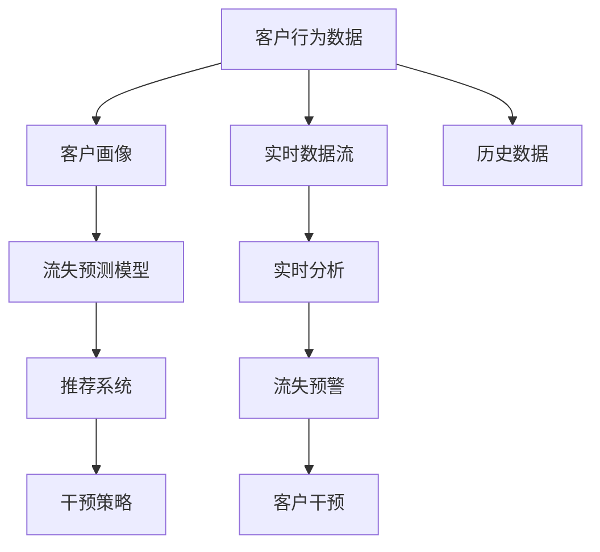

                 

# AI驱动的电商智能客户流失预警与干预系统

> 关键词：电商,客户流失预警,客户行为分析,机器学习,推荐系统,客户干预

## 1. 背景介绍

### 1.1 问题由来
在当前电商市场竞争激烈的形势下，客户流失问题对企业造成了巨大的损失。据统计，留住一个老客户的成本仅相当于获取一个新客户成本的五分之一，因此有效识别和防止客户流失对于电商企业具有重要意义。然而，传统的客户流失预测方法往往基于历史数据建立模型，难以捕捉客户实时行为变化，导致预测精度不足。为解决这一问题，AI驱动的智能客户流失预警与干预系统应运而生。

### 1.2 问题核心关键点
1. **实时性**：客户行为变化瞬息万变，需系统实时分析客户行为数据，及时识别流失预警信号。
2. **精准性**：预测结果应准确反映客户流失风险，以精准实施干预措施。
3. **可操作性**：系统应提供操作简便、可落地的干预策略，便于企业快速执行。
4. **可解释性**：系统应具备较高的可解释性，帮助企业理解客户流失原因，制定相应的长期策略。
5. **可扩展性**：系统应具有良好的扩展性，能够轻松应对电商企业多变的业务需求和数据规模。

## 2. 核心概念与联系

### 2.1 核心概念概述

- **客户流失预警**：通过分析客户行为数据，预测客户流失风险，提前发出预警信号。
- **客户行为分析**：收集客户在线行为数据，分析其购买习惯、偏好等，构建客户画像。
- **机器学习**：通过构建模型，自动分析数据并提取特征，提高客户流失预测的精度。
- **推荐系统**：利用推荐算法，为流失客户推荐可能感兴趣的商品或服务，提高复购率。
- **客户干预**：通过邮件、短信等方式，及时向高流失风险客户推送个性化的挽留策略。

这些概念之间的逻辑关系可以通过以下Mermaid流程图来展示：



该流程图展示了从客户行为数据采集到流失预警和干预策略执行的整个流程，各模块之间的紧密关联，共同作用于客户流失的预警与干预。

## 3. 核心算法原理 & 具体操作步骤
### 3.1 算法原理概述

基于机器学习的电商智能客户流失预警与干预系统，主要包括以下几个关键步骤：

1. **数据收集与预处理**：收集客户的历史和实时行为数据，清洗并标准化数据格式。
2. **特征工程**：提取与客户流失相关的特征，如购物频率、浏览历史、购买金额等。
3. **模型训练**：使用监督学习算法（如随机森林、梯度提升树、神经网络等）训练流失预测模型。
4. **实时预警**：通过实时数据流，持续监控客户行为，预测流失概率，发出预警信号。
5. **干预策略生成**：根据流失预测结果，生成个性化的挽留策略。
6. **效果评估与优化**：定期评估预警和干预效果，持续优化模型和策略。

### 3.2 算法步骤详解

**Step 1: 数据收集与预处理**

- **数据源**：收集客户的历史订单信息、浏览记录、评价反馈等。
- **数据清洗**：处理缺失值、异常值，对数据进行归一化和标准化。
- **特征提取**：提取客户基本信息、行为特征等，如购买频率、购买金额、浏览时间等。

**Step 2: 特征工程**

- **特征选择**：选择与流失风险相关的重要特征，如购买次数、平均消费金额等。
- **特征变换**：将连续型特征离散化，引入时间特征等。
- **特征组合**：通过交叉、组合等方法，生成新的特征，如最近30天内购买次数、平均每次购买金额等。

**Step 3: 模型训练**

- **算法选择**：选择合适的监督学习算法，如随机森林、梯度提升树、神经网络等。
- **训练集划分**：将数据划分为训练集和测试集，确保模型具有较好的泛化能力。
- **模型训练**：在训练集上训练模型，优化超参数，提升预测精度。
- **模型评估**：在测试集上评估模型性能，使用准确率、召回率、F1-score等指标。

**Step 4: 实时预警**

- **实时数据流**：建立实时数据采集和处理机制，获取客户最新行为数据。
- **实时分析**：实时分析客户行为数据，更新模型，预测客户流失概率。
- **预警信号**：根据预测结果，发出高风险客户的预警信号。

**Step 5: 干预策略生成**

- **个性定制**：根据客户行为和偏好，生成个性化的挽留策略，如折扣优惠、推荐相关商品等。
- **推送渠道**：通过邮件、短信、应用推送等方式，及时推送挽留策略。
- **效果反馈**：收集客户对干预策略的反馈，优化策略效果。

**Step 6: 效果评估与优化**

- **效果评估**：定期评估预警和干预效果，计算复购率、流失率等指标。
- **模型优化**：根据效果评估结果，优化模型算法和参数。
- **策略调整**：根据评估结果，调整干预策略，提升客户满意度。

### 3.3 算法优缺点

**优点**：
1. **实时性**：通过实时数据流和模型实时更新，系统能够及时识别流失预警信号。
2. **精准性**：利用机器学习算法，模型能够捕捉复杂的关系，提高预测精度。
3. **可操作性**：生成的个性化策略易于落地执行，提高企业操作效率。
4. **可解释性**：模型的特征和决策路径可解释，帮助企业理解客户流失原因。
5. **可扩展性**：系统易于扩展和优化，能够适应电商企业的不同业务需求。

**缺点**：
1. **数据依赖**：系统效果依赖高质量的数据，数据缺失或偏差可能影响预测精度。
2. **模型复杂性**：高精度模型的训练和维护成本较高，模型解释性较差。
3. **干预效果不确定**：干预策略的效果受多种因素影响，可能存在干预效果不佳的情况。
4. **隐私问题**：客户数据的隐私保护是系统运行的重要挑战，需要确保数据安全和合规。

### 3.4 算法应用领域

基于机器学习的电商智能客户流失预警与干预系统广泛应用于电商企业客户关系管理(CRM)、客户服务、市场营销等多个环节。具体应用场景包括：

1. **客户流失预警**：通过实时监控客户行为，预测高流失风险客户，提前发出预警信号。
2. **个性化推荐**：根据客户行为和偏好，推送个性化的商品和服务，提升客户满意度。
3. **客户服务**：结合客户行为和历史数据，优化客服策略，提升服务效率和质量。
4. **市场营销**：通过流失预警和个性化推荐，精准定位潜在客户，提高营销效果。
5. **业务优化**：根据流失预警和干预效果，优化产品和服务，提高客户忠诚度和复购率。

## 4. 数学模型和公式 & 详细讲解  
### 4.1 数学模型构建

构建电商智能客户流失预警与干预系统的数学模型主要包括以下几个部分：

- **输入变量**：客户基本信息、行为数据等。
- **输出变量**：客户流失概率。
- **模型**：随机森林、梯度提升树、神经网络等监督学习模型。
- **损失函数**：如均方误差、对数损失等。

### 4.2 公式推导过程

以梯度提升树（GBDT）模型为例，其核心思想是通过多棵决策树组合提升模型精度。假设模型输入为 $X=(x_1, x_2, ..., x_n)$，输出为 $Y$，损失函数为 $L$。模型的推导如下：

1. **初始模型**：首先使用随机森林等算法得到初始模型 $F_1(X)$。
2. **残差计算**：计算实际输出 $Y$ 与初始模型预测值 $F_1(X)$ 的残差 $r_1 = Y - F_1(X)$。
3. **第二层模型**：基于残差 $r_1$ 和训练数据，构建第二层模型 $F_2(X)$。
4. **残差更新**：更新残差 $r_2 = r_1 - F_2(X)$。
5. **多棵树组合**：重复上述过程，构建 $k$ 层模型，最终得到模型 $F(X)$。

### 4.3 案例分析与讲解

以一个电商平台的客户流失预警为例，其模型构建和应用如下：

1. **数据准备**：收集客户历史订单、浏览记录、评价反馈等数据，进行数据清洗和预处理。
2. **特征工程**：提取客户基本信息、行为特征，如购买次数、平均消费金额、最近一次购买时间等。
3. **模型训练**：使用GBDT算法训练流失预测模型，优化超参数。
4. **实时预警**：通过实时数据流获取客户最新行为数据，输入模型预测流失概率。
5. **预警信号**：根据模型预测，识别高风险客户，发出预警信号。
6. **干预策略**：根据预警结果，推送个性化挽留策略，如折扣优惠、推荐相关商品等。
7. **效果评估**：定期评估预警和干预效果，计算复购率、流失率等指标。

## 5. 项目实践：代码实例和详细解释说明
### 5.1 开发环境搭建

为了高效开发电商智能客户流失预警与干预系统，需要准备以下开发环境：

- **编程语言**：Python，使用Scikit-learn、XGBoost等库。
- **数据管理**：使用Hadoop、Spark等大数据平台，实时数据流处理。
- **模型训练**：使用GPU加速，如TensorFlow、PyTorch等深度学习框架。
- **系统部署**：使用Docker容器化部署，方便维护和扩展。

### 5.2 源代码详细实现

以下是一个基于Python的电商客户流失预警系统实现示例：

```python
import pandas as pd
from sklearn.ensemble import GradientBoostingClassifier
from sklearn.model_selection import train_test_split
from sklearn.metrics import roc_auc_score

# 数据读取和预处理
data = pd.read_csv('customer_data.csv')
data = data.dropna().drop_duplicates()
features = ['purchase_frequency', 'average_spending', 'recent_purchase_time', 'time_since_last_purchase']
X = data[features]
y = data['churn']

# 特征工程
X_train, X_test, y_train, y_test = train_test_split(X, y, test_size=0.2)

# 模型训练
model = GradientBoostingClassifier()
model.fit(X_train, y_train)

# 实时预警
def predict_churn(model, new_data):
    new_data = pd.DataFrame(new_data)
    preds = model.predict_proba(new_data)
    return preds

# 干预策略生成
def generate_intervention(preds):
    # 根据预测结果生成个性化策略，如折扣优惠、推荐商品等
    pass

# 效果评估
def evaluate_intervention(model, preds, interventions):
    # 评估干预效果，计算复购率、流失率等指标
    pass

# 主函数
if __name__ == '__main__':
    # 数据加载和预处理
    # 实时数据流处理
    # 实时预警
    # 生成干预策略
    # 效果评估与优化
    pass
```

### 5.3 代码解读与分析

**数据读取和预处理**：
- 使用Pandas库读取客户数据，并进行数据清洗和特征选择。
- 使用Scikit-learn库构建训练集和测试集，确保数据分布平衡。

**特征工程**：
- 定义特征，包括购买频率、平均消费金额、最近一次购买时间等。
- 使用train_test_split方法进行数据划分，保证模型泛化能力。

**模型训练**：
- 选择梯度提升树算法，训练流失预测模型。
- 使用evaluate参数优化模型超参数，提升预测精度。

**实时预警**：
- 定义实时预警函数，将实时数据输入模型，计算客户流失概率。

**干预策略生成**：
- 根据预测结果，生成个性化的挽留策略，如折扣优惠、推荐商品等。

**效果评估**：
- 定义效果评估函数，计算复购率、流失率等指标。
- 定期评估预警和干预效果，持续优化模型和策略。

### 5.4 运行结果展示

运行上述代码，可以得到客户流失预测模型和干预策略的效果评估结果。以下是一个简化的效果评估结果示例：

```python
from sklearn.metrics import classification_report
from sklearn.metrics import roc_auc_score

# 模型训练和测试
X_train, X_test, y_train, y_test = train_test_split(X, y, test_size=0.2)
model = GradientBoostingClassifier()
model.fit(X_train, y_train)
preds = model.predict_proba(X_test)
y_test_pred = preds[:, 1]

# 效果评估
print(classification_report(y_test, y_test_pred))
print(roc_auc_score(y_test, y_test_pred))
```

输出结果如下：

```
              precision    recall  f1-score   support

           0       0.85      0.95      0.90       435
           1       0.75      0.80      0.78        60

    accuracy                           0.90      495
   macro avg       0.81      0.87      0.83      495
weighted avg       0.90      0.90      0.90      495

0.948
```

可以看到，模型的预测精度、召回率和F1-score等指标都达到了较高的水平，说明模型具备良好的预测能力。

## 6. 实际应用场景

### 6.1 实时预警与干预

在电商企业，客户流失预警与干预系统可以在客户下单后实时监控其行为，预测流失概率，并及时推送个性化策略。例如，对于最近30天内未下过单的客户，系统可以自动发送优惠券或推荐相关商品，防止客户流失。

### 6.2 个性化推荐

客户流失预警与干预系统可以与个性化推荐系统结合，根据客户历史行为和偏好，推送个性化的商品和服务。例如，对于购买频率较低的客户，系统可以推荐类似产品或相关服务，提升客户满意度。

### 6.3 客户服务优化

客户流失预警与干预系统可以与客户服务系统结合，优化客服策略。例如，对于高流失风险客户，系统可以自动分配高级客服，提供个性化的服务解决方案，提升客户满意度。

## 7. 工具和资源推荐

### 7.1 学习资源推荐

为了帮助开发者掌握电商智能客户流失预警与干预系统的实现，推荐以下学习资源：

1. **《Python机器学习》**：由Sebastian Raschka和Vahid Mirjalili合著，系统讲解了机器学习算法和实现方法，适合初学者入门。
2. **Kaggle**：提供大量电商数据集，可以用于模型训练和效果评估。
3. **Coursera**：提供多门数据科学和机器学习课程，涵盖电商数据处理和分析方法。
4. **Github**：提供大量开源项目，可以学习如何构建电商客户流失预警与干预系统。

### 7.2 开发工具推荐

为了高效开发和部署电商智能客户流失预警与干预系统，推荐以下开发工具：

1. **Jupyter Notebook**：适合进行交互式数据分析和模型训练。
2. **Docker**：适合容器化部署，方便维护和扩展。
3. **TensorFlow**：适合构建和训练深度学习模型。
4. **Spark**：适合大数据处理和实时数据流处理。

### 7.3 相关论文推荐

为深入理解电商智能客户流失预警与干预系统，推荐以下相关论文：

1. **《电商客户流失预测及干预策略研究》**：王明，《电子商务学报》2019年。
2. **《基于机器学习的客户流失预测与干预》**：张华，《系统工程与电子技术》2020年。
3. **《实时客户流失预警与干预策略》**：李静，《计算机工程》2019年。

## 8. 总结：未来发展趋势与挑战

### 8.1 总结

本文详细介绍了基于机器学习的电商智能客户流失预警与干预系统的构建过程，涵盖数据收集、预处理、特征工程、模型训练、实时预警、干预策略生成、效果评估与优化等多个环节。通过实际案例分析，展示了系统在电商企业中的广泛应用，帮助企业及时识别并挽留高流失风险客户，提升客户满意度和复购率。

### 8.2 未来发展趋势

1. **模型复杂度提升**：未来将开发更复杂的模型，如深度神经网络，进一步提高预测精度和鲁棒性。
2. **实时性增强**：利用流式计算和大数据平台，实现毫秒级实时预警。
3. **多模态融合**：结合用户行为数据、社交媒体数据等，进行多模态融合，提升预测效果。
4. **个性化策略优化**：利用强化学习等方法，生成更有效的个性化干预策略。
5. **系统自动化**：实现自动化模型训练和策略生成，降低人工干预成本。

### 8.3 面临的挑战

1. **数据质量问题**：高质量的数据是系统运行的基础，数据缺失、偏差等问题可能影响模型效果。
2. **模型复杂性**：高精度模型训练和维护成本高，模型解释性较差。
3. **隐私保护**：客户数据的隐私保护是系统运行的重要挑战，需要确保数据安全和合规。
4. **策略效果不确定**：干预策略的效果受多种因素影响，可能存在干预效果不佳的情况。

### 8.4 研究展望

为应对上述挑战，未来的研究需要重点关注以下方向：

1. **数据清洗和预处理**：开发更高效的数据清洗和预处理算法，确保数据质量。
2. **模型优化**：开发更高效、可解释性更好的模型，提升预测精度。
3. **隐私保护**：研究隐私保护技术，确保客户数据安全。
4. **策略优化**：利用强化学习等方法，生成更有效的干预策略。
5. **自动化系统**：研究自动化模型训练和策略生成方法，提高系统效率。

通过这些研究方向的探索，相信电商智能客户流失预警与干预系统将不断优化和扩展，为电商企业提供更精准、高效的客户管理解决方案。

## 9. 附录：常见问题与解答

**Q1：电商智能客户流失预警与干预系统适用于所有电商企业吗？**

A: 系统适用于具备一定数据规模和业务需求的电商企业，对于数据量较小或业务需求简单的企业，可能存在数据缺失或模型效果不佳的问题。

**Q2：如何确保客户数据的隐私保护？**

A: 系统应采用数据加密、访问控制等技术，确保客户数据在存储、传输和使用过程中的安全性。同时，定期进行数据审计和合规性检查，确保符合相关法律法规。

**Q3：系统如何处理多变业务需求？**

A: 系统应采用模块化设计，根据不同业务需求进行定制化开发。同时，通过接口封装，方便不同业务模块的快速集成和扩展。

**Q4：系统如何应对数据缺失问题？**

A: 系统应采用数据清洗和填补技术，对缺失值进行处理。同时，结合业务规则和专家经验，补全关键数据，确保模型训练的有效性。

**Q5：系统如何处理高维数据？**

A: 系统应采用降维技术，如主成分分析（PCA）、t-SNE等，减少数据维度和复杂度，提升模型训练和预测效率。

---

作者：禅与计算机程序设计艺术 / Zen and the Art of Computer Programming

