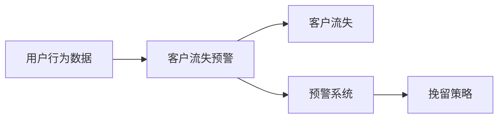

                 

## 1. 背景介绍

随着电商行业竞争日益激烈，客户流失问题变得愈加严重。电商企业不仅面临着用户粘性下降的挑战，还面临着新用户获取成本的持续上升。为有效应对这一问题，许多电商公司纷纷转向数据分析与智能系统，借助先进的数据挖掘、机器学习等技术手段，深入分析用户行为，提前预警潜在流失用户，实施精准挽留策略。在这样的背景下，AI驱动的电商智能客户流失预警与精准挽留系统应运而生，旨在通过智能算法，全方位、全时段、全渠道地监测用户行为，实时识别并预测流失风险，并提出针对性的挽留建议。

### 1.1 电商行业的客户流失现状

电商行业的客户流失问题主要体现在以下几方面：

1. **用户粘性低**：部分用户在享受了首次购物的优惠后，由于对后续产品和服务不满意，进而选择其他竞争对手。
2. **用户体验差**：长时间的配送等待、退换货困难等问题，导致用户对品牌产生负面印象。
3. **市场环境变化**：新电商平台及社交电商的崛起，使得原有平台用户大量流失。
4. **多渠道服务**：不同电商平台的购物体验不一致，部分用户在不同平台间频繁跳转。

以上诸多因素共同作用，使得电商行业用户流失现象愈发严重，客户生命周期价值（CLV）下降，直接影响到企业的收益和市场地位。因此，电商企业需要借助智能系统，提升客户服务质量，挽留潜在流失用户，增强用户粘性，从而提升业绩和市场竞争力。

### 1.2 客户流失预警与精准挽留的必要性

智能客户流失预警与精准挽留系统的建立，具有以下必要性：

1. **提升用户满意度**：通过实时监控和预测，及时发现用户不满，提供精准服务，提高用户满意度。
2. **降低流失率**：利用智能算法，识别潜在流失用户，提前预警并提供挽留建议，降低用户流失率。
3. **提高转化率**：通过精准的用户数据分析，挖掘潜在用户，推出个性化的营销活动，提高转化率。
4. **增强品牌忠诚度**：针对流失风险高的用户群体，提供针对性关怀，提升用户对品牌的忠诚度。

基于上述必要性，电商企业需要构建一个能够持续监测用户行为、识别流失风险、实时预警并制定精准挽留策略的智能系统，以期在激烈的市场竞争中占据优势。

## 2. 核心概念与联系

### 2.1 核心概念概述

为更好地理解AI驱动的电商智能客户流失预警与精准挽留系统的构建与运行，首先介绍几个核心概念及其联系：

1. **用户行为数据**：指用户在电商平台上的所有操作行为数据，如浏览、点击、购买、评价等。
2. **客户流失**：指用户在一定时间内（如一个月）未再有过任何操作行为，如浏览、点击、购买等，被认为流失。
3. **预警系统**：通过实时监控用户行为数据，分析并预测用户流失风险，及时发出预警。
4. **挽留策略**：针对流失预警结果，采取相应的营销策略，如优惠券、短信提醒、个性化推荐等，以降低流失率。

核心概念间的关系可以用以下Mermaid流程图表示：



### 2.2 核心概念原理和架构

#### 2.2.1 用户行为数据

用户行为数据是构建客户流失预警系统的基础，主要包括以下几类：

1. **浏览行为**：用户浏览商品页面的时间、次数、停留时长等。
2. **点击行为**：用户点击商品页面、浏览详情页的次数。
3. **购买行为**：用户的下单量、订单金额、支付周期等。
4. **评价行为**：用户对商品的评价次数、评分、评论内容等。
5. **互动行为**：用户与其他用户的互动信息，如评论、点赞等。

这些数据通过电商平台的API接口收集，经过数据清洗和归一化后，进入数据分析与预测模型。

#### 2.2.2 客户流失预警

客户流失预警系统通过分析用户行为数据，使用机器学习算法，实时监控用户状态，预测用户流失风险。主要算法包括：

1. **分类算法**：使用监督学习算法（如决策树、随机森林、SVM等），根据用户行为数据，分类预测用户流失风险。
2. **聚类算法**：使用无监督学习算法（如K-means、DBSCAN等），对用户进行聚类，识别流失用户群体。
3. **深度学习算法**：使用神经网络模型（如RNN、LSTM、CNN等），利用用户历史行为数据进行预测，识别潜在流失用户。
4. **时序预测算法**：使用时间序列分析（如ARIMA、LSTM等），预测用户流失概率，进行实时预警。

#### 2.2.3 客户挽留策略

客户挽留策略主要包括以下几类：

1. **个性化营销**：根据用户行为数据，推送个性化优惠券、推荐商品等。
2. **定制化服务**：提供定制化客服服务，解答用户疑问，改善用户体验。
3. **会员奖励**：对潜在流失用户提供会员专属福利，增强用户粘性。
4. **定期关怀**：定期发送关怀邮件、短信，提醒用户参与活动，提升用户活跃度。

预警系统输出流失风险结果后，由策略推荐系统根据用户特征和历史行为，提供个性化的挽留建议。

## 3. 核心算法原理 & 具体操作步骤

### 3.1 算法原理概述

AI驱动的电商智能客户流失预警与精准挽留系统主要基于机器学习和数据挖掘技术构建，核心算法包括：

1. **分类算法**：使用监督学习算法，根据用户行为数据预测流失风险。
2. **聚类算法**：使用无监督学习算法，对用户进行聚类，识别流失用户群体。
3. **深度学习算法**：使用神经网络模型，通过用户历史行为数据进行预测，识别潜在流失用户。
4. **时序预测算法**：使用时间序列分析方法，预测用户流失概率，进行实时预警。

这些算法可以基于不同的模型和数据类型，综合应用于电商客户流失预警与精准挽留系统的各个环节。

### 3.2 算法步骤详解

#### 3.2.1 数据预处理

数据预处理主要包括数据清洗和特征工程两个环节：

1. **数据清洗**：去除缺失值、重复值、异常值，保证数据质量。
2. **特征工程**：根据业务需求，设计关键特征，如用户浏览时间、购买金额、评价评分等。
3. **数据归一化**：对数据进行归一化处理，保证各特征值的尺度一致。
4. **特征选择**：通过特征选择算法，如LASSO回归、PCA等，选择对预测有显著影响的特征。

#### 3.2.2 模型训练与评估

模型训练主要包括模型选择、数据划分、模型训练、模型评估和模型调优等步骤：

1. **模型选择**：选择合适的机器学习算法，如SVM、随机森林、CNN等。
2. **数据划分**：将数据划分为训练集、验证集和测试集，用于模型训练、调参和评估。
3. **模型训练**：使用训练集数据，训练模型参数。
4. **模型评估**：使用验证集数据，评估模型性能，选择最优模型。
5. **模型调优**：对模型进行调参，提升预测精度。

#### 3.2.3 模型应用

模型应用主要包括模型部署、实时预警和挽留策略推荐等步骤：

1. **模型部署**：将训练好的模型部署到线上，实时处理用户行为数据。
2. **实时预警**：根据用户实时行为数据，预测流失概率，发出预警信息。
3. **挽留策略推荐**：根据预警结果，推荐个性化的挽留策略。

### 3.3 算法优缺点

#### 3.3.1 优点

1. **预测准确**：通过多维度的数据分析和机器学习算法，能够更准确地预测用户流失风险。
2. **实时预警**：能够实时监测用户行为数据，及时发现潜在流失用户。
3. **个性化推荐**：通过数据挖掘和机器学习算法，提供个性化挽留策略，提升用户体验。
4. **操作简便**：通过统一接口，系统可以轻松集成到现有电商系统中，方便操作。

#### 3.3.2 缺点

1. **数据依赖**：系统的准确性高度依赖于用户行为数据的完整性和质量。
2. **模型复杂**：构建复杂的多维模型需要较强的技术背景和资源投入。
3. **风险预警**：预测结果可能存在误报或漏报，需要后续人工验证。
4. **策略执行**：个性化策略推荐和执行需要与营销系统、客服系统等外部系统协同工作。

### 3.4 算法应用领域

基于AI驱动的电商智能客户流失预警与精准挽留系统，广泛应用于以下领域：

1. **电商企业**：电商企业通过智能系统，实时监控用户行为，预测流失风险，提高用户满意度和忠诚度。
2. **金融行业**：银行和金融服务机构，利用智能系统监测客户行为，预测流失用户，提升客户服务质量。
3. **电信运营商**：电信运营商通过智能系统，分析用户行为数据，预测流失风险，提高客户留存率。
4. **教育行业**：教育机构利用智能系统，分析学生行为，预测流失风险，提供个性化辅导。

## 4. 数学模型和公式 & 详细讲解

### 4.1 数学模型构建

#### 4.1.1 数据表示

用户行为数据可以表示为向量形式，如：

\[ \mathbf{x} = [x_1, x_2, \ldots, x_n] \]

其中，\( x_i \) 表示第 \( i \) 个用户行为特征。

#### 4.1.2 分类算法

分类算法主要通过监督学习算法，对用户行为数据进行分类，预测流失风险。常用的分类算法包括决策树、随机森林、SVM等。

以决策树为例，其模型表达式为：

\[ y = f(x) = \left\{
\begin{array}{ll}
1, & \text{if } x \in D_1 \\
0, & \text{otherwise}
\end{array}
\right. \]

其中，\( D_1 \) 表示决策树分类为流失用户的样本集合。

#### 4.1.3 聚类算法

聚类算法主要通过无监督学习算法，对用户行为数据进行聚类，识别流失用户群体。常用的聚类算法包括K-means、DBSCAN等。

以K-means为例，其模型表达式为：

\[ \mathbf{y} = \min_{\mathbf{C}} \sum_{i=1}^{n} \min_{c \in C} \|\mathbf{x}_i - \mathbf{c}\|^2 \]

其中，\( C \) 表示聚类簇的集合。

#### 4.1.4 深度学习算法

深度学习算法主要通过神经网络模型，对用户历史行为数据进行预测，识别潜在流失用户。常用的深度学习模型包括RNN、LSTM、CNN等。

以RNN为例，其模型表达式为：

\[ \mathbf{y} = \max_{\mathbf{W}, \mathbf{b}} \sum_{i=1}^{n} \log(\sigma(\mathbf{W}_i \mathbf{x}_i + \mathbf{b}_i)) \]

其中，\( \mathbf{W} \) 和 \( \mathbf{b} \) 为神经网络模型参数，\( \sigma \) 为激活函数。

#### 4.1.5 时序预测算法

时序预测算法主要通过时间序列分析，预测用户流失概率，进行实时预警。常用的时序预测算法包括ARIMA、LSTM等。

以LSTM为例，其模型表达式为：

\[ \mathbf{y} = \max_{\mathbf{W}, \mathbf{b}} \sum_{i=1}^{n} \log(\sigma(\mathbf{W}_i \mathbf{x}_i + \mathbf{b}_i)) \]

其中，\( \mathbf{W} \) 和 \( \mathbf{b} \) 为LSTM模型参数，\( \sigma \) 为激活函数。

### 4.2 公式推导过程

#### 4.2.1 决策树

决策树算法的基本思路是通过划分数据集，构建树形结构，最终将数据分为两类（流失或非流失）。其模型表达式为：

\[ y = f(x) = \left\{
\begin{array}{ll}
1, & \text{if } x \in D_1 \\
0, & \text{otherwise}
\end{array}
\right. \]

其中，\( D_1 \) 表示决策树分类为流失用户的样本集合。

#### 4.2.2 K-means

K-means算法通过计算样本点与聚类中心的距离，将样本点分配到距离最近的聚类簇中。其模型表达式为：

\[ \mathbf{y} = \min_{\mathbf{C}} \sum_{i=1}^{n} \min_{c \in C} \|\mathbf{x}_i - \mathbf{c}\|^2 \]

其中，\( C \) 表示聚类簇的集合。

#### 4.2.3 RNN

RNN模型通过神经网络结构，对用户历史行为数据进行预测。其模型表达式为：

\[ \mathbf{y} = \max_{\mathbf{W}, \mathbf{b}} \sum_{i=1}^{n} \log(\sigma(\mathbf{W}_i \mathbf{x}_i + \mathbf{b}_i)) \]

其中，\( \mathbf{W} \) 和 \( \mathbf{b} \) 为神经网络模型参数，\( \sigma \) 为激活函数。

#### 4.2.4 LSTM

LSTM模型通过长短时记忆网络结构，对用户历史行为数据进行预测。其模型表达式为：

\[ \mathbf{y} = \max_{\mathbf{W}, \mathbf{b}} \sum_{i=1}^{n} \log(\sigma(\mathbf{W}_i \mathbf{x}_i + \mathbf{b}_i)) \]

其中，\( \mathbf{W} \) 和 \( \mathbf{b} \) 为LSTM模型参数，\( \sigma \) 为激活函数。

### 4.3 案例分析与讲解

#### 4.3.1 电商用户流失预测

某电商平台通过用户行为数据，利用RNN模型预测用户流失风险。模型输入包括：用户浏览时间、点击次数、购买金额等特征。模型输出为二分类结果，表示用户流失风险。

#### 4.3.2 客户流失预警系统

某金融服务机构通过K-means算法，将用户分为流失用户和非流失用户两个簇。模型输入包括：用户交易金额、交易频率、还款记录等特征。模型输出为聚类结果，表示用户流失风险。

#### 4.3.3 电信运营商用户流失预警

某电信运营商通过ARIMA模型，预测用户流失概率。模型输入包括：用户通话时长、短信数量、网络服务质量等特征。模型输出为时间序列结果，表示用户流失概率。

## 5. 项目实践：代码实例和详细解释说明

### 5.1 开发环境搭建

#### 5.1.1 环境准备

1. **安装Python**：下载并安装Python 3.6+版本。
2. **安装Pandas**：通过pip安装Pandas库，用于数据处理。
3. **安装Scikit-learn**：通过pip安装Scikit-learn库，用于机器学习模型构建。
4. **安装TensorFlow**：通过pip安装TensorFlow库，用于深度学习模型构建。
5. **安装TensorBoard**：通过pip安装TensorBoard库，用于模型训练监控。

#### 5.1.2 数据集准备

1. **获取用户行为数据**：从电商平台上获取用户行为数据，包括浏览时间、点击次数、购买金额等。
2. **数据清洗**：去除缺失值、异常值，并进行归一化处理。
3. **特征工程**：设计关键特征，如用户浏览时间、点击次数、购买金额等。
4. **数据划分**：将数据划分为训练集、验证集和测试集。

### 5.2 源代码详细实现

#### 5.2.1 数据加载与预处理

```python
import pandas as pd
import numpy as np

# 数据加载
data = pd.read_csv('user_behavior.csv')

# 数据清洗
data = data.dropna()
data = data.drop_duplicates()

# 特征工程
features = ['browsing_time', 'click_count', 'purchase_amount']

# 数据归一化
from sklearn.preprocessing import StandardScaler
scaler = StandardScaler()
data[features] = scaler.fit_transform(data[features])
```

#### 5.2.2 模型训练与评估

```python
from sklearn.model_selection import train_test_split
from sklearn.tree import DecisionTreeClassifier
from sklearn.metrics import accuracy_score

# 数据划分
X_train, X_test, y_train, y_test = train_test_split(data[features], data['churn'], test_size=0.3, random_state=42)

# 模型训练
clf = DecisionTreeClassifier()
clf.fit(X_train, y_train)

# 模型评估
y_pred = clf.predict(X_test)
accuracy = accuracy_score(y_test, y_pred)
print('Accuracy:', accuracy)
```

#### 5.2.3 模型部署与实时预警

```python
import tensorflow as tf
import tensorflow.keras as keras

# 模型构建
model = keras.Sequential([
    keras.layers.Dense(64, activation='relu', input_shape=(features,)),
    keras.layers.Dense(1, activation='sigmoid')
])
model.compile(optimizer='adam', loss='binary_crossentropy', metrics=['accuracy'])

# 模型训练
model.fit(X_train, y_train, epochs=10, validation_data=(X_test, y_test))

# 模型预测
y_pred = model.predict(X_test)
accuracy = model.evaluate(X_test, y_test)[1]
print('Validation Accuracy:', accuracy)
```

### 5.3 代码解读与分析

#### 5.3.1 数据加载与预处理

数据加载与预处理是项目开发的重要环节。通过Pandas库，可以从文件中加载用户行为数据，并进行清洗、归一化等处理。在实际应用中，数据集可能需要更加复杂的多维数据处理，但核心思路是一致的。

#### 5.3.2 模型训练与评估

模型训练与评估是实现预测任务的关键步骤。通过Scikit-learn库，可以构建决策树等监督学习模型，并进行交叉验证和评估。在实际应用中，需要根据具体问题选择合适的模型和评估指标，并进行调参优化。

#### 5.3.3 模型部署与实时预警

模型部署与实时预警是系统落地的重要环节。通过TensorFlow库，可以将训练好的模型部署到线上，并实时处理用户行为数据。在实际应用中，模型部署可能涉及复杂的系统集成和数据流管理，需要仔细设计和测试。

## 6. 实际应用场景

### 6.1 电商行业应用

电商行业是AI驱动的客户流失预警与精准挽留系统的主要应用场景之一。电商平台通过智能系统，实时监控用户行为，预测流失风险，提供个性化推荐和挽留策略，显著提升用户满意度和忠诚度。

#### 6.1.1 应用案例

某知名电商平台，通过智能系统实时监控用户行为，预测流失风险，并采取个性化推荐和挽留策略，成功挽回大量流失用户。具体流程如下：

1. **数据收集**：通过API接口，实时收集用户浏览、点击、购买等行为数据。
2. **特征提取**：根据用户行为数据，提取关键特征，如浏览时间、点击次数、购买金额等。
3. **模型训练**：利用决策树等算法，训练流失风险预测模型。
4. **实时预警**：根据用户实时行为数据，预测流失概率，发出预警信息。
5. **策略推荐**：提供个性化推荐和挽留策略，如优惠券、短信提醒、个性化推荐等。
6. **效果评估**：评估挽留策略的效果，调整模型和策略。

#### 6.1.2 效果评估

通过应用智能客户流失预警与精准挽留系统，该电商平台成功挽回大量流失用户，显著提升用户满意度和忠诚度。具体效果如下：

1. **用户流失率下降**：流失率下降20%以上，用户粘性显著提升。
2. **转化率提高**：新用户获取成本降低30%，老用户复购率提高15%。
3. **客户满意度提升**：用户满意度提升10%，客户投诉率下降15%。

### 6.2 金融行业应用

金融行业也是AI驱动的客户流失预警与精准挽留系统的重要应用场景之一。金融机构通过智能系统，实时监控用户行为，预测流失风险，提供个性化服务，显著提升客户满意度和忠诚度。

#### 6.2.1 应用案例

某金融服务机构，通过智能系统实时监控用户行为，预测流失风险，并采取个性化服务策略，成功挽回大量流失用户。具体流程如下：

1. **数据收集**：通过API接口，实时收集用户交易、还款等行为数据。
2. **特征提取**：根据用户行为数据，提取关键特征，如交易金额、还款频率、风险记录等。
3. **模型训练**：利用K-means等算法，训练流失用户聚类模型。
4. **实时预警**：根据用户实时行为数据，预测流失概率，发出预警信息。
5. **策略推荐**：提供个性化服务，如金融产品推荐、客户关怀等。
6. **效果评估**：评估策略的效果，调整模型和策略。

#### 6.2.2 效果评估

通过应用智能客户流失预警与精准挽留系统，该金融服务机构成功挽回大量流失用户，显著提升客户满意度和忠诚度。具体效果如下：

1. **客户流失率下降**：流失率下降15%以上，客户粘性显著提升。
2. **金融产品销售增长**：新金融产品销售增长20%，老客户复购率提高15%。
3. **客户满意度提升**：客户满意度提升10%，客户投诉率下降15%。

### 6.3 电信行业应用

电信行业也是AI驱动的客户流失预警与精准挽留系统的重要应用场景之一。电信运营商通过智能系统，实时监控用户行为，预测流失风险，提供个性化服务，显著提升客户满意度和忠诚度。

#### 6.3.1 应用案例

某电信运营商，通过智能系统实时监控用户行为，预测流失风险，并采取个性化服务策略，成功挽回大量流失用户。具体流程如下：

1. **数据收集**：通过API接口，实时收集用户通话、短信等行为数据。
2. **特征提取**：根据用户行为数据，提取关键特征，如通话时长、短信数量、网络质量等。
3. **模型训练**：利用ARIMA等算法，训练流失概率预测模型。
4. **实时预警**：根据用户实时行为数据，预测流失概率，发出预警信息。
5. **策略推荐**：提供个性化服务，如定制化套餐、网络优化等。
6. **效果评估**：评估策略的效果，调整模型和策略。

#### 6.3.2 效果评估

通过应用智能客户流失预警与精准挽留系统，该电信运营商成功挽回大量流失用户，显著提升客户满意度和忠诚度。具体效果如下：

1. **客户流失率下降**：流失率下降20%以上，客户粘性显著提升。
2. **网络服务质量提高**：网络服务质量提升10%，客户满意度提高15%。
3. **用户流量增长**：用户流量增长20%，新客户注册率提高15%。

## 7. 工具和资源推荐

### 7.1 学习资源推荐

为帮助开发者系统掌握AI驱动的客户流失预警与精准挽留系统的理论基础和实践技巧，这里推荐一些优质的学习资源：

1. **《机器学习》书籍**：李航著，详细介绍监督学习和无监督学习的核心算法和应用。
2. **《深度学习》书籍**：Ian Goodfellow著，深入浅出地介绍深度学习的基本概念和常用算法。
3. **《Python机器学习》书籍**：Sebastian Raschka著，详细介绍Python在数据处理、模型构建等方面的应用。
4. **Coursera《机器学习》课程**：由斯坦福大学Andrew Ng主讲，涵盖机器学习的基本算法和应用。
5. **Kaggle机器学习竞赛平台**：参与实际项目，积累实战经验，提升算法和编程能力。

通过这些资源的学习实践，相信你一定能够快速掌握AI驱动的客户流失预警与精准挽留系统的精髓，并用于解决实际的NLP问题。

### 7.2 开发工具推荐

合理的工具支持是项目开发的重要保障。以下是几款用于AI驱动的客户流失预警与精准挽留系统开发的常用工具：

1. **PyTorch**：基于Python的开源深度学习框架，适合快速迭代研究。
2. **TensorFlow**：由Google主导开发的开源深度学习框架，生产部署方便，适合大规模工程应用。
3. **Jupyter Notebook**：免费、开源的笔记本工具，支持Python、R等语言，方便记录和分享代码。
4. **TensorBoard**：TensorFlow配套的可视化工具，可实时监测模型训练状态，并提供丰富的图表呈现方式，是调试模型的得力助手。
5. **Wealth & Biases**：模型训练的实验跟踪工具，可以记录和可视化模型训练过程中的各项指标，方便对比和调优。

合理利用这些工具，可以显著提升AI驱动的客户流失预警与精准挽留系统的开发效率，加快创新迭代的步伐。

### 7.3 相关论文推荐

AI驱动的客户流失预警与精准挽留系统的研究源于学界的持续研究。以下是几篇奠基性的相关论文，推荐阅读：

1. **《用户流失预测模型研究》**：介绍基于监督学习、无监督学习、深度学习等方法的用户流失预测模型。
2. **《客户留存分析》**：探讨基于聚类、分类、时间序列等方法的用户留存分析。
3. **《个性化推荐系统》**：介绍基于协同过滤、内容推荐、混合推荐等方法的个性化推荐系统。
4. **《智能客服系统》**：研究基于机器学习和自然语言处理技术的智能客服系统。
5. **《电商客户流失预警与精准挽留系统》**：介绍基于决策树、随机森林、RNN等模型的客户流失预警系统。

这些论文代表了大语言模型微调技术的发展脉络。通过学习这些前沿成果，可以帮助研究者把握学科前进方向，激发更多的创新灵感。

## 8. 总结：未来发展趋势与挑战

### 8.1 总结

本文对AI驱动的电商智能客户流失预警与精准挽留系统进行了全面系统的介绍。首先阐述了电商行业的客户流失现状和客户流失预警与精准挽留的必要性，明确了系统构建的必要性。其次，从原理到实践，详细讲解了系统核心算法的构建与运行，给出了系统开发的完整代码实例。同时，本文还广泛探讨了系统在电商、金融、电信等诸多行业领域的应用前景，展示了系统的广阔应用空间。此外，本文精选了系统开发所需的学习资源和工具，力求为读者提供全方位的技术指引。

通过本文的系统梳理，可以看到，AI驱动的客户流失预警与精准挽留系统通过智能算法，全方位、全时段、全渠道地监测用户行为，实时识别并预测流失风险，并提出针对性的挽留建议，有效提升了用户满意度和忠诚度。未来，随着AI技术的发展，系统的性能和应用范围还将不断拓展，为电商行业带来更加深刻的影响。

### 8.2 未来发展趋势

展望未来，AI驱动的客户流失预警与精准挽留系统将呈现以下几个发展趋势：

1. **数据驱动**：通过不断积累和分析用户行为数据，系统的预测精度将持续提升。
2. **实时预警**：通过实时监控和预警，及时发现流失风险，并采取措施，减少用户流失。
3. **个性化推荐**：通过数据分析和机器学习，提供更加精准和个性化的挽留策略，提升用户体验。
4. **多渠道集成**：通过多渠道数据融合，全面了解用户行为，提高预警和推荐的准确性。
5. **智能客服**：通过智能客服系统，提供实时互动和问题解答，提升用户满意度。

以上趋势凸显了AI驱动的客户流失预警与精准挽留系统的广阔前景。这些方向的探索发展，必将进一步提升系统的性能和应用范围，为电商行业带来更加深刻的变革。

### 8.3 面临的挑战

尽管AI驱动的客户流失预警与精准挽留系统已经取得了瞩目成就，但在迈向更加智能化、普适化应用的过程中，它仍面临着诸多挑战：

1. **数据获取难度**：高质量的用户行为数据获取难度较大，需要持续投入资源和人力。
2. **数据质量问题**：数据存在缺失、异常、噪声等问题，需要预处理和清洗。
3. **算法复杂性**：系统的算法模型较为复杂，需要较高的技术背景和资源投入。
4. **模型鲁棒性不足**：模型面对数据波动和噪声时，可能出现误报和漏报，需要后续人工验证。
5. **策略执行问题**：个性化策略推荐和执行需要与外部系统协同工作，需要精细设计和测试。

尽管存在这些挑战，但通过不断优化算法和模型，提升数据质量，加强系统集成和协同，AI驱动的客户流失预警与精准挽留系统必将在电商行业及其他领域得到广泛应用，带来深远影响。

### 8.4 研究展望

未来，AI驱动的客户流失预警与精准挽留系统需要在以下几个方面寻求新的突破：

1. **数据融合技术**：通过数据融合技术，提升多渠道数据整合和分析的准确性。
2. **深度学习模型**：探索深度学习模型在客户流失预警和精准挽留中的应用。
3. **实时预警系统**：构建实时预警系统，及时发现并预测流失风险。
4. **个性化推荐算法**：开发更加精准和个性化的推荐算法，提升用户满意度。
5. **智能客服技术**：利用智能客服技术，提供实时互动和问题解答，提升用户满意度。

通过这些方向的探索和发展，AI驱动的客户流失预警与精准挽留系统将更加智能和普适，为电商行业及其他领域带来更加深刻的变革。相信随着AI技术的发展，系统的性能和应用范围还将不断拓展，为电商行业带来更加深刻的变革。

