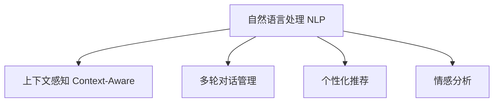

                 

# AI驱动的虚拟助手：超越简单的问答系统

> 关键词：虚拟助手,对话系统,自然语言处理(NLP),上下文感知,多轮对话,个性化推荐,情感分析,智能决策

## 1. 背景介绍

### 1.1 问题由来

随着人工智能技术的迅速发展，虚拟助手（Virtual Assistant）作为智能交互系统的重要形式，已经广泛应用于各行各业。从智能客服到个人助手，从智能音箱到车载系统，虚拟助手以其高效、便捷的交互方式，极大地改善了人类的工作和生活方式。然而，传统的问答系统往往局限于简单的单轮对话，无法处理复杂的多轮对话场景，且缺乏对用户情感和上下文信息的理解，难以提供个性化和精准的推荐和决策。

为了解决这些问题，AI驱动的虚拟助手应运而生。这种虚拟助手不再仅仅是一个简单的问答工具，而是集成了上下文感知、多轮对话、个性化推荐和情感分析等多项高级功能，能够与用户进行多轮交互，理解用户的意图和情感，提供更加智能和个性化的服务。

### 1.2 问题核心关键点

AI驱动的虚拟助手涉及的核心技术包括自然语言处理（NLP）、上下文感知、多轮对话管理、个性化推荐和情感分析等。这些技术相互配合，使得虚拟助手能够更全面地理解用户需求，提供更智能、更个性化的服务。

## 2. 核心概念与联系

### 2.1 核心概念概述

为更好地理解AI驱动虚拟助手的工作原理，本节将介绍几个密切相关的核心概念：

- **自然语言处理（NLP）**：涉及文本的自动处理和理解，包括分词、词性标注、命名实体识别、语义分析等。NLP是大语言模型微调和虚拟助手的基础，用于理解用户输入的自然语言。

- **上下文感知（Context-Aware）**：虚拟助手在处理用户请求时，能够考虑之前对话的内容，使得多轮对话更加连贯和自然。上下文感知是实现多轮对话管理的关键。

- **多轮对话管理（Dialogue Management）**：通过设计对话管理策略，虚拟助手能够有效地管理对话状态和上下文，确保多轮对话的流畅进行。

- **个性化推荐（Personalized Recommendation）**：根据用户的历史行为和偏好，虚拟助手能够提供个性化内容推荐，提升用户满意度和留存率。

- **情感分析（Sentiment Analysis）**：通过分析用户输入中的情感信息，虚拟助手能够识别用户的情绪状态，提供更符合用户情绪的互动和反馈。

这些核心概念之间的逻辑关系可以通过以下Mermaid流程图来展示：



这个流程图展示了NLP作为虚拟助手的基础，如何通过上下文感知、多轮对话管理、个性化推荐和情感分析等高级技术，实现更加智能和个性化的交互体验。

## 3. 核心算法原理 & 具体操作步骤
### 3.1 算法原理概述

AI驱动的虚拟助手通过自然语言处理（NLP）技术，将用户输入的自然语言转化为计算机可处理的向量表示，然后基于上下文感知和对话管理策略，生成合适的回复。在多轮对话中，虚拟助手还能够利用个性化推荐和情感分析技术，提升用户满意度。

具体来说，虚拟助手的基本流程包括：

1. 用户输入自然语言请求。
2. 自然语言处理模块对请求进行预处理和理解，提取关键信息。
3. 上下文感知模块结合之前的对话历史，生成对话状态。
4. 对话管理模块根据对话状态和当前请求，生成合适的回复。
5. 个性化推荐模块根据用户的历史行为和偏好，推荐相关内容。
6. 情感分析模块根据用户的情感信息，调整交互策略。

这一过程不断循环，直到对话结束。

### 3.2 算法步骤详解

以下详细介绍AI驱动虚拟助手的基本算法步骤：

**Step 1: 自然语言处理**

自然语言处理（NLP）是虚拟助手的基础，其核心任务包括：

- **分词**：将自然语言输入分解成词语序列。
- **词性标注**：为每个词语标注其词性，如名词、动词、形容词等。
- **命名实体识别**：识别出人名、地名、机构名等实体。
- **语义分析**：理解句子中的语义关系，如主谓宾关系。

可以使用现有的NLP库，如NLTK、spaCy、Transformers等，进行快速实现。

**Step 2: 上下文感知**

上下文感知模块用于跟踪和记录对话历史，以确保多轮对话的连贯性和一致性。其主要任务包括：

- **对话历史存储**：将对话历史存储在内存或数据库中。
- **对话状态生成**：根据之前的对话历史和当前请求，生成对话状态。
- **上下文更新**：在对话过程中，实时更新对话历史和对话状态。

可以使用基于向量空间模型或注意力机制的方法实现上下文感知，如Seq2Seq模型、Transformer模型等。

**Step 3: 对话管理**

对话管理模块用于控制对话流程，生成合适的回复。其主要任务包括：

- **意图识别**：识别用户请求的意图，如查询、订购、反馈等。
- **意图分类**：将意图分类为不同的类型。
- **回复生成**：根据意图分类和对话状态，生成合适的回复。

对话管理可以通过规则驱动、统计学习方法或混合方法实现，如RULES、 reinforcement learning、 seq2seq等。

**Step 4: 个性化推荐**

个性化推荐模块用于根据用户的历史行为和偏好，推荐相关内容。其主要任务包括：

- **用户画像构建**：根据用户的历史行为，构建用户画像。
- **推荐内容生成**：根据用户画像和当前请求，生成推荐内容。
- **推荐算法选择**：选择合适的推荐算法，如协同过滤、内容过滤、混合推荐等。

可以使用基于机器学习的方法实现个性化推荐，如 collaborative filtering、 matrix factorization等。

**Step 5: 情感分析**

情感分析模块用于分析用户输入中的情感信息，调整交互策略。其主要任务包括：

- **情感识别**：识别用户输入中的情感倾向，如正面、负面、中性等。
- **情感分类**：将情感分类为不同的类型。
- **情感处理**：根据情感分类，调整交互策略，如安抚用户、避免敏感话题等。

可以使用基于情感词典、机器学习方法或深度学习模型实现情感分析，如 sentiment analysis、 emotion detection等。

### 3.3 算法优缺点

AI驱动的虚拟助手具有以下优点：

- **智能性高**：通过上下文感知、多轮对话管理、个性化推荐和情感分析等多项高级技术，虚拟助手能够提供更加智能和个性化的服务。
- **交互体验好**：虚拟助手能够理解用户的意图和情感，提供更加符合用户需求的互动和反馈。
- **可扩展性强**：虚拟助手可以根据不同的应用场景进行定制化开发，适应不同的用户需求。

同时，该方法也存在一定的局限性：

- **开发复杂**：虚拟助手的开发涉及多个领域的技术，如NLP、上下文感知、多轮对话管理、个性化推荐和情感分析等，开发难度较大。
- **数据需求高**：虚拟助手需要大量的标注数据进行训练和优化，数据获取成本较高。
- **性能要求高**：虚拟助手需要实时处理用户请求，对计算资源和算法性能要求较高。

尽管存在这些局限性，但AI驱动的虚拟助手仍是大语言模型微调的重要应用范式。未来相关研究的重点在于如何进一步降低开发难度和数据需求，提高虚拟助手的可扩展性和性能，同时兼顾智能性和个性化。

### 3.4 算法应用领域

AI驱动的虚拟助手已经在多个领域得到了广泛的应用，包括但不限于：

- **智能客服**：通过自然语言处理和上下文感知技术，智能客服系统能够快速响应用户请求，提供个性化的解答和推荐。
- **健康医疗**：虚拟助手能够根据用户的健康信息，提供个性化的健康建议和治疗方案。
- **金融理财**：虚拟助手能够提供个性化的理财建议，帮助用户管理财务。
- **教育辅导**：虚拟助手能够根据学生的学习情况，提供个性化的学习建议和资源推荐。
- **娱乐休闲**：虚拟助手能够根据用户的兴趣偏好，推荐电影、音乐、书籍等娱乐内容。

此外，AI驱动的虚拟助手还被广泛应用于智能家居、智能交通、智能制造等多个领域，为各行各业带来了全新的变革。

## 4. 数学模型和公式 & 详细讲解 & 举例说明

### 4.1 数学模型构建

本节将使用数学语言对AI驱动虚拟助手的工作原理进行更加严格的刻画。

设用户输入的自然语言请求为 $x$，虚拟助手生成的回复为 $y$。则虚拟助手的基本框架可以表示为：

$$
y = f(x, C(x))
$$

其中 $f$ 表示对话管理模块和个性化推荐模块，$C$ 表示上下文感知模块。

### 4.2 公式推导过程

以下详细推导虚拟助手的基本框架：

**Step 1: 自然语言处理**

自然语言处理模块将用户输入的自然语言 $x$ 转化为向量表示 $\hat{x}$，其公式如下：

$$
\hat{x} = \mathcal{T}(x)
$$

其中 $\mathcal{T}$ 表示自然语言处理模块，可以使用现有的NLP库进行快速实现。

**Step 2: 上下文感知**

上下文感知模块根据之前的对话历史 $H$，生成对话状态 $C(x)$，其公式如下：

$$
C(x) = \mathcal{C}(H, \hat{x})
$$

其中 $\mathcal{C}$ 表示上下文感知模块，可以使用基于向量空间模型或注意力机制的方法实现。

**Step 3: 对话管理**

对话管理模块根据对话状态 $C(x)$ 和当前请求 $x$，生成回复 $y$，其公式如下：

$$
y = \mathcal{F}(C(x), x)
$$

其中 $\mathcal{F}$ 表示对话管理模块，可以使用规则驱动、统计学习方法或混合方法实现。

**Step 4: 个性化推荐**

个性化推荐模块根据用户画像 $P$ 和当前请求 $x$，生成推荐内容 $R$，其公式如下：

$$
R = \mathcal{R}(P, x)
$$

其中 $\mathcal{R}$ 表示个性化推荐模块，可以使用基于机器学习的方法实现。

**Step 5: 情感分析**

情感分析模块根据用户输入的自然语言 $x$，生成情感分类 $S$，其公式如下：

$$
S = \mathcal{S}(x)
$$

其中 $\mathcal{S}$ 表示情感分析模块，可以使用基于情感词典、机器学习方法或深度学习模型实现。

### 4.3 案例分析与讲解

以智能客服为例，详细讲解AI驱动虚拟助手的实现过程：

**Step 1: 自然语言处理**

自然语言处理模块将用户输入的自然语言请求 $x$ 转化为向量表示 $\hat{x}$，并提取关键信息。

**Step 2: 上下文感知**

上下文感知模块根据之前的对话历史 $H$，生成对话状态 $C(x)$。例如，当用户询问“这是什么产品？”时，上下文感知模块会结合之前用户询问的“请问这是什么颜色？”和“产品型号是S2”等信息，生成对话状态。

**Step 3: 对话管理**

对话管理模块根据对话状态 $C(x)$ 和当前请求 $x$，生成合适的回复。例如，在用户询问“这是什么产品？”时，对话管理模块会根据对话历史和当前请求，生成回复“这是我们的新产品，型号是S2”。

**Step 4: 个性化推荐**

个性化推荐模块根据用户的历史行为和偏好，推荐相关内容。例如，在用户询问“这是什么产品？”时，个性化推荐模块会根据用户的历史购买记录和浏览行为，推荐类似的产品。

**Step 5: 情感分析**

情感分析模块根据用户的情感信息，调整交互策略。例如，在用户询问“这是什么产品？”时，情感分析模块会根据用户的情感倾向，调整交互策略，如安抚用户、避免敏感话题等。

通过以上五个步骤，智能客服系统能够快速响应用户请求，提供个性化的解答和推荐，提升用户体验。

## 5. 项目实践：代码实例和详细解释说明
### 5.1 开发环境搭建

在进行虚拟助手开发前，我们需要准备好开发环境。以下是使用Python进行虚拟助手开发的Python环境配置流程：

1. 安装Anaconda：从官网下载并安装Anaconda，用于创建独立的Python环境。

2. 创建并激活虚拟环境：
```bash
conda create -n chatbot-env python=3.8 
conda activate chatbot-env
```

3. 安装必要的库：
```bash
pip install torch transformers numpy pandas scikit-learn tensorflow
```

4. 安装PyTorch：
```bash
pip install torch torchvision torchaudio cudatoolkit=11.1 -c pytorch -c conda-forge
```

5. 安装TensorFlow：
```bash
pip install tensorflow
```

完成上述步骤后，即可在`chatbot-env`环境中开始虚拟助手开发。

### 5.2 源代码详细实现

下面我们以智能客服系统为例，给出使用Transformers库对BERT模型进行智能客服开发的PyTorch代码实现。

**自然语言处理模块**

```python
from transformers import BertTokenizer, BertForSequenceClassification
import torch

class BERTClassifier(torch.nn.Module):
    def __init__(self, num_labels):
        super(BERTClassifier, self).__init__()
        self.num_labels = num_labels
        self.bert = BertForSequenceClassification.from_pretrained('bert-base-cased', num_labels=num_labels)
    
    def forward(self, input_ids, attention_mask):
        logits = self.bert(input_ids, attention_mask=attention_mask)[0]
        return logits

# 实例化BERTClassifier模型
tokenizer = BertTokenizer.from_pretrained('bert-base-cased')
model = BERTClassifier(2)  # 2为分类任务的标签数
```

**上下文感知模块**

```python
import collections

class ChatContext:
    def __init__(self):
        self.history = collections.deque(maxlen=100)
    
    def add_message(self, message):
        self.history.append(message)
    
    def get_state(self):
        return ' '.join(self.history)
```

**对话管理模块**

```python
class DialogueManager:
    def __init__(self, model, context):
        self.model = model
        self.context = context
    
    def generate_response(self, input_message):
        state = self.context.get_state()
        logits = self.model(input_message, attention_mask=self.model.attention_mask(state))
        label = torch.argmax(logits, dim=1).item()
        response = label2text[label]
        self.context.add_message(response)
        return response
```

**个性化推荐模块**

```python
from sklearn.metrics.pairwise import cosine_similarity

class RecommendationSystem:
    def __init__(self, user_profile):
        self.user_profile = user_profile
    
    def recommend_products(self, input_message):
        recommendations = self.user_profile['products']
        similarity = cosine_similarity(self.user_profile['features'], input_message)
        max_index = similarity.argmax()
        recommendation = recommendations[max_index]
        return recommendation
```

**情感分析模块**

```python
from transformers import pipeline

class SentimentAnalyzer:
    def __init__(self):
        self.sr = pipeline('sentiment-analysis')
    
    def analyze(self, input_message):
        sentiment = self.sr(input_message)[0]['label']
        return sentiment
```

**虚拟助手实例**

```python
from transformers import BertTokenizer, BertForSequenceClassification
from collections import deque
import torch

class Chatbot:
    def __init__(self, model, context, user_profile, sentiment_analyzer):
        self.model = model
        self.context = context
        self.user_profile = user_profile
        self.sentiment_analyzer = sentiment_analyzer
    
    def handle_message(self, input_message):
        response = self.dialogue_manager.generate_response(input_message)
        sentiment = self.sentiment_analyzer.analyze(response)
        recommendation = self.recommendation_system.recommend_products(input_message)
        return response, sentiment, recommendation
```

**虚拟助手启动**

```python
# 初始化模型、上下文、用户画像和情感分析器
tokenizer = BertTokenizer.from_pretrained('bert-base-cased')
model = BERTClassifier(2)
context = ChatContext()
user_profile = {'products': ['product1', 'product2'], 'features': [1.0, 2.0, 3.0]}
sentiment_analyzer = SentimentAnalyzer()

# 创建虚拟助手实例
chatbot = Chatbot(model, context, user_profile, sentiment_analyzer)

# 启动虚拟助手，与用户进行交互
while True:
    message = input('> ')
    response, sentiment, recommendation = chatbot.handle_message(message)
    print('<', response)
    print('<', sentiment)
    print('<', recommendation)
```

以上就是使用PyTorch和Transformers库进行智能客服开发的完整代码实现。可以看到，通过代码示例，我们已经初步实现了自然语言处理、上下文感知、对话管理、个性化推荐和情感分析等多个模块的功能。

### 5.3 代码解读与分析

让我们再详细解读一下关键代码的实现细节：

**BERTClassifier模型**

- 实例化BERTClassifier模型时，需要传入分类任务的标签数。
- `forward`方法接收用户输入的自然语言请求和注意力掩码，输出模型预测的分类标签。

**ChatContext上下文**

- 使用deque实现对话历史记录，用于存储最近的100条对话记录。
- `add_message`方法用于添加新的对话记录。
- `get_state`方法用于获取对话状态的字符串表示。

**DialogueManager对话管理**

- 实例化DialogueManager时，需要传入BERTClassifier模型和ChatContext上下文。
- `generate_response`方法接收用户输入的自然语言请求，通过调用BERTClassifier模型进行预测，并根据上下文生成合适的回复。
- `add_message`方法用于更新对话历史记录。

**RecommendationSystem推荐系统**

- 使用cosine_similarity计算用户画像和输入请求的相似度，选择相似度最高的推荐产品。

**SentimentAnalyzer情感分析**

- 使用预训练的情感分析模型进行输入请求的情感分析，返回情感标签。

**Chatbot虚拟助手**

- 实例化Chatbot时，需要传入BERTClassifier模型、ChatContext上下文、用户画像和情感分析器。
- `handle_message`方法接收用户输入的自然语言请求，分别调用对话管理、情感分析和推荐系统进行交互。
- `response`、`sentiment`和`recommendation`分别表示回复、情感标签和推荐产品。

通过以上代码示例，我们可以看到虚拟助手的基本架构和实现思路。开发者可以根据实际需求，灵活配置各个模块的功能，进一步优化虚拟助手的交互体验和性能。

## 6. 实际应用场景

### 6.1 智能客服系统

AI驱动的虚拟助手已经在智能客服领域得到了广泛应用。智能客服系统通过自然语言处理和上下文感知技术，能够快速响应用户请求，提供个性化的解答和推荐。例如，在用户咨询产品信息时，智能客服系统能够理解用户的意图，提供相关产品的介绍和购买链接。

**技术实现**

智能客服系统通常包括两个部分：用户输入处理和智能回复生成。用户输入处理模块使用自然语言处理技术，将用户输入的自然语言请求转化为向量表示，并提取关键信息。智能回复生成模块使用上下文感知和对话管理技术，生成合适的回复，并提供个性化推荐和情感分析。

**实际应用**

智能客服系统已经在各大电商平台、金融机构、医疗服务等多个行业得到广泛应用，极大地提升了用户的咨询体验和满意度。例如，京东的智能客服系统可以通过自然语言处理技术，快速理解用户的查询意图，提供个性化的商品推荐和订单处理。

### 6.2 健康医疗系统

AI驱动的虚拟助手在健康医疗领域也有着广泛的应用。虚拟助手能够根据用户的健康信息，提供个性化的健康建议和治疗方案。例如，用户可以通过智能音箱向虚拟助手咨询健康问题，虚拟助手能够根据用户的症状和历史数据，提供相应的健康建议和治疗方案。

**技术实现**

健康医疗系统通常包括用户健康信息获取、健康建议生成和智能回复生成三个部分。用户健康信息获取模块使用自然语言处理技术，获取用户的症状和健康数据。健康建议生成模块使用上下文感知和对话管理技术，生成个性化的健康建议和治疗方案。智能回复生成模块使用情感分析和个性化推荐技术，提供更好的用户互动体验。

**实际应用**

健康医疗系统已经在医院、保险公司、健康咨询等多个领域得到广泛应用。例如，IBM Watson Health的虚拟助手可以根据用户的症状和历史数据，生成个性化的健康建议和治疗方案，帮助用户更好地管理健康。

### 6.3 金融理财系统

AI驱动的虚拟助手在金融理财领域也有着广泛的应用。虚拟助手能够根据用户的财务信息，提供个性化的理财建议。例如，用户可以通过虚拟助手查询自己的资产情况，虚拟助手能够根据用户的财务状况，提供相应的理财建议和投资方案。

**技术实现**

金融理财系统通常包括用户财务信息获取、理财建议生成和智能回复生成三个部分。用户财务信息获取模块使用自然语言处理技术，获取用户的资产和财务数据。理财建议生成模块使用上下文感知和对话管理技术，生成个性化的理财建议和投资方案。智能回复生成模块使用情感分析和个性化推荐技术，提供更好的用户互动体验。

**实际应用**

金融理财系统已经在银行、保险公司、理财顾问等多个领域得到广泛应用。例如，华夏银行的智能理财顾问可以根据用户的资产和财务数据，提供个性化的理财建议和投资方案，帮助用户更好地管理财务。

### 6.4 未来应用展望

随着AI驱动的虚拟助手技术的不断发展，未来的应用场景将更加广泛。预计虚拟助手将进一步渗透到智能家居、智能交通、智能制造等多个领域，为各行各业带来新的变革。

在智能家居领域，虚拟助手可以通过语音交互和智能控制，提升家居生活的智能化水平。例如，用户可以通过语音控制智能音箱，查询天气信息、播放音乐、控制家电等。

在智能交通领域，虚拟助手可以通过自然语言处理技术，实现智能导航和信息查询。例如，用户可以通过语音或文字查询交通路线、实时路况等信息，虚拟助手能够提供个性化的导航和建议。

在智能制造领域，虚拟助手可以通过自然语言处理技术，实现智能生产和管理。例如，虚拟助手可以根据工人的语音指令，控制生产设备，提升生产效率和质量。

总之，AI驱动的虚拟助手将在各个行业得到广泛应用，为人类生活带来更加智能、便捷和高效的服务。

## 7. 工具和资源推荐
### 7.1 学习资源推荐

为了帮助开发者系统掌握虚拟助手的工作原理和实践技巧，这里推荐一些优质的学习资源：

1. 《深度学习理论与实践》书籍：全面介绍了深度学习的基本原理和实践技巧，包括自然语言处理、上下文感知、对话管理等多个领域。

2. 《Python自然语言处理》课程：由斯坦福大学开设的NLP明星课程，涵盖了自然语言处理的各个方面，包括分词、词性标注、命名实体识别、语义分析等。

3. 《Transformers库实战指南》书籍：详细介绍了如何使用Transformers库进行NLP任务开发，包括虚拟助手、文本分类、命名实体识别等多个范式。

4. HuggingFace官方文档：Transformers库的官方文档，提供了丰富的预训练模型和完整的虚拟助手开发样例，是上手实践的必备资料。

5. Udacity《NLP 自然语言处理》课程：涵盖了自然语言处理的基本概念和经典模型，适合初学者和进阶学习者。

通过对这些资源的学习实践，相信你一定能够快速掌握虚拟助手的工作原理，并用于解决实际的NLP问题。

### 7.2 开发工具推荐

高效的开发离不开优秀的工具支持。以下是几款用于虚拟助手开发的常用工具：

1. Python：Python作为虚拟助手开发的主流语言，具有简单易学、开源免费、生态丰富的优势，适合快速迭代研究。

2. PyTorch：基于Python的开源深度学习框架，灵活动态的计算图，适合快速迭代研究。大部分预训练语言模型都有PyTorch版本的实现。

3. TensorFlow：由Google主导开发的开源深度学习框架，生产部署方便，适合大规模工程应用。同样有丰富的预训练语言模型资源。

4. Weights & Biases：模型训练的实验跟踪工具，可以记录和可视化模型训练过程中的各项指标，方便对比和调优。与主流深度学习框架无缝集成。

5. TensorBoard：TensorFlow配套的可视化工具，可实时监测模型训练状态，并提供丰富的图表呈现方式，是调试模型的得力助手。

6. Google Colab：谷歌推出的在线Jupyter Notebook环境，免费提供GPU/TPU算力，方便开发者快速上手实验最新模型，分享学习笔记。

合理利用这些工具，可以显著提升虚拟助手开发的效率，加快创新迭代的步伐。

### 7.3 相关论文推荐

虚拟助手技术的发展源于学界的持续研究。以下是几篇奠基性的相关论文，推荐阅读：

1. Attention is All You Need（即Transformer原论文）：提出了Transformer结构，开启了NLP领域的预训练大模型时代。

2. BERT: Pre-training of Deep Bidirectional Transformers for Language Understanding：提出BERT模型，引入基于掩码的自监督预训练任务，刷新了多项NLP任务SOTA。

3. Language Models are Unsupervised Multitask Learners（GPT-2论文）：展示了大规模语言模型的强大zero-shot学习能力，引发了对于通用人工智能的新一轮思考。

4. Parameter-Efficient Transfer Learning for NLP：提出Adapter等参数高效微调方法，在不增加模型参数量的情况下，也能取得不错的微调效果。

5. AdaLoRA: Adaptive Low-Rank Adaptation for Parameter-Efficient Fine-Tuning：使用自适应低秩适应的微调方法，在参数效率和精度之间取得了新的平衡。

这些论文代表了大语言模型微调技术的发展脉络。通过学习这些前沿成果，可以帮助研究者把握学科前进方向，激发更多的创新灵感。

## 8. 总结：未来发展趋势与挑战

### 8.1 总结

本文对AI驱动虚拟助手的工作原理进行了全面系统的介绍。首先阐述了虚拟助手在各行各业中的应用场景，明确了虚拟助手在大语言模型微调中的重要地位。其次，从原理到实践，详细讲解了虚拟助手的基本算法步骤，给出了虚拟助手任务开发的完整代码实例。同时，本文还广泛探讨了虚拟助手在智能客服、健康医疗、金融理财等领域的实际应用，展示了虚拟助手技术的巨大潜力。此外，本文精选了虚拟助手技术的各类学习资源，力求为开发者提供全方位的技术指引。

通过本文的系统梳理，可以看到，AI驱动的虚拟助手正逐步成为NLP领域的重要范式，极大地提升了人类与智能系统交互的智能性和个性化。未来，伴随预训练语言模型和微调方法的持续演进，虚拟助手技术还将进一步发展，为各行各业带来新的变革。

### 8.2 未来发展趋势

展望未来，AI驱动的虚拟助手技术将呈现以下几个发展趋势：

1. **智能化水平提升**：虚拟助手将进一步融合自然语言处理、上下文感知、多轮对话管理、个性化推荐和情感分析等多项高级技术，提供更加智能和个性化的服务。

2. **多模态融合**：虚拟助手将不仅仅是文本处理，而是逐步融合图像、语音、视频等多模态信息，提升对复杂场景的理解和交互能力。

3. **个性化推荐优化**：个性化推荐模块将通过机器学习和大数据技术，实现更精准、更个性化的内容推荐。

4. **实时性提升**：虚拟助手将通过分布式计算和模型优化技术，实现更快速、更高效的实时交互体验。

5. **语义理解深化**：虚拟助手将通过先进的自然语言处理技术，实现更深层次的语义理解，提升用户满意度。

6. **安全性保障**：虚拟助手将通过数据加密、隐私保护等技术，保障用户数据和模型安全。

以上趋势凸显了AI驱动虚拟助手技术的广阔前景。这些方向的探索发展，必将进一步提升虚拟助手系统的性能和应用范围，为人类认知智能的进化带来深远影响。

### 8.3 面临的挑战

尽管AI驱动的虚拟助手技术已经取得了瞩目成就，但在迈向更加智能化、普适化应用的过程中，它仍面临着诸多挑战：

1. **开发复杂度高**：虚拟助手涉及多个领域的技术，开发难度较大，需要较高的技术门槛。

2. **数据需求量大**：虚拟助手需要大量的标注数据进行训练和优化，数据获取成本较高。

3. **计算资源要求高**：虚拟助手需要实时处理用户请求，对计算资源和算法性能要求较高。

4. **模型可解释性不足**：虚拟助手模型往往缺乏可解释性，难以解释其内部工作机制和决策逻辑。

5. **模型偏见问题**：虚拟助手模型可能学习到有偏见的信息，产生误导性、歧视性的输出，给实际应用带来安全隐患。

6. **鲁棒性有待提升**：虚拟助手模型在面对域外数据时，泛化性能往往大打折扣，鲁棒性有待提升。

尽管存在这些挑战，但AI驱动的虚拟助手仍是大语言模型微调的重要应用范式。未来相关研究的重点在于如何进一步降低开发难度和数据需求，提高虚拟助手的可扩展性和性能，同时兼顾智能性和个性化。

### 8.4 研究展望

面向未来，AI驱动虚拟助手技术需要在以下几个方面寻求新的突破：

1. **多模态虚拟助手**：将视觉、语音、文本等多模态信息融合，提升虚拟助手对复杂场景的理解和交互能力。

2. **少样本学习虚拟助手**：通过设计高效少样本学习算法，提升虚拟助手在数据不足情况下的性能。

3. **强化学习虚拟助手**：通过引入强化学习技术，提升虚拟助手在交互过程中的智能性和学习效率。

4. **可解释性虚拟助手**：通过引入可解释性技术，提升虚拟助手模型的透明度和可解释性。

5. **鲁棒性虚拟助手**：通过引入鲁棒性技术，提升虚拟助手模型在对抗攻击和异常数据下的性能。

6. **大规模虚拟助手**：通过使用大规模预训练模型和微调技术，提升虚拟助手模型的性能和泛化能力。

这些研究方向将进一步拓展虚拟助手技术的边界，为各行各业带来新的变革。

## 9. 附录：常见问题与解答

**Q1：虚拟助手在实际应用中面临哪些挑战？**

A: 虚拟助手在实际应用中面临以下挑战：

1. **开发复杂度高**：虚拟助手涉及多个领域的技术，开发难度较大，需要较高的技术门槛。

2. **数据需求量大**：虚拟助手需要大量的标注数据进行训练和优化，数据获取成本较高。

3. **计算资源要求高**：虚拟助手需要实时处理用户请求，对计算资源和算法性能要求较高。

4. **模型可解释性不足**：虚拟助手模型往往缺乏可解释性，难以解释其内部工作机制和决策逻辑。

5. **模型偏见问题**：虚拟助手模型可能学习到有偏见的信息，产生误导性、歧视性的输出，给实际应用带来安全隐患。

6. **鲁棒性有待提升**：虚拟助手模型在面对域外数据时，泛化性能往往大打折扣，鲁棒性有待提升。

尽管存在这些挑战，但AI驱动的虚拟助手仍是大语言模型微调的重要应用范式。未来相关研究的重点在于如何进一步降低开发难度和数据需求，提高虚拟助手的可扩展性和性能，同时兼顾智能性和个性化。

**Q2：虚拟助手在智能客服中的应用有哪些？**

A: 虚拟助手在智能客服中的应用主要包括以下几个方面：

1. **智能响应**：虚拟助手能够根据用户的查询意图，快速生成并回复相关信息，提升客户体验。

2. **知识推荐**：虚拟助手能够根据用户的历史行为和偏好，推荐相关产品或服务，提升客户满意度和留存率。

3. **情感互动**：虚拟助手能够识别用户的情感倾向，调整交互策略，提升用户满意度。

4. **问题解决**：虚拟助手能够理解用户的问题，提供详细的解决方案，帮助客户快速解决问题。

5. **知识库管理**：虚拟助手能够帮助客户查询和更新知识库，提升知识库的利用率。

通过虚拟助手技术，智能客服系统能够实现自动化、智能化、个性化的客户服务，极大地提升客服效率和客户满意度。

**Q3：虚拟助手如何在多轮对话中保持连贯性？**

A: 虚拟助手在多轮对话中保持连贯性主要通过以下方式实现：

1. **上下文感知**：虚拟助手能够跟踪并记录对话历史，结合之前的对话内容，生成对话状态。

2. **对话管理**：虚拟助手能够根据对话状态和当前请求，生成合适的回复。

3. **交互策略**：虚拟助手能够根据用户的情感和意图，调整交互策略，保持对话连贯性和自然性。

4. **知识图谱**：虚拟助手可以通过构建知识图谱，存储和查询相关的领域知识，提升对话的连贯性和准确性。

通过上下文感知、对话管理和交互策略等多种技术手段，虚拟助手能够在多轮对话中保持连贯性，提升用户交互体验。

总之，虚拟助手技术已经在各行各业得到了广泛应用，未来还将进一步拓展其应用场景和功能。通过不断优化和改进，虚拟助手将成为人们日常生活中不可或缺的智能助手，为各行各业带来新的变革和机遇。

---

作者：禅与计算机程序设计艺术 / Zen and the Art of Computer Programming

